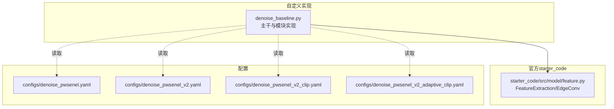
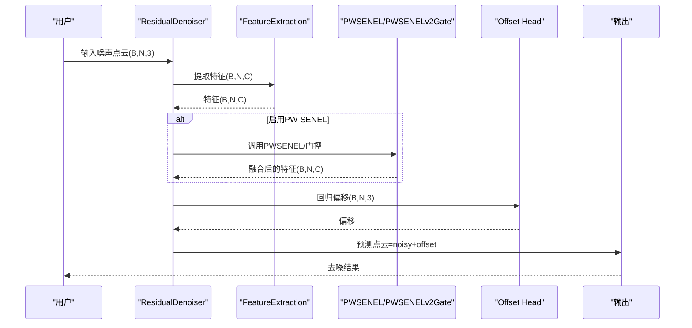
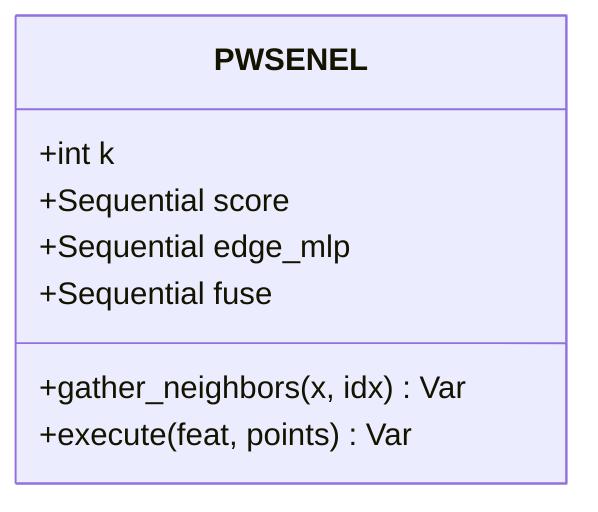
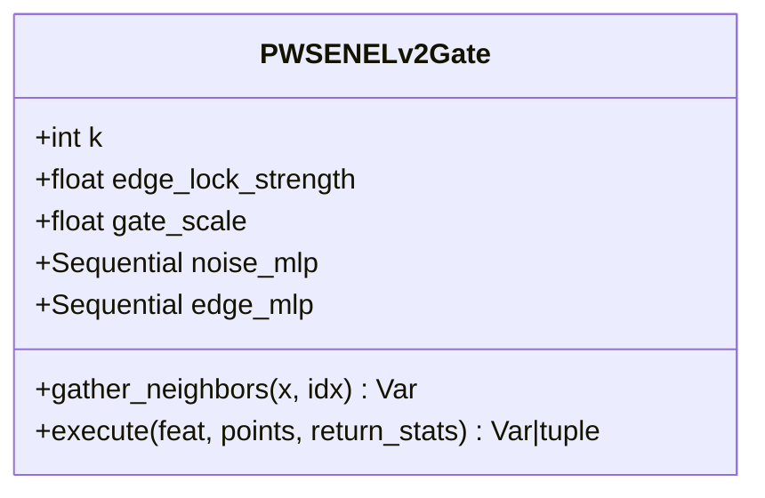
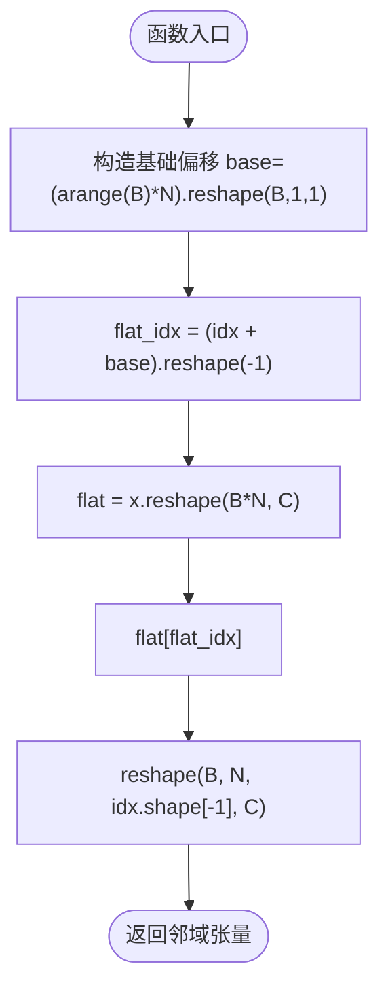
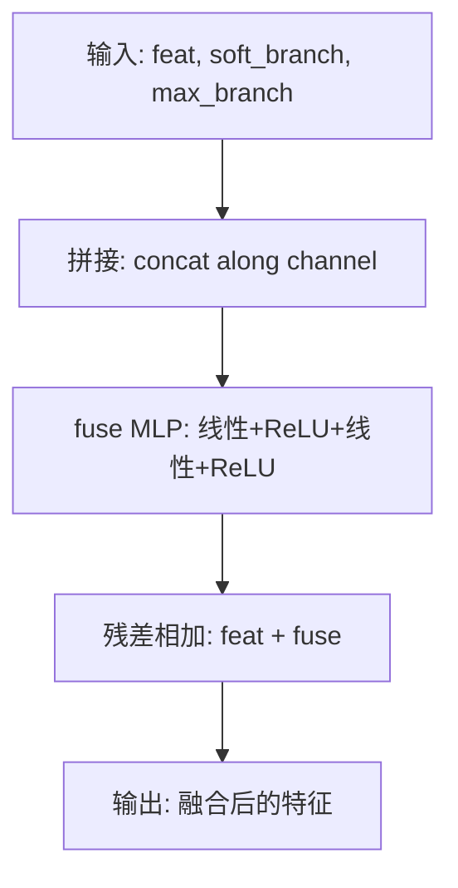
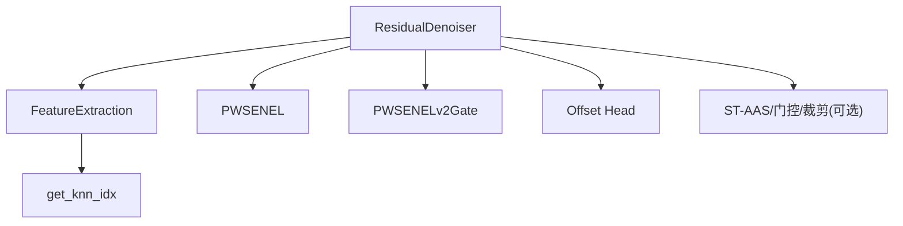

# PW-SENEL模块

<cite>
**本文档引用的文件**
- [denoise_baseline.py](file://denoise_baseline.py)
- [feature.py](file://starter_code/src/model/feature.py)
- [denoise_pwsenel.yaml](file://configs/denoise_pwsenel.yaml)
- [denoise_pwsenel_v2.yaml](file://configs/denoise_pwsenel_v2.yaml)
- [denoise_pwsenel_v2_clip.yaml](file://configs/denoise_pwsenel_v2_clip.yaml)
- [denoise_pwsenel_v2_adaptive_clip.yaml](file://configs/denoise_pwsenel_v2_adaptive_clip.yaml)
- [README.md](file://README.md)
</cite>

## 目录
1. [简介](#简介)
2. [项目结构](#项目结构)
3. [核心组件](#核心组件)
4. [架构总览](#架构总览)
5. [详细组件分析](#详细组件分析)
6. [依赖关系分析](#依赖关系分析)
7. [性能考量](#性能考量)
8. [故障排查指南](#故障排查指南)
9. [结论](#结论)
10. [附录](#附录)

## 简介
PW-SENEL（PeiWei Softmax Edge-aware Noise Elimination and Locking）是本项目中提出的一种边缘保持的点云去噪模块，其核心设计理念是将“软最大值噪声消除”与“最大池化边缘锁定”相结合：
- 软最大值分支：基于邻域置信度权重，抑制可疑的噪声响应，实现平滑去噪；
- 最大池化分支：保留高响应的局部边缘/几何线索，保护锐利结构；
- 特征融合：将原始特征、软最大值分支输出与最大池化分支输出进行融合，并与原始特征残差相加，确保可回退的消融实验。

该模块以可选方式接入主干网络，支持通过配置文件灵活启用/禁用，并可与其他模块（如ST-AAS、移动门控等）组合使用。

## 项目结构
PW-SENEL模块位于自定义基线实现中，与官方starter_code解耦，便于独立训练与消融实验。关键文件与职责如下：
- denoise_baseline.py：主训练/预测入口，包含ResidualDenoiser主干、PWSENEL/PWSENELv2Gate等模块实现，以及配置解析与训练循环。
- starter_code/src/model/feature.py：官方特征提取模块（EdgeConv风格），PW-SENEL在该特征空间上工作。
- configs/denoise_pwsenel*.yaml：PW-SENEL系列配置文件，控制是否启用PW-SENEL及其参数。

**图表来源**
- [denoise_baseline.py:519-529](file://denoise_baseline.py#L519-L529)
- [feature.py:65-139](file://starter_code/src/model/feature.py#L65-L139)
- [denoise_pwsenel.yaml:30-39](file://configs/denoise_pwsenel.yaml#L30-L39)
- [denoise_pwsenel_v2.yaml:27-40](file://configs/denoise_pwsenel_v2.yaml#L27-L40)

**章节来源**
- [README.md:52-77](file://README.md#L52-L77)
- [denoise_baseline.py:519-529](file://denoise_baseline.py#L519-L529)

## 核心组件
- PWSENEL模块：双分支结构，软最大值分支抑制噪声，最大池化分支保留边缘线索，最终与原始特征残差融合。
- PWSENELv2Gate模块：显式的噪声置信度与边缘锁定门控，按点动态调节移动幅度，保护低噪声/边缘区域。
- ResidualDenoiser主干：集成特征提取、PW-SENEL/PWSENELv2Gate、可选的ST-AAS分支与门控、残差裁剪等，统一构成端到端去噪流程。

**章节来源**
- [denoise_baseline.py:259-314](file://denoise_baseline.py#L259-L314)
- [denoise_baseline.py:317-374](file://denoise_baseline.py#L317-L374)
- [denoise_baseline.py:480-732](file://denoise_baseline.py#L480-L732)

## 架构总览
PW-SENEL在主干网络中的位置与数据流如下：
- 输入：带噪声点云（B×N×3）
- 特征提取：使用官方FeatureExtraction得到每点特征（B×N×C）
- PW-SENEL处理：在特征空间内计算邻域、构建软最大值与最大池化分支，融合后与原特征残差相加
- 偏移头：MLP回归每点偏移（B×N×3）
- 可选门控/裁剪：根据配置启用PW-SENELv2Gate、移动门控、残差裁剪等
- 输出：去噪后的点云（B×N×3）

**图表来源**
- [denoise_baseline.py:602-732](file://denoise_baseline.py#L602-L732)
- [feature.py:109-139](file://starter_code/src/model/feature.py#L109-L139)

## 详细组件分析

### PWSENEL模块（软最大值噪声消除 + 最大池化边缘锁定）
- 设计目标：在抑制噪声的同时保留局部边缘/几何细节。
- 双分支设计：
  - 软最大值分支：以邻域特征与相对坐标为输入，经score MLP计算邻域置信度，使用softmax归一化得到权重，对邻域特征加权求和，得到平滑响应。
  - 最大池化分支：以相同输入经edge MLP映射，对邻域取最大值，保留高响应的局部几何线索。
  - 特征融合：将原始特征、软最大值分支输出、最大池化分支输出拼接后经fuse MLP融合，最后与原始特征残差相加。
- 关键函数：
  - gather_neighbors：将索引idx对应的邻域特征/坐标收集为(B,N,K,C)形状，用于后续邻域运算。
  - execute：执行完整的PW-SENEL流程，包括KNN索引、邻域收集、分支计算与融合。

**图表来源**
- [denoise_baseline.py:259-314](file://denoise_baseline.py#L259-L314)

**章节来源**
- [denoise_baseline.py:259-314](file://denoise_baseline.py#L259-L314)

### PWSENELv2Gate模块（显式噪声置信度与边缘锁定门控）
- 设计目标：显式学习噪声置信度与边缘置信度，按点动态调节移动幅度，保护低噪声/边缘区域。
- 计算流程：
  - 噪声置信度：以中心点与邻域点的相对位置、距离为输入，经noise MLP计算邻域噪声分数，softmax归一化后按距离加权得到噪声置信度，再经sigmoid归一化。
  - 边缘置信度：以相同输入经edge MLP，对邻域取最大值得到边缘置信度。
  - 移动门控：move_gate = gate_scale × noise_conf × (1 - edge_lock_strength × edge_conf)，并裁剪至[0,1]。
- 关键函数：
  - gather_neighbors：邻域收集逻辑与PWSENEL一致。
  - execute：返回移动门控张量，可选择同时返回统计量（噪声置信度、边缘置信度、移动门控）。

**图表来源**
- [denoise_baseline.py:317-374](file://denoise_baseline.py#L317-L374)

**章节来源**
- [denoise_baseline.py:317-374](file://denoise_baseline.py#L317-L374)

### gather_neighbors函数工作原理
- 输入：张量x（B,N,C）与索引idx（B,N,K）
- 步骤：
  - 构造基础偏移base = (arange(B) * N).reshape(B,1,1)，用于将全局索引转换为扁平索引。
  - 将x展平为(B×N,C)，通过扁平索引flat_idx取出邻域元素，再重塑为(B,N,K,C)。
- 作用：将KNN索引映射到对应邻域特征/坐标，供后续分支计算使用。

**图表来源**
- [denoise_baseline.py:288-294](file://denoise_baseline.py#L288-L294)

**章节来源**
- [denoise_baseline.py:288-294](file://denoise_baseline.py#L288-L294)

### 特征融合过程
- 输入：原始特征feat（B,N,C）、软最大值分支输出soft_branch（B,N,C）、最大池化分支输出max_branch（B,N,C）
- 步骤：
  - 拼接：concat([feat, soft_branch, max_branch], dim=-1) 得到(B,N,3C)
  - 经fuse MLP：两层线性+ReLU，输出(B,N,C)
  - 残差相加：返回feat + fuse输出
- 作用：在保留原始语义信息的基础上，融合噪声抑制与边缘保留的结果。

**图表来源**
- [denoise_baseline.py:304-314](file://denoise_baseline.py#L304-L314)

**章节来源**
- [denoise_baseline.py:304-314](file://denoise_baseline.py#L304-L314)

### 数学公式推导
- 软最大值噪声抑制（PWSENEL分支）：
  - 邻域输入：I_{i,k} = [f_i, f_k, p_k - p_i]，其中f_i为点i特征，p_i为点i坐标，k表示邻域点。
  - 噪声分数：s_{i,k} = score(I_{i,k})
  - 权重归一化：w_{i,k} = softmax(s_{i,k})_k
  - 平滑响应：\hat{f}_i^{soft} = \sum_k w_{i,k} f_k
- 最大池化边缘保留（PWSENEL分支）：
  - 几何响应：g_{i,k} = edge\_mlp(I_{i,k})
  - 边缘响应：\hat{f}_i^{edge} = \max_k g_{i,k}
- 特征融合：
  - 融合输入：[f_i, \hat{f}_i^{soft}, \hat{f}_i^{edge}]
  - 融合输出：f_i^{new} = fuse([f_i, \hat{f}_i^{soft}, \hat{f}_i^{edge}])
  - 最终输出：f_i^{final} = f_i + f_i^{new}
- PW-SENELv2门控：
  - 噪声置信度：c_{noise,i} = sigmoid(\frac{1}{\bar{d}_i} \sum_k w_{i,k} \|p_k - p_i\|)
  - 边缘置信度：c_{edge,i} = \sigma(\max_k edge\_mlp(I_{i,k}))
  - 移动门控：g_i = s \cdot c_{noise,i} \cdot (1 - \alpha \cdot c_{edge,i})，其中s为门控缩放系数，α为边缘锁定强度

**章节来源**
- [denoise_baseline.py:296-314](file://denoise_baseline.py#L296-L314)
- [denoise_baseline.py:350-374](file://denoise_baseline.py#L350-L374)

## 依赖关系分析
- ResidualDenoiser依赖：
  - FeatureExtraction：从输入点云提取特征（B,N,C）
  - PWSENEL/PWSENELv2Gate：在特征空间内执行双分支处理
  - Offset Head：将特征映射为偏移（B,N,3）
  - 可选模块：ST-AAS、移动门控、残差裁剪等
- KNN索引依赖：
  - 使用get_knn_idx函数获取KNN索引，支持3维坐标直接调用knn或通用距离topk

**图表来源**
- [denoise_baseline.py:519-529](file://denoise_baseline.py#L519-L529)
- [feature.py:184-196](file://starter_code/src/model/feature.py#L184-L196)

**章节来源**
- [denoise_baseline.py:519-529](file://denoise_baseline.py#L519-L529)
- [feature.py:184-196](file://starter_code/src/model/feature.py#L184-L196)

## 性能考量
- 计算复杂度：
  - KNN索引：O(BN·k·log k) 或 O(BN·k·d)（d为维度）
  - PWSENEL分支：每个点计算k个邻域的MLP，整体约O(BN·k·C)
  - 软最大值分支：权重计算与加权求和，约O(BN·k)
  - 最大池化分支：对邻域取最大值，约O(BN·k·C)
  - 融合与残差：约O(BN·C)
- 内存占用：
  - 邻域收集与中间张量较多，可通过减小k或批大小缓解
  - 推理阶段可分块预测（chunked inference）降低显存压力
- 优化建议：
  - 合理设置k（默认16），在噪声密度与边缘保留之间平衡
  - 在高噪声场景下配合残差裁剪或自适应裁剪，避免过度移动
  - 使用官方profile调整batch size与num_points以适配不同硬件

[本节为一般性指导，无需特定文件来源]

## 故障排查指南
- 训练不稳定或发散：
  - 检查k是否过大导致邻域噪声干扰；尝试减小k或启用残差裁剪
  - 确认噪声置信度与边缘置信度的归一化是否合理（softmax/sigmoid）
- 推理显存不足：
  - 使用predict脚本的分块预测（chunked inference），或减小num_points
  - 关闭不必要的模块（如ST-AAS、移动门控）
- 配置未生效：
  - 确认配置文件中pwsenel/pwsenel_v2等布尔开关已正确设置
  - 检查CLI覆盖是否与配置冲突

**章节来源**
- [denoise_baseline.py:980-994](file://denoise_baseline.py#L980-L994)
- [denoise_baseline.py:1139-1169](file://denoise_baseline.py#L1139-L1169)

## 结论
PW-SENEL通过软最大值噪声抑制与最大池化边缘锁定的双分支设计，在点云去噪中实现了噪声抑制与边缘保持的平衡。其模块化设计便于与主干网络解耦，支持多种配置与组合策略。结合官方FeatureExtraction与可选门控/裁剪模块，可在不同噪声水平与硬件条件下取得稳健的去噪效果。

[本节为总结性内容，无需特定文件来源]

## 附录

### 输入输出格式
- 输入：噪声点云（B×N×3）
- 输出：去噪点云（B×N×3）
- 中间：特征（B×N×C），偏移（B×N×3）

**章节来源**
- [denoise_baseline.py:602-732](file://denoise_baseline.py#L602-L732)

### 参数配置选项
- 通用参数（来自配置文件与命令行）：
  - k：KNN邻居数量，默认16
  - feat_dim：特征维度，默认256
  - hidden：隐藏层维度，默认256
  - pwsenel：启用PW-SENEL（布尔）
  - pwsenel_v2：启用PW-SENELv2门控（布尔）
  - pwsenel_v2_edge_lock：边缘锁定强度，默认0.7
  - pwsenel_v2_gate_scale：门控缩放系数，默认0.5
  - residual_clip：固定残差裁剪阈值（>0启用）
  - adaptive_clip：启用自适应残差裁剪（布尔）
  - adaptive_clip_min/max/mid/ref_*：自适应裁剪参考参数
  - 其他：ST-AAS、移动门控、混合安全/强分支等（详见配置文件）

**章节来源**
- [denoise_pwsenel.yaml:30-39](file://configs/denoise_pwsenel.yaml#L30-L39)
- [denoise_pwsenel_v2.yaml:27-40](file://configs/denoise_pwsenel_v2.yaml#L27-L40)
- [denoise_pwsenel_v2_clip.yaml:25-40](file://configs/denoise_pwsenel_v2_clip.yaml#L25-L40)
- [denoise_pwsenel_v2_adaptive_clip.yaml:25-44](file://configs/denoise_pwsenel_v2_adaptive_clip.yaml#L25-L44)
- [denoise_baseline.py:1218-1244](file://denoise_baseline.py#L1218-L1244)

### A/B测试策略
- 启用/禁用模块：
  - 通过配置文件设置pwsenel/pwsenel_v2等布尔开关，或使用命令行参数覆盖
  - 训练与预测均通过apply_config解析配置，确保一致性
- 组合使用示例：
  - PW-SENEL + ST-AAS：在PW-SENEL之后叠加ST-AAS几何残差分支
  - PW-SENEL + 移动门控 + 残差裁剪：在PW-SENEL基础上引入按点移动门控与残差裁剪，提升鲁棒性
  - PW-SENELv2门控 + 自适应裁剪：在v2门控基础上按云尺度自适应裁剪，兼顾低/高噪声场景

**章节来源**
- [denoise_baseline.py:1090-1184](file://denoise_baseline.py#L1090-L1184)
- [denoise_baseline.py:602-732](file://denoise_baseline.py#L602-L732)