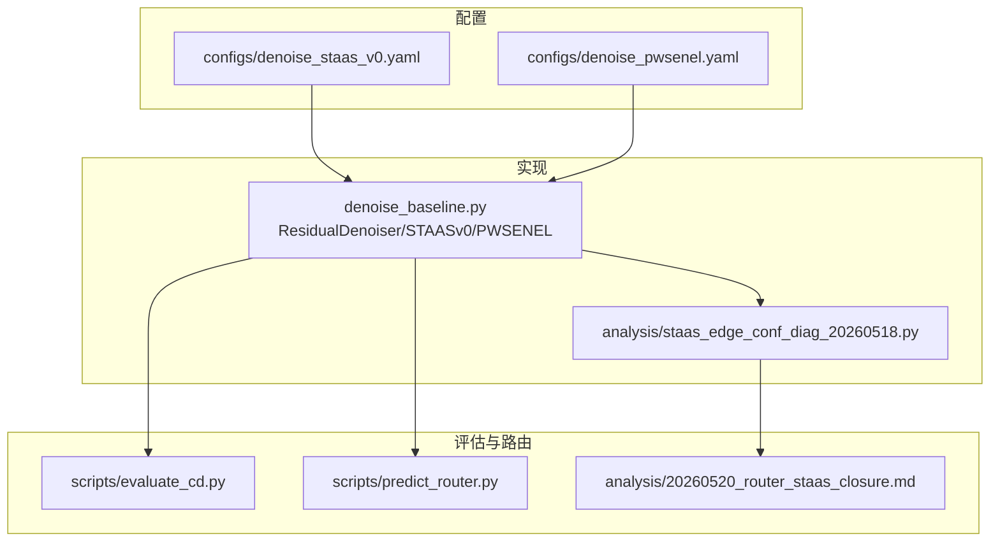
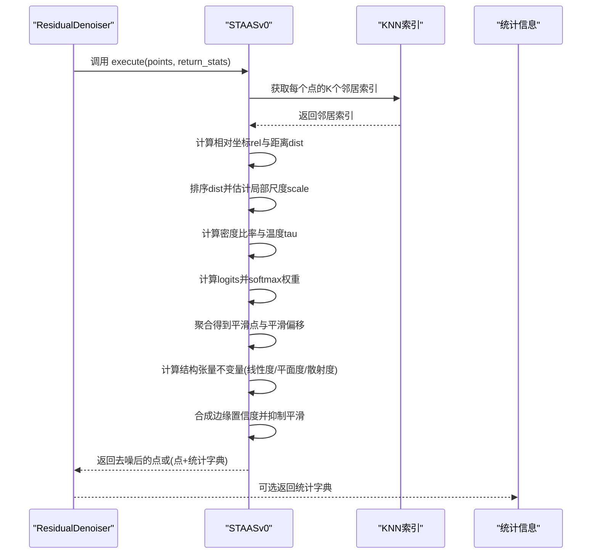
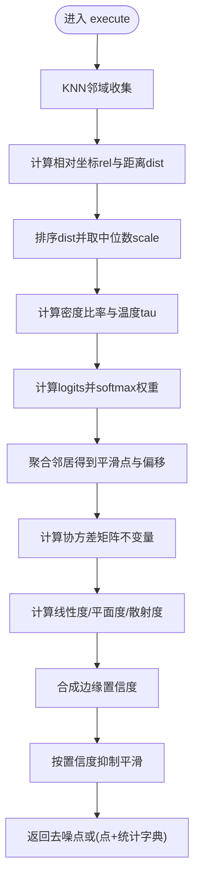
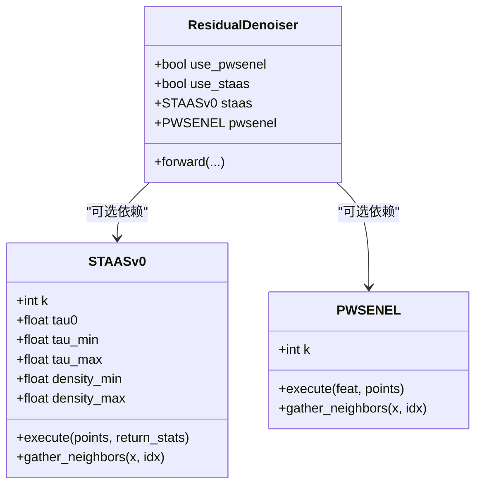

# ST-AAS模块

<cite>
**本文引用的文件**
- [denoise_baseline.py](file://denoise_baseline.py)
- [denoise_staas_v0.yaml](file://configs/denoise_staas_v0.yaml)
- [denoise_pwsenel.yaml](file://configs/denoise_pwsenel.yaml)
- [staas_edge_conf_diag_20260518.py](file://analysis/staas_edge_conf_diag_20260518.py)
- [20260520_router_staas_closure.md](file://analysis/20260520_router_staas_closure.md)
- [evaluate_cd.py](file://scripts/evaluate_cd.py)
- [predict_router.py](file://scripts/predict_router.py)
</cite>

## 目录
1. [引言](#引言)
2. [项目结构](#项目结构)
3. [核心组件](#核心组件)
4. [架构总览](#架构总览)
5. [详细组件分析](#详细组件分析)
6. [依赖关系分析](#依赖关系分析)
7. [性能考量](#性能考量)
8. [故障排查指南](#故障排查指南)
9. [结论](#结论)
10. [附录](#附录)

## 引言
本技术文档围绕ST-AAS v0（Structure Tensor-guided Adaptive Softmax）模块展开，系统阐述其设计理念、算法流程与实现细节。ST-AAS v0通过“结构张量不变量描述符 + 密度自适应softmax温度调节”的组合，实现对点云的边缘感知平滑抑制与鲁棒去噪。该模块作为可选几何算子，可与神经偏移输出残差叠加，形成安全的ablation分支，便于在不同噪声水平与拓扑复杂度下进行消融与对比。

## 项目结构
ST-AAS v0位于主模型实现文件中，并通过配置文件控制其启用与参数。相关文件分布如下：
- 模块实现与集成：denoise_baseline.py
- 参数配置：configs/denoise_staas_v0.yaml、configs/denoise_pwsenel.yaml
- 边缘置信诊断与可视化：analysis/staas_edge_conf_diag_20260518.py
- 官方评估与路由脚本（含ST-AAS参数解析）：scripts/evaluate_cd.py、scripts/predict_router.py
- ST-AAS v2相关实验结论与警示：analysis/20260520_router_staas_closure.md

图表来源
- [denoise_baseline.py:377-576](file://denoise_baseline.py#L377-L576)
- [denoise_staas_v0.yaml:1-44](file://configs/denoise_staas_v0.yaml#L1-L44)
- [denoise_pwsenel.yaml:1-44](file://configs/denoise_pwsenel.yaml#L1-L44)
- [staas_edge_conf_diag_20260518.py:1-179](file://analysis/staas_edge_conf_diag_20260518.py#L1-L179)
- [evaluate_cd.py:177-198](file://scripts/evaluate_cd.py#L177-L198)
- [predict_router.py:49-70](file://scripts/predict_router.py#L49-L70)
- [20260520_router_staas_closure.md:1-118](file://analysis/20260520_router_staas_closure.md#L1-L118)

章节来源
- [denoise_baseline.py:377-576](file://denoise_baseline.py#L377-L576)
- [denoise_staas_v0.yaml:1-44](file://configs/denoise_staas_v0.yaml#L1-L44)
- [denoise_pwsenel.yaml:1-44](file://configs/denoise_pwsenel.yaml#L1-L44)
- [staas_edge_conf_diag_20260518.py:1-179](file://analysis/staas_edge_conf_diag_20260518.py#L1-L179)
- [evaluate_cd.py:177-198](file://scripts/evaluate_cd.py#L177-L198)
- [predict_router.py:49-70](file://scripts/predict_router.py#L49-L70)
- [20260520_router_staas_closure.md:1-118](file://analysis/20260520_router_staas_closure.md#L1-L118)

## 核心组件
- STAASv0类：实现密度自适应softmax平滑与结构张量不变量描述符，提供execute方法与统计信息返回。
- ResidualDenoiser类：主模型容器，支持可选启用STAASv0、PW-SENEL等模块，并负责参数注入与前向集成。
- 配置文件：通过YAML控制是否启用ST-AAS v0及其温度参数范围与邻域大小等。

章节来源
- [denoise_baseline.py:377-576](file://denoise_baseline.py#L377-L576)
- [denoise_staas_v0.yaml:30-39](file://configs/denoise_staas_v0.yaml#L30-L39)
- [denoise_pwsenel.yaml:30-35](file://configs/denoise_pwsenel.yaml#L30-L35)

## 架构总览
ST-AAS v0作为ResidualDenoiser的一个可选分支，仅接收点坐标进行几何操作，不依赖特征通道。其核心流程包括：
- 邻域收集：基于KNN索引获取每个点的K个邻居。
- 局部尺度估计：通过排序距离的中位数估计局部尺度，进而得到密度比率与温度参数。
- 密度自适应softmax平滑：以温度参数为权重的softmax聚合邻居点，生成平滑偏移。
- 结构张量不变量描述符：计算线性度、平面度与散射度，用于边缘感知抑制。
- 边缘感知平滑抑制：根据线性度与散射度合成边缘置信度，按置信度抑制平滑强度。

图表来源
- [denoise_baseline.py:417-477](file://denoise_baseline.py#L417-L477)

章节来源
- [denoise_baseline.py:417-477](file://denoise_baseline.py#L417-L477)

## 详细组件分析

### STAASv0类与execute算法流程
- 输入：点集points形状为(B, N, 3)，邻域大小k由构造函数指定。
- 邻域收集：通过KNN索引获取每个点的K个邻居点坐标，形成相对坐标rel。
- 局部尺度估计与密度比率：
  - 计算邻居到中心点的距离，排序后取中位数作为局部尺度scale。
  - 计算scale的全局平均scale_avg，得到密度比率=clamp(scale_avg/(scale+eps), density_min, density_max)。
  - 温度参数tau=clamp(tau0/sqrt(density_ratio+eps), tau_min, tau_max)。
- 密度自适应softmax平滑：
  - logits=-||rel||^2/tau，softmax得到权重weight，按weight聚合邻居点得到平滑点smooth，平滑偏移为smooth-offset。
- 结构张量不变量描述符（无特征求解器依赖）：
  - centered=rel-mean(rel)；cov=Σ(centered^T·centered)/K。
  - 对角元素cxx/cyy/czz与非对角元素cxy/cxz/cyz。
  - trace=cxx+cyy+czz；diag_min/min(cxx,cyy,czz)；diag_max/max(cxx,cyy,czz)。
  - off_energy=cxy^2+cxz^2+cyz^2；diag_energy=cxx^4+cyy^4+czz^4。
  - 线性度linearity=off_energy/(diag_energy+off_energy)；平面度planarity=cxx*cyy+cxx*czz+cyy*czz/(trace^2)；散射度scattering=diag_min/(diag_max+eps)。
- 边缘感知平滑抑制：
  - 边缘置信edge_conf=clamp(linearity*(1-scattering), 0, 1)。
  - 最终预测pred=points+(1-edge_conf)*smooth_offset。
- 统计返回：
  - 当return_stats=True时，返回pred与包含scale、tau、linearity、planarity、scattering、edge_conf、smooth_offset的字典。

图表来源
- [denoise_baseline.py:417-477](file://denoise_baseline.py#L417-L477)

章节来源
- [denoise_baseline.py:417-477](file://denoise_baseline.py#L417-L477)

### gather_neighbors函数的邻域收集机制
- 输入：张量x形状(B, N, C)与索引idx形状(B, N, K)。
- 基于batch索引基base=(arange(B)*N)扩展为(B, N, 1)，将idx映射到扁平索引flat_idx，再按扁平索引从x.reshape(B*N, C)中取值，最后还原为(B, N, K, C)。
- 该机制确保跨batch的邻域拼接正确，避免重复拷贝与显式循环。

章节来源
- [denoise_baseline.py:409-415](file://denoise_baseline.py#L409-L415)

### 结构张量不变量描述符的数学定义与物理意义
- 线性度（linearity）：衡量邻域能量在主方向上的集中程度，近似等于最大特征值与次大特征值之差比上总能量，越接近1表示越像线状结构，应抑制平滑。
- 平面度（planarity）：衡量邻域能量在主平面内的集中程度，近似等于次大与最小特征值之差比上总能量，用于记录但不直接作为边缘判定。
- 散射度（scattering）：衡量对角能量的平衡程度，近似等于最小特征值与最大特征值之比，越接近0表示能量更均匀，不稳定区域，应抑制平滑。
- 物理意义：这些不变量无需特征分解求解器即可稳定计算，避免了CUDA环境缺失导致的训练失败问题，同时保留了对线/面/散射结构的判别能力。

章节来源
- [denoise_baseline.py:438-466](file://denoise_baseline.py#L438-L466)
- [staas_edge_conf_diag_20260518.py:53-89](file://analysis/staas_edge_conf_diag_20260518.py#L53-L89)

### 密度自适应softmax温度调节机制
- 局部尺度估计：通过排序距离的中位数scale反映局部密度；scale_avg反映全局密度。
- 密度比率：ratio=clamp(scale_avg/(scale+eps), density_min, density_max)，避免极端值影响。
- 温度参数：tau=clamp(tau0/sqrt(ratio+eps), tau_min, tau_max)，密度越高温度越低，平滑越弱；密度越低温度越高，平滑越强。
- softmax权重：logits=-||rel||^2/tau，softmax归一化后聚合邻居点，实现密度自适应的平滑。

章节来源
- [denoise_baseline.py:424-436](file://denoise_baseline.py#L424-L436)
- [denoise_staas_v0.yaml:31-39](file://configs/denoise_staas_v0.yaml#L31-L39)

### 边缘感知平滑抑制策略
- 边缘置信度：edge_conf=clamp(linearity*(1-scattering), 0, 1)，既强调线性度，又抑制散射度高的不稳定区域。
- 平滑抑制：最终偏移为(1-edge_conf)*smooth_offset，使边缘区域保留更多几何细节，减少过度平滑。

章节来源
- [denoise_baseline.py:463-466](file://denoise_baseline.py#L463-L466)

### 统计信息返回方式
- 当return_stats=True时，execute返回(pred, dict)；字典包含：
  - scale：局部尺度
  - tau：温度参数
  - linearity、planarity、scattering：结构张量不变量
  - edge_conf：边缘置信度
  - smooth_offset：平滑偏移
- 这些统计可用于后续分析与可视化，如诊断边缘置信度分布与平滑强度变化。

章节来源
- [denoise_baseline.py:467-477](file://denoise_baseline.py#L467-L477)

### 参数配置说明
- k：邻域大小，默认16。
- tau0、tau_min、tau_max：温度参数范围，控制密度自适应softmax的强度。
- density_min、density_max：密度比率裁剪范围，保证温度稳定。
- 其他相关参数：eps（数值稳定项）、staas_strength（模块强度缩放，用于融合场景）等。
- 配置文件示例：
  - ST-AAS v0：configs/denoise_staas_v0.yaml
  - PW-SENEL：configs/denoise_pwsenel.yaml

章节来源
- [denoise_staas_v0.yaml:30-39](file://configs/denoise_staas_v0.yaml#L30-L39)
- [denoise_pwsenel.yaml:30-35](file://configs/denoise_pwsenel.yaml#L30-L35)
- [denoise_baseline.py:390-407](file://denoise_baseline.py#L390-L407)

### 与PW-SENEL模块的组合使用策略
- PW-SENEL：Softmax噪声抑制 + MaxPool边缘锁定，适合在特征空间中学习邻域置信度与保留边缘。
- ST-AAS v0：直接在点坐标空间进行密度自适应平滑与边缘感知抑制，无需特征通道，训练自由。
- 组合策略建议：
  - 将PW-SENEL与ST-AAS v0作为两个独立的几何分支，分别对特征或点坐标进行处理，再在ResidualDenoiser中以残差形式融合。
  - 在高噪声场景优先启用PW-SENEL的噪声抑制，在边缘丰富场景结合ST-AAS v0的边缘感知抑制，以获得更稳健的去噪效果。
  - 通过配置文件中的开关与参数控制两者的强度与融合方式。

章节来源
- [denoise_baseline.py:259-314](file://denoise_baseline.py#L259-L314)
- [denoise_baseline.py:480-576](file://denoise_baseline.py#L480-L576)
- [denoise_pwsenel.yaml:30-35](file://configs/denoise_pwsenel.yaml#L30-L35)

### 性能对比分析与注意事项
- ST-AAS v0优势：
  - 训练自由：无需额外网络参数，直接在点坐标空间计算，部署成本低。
  - 稳定性：采用不变量描述符避免特征分解求解器依赖，减少环境差异带来的失败风险。
  - 边缘感知：通过线性度与散射度抑制不稳定区域的平滑，保留边缘细节。
- PW-SENEL优势：
  - 特征空间建模：在特征维度上学习邻域置信度，可能对复杂几何有更强的表达能力。
  - 边缘锁定：MaxPool分支保留高响应的局部边缘线索。
- 注意事项：
  - ST-AAS v2在高噪声场景存在隐藏分数下降的风险，需谨慎引入router专家分支；v0作为安全的ablation分支更适合作为主干的轻量增强。
  - 两者组合时需注意参数一致性与统计口径统一，避免重复平滑或冲突抑制。

章节来源
- [20260520_router_staas_closure.md:22-51](file://analysis/20260520_router_staas_closure.md#L22-L51)
- [denoise_baseline.py:259-314](file://denoise_baseline.py#L259-L314)
- [denoise_baseline.py:377-477](file://denoise_baseline.py#L377-L477)

## 依赖关系分析
- ResidualDenoiser根据配置决定是否实例化STAASv0，并将其输出与主头输出残差融合。
- STAASv0依赖KNN索引与Jittor张量运算，不依赖特征通道。
- 评估与路由脚本通过配置文件解析STAAS相关参数，确保评估链路一致。

图表来源
- [denoise_baseline.py:480-576](file://denoise_baseline.py#L480-L576)
- [denoise_baseline.py:259-314](file://denoise_baseline.py#L259-L314)
- [denoise_baseline.py:377-477](file://denoise_baseline.py#L377-L477)

章节来源
- [denoise_baseline.py:480-576](file://denoise_baseline.py#L480-L576)
- [denoise_baseline.py:259-314](file://denoise_baseline.py#L259-L314)
- [denoise_baseline.py:377-477](file://denoise_baseline.py#L377-L477)

## 性能考量
- 计算复杂度：主要瓶颈在于KNN邻域收集与softmax权重计算，整体复杂度约为O(B·N·K)。
- 内存占用：需要存储邻域索引、相对坐标、协方差矩阵中间结果，内存开销与K线性相关。
- 稳定性：通过eps与裁剪避免数值不稳定；温度参数范围限制防止过强或过弱的平滑。
- 环境兼容：避免特征分解求解器依赖，提升在不同CUDA环境下的稳定性。

## 故障排查指南
- 温度过高/过低：
  - 症状：平滑过度或边缘模糊。
  - 排查：检查density_min/density_max与tau_min/tau_max设置，确认密度比率与温度是否被裁剪。
- 辐射异常：
  - 症状：某些点出现异常偏移。
  - 排查：检查eps是否过大导致数值不稳定；确认KNN索引是否正确。
- 边缘抑制失效：
  - 症状：边缘区域仍然过度平滑。
  - 排查：检查linearity与scattering计算是否合理，edge_conf是否被错误放大。
- 环境缺失：
  - 症状：特征分解求解器缺失导致训练失败。
  - 解决：ST-AAS v0采用不变量描述符，无需特征分解求解器。

章节来源
- [denoise_baseline.py:424-436](file://denoise_baseline.py#L424-L436)
- [denoise_baseline.py:438-466](file://denoise_baseline.py#L438-L466)
- [denoise_staas_v0.yaml:31-39](file://configs/denoise_staas_v0.yaml#L31-L39)

## 结论
ST-AAS v0通过密度自适应softmax与结构张量不变量描述符，实现了边缘感知的平滑抑制，具备训练自由、环境兼容与边缘保留的优势。在实际应用中，建议将其作为ResidualDenoiser的轻量几何增强分支，与PW-SENEL等模块协同使用，以在不同噪声与拓扑条件下取得稳健的去噪效果。对于ST-AAS v2的router专家分支，应遵循官方结论，避免在未充分验证的情况下引入可能导致隐藏分数下降的策略。

## 附录
- 评估与路由脚本均会解析STAAS相关参数，确保评估链路与训练/推理一致。
- 边缘置信度诊断脚本提供了对ST-AAS v0统计指标的可视化与汇总分析，便于理解模块行为。

章节来源
- [evaluate_cd.py:177-198](file://scripts/evaluate_cd.py#L177-L198)
- [predict_router.py:49-70](file://scripts/predict_router.py#L49-L70)
- [staas_edge_conf_diag_20260518.py:123-179](file://analysis/staas_edge_conf_diag_20260518.py#L123-L179)