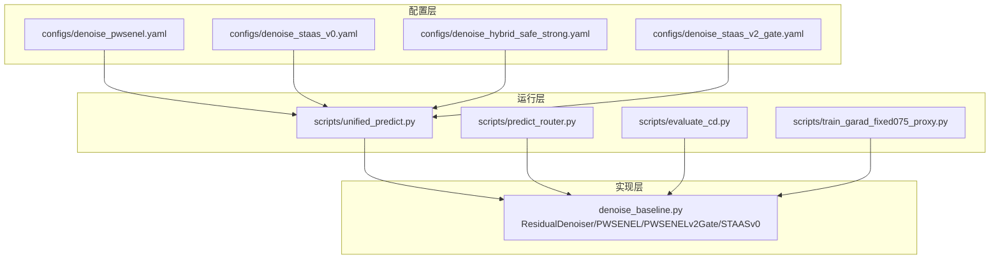
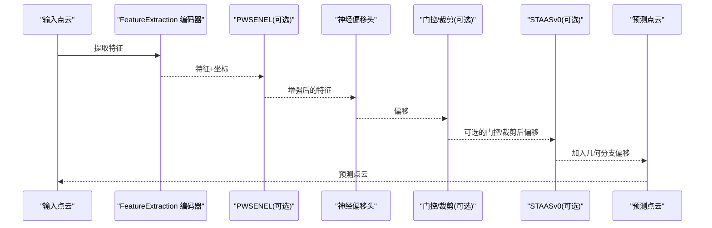
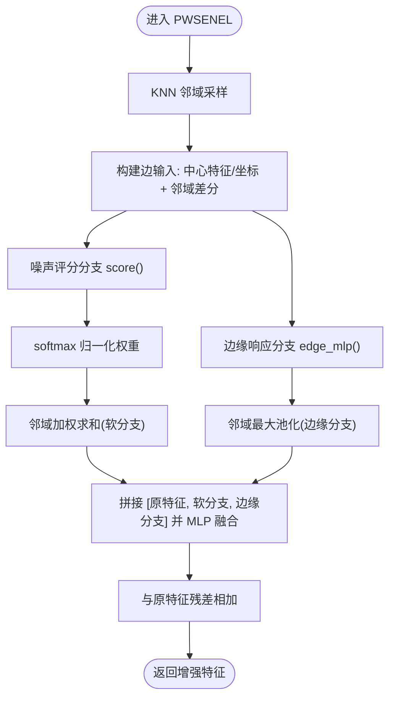
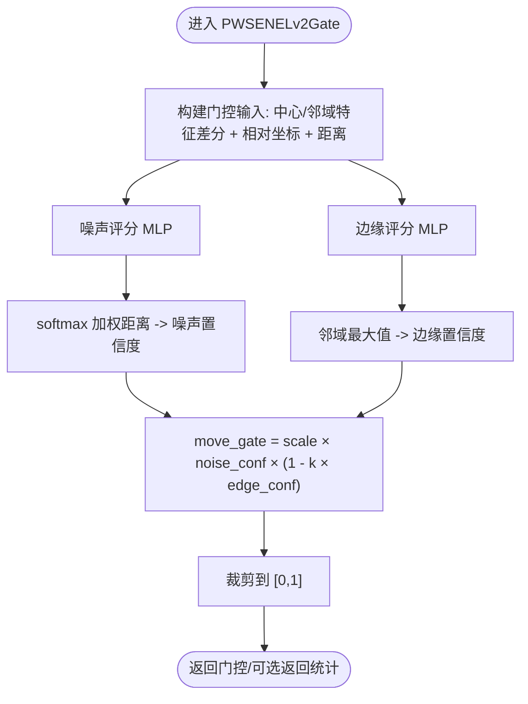
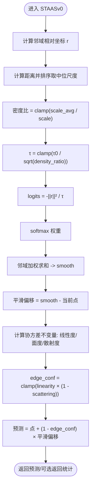
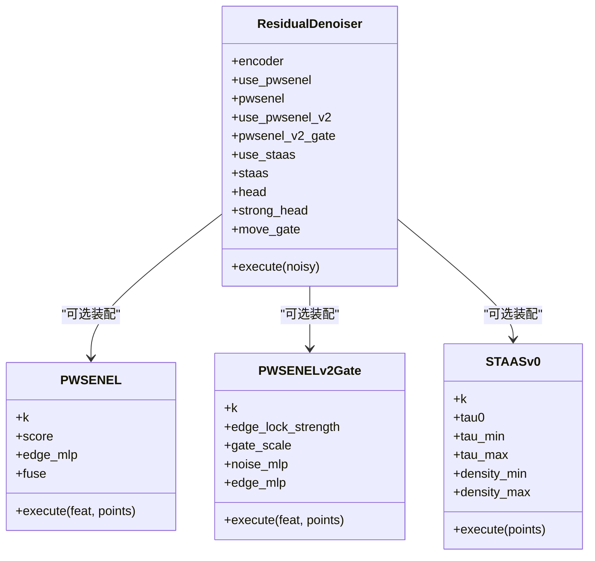

# 几何增强模块

<cite>
**本文引用的文件**
- [denoise_baseline.py](file://denoise_baseline.py)
- [denoise_pwsenel.yaml](file://configs/denoise_pwsenel.yaml)
- [denoise_pwsenel_v2.yaml](file://configs/denoise_pwsenel_v2.yaml)
- [denoise_pwsenel_v2_adaptive_clip.yaml](file://configs/denoise_pwsenel_v2_adaptive_clip.yaml)
- [denoise_staas_v0.yaml](file://configs/denoise_staas_v0.yaml)
- [denoise_staas_v2_gate.yaml](file://configs/denoise_staas_v2_gate.yaml)
- [denoise_hybrid_safe_strong.yaml](file://configs/denoise_hybrid_safe_strong.yaml)
- [unified_predict.py](file://scripts/unified_predict.py)
- [predict_router.py](file://scripts/predict_router.py)
- [evaluate_cd.py](file://scripts/evaluate_cd.py)
- [train_garad_fixed075_proxy.py](file://scripts/train_garad_fixed075_proxy.py)
- [scan_smoothing_base.py](file://scripts/scan_smoothing_base.py)
- [summarize_router_stress.py](file://scripts/summarize_router_stress.py)
</cite>

## 目录
1. [简介](#简介)
2. [项目结构](#项目结构)
3. [核心组件](#核心组件)
4. [架构总览](#架构总览)
5. [详细组件分析](#详细组件分析)
6. [依赖关系分析](#依赖关系分析)
7. [性能考量](#性能考量)
8. [故障排查指南](#故障排查指南)
9. [结论](#结论)
10. [附录](#附录)

## 简介
本文件系统性梳理 Jittor 点云去噪项目中的几何增强模块，重点围绕两大核心模块展开：
- PW-SENEL（PeiWei Softmax Edge-aware Noise Elimination and Locking）：基于软最大值噪声抑制与局部最大池化边缘锁定的特征增强模块。
- ST-AAS v0（Structure Tensor-guided Adaptive Softmax）：基于密度自适应温度的各向同性自注意力平滑与结构张量不变量引导的边缘感知抑制。

文档将从设计理念、数学公式、算法流程、参数配置、模块开关与 A/B 测试策略、模块组合与效果对比等维度进行深入解析，并提供可操作的配置与使用建议，帮助开发者快速理解并应用这些先进的几何增强技术。

## 项目结构
本项目采用“配置驱动 + 模块化实现”的组织方式：
- 配置文件位于 configs/ 目录，按功能拆分，如 denoise_pwsenel.yaml、denoise_staas_v0.yaml、denoise_hybrid_safe_strong.yaml 等。
- 核心实现集中在 denoise_baseline.py 中，定义了 ResidualDenoiser 主干网络以及 PWSENEL、PWSENELv2Gate、STAASv0 等几何增强模块。
- 推理/训练/评估脚本位于 scripts/ 目录，统一从 YAML 配置中读取模型开关与参数，确保一致性与可重复性。

图表来源
- [denoise_baseline.py:480-732](file://denoise_baseline.py#L480-L732)
- [unified_predict.py:83-119](file://scripts/unified_predict.py#L83-L119)
- [predict_router.py:49-70](file://scripts/predict_router.py#L49-L70)
- [evaluate_cd.py:177-218](file://scripts/evaluate_cd.py#L177-L218)
- [train_garad_fixed075_proxy.py:83-112](file://scripts/train_garad_fixed075_proxy.py#L83-L112)

章节来源
- [denoise_baseline.py:480-732](file://denoise_baseline.py#L480-L732)
- [unified_predict.py:83-119](file://scripts/unified_predict.py#L83-L119)
- [predict_router.py:49-70](file://scripts/predict_router.py#L49-L70)
- [evaluate_cd.py:177-218](file://scripts/evaluate_cd.py#L177-L218)
- [train_garad_fixed075_proxy.py:83-112](file://scripts/train_garad_fixed075_proxy.py#L83-L112)

## 核心组件
- ResidualDenoiser：主干残差去噪器，负责特征提取、可选的 PW-SENEL 特征增强、神经偏移头输出、可选的门控与裁剪、以及可选的 ST-AAS 几何分支。
- PWSENEL：对每点特征与坐标进行邻域聚合，分别计算软最大值噪声抑制分支与最大池化边缘锁定分支，再与原特征融合。
- PWSENELv2Gate：显式学习噪声置信度与边缘锁定，形成可乘性门控，控制神经偏移的移动幅度。
- STAASv0：基于局部尺度估计密度自适应温度，执行各向同性自注意力平滑，并利用结构张量不变量估计边缘置信度，抑制边缘区域的平滑。

章节来源
- [denoise_baseline.py:259-314](file://denoise_baseline.py#L259-L314)
- [denoise_baseline.py:317-374](file://denoise_baseline.py#L317-L374)
- [denoise_baseline.py:377-477](file://denoise_baseline.py#L377-L477)
- [denoise_baseline.py:480-732](file://denoise_baseline.py#L480-L732)

## 架构总览
下图展示了 ResidualDenoiser 的整体数据流与模块开关关系。几何增强模块以“开关+统计融合”的方式接入主干，既支持独立启用，也可组合使用。

图表来源
- [denoise_baseline.py:602-732](file://denoise_baseline.py#L602-L732)

章节来源
- [denoise_baseline.py:602-732](file://denoise_baseline.py#L602-L732)

## 详细组件分析

### PW-SENEL（Softmax Noise Elimination + MaxPool Edge Locking）
- 设计理念
  - 软最大值分支：通过邻域评分学习噪声置信度，抑制可疑噪声响应。
  - 最大池化分支：保留局部高响应的边缘/几何线索，避免过度平滑。
  - 融合策略：将原特征与两分支拼接后经 MLP 融合，最终与原特征残差相加，保证可回退的消融实验。
- 数学与算法要点
  - 邻域采样：KNN 获取中心点邻域，构造中心-邻居差分特征与坐标差分。
  - 分支评分：score 与 edge_mlp 对邻域输入进行非线性映射，得到软权重与边缘响应。
  - 软最大值聚合：权重归一化后对邻域特征加权求和，得到软分支输出。
  - 最大池化：对边缘响应在邻域维取最大，得到边缘分支输出。
  - 融合与残差：拼接三路特征，经 MLP 融合后与原特征相加。
- 关键实现位置
  - 模块类与 execute 流程：[denoise_baseline.py:259-314](file://denoise_baseline.py#L259-L314)
  - 邻域收集辅助函数：[denoise_baseline.py:288-294](file://denoise_baseline.py#L288-L294)
- 参数与配置
  - k：邻域大小，默认 16。
  - 模块开关：在 YAML 的 model.pwsenel 控制是否启用。
  - 示例配置：[denoise_pwsenel.yaml:34](file://configs/denoise_pwsenel.yaml#L34)

图表来源
- [denoise_baseline.py:296-314](file://denoise_baseline.py#L296-L314)

章节来源
- [denoise_baseline.py:259-314](file://denoise_baseline.py#L259-L314)
- [configs/denoise_pwsenel.yaml:34](file://configs/denoise_pwsenel.yaml#L34)

### PW-SENEL v2 Gate（显式噪声置信 + 边缘锁定门控）
- 设计理念
  - 将神经偏移头的移动幅度通过显式学习的门控进行调节：
    - 噪声置信度：衡量该点是否值得更强的去噪；
    - 边缘置信度：基于最大池化风格的局部几何响应，对锐利结构进行锁定。
  - 门控公式：move_gate = scale × noise_conf × (1 − edge_lock_strength × edge_conf)，并裁剪至 [0,1]。
- 数学与算法要点
  - 输入：中心特征、邻域特征差分、相对坐标与距离。
  - 噪声置信度：对距离加权的 softmax 得到噪声置信度，并归一化。
  - 边缘置信度：对边缘响应取邻域最大值并 Sigmoid 化。
  - 门控生成：按上述公式计算，并可返回中间统计量用于分析。
- 关键实现位置
  - 门控模块 execute 流程：[denoise_baseline.py:350-374](file://denoise_baseline.py#L350-L374)
  - 邻域收集辅助函数：[denoise_baseline.py:343-348](file://denoise_baseline.py#L343-L348)
- 参数与配置
  - edge_lock_strength：边缘锁定强度，默认 0.7。
  - gate_scale：门控缩放系数，默认 0.5。
  - 模块开关：model.pwsenel_v2 控制是否启用。
  - 示例配置：[denoise_pwsenel_v2.yaml:32-34](file://configs/denoise_pwsenel_v2.yaml#L32-L34)

图表来源
- [denoise_baseline.py:350-374](file://denoise_baseline.py#L350-L374)

章节来源
- [denoise_baseline.py:317-374](file://denoise_baseline.py#L317-L374)
- [configs/denoise_pwsenel_v2.yaml:32-34](file://configs/denoise_pwsenel_v2.yaml#L32-L34)

### ST-AAS v0（密度自适应温度 + 结构张量不变量）
- 设计理念
  - 使用局部尺度估计密度，动态调整 softmax 温度，实现密度自适应的平滑。
  - 利用协方差矩阵的不变量（线性度、面度、散射度）估计边缘置信度，在边缘区域抑制平滑。
  - 作为“无训练自由分支”，可直接加到神经偏移上，不引入额外可训练参数。
- 数学与算法要点
  - 局部尺度与密度比：通过排序后的中位距离估计尺度，计算密度比并限制范围，进而得到密度自适应温度 τ。
  - 自适应 softmax：logits = −||r||² / τ，softmax 得到权重，邻域加权求和得到平滑候选，平滑偏移 = smooth − 当前点。
  - 结构张量不变量：
    - 线性度：off-energy / (diag-energy + off-energy)
    - 面度：area-energy / trace²
    - 散射度：diag_min / diag_max
  - 边缘置信度：edge_conf = clamp(linearity × (1 − scattering))，最终预测 = 点 + (1 − edge_conf) × 平滑偏移。
- 关键实现位置
  - 模块类与 execute 流程：[denoise_baseline.py:377-477](file://denoise_baseline.py#L377-L477)
  - 邻域收集辅助函数：[denoise_baseline.py:409-415](file://denoise_baseline.py#L409-L415)
- 参数与配置
  - k：邻域大小，默认 16。
  - tau0/tau_min/tau_max：初始温度与上下界。
  - density_min/density_max：密度比上下界，用于稳定温度范围。
  - 模块开关：model.staas 控制是否启用。
  - 示例配置：[denoise_staas_v0.yaml:35-39](file://configs/denoise_staas_v0.yaml#L35-L39)

图表来源
- [denoise_baseline.py:417-477](file://denoise_baseline.py#L417-L477)

章节来源
- [denoise_baseline.py:377-477](file://denoise_baseline.py#L377-L477)
- [configs/denoise_staas_v0.yaml:35-39](file://configs/denoise_staas_v0.yaml#L35-L39)

### 模块开关与参数配置
- 统一读取与构建
  - 推理/评估/训练脚本均从 YAML 配置中读取 model.* 开关与参数，并显式传入 ResidualDenoiser 构造函数，避免默认值导致的隐式共享问题。
  - 关键读取位置：
    - 统一预测脚本：[unified_predict.py:83-119](file://scripts/unified_predict.py#L83-L119)
    - 预测路由脚本：[predict_router.py:49-70](file://scripts/predict_router.py#L49-L70)
    - 评估脚本：[evaluate_cd.py:177-218](file://scripts/evaluate_cd.py#L177-L218)
    - 训练代理脚本：[train_garad_fixed075_proxy.py:83-112](file://scripts/train_garad_fixed075_proxy.py#L83-L112)
- 典型配置文件
  - PW-SENEL 单独启用：[denoise_pwsenel.yaml:34](file://configs/denoise_pwsenel.yaml#L34)
  - ST-AAS v0 单独启用：[denoise_staas_v0.yaml:35-39](file://configs/denoise_staas_v0.yaml#L35-L39)
  - PW-SENEL v2 + 自适应裁剪：[denoise_pwsenel_v2_adaptive_clip.yaml:30-38](file://configs/denoise_pwsenel_v2_adaptive_clip.yaml#L30-L38)
  - ST-AAS v2 门控主线路：[denoise_staas_v2_gate.yaml:40-51](file://configs/denoise_staas_v2_gate.yaml#L40-L51)
  - 混合安全/强力策略（Hybrid Safe/Strong）：[denoise_hybrid_safe_strong.yaml:29-48](file://configs/denoise_hybrid_safe_strong.yaml#L29-L48)

章节来源
- [unified_predict.py:83-119](file://scripts/unified_predict.py#L83-L119)
- [predict_router.py:49-70](file://scripts/predict_router.py#L49-L70)
- [evaluate_cd.py:177-218](file://scripts/evaluate_cd.py#L177-L218)
- [train_garad_fixed075_proxy.py:83-112](file://scripts/train_garad_fixed075_proxy.py#L83-L112)
- [configs/denoise_pwsenel.yaml:34](file://configs/denoise_pwsenel.yaml#L34)
- [configs/denoise_staas_v0.yaml:35-39](file://configs/denoise_staas_v0.yaml#L35-L39)
- [configs/denoise_pwsenel_v2_adaptive_clip.yaml:30-38](file://configs/denoise_pwsenel_v2_adaptive_clip.yaml#L30-L38)
- [configs/denoise_staas_v2_gate.yaml:40-51](file://configs/denoise_staas_v2_gate.yaml#L40-L51)
- [configs/denoise_hybrid_safe_strong.yaml:29-48](file://configs/denoise_hybrid_safe_strong.yaml#L29-L48)

### 模块组合与效果对比
- 组合策略
  - PW-SENEL + ST-AAS v0：PW-SENEL 在特征空间抑制噪声与保留边缘，STAAS v0 在点空间进行密度自适应平滑与边缘抑制，二者互补。
  - PW-SENEL v2 + 自适应裁剪（Hybrid Safe/Strong）：PW-SENEL v2 保护低噪声/边缘区域，自适应裁剪根据全局云尺度分段控制残差幅值，兼顾稳健性与高噪声场景表现。
  - ST-AAS v2 门控：将几何统计量融合进特征，显式学习对残差与几何偏移进行门控，仅在需要去噪的区域生效。
- A/B 测试策略
  - 以配置文件为最小单元进行 A/B：分别启用/禁用某模块，固定其他超参，比较 CD 指标与可视化效果。
  - 建议对照组：
    - baseline（无几何增强）
    - pwsenel（仅 PW-SENEL）
    - staas_v0（仅 ST-AAS v0）
    - hybrid_safe_strong（PW-SENEL v2 + 自适应裁剪）
    - staas_v2_gate（ST-AAS v2 门控）
  - 可视化与统计：结合 routes.csv 与 plane_res_p75 等指标，评估路由压力与平面残差分布。
- 参考脚本
  - 路由压力汇总：[summarize_router_stress.py:13-44](file://scripts/summarize_router_stress.py#L13-L44)
  - 平滑基线扫描：[scan_smoothing_base.py:15-17](file://scripts/scan_smoothing_base.py#L15-L17)

章节来源
- [denoise_baseline.py:626-732](file://denoise_baseline.py#L626-L732)
- [configs/denoise_hybrid_safe_strong.yaml:29-48](file://configs/denoise_hybrid_safe_strong.yaml#L29-L48)
- [configs/denoise_staas_v2_gate.yaml:40-51](file://configs/denoise_staas_v2_gate.yaml#L40-L51)
- [summarize_router_stress.py:13-44](file://scripts/summarize_router_stress.py#L13-L44)
- [scan_smoothing_base.py:15-17](file://scripts/scan_smoothing_base.py#L15-L17)

## 依赖关系分析
- 模块耦合
  - ResidualDenoiser 对几何增强模块采用“可选装配”设计：PWSENEL、PWSENELv2Gate、STAASv0 皆可独立开关，且 STAASv0 的统计量可用于后续融合/门控。
  - 门控与裁剪模块（如 move_gate、adaptive_clip、noise_aware_move_gate）与神经偏移头串联，形成“偏移 → 门控/裁剪 → 几何分支”的流水线。
- 外部依赖
  - KNN 实现依赖 get_knn_idx（在实现中可见调用），用于邻域索引。
  - CUDA/库环境要求：STAASv0 明确避免使用需要外部库的特征值求解器，以提升可移植性。

图表来源
- [denoise_baseline.py:480-571](file://denoise_baseline.py#L480-L571)
- [denoise_baseline.py:259-314](file://denoise_baseline.py#L259-L314)
- [denoise_baseline.py:317-374](file://denoise_baseline.py#L317-L374)
- [denoise_baseline.py:377-477](file://denoise_baseline.py#L377-L477)

章节来源
- [denoise_baseline.py:480-571](file://denoise_baseline.py#L480-L571)

## 性能考量
- 计算复杂度
  - KNN 邻域查询与 softmax/最大池化在局部窗口内进行，整体复杂度近似 O(N·K)，K 通常为 16 或 24。
  - 密度自适应温度与结构张量不变量计算开销较小，主要瓶颈在邻域聚合与 MLP 融合。
- 内存与稳定性
  - 使用 clamp 与 eps 防止数值不稳定，合理设置密度比与温度上下界。
  - 自适应裁剪在高噪声云中逐步放宽，避免低噪声场景过拟合。
- 可移植性
  - STAASv0 避免依赖外部库的特征值求解器，降低部署门槛。

## 故障排查指南
- 配置未生效
  - 确认 YAML 中的 model.* 开关与参数正确，推理/评估/训练脚本已显式读取并传入模型构造函数。
  - 参考读取位置：
    - [unified_predict.py:83-119](file://scripts/unified_predict.py#L83-L119)
    - [predict_router.py:49-70](file://scripts/predict_router.py#L49-L70)
    - [evaluate_cd.py:177-218](file://scripts/evaluate_cd.py#L177-L218)
    - [train_garad_fixed075_proxy.py:83-112](file://scripts/train_garad_fixed075_proxy.py#L83-L112)
- 模块冲突
  - 若同时启用多个几何增强模块，注意其统计量与门控的先后顺序，优先保证 STAAS 统计量在需要时先计算并缓存。
- 路由与门控异常
  - 使用 summarize_router_stress.py 汇总 routes.csv，关注 gate 与 plane_res_p75 的分布，定位极端路由与平面残差异常。

章节来源
- [unified_predict.py:83-119](file://scripts/unified_predict.py#L83-L119)
- [predict_router.py:49-70](file://scripts/predict_router.py#L49-L70)
- [evaluate_cd.py:177-218](file://scripts/evaluate_cd.py#L177-L218)
- [train_garad_fixed075_proxy.py:83-112](file://scripts/train_garad_fixed075_proxy.py#L83-L112)
- [summarize_router_stress.py:13-44](file://scripts/summarize_router_stress.py#L13-L44)

## 结论
PW-SENEL 与 ST-AAS v0 代表两类互补的几何增强范式：前者强调特征空间的噪声抑制与边缘保留，后者强调点空间的密度自适应平滑与边缘感知抑制。通过统一的配置与模块化实现，二者可在 ResidualDenoiser 中灵活组合，配合门控与自适应裁剪，形成稳健而强大的去噪管线。建议以配置文件为单位进行 A/B 测试，结合可视化与统计指标持续迭代优化。

## 附录
- 快速启用/禁用指南
  - 启用 PW-SENEL：在 YAML 的 model.pwsenel 设为 true。
  - 启用 ST-AAS v0：在 YAML 的 model.staas 设为 true，并设置 tau0/tau_min/tau_max。
  - 启用 PW-SENEL v2 门控：在 YAML 的 model.pwsenel_v2 设为 true，并设置 edge_lock_strength 与 gate_scale。
  - 启用混合安全/强力策略：在 YAML 的 model.hybrid_safe_strong 设为 true，并配置自适应裁剪与门控参数。
- 参考配置文件
  - [denoise_pwsenel.yaml](file://configs/denoise_pwsenel.yaml)
  - [denoise_staas_v0.yaml](file://configs/denoise_staas_v0.yaml)
  - [denoise_pwsenel_v2.yaml](file://configs/denoise_pwsenel_v2.yaml)
  - [denoise_pwsenel_v2_adaptive_clip.yaml](file://configs/denoise_pwsenel_v2_adaptive_clip.yaml)
  - [denoise_staas_v2_gate.yaml](file://configs/denoise_staas_v2_gate.yaml)
  - [denoise_hybrid_safe_strong.yaml](file://configs/denoise_hybrid_safe_strong.yaml)