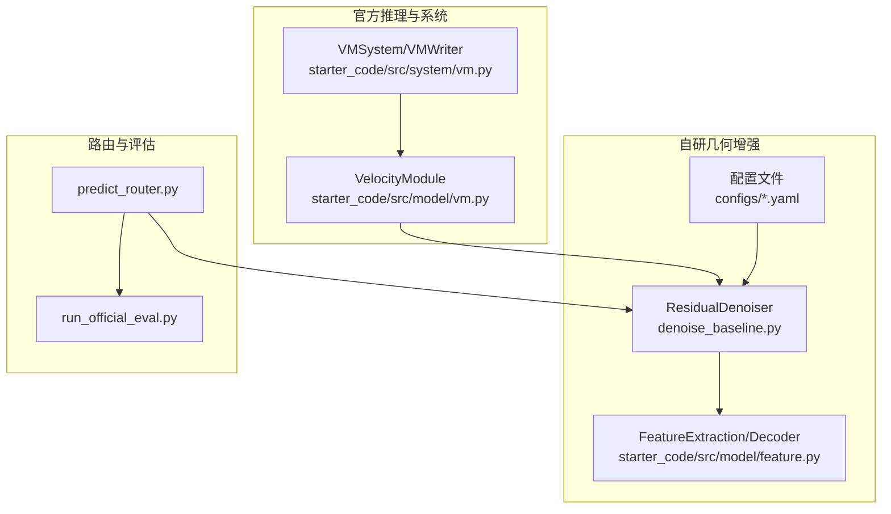
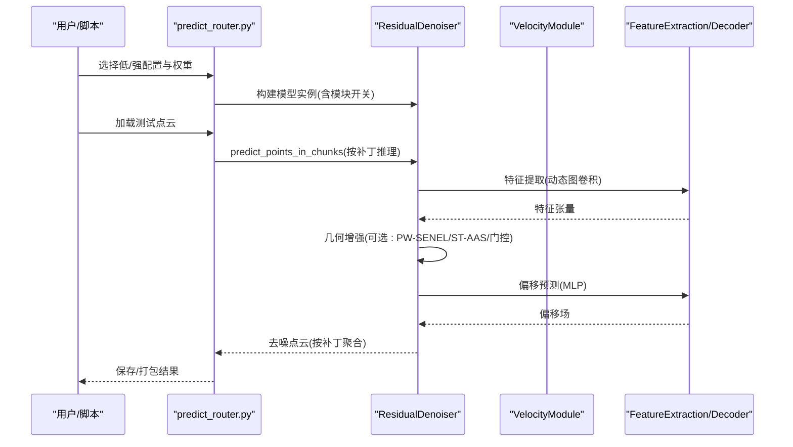
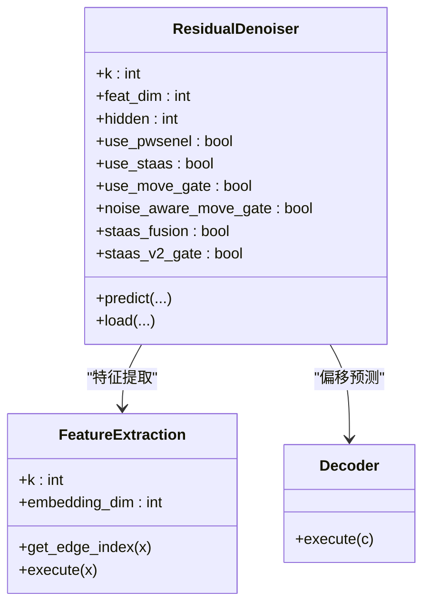
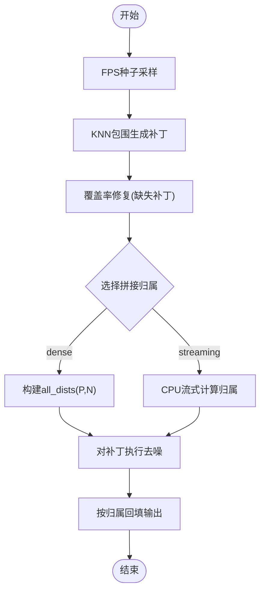
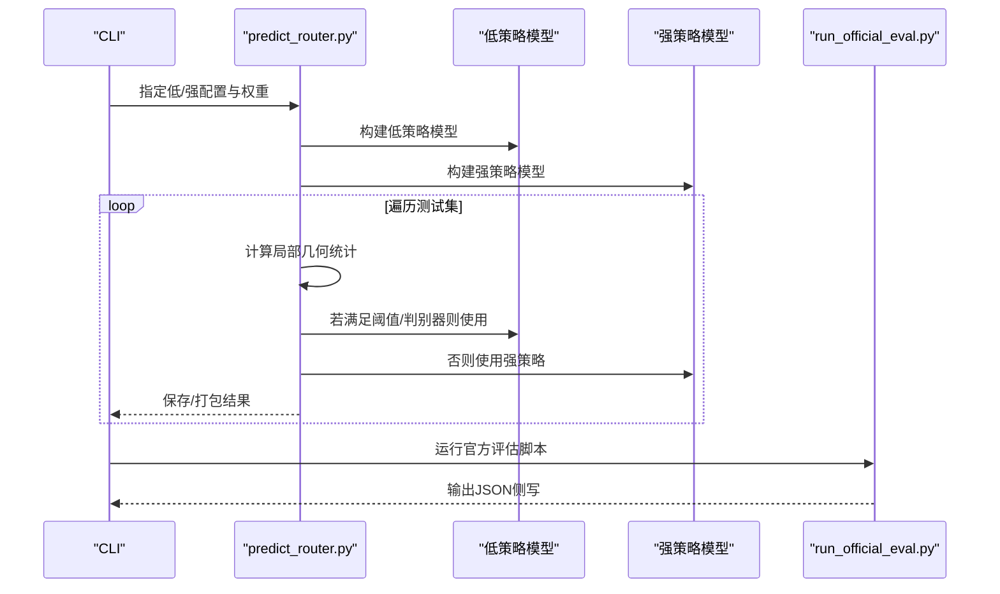
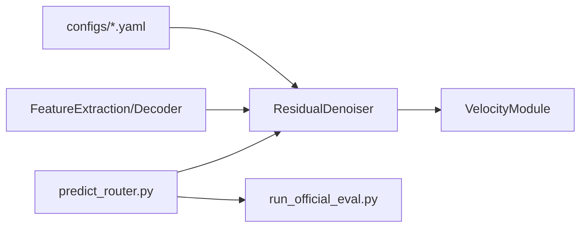

# 模块组合策略

<cite>
**本文引用的文件**
- [README.md](file://README.md)
- [denoise_baseline.py](file://denoise_baseline.py)
- [starter_code/src/model/vm.py](file://starter_code/src/model/vm.py)
- [starter_code/src/system/vm.py](file://starter_code/src/system/vm.py)
- [starter_code/src/model/feature.py](file://starter_code/src/model/feature.py)
- [starter_code/src/data/transform.py](file://starter_code/src/data/transform.py)
- [scripts/predict_router.py](file://scripts/predict_router.py)
- [scripts/run_official_eval.py](file://scripts/run_official_eval.py)
- [configs/denoise_pwsenel.yaml](file://configs/denoise_pwsenel.yaml)
- [configs/denoise_staas_v0.yaml](file://configs/denoise_staas_v0.yaml)
- [configs/denoise_staas_v1_fusion.yaml](file://configs/denoise_staas_v1_fusion.yaml)
- [configs/denoise_staas_v2_gate.yaml](file://configs/denoise_staas_v2_gate.yaml)
- [configs/denoise_move_gate.yaml](file://configs/denoise_move_gate.yaml)
- [configs/denoise_noise_aware_move_gate.yaml](file://configs/denoise_noise_aware_move_gate.yaml)
- [configs/denoise_hybrid_safe_strong.yaml](file://configs/denoise_hybrid_safe_strong.yaml)
</cite>

## 目录
1. [简介](#简介)
2. [项目结构](#项目结构)
3. [核心组件](#核心组件)
4. [架构总览](#架构总览)
5. [详细组件分析](#详细组件分析)
6. [依赖分析](#依赖分析)
7. [性能考量](#性能考量)
8. [故障排除指南](#故障排除指南)
9. [结论](#结论)
10. [附录](#附录)

## 简介
本文件围绕几何增强模块的组合使用策略，系统阐述如何将 PW-SENEL、ST-AAS 与其他门控模块（移动门控、噪声感知移动门控、融合/门控式 ST-AAS）进行有效组合，以获得最佳性能。内容涵盖模块间依赖关系与执行顺序（特征提取、几何增强、偏移预测、后处理），不同场景下的组合方案（轻量级部署、高精度要求、实时性优先），以及对计算复杂度与内存使用的影响分析。同时提供 A/B 测试框架设计思路、通过配置文件快速切换模块组合的方法，以及调试与故障排除建议。

## 项目结构
该项目采用“官方 starter_code + 自研模块”的分层组织方式：
- 官方 VM（Velocity Module）推理与拼接逻辑位于 starter_code/src/model/vm.py，配套系统层在 starter_code/src/system/vm.py。
- 几何增强模块（PW-SENEL、ST-AAS 及其变体）通过配置文件开关集成到 ResidualDenoiser 主干网络中。
- 配置文件集中于 configs/，按功能拆分为基线、PW-SENEL、ST-AAS v0/v1/v2、移动门控、噪声感知移动门控、混合强策略等。
- 推理路由脚本 scripts/predict_router.py 提供基于局部几何统计的自动路由能力，支持低/强两种策略的 A/B 切换。

图表来源
- [starter_code/src/model/vm.py:106-158](file://starter_code/src/model/vm.py#L106-L158)
- [starter_code/src/system/vm.py:34-59](file://starter_code/src/system/vm.py#L34-L59)
- [denoise_baseline.py](file://denoise_baseline.py)
- [starter_code/src/model/feature.py:65-139](file://starter_code/src/model/feature.py#L65-L139)
- [scripts/predict_router.py:49-89](file://scripts/predict_router.py#L49-L89)
- [scripts/run_official_eval.py:62-121](file://scripts/run_official_eval.py#L62-121)

章节来源
- [README.md:52-77](file://README.md#L52-L77)
- [starter_code/src/model/vm.py:18-44](file://starter_code/src/model/vm.py#L18-L44)
- [starter_code/src/system/vm.py:34-59](file://starter_code/src/system/vm.py#L34-L59)
- [starter_code/src/model/feature.py:65-139](file://starter_code/src/model/feature.py#L65-L139)
- [scripts/predict_router.py:215-329](file://scripts/predict_router.py#L215-L329)

## 核心组件
- ResidualDenoiser 主干网络：负责特征提取与偏移预测，通过配置项启用/禁用 PW-SENEL、ST-AAS、移动门控、噪声感知移动门控、融合/门控式 ST-AAS 等模块。
- FeatureExtraction/Decoder：EdgeConv 风格的动态图卷积特征提取器与 MLP 偏移头。
- VelocityModule（VM）：官方提供的点云去噪推理模块，包含补丁切分、FPS 种子采样、KNN 包围、固定拼接（dense/streaming）等实现。
- predict_router：基于局部几何统计（如平面残差分位数）的自动路由器，按阈值或更复杂的判别器选择低/强策略。
- 配置系统：configs/*.yaml 提供模块开关与超参，支持 profiles/ 覆盖机器容量相关参数。

章节来源
- [denoise_baseline.py](file://denoise_baseline.py)
- [starter_code/src/model/feature.py:65-139](file://starter_code/src/model/feature.py#L65-L139)
- [starter_code/src/model/vm.py:18-44](file://starter_code/src/model/vm.py#L18-L44)
- [scripts/predict_router.py:49-89](file://scripts/predict_router.py#L49-L89)

## 架构总览
下图展示了从输入点云到输出去噪结果的端到端流程，强调模块间的依赖与组合关系：

图表来源
- [scripts/predict_router.py:215-329](file://scripts/predict_router.py#L215-L329)
- [denoise_baseline.py](file://denoise_baseline.py)
- [starter_code/src/model/feature.py:65-139](file://starter_code/src/model/feature.py#L65-L139)
- [starter_code/src/model/vm.py:106-158](file://starter_code/src/model/vm.py#L106-L158)

## 详细组件分析

### 组件A：ResidualDenoiser 与几何增强模块
- 模块开关与参数
  - PW-SENEL：通过配置项启用，结合边缘锁定与软最大邻域噪声抑制。
  - ST-AAS：密度自适应软最大平滑 + 结构张量边缘感知抑制。
  - ST-AAS v1 融合：将结构张量/自适应统计融入神经主干，非后处理平滑。
  - ST-AAS v2 门控：融合几何统计并显式门控神经残差移动，仅在噪声尺度提示需要去噪时添加有限几何偏移。
  - 移动门控/噪声感知移动门控：学习每点偏移强度，降低低噪声样本的过度校正。
  - 混合强策略：综合多种模块与自适应裁剪，提升鲁棒性与精度。
- 执行顺序
  - 特征提取 → 几何增强（可选）→ 偏移预测 → 后处理（可选）
- 复杂度与内存
  - 动态图卷积与 KNN 查询带来 O(N·k) 的时间复杂度；补丁大小与 K 决定显存占用。
  - 门控与融合会引入额外统计与分支计算，需权衡精度与速度。

图表来源
- [denoise_baseline.py](file://denoise_baseline.py)
- [starter_code/src/model/feature.py:65-139](file://starter_code/src/model/feature.py#L65-L139)

章节来源
- [configs/denoise_pwsenel.yaml:30-40](file://configs/denoise_pwsenel.yaml#L30-L40)
- [configs/denoise_staas_v0.yaml:30-40](file://configs/denoise_staas_v0.yaml#L30-L40)
- [configs/denoise_staas_v1_fusion.yaml:30-48](file://configs/denoise_staas_v1_fusion.yaml#L30-L48)
- [configs/denoise_staas_v2_gate.yaml:34-55](file://configs/denoise_staas_v2_gate.yaml#L34-L55)
- [configs/denoise_move_gate.yaml:28-39](file://configs/denoise_move_gate.yaml#L28-L39)
- [configs/denoise_noise_aware_move_gate.yaml:25-43](file://configs/denoise_noise_aware_move_gate.yaml#L25-L43)
- [configs/denoise_hybrid_safe_strong.yaml:25-50](file://configs/denoise_hybrid_safe_strong.yaml#L25-L50)

### 组件B：VelocityModule（VM）推理与拼接
- 补丁切分与覆盖率修复：确保每个输入点至少落入一个 KNN 补丁，避免输出点数丢失。
- 固定拼接（dense）与流式拼接（streaming）：在大云场景下，streaming 以 O(N) 内存替代 P×N 存储，显著降低显存峰值。
- 拉普拉斯动力学去噪：对每个补丁执行若干步迭代，再按归属回填至原点索引。

图表来源
- [starter_code/src/model/vm.py:209-302](file://starter_code/src/model/vm.py#L209-L302)
- [starter_code/src/model/vm.py:333-414](file://starter_code/src/model/vm.py#L333-L414)

章节来源
- [starter_code/src/model/vm.py:106-158](file://starter_code/src/model/vm.py#L106-L158)
- [starter_code/src/system/vm.py:17-33](file://starter_code/src/system/vm.py#L17-L33)

### 组件C：自动路由与 A/B 测试框架
- 路由依据：对噪声点云计算局部几何统计（平面残差分位数、线性度、散射度等），阈值或判别器决定使用低/强策略。
- A/B 切换：通过命令行参数选择两套配置与权重，统一入口脚本负责加载、推理与打包。
- 评估：官方评估脚本捕获人类可读指标并输出 JSON，便于候选注册与对比。

图表来源
- [scripts/predict_router.py:215-329](file://scripts/predict_router.py#L215-L329)
- [scripts/run_official_eval.py:62-121](file://scripts/run_official_eval.py#L62-121)

章节来源
- [scripts/predict_router.py:215-329](file://scripts/predict_router.py#L215-L329)
- [scripts/run_official_eval.py:62-121](file://scripts/run_official_eval.py#L62-121)

## 依赖分析
- 组件耦合
  - ResidualDenoiser 依赖 FeatureExtraction/Decoder 进行特征与偏移预测；可通过配置灵活启用/禁用几何增强模块。
  - VM 依赖 ResidualDenoiser 进行补丁级去噪，并通过固定拼接将结果回填到原点索引。
  - predict_router 依赖 ResidualDenoiser 的通用接口，通过配置文件切换模块组合。
- 外部依赖
  - Jittor、NumPy、SciPy、YAML 等第三方库。
- 潜在循环依赖
  - 未发现直接循环导入；配置文件通过 YAML 被路由脚本加载，形成单向依赖。

图表来源
- [denoise_baseline.py](file://denoise_baseline.py)
- [starter_code/src/model/feature.py:65-139](file://starter_code/src/model/feature.py#L65-L139)
- [starter_code/src/model/vm.py:106-158](file://starter_code/src/model/vm.py#L106-L158)
- [scripts/predict_router.py:42-89](file://scripts/predict_router.py#L42-L89)
- [scripts/run_official_eval.py:62-121](file://scripts/run_official_eval.py#L62-121)

章节来源
- [README.md:52-77](file://README.md#L52-L77)
- [starter_code/src/data/transform.py:8-26](file://starter_code/src/data/transform.py#L8-L26)

## 性能考量
- 计算复杂度
  - 特征提取：O(N·k)，受 K 与层数影响；K 越大、层数越多，精度提升但耗时增加。
  - 几何增强：软最大平滑、结构张量计算、门控分支带来额外开销；v2 门控仅在必要区域施加，可降低全局成本。
  - VM 拼接：dense 路径需要 O(P·M) 存储，而 streaming 以 O(N) 内存换取稳定性，适合大云。
- 内存使用
  - 补丁大小与批处理大小直接影响显存；可通过调整 patch_size、batch_size 与 K 来平衡吞吐与显存。
  - streaming 路径显著降低峰值显存，适合大规模点云。
- 实时性
  - 低策略（如 PW-SENEL）与轻量 ST-AAS 更适合实时场景；强策略（如噪声感知移动门控、v2 门控）在精度与速度之间折中。

## 故障排除指南
- 输出点数异常
  - 症状：输出点数与输入不一致。
  - 排查：确认覆盖率修复逻辑已执行；检查补丁归属是否存在未覆盖点；验证 dense/streaming 拼接分支。
- 显存不足
  - 症状：CUDA OOM。
  - 排查：减小 patch_size、batch_size 或 K；切换 streaming 拼接；关闭高成本模块（如融合/门控）。
- 路由误判
  - 症状：在低噪声区域使用强策略导致过度校正。
  - 排查：调整阈值或判别器参数；优先使用噪声感知移动门控；在路由 CSV 中核对局部几何统计。
- 配置不生效
  - 症状：修改 configs/*.yaml 后行为不变。
  - 排查：确认路由脚本正确加载配置与 profiles；检查 deep_update 顺序；验证模型初始化参数。

章节来源
- [starter_code/src/model/vm.py:209-302](file://starter_code/src/model/vm.py#L209-L302)
- [starter_code/src/model/vm.py:333-414](file://starter_code/src/model/vm.py#L333-L414)
- [scripts/predict_router.py:215-329](file://scripts/predict_router.py#L215-L329)

## 结论
通过将 PW-SENEL、ST-AAS 与其变体与移动门控/噪声感知移动门控有机结合，并配合 VM 的补丁推理与拼接策略，可在不同场景下取得良好折中。推荐：
- 轻量级部署：PW-SENEL 或 ST-AAS v0，配合 streaming 拼接。
- 高精度要求：噪声感知移动门控或 ST-AAS v2 门控，辅以融合统计。
- 实时性优先：PW-SENEL/ST-AAS v0 + streaming，适度降低 K 与补丁大小。
A/B 测试框架通过配置文件与路由脚本即可快速切换策略，建议在候选注册中记录路由决策与评估指标，持续优化。

## 附录
- 不同场景下的模块组合建议
  - 轻量级部署：PW-SENEL 或 ST-AAS v0 + streaming VM。
  - 高精度要求：噪声感知移动门控 + ST-AAS v2 门控 + 融合统计。
  - 实时性优先：PW-SENEL/ST-AAS v0 + streaming VM + 适当降采样。
- 快速切换策略
  - 使用 predict_router 的命令行参数指定低/强配置与权重，统一入口脚本加载并执行推理。
- 调试技巧
  - 在路由 CSV 中记录局部几何统计与路由决策，定位误判样本。
  - 逐步启用模块，观察 CD/P2S 指标变化，识别瓶颈模块。
  - 使用 profiles 覆盖机器容量参数，确保不同硬件上的可重复性。