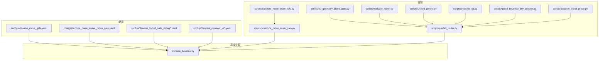
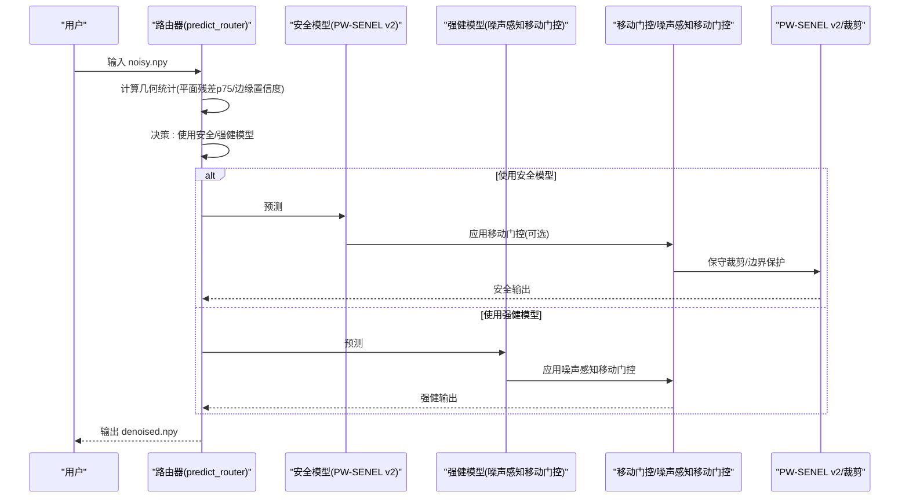
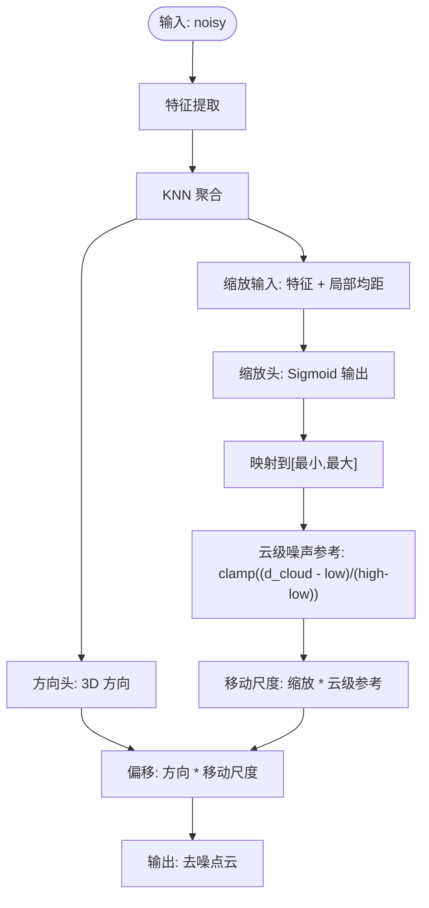
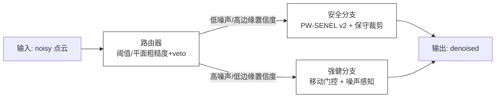
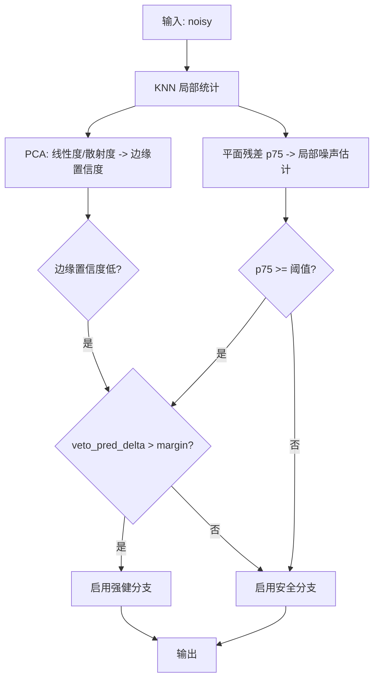
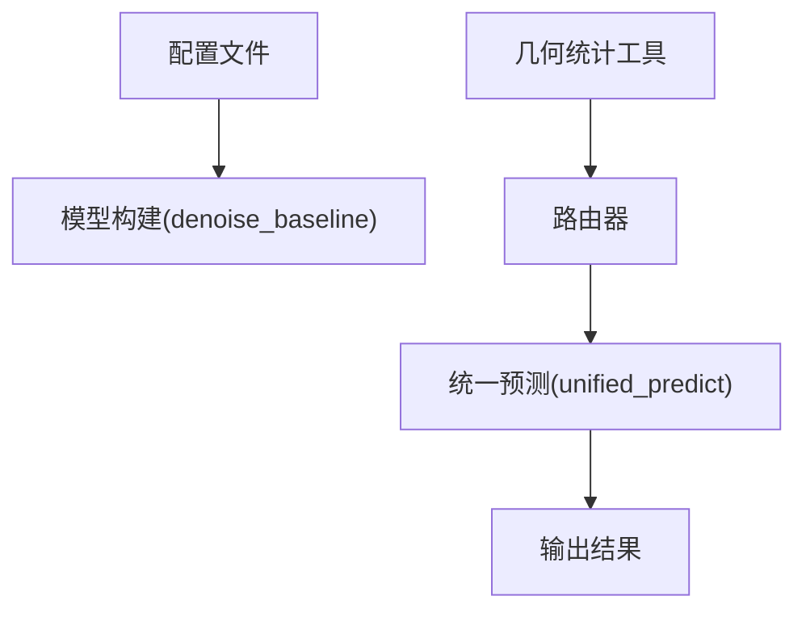

# 门控模块

<cite>
**本文引用的文件**
- [configs/denoise_move_gate.yaml](file://configs/denoise_move_gate.yaml)
- [configs/denoise_noise_aware_move_gate.yaml](file://configs/denoise_noise_aware_move_gate.yaml)
- [configs/denoise_hybrid_safe_strong.yaml](file://configs/denoise_hybrid_safe_strong.yaml)
- [configs/denoise_hybrid_safe_strong_v2.yaml](file://configs/denoise_hybrid_safe_strong_v2.yaml)
- [configs/denoise_hybrid_safe_strong_v3.yaml](file://configs/denoise_hybrid_safe_strong_v3.yaml)
- [configs/denoise_pwsenel_v2.yaml](file://configs/denoise_pwsenel_v2.yaml)
- [configs/denoise_pwsenel_v2_adaptive_clip.yaml](file://configs/denoise_pwsenel_v2_adaptive_clip.yaml)
- [scripts/prototype_move_scale_gate.py](file://scripts/prototype_move_scale_gate.py)
- [scripts/calibrate_move_scale_refs.py](file://scripts/calibrate_move_scale_refs.py)
- [scripts/p0_geometry_blend_gate.py](file://scripts/p0_geometry_blend_gate.py)
- [scripts/predict_router.py](file://scripts/predict_router.py)
- [scripts/evaluate_router.py](file://scripts/evaluate_router.py)
- [scripts/unified_predict.py](file://scripts/unified_predict.py)
- [scripts/evaluate_cd.py](file://scripts/evaluate_cd.py)
- [scripts/garad_bounded_tiny_adapter.py](file://scripts/garad_bounded_tiny_adapter.py)
- [scripts/adaptive_blend_probe.py](file://scripts/adaptive_blend_probe.py)
- [denoise_baseline.py](file://denoise_baseline.py)
</cite>

## 目录
1. [引言](#引言)
2. [项目结构](#项目结构)
3. [核心组件](#核心组件)
4. [架构总览](#架构总览)
5. [详细组件分析](#详细组件分析)
6. [依赖关系分析](#依赖关系分析)
7. [性能考量](#性能考量)
8. [故障排查指南](#故障排查指南)
9. [结论](#结论)
10. [附录](#附录)

## 引言
本文件聚焦于移动门控与混合安全强健（Hybrid Safe/Strong）门控模块，系统阐述以下目标：
- 移动门控（Move Gate）设计目的：基于局部几何特征动态调节去噪强度，抑制低噪声云中的过度校正，同时在中高噪声云中保留更强的修正能力。
- 噪声感知移动门控：通过低噪声自适应缩放，使低噪声区域自然移动更少，从而减少过度平滑。
- 混合安全强健架构：安全分支采用 PW-SENEL v2 与保守裁剪保护；强健分支保留移动门控能力以应对高噪声；路由器仅在局部噪声高且边缘置信度低时启用强健分支。
- 数学公式推导：保护阈值调度、边缘置信度计算、路由器逻辑。
- 参数配置与使用场景：结合配置文件与推理脚本，给出参数含义、调优建议与适用范围。
- A/B 测试策略与性能对比：基于合成数据与隐藏测试的评估流程，提供可复现的对比方法。

## 项目结构
本仓库围绕“点云去噪”任务构建了多套配置与脚本，涵盖基础模型、移动门控、噪声感知移动门控、PW-SENEL v2、混合安全强健以及路由器等模块。关键目录与文件如下：
- 配置文件：位于 configs/ 下，定义实验名称、路径、训练超参、模型开关与门控参数。
- 推理与评估脚本：位于 scripts/ 下，包含移动门控原型、几何统计、路由器推理、A/B 路由器评估等。
- 基线实现：denoise_baseline.py 提供模型构建、预测与参数解析入口。

图表来源
- [configs/denoise_move_gate.yaml:1-43](file://configs/denoise_move_gate.yaml#L1-L43)
- [configs/denoise_noise_aware_move_gate.yaml:1-47](file://configs/denoise_noise_aware_move_gate.yaml#L1-L47)
- [configs/denoise_hybrid_safe_strong.yaml:1-53](file://configs/denoise_hybrid_safe_strong.yaml#L1-L53)
- [configs/denoise_hybrid_safe_strong_v2.yaml:1-53](file://configs/denoise_hybrid_safe_strong_v2.yaml#L1-L53)
- [configs/denoise_hybrid_safe_strong_v3.yaml:1-53](file://configs/denoise_hybrid_safe_strong_v3.yaml#L1-L53)
- [configs/denoise_pwsenel_v2.yaml:1-45](file://configs/denoise_pwsenel_v2.yaml#L1-L45)
- [configs/denoise_pwsenel_v2_adaptive_clip.yaml:1-49](file://configs/denoise_pwsenel_v2_adaptive_clip.yaml#L1-L49)
- [scripts/prototype_move_scale_gate.py:1-157](file://scripts/prototype_move_scale_gate.py#L1-L157)
- [scripts/calibrate_move_scale_refs.py:1-105](file://scripts/calibrate_move_scale_refs.py#L1-L105)
- [scripts/p0_geometry_blend_gate.py:1-342](file://scripts/p0_geometry_blend_gate.py#L1-L342)
- [scripts/predict_router.py:1-330](file://scripts/predict_router.py#L1-L330)
- [scripts/evaluate_router.py:1-110](file://scripts/evaluate_router.py#L1-L110)
- [scripts/unified_predict.py:175-201](file://scripts/unified_predict.py#L175-L201)
- [scripts/evaluate_cd.py:121-174](file://scripts/evaluate_cd.py#L121-L174)
- [scripts/garad_bounded_tiny_adapter.py:95-119](file://scripts/garad_bounded_tiny_adapter.py#L95-L119)
- [scripts/adaptive_blend_probe.py:94-110](file://scripts/adaptive_blend_probe.py#L94-L110)
- [denoise_baseline.py:1025-1052](file://denoise_baseline.py#L1025-L1052)

章节来源
- [configs/denoise_move_gate.yaml:1-43](file://configs/denoise_move_gate.yaml#L1-L43)
- [configs/denoise_noise_aware_move_gate.yaml:1-47](file://configs/denoise_noise_aware_move_gate.yaml#L1-L47)
- [configs/denoise_hybrid_safe_strong.yaml:1-53](file://configs/denoise_hybrid_safe_strong.yaml#L1-L53)
- [configs/denoise_hybrid_safe_strong_v2.yaml:1-53](file://configs/denoise_hybrid_safe_strong_v2.yaml#L1-L53)
- [configs/denoise_hybrid_safe_strong_v3.yaml:1-53](file://configs/denoise_hybrid_safe_strong_v3.yaml#L1-L53)
- [configs/denoise_pwsenel_v2.yaml:1-45](file://configs/denoise_pwsenel_v2.yaml#L1-L45)
- [configs/denoise_pwsenel_v2_adaptive_clip.yaml:1-49](file://configs/denoise_pwsenel_v2_adaptive_clip.yaml#L1-L49)
- [scripts/prototype_move_scale_gate.py:1-157](file://scripts/prototype_move_scale_gate.py#L1-L157)
- [scripts/calibrate_move_scale_refs.py:1-105](file://scripts/calibrate_move_scale_refs.py#L1-L105)
- [scripts/p0_geometry_blend_gate.py:1-342](file://scripts/p0_geometry_blend_gate.py#L1-L342)
- [scripts/predict_router.py:1-330](file://scripts/predict_router.py#L1-L330)
- [scripts/evaluate_router.py:1-110](file://scripts/evaluate_router.py#L1-L110)
- [scripts/unified_predict.py:175-201](file://scripts/unified_predict.py#L175-L201)
- [scripts/evaluate_cd.py:121-174](file://scripts/evaluate_cd.py#L121-L174)
- [scripts/garad_bounded_tiny_adapter.py:95-119](file://scripts/garad_bounded_tiny_adapter.py#L95-L119)
- [scripts/adaptive_blend_probe.py:94-110](file://scripts/adaptive_blend_probe.py#L94-L110)
- [denoise_baseline.py:1025-1052](file://denoise_baseline.py#L1025-L1052)

## 核心组件
- 移动门控（Move Gate）
  - 目标：根据局部几何特征动态调节去噪强度，抑制低噪声云中的过度校正。
  - 关键点：方向头（per-point 3D 方向）+ 缩放头（bounded scalar），结合云级噪声参考进行低噪声自适应缩放。
- 噪声感知移动门控（Noise-Aware Move Gate）
  - 在移动门控基础上引入噪声感知，通过低/高噪声参考阈值对缩放进行门控，进一步抑制低噪声区域的过度平滑。
- 混合安全强健（Hybrid Safe/Strong）
  - 安全分支：PW-SENEL v2 + 保守裁剪保护。
  - 强健分支：保留移动门控容量，用于高噪声云。
  - 路由器：仅在局部噪声高且边缘置信度低时开启强健分支。
- 路由器（Router）
  - 基于 noisy-only 局部几何统计（如平面残差 p75、边缘置信度等）进行阈值或分类决策。
  - 支持阈值模式与“平面粗糙度 + 预测差异”联合 veto 模式。

章节来源
- [configs/denoise_move_gate.yaml:28-42](file://configs/denoise_move_gate.yaml#L28-L42)
- [configs/denoise_noise_aware_move_gate.yaml:25-46](file://configs/denoise_noise_aware_move_gate.yaml#L25-L46)
- [configs/denoise_hybrid_safe_strong.yaml:25-52](file://configs/denoise_hybrid_safe_strong.yaml#L25-L52)
- [configs/denoise_hybrid_safe_strong_v2.yaml:25-52](file://configs/denoise_hybrid_safe_strong_v2.yaml#L25-L52)
- [configs/denoise_hybrid_safe_strong_v3.yaml:25-52](file://configs/denoise_hybrid_safe_strong_v3.yaml#L25-L52)
- [scripts/predict_router.py:150-201](file://scripts/predict_router.py#L150-L201)

## 架构总览
下图展示从输入噪声点云到最终去噪输出的整体流程，重点体现移动门控与混合安全强健的集成方式及路由器的决策位置。

图表来源
- [scripts/predict_router.py:215-327](file://scripts/predict_router.py#L215-L327)
- [configs/denoise_pwsenel_v2.yaml:27-44](file://configs/denoise_pwsenel_v2.yaml#L27-L44)
- [configs/denoise_noise_aware_move_gate.yaml:25-46](file://configs/denoise_noise_aware_move_gate.yaml#L25-L46)
- [configs/denoise_move_gate.yaml:28-42](file://configs/denoise_move_gate.yaml#L28-L42)

## 详细组件分析

### 移动门控（Move Gate）设计与实现
- 设计目的
  - 动态调节每点去噪强度，依据局部几何特征（如平面残差、边缘置信度）自适应地决定移动幅度。
  - 对低噪声云抑制过度校正，对中高噪声云保留更强的修正能力。
- 实现要点
  - 方向头：学习每点的 3D 方向，作为移动方向。
  - 缩放头：输出有界标量，乘以云级噪声参考函数，形成“移动尺度”。
  - 低噪声自适应：通过云级参考阈值将缩放限制在合理区间，低噪声云自然移动更小。
- 原型验证
  - 原型脚本展示了 KNN 聚合、邻居距离统计、方向与缩放头、偏移合成与损失反传的完整流程，确保形状、KNN、有界缩放、偏移合成与优化步骤均可工作。

图表来源
- [scripts/prototype_move_scale_gate.py:24-96](file://scripts/prototype_move_scale_gate.py#L24-L96)

章节来源
- [scripts/prototype_move_scale_gate.py:1-157](file://scripts/prototype_move_scale_gate.py#L1-L157)
- [scripts/calibrate_move_scale_refs.py:1-105](file://scripts/calibrate_move_scale_refs.py#L1-L105)

### 噪声感知移动门控（Noise-Aware Move Gate）
- 在移动门控基础上增加噪声感知，通过低/高噪声参考阈值对缩放进行门控，进一步抑制低噪声区域的过度平滑。
- 关键参数
  - 低噪声门限、高噪声门限、最小门控比例等，用于在不同噪声水平下调整移动强度。
- 适用场景
  - 隐藏测试与合成数据中，需要在低噪声区域保持边缘细节，在中高噪声区域提升鲁棒性。

章节来源
- [configs/denoise_noise_aware_move_gate.yaml:25-46](file://configs/denoise_noise_aware_move_gate.yaml#L25-L46)

### 混合安全强健（Hybrid Safe/Strong）架构
- 安全分支
  - 使用 PW-SENEL v2，并结合保守裁剪（adaptive clip）保护，降低过度平滑风险。
- 强健分支
  - 保留移动门控能力，针对高噪声云进行更强的修正。
- 路由器
  - 仅在局部噪声高且边缘置信度低时启用强健分支，否则使用安全分支。
- 参数族
  - 提供 v1、v2、v3 三组配置，分别调整边缘锁定、门控缩放、自适应裁剪参考等，以探索不同折中策略。

图表来源
- [configs/denoise_hybrid_safe_strong.yaml:25-52](file://configs/denoise_hybrid_safe_strong.yaml#L25-L52)
- [configs/denoise_hybrid_safe_strong_v2.yaml:25-52](file://configs/denoise_hybrid_safe_strong_v2.yaml#L25-L52)
- [configs/denoise_hybrid_safe_strong_v3.yaml:25-52](file://configs/denoise_hybrid_safe_strong_v3.yaml#L25-L52)
- [scripts/predict_router.py:215-327](file://scripts/predict_router.py#L215-L327)

章节来源
- [configs/denoise_hybrid_safe_strong.yaml:25-52](file://configs/denoise_hybrid_safe_strong.yaml#L25-L52)
- [configs/denoise_hybrid_safe_strong_v2.yaml:25-52](file://configs/denoise_hybrid_safe_strong_v2.yaml#L25-L52)
- [configs/denoise_hybrid_safe_strong_v3.yaml:25-52](file://configs/denoise_hybrid_safe_strong_v3.yaml#L25-L52)
- [scripts/predict_router.py:215-327](file://scripts/predict_router.py#L215-L327)

### 路由器逻辑与数学公式
- 边缘置信度（Edge Confidence）
  - 基于局部 PCA 的线性度与散射度，计算每点的边缘置信度，衡量局部线/边缘结构的显著程度。
- 局部噪声估计（平面残差 p75）
  - 使用 KNN 局部协方差的最小特征根的平方根作为平面残差，统计其分位数（如 p75）作为局部噪声代理。
- 保护阈值调度
  - 通过云级参考阈值将缩放限制在合理区间，低噪声云自然移动更小，避免过度平滑。
- 路由器决策
  - 阈值模式：当平面残差 p75 超过阈值时启用强健分支。
  - 平面粗糙度 + 预测差异 veto 模式：在阈值基础上，要求预测的 delta（强健相较安全的收益预估）高于阈值，才启用强健分支。

图表来源
- [scripts/predict_router.py:150-201](file://scripts/predict_router.py#L150-L201)
- [scripts/evaluate_cd.py:121-174](file://scripts/evaluate_cd.py#L121-L174)

章节来源
- [scripts/predict_router.py:150-201](file://scripts/predict_router.py#L150-L201)
- [scripts/evaluate_cd.py:121-174](file://scripts/evaluate_cd.py#L121-L174)

### 几何混合门控（P0 v1 几何信心自适应混合）
- 设计目标
  - 在不读取 GT 的前提下，仅用 noisy-only 的几何统计对不同样本进行自适应混合，保持与固定权重方案相近的总体曝光，同时按粗糙度/边缘性重新分配 LIR 暴露。
- 统计指标
  - 平面残差分位数、边缘置信度、散射度、尺度等，用于排序与加权。
- 规则设计
  - 基于平面残差/粗糙度/边缘置信度的线性组合，生成流/低方差（LIR）权重，并进行回中与裁剪，确保平均权重接近固定值。

章节来源
- [scripts/p0_geometry_blend_gate.py:1-342](file://scripts/p0_geometry_blend_gate.py#L1-L342)

### 统一预测与软路由（Soft Gate）
- 统一预测器支持多种路由模式：强制安全、强制强健、软路由、硬路由。
- 软路由通过 Sigmoid 将统计量映射为门控系数，对安全与强健输出进行凸组合，实现平滑过渡。

章节来源
- [scripts/unified_predict.py:320-349](file://scripts/unified_predict.py#L320-L349)

## 依赖关系分析
- 配置到模型
  - 各配置文件通过 model 字段控制是否启用移动门控、噪声感知移动门控、PW-SENEL v2、自适应裁剪等。
- 推理链路
  - predict_router 加载两套配置与权重，基于几何统计进行路由，调用基线模型执行预测。
- 几何统计工具
  - 多个脚本共享相同的几何统计函数（KNN、PCA、边缘置信度、平面残差等），确保一致性。

图表来源
- [denoise_baseline.py:1025-1052](file://denoise_baseline.py#L1025-L1052)
- [scripts/predict_router.py:49-89](file://scripts/predict_router.py#L49-L89)
- [scripts/unified_predict.py:320-349](file://scripts/unified_predict.py#L320-L349)

章节来源
- [denoise_baseline.py:1025-1052](file://denoise_baseline.py#L1025-L1052)
- [scripts/predict_router.py:49-89](file://scripts/predict_router.py#L49-L89)
- [scripts/unified_predict.py:320-349](file://scripts/unified_predict.py#L320-L349)

## 性能考量
- 计算复杂度
  - KNN 查询与局部 PCA 增加计算开销，可通过采样点数与 patch size 控制。
- 内存占用
  - 大点云需分块预测，避免一次性加载导致内存不足。
- 路由器效率
  - 几何统计仅依赖 noisy-only 点云，可在推理端高效完成，适合在线路由。
- 自适应裁剪
  - 在 PW-SENEL v2 中引入自适应裁剪，有助于在不同噪声水平下稳定性能。

## 故障排查指南
- 路由器未切换
  - 检查阈值设置与 veto margin 是否过严；确认几何统计计算是否正确。
- 强健分支效果不佳
  - 检查噪声感知移动门控参数（低/高参考阈值、最小门控比例）是否合适。
- CUDA/CPU 切换问题
  - 确认 predict_router 的 CPU 标志与环境变量设置。
- 输出为空或形状不匹配
  - 检查分块大小与 patch size 设置，确保输出路径存在且权限正确。

章节来源
- [scripts/predict_router.py:215-327](file://scripts/predict_router.py#L215-L327)
- [scripts/evaluate_router.py:1-110](file://scripts/evaluate_router.py#L1-L110)

## 结论
移动门控与混合安全强健模块通过“局部几何特征 + 噪声感知”的双通道设计，实现了在低噪声区域抑制过度校正、在高噪声区域保留强健修正能力的目标。路由器以 noisy-only 的几何统计为依据，仅在必要时启用强健分支，兼顾安全性与鲁棒性。配套的配置文件与评估脚本提供了可复现的参数化探索与 A/B 对比流程，便于在不同场景下选择最优策略。

## 附录

### 参数配置与使用场景速览
- 移动门控（Move Gate）
  - 适用：需要动态调节每点去噪强度，抑制低噪声区域过度平滑。
  - 关键参数：KNN 数、特征维度、缩放范围、云级参考阈值。
- 噪声感知移动门控（Noise-Aware Move Gate）
  - 适用：隐藏测试与合成数据，强调低噪声区域细节保持。
  - 关键参数：低/高噪声参考、最小门控比例。
- 混合安全强健（Hybrid Safe/Strong）
  - 适用：高噪声场景下的鲁棒性优先；安全分支用于低噪声场景。
  - 关键参数：边缘锁定、门控缩放、自适应裁剪参考、路由器缩放因子。
- 路由器
  - 适用：在线/离线路由，阈值或 veto 模式。
  - 关键参数：阈值、veto margin、统计量（平面残差 p75、边缘置信度）。

章节来源
- [configs/denoise_move_gate.yaml:28-42](file://configs/denoise_move_gate.yaml#L28-L42)
- [configs/denoise_noise_aware_move_gate.yaml:25-46](file://configs/denoise_noise_aware_move_gate.yaml#L25-L46)
- [configs/denoise_hybrid_safe_strong.yaml:25-52](file://configs/denoise_hybrid_safe_strong.yaml#L25-L52)
- [configs/denoise_hybrid_safe_strong_v2.yaml:25-52](file://configs/denoise_hybrid_safe_strong_v2.yaml#L25-L52)
- [configs/denoise_hybrid_safe_strong_v3.yaml:25-52](file://configs/denoise_hybrid_safe_strong_v3.yaml#L25-L52)
- [scripts/predict_router.py:215-327](file://scripts/predict_router.py#L215-L327)

### A/B 测试策略与性能对比
- 数据集
  - 使用隐藏测试 noisy-only 点云，避免 GT 泄漏。
- 指标
  - CD 分数、CD 比例、强健相较安全的预测改进、每点偏移 L2 均值等。
- 方法
  - evaluate_router 基于合成 CSV 进行 oracle 与规则路由对比；predict_router 提供推理路由输出 zip。
- 建议
  - 先在合成数据上进行带噪声带的 A/B 对比，再在隐藏测试上进行稳健评估；记录路由分布与暴露均衡性。

章节来源
- [scripts/evaluate_router.py:1-110](file://scripts/evaluate_router.py#L1-L110)
- [scripts/predict_router.py:1-330](file://scripts/predict_router.py#L1-L330)
- [scripts/evaluate_cd.py:121-174](file://scripts/evaluate_cd.py#L121-L174)