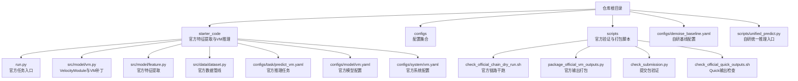
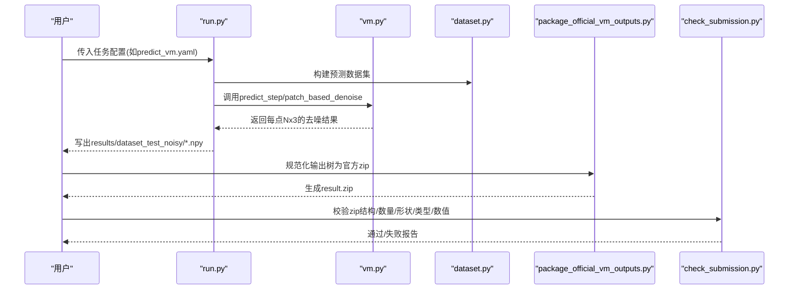
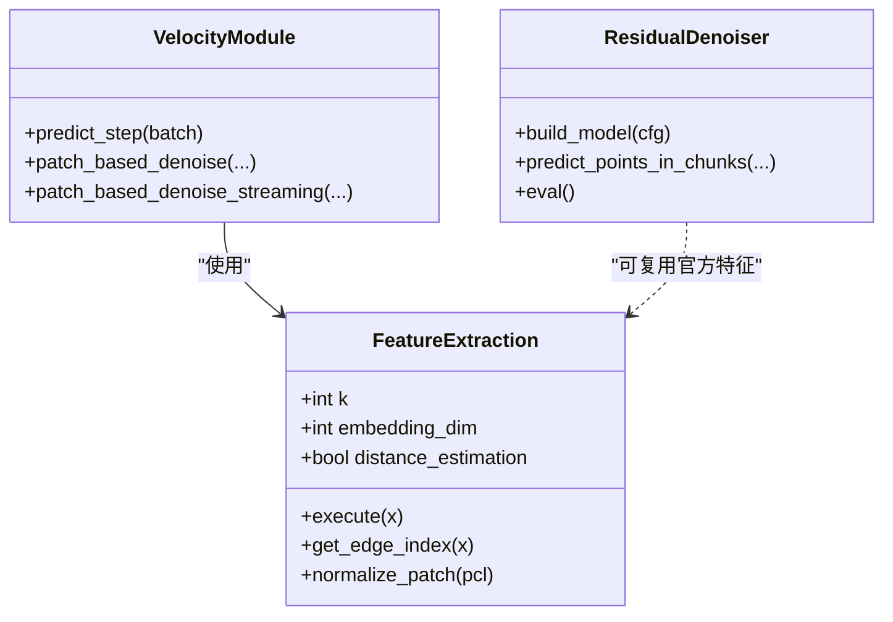
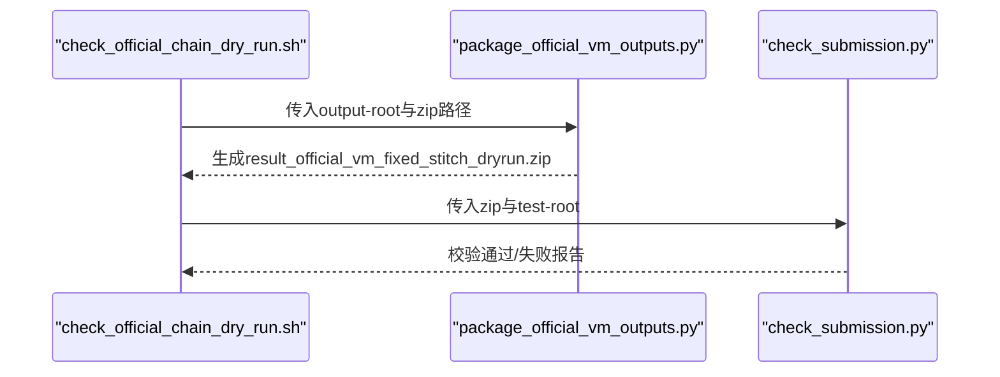
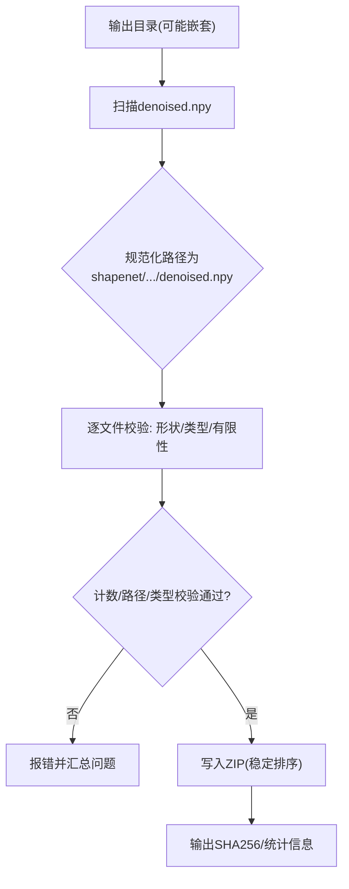
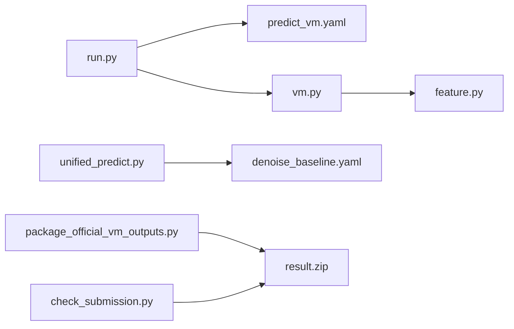

# 官方集成

<cite>
**本文引用的文件**
- [README.md](file://README.md)
- [starter_code/README.md](file://starter_code/README.md)
- [docs/OFFICIAL_VM_PATCHES.md](file://docs/OFFICIAL_VM_PATCHES.md)
- [starter_code/run.py](file://starter_code/run.py)
- [starter_code/src/model/vm.py](file://starter_code/src/model/vm.py)
- [starter_code/src/model/feature.py](file://starter_code/src/model/feature.py)
- [starter_code/src/data/dataset.py](file://starter_code/src/data/dataset.py)
- [starter_code/configs/task/predict_vm.yaml](file://starter_code/configs/task/predict_vm.yaml)
- [starter_code/configs/model/vm.yaml](file://starter_code/configs/model/vm.yaml)
- [starter_code/configs/system/vm.yaml](file://starter_code/configs/system/vm.yaml)
- [scripts/check_official_chain_dry_run.sh](file://scripts/check_official_chain_dry_run.sh)
- [scripts/package_official_vm_outputs.py](file://scripts/package_official_vm_outputs.py)
- [scripts/check_submission.py](file://scripts/check_submission.py)
- [scripts/unified_predict.py](file://scripts/unified_predict.py)
- [configs/denoise_baseline.yaml](file://configs/denoise_baseline.yaml)
- [scripts/check_official_quick_outputs.sh](file://scripts/check_official_quick_outputs.sh)
</cite>

## 目录
1. [简介](#简介)
2. [项目结构](#项目结构)
3. [核心组件](#核心组件)
4. [架构总览](#架构总览)
5. [详细组件分析](#详细组件分析)
6. [依赖关系分析](#依赖关系分析)
7. [性能考量](#性能考量)
8. [故障排除指南](#故障排除指南)
9. [结论](#结论)
10. [附录](#附录)

## 简介
本文件面向Jittor点云去噪竞赛的官方集成，目标是帮助参赛者正确集成starter_code官方特征提取模块，分离自定义竞赛代码与官方实现，应用官方VM补丁以满足竞赛要求，执行官方链路干跑检查，规范输出打包与提交文件生成，并使用官方验证工具确保输出符合标准。文档同时提供故障排除建议，帮助快速定位常见问题。

## 项目结构
本仓库采用“官方starter_code + 自研模块”的双轨结构：
- 官方路径：starter_code 提供官方特征提取与VM推理链路，包含官方补丁与严格的数据/输出格式约束。
- 自研路径：configs、scripts、denoise_baseline.py等提供可复现的基线与候选模块，与官方文件保持解耦。



图表来源
- [README.md:52-77](file://README.md#L52-L77)
- [starter_code/run.py:36-140](file://starter_code/run.py#L36-L140)
- [starter_code/src/model/vm.py:18-159](file://starter_code/src/model/vm.py#L18-L159)
- [starter_code/src/model/feature.py:65-139](file://starter_code/src/model/feature.py#L65-L139)
- [starter_code/src/data/dataset.py:47-145](file://starter_code/src/data/dataset.py#L47-L145)
- [starter_code/configs/task/predict_vm.yaml:1-14](file://starter_code/configs/task/predict_vm.yaml#L1-L14)
- [starter_code/configs/model/vm.yaml:1-6](file://starter_code/configs/model/vm.yaml#L1-L6)
- [starter_code/configs/system/vm.yaml:1-4](file://starter_code/configs/system/vm.yaml#L1-L4)
- [scripts/check_official_chain_dry_run.sh:1-60](file://scripts/check_official_chain_dry_run.sh#L1-L60)
- [scripts/package_official_vm_outputs.py:52-117](file://scripts/package_official_vm_outputs.py#L52-L117)
- [scripts/check_submission.py:68-156](file://scripts/check_submission.py#L68-L156)
- [scripts/check_official_quick_outputs.sh:1-16](file://scripts/check_official_quick_outputs.sh#L1-L16)
- [scripts/unified_predict.py:412-606](file://scripts/unified_predict.py#L412-L606)
- [configs/denoise_baseline.yaml:1-44](file://configs/denoise_baseline.yaml#L1-L44)

章节来源
- [README.md:52-106](file://README.md#L52-L106)
- [starter_code/README.md:1-67](file://starter_code/README.md#L1-L67)

## 核心组件
- 官方VM推理与补丁
  - VelocityModule与patch_based_denoise：实现官方VM推理、补丁修复与流式拼接。
  - 官方特征提取：EdgeConv/DynamicEdgeConv + FeatureExtraction。
- 官方任务入口
  - run.py：解析任务配置、构建数据/模型/系统，支持train/predict/debug。
- 官方输出打包与验证
  - package_official_vm_outputs.py：将非正式输出树规范化为官方提交zip。
  - check_submission.py：本地校验zip结构、数量、形状、类型与数值有效性。
  - check_official_chain_dry_run.sh：官方链路干跑，验证“已有输出树 -> 正式zip -> 提交检查”。
- 自研统一推理入口
  - scripts/unified_predict.py：自研候选统一入口，支持路由、轻量迭代精炼等模式，最终生成官方提交zip。

章节来源
- [starter_code/src/model/vm.py:18-159](file://starter_code/src/model/vm.py#L18-L159)
- [starter_code/src/model/feature.py:65-139](file://starter_code/src/model/feature.py#L65-L139)
- [starter_code/run.py:36-140](file://starter_code/run.py#L36-L140)
- [scripts/package_official_vm_outputs.py:52-117](file://scripts/package_official_vm_outputs.py#L52-L117)
- [scripts/check_submission.py:68-156](file://scripts/check_submission.py#L68-L156)
- [scripts/check_official_chain_dry_run.sh:1-60](file://scripts/check_official_chain_dry_run.sh#L1-L60)
- [scripts/unified_predict.py:412-606](file://scripts/unified_predict.py#L412-L606)

## 架构总览
官方集成遵循“官方特征提取 + VM补丁 + 规范化输出”的闭环：
- 输入：官方测试集dataset_test_noisy（含shapenet子树）。
- 官方推理：run.py + predict_vm.yaml + vm.py（含补丁）。
- 输出：results/dataset_test_noisy下的denoised.npy（Nx3，float32）。
- 打包：package_official_vm_outputs.py或unified_predict.py生成官方zip。
- 验证：check_submission.py进行结构/数量/形状/类型/数值校验。



图表来源
- [starter_code/run.py:106-139](file://starter_code/run.py#L106-L139)
- [starter_code/src/model/vm.py:109-159](file://starter_code/src/model/vm.py#L109-L159)
- [starter_code/src/data/dataset.py:129-145](file://starter_code/src/data/dataset.py#L129-L145)
- [scripts/package_official_vm_outputs.py:52-117](file://scripts/package_official_vm_outputs.py#L52-L117)
- [scripts/check_submission.py:68-156](file://scripts/check_submission.py#L68-L156)

## 详细组件分析

### 官方VM补丁支持机制
官方VM补丁分为三类，均在vm.py中实现并受配置/环境变量控制：
- 固定拼接覆盖修复：确保输出点数与输入一致，修复“未覆盖点静默丢点”问题。
- 流式固定拼接分配：针对大云避免dense all_dists内存悬崖，O(N)存储替代P×N矩阵。
- 距离/幅度门控：可选的实验性StraightPCF风格分支，默认关闭。

```mermaid
flowchart TD
Start(["开始: predict_step"]) --> Mode["读取VM_STITCHING/VM_STREAMING_MIN_POINTS"]
Mode --> Choice{"选择拼接实现"}
Choice --> |自动/强制流式| Stream["patch_based_denoise_streaming"]
Choice --> |稠密(小云)| Dense["patch_based_denoise"]
Stream --> Cover["覆盖修复: 未覆盖点添加KNN种子"]
Dense --> Cover
Cover --> Assign["_streaming_best_assignment 或 argmax(-all_dists)"]
Assign --> Denoise["分块Langevin去噪"]
Denoise --> Stitch["逐点回填/拼接"]
Stitch --> Assert["断言输出点数==输入点数"]
Assert --> End(["结束"])
```

图表来源
- [starter_code/src/model/vm.py:109-159](file://starter_code/src/model/vm.py#L109-L159)
- [starter_code/src/model/vm.py:209-302](file://starter_code/src/model/vm.py#L209-L302)
- [starter_code/src/model/vm.py:333-414](file://starter_code/src/model/vm.py#L333-L414)

章节来源
- [docs/OFFICIAL_VM_PATCHES.md:10-118](file://docs/OFFICIAL_VM_PATCHES.md#L10-L118)
- [starter_code/src/model/vm.py:109-159](file://starter_code/src/model/vm.py#L109-L159)

### 官方特征提取模块与自定义竞赛代码分离策略
- 官方特征提取：starter_code/src/model/feature.py中的FeatureExtraction与EdgeConv/DynamicEdgeConv，作为官方几何特征提取模块，保持与自研模块的接口一致性。
- 自定义竞赛代码：configs/denoise_baseline.yaml及scripts/unified_predict.py中的ResidualDenoiser等，与官方文件解耦，仅共享数据格式与输出规范。
- 配置隔离：官方任务通过predict_vm.yaml指定官方model/system/data/transform，自研候选通过configs/denoise_*配置自研模块。



图表来源
- [starter_code/src/model/feature.py:65-139](file://starter_code/src/model/feature.py#L65-L139)
- [starter_code/src/model/vm.py:18-159](file://starter_code/src/model/vm.py#L18-L159)
- [scripts/unified_predict.py:83-119](file://scripts/unified_predict.py#L83-L119)

章节来源
- [README.md:22-22](file://README.md#L22-L22)
- [starter_code/src/model/feature.py:65-139](file://starter_code/src/model/feature.py#L65-L139)
- [configs/denoise_baseline.yaml:30-44](file://configs/denoise_baseline.yaml#L30-L44)

### 官方链路干跑检查方法
官方链路干跑仅验证“已有输出树 -> 正式zip -> 提交检查”，不重新运行VM推理，适合提交前快速确认打包逻辑无漂移。



图表来源
- [scripts/check_official_chain_dry_run.sh:42-59](file://scripts/check_official_chain_dry_run.sh#L42-L59)
- [scripts/package_official_vm_outputs.py:52-117](file://scripts/package_official_vm_outputs.py#L52-L117)
- [scripts/check_submission.py:68-156](file://scripts/check_submission.py#L68-L156)

章节来源
- [scripts/check_official_chain_dry_run.sh:1-60](file://scripts/check_official_chain_dry_run.sh#L1-L60)

### 输出打包流程与提交文件生成
- 官方输出打包：package_official_vm_outputs.py将任意嵌套的shapenet/.../denoised.npy规范化为官方zip条目，支持计数校验与float32要求。
- 自研统一入口：scripts/unified_predict.py在预测后直接生成官方zip，路径为shapenet/<synset>/<model>/denoised.npy。
- 提交验证：check_submission.py对zip结构、数量、形状、dtype与有限性进行严格校验，可选与test_root比对条目。



图表来源
- [scripts/package_official_vm_outputs.py:66-112](file://scripts/package_official_vm_outputs.py#L66-L112)
- [scripts/check_submission.py:68-156](file://scripts/check_submission.py#L68-L156)
- [scripts/unified_predict.py:140-152](file://scripts/unified_predict.py#L140-L152)

章节来源
- [scripts/package_official_vm_outputs.py:52-117](file://scripts/package_official_vm_outputs.py#L52-L117)
- [scripts/check_submission.py:68-156](file://scripts/check_submission.py#L68-L156)
- [scripts/unified_predict.py:140-152](file://scripts/unified_predict.py#L140-L152)

### 官方验证工具使用方法
- check_submission.py
  - 参数要点：zip路径、config/profile、test_root、期望数量与形状、是否要求float32。
  - 校验内容：zip存在性、条目数量、路径结构、形状、dtype、有限性；可选与test_root比对。
- check_official_quick_outputs.sh
  - 仅调用starter_code/check_quick_outputs.py，不训练/预测，用于确认Quick输出结构。

章节来源
- [scripts/check_submission.py:158-188](file://scripts/check_submission.py#L158-L188)
- [scripts/check_official_quick_outputs.sh:1-16](file://scripts/check_official_quick_outputs.sh#L1-L16)

## 依赖关系分析
- 组件耦合
  - run.py依赖于configs/task/predict_vm.yaml中的components，进而加载官方model/system/data/transform。
  - vm.py依赖feature.py的FeatureExtraction，实现官方特征提取与补丁逻辑。
  - unified_predict.py与configs/denoise_baseline.yaml共同构成自研候选路径，与官方文件解耦。
- 外部依赖
  - Jittor、NumPy、PyYAML、zipfile等；打包与验证脚本仅依赖Python标准库与NumPy。



图表来源
- [starter_code/run.py:53-127](file://starter_code/run.py#L53-L127)
- [starter_code/configs/task/predict_vm.yaml:5-9](file://starter_code/configs/task/predict_vm.yaml#L5-L9)
- [starter_code/src/model/vm.py:18-44](file://starter_code/src/model/vm.py#L18-L44)
- [starter_code/src/model/feature.py:65-139](file://starter_code/src/model/feature.py#L65-L139)
- [scripts/unified_predict.py:472-478](file://scripts/unified_predict.py#L472-L478)
- [configs/denoise_baseline.yaml:8-14](file://configs/denoise_baseline.yaml#L8-L14)
- [scripts/package_official_vm_outputs.py:102-112](file://scripts/package_official_vm_outputs.py#L102-L112)
- [scripts/check_submission.py:181-187](file://scripts/check_submission.py#L181-L187)

章节来源
- [starter_code/run.py:53-127](file://starter_code/run.py#L53-L127)
- [starter_code/src/model/vm.py:18-44](file://starter_code/src/model/vm.py#L18-L44)
- [scripts/unified_predict.py:472-478](file://scripts/unified_predict.py#L472-L478)

## 性能考量
- 流式拼接分配：当点数≥VM_STREAMING_MIN_POINTS或显式设置VM_STITCHING=streaming时，使用patch_based_denoise_streaming，避免dense all_dists内存峰值，适合大云场景。
- 分块去噪：patch_step根据seed_k与seed_k_alpha动态计算，平衡吞吐与显存占用。
- 并行与编译：干跑脚本设置DISABLE_MULTIPROCESSING与cc_path，减少本机环境抖动。

章节来源
- [starter_code/src/model/vm.py:114-139](file://starter_code/src/model/vm.py#L114-L139)
- [starter_code/src/model/vm.py:333-414](file://starter_code/src/model/vm.py#L333-L414)
- [scripts/check_official_chain_dry_run.sh:39-40](file://scripts/check_official_chain_dry_run.sh#L39-L40)

## 故障排除指南
- “输出点数不匹配”
  - 症状：提交包校验失败，提示输出点数与输入不一致。
  - 处理：确认使用了官方补丁（覆盖修复），确保断言assert pcl_out.shape[0] == N通过。
- “内存不足/卡顿”
  - 症状：大云推理出现内存峰值或超时。
  - 处理：设置VM_STITCHING=streaming或增大VM_STREAMING_MIN_POINTS阈值，启用流式拼接。
- “zip结构错误/条目缺失”
  - 症状：check_submission.py报告路径结构错误、条目数量不匹配或重复。
  - 处理：使用package_official_vm_outputs.py或unified_predict.py重新打包，确保仅包含shapenet/<synset>/<model>/denoised.npy。
- “dtype非float32或包含NaN/Inf”
  - 症状：校验失败提示dtype或数值异常。
  - 处理：确保保存为np.float32，且无NaN/Inf；必要时在打包前进行数值清洗。
- “Quick输出结构异常”
  - 症状：本地Quick检查失败。
  - 处理：运行scripts/check_official_quick_outputs.sh，核对嵌套路径与条目结构。

章节来源
- [starter_code/src/model/vm.py:231-250](file://starter_code/src/model/vm.py#L231-L250)
- [starter_code/src/model/vm.py:304-331](file://starter_code/src/model/vm.py#L304-L331)
- [scripts/package_official_vm_outputs.py:77-89](file://scripts/package_official_vm_outputs.py#L77-L89)
- [scripts/check_submission.py:116-127](file://scripts/check_submission.py#L116-L127)
- [scripts/check_official_quick_outputs.sh:1-16](file://scripts/check_official_quick_outputs.sh#L1-L16)

## 结论
通过将官方特征提取模块与VM补丁严格集成至starter_code，并以unified_predict.py作为自研候选的统一入口，可在保证输出格式与提交规范的同时，最大化发挥自研模块的创新潜力。官方链路干跑与提交验证工具提供了可靠的自动化质量门禁，有助于在提交前及时发现并修复问题。

## 附录
- 官方任务入口与配置
  - 任务入口：starter_code/run.py
  - 官方推理任务：starter_code/configs/task/predict_vm.yaml
  - 官方模型配置：starter_code/configs/model/vm.yaml
  - 官方系统配置：starter_code/configs/system/vm.yaml
- 自研候选配置
  - 基线配置：configs/denoise_baseline.yaml
  - 统一推理入口：scripts/unified_predict.py
- 输出打包与验证
  - 官方打包：scripts/package_official_vm_outputs.py
  - 提交验证：scripts/check_submission.py
  - 官方链路干跑：scripts/check_official_chain_dry_run.sh
  - Quick输出检查：scripts/check_official_quick_outputs.sh

章节来源
- [starter_code/run.py:36-140](file://starter_code/run.py#L36-L140)
- [starter_code/configs/task/predict_vm.yaml:1-14](file://starter_code/configs/task/predict_vm.yaml#L1-L14)
- [starter_code/configs/model/vm.yaml:1-6](file://starter_code/configs/model/vm.yaml#L1-L6)
- [starter_code/configs/system/vm.yaml:1-4](file://starter_code/configs/system/vm.yaml#L1-L4)
- [configs/denoise_baseline.yaml:1-44](file://configs/denoise_baseline.yaml#L1-L44)
- [scripts/unified_predict.py:412-606](file://scripts/unified_predict.py#L412-L606)
- [scripts/package_official_vm_outputs.py:52-117](file://scripts/package_official_vm_outputs.py#L52-L117)
- [scripts/check_submission.py:68-156](file://scripts/check_submission.py#L68-L156)
- [scripts/check_official_chain_dry_run.sh:1-60](file://scripts/check_official_chain_dry_run.sh#L1-L60)
- [scripts/check_official_quick_outputs.sh:1-16](file://scripts/check_official_quick_outputs.sh#L1-L16)