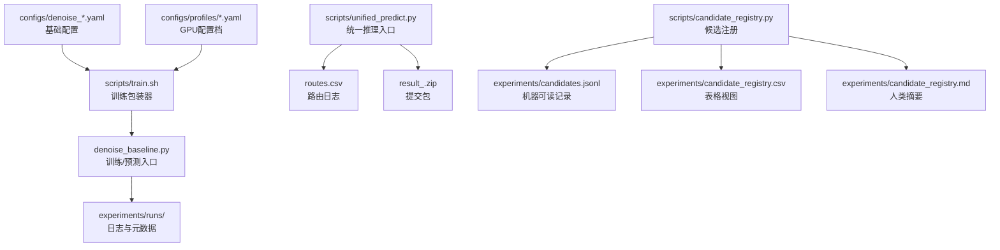
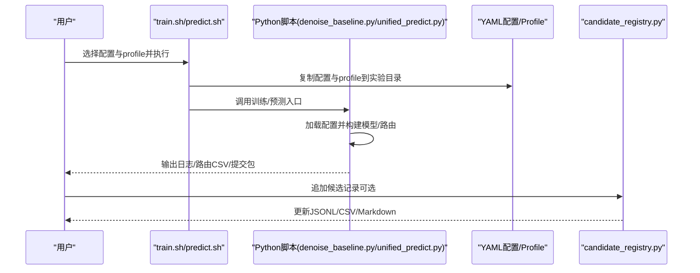
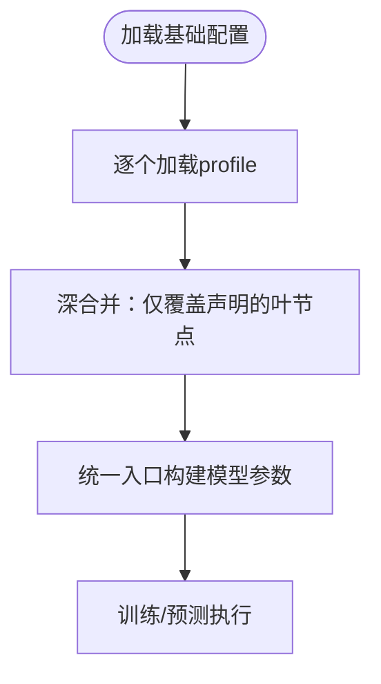
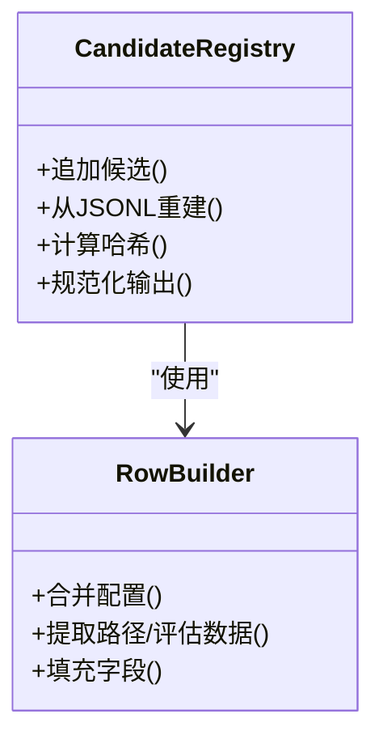
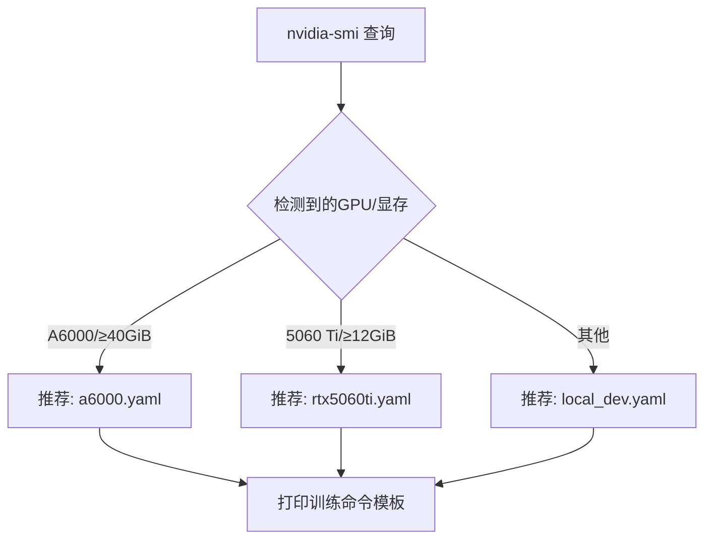
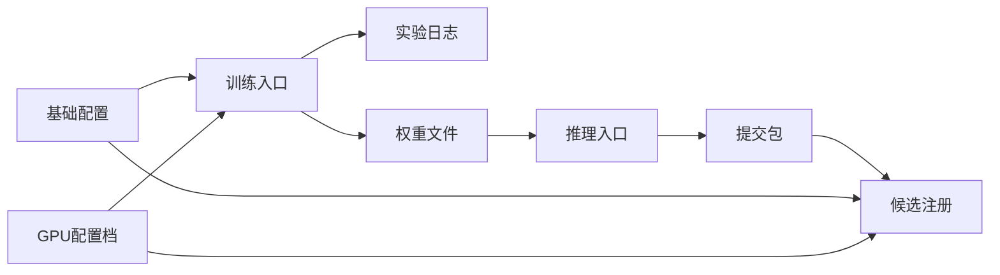

# 实验管理

<cite>
**本文引用的文件**
- [README.md](file://README.md)
- [docs/experiments/README.md](file://docs/experiments/README.md)
- [docs/CANDIDATE_REGISTRY.md](file://docs/CANDIDATE_REGISTRY.md)
- [docs/GPU_PROFILES.md](file://docs/GPU_PROFILES.md)
- [experiments/candidate_registry.md](file://experiments/candidate_registry.md)
- [configs/denoise_baseline.yaml](file://configs/denoise_baseline.yaml)
- [configs/denoise_pwsenel_v2_adaptive_clip_piecewise.yaml](file://configs/denoise_pwsenel_v2_adaptive_clip_piecewise.yaml)
- [configs/denoise_noise_aware_move_gate.yaml](file://configs/denoise_noise_aware_move_gate.yaml)
- [configs/profiles/a6000.yaml](file://configs/profiles/a6000.yaml)
- [configs/profiles/rtx5060ti.yaml](file://configs/profiles/rtx5060ti.yaml)
- [scripts/candidate_registry.py](file://scripts/candidate_registry.py)
- [scripts/unified_predict.py](file://scripts/unified_predict.py)
- [scripts/gpu_profile.py](file://scripts/gpu_profile.py)
- [scripts/train.sh](file://scripts/train.sh)
- [scripts/predict.sh](file://scripts/predict.sh)
</cite>

## 目录
1. [引言](#引言)
2. [项目结构](#项目结构)
3. [核心组件](#核心组件)
4. [架构总览](#架构总览)
5. [详细组件分析](#详细组件分析)
6. [依赖关系分析](#依赖关系分析)
7. [性能考量](#性能考量)
8. [故障排查指南](#故障排查指南)
9. [结论](#结论)
10. [附录](#附录)

## 引言
本文件面向Jittor点云去噪项目的实验管理与A/B测试实践，系统阐述实验设计原则、配置管理、实验记录与候选注册、结果评估与分析方法，并结合GPU配置文件给出基于硬件条件的参数适配策略。目标是帮助团队建立可重复、可追溯、可对比的实验流水线，支撑从基线到正式候选的全周期管理。

## 项目结构
该项目围绕“配置驱动 + 统一推理入口 + 候选注册”组织实验流程。关键要素如下：
- 配置系统：以YAML为主，区分基础配置与机器配置档（profile），后者仅覆盖容量相关参数，避免污染方法论。
- 训练与预测：通过shell包装器执行，自动采集运行元信息、复制配置与profile到实验目录，便于复现。
- 统一推理入口：支持硬阈值/软阈值路由、轻量迭代精炼（LIR）、噪声感知门控等A/B兼容路径。
- 候选注册：以JSONL/CSV/Markdown三文件同步记录，确保可追溯与可评审。

图表来源
- [scripts/train.sh:1-44](file://scripts/train.sh#L1-L44)
- [scripts/predict.sh:1-13](file://scripts/predict.sh#L1-L13)
- [scripts/unified_predict.py:1-606](file://scripts/unified_predict.py#L1-L606)
- [scripts/candidate_registry.py:1-365](file://scripts/candidate_registry.py#L1-L365)

章节来源
- [README.md:52-106](file://README.md#L52-L106)
- [docs/GPU_PROFILES.md:1-122](file://docs/GPU_PROFILES.md#L1-L122)

## 核心组件
- 配置系统
  - 基础配置：定义实验名称、数据路径、训练超参、模型开关与预测参数。
  - GPU配置档：覆盖训练步数、批大小、点数、patch大小等容量相关参数，不改变方法结构。
- 训练包装器
  - 自动生成实验目录，复制配置与profile，记录元信息，统一训练入口。
- 统一推理入口
  - 支持硬/软阈值路由、LIR轻量迭代、噪声感知门控，输出路由日志与提交包。
- 候选注册
  - 自动记录配置/profile/checkpoint/zip哈希、路由参数、官方评估结果、结论等，三文件同步更新。

章节来源
- [configs/denoise_baseline.yaml:1-44](file://configs/denoise_baseline.yaml#L1-L44)
- [configs/profiles/a6000.yaml:1-29](file://configs/profiles/a6000.yaml#L1-L29)
- [scripts/train.sh:14-43](file://scripts/train.sh#L14-L43)
- [scripts/unified_predict.py:412-606](file://scripts/unified_predict.py#L412-L606)
- [scripts/candidate_registry.py:230-302](file://scripts/candidate_registry.py#L230-L302)

## 架构总览
下图展示了从配置到实验记录的端到端流程，强调“配置合并—运行记录—推理—注册”的闭环。

图表来源
- [scripts/train.sh:14-43](file://scripts/train.sh#L14-L43)
- [scripts/predict.sh:8-12](file://scripts/predict.sh#L8-L12)
- [scripts/unified_predict.py:412-606](file://scripts/unified_predict.py#L412-L606)
- [scripts/candidate_registry.py:305-361](file://scripts/candidate_registry.py#L305-L361)

## 详细组件分析

### A/B测试方法论与实验设计原则
- 对照组设置
  - 使用统一推理入口，将不同方法/模块作为“分支”在路由层进行对比，如安全分支与强分支。
  - 通过硬阈值/软阈值两种路由模式实现对照，或在隐藏测试中仅使用噪声统计进行自检。
- 变量控制
  - 方法开关置于基础配置（如pwsenel/staas/move_gate等），profile仅覆盖容量参数，避免混淆。
  - 通过统一入口构建模型时显式列出所有开关，防止候选间隐式共享默认值。
- 结果评估标准
  - 官方评估指标：CD、P2S、最终分数；同时记录路由统计（如门控值、LIR步数/系数）与工程指标（延迟、峰值显存等）。
  - 注册表字段涵盖官方分数、路由参数、提交包校验状态、结论等，便于横向对比。

章节来源
- [docs/CANDIDATE_REGISTRY.md:58-94](file://docs/CANDIDATE_REGISTRY.md#L58-L94)
- [scripts/unified_predict.py:83-119](file://scripts/unified_predict.py#L83-L119)

### 配置管理系统
- 配置合并机制
  - 基础配置与一个或多个profile按叶节点覆盖合并，未声明字段沿用主配置。
- 配置字段分类
  - experiment：实验名称、随机种子
  - paths：数据根、测试根、列表、输出目录、提交包名、权重路径
  - train：训练步数、限制、点数、批大小、学习率、噪声范围、损失权重、日志/保存频率
  - model：图卷积K、特征维度、隐藏维度、模块开关与相关超参
  - predict：限制、patch大小等
- Profile作用
  - 仅覆盖容量相关参数，不改变方法结构；不同GPU/显存版本通过profile快速适配。

图表来源
- [scripts/unified_predict.py:76-81](file://scripts/unified_predict.py#L76-L81)
- [scripts/candidate_registry.py:138-142](file://scripts/candidate_registry.py#L138-L142)

章节来源
- [configs/denoise_baseline.yaml:1-44](file://configs/denoise_baseline.yaml#L1-L44)
- [configs/denoise_pwsenel_v2_adaptive_clip_piecewise.yaml:1-54](file://configs/denoise_pwsenel_v2_adaptive_clip_piecewise.yaml#L1-L54)
- [configs/denoise_noise_aware_move_gate.yaml:1-47](file://configs/denoise_noise_aware_move_gate.yaml#L1-L47)
- [configs/profiles/a6000.yaml:1-29](file://configs/profiles/a6000.yaml#L1-L29)
- [configs/profiles/rtx5060ti.yaml:1-20](file://configs/profiles/rtx5060ti.yaml#L1-L20)

### 实验记录规范
- 元数据收集
  - 训练包装器会复制配置与profile至实验目录，记录运行元信息（命令、时间、git状态）。
- 日志保存
  - 训练日志写入实验目录；推理阶段输出路由CSV，记录每样本的路由决策与统计量。
- 结果追踪
  - 提交包内仅包含官方要求的相对路径文件；候选注册脚本记录配置/权重/提交包哈希、官方评估结果与结论。

章节来源
- [scripts/train.sh:20-43](file://scripts/train.sh#L20-L43)
- [scripts/unified_predict.py:522-596](file://scripts/unified_predict.py#L522-L596)
- [scripts/candidate_registry.py:198-227](file://scripts/candidate_registry.py#L198-L227)

### 候选注册系统
- 文件体系
  - 机器可读：experiments/candidates.jsonl
  - 表格视图：experiments/candidate_registry.csv
  - 人类摘要：experiments/candidate_registry.md
- 关键字段
  - 基本信息：名称、阶段、状态、分支、创建时间、git提交/脏状态
  - 配置与档案：config路径/哈希、profile路径/哈希
  - 模型与产物：权重路径/哈希/大小、提交包路径/哈希/大小
  - 路由与参数：阈值、patch/chunk/overlap、拼接策略
  - 评估与结论：官方评估JSON、官方分数/CD/P2S、结论、备注
- 追加与重建
  - 默认模式为追加候选；也可仅从JSONL重建CSV/MD，确保三文件一致性。

图表来源
- [scripts/candidate_registry.py:198-227](file://scripts/candidate_registry.py#L198-L227)
- [scripts/candidate_registry.py:230-302](file://scripts/candidate_registry.py#L230-L302)

章节来源
- [scripts/candidate_registry.py:1-365](file://scripts/candidate_registry.py#L1-L365)
- [experiments/candidate_registry.md:1-29](file://experiments/candidate_registry.md#L1-L29)

### 实验结果分析指南
- 统计检验
  - 建议采用成对样本比较（如t检验或非参数检验）评估不同路由/模块在相同数据上的差异显著性；关注CD/P2S与工程指标（延迟、显存）。
- 可视化方法
  - 路由分布直方图/箱线图：展示不同阈值下的路由比例与稳定性。
  - 路径长度与门控热力图：辅助理解软路由宽度与样本噪声估计的关系。
  - 误差分布散点图：对比不同候选在相同GT下的残差分布。
- 注册表利用
  - 以注册表为权威证据源，结合官方评估JSON与提交包校验状态进行综合判断。

章节来源
- [docs/CANDIDATE_REGISTRY.md:12-31](file://docs/CANDIDATE_REGISTRY.md#L12-L31)
- [experiments/candidate_registry.md:7-29](file://experiments/candidate_registry.md#L7-L29)

### GPU配置文件与硬件适配
- 自动推荐
  - 通过查询GPU信息自动推荐最接近的profile，并给出训练命令模板。
- 适配优先级
  - 爆显存时优先降低batch_size/num_points/k/feat_dim/predict.patch_size，而非改动模型结构。
- 角色分工
  - 本机/低显存：本地开发与小样本smoke测试
  - RTX 5060 Ti：中等规模训练与ablation预筛
  - RTX A6000：大规模正式训练与最终预测

图表来源
- [scripts/gpu_profile.py:13-56](file://scripts/gpu_profile.py#L13-L56)

章节来源
- [docs/GPU_PROFILES.md:104-122](file://docs/GPU_PROFILES.md#L104-L122)
- [configs/profiles/a6000.yaml:1-29](file://configs/profiles/a6000.yaml#L1-L29)
- [configs/profiles/rtx5060ti.yaml:1-20](file://configs/profiles/rtx5060ti.yaml#L1-L20)

## 依赖关系分析
- 组件耦合
  - 训练包装器依赖配置与profile；统一推理入口依赖配置与checkpoint；候选注册依赖现有artifact与配置。
- 外部依赖
  - Jittor、CuPy（按CUDA版本匹配）、NumPy/SciPy等；提交包遵循官方路径约定。
- 潜在环路
  - 无直接循环依赖；注册脚本仅读取与写入，不参与训练/推理。

图表来源
- [scripts/train.sh:14-43](file://scripts/train.sh#L14-L43)
- [scripts/unified_predict.py:412-606](file://scripts/unified_predict.py#L412-L606)
- [scripts/candidate_registry.py:305-361](file://scripts/candidate_registry.py#L305-L361)

章节来源
- [scripts/train.sh:1-44](file://scripts/train.sh#L1-L44)
- [scripts/predict.sh:1-13](file://scripts/predict.sh#L1-L13)

## 性能考量
- 显存优化优先级：batch_size → num_points → k/feat_dim → predict.patch_size
- 输入管线与并行：profile中提供缓存与预取参数，有助于缓解IO瓶颈
- 工程指标：延迟、峰值显存、参数量、模型体积等均在注册表中记录，便于横向对比

章节来源
- [docs/GPU_PROFILES.md:111-122](file://docs/GPU_PROFILES.md#L111-L122)
- [configs/profiles/a6000.yaml:13-21](file://configs/profiles/a6000.yaml#L13-L21)

## 故障排查指南
- 环境问题
  - 使用环境检查脚本确认Jittor/CUDA/依赖可用；必要时切换镜像源或离线wheelhouse
- 数据问题
  - 使用数据检查脚本验证数据结构与数量；限制样本数进行快速验证
- 提交包问题
  - 使用提交包校验脚本确保路径与格式符合官方要求
- 注册表问题
  - 若注册失败，检查配置/profile/权重/提交包路径是否存在且可读；必要时仅重建CSV/MD

章节来源
- [README.md:108-143](file://README.md#L108-L143)
- [scripts/candidate_registry.py:167-181](file://scripts/candidate_registry.py#L167-L181)

## 结论
本实验管理体系以“配置驱动 + 统一入口 + 注册表”为核心，实现了从配置合并、运行记录、推理路由到结果追踪的闭环。通过严格的变量控制与评估标准，结合GPU配置档的硬件适配，能够高效开展A/B测试并产出可复现、可对比、可提交的候选成果。

## 附录
- 实验报告与注册表
  - 实验报告目录与注册表概览见相应文档
- 快速参考
  - 训练：bash scripts/train.sh <config> [profile]
  - 预测：bash scripts/predict.sh <config> [profile]
  - 统一推理：python scripts/unified_predict.py ...
  - 候选注册：python scripts/candidate_registry.py ...

章节来源
- [docs/experiments/README.md:1-18](file://docs/experiments/README.md#L1-L18)
- [docs/CANDIDATE_REGISTRY.md:1-20](file://docs/CANDIDATE_REGISTRY.md#L1-L20)
- [README.md:87-106](file://README.md#L87-L106)