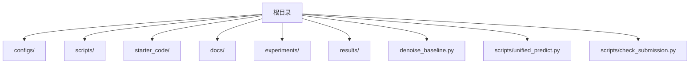
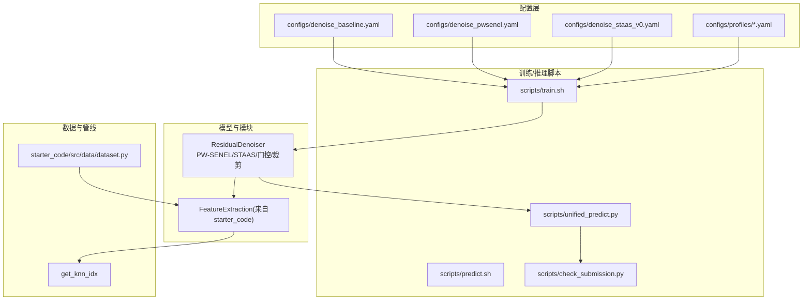
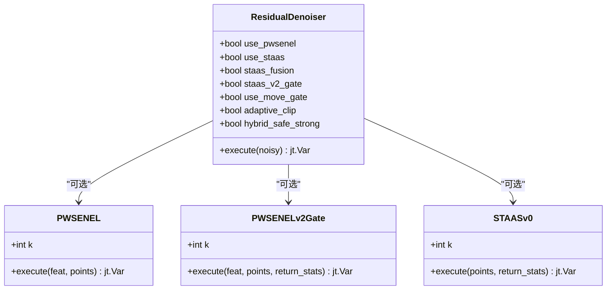
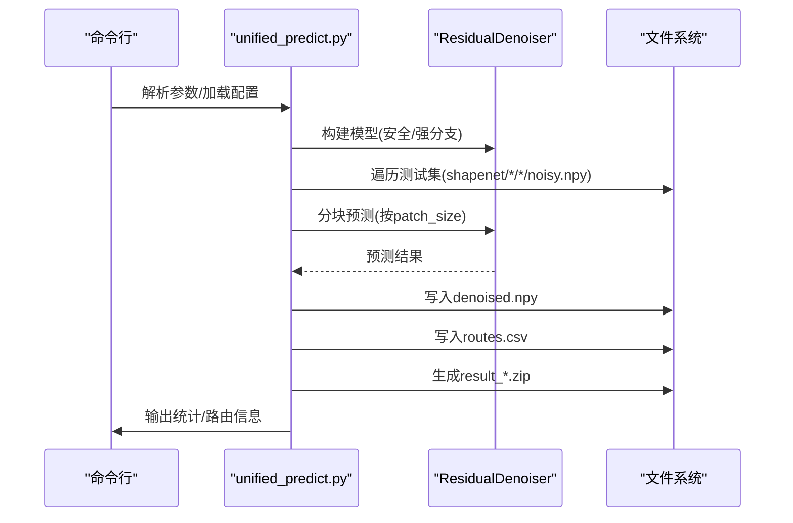
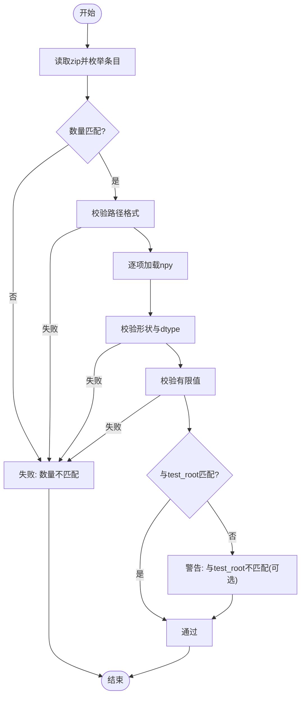
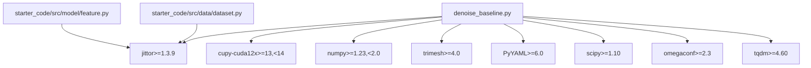

# 开发指南

<cite>
**本文引用的文件**
- [README.md](file://README.md)
- [OPEN_SOURCE.md](file://OPEN_SOURCE.md)
- [requirements.txt](file://requirements.txt)
- [denoise_baseline.py](file://denoise_baseline.py)
- [unified_predict.py](file://scripts/unified_predict.py)
- [check_submission.py](file://scripts/check_submission.py)
- [denoise_baseline.yaml](file://configs/denoise_baseline.yaml)
- [denoise_pwsenel.yaml](file://configs/denoise_pwsenel.yaml)
- [denoise_staas_v0.yaml](file://configs/denoise_staas_v0.yaml)
- [feature.py](file://starter_code/src/model/feature.py)
- [dataset.py](file://starter_code/src/data/dataset.py)
- [CITATION.cff](file://CITATION.cff)
</cite>

## 目录
1. [简介](#简介)
2. [项目结构](#项目结构)
3. [核心组件](#核心组件)
4. [架构总览](#架构总览)
5. [详细组件分析](#详细组件分析)
6. [依赖关系分析](#依赖关系分析)
7. [性能考虑](#性能考虑)
8. [故障排查指南](#故障排查指南)
9. [结论](#结论)
10. [附录](#附录)

## 简介
本指南面向Jittor点云去噪项目的开发者，目标是帮助团队高效协作、高质量交付。内容涵盖代码贡献规范、新模块开发流程、测试与质量保证策略、文档编写规范、架构演进与向后兼容、开发工具与IDE配置建议，以及发布与版本管理流程。

本项目采用Jittor框架，围绕“残差偏移回归”主干，结合可插拔的几何增强模块（如PW-SENEL、ST-AAS）构建可复现实验基线与竞赛候选方案。训练与推理通过脚本封装，配置文件驱动，便于在不同硬件配置间迁移。

## 项目结构
仓库采用按职责分层与按功能模块组织相结合的方式：
- configs：训练/推理配置与GPU档位配置
- scripts：环境初始化、训练、预测、校验、打包等脚本
- starter_code：官方starter code与VM补丁边界
- docs：仓库结构、GPU档位、实验记录等文档
- experiments/results：实验产物（不在git中跟踪）
- 根目录入口：训练/预测主程序与统一推理入口

章节来源
- [README.md: 52-106:52-106](file://README.md#L52-L106)

## 核心组件
- 残差去噪主干网络：基于官方FeatureExtraction提取特征，MLP作为偏移头，支持多种几何增强模块开关
- 几何增强模块：
  - PW-SENEL：软最大噪声抑制 + 最大池化边缘锁定
  - ST-AAS v0：密度自适应softmax平滑 + 结构张量边缘抑制
- 统一推理管线：支持硬阈值/软融合/强制分支路由、LIR轻量迭代细化、Gated-LIR自适应路由
- 配置系统：YAML配置 + profile档位覆盖，确保跨机器一致性
- 提交校验：本地提交包结构、形状、类型、数值合法性校验

章节来源
- [denoise_baseline.py: 480-733:480-733](file://denoise_baseline.py#L480-L733)
- [unified_predict.py: 83-119:83-119](file://scripts/unified_predict.py#L83-L119)
- [check_submission.py: 68-156:68-156](file://scripts/check_submission.py#L68-L156)

## 架构总览
整体架构由“配置驱动 + 模块化网络 + 统一推理管线 + 脚本化工作流”构成。训练/推理通过脚本加载配置，实例化ResidualDenoiser及其可选模块，最终产出提交zip并通过校验脚本验证。

图表来源
- [denoise_baseline.py: 518-594:518-594](file://denoise_baseline.py#L518-L594)
- [feature.py: 184-196:184-196](file://starter_code/src/model/feature.py#L184-L196)
- [unified_predict.py: 83-119:83-119](file://scripts/unified_predict.py#L83-L119)
- [check_submission.py: 68-156:68-156](file://scripts/check_submission.py#L68-L156)

## 详细组件分析

### ResidualDenoiser与可插拔模块
- 主干：FeatureExtraction编码器 + MLP偏移头
- 可选模块：
  - PW-SENEL/PW-SENEL v2 Gate：噪声置信度引导的软最大抑制 + 边缘锁定
  - ST-AAS v0：单KNN密度自适应softmax平滑 + 结构张量描述子
  - Move Gate/Noise-aware Move Gate：移动幅度门控
  - 自适应/固定裁剪：残差范数裁剪
  - Hybrid Safe/Strong路由：低噪声安全分支 + 高噪声强分支
- 设计原则：模块以开关形式接入，便于A/B消融与回退

图表来源
- [denoise_baseline.py: 480-733:480-733](file://denoise_baseline.py#L480-L733)
- [denoise_baseline.py: 259-315:259-315](file://denoise_baseline.py#L259-L315)
- [denoise_baseline.py: 317-375:317-375](file://denoise_baseline.py#L317-L375)
- [denoise_baseline.py: 377-478:377-478](file://denoise_baseline.py#L377-L478)

章节来源
- [denoise_baseline.py: 480-733:480-733](file://denoise_baseline.py#L480-L733)

### 统一推理管线与路由
- 支持模式：router（硬/软/强制）、lir、gated-lir
- 路由依据：基于noisy点云的平面残差分位数估计
- 输出：每样本独立写入denoised.npy，同时生成routes.csv路由日志
- 提交：自动打包为官方格式zip，随后可用校验脚本验证

图表来源
- [unified_predict.py: 412-606:412-606](file://scripts/unified_predict.py#L412-L606)

章节来源
- [unified_predict.py: 412-606:412-606](file://scripts/unified_predict.py#L412-L606)

### 提交校验流程
- 结构校验：zip内条目路径必须为shapenet/<category>/<model>/denoised.npy
- 数量校验：与test_root中noisy.npy数量一致（可选）
- 形状与类型校验：Nx3、float32（可选）
- 数值校验：全有限值

图表来源
- [check_submission.py: 68-156:68-156](file://scripts/check_submission.py#L68-L156)

章节来源
- [check_submission.py: 68-156:68-156](file://scripts/check_submission.py#L68-L156)

## 依赖关系分析
- 运行时依赖：Jittor、CuPy（CUDA 12.x）、NumPy、Trimesh、PyYAML、SciPy、OmegaConf、TQDM
- 版本约束：Jittor>=1.3.9；CuPy 12.x需与numpy<2兼容；建议Python 3.10-3.12
- starter_code与本仓库边界：FeatureExtraction/Decoder来自starter_code，避免污染官方baseline

图表来源
- [requirements.txt: 5-17:5-17](file://requirements.txt#L5-L17)
- [denoise_baseline.py: 53-56:53-56](file://denoise_baseline.py#L53-L56)
- [feature.py: 1-5:1-5](file://starter_code/src/model/feature.py#L1-L5)
- [dataset.py: 1-16:1-16](file://starter_code/src/data/dataset.py#L1-L16)

章节来源
- [requirements.txt: 5-17:5-17](file://requirements.txt#L5-L17)
- [denoise_baseline.py: 53-56:53-56](file://denoise_baseline.py#L53-L56)

## 性能考虑
- 数据加载与预取：使用后台线程预取NumPy批次，减少Jittor/CUDA线程风险
- 分块推理：统一推理脚本支持按patch_size分块，避免显存不足
- 渲染与统计：利用nvidia-smi与ps进程信息辅助资源监控
- 配置档位：通过profiles调整batch/points/step适配不同GPU内存

章节来源
- [denoise_baseline.py: 175-227:175-227](file://denoise_baseline.py#L175-L227)
- [unified_predict.py: 426-429:426-429](file://scripts/unified_predict.py#L426-L429)

## 故障排查指南
- 环境问题
  - Jittor/CUDA版本与CuPy匹配性：确保cupy-cuda12x与numpy<2兼容
  - Python版本：推荐3.10-3.12
- 数据问题
  - 数据集路径与符号链接：确保dataset_train与dataset_test_noisy存在
  - 数据检查：使用scripts/check_data.py进行快速校验
- 训练/推理问题
  - 配置合并：profile仅覆盖显式声明字段，避免隐式共享
  - 模型开关：确认YAML中use_*与模块开关一致
- 提交问题
  - 使用scripts/check_submission.py进行本地硬门槛校验
  - 确认zip条目路径、数量、形状、dtype、数值均符合要求

章节来源
- [README.md: 108-143:108-143](file://README.md#L108-L143)
- [README.md: 160-166:160-166](file://README.md#L160-L166)
- [check_submission.py: 158-188:158-188](file://scripts/check_submission.py#L158-L188)

## 结论
本指南提供了从代码贡献、模块扩展、测试与质量保证、文档规范、架构演进、开发工具到发布流程的完整实践路径。遵循这些规范可显著提升开发效率与系统稳定性，确保在多硬件环境下的一致复现与高质量交付。

## 附录

### 代码贡献规范
- 代码风格
  - Python：PEP8风格，函数/类/变量命名清晰，模块内职责单一
  - 注释：关键函数/类/模块提供中文注释，解释设计动机与接口语义
  - 导入顺序：标准库 → 第三方库 → 项目内部模块
- 命名约定
  - 类名：PascalCase（如ResidualDenoiser、PWSENEL）
  - 函数/变量：snake_case（如get_knn_idx、deep_update）
  - 常量：UPPER_SNAKE_CASE（如MAX_POINTS）
- 提交流程
  - 本地提交前：执行scripts/check_env.py与scripts/check_data.py
  - 提交清单：遵循OPEN_SOURCE.md中的“必须提交/禁止提交”清单
  - 远程同步：建议Gitee为主、GitHub为镜像，关键节点双推送

章节来源
- [OPEN_SOURCE.md: 65-104:65-104](file://OPEN_SOURCE.md#L65-L104)
- [OPEN_SOURCE.md: 187-204:187-204](file://OPEN_SOURCE.md#L187-L204)

### 新模块开发指南（基于现有架构添加几何增强模块）
- 模块位置与职责
  - 在ResidualDenoiser中新增模块开关与调用点，保持可插拔与可回退
  - 若涉及几何统计/描述子，优先复用starter_code中的KNN与坐标操作
- 接口与返回
  - 模块execute输入通常为feat/points，输出为残差或门控系数
  - 支持return_stats返回中间统计，便于调试与可视化
- 配置与A/B消融
  - 在YAML中新增use_xxx开关与相关超参
  - 通过profiles覆盖档位参数，确保跨机器一致性
- 示例参考
  - PW-SENEL：软最大噪声抑制 + 最大池化边缘锁定
  - ST-AAS v0：密度自适应softmax + 结构张量描述子

章节来源
- [denoise_baseline.py: 480-733:480-733](file://denoise_baseline.py#L480-L733)
- [feature.py: 184-196:184-196](file://starter_code/src/model/feature.py#L184-L196)

### 测试策略与质量保证
- 单元测试
  - 对关键几何统计/门控/裁剪逻辑进行数值正确性校验
  - 使用小规模随机输入验证维度/形状一致性
- 集成测试
  - 端到端训练/推理流水线：训练脚本 + 统一推理 + 提交校验
  - 跨profile一致性：在不同configs/profiles/*.yaml下复现实验
- 性能测试
  - 分块推理吞吐：对比不同patch_size下的速度与显存占用
  - 资源监控：结合nvidia-smi与进程信息评估GPU/CPU利用率

章节来源
- [unified_predict.py: 516-596:516-596](file://scripts/unified_predict.py#L516-L596)
- [check_submission.py: 68-156:68-156](file://scripts/check_submission.py#L68-L156)

### 文档编写规范
- 配置文档：每个YAML配置文件附带简要说明与关键参数含义
- 模块文档：模块类/函数的docstring说明输入/输出/行为
- 实验记录：docs/experiments/下记录关键实验与结论
- 引用与许可：CITATION.cff与LICENSE/NOTICE保持一致

章节来源
- [CITATION.cff: 1-17:1-17](file://CITATION.cff#L1-L17)
- [README.md: 267-299:267-299](file://README.md#L267-L299)

### 架构演进与向后兼容
- 兼容性原则
  - 新增模块以开关形式接入，不影响默认行为
  - 配置合并采用“仅覆盖显式字段”，避免隐式默认值传播
- 版本管理
  - 使用Git标签标记里程碑（如“add pw-senel ablation module”）
  - 发布前执行“Before Public Release Checklist”

章节来源
- [denoise_baseline.py: 38-45:38-45](file://denoise_baseline.py#L38-L45)
- [OPEN_SOURCE.md: 205-214:205-214](file://OPEN_SOURCE.md#L205-L214)

### 开发工具与IDE配置建议
- Python环境：建议使用conda或venv，隔离Jittor/CuPy依赖
- IDE：VSCode推荐使用Python与YAML扩展，启用Pylance与Black/Flake8
- 调试：利用BatchPrefetcher与分块推理定位显存瓶颈
- Git：多远端同步，关键节点双推送

章节来源
- [README.md: 108-143:108-143](file://README.md#L108-L143)
- [OPEN_SOURCE.md: 30-64:30-64](file://OPEN_SOURCE.md#L30-L64)

### 发布流程与版本管理
- 开源要求：遵循OPEN_SOURCE.md中的提交清单与禁止提交项
- 提交校验：本地使用check_submission.py进行硬门槛校验
- 版本里程碑：建议按OPEN_SOURCE.md中的建议节点推进

章节来源
- [OPEN_SOURCE.md: 65-104:65-104](file://OPEN_SOURCE.md#L65-L104)
- [check_submission.py: 158-188:158-188](file://scripts/check_submission.py#L158-L188)