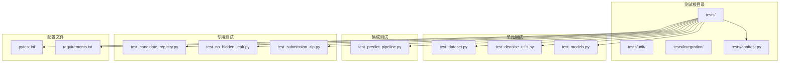
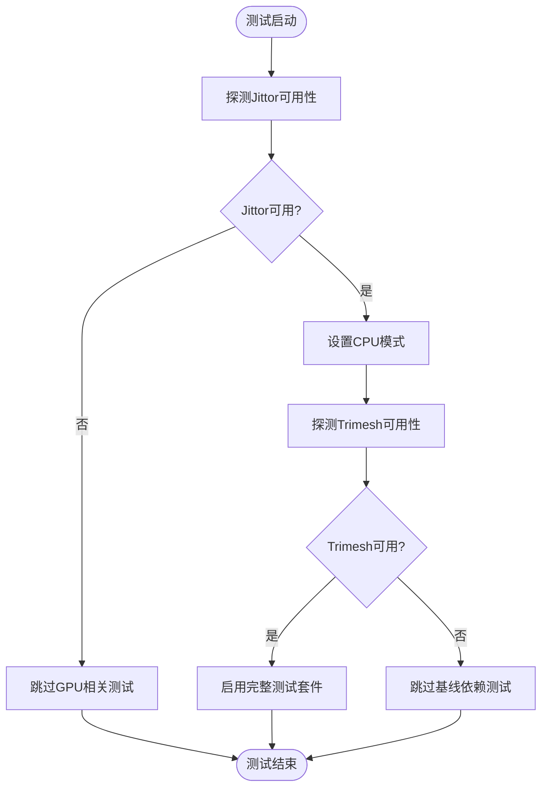
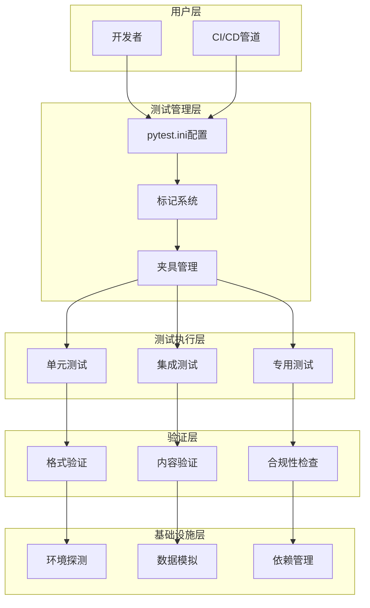
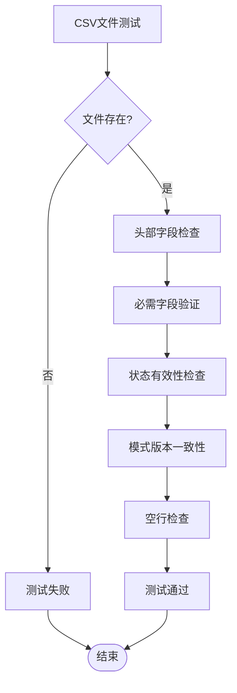
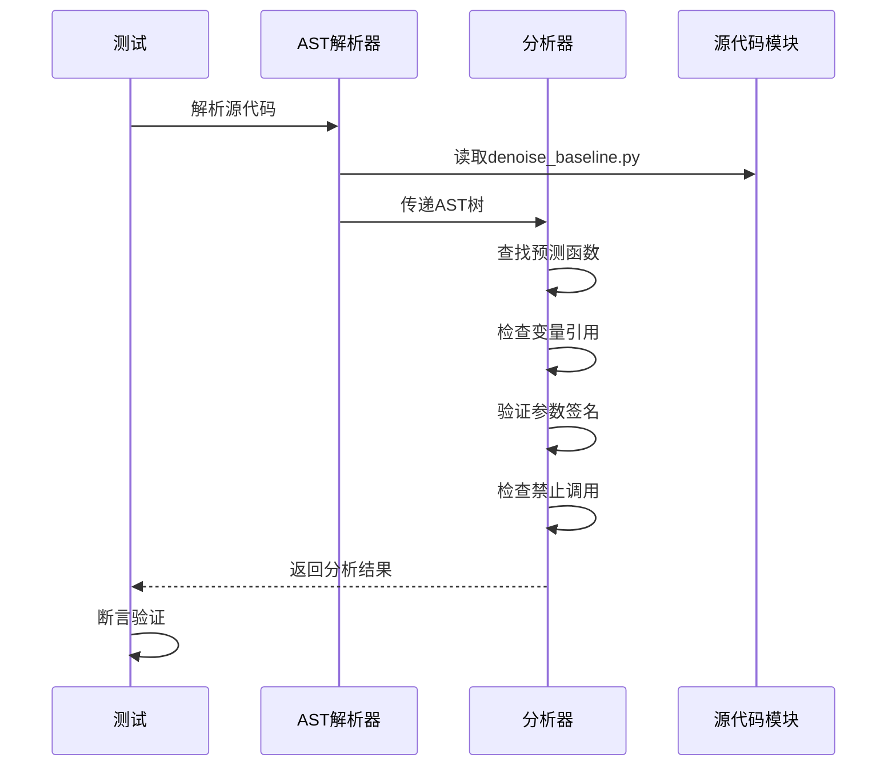
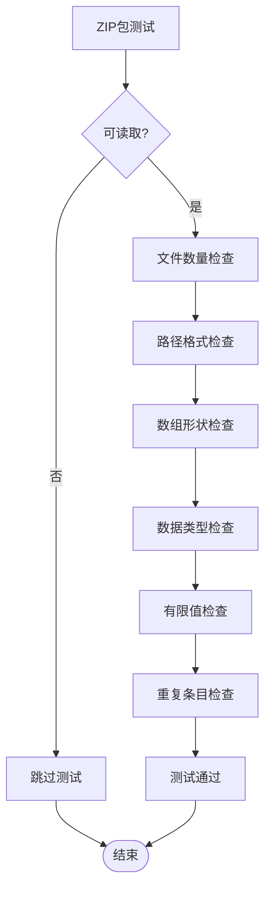
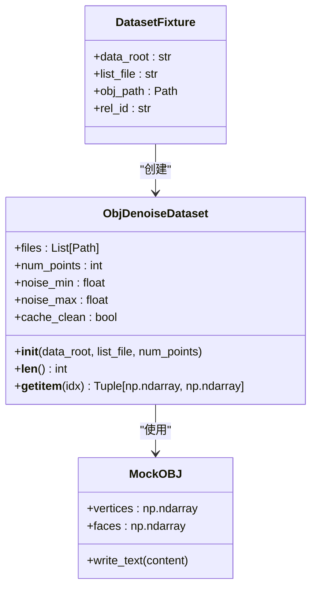
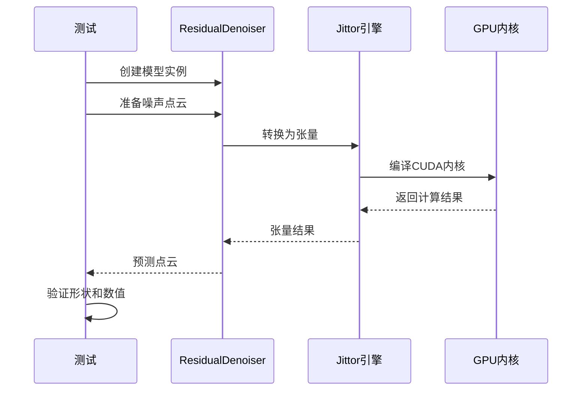
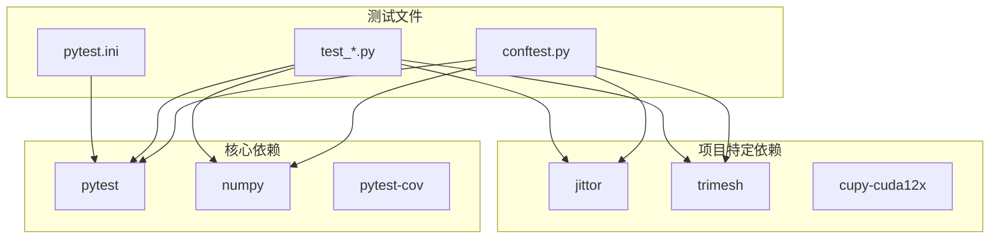

# 测试基础设施

<cite>
**本文档引用的文件**
- [tests/conftest.py](file://tests/conftest.py)
- [pytest.ini](file://pytest.ini)
- [tests/test_candidate_registry.py](file://tests/test_candidate_registry.py)
- [tests/test_no_hidden_leak.py](file://tests/test_no_hidden_leak.py)
- [tests/test_submission_zip.py](file://tests/test_submission_zip.py)
- [tests/integration/test_predict_pipeline.py](file://tests/integration/test_predict_pipeline.py)
- [tests/unit/test_dataset.py](file://tests/unit/test_dataset.py)
- [tests/unit/test_denoise_utils.py](file://tests/unit/test_denoise_utils.py)
- [tests/unit/test_models.py](file://tests/unit/test_models.py)
- [scripts/check_submission.py](file://scripts/check_submission.py)
- [requirements.txt](file://requirements.txt)
- [configs/denoise_baseline.yaml](file://configs/denoise_baseline.yaml)
- [configs/denoise_hybrid_safe_strong_v3.yaml](file://configs/denoise_hybrid_safe_strong_v3.yaml)
</cite>

## 目录
1. [简介](#简介)
2. [项目结构](#项目结构)
3. [核心组件](#核心组件)
4. [架构概览](#架构概览)
5. [详细组件分析](#详细组件分析)
6. [依赖分析](#依赖分析)
7. [性能考虑](#性能考虑)
8. [故障排除指南](#故障排除指南)
9. [结论](#结论)

## 简介

这是一个针对点云去噪项目的全面测试基础设施文档。该测试框架采用分层设计，包含单元测试、集成测试和端到端验证，确保模型的正确性、性能和合规性。测试基础设施特别关注以下方面：

- **环境兼容性**：支持CPU-only和GPU环境，自动检测Jittor可用性
- **数据完整性**：验证候选注册表的一致性和完整性
- **安全隔离**：防止训练信息泄漏到推理过程
- **提交合规性**：确保输出格式符合竞赛要求
- **模型稳定性**：验证各种模型变体的功能正确性

## 项目结构

测试基础设施采用模块化组织方式，按照测试类型和功能范围进行分类：

**图表来源**
- [tests/conftest.py:1-139](file://tests/conftest.py#L1-L139)
- [pytest.ini:1-9](file://pytest.ini#L1-L9)

**章节来源**
- [tests/conftest.py:1-139](file://tests/conftest.py#L1-L139)
- [pytest.ini:1-9](file://pytest.ini#L1-L9)

## 核心组件

### 测试夹具系统

测试夹具系统提供了可重用的测试基础设施，包括环境设置、随机数生成器和模拟数据。

#### 环境探测和配置

测试框架通过智能环境探测确保在不同硬件配置下的兼容性：

**图表来源**
- [tests/conftest.py:36-59](file://tests/conftest.py#L36-L59)

#### 随机数生成器

测试使用确定性的随机数生成器确保结果可重现：

- **种子固定**：使用固定种子确保测试结果稳定
- **NumPy Generator**：提供现代随机数生成接口
- **批量测试**：支持大规模测试场景

**章节来源**
- [tests/conftest.py:74-100](file://tests/conftest.py#L74-L100)

### 标记系统

测试标记系统提供灵活的测试选择和执行控制：

| 标记名称 | 描述 | 使用场景 |
|---------|------|----------|
| `gpu` | 需要GPU的测试 | 模型推理和训练测试 |
| `submission` | 提交包验证测试 | 输出格式合规性检查 |
| `registry` | 候选注册表测试 | 实验跟踪一致性验证 |
| `leak_check` | 泄漏检测测试 | 防止训练信息泄漏 |

**章节来源**
- [pytest.ini:4-8](file://pytest.ini#L4-L8)

## 架构概览

测试基础设施采用分层架构，从底层的环境探测到顶层的业务逻辑验证：

**图表来源**
- [tests/conftest.py:1-139](file://tests/conftest.py#L1-L139)
- [pytest.ini:1-9](file://pytest.ini#L1-L9)

## 详细组件分析

### 候选注册表测试

候选注册表测试确保实验跟踪系统的完整性和一致性：

#### CSV文件验证

**图表来源**
- [tests/test_candidate_registry.py:58-131](file://tests/test_candidate_registry.py#L58-L131)

#### JSONL文件验证

JSONL文件提供实时实验状态记录，测试确保每行都是有效的JSON格式：

- **格式验证**：检查每行是否为有效JSON
- **字段完整性**：验证必需字段的存在性
- **数据一致性**：确保记录的完整性

**章节来源**
- [tests/test_candidate_registry.py:138-191](file://tests/test_candidate_registry.py#L138-L191)

### 泄漏检测测试

泄漏检测测试使用AST静态分析和运行时检查双重机制：

#### AST静态分析

**图表来源**
- [tests/test_no_hidden_leak.py:46-96](file://tests/test_no_hidden_leak.py#L46-L96)

#### 运行时检查

运行时检查验证预测函数的实际行为：

- **函数签名验证**：确保没有包含禁止参数
- **执行流程检查**：验证推理过程不访问地面真值数据
- **数据流分析**：确保只加载噪声数据而非清洁数据

**章节来源**
- [tests/test_no_hidden_leak.py:214-250](file://tests/test_no_hidden_leak.py#L214-L250)

### 提交包验证测试

提交包验证测试确保输出格式完全符合竞赛要求：

#### 格式规范验证

**图表来源**
- [tests/test_submission_zip.py:129-206](file://tests/test_submission_zip.py#L129-L206)

#### 实际文件验证

实际文件验证使用真实提交包进行测试：

- **文件存在性**：验证所有必需文件都存在
- **命名约定**：检查路径深度和文件名
- **数据质量**：验证形状、类型和数值有效性

**章节来源**
- [tests/test_submission_zip.py:258-315](file://tests/test_submission_zip.py#L258-L315)

### 单元测试组件

#### 数据集测试

数据集测试使用模拟OBJ文件验证数据加载和预处理：

**图表来源**
- [tests/unit/test_dataset.py:32-107](file://tests/unit/test_dataset.py#L32-L107)

#### 工具函数测试

工具函数测试专注于核心算法的正确性：

- **邻域聚合**：验证gather_neighbors函数的数学正确性
- **边界条件**：测试各种输入尺寸和索引配置
- **数值精度**：确保与参考实现的精确匹配

**章节来源**
- [tests/unit/test_denoise_utils.py:34-143](file://tests/unit/test_denoise_utils.py#L34-L143)

### 集成测试组件

集成测试验证完整的推理管道：

#### 模型集成测试

**图表来源**
- [tests/integration/test_predict_pipeline.py:28-107](file://tests/integration/test_predict_pipeline.py#L28-L107)

## 依赖分析

测试基础设施的依赖关系相对简单，主要依赖于标准库和第三方测试框架：

**图表来源**
- [requirements.txt:1-21](file://requirements.txt#L1-L21)
- [tests/conftest.py:16-59](file://tests/conftest.py#L16-L59)

**章节来源**
- [requirements.txt:1-21](file://requirements.txt#L1-L21)
- [tests/conftest.py:16-59](file://tests/conftest.py#L16-L59)

## 性能考虑

测试基础设施在设计时充分考虑了性能优化：

### 环境自适应

- **延迟导入**：Jittor等大型库按需导入，减少启动时间
- **CPU回退**：在无GPU环境下自动切换到CPU模式
- **缓存策略**：利用JIT编译缓存避免重复编译

### 测试优化

- **小规模数据**：使用小批量数据进行快速验证
- **选择性执行**：根据硬件能力选择性运行测试
- **并行执行**：支持pytest的并行测试执行

## 故障排除指南

### 常见问题及解决方案

#### Jittor导入失败

**症状**：测试文件被跳过，显示Jittor不可用

**解决方案**：
1. 检查CUDA工具链是否正确安装
2. 验证CuPy版本兼容性
3. 确认Python版本满足要求

#### 提交包验证失败

**症状**：提交包测试报告格式或内容错误

**解决方案**：
1. 使用官方验证脚本检查格式
2. 对比预期的文件结构和数据类型
3. 检查压缩选项和文件权限

#### 数据集测试异常

**症状**：数据集初始化或访问抛出异常

**解决方案**：
1. 验证OBJ文件格式正确性
2. 检查文件路径和权限
3. 确认trimesh版本兼容性

**章节来源**
- [scripts/check_submission.py:68-156](file://scripts/check_submission.py#L68-L156)

## 结论

该测试基础设施展现了现代机器学习项目的最佳实践：

### 设计优势

- **全面覆盖**：从单元测试到端到端验证的完整测试金字塔
- **环境适应**：智能的硬件检测和回退机制
- **合规保障**：专门的竞赛格式验证确保提交质量
- **安全性**：多层防护防止训练信息泄漏

### 技术特色

- **模块化设计**：清晰的测试分类和职责分离
- **可扩展性**：易于添加新的测试类型和验证规则
- **可维护性**：简洁的配置和明确的测试目标
- **可靠性**：严格的错误处理和边界条件测试

该测试基础设施为点云去噪项目提供了坚实的工程基础，确保了代码质量和项目稳定性，同时为未来的功能扩展和维护奠定了良好基础。