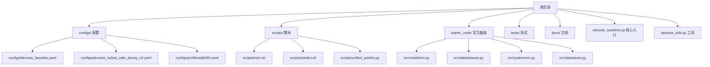
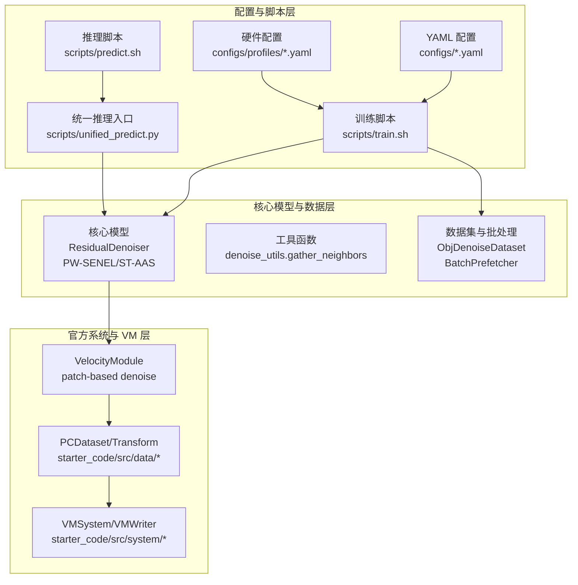
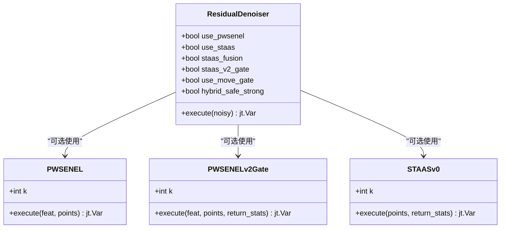
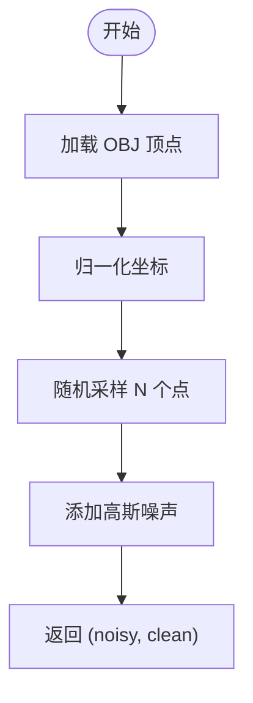
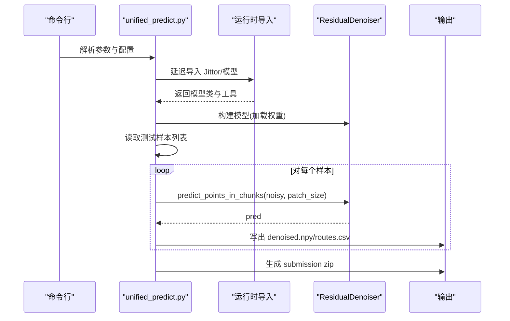
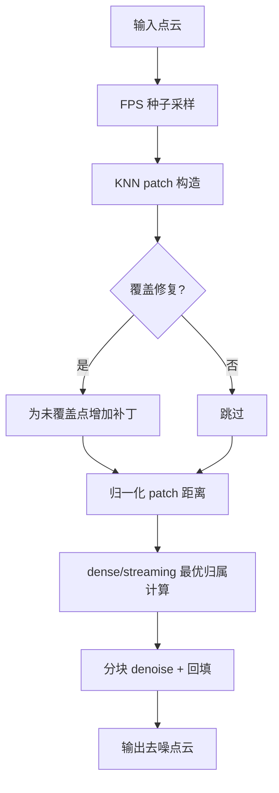
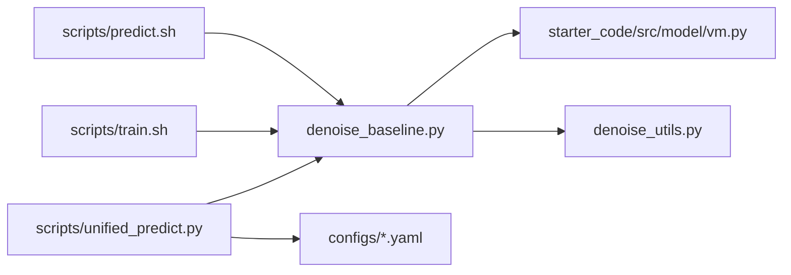

# 项目架构文档

<cite>
**本文档引用的文件**
- [README.md](file://README.md)
- [requirements.txt](file://requirements.txt)
- [denoise_baseline.py](file://denoise_baseline.py)
- [denoise_utils.py](file://denoise_utils.py)
- [configs/denoise_baseline.yaml](file://configs/denoise_baseline.yaml)
- [configs/denoise_hybrid_safe_strong_v3.yaml](file://configs/denoise_hybrid_safe_strong_v3.yaml)
- [configs/profiles/a6000.yaml](file://configs/profiles/a6000.yaml)
- [starter_code/src/model/vm.py](file://starter_code/src/model/vm.py)
- [starter_code/src/data/dataset.py](file://starter_code/src/data/dataset.py)
- [starter_code/src/system/vm.py](file://starter_code/src/system/vm.py)
- [starter_code/src/data/asset.py](file://starter_code/src/data/asset.py)
- [scripts/unified_predict.py](file://scripts/unified_predict.py)
- [scripts/train.sh](file://scripts/train.sh)
- [scripts/predict.sh](file://scripts/predict.sh)
- [tests/unit/test_models.py](file://tests/unit/test_models.py)
- [tests/conftest.py](file://tests/conftest.py)
</cite>

## 目录
1. [简介](#简介)
2. [项目结构](#项目结构)
3. [核心组件](#核心组件)
4. [架构总览](#架构总览)
5. [详细组件分析](#详细组件分析)
6. [依赖关系分析](#依赖关系分析)
7. [性能考虑](#性能考虑)
8. [故障排除指南](#故障排除指南)
9. [结论](#结论)

## 简介
本项目为 Jittor 框架下的点云去噪竞赛基线实现，提供可复现的残差点云去噪方法，并引入两种可选模块：PW-SENEL（PeiWei Softmax Edge-aware Noise Elimination and Locking）和 ST-AAS v0（Structure Tensor-guided Adaptive Softmax）。项目严格区分官方 starter_code 与自研模块，确保提交链路清晰、可追溯。

- 方法概览
  - 基线采用残差回归：pred_clean = noisy + offset
  - 使用官方 starter_code 的几何特征提取模块，保持与官方实现的兼容
  - 可选模块支持边缘保留、密度自适应平滑与结构张量引导的噪声抑制

- 仓库结构要点
  - 核心入口：denoise_baseline.py（训练/推理/打包）
  - 配置管理：configs/ 下的 YAML 文件与 configs/profiles/ 机器配置
  - 官方 starter_code：starter_code/（FeatureExtraction/Decoder 等）
  - 推理统一入口：scripts/unified_predict.py（支持路由/混合策略）
  - 测试与工具：tests/ 与 scripts/ 下的环境检查、数据检查、打包等

**章节来源**
- [README.md:14-106](file://README.md#L14-L106)
- [README.md:52-77](file://README.md#L52-L77)

## 项目结构
项目采用按功能域划分的组织方式，核心目录与职责如下：

- configs/：配置文件集中管理，包含基础配置与不同硬件配置文件
- scripts/：训练/推理/检查/打包等自动化脚本
- starter_code/：官方 starter_code，包含数据管线、系统接口与 VM 拼接实现
- tests/：单元测试与集成测试，验证模型形状与运行稳定性
- docs/：项目文档与规范说明（非本次分析重点）

**图表来源**
- [README.md:52-77](file://README.md#L52-L77)
- [configs/denoise_baseline.yaml:1-44](file://configs/denoise_baseline.yaml#L1-L44)
- [configs/denoise_hybrid_safe_strong_v3.yaml:1-53](file://configs/denoise_hybrid_safe_strong_v3.yaml#L1-L53)
- [configs/profiles/a6000.yaml:1-29](file://configs/profiles/a6000.yaml#L1-L29)
- [scripts/train.sh:1-44](file://scripts/train.sh#L1-L44)
- [scripts/predict.sh:1-13](file://scripts/predict.sh#L1-L13)
- [scripts/unified_predict.py:1-606](file://scripts/unified_predict.py#L1-L606)
- [starter_code/src/model/vm.py:1-415](file://starter_code/src/model/vm.py#L1-L415)
- [starter_code/src/data/dataset.py:1-269](file://starter_code/src/data/dataset.py#L1-L269)
- [starter_code/src/system/vm.py:1-59](file://starter_code/src/system/vm.py#L1-L59)
- [starter_code/src/data/asset.py:1-49](file://starter_code/src/data/asset.py#L1-L49)

**章节来源**
- [README.md:52-77](file://README.md#L52-L77)

## 核心组件
- 残差去噪器 ResidualDenoiser
  - 主干：FeatureExtraction（来自官方 starter_code）
  - 可选模块：PW-SENEL、ST-AAS v0、移动门控、自适应裁剪、混合安全/强分支等
  - 支持多种 ablation 开关，便于快速回退与对比
- 数据集与批处理
  - ObjDenoiseDataset：从 ShapeNet OBJ 加载并在线合成带噪点云
  - BatchPrefetcher：后台线程预取 NumPy 批次，降低 CUDA 线程风险
- 推理统一入口 Unified Predict Pipeline
  - 支持硬阈值/软融合/强制分支路由模式
  - 支持 LIR（局部迭代精炼）与带噪条件路由包装器
  - 输出标准化的 submission zip 并可选写入候选注册表
- 官方 VM 拼接与系统接口
  - VelocityModule：基于 FPS/KNN 的 patch-based denoise 与 fixed-stitch 拼接
  - VMWriter/VMSystem：官方系统接口与输出写入

**章节来源**
- [denoise_baseline.py:471-721](file://denoise_baseline.py#L471-L721)
- [denoise_baseline.py:92-149](file://denoise_baseline.py#L92-L149)
- [denoise_baseline.py:177-229](file://denoise_baseline.py#L177-L229)
- [scripts/unified_predict.py:412-606](file://scripts/unified_predict.py#L412-L606)
- [starter_code/src/model/vm.py:18-415](file://starter_code/src/model/vm.py#L18-L415)
- [starter_code/src/system/vm.py:34-59](file://starter_code/src/system/vm.py#L34-L59)

## 架构总览
整体架构分为三层：配置与脚本层、核心模型与数据层、官方系统与 VM 层。

**图表来源**
- [configs/denoise_baseline.yaml:1-44](file://configs/denoise_baseline.yaml#L1-L44)
- [configs/denoise_hybrid_safe_strong_v3.yaml:1-53](file://configs/denoise_hybrid_safe_strong_v3.yaml#L1-L53)
- [configs/profiles/a6000.yaml:1-29](file://configs/profiles/a6000.yaml#L1-L29)
- [scripts/train.sh:1-44](file://scripts/train.sh#L1-L44)
- [scripts/predict.sh:1-13](file://scripts/predict.sh#L1-L13)
- [scripts/unified_predict.py:412-606](file://scripts/unified_predict.py#L412-L606)
- [denoise_baseline.py:471-721](file://denoise_baseline.py#L471-L721)
- [denoise_utils.py:22-45](file://denoise_utils.py#L22-L45)
- [starter_code/src/model/vm.py:18-415](file://starter_code/src/model/vm.py#L18-L415)
- [starter_code/src/data/dataset.py:170-269](file://starter_code/src/data/dataset.py#L170-L269)
- [starter_code/src/system/vm.py:34-59](file://starter_code/src/system/vm.py#L34-L59)

## 详细组件分析

### ResidualDenoiser 类族
- 结构与职责
  - 主干编码器 FeatureExtraction（来自官方 starter_code）
  - 可选模块：PW-SENEL（softmax 噪声抑制 + MaxPool 边缘锁定）、ST-AAS v0（密度自适应 softmax + 结构张量描述符）
  - 门控与裁剪：移动门控、自适应分段裁剪、噪声感知移动门控
  - 混合安全/强分支：在低噪声/高边缘区域保守，在高噪声区域释放更强能力
- 关键流程
  - 特征提取 → 可选几何增强 → 神经偏移头 → 门控/裁剪 → 几何分支融合 → 预测输出

**图表来源**
- [denoise_baseline.py:471-721](file://denoise_baseline.py#L471-L721)
- [denoise_baseline.py:261-313](file://denoise_baseline.py#L261-L313)
- [denoise_baseline.py:315-370](file://denoise_baseline.py#L315-L370)
- [denoise_baseline.py:372-469](file://denoise_baseline.py#L372-L469)

**章节来源**
- [denoise_baseline.py:471-721](file://denoise_baseline.py#L471-L721)

### 数据集与批处理
- ObjDenoiseDataset
  - 从 ShapeNet OBJ 加载归一化顶点，随机采样并在线添加高斯噪声
  - 支持 clean 顶点缓存，避免重复 IO
- BatchPrefetcher
  - 后台线程生成 NumPy 批次，主线程仅处理 Jittor 张量，降低 CUDA 线程竞争风险

**图表来源**
- [denoise_baseline.py:92-149](file://denoise_baseline.py#L92-L149)

**章节来源**
- [denoise_baseline.py:92-149](file://denoise_baseline.py#L92-L149)
- [denoise_baseline.py:177-229](file://denoise_baseline.py#L177-L229)

### 统一推理管道（Unified Predict Pipeline）
- 功能特性
  - 支持硬阈值/软融合/强制分支三种路由模式
  - 提供 LIR（局部迭代精炼）与带噪条件路由包装器
  - 自动生成 submission zip，支持写入候选注册表
- 关键流程
  - 解析配置与 profile → 构建模型实例 → 遍历测试样本 → 预测/路由 → 写出结果与 routes.csv → 打包 zip

**图表来源**
- [scripts/unified_predict.py:412-606](file://scripts/unified_predict.py#L412-L606)
- [denoise_baseline.py:721-800](file://denoise_baseline.py#L721-L800)

**章节来源**
- [scripts/unified_predict.py:412-606](file://scripts/unified_predict.py#L412-L606)

### 官方 VM 拼接与系统接口
- VelocityModule
  - 基于 FPS/KNN 的 patch-based denoise 与 fixed-stitch 拼接
  - 支持 dense 与 streaming 两种拼接策略，避免大点云内存峰值
- PCDataset/Transform
  - 统一的数据加载、变换与批处理接口
- VMSystem/VMWriter
  - 官方系统接口与输出写入，支持 .npy/.obj 导出

**图表来源**
- [starter_code/src/model/vm.py:18-415](file://starter_code/src/model/vm.py#L18-L415)

**章节来源**
- [starter_code/src/model/vm.py:18-415](file://starter_code/src/model/vm.py#L18-L415)
- [starter_code/src/data/dataset.py:170-269](file://starter_code/src/data/dataset.py#L170-L269)
- [starter_code/src/system/vm.py:34-59](file://starter_code/src/system/vm.py#L34-L59)

## 依赖关系分析
- 运行时依赖
  - Python 3.10–3.12，Jittor ≥ 1.3.9，CuPy 13.x（CUDA 12.x），numpy < 2.0，trimesh ≥ 4.0，PyYAML ≥ 6.0，scipy ≥ 1.10，omegaconf ≥ 2.3
- 模块间耦合
  - denoise_baseline.py 通过 sys.path 插入 starter_code，复用 FeatureExtraction/Decoder
  - denoise_utils.gather_neighbors 在多个模块中复用，避免重复实现
  - scripts/unified_predict.py 与 denoise_baseline.py 解耦，仅通过模型类与工具函数交互

**图表来源**
- [requirements.txt:1-21](file://requirements.txt#L1-L21)
- [denoise_baseline.py:47-51](file://denoise_baseline.py#L47-L51)
- [denoise_utils.py:16-21](file://denoise_utils.py#L16-L21)
- [scripts/unified_predict.py:26-43](file://scripts/unified_predict.py#L26-L43)
- [scripts/train.sh:10-41](file://scripts/train.sh#L10-L41)
- [scripts/predict.sh:7-12](file://scripts/predict.sh#L7-L12)

**章节来源**
- [requirements.txt:1-21](file://requirements.txt#L1-L21)
- [denoise_baseline.py:47-51](file://denoise_baseline.py#L47-L51)
- [denoise_utils.py:16-21](file://denoise_utils.py#L16-L21)
- [scripts/unified_predict.py:26-43](file://scripts/unified_predict.py#L26-L43)

## 性能考虑
- 训练阶段
  - 使用 BatchPrefetcher 后台线程预取数据，减少主线程等待
  - A6000 等大显存机器可通过 configs/profiles/a6000.yaml 提升 num_points/batch_size，同时开启 cache_clean 与预取参数
- 推理阶段
  - 统一推理入口支持分块推理与路由策略，平衡精度与速度
  - 官方 VM 提供 streaming fixed-stitch，避免大点云内存峰值
- 资源监控
  - denoise_baseline.py 内置 GPU/CPU 利用率查询，便于定位瓶颈

**章节来源**
- [denoise_baseline.py:177-229](file://denoise_baseline.py#L177-L229)
- [configs/profiles/a6000.yaml:6-29](file://configs/profiles/a6000.yaml#L6-L29)
- [starter_code/src/model/vm.py:333-415](file://starter_code/src/model/vm.py#L333-L415)
- [denoise_baseline.py:231-259](file://denoise_baseline.py#L231-L259)

## 故障排除指南
- 环境问题
  - 优先使用 scripts/check_env.py 检查 Jittor/CUDA/依赖版本
  - CUDA 12.x 机器需安装 cupy-cuda12x，避免与 numpy≥2 冲突
- 数据问题
  - 使用 scripts/check_data.py 检查数据路径与样本数量
  - 确保 dataset_train 与 dataset_test_noisy 符合符号链接或目录结构要求
- 推理问题
  - 统一推理入口支持 CPU 模式（--cpu），便于在无 GPU 环境下验证
  - submission zip 生成后使用 scripts/check_submission.py 校验格式与路径
- 单元测试
  - tests/ 通过 conftest.py 强制 CPU 模式导入 Jittor，避免编译失败
  - 单元测试覆盖模型前向形状与统计字段，便于快速发现接口回归

**章节来源**
- [README.md:108-143](file://README.md#L108-L143)
- [README.md:160-166](file://README.md#L160-L166)
- [scripts/unified_predict.py:447-456](file://scripts/unified_predict.py#L447-L456)
- [tests/conftest.py:29-45](file://tests/conftest.py#L29-L45)
- [tests/unit/test_models.py:1-133](file://tests/unit/test_models.py#L1-L133)

## 结论
本项目以清晰的模块边界与可插拔的可选模块设计，实现了可复现、可扩展的点云去噪流水线。通过官方 starter_code 与自研模块的分离，既保证了与官方评测的一致性，又为后续研究提供了灵活的实验平台。统一推理入口与 VM 拼接策略进一步提升了大点云场景下的实用性与稳定性。