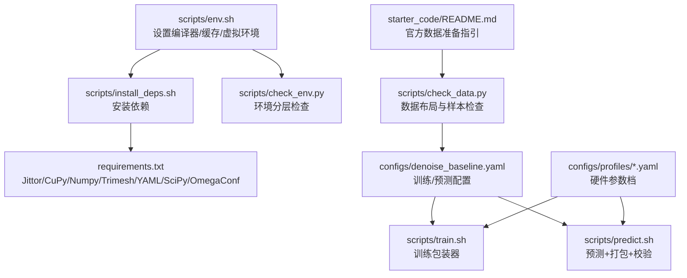
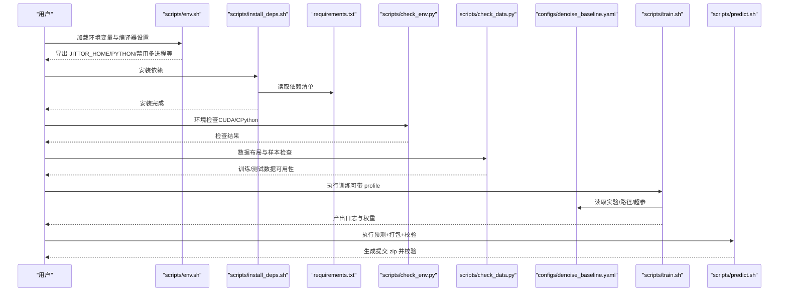
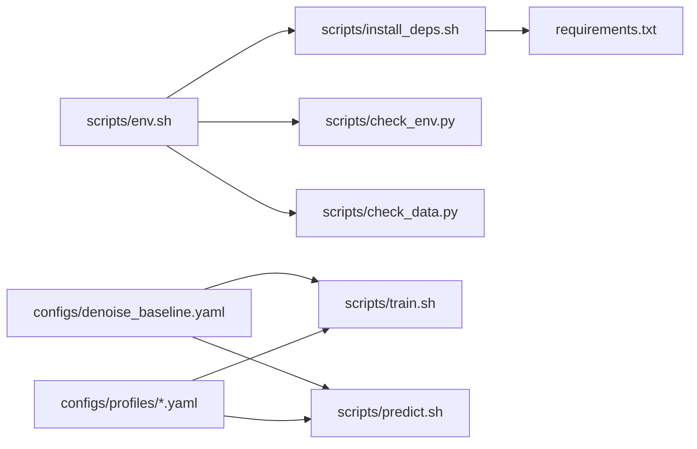

# 快速开始

<cite>
**本文引用的文件**
- [README.md](file://README.md)
- [README_REPRODUCE.md](file://README_REPRODUCE.md)
- [requirements.txt](file://requirements.txt)
- [starter_code/requirements.txt](file://starter_code/requirements.txt)
- [scripts/env.sh](file://scripts/env.sh)
- [scripts/install_deps.sh](file://scripts/install_deps.sh)
- [scripts/check_env.py](file://scripts/check_env.py)
- [scripts/check_data.py](file://scripts/check_data.py)
- [scripts/train.sh](file://scripts/train.sh)
- [scripts/predict.sh](file://scripts/predict.sh)
- [configs/denoise_baseline.yaml](file://configs/denoise_baseline.yaml)
- [configs/profiles/local_dev.yaml](file://configs/profiles/local_dev.yaml)
- [configs/profiles/a6000.yaml](file://configs/profiles/a6000.yaml)
- [starter_code/README.md](file://starter_code/README.md)
</cite>

## 目录
1. [简介](#简介)
2. [项目结构](#项目结构)
3. [核心组件](#核心组件)
4. [架构总览](#架构总览)
5. [详细组件分析](#详细组件分析)
6. [依赖关系分析](#依赖关系分析)
7. [性能注意事项](#性能注意事项)
8. [故障排查指南](#故障排查指南)
9. [结论](#结论)
10. [附录](#附录)

## 简介
本指南面向首次接触 Jittor 点云去噪项目的用户，帮助你在最短时间内完成环境搭建、数据准备、最小可运行命令与常见问题排查。项目提供了从环境检查、依赖安装、数据校验到训练与预测的完整流程，支持 CPU 与 CUDA 两种模式，并提供多类配置文件与硬件配置档以适配不同显卡与内存预算。

## 项目结构
仓库采用“脚本封装 + 配置驱动 + 基于 starter_code 的官方数据接口”的组织方式：
- scripts：环境初始化、依赖安装、训练/预测包装器、环境与数据检查工具
- configs：可复现实验的 YAML 配置，含 baseline 与多种模块化方案
- configs/profiles：针对不同硬件的参数档（如本地开发机、RTX 5060 Ti、RTX A6000）
- starter_code：官方 starter code 与数据清单，兼容官方数据格式
- 实验产物：experiments（日志、权重）、results（预测输出）

图表来源
- [scripts/env.sh:1-48](file://scripts/env.sh#L1-L48)
- [scripts/install_deps.sh:1-44](file://scripts/install_deps.sh#L1-L44)
- [requirements.txt:1-17](file://requirements.txt#L1-L17)
- [scripts/check_env.py:1-197](file://scripts/check_env.py#L1-L197)
- [scripts/check_data.py:1-103](file://scripts/check_data.py#L1-L103)
- [configs/denoise_baseline.yaml:1-44](file://configs/denoise_baseline.yaml#L1-L44)
- [scripts/train.sh:1-44](file://scripts/train.sh#L1-L44)
- [scripts/predict.sh:1-13](file://scripts/predict.sh#L1-L13)
- [configs/profiles/local_dev.yaml:1-19](file://configs/profiles/local_dev.yaml#L1-L19)
- [configs/profiles/a6000.yaml:1-29](file://configs/profiles/a6000.yaml#L1-L29)
- [starter_code/README.md:1-67](file://starter_code/README.md#L1-L67)

章节来源
- [README.md:52-106](file://README.md#L52-L106)
- [README_REPRODUCE.md:7-214](file://README_REPRODUCE.md#L7-L214)

## 核心组件
- 环境初始化与兼容性
  - 使用 scripts/env.sh 设置编译器、禁用 Jittor 多进程编译、指定 Jittor 缓存目录、可选激活虚拟环境、统一导出 PYTHON。
- 依赖安装
  - 使用 scripts/install_deps.sh 读取 requirements.txt 并安装，必要时补充安装 CUDA 12.x 对应的 CuPy。
- 环境检查
  - scripts/check_env.py 支持三档检查：纯 Python/NumPy 工具链、Jittor CPU、Jittor CUDA，便于分层定位问题。
- 数据检查
  - scripts/check_data.py 校验 paths.data_root、paths.test_root、训练列表是否存在，并抽样验证训练 mesh 与测试 noisy.npy。
- 训练包装器
  - scripts/train.sh 自动记录元信息、拷贝配置、执行训练并输出日志与产物目录。
- 预测与打包
  - scripts/predict.sh 依次执行 predict、zip、validate-zip，确保输出符合官方提交规范。

章节来源
- [scripts/env.sh:1-48](file://scripts/env.sh#L1-L48)
- [scripts/install_deps.sh:1-44](file://scripts/install_deps.sh#L1-L44)
- [scripts/check_env.py:166-197](file://scripts/check_env.py#L166-L197)
- [scripts/check_data.py:45-103](file://scripts/check_data.py#L45-L103)
- [scripts/train.sh:14-44](file://scripts/train.sh#L14-L44)
- [scripts/predict.sh:1-13](file://scripts/predict.sh#L1-L13)

## 架构总览
下图展示了从环境准备到训练/预测的端到端流程，以及关键脚本之间的协作关系。

图表来源
- [scripts/env.sh:1-48](file://scripts/env.sh#L1-L48)
- [scripts/install_deps.sh:1-44](file://scripts/install_deps.sh#L1-L44)
- [requirements.txt:1-17](file://requirements.txt#L1-L17)
- [scripts/check_env.py:166-197](file://scripts/check_env.py#L166-L197)
- [scripts/check_data.py:45-103](file://scripts/check_data.py#L45-L103)
- [configs/denoise_baseline.yaml:1-44](file://configs/denoise_baseline.yaml#L1-L44)
- [scripts/train.sh:14-44](file://scripts/train.sh#L14-L44)
- [scripts/predict.sh:1-13](file://scripts/predict.sh#L1-L13)

## 详细组件分析

### 环境搭建与兼容性
- Python 版本与虚拟环境
  - 推荐 Python 3.10–3.12；建议在 venv/conda 中安装，避免污染系统 Python。
  - scripts/env.sh 会自动探测 python3 或 python 并导出统一变量，同时可激活 starter_code/.venv。
- 编译器与 Jittor 缓存
  - 优先使用 gcc/g++-10 包装器；若默认编译器不被 Jittor 接受，可在 A6000 服务器上安装 gcc-10/g++-10。
  - 默认将 JITTOR_HOME 指向仓库内的 .jittor_home，避免写入到仓库根目录或用户 HOME。
- CUDA 与 CuPy
  - 在 CUDA 12.x 机器上需安装与 Jittor 兼容的 cupy-cuda12x；若安装缓慢，可使用镜像源。
- 环境检查策略
  - 分层检查：先验证 Python/NumPy 工具链，再验证 Jittor CPU，最后验证 CUDA 设备与 CuPy 可用性。

章节来源
- [README.md:108-143](file://README.md#L108-L143)
- [scripts/env.sh:11-48](file://scripts/env.sh#L11-L48)
- [scripts/check_env.py:89-164](file://scripts/check_env.py#L89-L164)

### 依赖安装流程
- 依赖清单
  - 核心依赖：Jittor、CuPy（CUDA 12.x）、Numpy、Trimesh、PyYAML、SciPy、OmegaConf、TQDM。
  - starter_code/requirements.txt 提供官方 starter code 的最小依赖集合。
- 安装步骤
  - 进入仓库根目录，加载环境脚本，执行安装脚本；安装完成后自动运行环境检查。
  - 若网络受限，可使用镜像源或离线 wheelhouse。

章节来源
- [requirements.txt:1-17](file://requirements.txt#L1-L17)
- [starter_code/requirements.txt:1-5](file://starter_code/requirements.txt#L1-L5)
- [scripts/install_deps.sh:13-44](file://scripts/install_deps.sh#L13-L44)

### 数据准备与校验
- 官方数据集
  - 训练集：dataset_train（包含 shapenet 子目录与 normalized mesh）
  - 测试集：dataset_test_noisy（包含 shapenet 子目录与 noisy.npy）
- 符号链接
  - 建议在仓库根目录创建指向真实数据路径的符号链接，确保 paths.data_root 与 paths.test_root 指向正确位置。
- 数据校验
  - scripts/check_data.py 会读取配置中的 paths.* 字段，检查目录与文件是否存在，并抽样验证训练 mesh 与测试 noisy.npy 的数量与形状。

章节来源
- [README.md:144-166](file://README.md#L144-L166)
- [starter_code/README.md:16-28](file://starter_code/README.md#L16-L28)
- [scripts/check_data.py:30-103](file://scripts/check_data.py#L30-L103)

### 最小可运行命令
- 环境与依赖
  - 加载环境：source scripts/env.sh
  - 安装依赖：bash scripts/install_deps.sh
  - 环境检查："$PYTHON" scripts/check_env.py --level jittor-cuda
- 数据检查
  - "$PYTHON" scripts/check_data.py --config configs/denoise_baseline.yaml --limit 5
- 训练
  - 基线训练：bash scripts/train.sh configs/denoise_baseline.yaml
  - 可选硬件参数档：bash scripts/train.sh configs/denoise_baseline.yaml configs/profiles/a6000.yaml
- 预测与提交
  - bash scripts/predict.sh configs/denoise_baseline.yaml
  - 或使用统一入口：source scripts/env.sh；"$PYTHON" scripts/unified_predict.py ...；"$PYTHON" scripts/check_submission.py ...

章节来源
- [README.md:96-102](file://README.md#L96-L102)
- [README.md:173-201](file://README.md#L173-L201)
- [README.md:217-248](file://README.md#L217-L248)
- [scripts/train.sh:14-44](file://scripts/train.sh#L14-L44)
- [scripts/predict.sh:1-13](file://scripts/predict.sh#L1-L13)

### 配置与硬件参数档
- 基线配置
  - experiment/name、paths.*、train.*、model.*、predict.* 均在 configs/denoise_baseline.yaml 中定义。
- 本地开发档
  - 适合小规模 smoke 测试与调试，降低 num_points/batch_size 与 steps。
- A6000 档
  - 面向大规模训练，提高 num_points/batch_size，并开启缓存清理、预取与性能剖析开关。

章节来源
- [configs/denoise_baseline.yaml:1-44](file://configs/denoise_baseline.yaml#L1-L44)
- [configs/profiles/local_dev.yaml:1-19](file://configs/profiles/local_dev.yaml#L1-L19)
- [configs/profiles/a6000.yaml:1-29](file://configs/profiles/a6000.yaml#L1-L29)

## 依赖关系分析
- 脚本间耦合
  - scripts/train.sh 依赖 scripts/env.sh 与 scripts/check_env.py、scripts/check_data.py；训练完成后输出日志与配置快照。
  - scripts/predict.sh 依赖 scripts/env.sh 与 configs/*；串联 predict、zip、validate-zip 三个阶段。
- 配置与参数档
  - configs/denoise_baseline.yaml 为主配置；configs/profiles/*.yaml 仅覆盖与硬件相关的超参，不改变核心方法。
- 外部依赖
  - Jittor、CuPy、Numpy、Trimesh、PyYAML、SciPy、OmegaConf、TQDM；其中 CuPy 版本与 CUDA 12.x 匹配。

图表来源
- [scripts/env.sh:1-48](file://scripts/env.sh#L1-L48)
- [scripts/install_deps.sh:1-44](file://scripts/install_deps.sh#L1-L44)
- [requirements.txt:1-17](file://requirements.txt#L1-L17)
- [scripts/check_env.py:166-197](file://scripts/check_env.py#L166-L197)
- [scripts/check_data.py:45-103](file://scripts/check_data.py#L45-L103)
- [configs/denoise_baseline.yaml:1-44](file://configs/denoise_baseline.yaml#L1-L44)
- [scripts/train.sh:14-44](file://scripts/train.sh#L14-L44)
- [scripts/predict.sh:1-13](file://scripts/predict.sh#L1-L13)
- [configs/profiles/local_dev.yaml:1-19](file://configs/profiles/local_dev.yaml#L1-L19)
- [configs/profiles/a6000.yaml:1-29](file://configs/profiles/a6000.yaml#L1-L29)

章节来源
- [README_REPRODUCE.md:30-131](file://README_REPRODUCE.md#L30-L131)

## 性能注意事项
- 编译器与多进程
  - 默认禁用 Jittor 多进程编译，减少服务器环境下的编译不稳定；如需加速可按需调整。
- 缓存与预取
  - A6000 参数档提供缓存清理、预取工作线程与队列大小、系统采样等选项，有助于缓解输入管线瓶颈。
- 分块推理
  - 推理阶段采用 contiguous chunk 分块策略，优先保证不爆显存；后续可升级为 FPS/KNN overlapping patch + weighted stitching。

章节来源
- [scripts/env.sh:18-24](file://scripts/env.sh#L18-L24)
- [configs/profiles/a6000.yaml:13-21](file://configs/profiles/a6000.yaml#L13-L21)
- [README_REPRODUCE.md:211-214](file://README_REPRODUCE.md#L211-L214)

## 故障排查指南
- 环境检查失败
  - Python/NumPy 工具链：确认已安装对应模块；使用 --level python 检查。
  - Jittor CPU：确认 Jittor 可导入，版本与路径正常。
  - Jittor CUDA：确认 CuPy 可用、GPU 可见、驱动与编译器匹配；使用 --level jittor-cuda 检查。
  - Jittor 缓存目录：确保 JITTOR_HOME 指向可写路径（默认 .jittor_home）。
- CUDA 与 CuPy
  - CUDA 12.x 机器需安装与 Jittor 兼容的 cupy-cuda12x；若安装缓慢，使用镜像源。
- 编译器问题
  - 若默认编译器不被 Jittor 接受，安装 gcc-10/g++-10，并确保 scripts/env.sh 中的 CC/CXX 指向 10.x。
- 数据路径
  - 确认 paths.data_root、paths.test_root、训练列表存在；使用 scripts/check_data.py 抽样验证。
- 训练/预测日志
  - 查看 experiments/runs/<run_id>/train.log 与 meta.txt，定位配置与环境差异。

章节来源
- [scripts/check_env.py:89-164](file://scripts/check_env.py#L89-L164)
- [scripts/check_env.py:166-197](file://scripts/check_env.py#L166-L197)
- [scripts/check_data.py:45-103](file://scripts/check_data.py#L45-L103)
- [scripts/train.sh:25-44](file://scripts/train.sh#L25-L44)

## 结论
通过本指南，你可以完成从环境准备、依赖安装、数据校验到最小可运行训练与预测的全流程。建议优先使用本地开发档进行 smoke 测试，确认无误后再切换到更贴近正式训练的硬件参数档。遇到问题时，利用分层环境检查与数据检查工具快速定位根因。

## 附录
- 快速命令清单
  - 环境与依赖：source scripts/env.sh；bash scripts/install_deps.sh；"$PYTHON" scripts/check_env.py --level jittor-cuda
  - 数据检查："$PYTHON" scripts/check_data.py --config configs/denoise_baseline.yaml --limit 5
  - 训练：bash scripts/train.sh configs/denoise_baseline.yaml
  - 预测与提交：bash scripts/predict.sh configs/denoise_baseline.yaml
- 官方数据准备参考
  - starter_code/README.md 提供了官方数据集的解压与目录结构说明。

章节来源
- [README.md:96-102](file://README.md#L96-L102)
- [README.md:173-201](file://README.md#L173-L201)
- [README.md:217-248](file://README.md#L217-L248)
- [starter_code/README.md:16-28](file://starter_code/README.md#L16-L28)