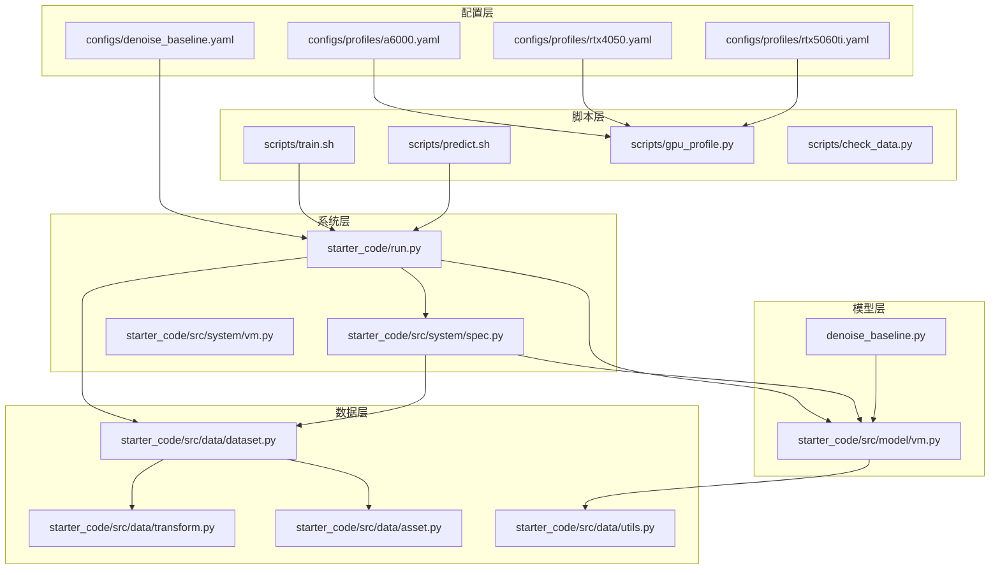
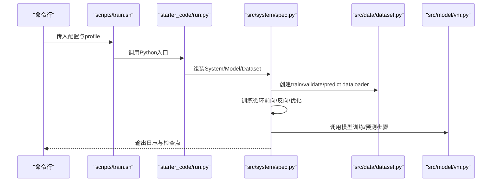
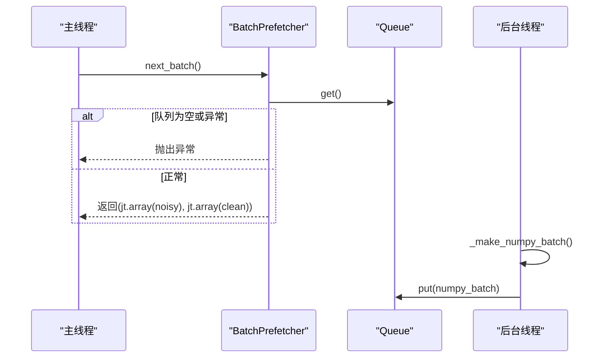
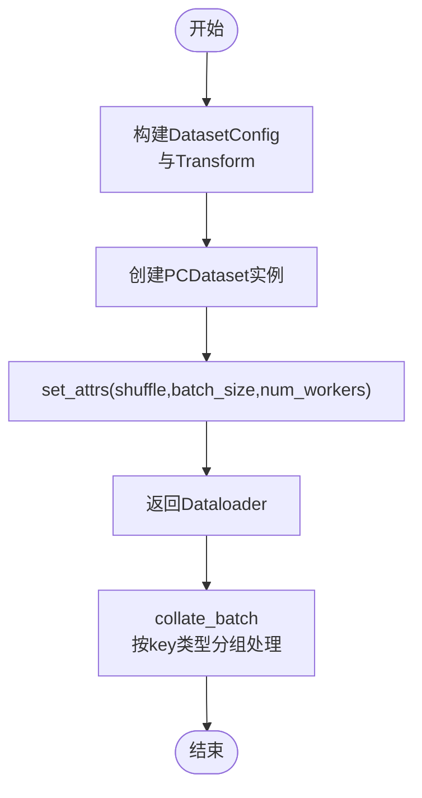
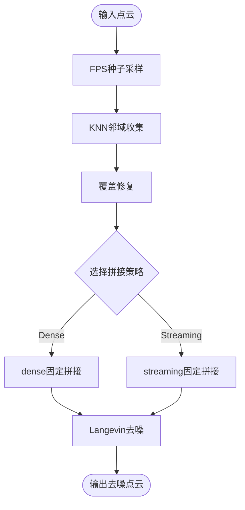
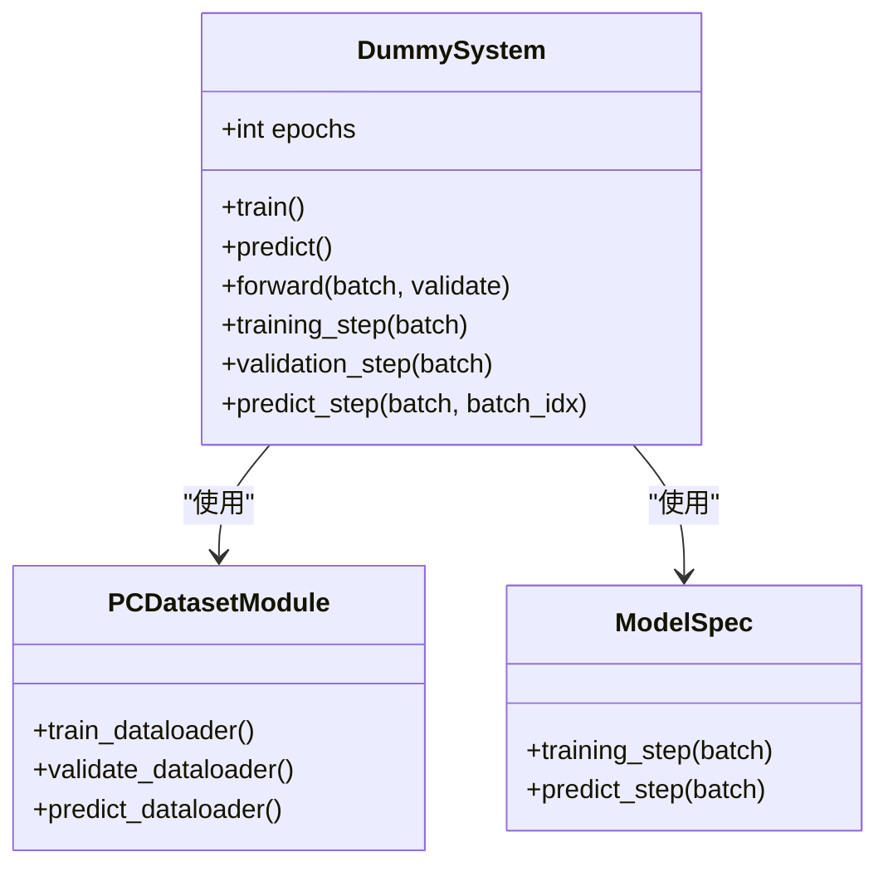
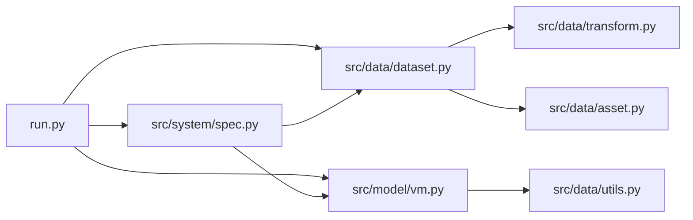

# 性能优化

<cite>
**本文引用的文件**
- [configs/profiles/a6000.yaml](file://configs/profiles/a6000.yaml)
- [configs/profiles/rtx4050.yaml](file://configs/profiles/rtx4050.yaml)
- [configs/profiles/rtx5060ti.yaml](file://configs/profiles/rtx5060ti.yaml)
- [scripts/gpu_profile.py](file://scripts/gpu_profile.py)
- [starter_code/src/data/dataset.py](file://starter_code/src/data/dataset.py)
- [starter_code/src/data/utils.py](file://starter_code/src/data/utils.py)
- [starter_code/src/model/vm.py](file://starter_code/src/model/vm.py)
- [starter_code/src/system/spec.py](file://starter_code/src/system/spec.py)
- [starter_code/src/system/vm.py](file://starter_code/src/system/vm.py)
- [starter_code/src/data/transform.py](file://starter_code/src/data/transform.py)
- [starter_code/src/data/asset.py](file://starter_code/src/data/asset.py)
- [starter_code/run.py](file://starter_code/run.py)
- [scripts/train.sh](file://scripts/train.sh)
- [scripts/predict.sh](file://scripts/predict.sh)
- [scripts/check_data.py](file://scripts/check_data.py)
- [denoise_baseline.py](file://denoise_baseline.py)
</cite>

## 目录
1. [简介](#简介)
2. [项目结构](#项目结构)
3. [核心组件](#核心组件)
4. [架构总览](#架构总览)
5. [详细组件分析](#详细组件分析)
6. [依赖分析](#依赖分析)
7. [性能考虑](#性能考虑)
8. [故障排查指南](#故障排查指南)
9. [结论](#结论)
10. [附录](#附录)

## 简介
本指南面向Jittor点云去噪项目的性能优化，聚焦以下目标：
- GPU配置优化策略：基于不同显存容量给出最佳配置参数与内存使用建议。
- 数据预取器BatchPrefetcher的工作原理与性能影响评估。
- 训练效率提升技巧：批大小、学习率调度与数据加载优化。
- 内存使用监控与优化：避免OOM的实用方法。
- 不同硬件配置下的性能基准与调优建议。
- 性能瓶颈识别与分析方法。

## 项目结构
该项目采用分层设计：配置层（YAML）、系统层（训练/预测流程）、数据层（Dataset/Transform/Asset）、模型层（Feature/Decoder/VelocityModule），并通过脚本进行环境校验、训练与预测。

图表来源
- [starter_code/run.py:1-140](file://starter_code/run.py#L1-L140)
- [starter_code/src/system/spec.py:1-208](file://starter_code/src/system/spec.py#L1-L208)
- [starter_code/src/data/dataset.py:1-269](file://starter_code/src/data/dataset.py#L1-L269)
- [starter_code/src/model/vm.py:1-415](file://starter_code/src/model/vm.py#L1-L415)
- [denoise_baseline.py:1-800](file://denoise_baseline.py#L1-L800)

章节来源
- [starter_code/run.py:1-140](file://starter_code/run.py#L1-L140)
- [starter_code/src/system/spec.py:1-208](file://starter_code/src/system/spec.py#L1-L208)
- [starter_code/src/data/dataset.py:1-269](file://starter_code/src/data/dataset.py#L1-L269)
- [starter_code/src/model/vm.py:1-415](file://starter_code/src/model/vm.py#L1-L415)
- [denoise_baseline.py:1-800](file://denoise_baseline.py#L1-L800)

## 核心组件
- 配置与硬件推荐
  - A6000（48GB）：提高num_points与batch_size，启用缓存与预取参数，便于大规模训练与正式消融。
  - RTX 5060 Ti（8GB/16GB）：适当下调batch_size与num_points，避免显存不足。
  - RTX 4050（约6GB）：以baseline可比对为目标，优先降低batch_size与num_points。
  - 自动推荐脚本根据nvidia-smi查询GPU名称与显存，给出安全配置建议与训练命令模板。
- 数据加载与批处理
  - Dataset/Dataloader封装：支持shuffle、batch_size、num_workers等参数，统一train/validate/predict的数据流。
  - Transform/Augment：在数据加载阶段完成几何变换与增强，减少训练时开销。
  - Asset：承载点云与网格元信息，支撑推理阶段的拼接策略。
- 模型与推理
  - VelocityModule：监督损失、Langevin去噪迭代、推理阶段的patch-based去噪与拼接（dense/streaming）。
  - Patch stitching：覆盖修复与固定拼接策略，支持自动/Streaming模式以适配大云。
- 训练系统
  - DummySystem：封装训练循环、验证、预测、日志与保存，支持自定义Writer。
  - 优化器与损失：支持SGD/Adam，按配置聚合多任务损失。

章节来源
- [configs/profiles/a6000.yaml:1-29](file://configs/profiles/a6000.yaml#L1-L29)
- [configs/profiles/rtx4050.yaml:1-20](file://configs/profiles/rtx4050.yaml#L1-L20)
- [configs/profiles/rtx5060ti.yaml:1-20](file://configs/profiles/rtx5060ti.yaml#L1-L20)
- [scripts/gpu_profile.py:1-60](file://scripts/gpu_profile.py#L1-L60)
- [starter_code/src/data/dataset.py:1-269](file://starter_code/src/data/dataset.py#L1-L269)
- [starter_code/src/data/transform.py:1-26](file://starter_code/src/data/transform.py#L1-L26)
- [starter_code/src/data/asset.py:1-49](file://starter_code/src/data/asset.py#L1-L49)
- [starter_code/src/system/spec.py:1-208](file://starter_code/src/system/spec.py#L1-L208)
- [starter_code/src/system/vm.py:1-59](file://starter_code/src/system/vm.py#L1-L59)
- [starter_code/src/model/vm.py:1-415](file://starter_code/src/model/vm.py#L1-L415)

## 架构总览
训练/预测流程通过配置驱动，系统层负责执行训练与推理，数据层负责加载与转换，模型层负责网络与推理策略。

图表来源
- [scripts/train.sh:1-44](file://scripts/train.sh#L1-L44)
- [starter_code/run.py:1-140](file://starter_code/run.py#L1-L140)
- [starter_code/src/system/spec.py:147-191](file://starter_code/src/system/spec.py#L147-L191)
- [starter_code/src/data/dataset.py:95-145](file://starter_code/src/data/dataset.py#L95-L145)
- [starter_code/src/model/vm.py:94-108](file://starter_code/src/model/vm.py#L94-L108)

## 详细组件分析

### GPU配置与硬件推荐
- A6000（48GB）
  - 建议：增大num_points与batch_size，开启cache_clean与预取参数，便于大规模训练与正式消融。
  - 关键参数：num_points、batch_size、prefetch_workers、prefetch_queue_size、cache_clean。
- RTX 5060 Ti（8GB/16GB）
  - 建议：若显存8GB，优先降低batch_size或num_points；16GB可尝试更大值。
  - 关键参数：num_points、batch_size、k、feat_dim等模型维度。
- RTX 4050（约6GB）
  - 建议：以baseline可比对为目标，优先降低batch_size与num_points。
- 自动推荐
  - 通过nvidia-smi查询GPU名称与显存，输出推荐profile与训练命令模板，避免误配导致OOM。

章节来源
- [configs/profiles/a6000.yaml:1-29](file://configs/profiles/a6000.yaml#L1-L29)
- [configs/profiles/rtx4050.yaml:1-20](file://configs/profiles/rtx4050.yaml#L1-L20)
- [configs/profiles/rtx5060ti.yaml:1-20](file://configs/profiles/rtx5060ti.yaml#L1-L20)
- [scripts/gpu_profile.py:13-56](file://scripts/gpu_profile.py#L13-L56)

### BatchPrefetcher后台数据预取器
- 工作原理
  - 使用后台线程生成NumPy批次，主工作线程仅处理Jittor张量，降低CUDA/Jittor线程风险。
  - 通过队列缓冲，控制workers与queue_size，平衡CPU/GPU利用率。
- 性能影响
  - 在CPU受限场景下显著减少GPU空闲时间；在IO受限场景下需谨慎设置queue_size，避免内存压力。
  - 与系统层的tqdm进度条配合，有助于观察吞吐与等待时间。

图表来源
- [denoise_baseline.py:175-227](file://denoise_baseline.py#L175-L227)

章节来源
- [denoise_baseline.py:175-227](file://denoise_baseline.py#L175-L227)

### 数据加载与批处理优化
- Dataset/Dataloader
  - 支持shuffle、batch_size、num_workers等参数，统一train/validate/predict的数据流。
  - 通过split_by_cls拆分不同类别，便于分类验证。
- Transform/Augment
  - 在数据加载阶段完成几何变换与增强，减少训练时开销。
- Collate策略
  - 将张量按stack/concat方式合并，非张量字段直接保留，确保批内数据结构一致。

图表来源
- [starter_code/src/data/dataset.py:147-167](file://starter_code/src/data/dataset.py#L147-L167)
- [starter_code/src/data/dataset.py:205-263](file://starter_code/src/data/dataset.py#L205-L263)

章节来源
- [starter_code/src/data/dataset.py:1-269](file://starter_code/src/data/dataset.py#L1-L269)
- [starter_code/src/data/transform.py:1-26](file://starter_code/src/data/transform.py#L1-L26)

### 模型与推理策略
- VelocityModule
  - 监督损失：随机采样点子集，计算目标方向与解码器输出的均方误差。
  - 推理：支持patch-based去噪与两种拼接策略（dense与streaming），自动/Streaming模式由环境变量控制。
- Patch stitching
  - 覆盖修复：确保每个输入点至少被一个patch覆盖，避免输出点数丢失。
  - Streaming版本：在CPU上计算最优归属，避免P×N稠密存储，降低显存峰值。

图表来源
- [starter_code/src/model/vm.py:209-302](file://starter_code/src/model/vm.py#L209-L302)
- [starter_code/src/model/vm.py:333-414](file://starter_code/src/model/vm.py#L333-L414)

章节来源
- [starter_code/src/model/vm.py:1-415](file://starter_code/src/model/vm.py#L1-L415)

### 训练系统与优化器
- DummySystem
  - 训练循环：遍历dataloader，前向/反向/优化，支持多类别验证与检查点保存。
  - 预测循环：遍历预测dataloader，调用Writer写入结果。
- 优化器与损失
  - 支持SGD/Adam，按配置聚合多任务损失，便于扩展。

图表来源
- [starter_code/src/system/spec.py:38-191](file://starter_code/src/system/spec.py#L38-L191)

章节来源
- [starter_code/src/system/spec.py:1-208](file://starter_code/src/system/spec.py#L1-L208)

### 脚本与工具链
- 训练脚本
  - scripts/train.sh：复制配置与profile，检查环境与数据，执行训练并记录元信息。
- 预测脚本
  - scripts/predict.sh：依次执行预测、打包与校验。
- 数据检查
  - scripts/check_data.py：校验数据根目录、训练列表与测试噪声文件存在性。
- GPU推荐
  - scripts/gpu_profile.py：自动推荐profile并打印训练命令模板。

章节来源
- [scripts/train.sh:1-44](file://scripts/train.sh#L1-L44)
- [scripts/predict.sh:1-13](file://scripts/predict.sh#L1-L13)
- [scripts/check_data.py:1-103](file://scripts/check_data.py#L1-L103)
- [scripts/gpu_profile.py:1-60](file://scripts/gpu_profile.py#L1-L60)

## 依赖分析
- 组件耦合
  - run.py作为入口，装配System/Model/Dataset，耦合度中等，职责清晰。
  - System层依赖Dataset与Model，负责训练/验证/预测生命周期。
  - Dataset层依赖Transform与Asset，负责数据读取与批合并。
  - Model层依赖Feature/Decoder与utils，负责几何采样与推理。
- 外部依赖
  - Jittor、NumPy、trimesh、PyYAML、tqdm等。
- 潜在环依赖
  - 未发现直接环依赖；配置通过YAML合并，注意深层嵌套字段覆盖顺序。

图表来源
- [starter_code/run.py:1-140](file://starter_code/run.py#L1-L140)
- [starter_code/src/system/spec.py:1-208](file://starter_code/src/system/spec.py#L1-L208)
- [starter_code/src/data/dataset.py:1-269](file://starter_code/src/data/dataset.py#L1-L269)
- [starter_code/src/model/vm.py:1-415](file://starter_code/src/model/vm.py#L1-L415)
- [starter_code/src/data/transform.py:1-26](file://starter_code/src/data/transform.py#L1-L26)
- [starter_code/src/data/asset.py:1-49](file://starter_code/src/data/asset.py#L1-L49)
- [starter_code/src/data/utils.py:1-286](file://starter_code/src/data/utils.py#L1-L286)

章节来源
- [starter_code/run.py:1-140](file://starter_code/run.py#L1-L140)
- [starter_code/src/system/spec.py:1-208](file://starter_code/src/system/spec.py#L1-L208)
- [starter_code/src/data/dataset.py:1-269](file://starter_code/src/data/dataset.py#L1-L269)
- [starter_code/src/model/vm.py:1-415](file://starter_code/src/model/vm.py#L1-L415)

## 性能考虑
- GPU配置优化策略
  - A6000：增大num_points与batch_size，启用cache_clean与预取参数，结合profile_times与profile_system_every进行系统级剖析。
  - RTX 5060 Ti：显存8GB优先降batch_size或num_points；16GB可适度放宽。
  - RTX 4050：以baseline可比对为目标，优先降低batch_size与num_points。
- 数据加载优化
  - 合理设置num_workers与prefetch_queue_size，避免CPU过载或内存压力。
  - 使用cache_clean减少重复加载与归一化开销。
- 训练效率提升
  - 批大小：从profile建议起步，逐步扩大至显存上限附近，观察GPU利用率与吞吐。
  - 学习率：从baseline lr起步，结合学习率调度（如余弦退火）与warmup策略。
  - 数据增强：在Transform中完成几何变换，减少训练时CPU负担。
- 内存使用监控与优化
  - 利用nvidia-smi与系统脚本监控GPU利用率与显存占用。
  - Streaming拼接策略在大云场景下显著降低显存峰值。
  - 严格控制批内张量形状与拼接维度，避免不必要的广播与堆叠。
- 性能基准与调优建议
  - 基于不同profile进行对比实验，记录吞吐、GPU利用率与显存峰值。
  - 通过log_every与save_every控制日志频率，平衡可观测性与I/O开销。
- 瓶颈识别方法
  - 使用profile_times与profile_system_every输出系统统计，定位数据管道瓶颈。
  - 观察训练循环中的等待时间与CPU/GPU利用率，判断是CPU瓶颈还是GPU瓶颈。

## 故障排查指南
- OOM（显存不足）
  - 降低batch_size与num_points；切换Streaming拼接策略；关闭cache_clean或减小其范围。
  - 检查Transform与Collate是否引入额外张量副本。
- 数据加载缓慢
  - 提高num_workers与prefetch_queue_size；确认磁盘IO与路径可达性。
  - 使用check_data.py快速验证数据布局与文件存在性。
- 训练停滞或低效
  - 检查GPU利用率与CPU利用率，区分CPU瓶颈与GPU瓶颈。
  - 使用scalar函数与日志输出确认损失数值与梯度状态。
- 推理输出点数不一致
  - 确认patch stitching覆盖修复逻辑生效；检查环境变量VM_STITCHING与VM_STREAMING_MIN_POINTS。

章节来源
- [starter_code/src/system/spec.py:147-191](file://starter_code/src/system/spec.py#L147-L191)
- [starter_code/src/model/vm.py:114-139](file://starter_code/src/model/vm.py#L114-L139)
- [starter_code/src/data/dataset.py:205-263](file://starter_code/src/data/dataset.py#L205-L263)
- [scripts/check_data.py:45-103](file://scripts/check_data.py#L45-L103)
- [denoise_baseline.py:149-164](file://denoise_baseline.py#L149-L164)

## 结论
通过合理的GPU配置、数据预取与批处理策略、模型推理拼接优化以及系统级监控，可在不同硬件条件下获得稳定的训练与推理性能。建议以profile为起点，结合实际显存与CPU能力进行微调，并持续使用系统脚本与日志进行瓶颈定位与回归验证。

## 附录
- 快速检查清单
  - 使用scripts/gpu_profile.py自动推荐profile。
  - 使用scripts/check_data.py校验数据布局。
  - 使用scripts/train.sh与scripts/predict.sh标准化训练/预测流程。
  - 在configs/profiles中选择合适硬件配置，必要时微调num_points/batch_size等关键参数。