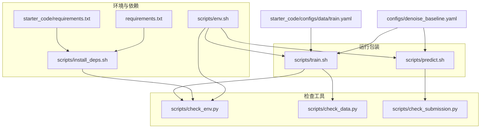
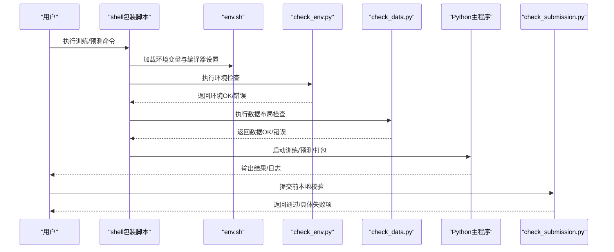
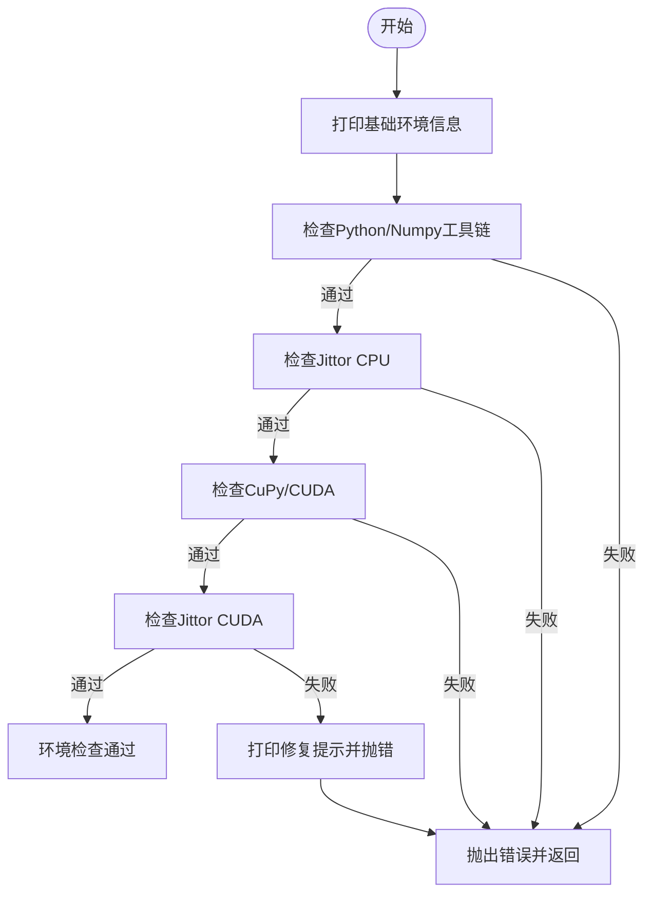
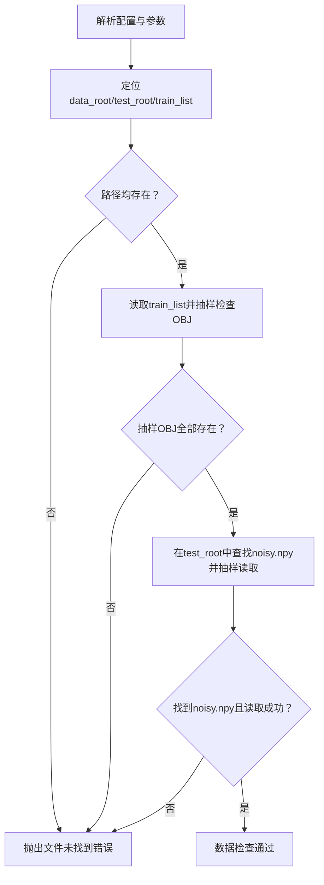
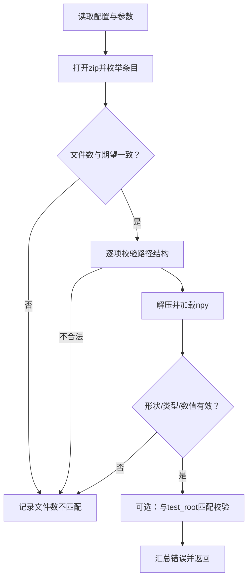
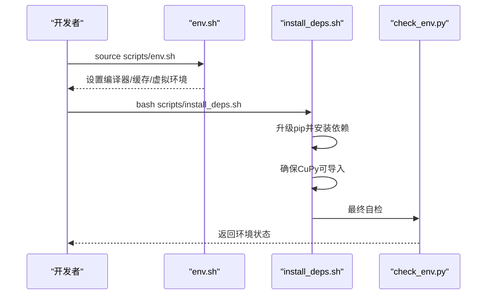
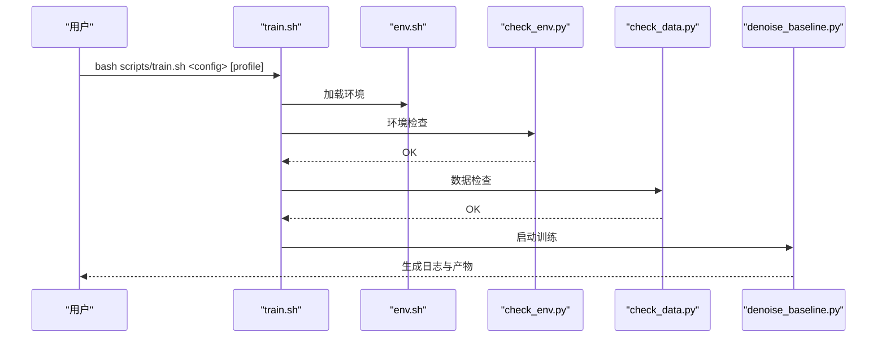
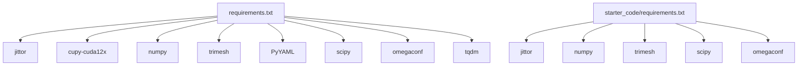

# 故障排除

<cite>
**本文引用的文件**
- [scripts/check_env.py](file://scripts/check_env.py)
- [scripts/check_data.py](file://scripts/check_data.py)
- [scripts/check_submission.py](file://scripts/check_submission.py)
- [scripts/install_deps.sh](file://scripts/install_deps.sh)
- [scripts/env.sh](file://scripts/env.sh)
- [scripts/freeze_env.sh](file://scripts/freeze_env.sh)
- [scripts/gpu_profile.py](file://scripts/gpu_profile.py)
- [scripts/train.sh](file://scripts/train.sh)
- [scripts/predict.sh](file://scripts/predict.sh)
- [requirements.txt](file://requirements.txt)
- [starter_code/requirements.txt](file://starter_code/requirements.txt)
- [configs/denoise_baseline.yaml](file://configs/denoise_baseline.yaml)
- [starter_code/configs/data/train.yaml](file://starter_code/configs/data/train.yaml)
- [README.md](file://README.md)
</cite>

## 目录
1. [简介](#简介)
2. [项目结构](#项目结构)
3. [核心组件](#核心组件)
4. [架构总览](#架构总览)
5. [详细组件分析](#详细组件分析)
6. [依赖分析](#依赖分析)
7. [性能考虑](#性能考虑)
8. [故障排除指南](#故障排除指南)
9. [结论](#结论)
10. [附录](#附录)

## 简介
本指南面向Jittor点云去噪项目的开发者与评测参与者，聚焦于“环境配置错误、依赖冲突、数据加载失败、提交包校验失败、性能问题”等常见问题的诊断与解决。文档基于仓库内已有的环境检查、数据检查、提交校验、安装与运行脚本，提供系统化的排障流程、工具使用方法、调试技巧与日志分析要点，并给出预防性维护建议与社区支持渠道。

## 项目结构
围绕故障排除的关键文件与脚本分布如下：
- 环境与依赖：scripts/env.sh、scripts/install_deps.sh、requirements.txt、starter_code/requirements.txt
- 环境自检：scripts/check_env.py
- 数据布局检查：scripts/check_data.py
- 提交包校验：scripts/check_submission.py
- 训练与预测包装：scripts/train.sh、scripts/predict.sh
- 配置与示例：configs/denoise_baseline.yaml、starter_code/configs/data/train.yaml
- 文档与入口：README.md

图表来源
- [scripts/env.sh:1-48](file://scripts/env.sh#L1-L48)
- [scripts/install_deps.sh:1-44](file://scripts/install_deps.sh#L1-L44)
- [requirements.txt:1-17](file://requirements.txt#L1-L17)
- [starter_code/requirements.txt:1-5](file://starter_code/requirements.txt#L1-L5)
- [scripts/check_env.py:1-197](file://scripts/check_env.py#L1-L197)
- [scripts/check_data.py:1-103](file://scripts/check_data.py#L1-L103)
- [scripts/check_submission.py:1-192](file://scripts/check_submission.py#L1-L192)
- [scripts/train.sh:1-44](file://scripts/train.sh#L1-L44)
- [scripts/predict.sh:1-13](file://scripts/predict.sh#L1-L13)
- [configs/denoise_baseline.yaml:1-44](file://configs/denoise_baseline.yaml#L1-L44)
- [starter_code/configs/data/train.yaml:1-34](file://starter_code/configs/data/train.yaml#L1-L34)

章节来源
- [README.md:52-77](file://README.md#L52-L77)

## 核心组件
- 环境检查工具：分层检测Python/Numpy工具链、Jittor CPU/CUDA可用性、GPU可见性与驱动状态，输出可操作的修复提示。
- 数据检查工具：校验数据根目录、测试集根目录、训练列表是否存在，抽样验证OBJ文件与noisy.npy文件的形状与类型。
- 提交校验工具：对压缩包进行结构、条目数量、形状、数据类型、数值有效性与可选的test_root匹配校验。
- 安装与环境脚本：统一设置编译器、禁用多进程编译、隔离Jittor缓存、自动安装依赖并再次自检。
- 训练/预测包装：标准化实验目录、复制配置、执行环境与数据检查、记录元信息与日志。

章节来源
- [scripts/check_env.py:89-164](file://scripts/check_env.py#L89-L164)
- [scripts/check_data.py:45-100](file://scripts/check_data.py#L45-L100)
- [scripts/check_submission.py:68-156](file://scripts/check_submission.py#L68-L156)
- [scripts/install_deps.sh:34-43](file://scripts/install_deps.sh#L34-L43)
- [scripts/train.sh:25-41](file://scripts/train.sh#L25-L41)
- [scripts/predict.sh:8-13](file://scripts/predict.sh#L8-L13)

## 架构总览
下图展示从命令到工具与配置的交互关系，以及关键的失败点与回退策略。

图表来源
- [scripts/train.sh:12-41](file://scripts/train.sh#L12-L41)
- [scripts/predict.sh:7-13](file://scripts/predict.sh#L7-L13)
- [scripts/check_env.py:166-196](file://scripts/check_env.py#L166-L196)
- [scripts/check_data.py:45-100](file://scripts/check_data.py#L45-L100)
- [scripts/check_submission.py:158-191](file://scripts/check_submission.py#L158-L191)

## 详细组件分析

### 环境检查工具（check_env.py）
- 分层检查策略：先基础环境（Python版本、编译器、CUDA可见性），再纯Python工具链，再Jittor CPU，最后Jittor CUDA。
- 关键检查点：
  - 基础环境：平台信息、JITTOR_HOME、CC/CXX、CUDA_VISIBLE_DEVICES、nvidia-smi查询。
  - Python/Numpy：模块导入与版本打印，缺失模块给出安装建议。
  - CuPy/CUDA：运行时版本、可见设备数；若请求CUDA但无设备则报错。
  - Jittor：导入后执行简单算子，CPU/CUDA分别输出版本与计算结果；针对只读缓存目录给出明确修复建议。
- 错误处理：捕获异常并继续打印上下文，最终由调用层决定失败退出。

图表来源
- [scripts/check_env.py:55-196](file://scripts/check_env.py#L55-L196)

章节来源
- [scripts/check_env.py:89-164](file://scripts/check_env.py#L89-L164)

### 数据检查工具（check_data.py）
- 输入参数：支持通过配置文件与profile叠加paths.*字段，或直接传参覆盖。
- 校验内容：
  - 目录存在性：data_root、test_root、train_list。
  - 训练样本抽样：根据train_list中的模型ID，检查对应的OBJ文件是否存在。
  - 测试样本抽样：在test_root下查找noisy.npy，读取其形状与dtype并打印。
- 失败条件：任一路径不存在、抽样OBJ缺失、未找到noisy.npy、读取失败。

图表来源
- [scripts/check_data.py:30-100](file://scripts/check_data.py#L30-L100)

章节来源
- [scripts/check_data.py:45-100](file://scripts/check_data.py#L45-L100)

### 提交校验工具（check_submission.py）
- 功能：对官方提交包进行结构、数量、形状、数据类型、数值有效性与可选的test_root匹配校验。
- 校验维度：
  - 结构：固定路径模式shapenet/<category>/<model>/denoised.npy。
  - 数量：zip内文件数与期望一致，去重校验。
  - 形状与类型：Nx3二维数组、数值型dtype、可选float32要求。
  - 数值：全为有限值（非NaN/Inf）。
  - 匹配：与test_root下的noisy树结构一一对应。
- 输出：汇总所有错误项，超过阈值截断显示。

图表来源
- [scripts/check_submission.py:68-156](file://scripts/check_submission.py#L68-L156)

章节来源
- [scripts/check_submission.py:68-156](file://scripts/check_submission.py#L68-L156)

### 安装与环境脚本（install_deps.sh、env.sh、freeze_env.sh）
- env.sh：统一设置编译器、禁用Jittor多进程编译、隔离Jittor缓存目录、激活虚拟环境、选择Python可执行文件。
- install_deps.sh：升级pip/setuptools/wheel，按镜像源或wheelhouse安装依赖，确保CuPy可导入，最后执行环境自检。
- freeze_env.sh：冻结当前环境信息（Python版本、pip freeze、nvidia-smi），便于复现与对比。

图表来源
- [scripts/env.sh:11-47](file://scripts/env.sh#L11-L47)
- [scripts/install_deps.sh:21-43](file://scripts/install_deps.sh#L21-L43)
- [scripts/check_env.py:166-196](file://scripts/check_env.py#L166-L196)

章节来源
- [scripts/env.sh:11-47](file://scripts/env.sh#L11-L47)
- [scripts/install_deps.sh:21-43](file://scripts/install_deps.sh#L21-L43)
- [scripts/freeze_env.sh:8-22](file://scripts/freeze_env.sh#L8-L22)

### 训练/预测包装（train.sh、predict.sh）
- train.sh：创建实验目录、复制配置与profile、执行环境与数据检查、记录元信息、启动训练并保存日志。
- predict.sh：依次执行预测、打包与提交校验，确保产出符合官方规范。

图表来源
- [scripts/train.sh:12-41](file://scripts/train.sh#L12-L41)
- [scripts/predict.sh:7-13](file://scripts/predict.sh#L7-L13)

章节来源
- [scripts/train.sh:12-41](file://scripts/train.sh#L12-L41)
- [scripts/predict.sh:7-13](file://scripts/predict.sh#L7-L13)

## 依赖分析
- Python与框架：Jittor、NumPy、Trimesh、PyYAML、SciPy、OmegaConf、tqdm。
- CUDA相关：CuPy 13.x（与项目NumPy版本兼容），用于Jittor CUDA后端。
- 版本约束：requirements.txt对Jittor、CuPy、NumPy等做了范围约束，避免破坏性更新导致的不兼容。
- starter_code/requirements.txt：轻量依赖集合，适配starter_code最小运行环境。

图表来源
- [requirements.txt:5-17](file://requirements.txt#L5-L17)
- [starter_code/requirements.txt:1-5](file://starter_code/requirements.txt#L1-L5)

章节来源
- [requirements.txt:5-17](file://requirements.txt#L5-L17)
- [starter_code/requirements.txt:1-5](file://starter_code/requirements.txt#L1-L5)

## 性能考虑
- GPU推荐与内存适配：使用GPU查询脚本根据可见GPU与显存大小推荐合适的训练profile，优先单卡A6000，再考虑多卡。
- 缓存与编译稳定性：通过env.sh禁用Jittor多进程编译，减少服务器环境不稳定引发的编译失败。
- 日志与元信息：train.sh会记录配置、profile、命令、时间戳与git状态，便于定位性能回归与配置漂移。

章节来源
- [scripts/gpu_profile.py:13-56](file://scripts/gpu_profile.py#L13-L56)
- [scripts/env.sh:18-24](file://scripts/env.sh#L18-L24)
- [scripts/train.sh:32-39](file://scripts/train.sh#L32-L39)

## 故障排除指南

### 一、环境配置错误
- 症状
  - 导入Jittor失败、只读文件系统导致缓存写入失败、CUDA不可用、编译器不可见。
- 诊断步骤
  - 使用环境检查工具分层验证：先基础环境，再Python工具链，再Jittor CPU/CUDA。
  - 确认编译器与缓存目录：查看CC/CXX、JITTOR_HOME、CUDA_VISIBLE_DEVICES。
  - 若Jittor缓存位于只读分区，需通过env.sh将JITTOR_HOME指向可写目录。
- 解决方案
  - 重新加载环境：source scripts/env.sh。
  - 安装依赖并自检：bash scripts/install_deps.sh。
  - 如需镜像加速，设置PIP_INDEX_URL后重试。

章节来源
- [scripts/check_env.py:55-196](file://scripts/check_env.py#L55-L196)
- [scripts/env.sh:11-47](file://scripts/env.sh#L11-L47)
- [scripts/install_deps.sh:21-43](file://scripts/install_deps.sh#L21-L43)

### 二、依赖冲突
- 症状
  - CuPy版本与NumPy版本不兼容，导致导入失败或训练阶段崩溃。
- 诊断步骤
  - 查看pip freeze与nvidia-smi，确认CuPy版本范围与NumPy版本是否满足项目约束。
  - 使用freeze_env.sh冻结当前环境，便于对比与复现。
- 解决方案
  - 严格按requirements.txt安装，确保cupy-cuda12x与numpy版本范围匹配。
  - 在中国大陆地区可使用镜像源加速安装。

章节来源
- [requirements.txt:5-17](file://requirements.txt#L5-L17)
- [scripts/freeze_env.sh:8-22](file://scripts/freeze_env.sh#L8-L22)

### 三、数据加载失败
- 症状
  - 训练/预测找不到数据根目录、训练列表、OBJ文件缺失、测试集noisy.npy缺失或读取失败。
- 诊断步骤
  - 使用数据检查工具验证paths.*字段与实际文件布局。
  - 抽样检查OBJ与noisy.npy的存在性与基本属性。
- 解决方案
  - 创建符号链接或目录映射，确保dataset_train与dataset_test_noisy可达。
  - 按配置文件与profile正确叠加paths.*字段，避免路径拼接错误。

章节来源
- [scripts/check_data.py:45-100](file://scripts/check_data.py#L45-L100)
- [configs/denoise_baseline.yaml:8-14](file://configs/denoise_baseline.yaml#L8-L14)

### 四、提交包校验失败
- 症状
  - zip结构不合法、文件数不符、形状/类型不匹配、存在NaN/Inf、与test_root不匹配。
- 诊断步骤
  - 使用提交校验工具对目标zip进行全量检查，关注第一条错误信息与后续截断。
  - 可选开启test_root匹配，确保每个模型都有对应输出。
- 解决方案
  - 修正输出文件名与路径，确保为Nx3二维数组且数值有限。
  - 按配置要求设置期望形状与数据类型，必要时强制float32。

章节来源
- [scripts/check_submission.py:68-156](file://scripts/check_submission.py#L68-L156)

### 五、训练/预测流程中断
- 症状
  - 训练中途报错、预测无输出、打包失败。
- 诊断步骤
  - 查看train.sh生成的实验目录中的env.txt、data.txt与train.log，定位首次失败位置。
  - 使用predict.sh串联预测、打包与校验，快速暴露问题。
- 解决方案
  - 根据日志调整batch_size、num_points、patch_size等参数，适配显存。
  - 使用合适的profile文件覆盖配置，避免超配。

章节来源
- [scripts/train.sh:25-41](file://scripts/train.sh#L25-L41)
- [scripts/predict.sh:7-13](file://scripts/predict.sh#L7-L13)

### 六、性能问题排查
- 症状
  - 显存不足、训练速度慢、CPU占用高。
- 诊断步骤
  - 使用GPU查询脚本获取显存与驱动信息，选择合适profile。
  - 检查JITTOR_HOME与缓存目录权限，避免I/O瓶颈。
  - 对比不同profile的batch_size与num_points，逐步收敛到稳定配置。
- 解决方案
  - 降低batch_size、num_points或patch_size，减少显存峰值。
  - 禁用多进程编译（已在env.sh默认启用），避免编译期竞争。

章节来源
- [scripts/gpu_profile.py:13-56](file://scripts/gpu_profile.py#L13-L56)
- [scripts/env.sh:18-24](file://scripts/env.sh#L18-L24)

### 七、调试技巧与日志分析
- 建议
  - 在train.sh中保留limit参数用于快速抽样验证，缩短反馈周期。
  - 将关键命令与参数写入meta.txt，便于回溯。
  - 使用freeze_env.sh定期冻结环境快照，对比依赖变更。
- 日志定位
  - 从env.txt与data.txt入手，确认环境与数据层是否通过。
  - 从train.log中定位首次异常堆栈，结合配置与profile逐项排除。

章节来源
- [scripts/train.sh:32-39](file://scripts/train.sh#L32-L39)
- [scripts/freeze_env.sh:8-22](file://scripts/freeze_env.sh#L8-L22)

## 结论
本指南提供了从环境、数据到提交包的全流程故障排除方法，并结合仓库内的脚本与配置，给出了可操作的诊断步骤与修复建议。建议在每次重大依赖升级或硬件切换后，先执行环境与数据检查，再进行训练与提交校验，以降低回归风险并提升可重复性。

## 附录

### A. 常用命令速查
- 环境检查：source scripts/env.sh && python scripts/check_env.py --level jittor-cuda
- 数据检查：source scripts/env.sh && python scripts/check_data.py --config configs/denoise_baseline.yaml --limit 5
- 安装依赖：source scripts/env.sh && bash scripts/install_deps.sh
- 训练：bash scripts/train.sh configs/denoise_baseline.yaml configs/profiles/a6000.yaml
- 预测与校验：bash scripts/predict.sh configs/denoise_baseline.yaml configs/profiles/a6000.yaml

章节来源
- [README.md:94-106](file://README.md#L94-L106)
- [README.md:160-166](file://README.md#L160-L166)
- [README.md:173-203](file://README.md#L173-L203)
- [README.md:217-247](file://README.md#L217-L247)

### B. 社区支持与问题反馈
- 仓库与文档：README.md、docs/目录下的架构与执行清单文档。
- 反馈渠道：依据竞赛组织方要求，通过官方渠道提交问题与补丁说明。

章节来源
- [README.md:250-257](file://README.md#L250-L257)