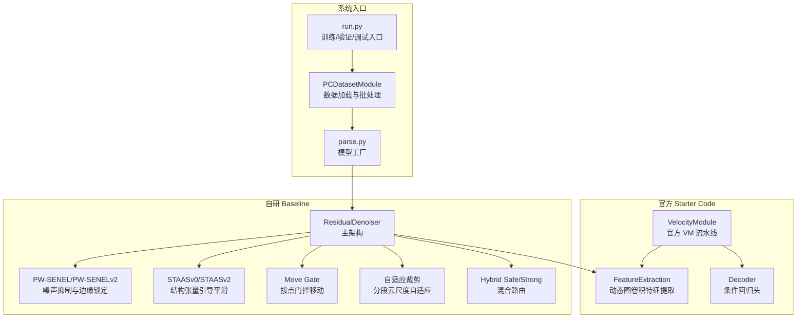
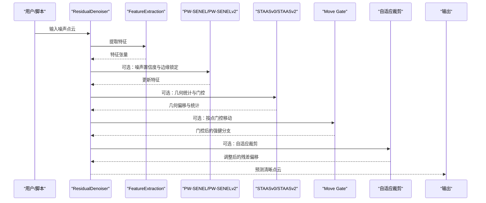
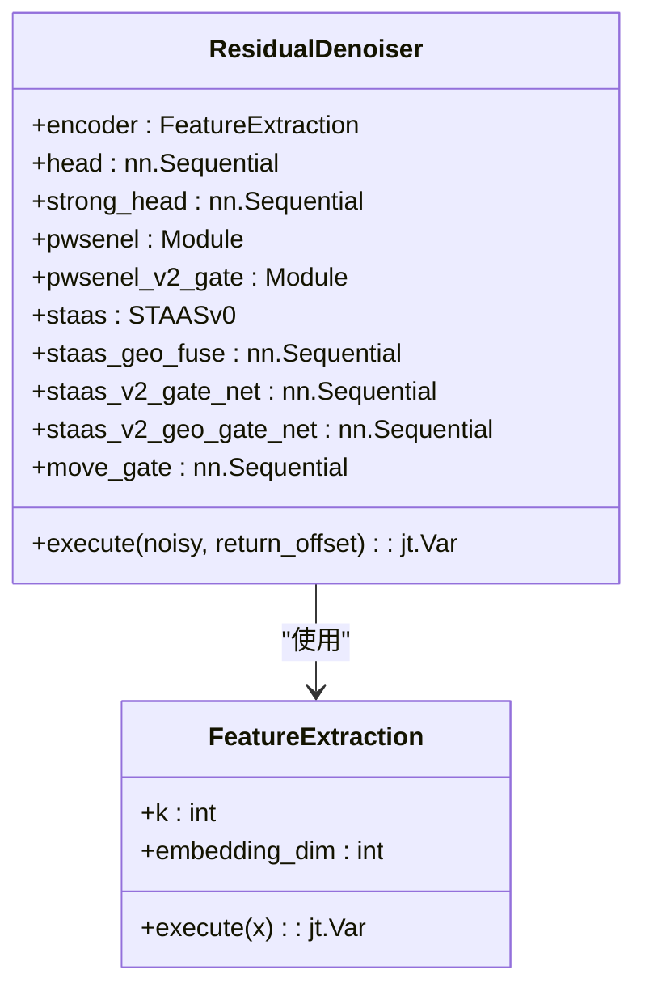
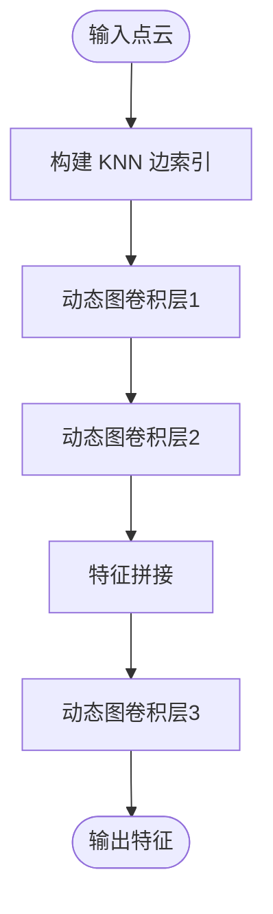
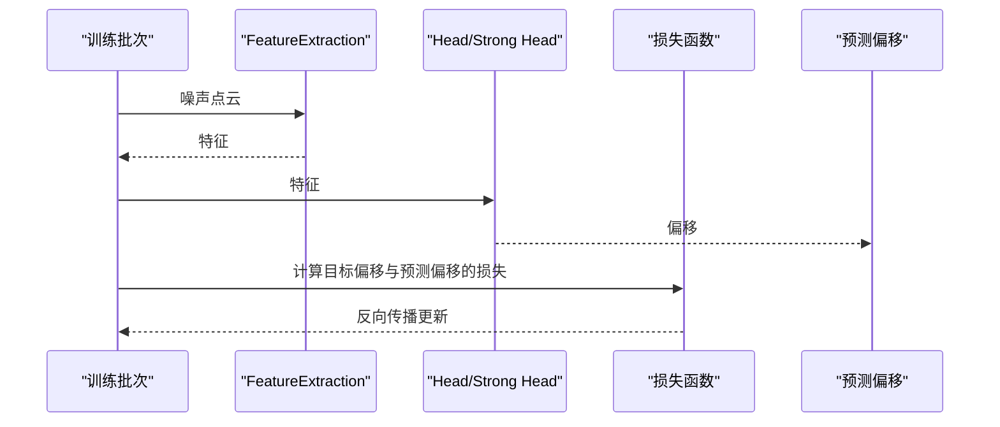
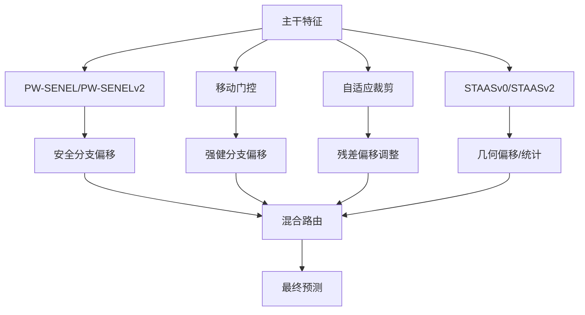
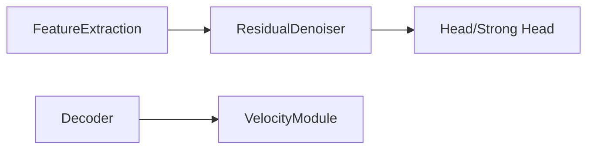
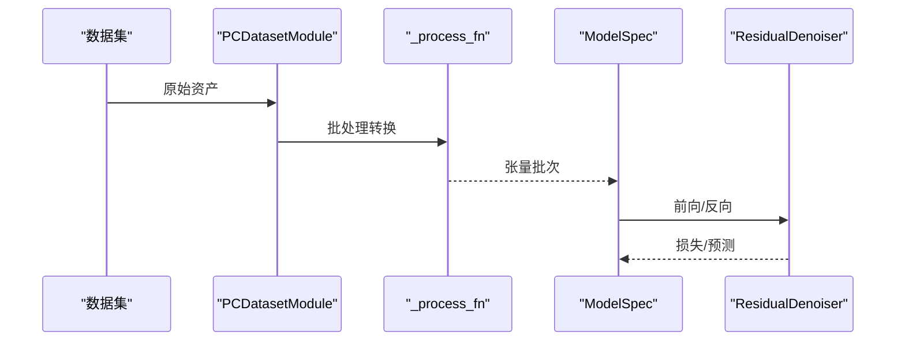
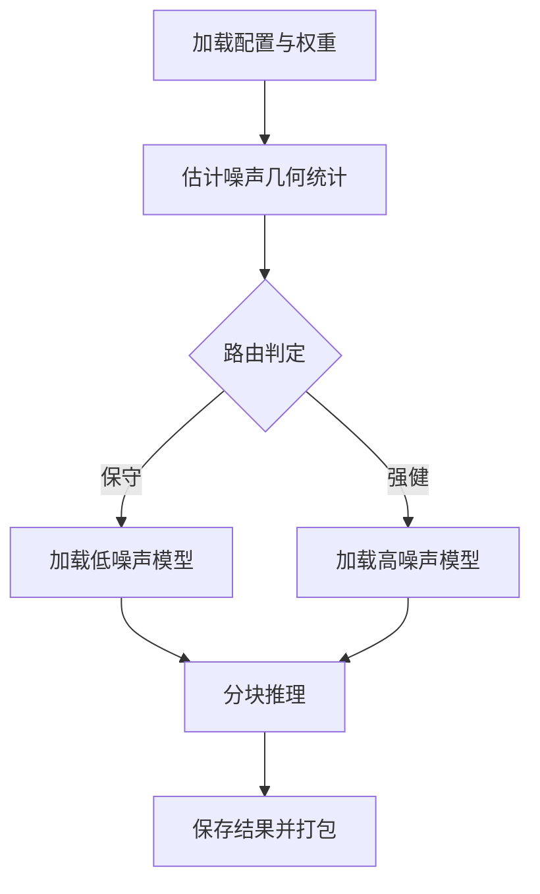
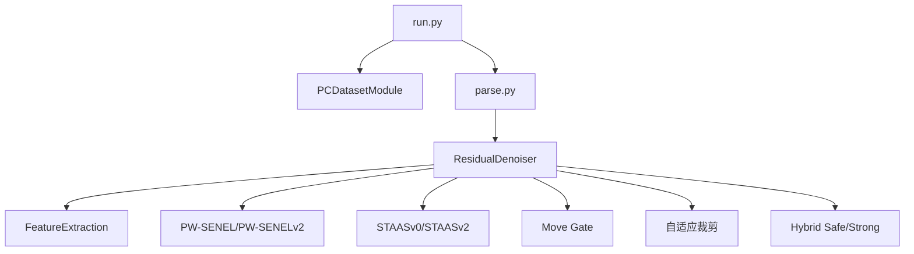

# 主架构设计

<cite>
**本文档引用的文件**
- [denoise_baseline.py](file://denoise_baseline.py)
- [feature.py](file://starter_code/src/model/feature.py)
- [vm.py](file://starter_code/src/model/vm.py)
- [parse.py](file://starter_code/src/model/parse.py)
- [run.py](file://starter_code/run.py)
- [dataset.py](file://starter_code/src/data/dataset.py)
- [spec.py](file://starter_code/src/model/spec.py)
- [denoise_pwsenel_v2_adaptive_clip_piecewise.yaml](file://configs/denoise_pwsenel_v2_adaptive_clip_piecewise.yaml)
- [denoise_noise_aware_move_gate.yaml](file://configs/denoise_noise_aware_move_gate.yaml)
- [denoise_hybrid_safe_strong.yaml](file://configs/denoise_hybrid_safe_strong.yaml)
- [predict_router.py](file://scripts/predict_router.py)
</cite>

## 目录
1. [引言](#引言)
2. [项目结构](#项目结构)
3. [核心组件](#核心组件)
4. [架构总览](#架构总览)
5. [详细组件分析](#详细组件分析)
6. [依赖分析](#依赖分析)
7. [性能考虑](#性能考虑)
8. [故障排查指南](#故障排查指南)
9. [结论](#结论)
10. [附录](#附录)

## 引言
本设计文档围绕 Jittor 点云去噪项目的主架构 ResidualDenoiser 展开，系统阐述其设计原理、实现细节与工程实践。重点包括：
- 特征提取器集成：复用官方 FeatureExtraction 模块，确保与官方 Starter Code 的兼容性与可移植性。
- 残差偏移回归机制：采用“噪声点云 + 偏移 = 清晰点云”的回归范式，统一训练与推理流程。
- 多分支融合策略：在主干特征之上叠加 PW-SENEL、STAAS、移动门控、自适应裁剪等模块，形成可插拔的模块化融合路径。
- 数据流处理路径：从输入点云到最终去噪结果的完整转换过程，涵盖批处理、分块推理与路由策略。
- 架构决策的技术考量：稳定性、可扩展性与性能平衡；模块化设计原则：开关控制、Ablation 友好与回退能力。

## 项目结构
项目采用“官方 Starter Code + 自研 Baseline”的双轨结构：
- 官方模块（starter_code）：提供 FeatureExtraction、Decoder 等基础组件，确保与官方评测链路一致。
- 自研模块（根目录）：实现 ResidualDenoiser 主架构与多分支融合策略，并通过脚本进行推理路由与打包。

**图表来源**
- [run.py:1-140](file://starter_code/run.py#L1-L140)
- [dataset.py:47-168](file://starter_code/src/data/dataset.py#L47-L168)
- [parse.py:4-12](file://starter_code/src/model/parse.py#L4-L12)
- [feature.py:65-139](file://starter_code/src/model/feature.py#L65-L139)
- [denoise_baseline.py:480-732](file://denoise_baseline.py#L480-L732)

**章节来源**
- [run.py:1-140](file://starter_code/run.py#L1-L140)
- [dataset.py:47-168](file://starter_code/src/data/dataset.py#L47-L168)
- [parse.py:4-12](file://starter_code/src/model/parse.py#L4-L12)

## 核心组件
- ResidualDenoiser 主架构：以 FeatureExtraction 为主干，结合 PW-SENEL、STAAS、移动门控与自适应裁剪等模块，形成可插拔的残差偏移回归框架。
- FeatureExtraction：基于动态图卷积的多层特征提取，支持 KNN 边构建与归一化策略。
- PW-SENEL/PW-SENELv2：噪声置信度估计与边缘锁定，抑制噪声同时保护锐利结构。
- STAASv0/STAASv2：结构张量引导的密度自适应平滑，提供几何辅助偏移与门控。
- Move Gate：按点门控的移动强度，适配不同噪声水平。
- 自适应裁剪：基于云尺度的分段曲线，兼顾低噪声保守性与高噪声开放性。
- 混合安全/强健路由：在安全分支与强健分支之间按局部噪声与边缘置信度进行路由。

**章节来源**
- [denoise_baseline.py:480-732](file://denoise_baseline.py#L480-L732)
- [feature.py:65-139](file://starter_code/src/model/feature.py#L65-L139)
- [denoise_pwsenel_v2_adaptive_clip_piecewise.yaml:25-54](file://configs/denoise_pwsenel_v2_adaptive_clip_piecewise.yaml#L25-L54)
- [denoise_noise_aware_move_gate.yaml:25-47](file://configs/denoise_noise_aware_move_gate.yaml#L25-L47)
- [denoise_hybrid_safe_strong.yaml:25-53](file://configs/denoise_hybrid_safe_strong.yaml#L25-L53)

## 架构总览
ResidualDenoiser 的核心数据流遵循“特征提取 → 残差偏移 → 多分支融合 → 最终预测”的主路径，所有研究模块均以开关形式接入，便于 Ablation 与回退。

**图表来源**
- [denoise_baseline.py:602-732](file://denoise_baseline.py#L602-L732)
- [feature.py:109-139](file://starter_code/src/model/feature.py#L109-L139)

## 详细组件分析

### ResidualDenoiser 主架构
- 设计原则
  - 主干编码器复用官方 FeatureExtraction，确保与官方评测链路一致。
  - 残差偏移回归范式统一训练与推理，便于模块化扩展。
  - 所有研究模块以开关接入，支持 Ablation 与快速回退。
- 关键实现
  - 特征提取：调用 FeatureExtraction 获取点级特征。
  - PW-SENEL/PW-SENELv2：在特征空间中引入噪声置信度与边缘锁定，抑制噪声同时保护锐利结构。
  - STAASv0/STAASv2：提供几何统计（如平滑偏移、尺度、tau、线性度、平面度、散射、边缘置信）并可进行融合或门控。
  - 移动门控：按点生成门控系数，控制强健分支的移动强度。
  - 自适应裁剪：根据云尺度分段曲线调整残差偏移，兼顾低噪声保守性与高噪声开放性。
  - 混合安全/强健路由：在安全分支（受 PW-SENELv2 与保守裁剪保护）与强健分支（保留移动门控容量）之间按局部噪声与边缘置信度进行路由。

**图表来源**
- [denoise_baseline.py:480-594](file://denoise_baseline.py#L480-L594)
- [feature.py:65-139](file://starter_code/src/model/feature.py#L65-L139)

**章节来源**
- [denoise_baseline.py:480-732](file://denoise_baseline.py#L480-L732)

### 特征提取器集成（FeatureExtraction）
- 动态图卷积：三层 DynamicEdgeConv，逐步提升特征维度。
- KNN 边构建：基于输入点云构建邻接边索引，支持距离归一化。
- 归一化策略：可选的距离估计归一化，提升鲁棒性。
- 输出：点级特征张量，供下游模块使用。

**图表来源**
- [feature.py:82-139](file://starter_code/src/model/feature.py#L82-L139)

**章节来源**
- [feature.py:65-139](file://starter_code/src/model/feature.py#L65-L139)

### 残差偏移回归机制
- 训练阶段：以“真实清洁点云 - 噪声点云”为目标，监督神经偏移头回归。
- 推理阶段：直接回归残差偏移，预测清晰点云 = 噪声点云 + 偏移。
- 多分支融合：在主干特征基础上叠加 PW-SENEL、STAAS、移动门控与自适应裁剪，形成稳健的融合策略。

**图表来源**
- [denoise_baseline.py:624-624](file://denoise_baseline.py#L624-L624)

**章节来源**
- [denoise_baseline.py:624-732](file://denoise_baseline.py#L624-L732)

### 多分支融合策略
- PW-SENEL/PW-SENELv2：噪声置信度估计与边缘锁定，抑制噪声同时保护锐利结构。
- STAASv0/STAASv2：结构张量引导的密度自适应平滑，提供几何辅助偏移与门控。
- 移动门控：按点门控的移动强度，适配不同噪声水平。
- 自适应裁剪：基于云尺度的分段曲线，兼顾低噪声保守性与高噪声开放性。
- 混合安全/强健路由：在安全分支与强健分支之间按局部噪声与边缘置信度进行路由。

**图表来源**
- [denoise_baseline.py:626-732](file://denoise_baseline.py#L626-L732)

**章节来源**
- [denoise_baseline.py:626-732](file://denoise_baseline.py#L626-L732)

### 官方 FeatureExtraction 与 Decoder 的复用
- 复用策略：ResidualDenoiser 的主干编码器直接实例化 FeatureExtraction，确保与官方 Starter Code 的一致性。
- Decoder 使用：官方 VM 流水线中使用 Decoder 进行速度场回归，而 ResidualDenoiser 使用 Head/Strong Head 进行偏移回归，两者共享设计理念但任务不同。

**图表来源**
- [feature.py:65-139](file://starter_code/src/model/feature.py#L65-L139)
- [vm.py:32-43](file://starter_code/src/model/vm.py#L32-L43)

**章节来源**
- [feature.py:65-139](file://starter_code/src/model/feature.py#L65-L139)
- [vm.py:32-43](file://starter_code/src/model/vm.py#L32-L43)

### 数据流处理路径
- 数据加载：PCDatasetModule 将原始资产转换为批处理张量，支持训练、验证与预测。
- 模型工厂：parse.py 根据配置选择模型类型并实例化。
- 训练/推理：run.py 统一调度训练、验证与调试流程，支持加载预训练权重与导出结果。

**图表来源**
- [dataset.py:170-269](file://starter_code/src/data/dataset.py#L170-L269)
- [spec.py:48-62](file://starter_code/src/model/spec.py#L48-L62)
- [parse.py:4-12](file://starter_code/src/model/parse.py#L4-L12)
- [run.py:91-127](file://starter_code/run.py#L91-L127)

**章节来源**
- [dataset.py:170-269](file://starter_code/src/data/dataset.py#L170-L269)
- [spec.py:48-62](file://starter_code/src/model/spec.py#L48-L62)
- [parse.py:4-12](file://starter_code/src/model/parse.py#L4-L12)
- [run.py:91-127](file://starter_code/run.py#L91-L127)

### 推理路由与打包（predict_router.py）
- 路由策略：基于噪声几何统计（如平面残差分位数）与机器学习判别器，将测试云路由至保守低噪声或强健高噪声模型。
- 分块推理：支持大云分块推理，避免显存峰值。
- 结果打包：将去噪结果按规范打包为提交包。

**图表来源**
- [predict_router.py:215-330](file://scripts/predict_router.py#L215-L330)
- [denoise_pwsenel_v2_adaptive_clip_piecewise.yaml:25-54](file://configs/denoise_pwsenel_v2_adaptive_clip_piecewise.yaml#L25-L54)
- [denoise_noise_aware_move_gate.yaml:25-47](file://configs/denoise_noise_aware_move_gate.yaml#L25-L47)

**章节来源**
- [predict_router.py:215-330](file://scripts/predict_router.py#L215-L330)
- [denoise_pwsenel_v2_adaptive_clip_piecewise.yaml:25-54](file://configs/denoise_pwsenel_v2_adaptive_clip_piecewise.yaml#L25-L54)
- [denoise_noise_aware_move_gate.yaml:25-47](file://configs/denoise_noise_aware_move_gate.yaml#L25-L47)

## 依赖分析
- 组件耦合
  - ResidualDenoiser 与 FeatureExtraction：主干依赖，耦合度高但接口稳定。
  - 多分支模块：以开关形式接入，耦合度低，便于独立开发与 Ablation。
- 外部依赖
  - Jittor 张量库与神经网络模块。
  - NumPy、SciPy、Trimesh 等科学计算与几何处理库。
  - OmegaConf 配置解析与合并工具。

**图表来源**
- [denoise_baseline.py:480-594](file://denoise_baseline.py#L480-L594)
- [run.py:91-127](file://starter_code/run.py#L91-L127)
- [parse.py:4-12](file://starter_code/src/model/parse.py#L4-L12)

**章节来源**
- [denoise_baseline.py:480-594](file://denoise_baseline.py#L480-L594)
- [run.py:91-127](file://starter_code/run.py#L91-L127)
- [parse.py:4-12](file://starter_code/src/model/parse.py#L4-L12)

## 性能考虑
- 显存优化
  - 分块推理：对大云进行分块处理，避免一次性构造稠密矩阵。
  - 流式拼接：在推理过程中边分块边回填，减少中间存储。
- 计算效率
  - KNN 查询与邻接构建：在特征提取阶段复用 KNN 索引，避免重复计算。
  - 多线程批预取：后台线程准备 NumPy 批次，降低 CUDA/Jittor 线程风险。
- 稳定性
  - 自适应裁剪：分段曲线避免单一线性增益导致的低噪声损伤。
  - 保守路由：在低噪声场景优先选择保守模型，提升稳定性。

## 故障排查指南
- 形状不匹配错误
  - 症状：批处理阶段出现张量形状不一致。
  - 排查：确认 process_fn 输出的键值形状一致，必要时启用 DEBUG 模式检查形状。
- 路由异常
  - 症状：推理路由判定失败或输出点数不一致。
  - 排查：检查噪声几何统计估计与路由阈值，确保覆盖修复逻辑生效。
- 显存不足
  - 症状：大云推理时显存溢出。
  - 排查：减小分块大小或关闭高阶模块（如 STAAS、PW-SENELv2），并启用流式拼接。

**章节来源**
- [spec.py:48-62](file://starter_code/src/model/spec.py#L48-L62)
- [predict_router.py:333-414](file://scripts/predict_router.py#L333-L414)

## 结论
ResidualDenoiser 主架构通过复用官方 FeatureExtraction，结合残差偏移回归与多分支融合策略，在保证与官方评测链路一致的同时，提供了高度模块化的扩展能力。其设计兼顾稳定性与性能，支持 Ablation 与快速回退，适用于竞赛与工业场景的多样化需求。

## 附录
- 配置文件示例
  - [denoise_pwsenel_v2_adaptive_clip_piecewise.yaml:25-54](file://configs/denoise_pwsenel_v2_adaptive_clip_piecewise.yaml#L25-L54)
  - [denoise_noise_aware_move_gate.yaml:25-47](file://configs/denoise_noise_aware_move_gate.yaml#L25-L47)
  - [denoise_hybrid_safe_strong.yaml:25-53](file://configs/denoise_hybrid_safe_strong.yaml#L25-L53)
- 入口脚本
  - [run.py:1-140](file://starter_code/run.py#L1-L140)
  - [predict_router.py:215-330](file://scripts/predict_router.py#L215-L330)