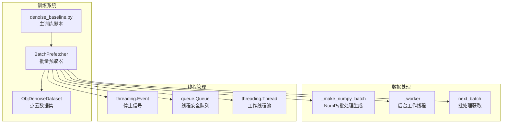
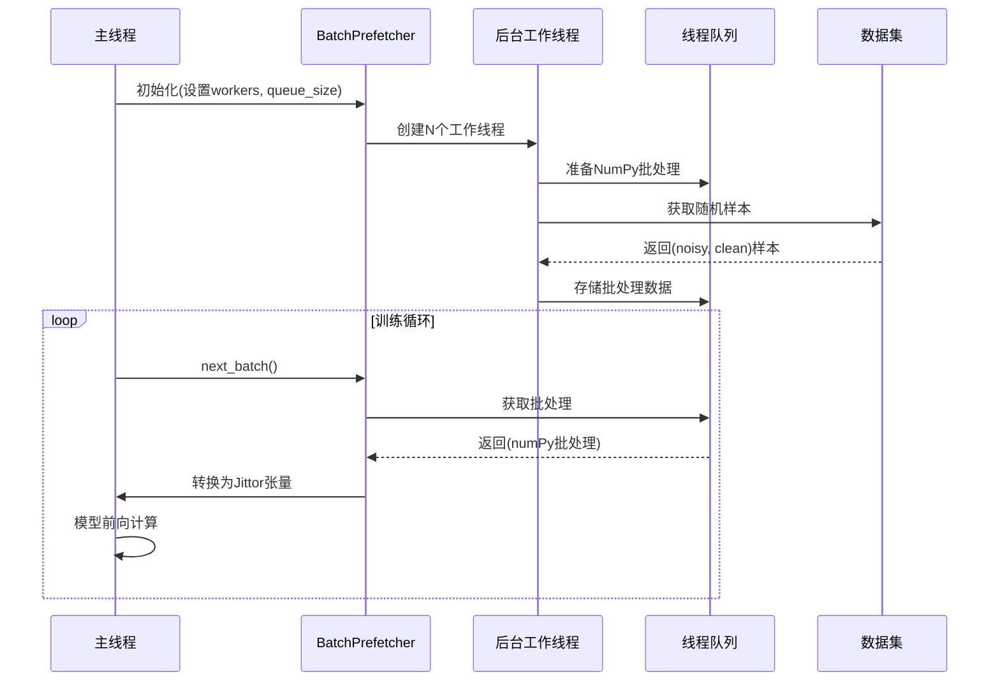
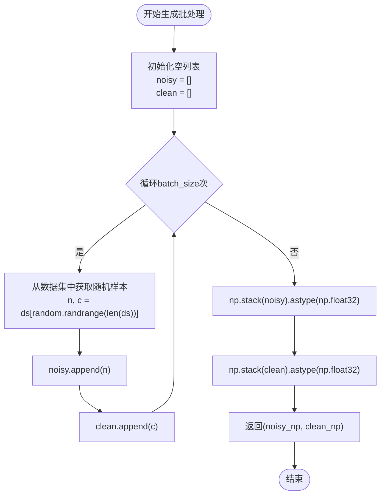
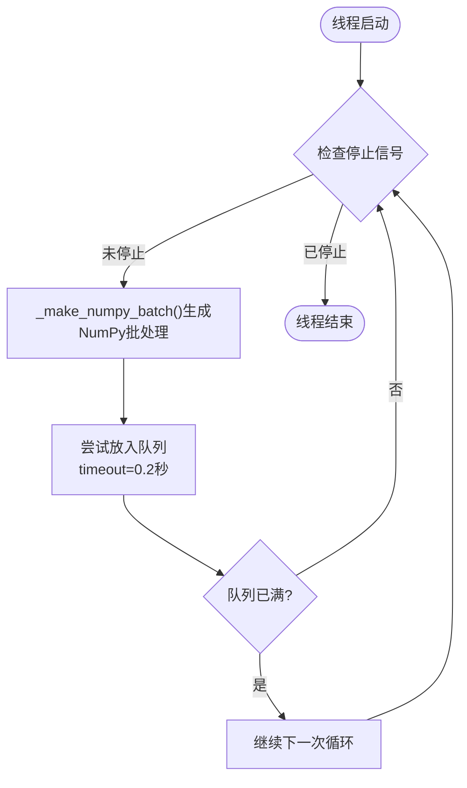
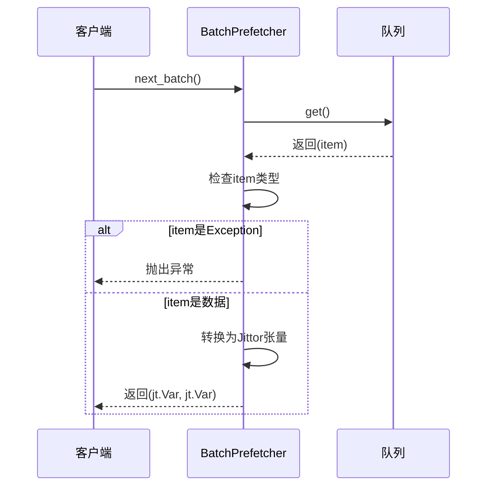
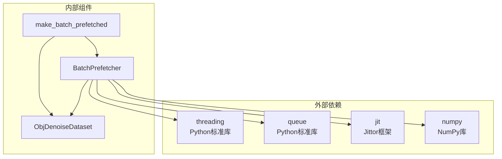

# 批量预取系统

<cite>
**本文档引用的文件**
- [denoise_baseline.py](file://denoise_baseline.py)
- [dataset.py](file://starter_code/src/data/dataset.py)
</cite>

## 目录
1. [简介](#简介)
2. [项目结构](#项目结构)
3. [核心组件](#核心组件)
4. [架构概览](#架构概览)
5. [详细组件分析](#详细组件分析)
6. [依赖关系分析](#依赖关系分析)
7. [性能考量](#性能考量)
8. [故障排除指南](#故障排除指南)
9. [结论](#结论)

## 简介

批量预取系统是Jittor点云去噪项目中的关键性能优化组件，专门设计用于解决深度学习训练过程中的数据准备瓶颈。该系统通过多线程后台数据准备，将CPU密集型的NumPy数组生成与GPU计算任务解耦，显著提升了训练效率。

系统的核心设计理念是"分离关注点"：后台线程专注于NumPy数组的合成和预处理，而主线程专注于Jittor张量的GPU计算。这种设计有效避免了CUDA/Jittor线程的安全问题，确保了训练过程的稳定性和可靠性。

## 项目结构

批量预取系统主要位于主训练脚本中，与数据集类紧密集成：

**图表来源**
- [denoise_baseline.py:175-221](file://denoise_baseline.py#L175-L221)

**章节来源**
- [denoise_baseline.py:175-221](file://denoise_baseline.py#L175-L221)

## 核心组件

批量预取系统由以下核心组件构成：

### BatchPrefetcher类
这是系统的主要控制器，负责协调整个预取流程。它维护工作线程池、管理队列容量，并提供统一的批处理接口。

### ObjDenoiseDataset类
数据集类负责从ShapeNet OBJ文件中加载点云数据，进行在线合成噪声处理。它是批量预取系统的数据源。

### 线程安全队列
使用Python标准库的queue.Queue实现，确保多线程环境下的数据安全传递。

**章节来源**
- [denoise_baseline.py:90-146](file://denoise_baseline.py#L90-L146)
- [denoise_baseline.py:175-221](file://denoise_baseline.py#L175-L221)

## 架构概览

批量预取系统的整体架构采用生产者-消费者模式：

**图表来源**
- [denoise_baseline.py:175-221](file://denoise_baseline.py#L175-L221)
- [denoise_baseline.py:189-215](file://denoise_baseline.py#L189-L215)

## 详细组件分析

### BatchPrefetcher类设计

#### 初始化机制
BatchPrefetcher的构造函数接受四个关键参数：
- `ds`: 数据集实例，提供数据访问接口
- `batch_size`: 每批样本数量
- `workers`: 后台工作线程数量
- `queue_size`: 队列容量限制

初始化过程中，系统会创建指定数量的后台线程，并启动它们进入工作状态。

#### _make_numpy_batch方法
这是数据生成的核心逻辑，实现了以下功能：

**图表来源**
- [denoise_baseline.py:189-195](file://denoise_baseline.py#L189-L195)

#### _worker线程工作流程
后台工作线程采用持续运行模式，通过事件驱动机制控制生命周期：

**图表来源**
- [denoise_baseline.py:197-208](file://denoise_baseline.py#L197-L208)

#### next_batch方法
这是客户端获取批处理数据的唯一接口，实现了异常透明传递：

**图表来源**
- [denoise_baseline.py:210-215](file://denoise_baseline.py#L210-L215)

**章节来源**
- [denoise_baseline.py:175-221](file://denoise_baseline.py#L175-L221)

### 线程安全与CUDA/Jittor考虑

系统在设计时充分考虑了CUDA/Jittor的线程安全性：

#### 线程隔离策略
- 后台线程仅使用NumPy数组，避免直接操作Jittor张量
- 数据转换发生在主线程，确保CUDA上下文的一致性
- 通过队列传递纯Python对象，避免跨线程共享Jittor状态

#### 异常处理机制
系统实现了完善的异常传播机制：
- 后台线程捕获的所有异常都会被封装并传递到主线程
- 主线程接收到异常后立即抛出，中断训练过程
- 队列中存储的异常对象会被正确识别和处理

**章节来源**
- [denoise_baseline.py:197-215](file://denoise_baseline.py#L197-L215)

### 内存管理与性能优化

#### 内存使用策略
- 使用队列容量限制防止内存无限增长
- NumPy数组在后台线程生成，减少主线程内存压力
- 支持可选的清洁点云缓存，平衡内存使用和计算时间

#### 性能优化技术
- 多线程并行数据生成，充分利用CPU多核
- 队列缓冲区提供流水线式数据传输
- 非阻塞队列操作，避免线程死锁

**章节来源**
- [denoise_baseline.py:178-187](file://denoise_baseline.py#L178-L187)

## 依赖关系分析

批量预取系统与其他组件的依赖关系如下：

**图表来源**
- [denoise_baseline.py:175-226](file://denoise_baseline.py#L175-L226)

**章节来源**
- [denoise_baseline.py:175-226](file://denoise_baseline.py#L175-L226)

## 性能考量

### 参数配置策略

#### workers参数调优
- **CPU核心数**: 工作线程数通常设置为CPU物理核心数的1-2倍
- **I/O密集型**: 如果数据读取是瓶颈，可以增加线程数
- **内存限制**: 确保每个线程有足够的内存空间

#### queue_size参数调优
- **延迟vs吞吐量**: 较大的队列提供更好的吞吐量，但会增加延迟
- **内存占用**: 队列大小直接影响内存使用量
- **最佳实践**: 通常设置为2-8倍的批处理大小

### 性能监控方法

系统提供了多种性能监控工具：

#### 时间测量
- `data_time_sec`: 数据准备时间
- `compute_time_sec`: 模型计算时间  
- `step_time_sec`: 单步执行时间

#### 系统资源监控
- GPU利用率: 通过`nvidia-smi`查询
- CPU使用率: 通过`ps`命令查询
- 内存使用情况: 通过`resource`模块查询

**章节来源**
- [denoise_baseline.py:912-977](file://denoise_baseline.py#L912-L977)
- [denoise_baseline.py:229-256](file://denoise_baseline.py#L229-L256)

## 故障排除指南

### 常见问题及解决方案

#### 线程阻塞问题
**症状**: 训练进程卡住，无法继续
**原因**: 队列已满且后台线程无法产生新数据
**解决方案**: 
- 增大`queue_size`参数
- 检查数据集访问是否正常
- 减少`workers`参数以降低负载

#### CUDA线程安全错误
**症状**: 训练过程中出现CUDA相关错误
**原因**: 在后台线程中直接操作Jittor张量
**解决方案**:
- 确保只在主线程中创建Jittor张量
- 检查是否有其他代码在后台线程中使用Jittor

#### 内存泄漏问题
**症状**: 训练时间越长，内存使用量越大
**原因**: 队列中积压过多数据
**解决方案**:
- 调整`queue_size`参数
- 确保在训练结束后正确关闭预取器

### 调试技巧

#### 启用详细日志
- 设置`--profile-times`参数获取详细的性能数据
- 使用`--profile-system-every N`定期记录系统状态

#### 内存使用监控
- 监控队列长度变化趋势
- 观察GPU和CPU内存使用情况

#### 线程状态检查
- 确认所有工作线程都处于活跃状态
- 检查停止信号是否正确传递

**章节来源**
- [denoise_baseline.py:867-879](file://denoise_baseline.py#L867-L879)
- [denoise_baseline.py:940-948](file://denoise_baseline.py#L940-L948)

## 结论

批量预取系统通过精心设计的多线程架构，成功解决了深度学习训练中的数据准备瓶颈问题。其核心优势包括：

1. **线程安全**: 通过严格的线程隔离策略，避免了CUDA/Jittor的线程安全问题
2. **性能优化**: 多线程并行处理显著提升了数据准备效率
3. **资源管理**: 合理的内存使用策略确保了长时间训练的稳定性
4. **异常处理**: 完善的异常传播机制保证了训练过程的可靠性

该系统为Jittor点云去噪项目提供了坚实的性能基础，是现代深度学习训练流水线的重要组成部分。通过合理的参数配置和监控策略，可以进一步优化系统性能，满足不同规模训练任务的需求。