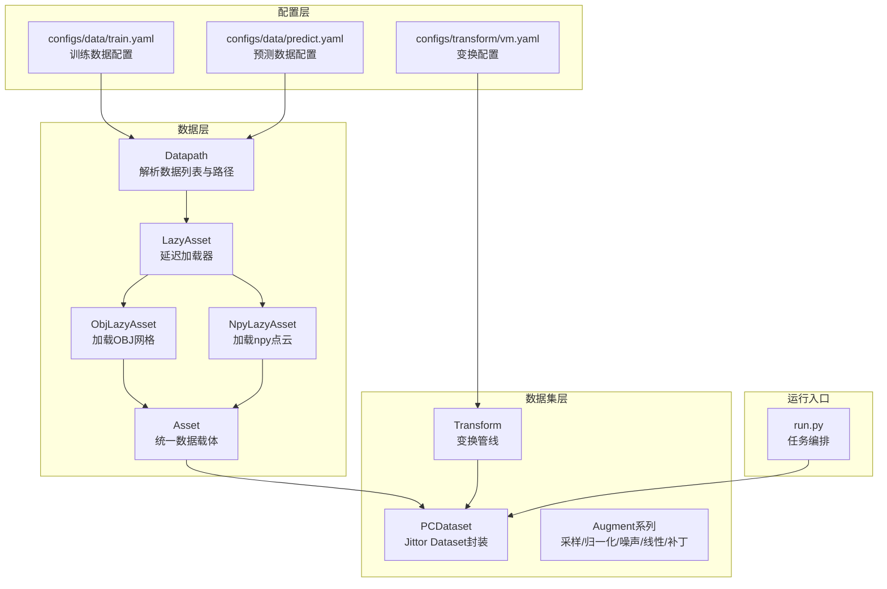
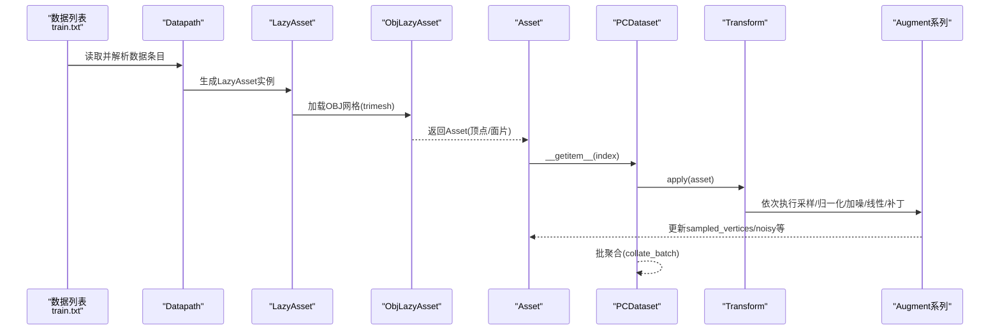
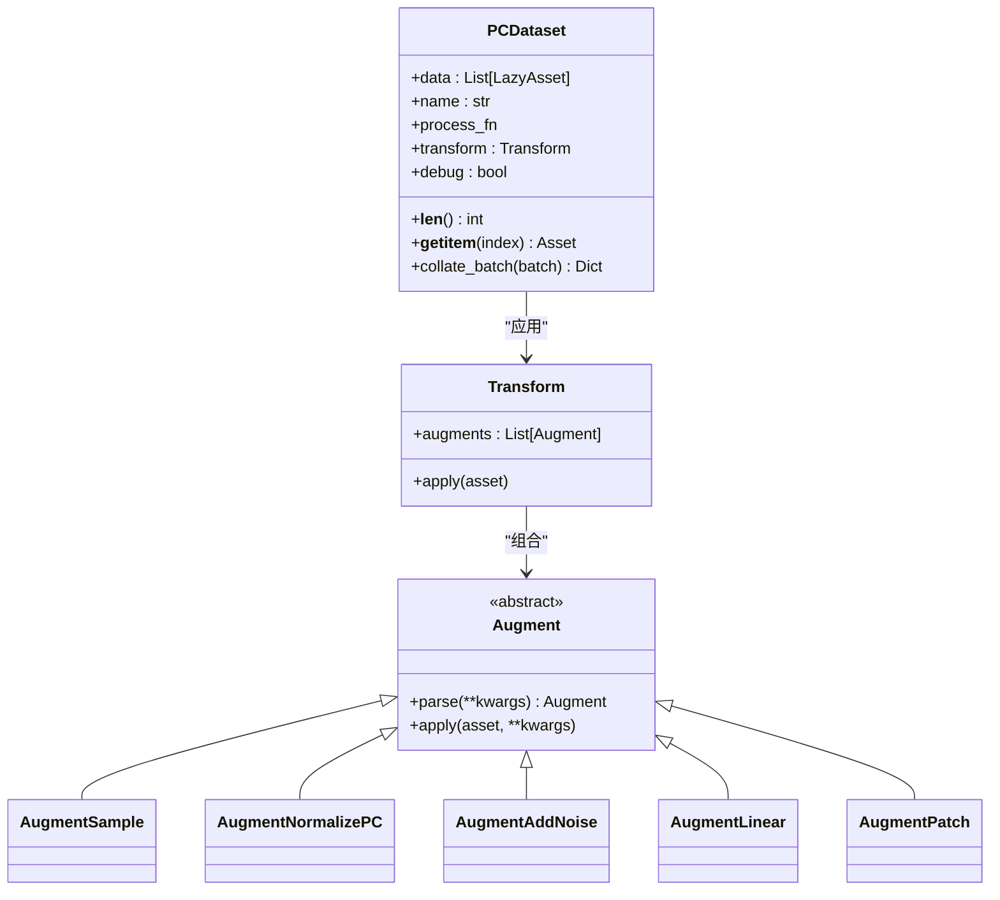
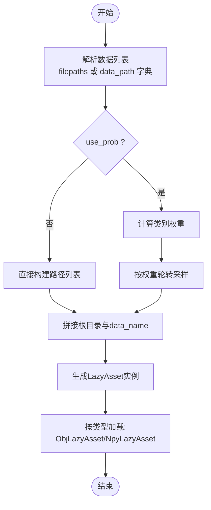
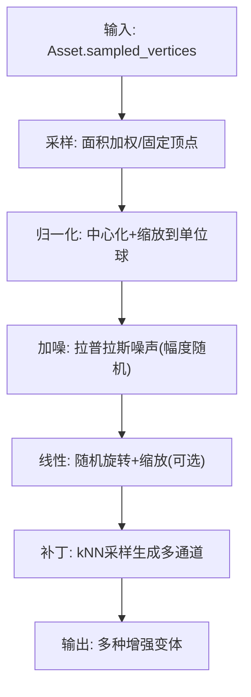
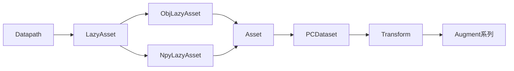

# 数据加载与预处理

<cite>
**本文引用的文件**
- [starter_code/src/data/dataset.py](file://starter_code/src/data/dataset.py)
- [starter_code/src/data/datapath.py](file://starter_code/src/data/datapath.py)
- [starter_code/src/data/asset.py](file://starter_code/src/data/asset.py)
- [starter_code/src/data/augment.py](file://starter_code/src/data/augment.py)
- [starter_code/src/data/utils.py](file://starter_code/src/data/utils.py)
- [starter_code/src/data/transform.py](file://starter_code/src/data/transform.py)
- [starter_code/configs/data/train.yaml](file://starter_code/configs/data/train.yaml)
- [starter_code/configs/data/predict.yaml](file://starter_code/configs/data/predict.yaml)
- [starter_code/configs/transform/vm.yaml](file://starter_code/configs/transform/vm.yaml)
- [starter_code/run.py](file://starter_code/run.py)
- [starter_code/datalist/train.txt](file://starter_code/datalist/train.txt)
- [scripts/check_data.py](file://scripts/check_data.py)
- [denoise_baseline.py](file://denoise_baseline.py)
</cite>

## 目录
1. [简介](#简介)
2. [项目结构](#项目结构)
3. [核心组件](#核心组件)
4. [架构总览](#架构总览)
5. [详细组件分析](#详细组件分析)
6. [依赖分析](#依赖分析)
7. [性能考虑](#性能考虑)
8. [故障排查指南](#故障排查指南)
9. [结论](#结论)
10. [附录](#附录)

## 简介
本文件面向Jittor点云去噪项目中的数据加载与预处理子系统，聚焦于ObjDenoiseDataset（在当前代码中以PCDataset为核心实现）如何从ShapeNet数据集中加载OBJ网格、进行点云采样、归一化以及在线噪声合成等关键流程。文档同时覆盖数据缓存机制、错误处理与边界情况、数据质量检查、内存优化与性能基准方法，并给出可操作的使用示例与调试技巧。

## 项目结构
数据加载与预处理相关代码集中在starter_code/src/data目录下，配合configs中的数据与变换配置，以及run.py主入口完成端到端训练/验证/预测流程。

图示来源
- [starter_code/src/data/datapath.py:52-268](file://starter_code/src/data/datapath.py#L52-L268)
- [starter_code/src/data/dataset.py:170-269](file://starter_code/src/data/dataset.py#L170-L269)
- [starter_code/src/data/transform.py:8-26](file://starter_code/src/data/transform.py#L8-L26)
- [starter_code/src/data/augment.py:13-192](file://starter_code/src/data/augment.py#L13-L192)
- [starter_code/configs/data/train.yaml:1-34](file://starter_code/configs/data/train.yaml#L1-L34)
- [starter_code/configs/data/predict.yaml:1-15](file://starter_code/configs/data/predict.yaml#L1-L15)
- [starter_code/configs/transform/vm.yaml:1-43](file://starter_code/configs/transform/vm.yaml#L1-L43)
- [starter_code/run.py:19-140](file://starter_code/run.py#L19-L140)

章节来源
- [starter_code/src/data/datapath.py:52-268](file://starter_code/src/data/datapath.py#L52-L268)
- [starter_code/src/data/dataset.py:170-269](file://starter_code/src/data/dataset.py#L170-L269)
- [starter_code/src/data/transform.py:8-26](file://starter_code/src/data/transform.py#L8-L26)
- [starter_code/src/data/augment.py:13-192](file://starter_code/src/data/augment.py#L13-L192)
- [starter_code/configs/data/train.yaml:1-34](file://starter_code/configs/data/train.yaml#L1-L34)
- [starter_code/configs/data/predict.yaml:1-15](file://starter_code/configs/data/predict.yaml#L1-L15)
- [starter_code/configs/transform/vm.yaml:1-43](file://starter_code/configs/transform/vm.yaml#L1-L43)
- [starter_code/run.py:19-140](file://starter_code/run.py#L19-L140)

## 核心组件
- Datapath：负责解析数据列表文件（如train.txt），构造路径集合，支持按类别拆分与概率采样，生成LazyAsset实例。
- LazyAsset/ObjLazyAsset/NpyLazyAsset：延迟加载器，分别用于加载OBJ网格或npy点云，统一产出Asset对象。
- Asset：承载顶点、面片、采样点、带噪点等字段的轻量数据容器。
- PCDataset：基于Jittor Dataset的封装，负责索引访问、调用Transform执行在线增强。
- Transform/Augment系列：定义采样、归一化、加噪、线性变换、补丁等增强操作。
- 数据配置：通过train.yaml/predict.yaml指定数据根目录、文件名、加载器类型、是否忽略存在性检查等。
- 变换配置：通过vm.yaml定义训练/验证/预测阶段的增强序列。

章节来源
- [starter_code/src/data/datapath.py:14-268](file://starter_code/src/data/datapath.py#L14-L268)
- [starter_code/src/data/asset.py:9-49](file://starter_code/src/data/asset.py#L9-L49)
- [starter_code/src/data/dataset.py:170-269](file://starter_code/src/data/dataset.py#L170-L269)
- [starter_code/src/data/transform.py:8-26](file://starter_code/src/data/transform.py#L8-L26)
- [starter_code/src/data/augment.py:13-192](file://starter_code/src/data/augment.py#L13-L192)
- [starter_code/configs/data/train.yaml:1-34](file://starter_code/configs/data/train.yaml#L1-L34)
- [starter_code/configs/data/predict.yaml:1-15](file://starter_code/configs/data/predict.yaml#L1-L15)
- [starter_code/configs/transform/vm.yaml:1-43](file://starter_code/configs/transform/vm.yaml#L1-L43)

## 架构总览
下图展示从数据列表到最终批数据的端到端流程，包括路径解析、延迟加载、在线增强与批聚合。

图示来源
- [starter_code/datalist/train.txt:1-800](file://starter_code/datalist/train.txt#L1-L800)
- [starter_code/src/data/datapath.py:179-222](file://starter_code/src/data/datapath.py#L179-L222)
- [starter_code/src/data/datapath.py:26-38](file://starter_code/src/data/datapath.py#L26-L38)
- [starter_code/src/data/asset.py:9-49](file://starter_code/src/data/asset.py#L9-L49)
- [starter_code/src/data/dataset.py:196-200](file://starter_code/src/data/dataset.py#L196-L200)
- [starter_code/src/data/transform.py:23-26](file://starter_code/src/data/transform.py#L23-L26)
- [starter_code/src/data/augment.py:37-83](file://starter_code/src/data/augment.py#L37-L83)

## 详细组件分析

### PCDataset与数据管道
- __getitem__：根据索引取出LazyAsset，调用其load()得到Asset，再应用Transform执行增强。
- collate_batch：在非debug模式下，将批次内多个Asset的字段按约定进行堆叠或拼接，输出张量字典。
- 调试模式：返回原始Asset列表，便于可视化与导出中间结果。

图示来源
- [starter_code/src/data/dataset.py:170-269](file://starter_code/src/data/dataset.py#L170-L269)
- [starter_code/src/data/transform.py:8-26](file://starter_code/src/data/transform.py#L8-L26)
- [starter_code/src/data/augment.py:13-192](file://starter_code/src/data/augment.py#L13-L192)

章节来源
- [starter_code/src/data/dataset.py:170-269](file://starter_code/src/data/dataset.py#L170-L269)
- [starter_code/src/data/transform.py:8-26](file://starter_code/src/data/transform.py#L8-L26)
- [starter_code/src/data/augment.py:13-192](file://starter_code/src/data/augment.py#L13-L192)

### Datapath与LazyAsset：从ShapeNet加载OBJ
- 解析数据列表：支持两类输入：直接路径列表或按类别分组的字典；可选择忽略存在性检查。
- 概率采样：当use_prob为真时，按类别权重轮转采样，num_files控制采样总数。
- 路径拼接：自动拼接input_dataset_dir与相对路径，并附加data_name（默认为"models/model_normalized.obj"）。
- Lazy加载：ObjLazyAsset使用trimesh加载网格，若Scene则合并几何体；NpyLazyAsset加载npy点云用于预测。

图示来源
- [starter_code/src/data/datapath.py:89-177](file://starter_code/src/data/datapath.py#L89-L177)
- [starter_code/src/data/datapath.py:179-222](file://starter_code/src/data/datapath.py#L179-L222)
- [starter_code/src/data/datapath.py:26-38](file://starter_code/src/data/datapath.py#L26-L38)
- [starter_code/src/data/datapath.py:41-50](file://starter_code/src/data/datapath.py#L41-L50)

章节来源
- [starter_code/src/data/datapath.py:52-268](file://starter_code/src/data/datapath.py#L52-L268)
- [starter_code/datalist/train.txt:1-800](file://starter_code/datalist/train.txt#L1-L800)

### Asset：统一数据载体
- 字段：path、cls、vertices、faces、sampled_vertices、sampled_vertices_noisy、meta。
- 变换：提供仿射变换接口，对顶点进行齐次变换。

章节来源
- [starter_code/src/data/asset.py:9-49](file://starter_code/src/data/asset.py#L9-L49)

### Transform与Augment：在线增强流水线
- Transform：将一组Augment按序应用到Asset。
- AugmentSample：按面面积加权随机采样，支持固定若干顶点参与。
- AugmentNormalizePC：将采样点中心化并缩放至单位球半径。
- AugmentAddNoise：对采样点添加拉普拉斯噪声，噪声幅度在给定范围内随机采样。
- AugmentLinear：随机旋转与缩放（齐次矩阵）。
- AugmentPatch：基于kNN的补丁采样，生成干净/带噪/混合三通道。

图示来源
- [starter_code/src/data/augment.py:26-83](file://starter_code/src/data/augment.py#L26-L83)
- [starter_code/src/data/augment.py:48-64](file://starter_code/src/data/augment.py#L48-L64)
- [starter_code/src/data/augment.py:67-83](file://starter_code/src/data/augment.py#L67-L83)
- [starter_code/src/data/augment.py:86-122](file://starter_code/src/data/augment.py#L86-L122)
- [starter_code/src/data/augment.py:125-175](file://starter_code/src/data/augment.py#L125-L175)

章节来源
- [starter_code/src/data/transform.py:8-26](file://starter_code/src/data/transform.py#L8-L26)
- [starter_code/src/data/augment.py:13-192](file://starter_code/src/data/augment.py#L13-L192)

### 点云采样与归一化算法细节
- sample_vertex_groups：核心采样函数，支持：
  - 面积加权采样（按三角形面积权重）
  - 固定点采样（保证至少包含若干顶点）
  - 面掩码过滤（仅在mask为True的面上采样）
  - 确定性参数（用于复现实验）
- normalize_pc：将点集中心化后按最大范数缩放至单位球，确保尺度一致。

章节来源
- [starter_code/src/data/utils.py:98-253](file://starter_code/src/data/utils.py#L98-L253)
- [starter_code/src/data/augment.py:48-64](file://starter_code/src/data/augment.py#L48-L64)

### 数据缓存机制、错误处理与边界情况
- 缓存：PCDataset未内置缓存；可在上层逻辑中结合外部缓存策略（如baseline示例中的clean点云缓存）。
- 错误处理：
  - Datapath支持ignore_check跳过存在性检查；否则缺失文件会统计并提示。
  - AugmentNormalizePC/Noise在sampled_vertices为空时断言失败，需确保采样步骤先于归一化/加噪。
  - Transform.apply顺序执行，任一步异常会中断后续增强。
- 边界情况：
  - 采样数量大于点数时采用重采样；
  - 面积加权采样可能因浮点误差导致边界情况，已通过随机长度修正避免退化。

章节来源
- [starter_code/src/data/datapath.py:121-133](file://starter_code/src/data/datapath.py#L121-L133)
- [starter_code/src/data/augment.py:56-64](file://starter_code/src/data/augment.py#L56-L64)
- [starter_code/src/data/augment.py:78-83](file://starter_code/src/data/augment.py#L78-L83)

## 依赖分析
- 组件耦合：
  - PCDataset依赖Transform与LazyAsset链路，耦合度低，便于替换增强策略。
  - Datapath与配置文件强绑定，通过parse解析形成统一数据视图。
- 外部依赖：
  - trimesh用于OBJ加载与场景合并；
  - scipy.spatial.cKDTree用于kNN补丁采样；
  - numpy/scipy用于数值计算与随机变换。

图示来源
- [starter_code/src/data/datapath.py:14-268](file://starter_code/src/data/datapath.py#L14-L268)
- [starter_code/src/data/dataset.py:170-269](file://starter_code/src/data/dataset.py#L170-L269)
- [starter_code/src/data/transform.py:8-26](file://starter_code/src/data/transform.py#L8-L26)
- [starter_code/src/data/augment.py:13-192](file://starter_code/src/data/augment.py#L13-L192)

章节来源
- [starter_code/src/data/datapath.py:14-268](file://starter_code/src/data/datapath.py#L14-L268)
- [starter_code/src/data/dataset.py:170-269](file://starter_code/src/data/dataset.py#L170-L269)
- [starter_code/src/data/transform.py:8-26](file://starter_code/src/data/transform.py#L8-L26)
- [starter_code/src/data/augment.py:13-192](file://starter_code/src/data/augment.py#L13-L192)

## 性能考虑
- I/O与解压：
  - 使用LazyAsset延迟加载，避免一次性加载全部网格。
  - 预处理阶段建议提前生成并缓存“normalized.obj”以减少运行时开销。
- 计算优化：
  - 采样与归一化为CPU密集型，建议在num_workers较多时并行加载。
  - 补丁采样使用cKDTree，注意K值与点数规模匹配，避免过大的查询开销。
- 内存优化：
  - 控制batch_size与num_points，避免单样本过大。
  - 在预测阶段优先使用npy加载器，减少OBJ解析成本。
- 基准测试：
  - 使用scripts/check_data.py统计缺失样本与形状信息，辅助定位数据问题。
  - 使用scripts/evaluate_cd.py与scripts/evaluate_noise_estimator.py评估点云质量与噪声估计指标。

章节来源
- [scripts/check_data.py:70-102](file://scripts/check_data.py#L70-L102)
- [scripts/evaluate_cd.py:89-118](file://scripts/evaluate_cd.py#L89-L118)
- [scripts/evaluate_noise_estimator.py:48-83](file://scripts/evaluate_noise_estimator.py#L48-L83)

## 故障排查指南
- 数据缺失：
  - 使用check_data.py扫描train/predict数据，确认"models/model_normalized.obj"与"noisy.npy"是否存在。
- 归一化/加噪报错：
  - 确认采样步骤在归一化/加噪之前执行；检查sampled_vertices是否为空。
- 采样异常：
  - 当num_samples超过点数时启用重采样；检查面掩码与权重是否合理。
- 预测阶段无输出：
  - 确认predict.yaml中loader为npy且data_name为"noisy.npy"，路径拼接正确。

章节来源
- [scripts/check_data.py:70-102](file://scripts/check_data.py#L70-L102)
- [starter_code/configs/data/predict.yaml:1-15](file://starter_code/configs/data/predict.yaml#L1-L15)
- [starter_code/src/data/augment.py:37-83](file://starter_code/src/data/augment.py#L37-L83)

## 结论
本数据子系统通过LazyAsset与Datapath实现了对ShapeNet数据集的高效、灵活加载；借助Transform/Augment流水线，完成了从网格到点云、再到在线增强的完整链路。配合配置文件与运行脚本，能够稳定地支撑训练、验证与预测全流程。建议在生产环境中结合缓存与基准测试工具，持续监控数据质量与性能表现。

## 附录

### 使用示例与调试技巧
- 训练/验证数据加载：
  - 依据train.yaml配置，将数据根目录指向dataset_train，使用train.txt作为数据列表。
  - 运行run.py并选择mode为train或validate。
- 预测数据加载：
  - 依据predict.yaml配置，将数据根目录指向dataset_test_noisy，使用test.txt作为数据列表。
  - 运行run.py并选择mode为predict。
- 调试模式：
  - 在run.py中开启debug模式，PCDataset返回原始Asset列表，可导出中间结果进行可视化。
- 数据质量检查：
  - 使用scripts/check_data.py扫描缺失样本，定位问题文件。
  - 使用scripts/evaluate_cd.py与scripts/evaluate_noise_estimator.py评估点云质量与噪声估计指标。

章节来源
- [starter_code/configs/data/train.yaml:1-34](file://starter_code/configs/data/train.yaml#L1-L34)
- [starter_code/configs/data/predict.yaml:1-15](file://starter_code/configs/data/predict.yaml#L1-L15)
- [starter_code/run.py:131-140](file://starter_code/run.py#L131-L140)
- [scripts/check_data.py:70-102](file://scripts/check_data.py#L70-L102)
- [scripts/evaluate_cd.py:89-118](file://scripts/evaluate_cd.py#L89-L118)
- [scripts/evaluate_noise_estimator.py:48-83](file://scripts/evaluate_noise_estimator.py#L48-L83)