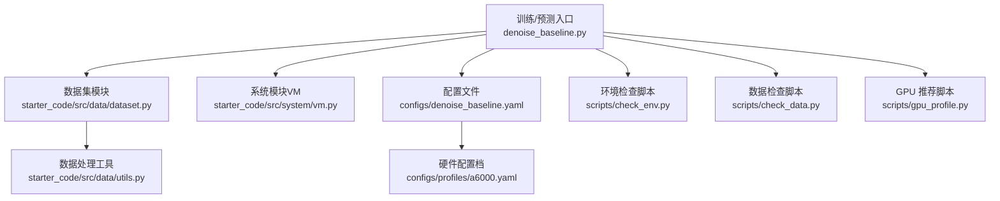
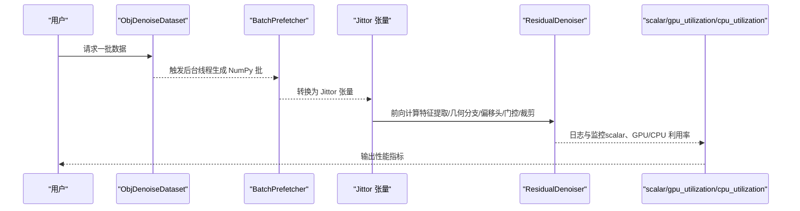
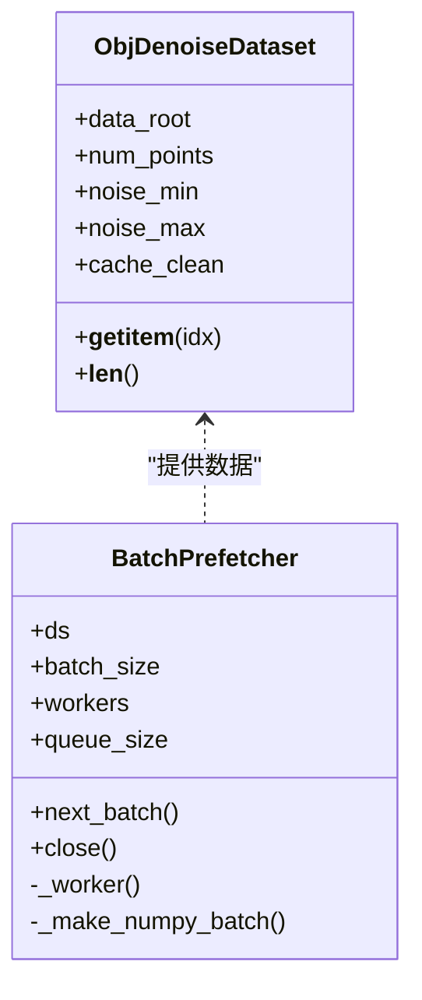
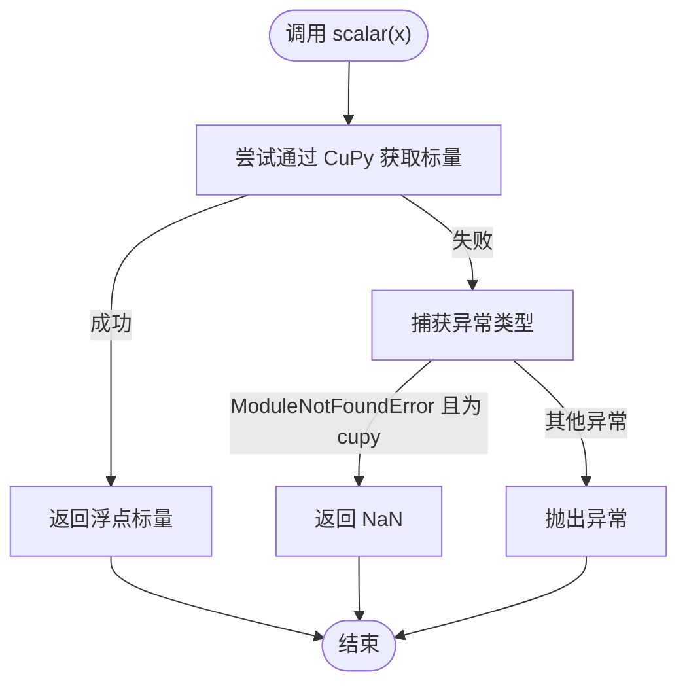
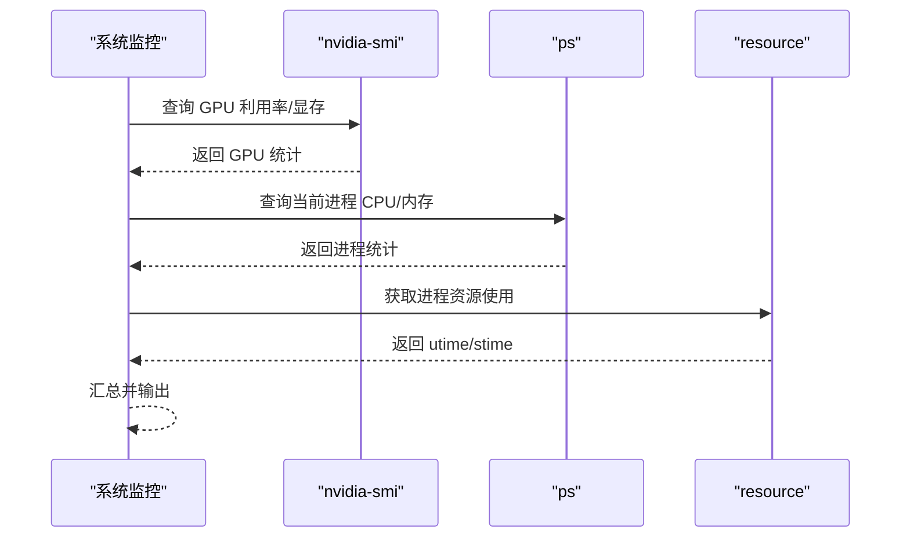
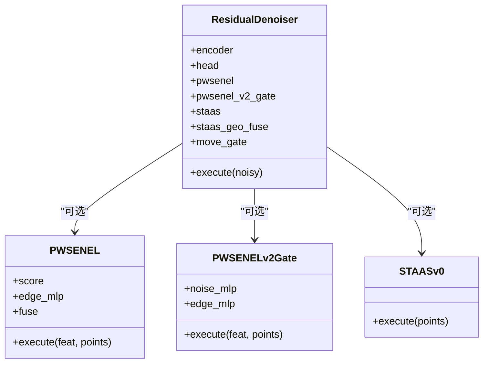
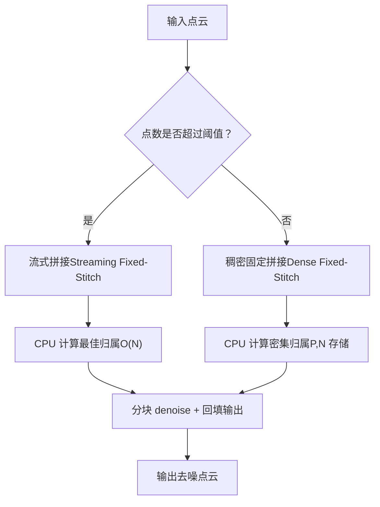
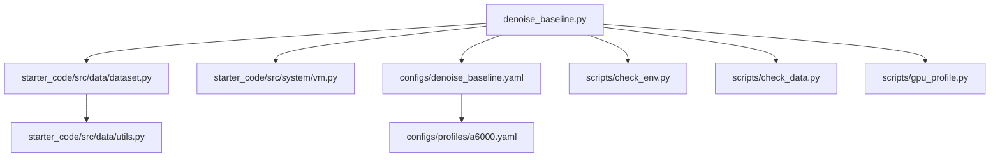

# 数据流优化策略

<cite>
**本文引用的文件**
- [denoise_baseline.py](file://denoise_baseline.py)
- [dataset.py](file://starter_code/src/data/dataset.py)
- [vm.py](file://starter_code/src/system/vm.py)
- [denoise_baseline.yaml](file://configs/denoise_baseline.yaml)
- [a6000.yaml](file://configs/profiles/a6000.yaml)
- [gpu_profile.py](file://scripts/gpu_profile.py)
- [check_env.py](file://scripts/check_env.py)
- [check_data.py](file://scripts/check_data.py)
- [utils.py](file://starter_code/src/data/utils.py)
</cite>

## 目录
1. [引言](#引言)
2. [项目结构](#项目结构)
3. [核心组件](#核心组件)
4. [架构总览](#架构总览)
5. [详细组件分析](#详细组件分析)
6. [依赖关系分析](#依赖关系分析)
7. [性能考量](#性能考量)
8. [故障排查指南](#故障排查指南)
9. [结论](#结论)
10. [附录](#附录)

## 引言
本文件针对 Jittor 点云去噪项目的“数据流优化策略”目标，系统梳理训练与预测阶段的数据处理管线，重点覆盖以下方面：
- 内存管理策略（CPU/GPU 内存占用控制）
- GPU 利用率与 CPU 利用率监控机制
- scalar 函数的标量化处理策略
- 批处理大小（batch_size）调优、预取队列（prefetch）配置与线程池管理
- 性能基准测试方法、瓶颈识别技术与资源使用监控
- 优化案例与实际部署建议

## 项目结构
该项目采用“主入口 + 官方 starter_code 复用 + 多配置文件”的组织方式：
- 主入口与核心模型在根目录的主脚本中定义
- 训练/推理数据管线通过官方 starter_code 的 Dataset/Transform 模块构建
- 系统层（如 VM Writer/VMSystem）负责预测阶段的输出写入与流程封装
- 配置文件（含 profiles）用于在不同硬件条件下调整 batch_size、num_points 等参数

图表来源
- [denoise_baseline.py](file://denoise_baseline.py)
- [dataset.py](file://starter_code/src/data/dataset.py)
- [vm.py](file://starter_code/src/system/vm.py)
- [denoise_baseline.yaml](file://configs/denoise_baseline.yaml)
- [a6000.yaml](file://configs/profiles/a6000.yaml)
- [check_env.py](file://scripts/check_env.py)
- [check_data.py](file://scripts/check_data.py)
- [gpu_profile.py](file://scripts/gpu_profile.py)
- [utils.py](file://starter_code/src/data/utils.py)

章节来源
- [denoise_baseline.py](file://denoise_baseline.py)
- [dataset.py](file://starter_code/src/data/dataset.py)
- [vm.py](file://starter_code/src/system/vm.py)
- [denoise_baseline.yaml](file://configs/denoise_baseline.yaml)
- [a6000.yaml](file://configs/profiles/a6000.yaml)
- [gpu_profile.py](file://scripts/gpu_profile.py)
- [check_env.py](file://scripts/check_env.py)
- [check_data.py](file://scripts/check_data.py)
- [utils.py](file://starter_code/src/data/utils.py)

## 核心组件
- 数据集与批生成
  - 基于随机索引的在线合成（噪声加点云），支持可选 clean 缓存
  - 提供 CPU 端 NumPy 批构造与 Jittor 张量转换
- 预取器（BatchPrefetcher）
  - 后台线程仅做 NumPy 批构造，避免主线程 CUDA/Jittor 并发风险
  - 支持队列长度与工作线程数配置
- scalar 函数
  - 在日志中进行标量化输出，CUDA 12 环境下通过 CuPy 获取精确标量，否则降级返回 NaN
- GPU/CPU 利用率监控
  - 通过 nvidia-smi 与 ps/resource 查询 GPU 利用率、内存与 CPU 占用
- 模型与几何分支
  - 主干编码器复用官方 FeatureExtraction，偏移头与可选门控/融合/自适应裁剪等模块可插拔

章节来源
- [denoise_baseline.py](file://denoise_baseline.py)

## 架构总览
训练/预测数据流的关键节点如下：
- 数据加载与合成：从 ShapeNet 加载顶点，归一化、采样、加噪
- 预取与批构造：后台线程生成 NumPy 批，主线程转为 Jittor 张量
- 模型前向：特征提取 + 可选几何分支 + 偏移头 + 门控/裁剪
- 监控与日志：scalar 输出、GPU/CPU 利用率、系统资源统计

图表来源
- [denoise_baseline.py](file://denoise_baseline.py)

## 详细组件分析

### 组件A：数据集与批处理（ObjDenoiseDataset 与 BatchPrefetcher）
- 设计要点
  - 在线合成：每次迭代随机采样并加噪，避免固定噪声对训练退化的影响
  - 可选 clean 缓存：仅缓存归一化后的 clean 顶点，避免固定噪声/清洁对
  - 预取器：后台线程仅做 NumPy 批构造，减少主线程等待与 CUDA/Jittor 并发压力
- 关键参数
  - num_points：每点云采样点数
  - cache_clean：是否缓存 clean 顶点
  - prefetch_workers、prefetch_queue_size：预取线程数与队列容量
- 性能影响
  - 预取线程数与队列大小直接影响 CPU/GPU 吞吐平衡
  - 队列过小易阻塞，过大可能增加内存占用

图表来源
- [denoise_baseline.py](file://denoise_baseline.py)

章节来源
- [denoise_baseline.py](file://denoise_baseline.py)

### 组件B：scalar 函数的标量化处理
- 目标
  - 在日志中输出标量值，兼顾精度与稳定性
- 行为
  - CUDA 12 环境优先使用 CuPy 获取标量，若缺失则降级返回 NaN
- 最佳实践
  - 在需要精确标量日志时安装匹配版本的 CuPy
  - 在无 CUDA 环境或 CI 中允许 NaN 以避免中断

图表来源
- [denoise_baseline.py](file://denoise_baseline.py)

章节来源
- [denoise_baseline.py](file://denoise_baseline.py)

### 组件C：GPU/CPU 利用率监控（gpu_utilization 与 cpu_utilization）
- GPU 监控
  - 通过 nvidia-smi 查询利用率、显存使用与总量，格式化为分号分隔字符串
- CPU 监控
  - 使用 ps 查询进程 CPU/内存占用，并结合 resource 获取 utime/stime
- 应用场景
  - 训练/推理过程中的系统资源观测，辅助瓶颈定位与参数调优

图表来源
- [denoise_baseline.py](file://denoise_baseline.py)

章节来源
- [denoise_baseline.py](file://denoise_baseline.py)

### 组件D：模型与几何分支（ResidualDenoiser）
- 主干
  - 特征提取复用官方模块，偏移头为可插拔 MLP
- 可选模块
  - PW-SENEL/PW-SENEL v2：邻域噪声抑制与边缘锁定
  - ST-AAS v0：基于结构张量的密度自适应软排序平滑
  - 门控与自适应裁剪：根据局部噪声/边缘置信度动态调节移动幅度
- 影响因素
  - k（KNN）、feat_dim、hidden 等超参影响显存与吞吐
  - 门控/裁剪会引入额外计算，需权衡精度与速度

图表来源
- [denoise_baseline.py](file://denoise_baseline.py)

章节来源
- [denoise_baseline.py](file://denoise_baseline.py)

### 组件E：官方 VM 预测流水线（Streaming/Fixed-Stitch）
- 功能
  - 支持稠密固定拼接与流式拼接两种 stitching 策略，自动根据点数规模切换
  - 流式版本避免 P×N 密集矩阵带来的显存峰值
- 关键参数
  - patch_size、seed_k、seed_k_alpha 等控制 patch 数与步长
- 适用场景
  - 大云（>某阈值点数）使用流式拼接，小云使用稠密固定拼接

图表来源
- [vm.py](file://starter_code/src/system/vm.py)

章节来源
- [vm.py](file://starter_code/src/system/vm.py)

## 依赖关系分析
- 主入口依赖
  - 复用官方 starter_code 的 FeatureExtraction/Decoder 等模块
  - 通过配置文件与 profiles 调整硬件相关参数
- 数据管线依赖
  - Dataset/Transform/Asset/Exporter 等模块构成官方数据处理链
  - utils 提供采样与变换等底层工具

图表来源
- [denoise_baseline.py](file://denoise_baseline.py)
- [dataset.py](file://starter_code/src/data/dataset.py)
- [vm.py](file://starter_code/src/system/vm.py)
- [denoise_baseline.yaml](file://configs/denoise_baseline.yaml)
- [a6000.yaml](file://configs/profiles/a6000.yaml)
- [check_env.py](file://scripts/check_env.py)
- [check_data.py](file://scripts/check_data.py)
- [gpu_profile.py](file://scripts/gpu_profile.py)
- [utils.py](file://starter_code/src/data/utils.py)

章节来源
- [denoise_baseline.py](file://denoise_baseline.py)
- [dataset.py](file://starter_code/src/data/dataset.py)
- [vm.py](file://starter_code/src/system/vm.py)
- [denoise_baseline.yaml](file://configs/denoise_baseline.yaml)
- [a6000.yaml](file://configs/profiles/a6000.yaml)
- [check_env.py](file://scripts/check_env.py)
- [check_data.py](file://scripts/check_data.py)
- [gpu_profile.py](file://scripts/gpu_profile.py)
- [utils.py](file://starter_code/src/data/utils.py)

## 性能考量

### 内存管理策略
- CPU 内存
  - 预取器后台线程仅构造 NumPy 批，避免主线程频繁张量分配
  - 可选 clean 缓存仅缓存归一化后的 clean 顶点，控制缓存体积
- GPU 内存
  - 通过 profiles 调整 num_points 与 batch_size，避免 OOM
  - 流式拼接（VM）在大云场景显著降低显存峰值
- 数据类型与对齐
  - 统一使用 float32，减少带宽与显存占用

章节来源
- [denoise_baseline.py](file://denoise_baseline.py)
- [a6000.yaml](file://configs/profiles/a6000.yaml)
- [vm.py](file://starter_code/src/system/vm.py)

### GPU 内存优化
- 参数建议
  - A6000 等大显存机器：提高 num_points 与 batch_size，启用 cache_clean 与预取
  - 小显存机器：降低 num_points 与 batch_size，谨慎开启复杂几何分支
- 流式拼接
  - 在 VM 中自动启用，避免 P×N 密集矩阵导致的显存尖峰

章节来源
- [a6000.yaml](file://configs/profiles/a6000.yaml)
- [vm.py](file://starter_code/src/system/vm.py)

### CPU-GPU 数据传输优化
- 预取与解耦
  - 预取器后台仅做 NumPy 构造，主线程再转为 Jittor 张量，减少同步等待
- 队列与线程
  - 队列大小与线程数需与 CPU 核心数、I/O 与模型前向时间匹配
- 监控与反馈
  - 通过 gpu_utilization 与 cpu_utilization 观察 CPU/GPU 利用率，指导参数调优

章节来源
- [denoise_baseline.py](file://denoise_baseline.py)

### scalar 函数的标量化处理
- 精度与稳定性
  - CUDA 12 环境优先使用 CuPy，确保日志标量精度
  - 无 CuPy 时降级为 NaN，不影响训练流程
- 建议
  - 在需要精确标量日志的环境中安装匹配的 CuPy 版本

章节来源
- [denoise_baseline.py](file://denoise_baseline.py)

### 批处理大小调优
- 基本原则
  - 从较小 batch_size 开始，逐步增大至显存上限附近
  - 结合 num_points 与 k，综合评估显存与吞吐
- 配置参考
  - A6000 profile 中示例 batch_size 与 num_points，可作为起点

章节来源
- [a6000.yaml](file://configs/profiles/a6000.yaml)

### 预取队列配置与线程池管理
- 队列大小
  - 适配磁盘/网络 I/O 与 CPU 生成速率，避免阻塞或内存占用过高
- 线程数
  - 与 CPU 核心数匹配，避免过度并发导致上下文切换开销
- 关闭与清理
  - 使用 close() 主动停止后台线程，避免资源泄漏

章节来源
- [denoise_baseline.py](file://denoise_baseline.py)

### 性能基准测试方法
- 基准指标
  - 训练/推理吞吐（samples/sec 或 fps）、显存峰值、CPU/GPU 利用率
- 方法
  - 使用 profiles 中的参数作为基线，逐步调整 batch_size/num_points
  - 通过 gpu_utilization 与 cpu_utilization 持续观测系统负载
- 工具
  - scripts/gpu_profile.py 可快速推荐合适 profile
  - scripts/check_env.py 与 scripts/check_data.py 保障环境与数据可用性

章节来源
- [gpu_profile.py](file://scripts/gpu_profile.py)
- [check_env.py](file://scripts/check_env.py)
- [check_data.py](file://scripts/check_data.py)
- [denoise_baseline.py](file://denoise_baseline.py)

### 瓶颈识别技术
- 观察点
  - GPU 利用率低：可能为 CPU 预取不足或 I/O 瓶颈
  - CPU 利用率高：可能为数据预处理或几何分支计算过重
  - 显存峰值高：可能为 num_points 过大或 batch_size 过大
- 建议
  - 逐步降低 batch_size 与 num_points，观察 GPU 利用率变化
  - 在 VM 中启用流式拼接，缓解显存峰值

章节来源
- [denoise_baseline.py](file://denoise_baseline.py)
- [vm.py](file://starter_code/src/system/vm.py)

### 资源使用监控
- GPU
  - 通过 nvidia-smi 查询利用率与显存使用
- CPU
  - 通过 ps 与 resource 获取 CPU/内存与进程资源使用
- 日志集成
  - 在训练/推理循环中定期采集并记录，形成趋势图

章节来源
- [denoise_baseline.py](file://denoise_baseline.py)

## 故障排查指南
- 环境检查
  - 使用 scripts/check_env.py 按层级检查 Python/Numpy/Jittor/CUDA
- 数据检查
  - 使用 scripts/check_data.py 校验数据路径与样本完整性
- GPU 推荐
  - 使用 scripts/gpu_profile.py 基于 nvidia-smi 输出推荐 profile
- 常见问题
  - CUDA 不可用：确认驱动、CUDA_VISIBLE_DEVICES、CuPy 匹配版本
  - OOM：降低 batch_size/num_points，或启用流式拼接
  - 预取阻塞：增大队列大小或增加线程数

章节来源
- [check_env.py](file://scripts/check_env.py)
- [check_data.py](file://scripts/check_data.py)
- [gpu_profile.py](file://scripts/gpu_profile.py)
- [denoise_baseline.py](file://denoise_baseline.py)

## 结论
本项目的数据流优化策略围绕“CPU 预取解耦 + GPU 高效执行 + 精准监控”的闭环展开。通过合理设置 batch_size、num_points、预取队列与线程数，结合 scalar 标量化与 GPU/CPU 利用率监控，可在不同硬件条件下获得稳定的吞吐与显存表现。对于大云场景，流式拼接显著降低了显存峰值；对于小云场景，可通过适度提升 batch_size 与 num_points 提升效率。

## 附录
- 配置文件与 profile
  - configs/denoise_baseline.yaml：基础训练/预测配置
  - configs/profiles/a6000.yaml：A6000 等大显存机器的参数示例
- 工具脚本
  - scripts/gpu_profile.py：基于 GPU 信息推荐 profile
  - scripts/check_env.py：环境分层检查
  - scripts/check_data.py：数据路径与样本检查