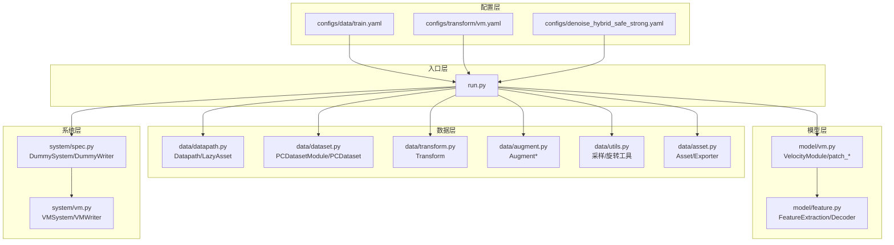
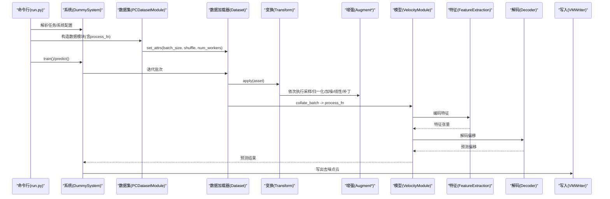
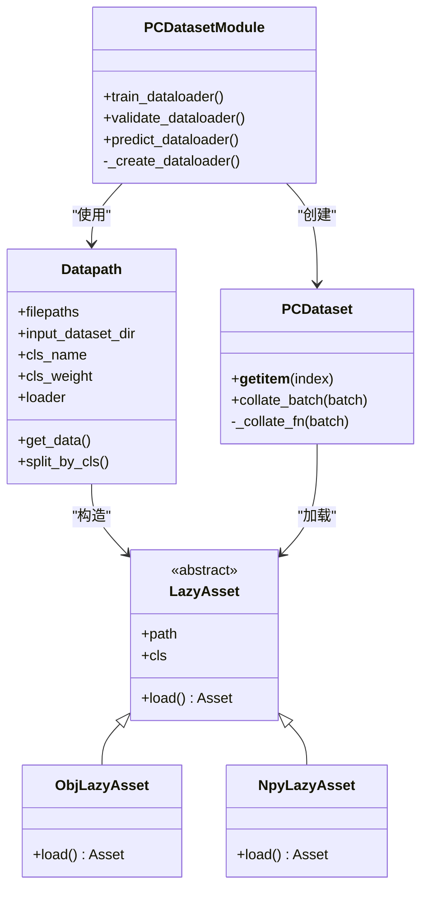
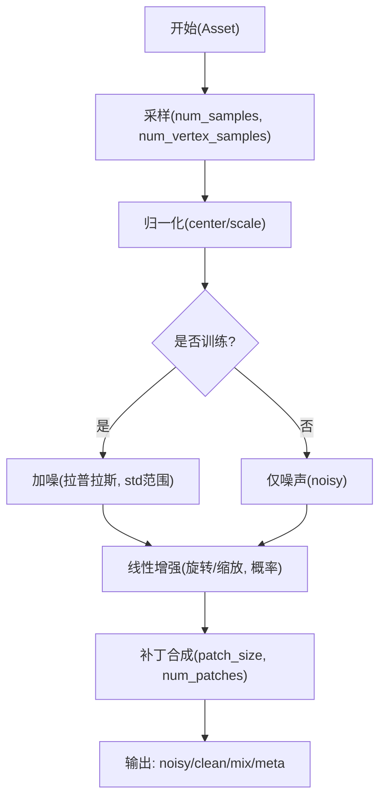
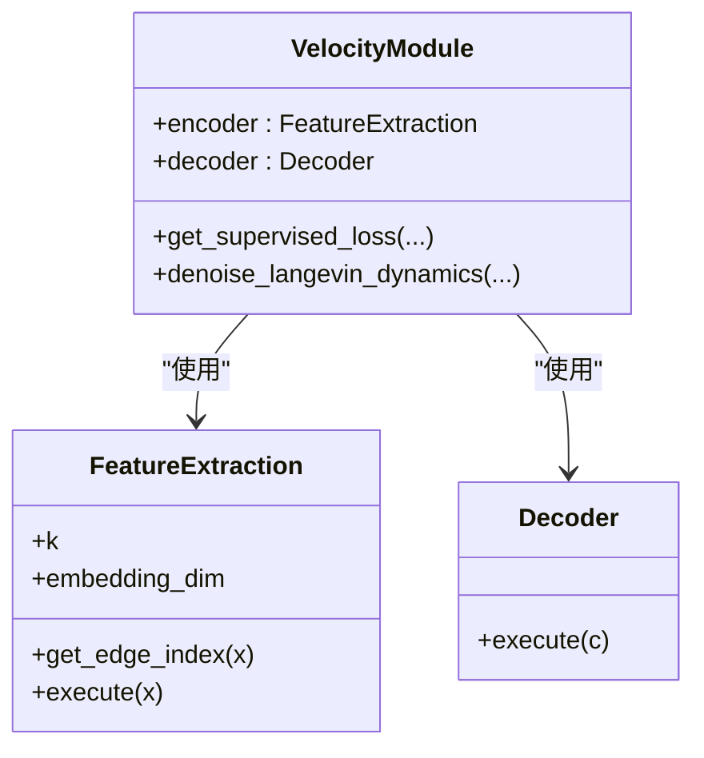
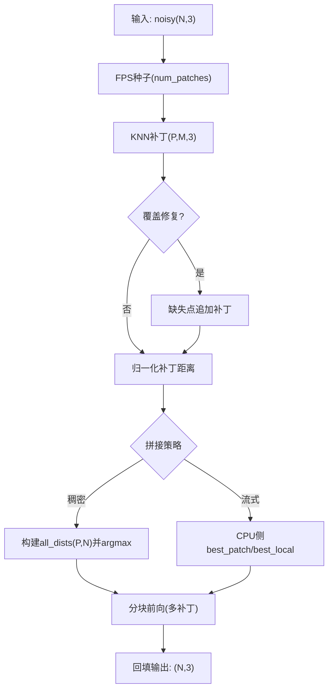
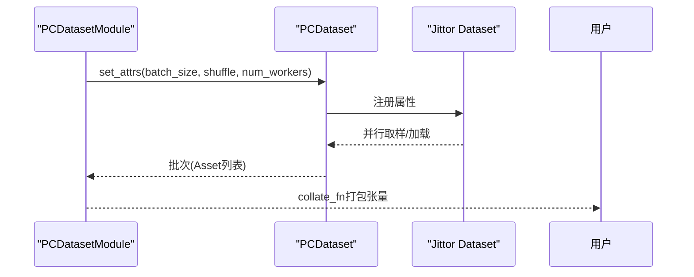
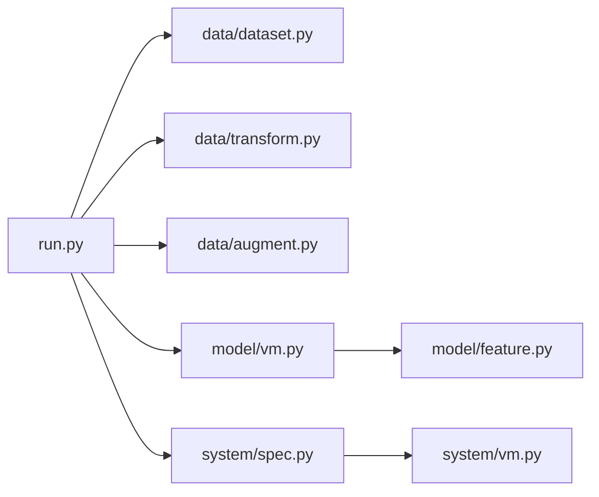

# 数据流处理

<cite>
**本文引用的文件**
- [starter_code/src/data/dataset.py](file://starter_code/src/data/dataset.py)
- [starter_code/src/data/transform.py](file://starter_code/src/data/transform.py)
- [starter_code/src/data/augment.py](file://starter_code/src/data/augment.py)
- [starter_code/src/data/utils.py](file://starter_code/src/data/utils.py)
- [starter_code/src/data/datapath.py](file://starter_code/src/data/datapath.py)
- [starter_code/src/data/asset.py](file://starter_code/src/data/asset.py)
- [starter_code/src/model/vm.py](file://starter_code/src/model/vm.py)
- [starter_code/src/model/feature.py](file://starter_code/src/model/feature.py)
- [starter_code/src/system/spec.py](file://starter_code/src/system/spec.py)
- [starter_code/src/system/vm.py](file://starter_code/src/system/vm.py)
- [starter_code/run.py](file://starter_code/run.py)
- [starter_code/configs/data/train.yaml](file://starter_code/configs/data/train.yaml)
- [starter_code/configs/transform/vm.yaml](file://starter_code/configs/transform/vm.yaml)
- [configs/denoise_hybrid_safe_strong.yaml](file://configs/denoise_hybrid_safe_strong.yaml)
</cite>

## 目录
1. [简介](#简介)
2. [项目结构](#项目结构)
3. [核心组件](#核心组件)
4. [架构总览](#架构总览)
5. [详细组件分析](#详细组件分析)
6. [依赖分析](#依赖分析)
7. [性能考量](#性能考量)
8. [故障排查指南](#故障排查指南)
9. [结论](#结论)
10. [附录](#附录)

## 简介
本文件面向Jittor点云去噪项目，系统梳理从原始点云输入到去噪结果输出的完整数据处理链路。重点覆盖以下方面：
- 数据加载与路径管理（对象/点云文件读取、类别拆分）
- 在线合成噪声与几何增强（采样、归一化、旋转缩放、补丁合成）
- 特征提取（动态EdgeConv网络、KNN邻域构建）
- 几何增强与偏移预测（基于速度模块的Langevin去噪与拼接策略）
- 批次预取与并发（Jittor Dataset多进程/线程）
- 内存管理与GPU加速策略
- 数据标准化、点云采样与噪声合成的实现细节
- 性能优化建议、内存使用监控与错误处理机制
- 数据流图示、性能基准与调试技巧

## 项目结构
项目采用“配置驱动 + 模块化组件”的组织方式：
- 配置层：YAML定义数据集、变换、系统与任务参数
- 数据层：数据路径解析、延迟加载、变换管线、批处理打包
- 模型层：特征提取、解码器、速度模块与推理拼接策略
- 系统层：训练/验证/预测生命周期、优化器、写入器
- 入口层：统一运行脚本，按任务模式调度

**图表来源**
- [starter_code/run.py:1-140](file://starter_code/run.py#L1-L140)
- [starter_code/src/data/datapath.py:53-177](file://starter_code/src/data/datapath.py#L53-L177)
- [starter_code/src/data/dataset.py:47-168](file://starter_code/src/data/dataset.py#L47-L168)
- [starter_code/src/data/transform.py:8-26](file://starter_code/src/data/transform.py#L8-L26)
- [starter_code/src/data/augment.py:13-192](file://starter_code/src/data/augment.py#L13-L192)
- [starter_code/src/data/utils.py:20-286](file://starter_code/src/data/utils.py#L20-L286)
- [starter_code/src/data/asset.py:9-49](file://starter_code/src/data/asset.py#L9-L49)
- [starter_code/src/model/vm.py:18-415](file://starter_code/src/model/vm.py#L18-L415)
- [starter_code/src/model/feature.py:65-196](file://starter_code/src/model/feature.py#L65-L196)
- [starter_code/src/system/spec.py:38-208](file://starter_code/src/system/spec.py#L38-L208)
- [starter_code/src/system/vm.py:9-59](file://starter_code/src/system/vm.py#L9-L59)

**章节来源**
- [starter_code/run.py:1-140](file://starter_code/run.py#L1-L140)
- [starter_code/configs/data/train.yaml:1-34](file://starter_code/configs/data/train.yaml#L1-L34)
- [starter_code/configs/transform/vm.yaml:1-43](file://starter_code/configs/transform/vm.yaml#L1-L43)
- [configs/denoise_hybrid_safe_strong.yaml:1-53](file://configs/denoise_hybrid_safe_strong.yaml#L1-L53)

## 核心组件
- 数据路径与延迟加载：支持OBJ与Numpy两种格式，按类别权重/概率采样，支持忽略存在性校验
- 数据集与批处理：封装Jittor Dataset，支持多进程/线程并行，自定义collate函数将张量/非张量分离打包
- 变换与增强：采样、归一化、加噪、线性变换（旋转/缩放）、补丁合成
- 模型与特征：动态EdgeConv、KNN邻接构建、解码器输出偏移
- 速度模块与拼接：FPS种子+KNN补丁，稠密/流式固定拼接，Langevin迭代去噪
- 系统与写入：训练/验证/预测生命周期，预测结果写入

**章节来源**
- [starter_code/src/data/datapath.py:53-177](file://starter_code/src/data/datapath.py#L53-L177)
- [starter_code/src/data/dataset.py:47-168](file://starter_code/src/data/dataset.py#L47-L168)
- [starter_code/src/data/transform.py:8-26](file://starter_code/src/data/transform.py#L8-L26)
- [starter_code/src/data/augment.py:25-192](file://starter_code/src/data/augment.py#L25-L192)
- [starter_code/src/model/feature.py:65-196](file://starter_code/src/model/feature.py#L65-L196)
- [starter_code/src/model/vm.py:18-415](file://starter_code/src/model/vm.py#L18-L415)
- [starter_code/src/system/spec.py:38-208](file://starter_code/src/system/spec.py#L38-L208)

## 架构总览
下图展示从配置到输出的关键调用链与数据流。

**图表来源**
- [starter_code/run.py:88-130](file://starter_code/run.py#L88-L130)
- [starter_code/src/system/spec.py:192-208](file://starter_code/src/system/spec.py#L192-L208)
- [starter_code/src/data/dataset.py:147-168](file://starter_code/src/data/dataset.py#L147-L168)
- [starter_code/src/data/transform.py:23-26](file://starter_code/src/data/transform.py#L23-L26)
- [starter_code/src/data/augment.py:37-174](file://starter_code/src/data/augment.py#L37-L174)
- [starter_code/src/model/vm.py:94-158](file://starter_code/src/model/vm.py#L94-L158)
- [starter_code/src/model/feature.py:109-139](file://starter_code/src/model/feature.py#L109-L139)
- [starter_code/src/system/vm.py:17-33](file://starter_code/src/system/vm.py#L17-L33)

## 详细组件分析

### 数据加载与路径管理
- Datapath负责解析数据列表、按类别权重/概率采样、构造LazyAsset；支持OBJ/Numpy两类加载器
- LazyAsset在首次访问时才加载网格或点云，降低内存占用
- PCDatasetModule根据配置生成训练/验证/预测的数据加载器，并设置batch大小、打乱、并行度
- PCDataset在__getitem__中加载LazyAsset并应用变换，collate_fn将张量按栈/连接/非张量分类打包

**图表来源**
- [starter_code/src/data/datapath.py:53-177](file://starter_code/src/data/datapath.py#L53-L177)
- [starter_code/src/data/datapath.py:14-51](file://starter_code/src/data/datapath.py#L14-L51)
- [starter_code/src/data/dataset.py:47-168](file://starter_code/src/data/dataset.py#L47-L168)
- [starter_code/src/data/dataset.py:170-269](file://starter_code/src/data/dataset.py#L170-L269)

**章节来源**
- [starter_code/src/data/datapath.py:53-177](file://starter_code/src/data/datapath.py#L53-L177)
- [starter_code/src/data/dataset.py:47-168](file://starter_code/src/data/dataset.py#L47-L168)
- [starter_code/src/data/dataset.py:170-269](file://starter_code/src/data/dataset.py#L170-L269)

### 在线合成噪声与几何增强
- 采样：按面面积加权随机采样，可选保留若干顶点，返回顶点与法向（若提供）
- 归一化：中心化并按最大范数缩放，使点云落入单位球
- 加噪：独立拉普拉斯噪声，强度在指定范围内随机采样
- 线性增强：随机旋转（ZYX欧拉角）与缩放，按概率应用
- 补丁合成：从干净/噪声点云中选取KNN邻域，构造混合样本，形成监督信号

**图表来源**
- [starter_code/src/data/augment.py:25-192](file://starter_code/src/data/augment.py#L25-L192)
- [starter_code/src/data/utils.py:20-286](file://starter_code/src/data/utils.py#L20-L286)

**章节来源**
- [starter_code/src/data/augment.py:25-192](file://starter_code/src/data/augment.py#L25-L192)
- [starter_code/src/data/utils.py:20-286](file://starter_code/src/data/utils.py#L20-L286)

### 特征提取与解码
- 动态EdgeConv：基于KNN构建边，消息聚合后与残差连接
- KNN索引：支持Jittor内置knn或自定义距离top-k
- 编码器：三层DynamicEdgeConv堆叠，输出点级嵌入
- 解码器：MLP+BN+Dropout，将编码器特征映射到目标维度（偏移）

**图表来源**
- [starter_code/src/model/feature.py:65-196](file://starter_code/src/model/feature.py#L65-L196)
- [starter_code/src/model/vm.py:18-75](file://starter_code/src/model/vm.py#L18-L75)

**章节来源**
- [starter_code/src/model/feature.py:65-196](file://starter_code/src/model/feature.py#L65-L196)
- [starter_code/src/model/vm.py:18-75](file://starter_code/src/model/vm.py#L18-L75)

### 偏移预测与几何增强（拼接策略）
- FPS种子+KNN补丁：以FPS点为中心，取KNN邻域构成补丁，确保覆盖修复
- 固定拼接（稠密）：构建O(P,N)权重矩阵，逐点选择最佳补丁
- 流式拼接（大云）：CPU侧仅维护每个点的最佳补丁与局部索引，边前向边回填，避免显存峰值
- Langevin去噪：多次迭代更新点位置，结合编码器特征与解码器偏移

**图表来源**
- [starter_code/src/model/vm.py:209-302](file://starter_code/src/model/vm.py#L209-L302)
- [starter_code/src/model/vm.py:333-415](file://starter_code/src/model/vm.py#L333-L415)

**章节来源**
- [starter_code/src/model/vm.py:209-302](file://starter_code/src/model/vm.py#L209-L302)
- [starter_code/src/model/vm.py:333-415](file://starter_code/src/model/vm.py#L333-L415)

### 批次预取与并发（Jittor Dataset）
- 通过set_attrs设置batch_size、total_len、shuffle、num_workers，启用多进程/线程并行
- 训练/验证/预测分别创建独立数据加载器，支持按类别拆分
- collate_fn区分张量栈叠、拼接与非张量字段，便于后续模型处理

**图表来源**
- [starter_code/src/data/dataset.py:147-168](file://starter_code/src/data/dataset.py#L147-L168)
- [starter_code/src/data/dataset.py:170-269](file://starter_code/src/data/dataset.py#L170-L269)

**章节来源**
- [starter_code/src/data/dataset.py:147-168](file://starter_code/src/data/dataset.py#L147-L168)
- [starter_code/src/data/dataset.py:170-269](file://starter_code/src/data/dataset.py#L170-L269)

### 数据标准化、点云采样与噪声合成
- 标准化：按坐标轴最大值/最小值计算中心，按最大范数缩放，保证尺度一致
- 采样：按面面积加权，支持掩码与确定性参数，保证唯一顶点纳入
- 噪声合成：拉普拉斯噪声，强度在区间内随机采样，训练/预测配置可分别控制

**章节来源**
- [starter_code/src/data/augment.py:48-84](file://starter_code/src/data/augment.py#L48-L84)
- [starter_code/src/data/utils.py:20-286](file://starter_code/src/data/utils.py#L20-L286)
- [starter_code/configs/transform/vm.yaml:1-43](file://starter_code/configs/transform/vm.yaml#L1-L43)

## 依赖分析
- 组件耦合
  - 数据层与模型层通过process_fn解耦，数据经变换后以字典形式传递给模型
  - 系统层仅依赖数据模块与模型接口，便于替换不同模型
- 外部依赖
  - trimesh用于OBJ加载
  - scipy.spatial.transform用于随机旋转矩阵
  - Jittor用于张量运算与并行数据加载

**图表来源**
- [starter_code/run.py:88-130](file://starter_code/run.py#L88-L130)
- [starter_code/src/data/dataset.py:47-168](file://starter_code/src/data/dataset.py#L47-L168)
- [starter_code/src/data/transform.py:8-26](file://starter_code/src/data/transform.py#L8-L26)
- [starter_code/src/data/augment.py:13-192](file://starter_code/src/data/augment.py#L13-L192)
- [starter_code/src/model/vm.py:18-75](file://starter_code/src/model/vm.py#L18-L75)
- [starter_code/src/model/feature.py:65-196](file://starter_code/src/model/feature.py#L65-L196)
- [starter_code/src/system/spec.py:38-208](file://starter_code/src/system/spec.py#L38-L208)
- [starter_code/src/system/vm.py:9-59](file://starter_code/src/system/vm.py#L9-L59)

**章节来源**
- [starter_code/run.py:88-130](file://starter_code/run.py#L88-L130)
- [starter_code/src/system/spec.py:38-208](file://starter_code/src/system/spec.py#L38-L208)

## 性能考量
- 并发与批大小
  - 提高num_workers与batch_size可提升吞吐，但需平衡显存与CPU/GPU带宽
  - 训练阶段建议较大的batch_size与较多worker，验证阶段可减小以稳定评估
- 内存优化
  - 使用流式拼接策略避免P×N稠密权重矩阵，显著降低显存峰值
  - LazyAsset延迟加载，减少常驻内存
  - 归一化与采样在CPU完成，模型前向在GPU
- 点云规模与补丁策略
  - 大云场景启用流式拼接，自动阈值由环境变量控制
  - 补丁大小与种子倍数影响迭代次数与显存占用
- I/O与数据准备
  - 使用概率采样与忽略存在性校验可加速数据遍历
  - 预先准备高质量采样与归一化数据可缩短训练前期抖动

[本节为通用性能指导，无需具体文件引用]

## 故障排查指南
- 常见问题
  - 点数不一致：检查覆盖修复逻辑与拼接策略，确保输出点数与输入一致
  - 显存不足：切换至流式拼接，减小补丁大小或批次
  - 归一化异常：确认采样阶段已执行且未被跳过
  - 预测输出为空：检查process_fn与collate_fn是否正确打包
- 错误处理
  - 拼接阶段异常会抛出运行时错误，定位未覆盖点或未填充点
  - 模型前向异常会捕获并打印错误信息，便于快速定位
- 调试技巧
  - 设置DEBUG环境变量，启用形状一致性检查
  - 使用较小num_samples与patch_size进行快速回归测试
  - 输出中间产物（采样点、噪声点、补丁）辅助定位

**章节来源**
- [starter_code/src/model/vm.py:277-281](file://starter_code/src/model/vm.py#L277-L281)
- [starter_code/src/model/vm.py:396-398](file://starter_code/src/model/vm.py#L396-L398)
- [starter_code/src/model/spec.py:48-62](file://starter_code/src/model/spec.py#L48-L62)

## 结论
本项目通过清晰的配置-数据-模型-系统分层，实现了从原始点云到去噪结果的高效流水线。关键优化点在于：
- 在线增强与补丁合成提供强大的监督信号
- 动态EdgeConv与KNN邻域构建兼顾效率与表达力
- 稠密/流式拼接策略适配不同规模点云
- Jittor Dataset并行与LazyAsset加载提升I/O效率
配合合理的批大小、内存与GPU资源规划，可在保证质量的同时获得稳定性能。

[本节为总结，无需具体文件引用]

## 附录
- 关键配置参考
  - 数据集配置：训练/验证批大小、并行度、采样策略
  - 变换配置：采样点数、噪声强度、线性增强概率、补丁参数
  - 任务配置：训练步数、学习率、预测补丁大小
- 建议的性能基准
  - 不同补丁大小与批次下的吞吐与显存占用
  - 稠密/流式拼接在不同点云规模下的对比
- 调试清单
  - 确认采样/归一化/加噪/补丁顺序正确
  - 检查类别权重与数据列表一致性
  - 验证process_fn输出键名与collate_fn匹配

**章节来源**
- [starter_code/configs/data/train.yaml:1-34](file://starter_code/configs/data/train.yaml#L1-L34)
- [starter_code/configs/transform/vm.yaml:1-43](file://starter_code/configs/transform/vm.yaml#L1-L43)
- [configs/denoise_hybrid_safe_strong.yaml:1-53](file://configs/denoise_hybrid_safe_strong.yaml#L1-L53)