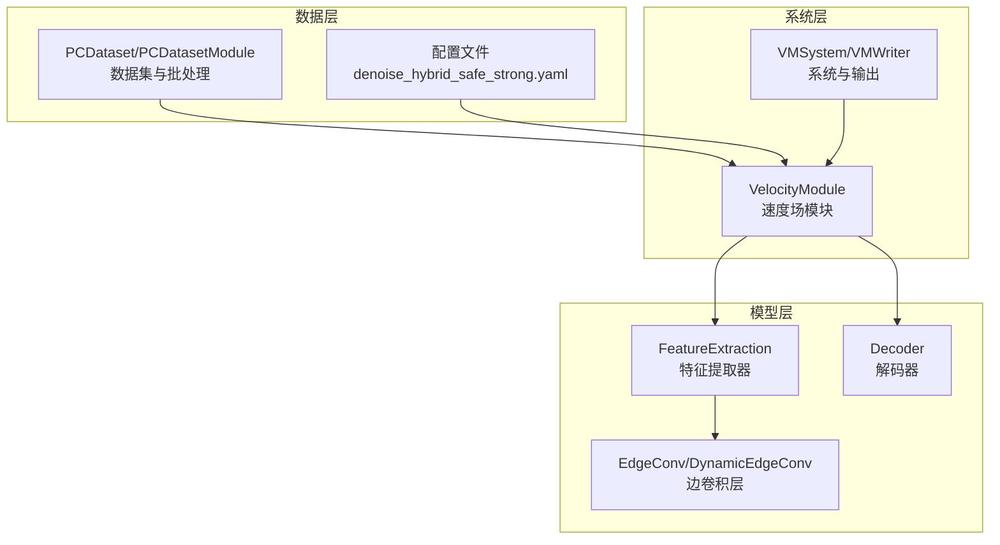
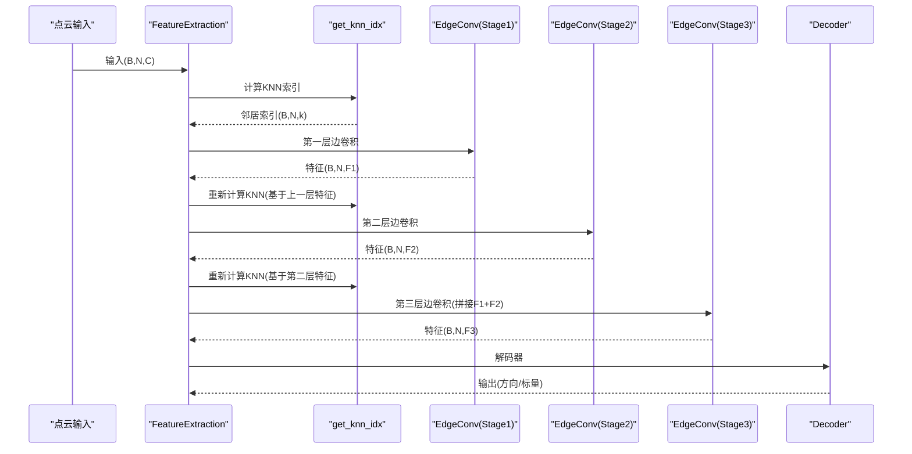
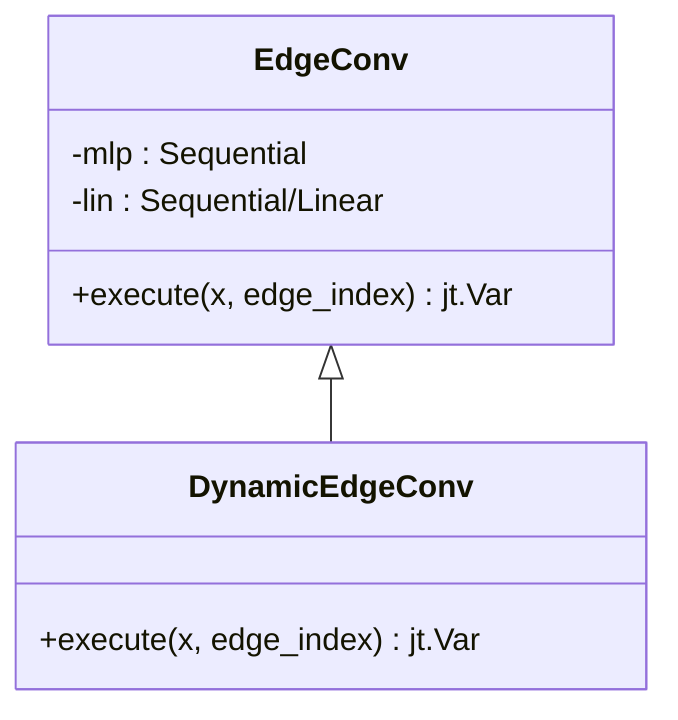
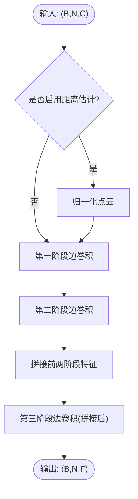
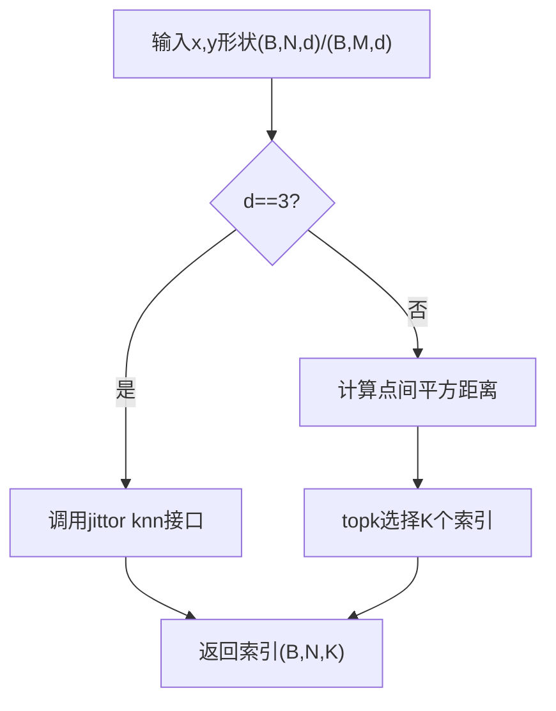
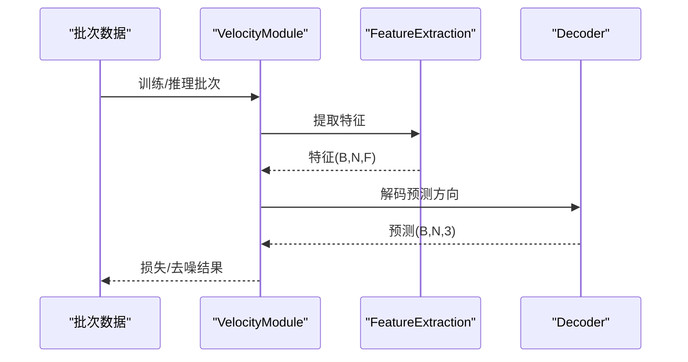
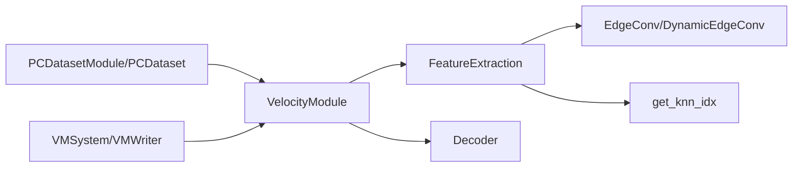

# 特征提取流水线

<cite>
**本文引用的文件**
- [feature.py](file://starter_code/src/model/feature.py)
- [vm.py](file://starter_code/src/model/vm.py)
- [spec.py](file://starter_code/src/model/spec.py)
- [run.py](file://starter_code/run.py)
- [dataset.py](file://starter_code/src/data/dataset.py)
- [vm_system.py](file://starter_code/src/system/vm.py)
- [denoise_hybrid_safe_strong.yaml](file://configs/denoise_hybrid_safe_strong.yaml)
</cite>

## 目录
1. [简介](#简介)
2. [项目结构](#项目结构)
3. [核心组件](#核心组件)
4. [架构总览](#架构总览)
5. [详细组件分析](#详细组件分析)
6. [依赖分析](#依赖分析)
7. [性能考虑](#性能考虑)
8. [故障排除指南](#故障排除指南)
9. [结论](#结论)
10. [附录](#附录)

## 简介
本文件面向Jittor点云去噪项目的特征提取流水线，重点解析FeatureExtraction类的架构设计与实现原理，涵盖EdgeConv层构建、KNN邻域搜索与特征编码机制；解释get_knn_idx函数的K近邻查找算法、特征金字塔构建与多尺度特征融合策略；阐述特征维度变换、激活函数选择与正则化技术；并提供特征可视化方法、性能优化技巧与内存使用分析，以及特征工程最佳实践与故障排除指南。

## 项目结构
该项目采用模块化组织方式，模型相关代码集中在starter_code/src/model目录，系统与数据管道在src/system与src/data中，配置文件位于configs目录。特征提取流水线的核心实现位于feature.py中的FeatureExtraction与EdgeConv类，配合vm.py中的VelocityModule进行端到端训练与推理。

图表来源
- [feature.py:65-139](file://starter_code/src/model/feature.py#L65-L139)
- [vm.py:18-108](file://starter_code/src/model/vm.py#L18-L108)
- [dataset.py:47-168](file://starter_code/src/data/dataset.py#L47-L168)
- [denoise_hybrid_safe_strong.yaml:25-49](file://configs/denoise_hybrid_safe_strong.yaml#L25-L49)

章节来源
- [feature.py:1-196](file://starter_code/src/model/feature.py#L1-L196)
- [vm.py:1-415](file://starter_code/src/model/vm.py#L1-L415)
- [dataset.py:1-269](file://starter_code/src/data/dataset.py#L1-L269)
- [denoise_hybrid_safe_strong.yaml:1-53](file://configs/denoise_hybrid_safe_strong.yaml#L1-L53)

## 核心组件
- EdgeConv/DynamicEdgeConv：基于图神经网络的边卷积层，通过源点与目标点的差分特征聚合消息，并残差连接到线性映射分支，支持可选ReLU激活。
- FeatureExtraction：多阶段边卷积流水线，构建KNN邻接图，执行三阶段特征提取，并在第三阶段对前两阶段特征进行拼接融合。
- get_knn_idx：K近邻索引查找函数，针对3维坐标使用高效knn接口，否则使用显式距离计算与topk选择。
- Decoder：解码器，将特征映射到目标空间（如速度方向），并可选择输出标量或向量。
- VelocityModule：端到端模型封装，负责特征提取、采样与损失计算，以及推理阶段的打点去噪流程。

章节来源
- [feature.py:6-80](file://starter_code/src/model/feature.py#L6-L80)
- [feature.py:65-139](file://starter_code/src/model/feature.py#L65-L139)
- [feature.py:184-196](file://starter_code/src/model/feature.py#L184-L196)
- [feature.py:141-182](file://starter_code/src/model/feature.py#L141-L182)
- [vm.py:18-108](file://starter_code/src/model/vm.py#L18-L108)

## 架构总览
特征提取流水线以点云为输入，按批次执行以下步骤：
- 构建KNN邻接图：使用get_knn_idx获取每个点的K个邻居索引，生成边索引edge_index。
- 多阶段边卷积：在每层使用DynamicEdgeConv对特征进行消息传递与聚合，逐步提升特征表达能力。
- 特征融合：在第三阶段将前两阶段特征拼接后再次卷积，形成多尺度特征金字塔。
- 解码与任务适配：将最终特征送入Decoder，得到预测输出（如速度方向）。

图表来源
- [feature.py:83-102](file://starter_code/src/model/feature.py#L83-L102)
- [feature.py:116-139](file://starter_code/src/model/feature.py#L116-L139)
- [feature.py:184-196](file://starter_code/src/model/feature.py#L184-L196)

## 详细组件分析

### EdgeConv层实现与消息传递机制
EdgeConv通过边索引收集源点与目标点的特征，构造消息tmp=[x_i, x_j - x_i]，经MLP变换后在目标点上scatter加和并取平均，再与线性映射分支相加实现残差连接。DynamicEdgeConv继承自EdgeConv，复用相同的消息传递逻辑。

图表来源
- [feature.py:6-63](file://starter_code/src/model/feature.py#L6-L63)

章节来源
- [feature.py:6-63](file://starter_code/src/model/feature.py#L6-L63)

### FeatureExtraction流水线与多尺度融合
FeatureExtraction包含三个阶段的边卷积，分别将输入维度映射到embedding_dim的1/8、1/4与1倍。第三阶段对前两阶段特征进行拼接，形成多尺度特征金字塔，再进行一次边卷积以整合跨尺度信息。

图表来源
- [feature.py:109-139](file://starter_code/src/model/feature.py#L109-L139)

章节来源
- [feature.py:65-139](file://starter_code/src/model/feature.py#L65-L139)

### KNN邻域搜索与邻接图构建
get_knn_idx根据输入维度选择不同的最近邻策略：当输入为3维坐标时调用高效的knn接口；否则计算点间平方距离并通过topk选择K个最近点。FeatureExtraction在每层执行前调用get_knn_idx，并将索引转换为全局边索引edge_index，用于后续边卷积。

图表来源
- [feature.py:184-196](file://starter_code/src/model/feature.py#L184-L196)

章节来源
- [feature.py:83-102](file://starter_code/src/model/feature.py#L83-L102)
- [feature.py:184-196](file://starter_code/src/model/feature.py#L184-L196)

### 特征维度变换、激活函数与正则化
- 维度变换：第一、二、三阶段分别将通道数映射为embedding_dim的1/8、1/4、1倍，第三阶段拼接后再映射至embedding_dim，形成自顶向下的特征金字塔。
- 激活函数：默认使用ReLU激活，第三阶段关闭激活以保留线性表达能力。
- 正则化：Decoder包含批量归一化与Dropout，缓解过拟合并稳定训练。

章节来源
- [feature.py:74-80](file://starter_code/src/model/feature.py#L74-L80)
- [feature.py:141-182](file://starter_code/src/model/feature.py#L141-L182)

### 端到端训练与推理流程
VelocityModule封装了监督损失计算与Langevin去噪过程。训练时随机采样点子集，提取特征并计算预测方向与目标方向的均方误差；推理时通过多次迭代Langevin更新实现去噪。

图表来源
- [vm.py:45-108](file://starter_code/src/model/vm.py#L45-L108)

章节来源
- [vm.py:18-108](file://starter_code/src/model/vm.py#L18-L108)

## 依赖分析
- FeatureExtraction依赖EdgeConv/DynamicEdgeConv与get_knn_idx，形成边卷积特征提取链。
- VelocityModule依赖FeatureExtraction与Decoder，完成监督学习与推理。
- 数据层通过PCDatasetModule与PCDataset提供批处理与张量化，系统层通过VMSystem/VMWriter完成训练与输出。

图表来源
- [feature.py:65-139](file://starter_code/src/model/feature.py#L65-L139)
- [vm.py:18-108](file://starter_code/src/model/vm.py#L18-L108)
- [dataset.py:47-168](file://starter_code/src/data/dataset.py#L47-L168)
- [vm_system.py:34-59](file://starter_code/src/system/vm.py#L34-L59)

章节来源
- [feature.py:65-139](file://starter_code/src/model/feature.py#L65-L139)
- [vm.py:18-108](file://starter_code/src/model/vm.py#L18-L108)
- [dataset.py:47-168](file://starter_code/src/data/dataset.py#L47-L168)
- [vm_system.py:34-59](file://starter_code/src/system/vm.py#L34-L59)

## 性能考虑
- KNN计算复杂度：当输入为3维坐标时使用高效knn接口，显著降低时间开销；非3维输入需自行计算距离并排序，注意批大小与K值对内存与时间的影响。
- 内存优化：在大规模点云场景下，建议使用流式拼接策略（参考vm.py中的streaming固定拼接），避免构造P×N稠密矩阵，控制峰值显存。
- 训练稳定性：Decoder中使用批量归一化与Dropout，有助于收敛与泛化；合理设置embedding_dim与k值，避免过深导致梯度消失或过浅导致表达不足。
- 推理效率：在推理阶段可减少采样点数或降低k值，同时结合Langevin步数的线性缩放策略平衡速度与质量。

[本节为通用性能指导，无需特定文件来源]

## 故障排除指南
- KNN索引异常：若get_knn_idx返回空或越界，检查输入维度与点数，确保K值不超过可用邻居数。
- 归一化问题：distance_estimation模式下归一化可能导致特征尺度异常，必要时关闭该选项或调整归一化阈值。
- 内存溢出：大规模点云推理时启用流式拼接路径，确保覆盖修复逻辑生效，避免输出点数丢失。
- 训练不稳定：检查Decoder的批量归一化参数与Dropout比例，适当降低学习率或增加正则强度。
- 输出形状不一致：确认批次内样本形状一致，必要时在数据层进行填充或裁剪。

章节来源
- [feature.py:104-107](file://starter_code/src/model/feature.py#L104-L107)
- [vm.py:209-302](file://starter_code/src/model/vm.py#L209-L302)
- [vm.py:333-415](file://starter_code/src/model/vm.py#L333-L415)

## 结论
本特征提取流水线通过多阶段边卷积与KNN邻域聚合，实现了从局部几何到全局特征的有效提取。EdgeConv层的消息传递机制、多尺度融合策略与正则化手段共同提升了模型的表达能力与鲁棒性。结合流式拼接与合理的超参数配置，可在保证质量的同时提升训练与推理效率。

[本节为总结性内容，无需特定文件来源]

## 附录

### 配置要点与超参数
- k：KNN邻域数，影响局部感受野与计算复杂度。
- feat_dim/embedding_dim：特征维度，决定表达能力与内存占用。
- hidden：解码器隐藏层维度，平衡精度与速度。
- hybrid_safe_strong：混合策略开关，结合门控与路由策略提升稳健性。

章节来源
- [denoise_hybrid_safe_strong.yaml:25-49](file://configs/denoise_hybrid_safe_strong.yaml#L25-L49)

### 数据与系统集成
- 数据加载：PCDatasetModule负责批处理与张量化，确保输入形状与类型一致。
- 系统输出：VMWriter支持npy与obj格式导出，便于下游评估与可视化。

章节来源
- [dataset.py:47-168](file://starter_code/src/data/dataset.py#L47-L168)
- [vm_system.py:9-33](file://starter_code/src/system/vm.py#L9-L33)