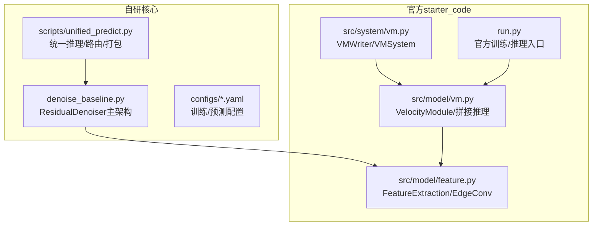
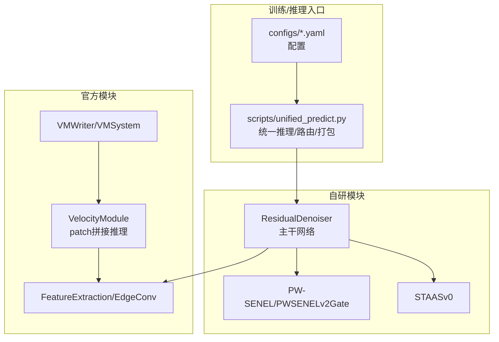
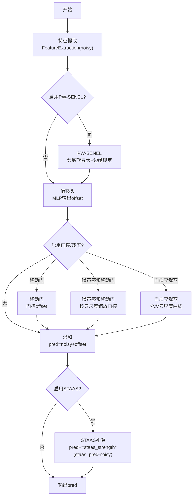
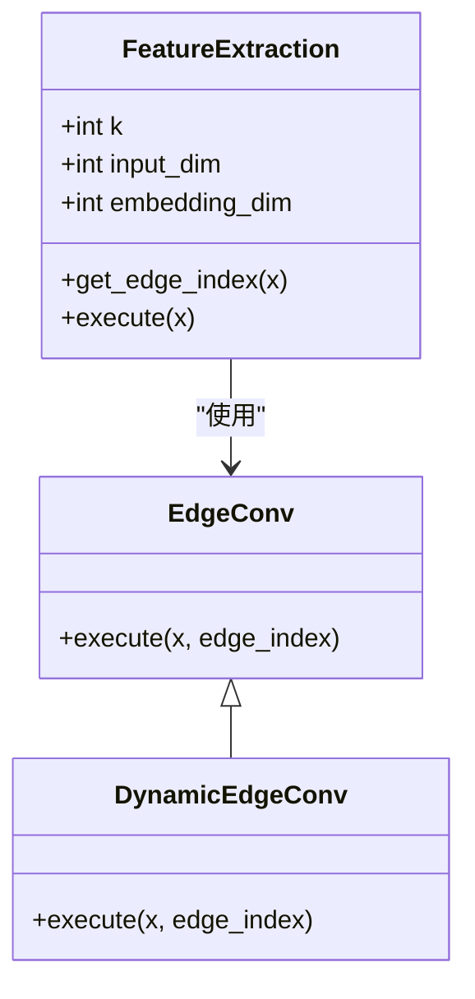
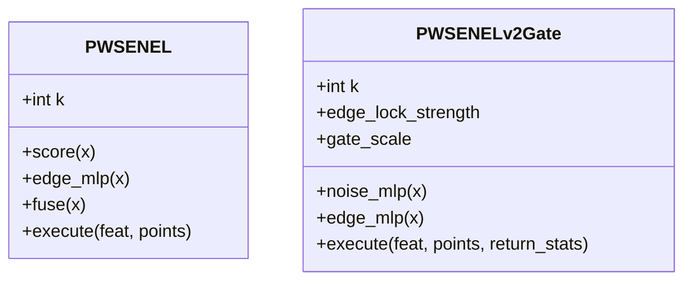
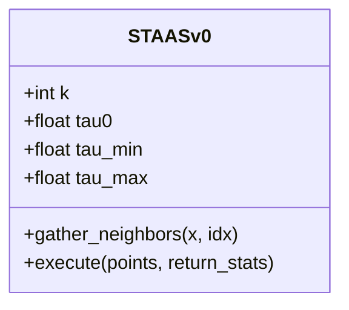
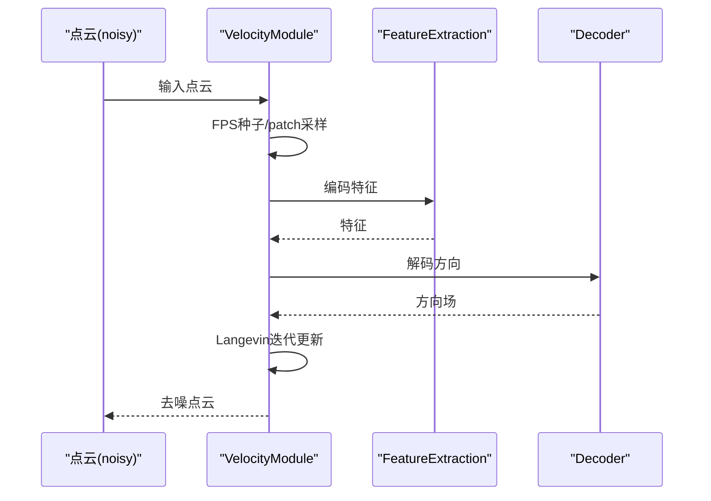
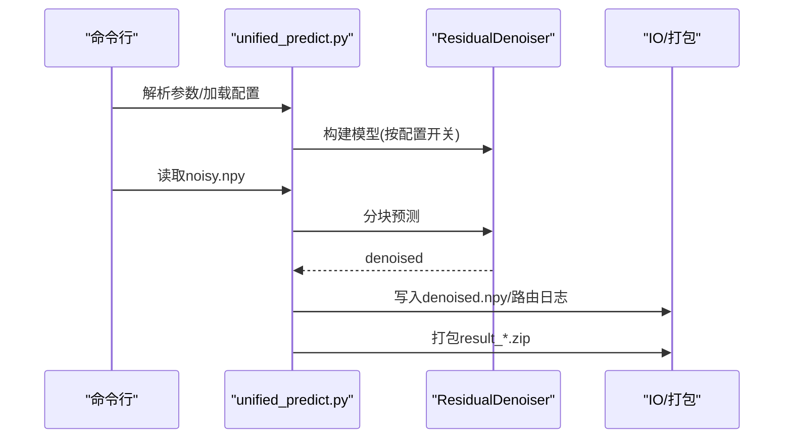
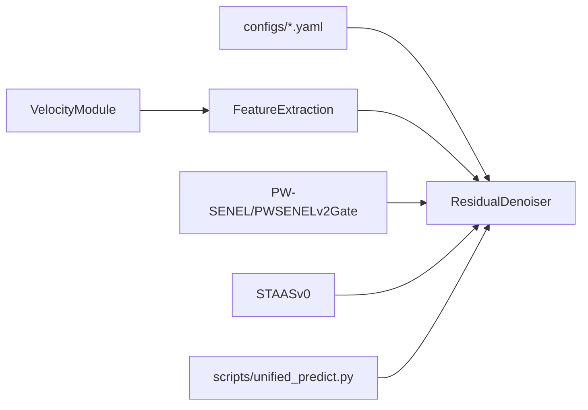

# 核心架构

<cite>
**本文引用的文件**
- [README.md](file://README.md)
- [denoise_baseline.py](file://denoise_baseline.py)
- [starter_code/src/model/feature.py](file://starter_code/src/model/feature.py)
- [starter_code/src/model/vm.py](file://starter_code/src/model/vm.py)
- [starter_code/src/system/vm.py](file://starter_code/src/system/vm.py)
- [starter_code/run.py](file://starter_code/run.py)
- [configs/denoise_baseline.yaml](file://configs/denoise_baseline.yaml)
- [configs/denoise_pwsenel.yaml](file://configs/denoise_pwsenel.yaml)
- [configs/denoise_staas_v0.yaml](file://configs/denoise_staas_v0.yaml)
- [configs/denoise_pwsenel_v2_adaptive_clip_piecewise.yaml](file://configs/denoise_pwsenel_v2_adaptive_clip_piecewise.yaml)
- [configs/denoise_noise_aware_move_gate.yaml](file://configs/denoise_noise_aware_move_gate.yaml)
- [scripts/unified_predict.py](file://scripts/unified_predict.py)
- [starter_code/README.md](file://starter_code/README.md)
</cite>

## 目录
1. [引言](#引言)
2. [项目结构](#项目结构)
3. [核心组件](#核心组件)
4. [架构总览](#架构总览)
5. [详细组件分析](#详细组件分析)
6. [依赖分析](#依赖分析)
7. [性能考虑](#性能考虑)
8. [故障排查指南](#故障排查指南)
9. [结论](#结论)
10. [附录](#附录)

## 引言
本项目围绕“Jittor点云去噪”竞赛任务，构建了可复现实验基线与可插拔几何增强模块的统一架构。系统采用“残差去噪基线 + 官方starter_code集成 + 自研竞赛代码分离”的设计，既复用官方特征提取能力，又通过模块化开关实现PW-SENEL与ST-AAS等可选几何增强的A/B测试与混合路由。

- 基线理念：pred_clean = noisy + offset，强调可解释、可复现、可扩展。
- 官方集成：starter_code中的FeatureExtraction/Decoder等模块直接复用，不污染自研路径。
- 竞赛代码：自研ResidualDenoiser及其子模块（PW-SENEL、ST-AAS、移动门、自适应裁剪等）以开关形式挂载，便于A/B与回退。

章节来源
- [README.md:14-50](file://README.md#L14-L50)

## 项目结构
仓库采用“自研代码 + 官方starter_code + 配置与脚本”的分层组织：
- 自研核心：denoise_baseline.py（ResidualDenoiser主架构、几何模块、训练/推理入口）
- 官方starter_code：src/model/feature.py（EdgeConv特征提取）、src/model/vm.py（VelocityModule与拼接推理）、src/system/vm.py（VMWriter/VMSystem）、run.py（官方训练/推理入口）
- 配置：configs/ 下的多套训练/预测配置，覆盖baseline、PW-SENEL、ST-AAS、自适应裁剪、噪声感知移动门等
- 脚本：scripts/unified_predict.py（统一推理/路由/打包），配套环境与依赖检查脚本

图表来源
- [denoise_baseline.py:480-732](file://denoise_baseline.py#L480-L732)
- [starter_code/src/model/feature.py:65-139](file://starter_code/src/model/feature.py#L65-L139)
- [starter_code/src/model/vm.py:18-140](file://starter_code/src/model/vm.py#L18-L140)
- [starter_code/src/system/vm.py:34-59](file://starter_code/src/system/vm.py#L34-L59)
- [starter_code/run.py:36-140](file://starter_code/run.py#L36-L140)

章节来源
- [README.md:52-77](file://README.md#L52-L77)
- [starter_code/README.md:1-67](file://starter_code/README.md#L1-L67)

## 核心组件
- ResidualDenoiser（主干网络）
  - 复用官方FeatureExtraction进行动态图EdgeConv特征提取
  - 可选PW-SENEL（软最大噪声抑制 + 最大池化边缘锁定）
  - 可选ST-AAS v0（密度自适应softmax平滑 + 结构张量边缘抑制）
  - 可选移动门/噪声感知移动门/自适应裁剪/混合安全-强分支路由
  - MLP偏移头输出pred = noisy + offset，并支持返回offset供下游使用
- 几何增强模块
  - PWSENEL/PWSENELv2Gate：基于邻域一致性学习噪声置信度与边缘锁定强度，对神经偏移进行门控
  - STAASv0：单KNN密度自适应温度的软最大平滑，结合结构张量不变量抑制边缘区域的过度平滑
- 官方集成
  - FeatureExtraction/EdgeConv：动态图卷积特征提取
  - VelocityModule：官方VM推理框架（patch-based denoise + 固定拼接）
  - VMWriter/VMSystem：输出写盘与系统封装

章节来源
- [denoise_baseline.py:480-732](file://denoise_baseline.py#L480-L732)
- [starter_code/src/model/feature.py:65-139](file://starter_code/src/model/feature.py#L65-L139)
- [starter_code/src/model/vm.py:18-140](file://starter_code/src/model/vm.py#L18-L140)
- [starter_code/src/system/vm.py:34-59](file://starter_code/src/system/vm.py#L34-L59)

## 架构总览
系统边界与交互关系：
- 系统边界
  - 自研边界：denoise_baseline.py及其中的ResidualDenoiser、PW-SENEL、STAAS等模块
  - 官方边界：starter_code/src/model/feature.py、vm.py、system/vm.py
- 关键交互
  - 训练/推理入口：scripts/unified_predict.py（统一推理）与configs/*.yaml（配置驱动）
  - 特征提取：ResidualDenoiser调用官方FeatureExtraction
  - 几何增强：PW-SENEL/STAAS按配置开关接入主干
  - 输出：统一写盘（.npy）或官方VM Writer

图表来源
- [scripts/unified_predict.py:83-119](file://scripts/unified_predict.py#L83-L119)
- [denoise_baseline.py:480-732](file://denoise_baseline.py#L480-L732)
- [starter_code/src/model/feature.py:65-139](file://starter_code/src/model/feature.py#L65-L139)
- [starter_code/src/model/vm.py:18-140](file://starter_code/src/model/vm.py#L18-L140)
- [starter_code/src/system/vm.py:34-59](file://starter_code/src/system/vm.py#L34-L59)

## 详细组件分析

### ResidualDenoiser主架构
- 设计要点
  - 残差偏移回归：pred = noisy + offset，offset由神经头输出并通过可选门控/裁剪/融合得到
  - 特征主干：FeatureExtraction（EdgeConv动态图卷积）提取局部几何特征
  - 模块化开关：PW-SENEL、STAAS、移动门、自适应裁剪、混合路由等均可独立开启
- 数据流路径
  - 输入：noisy点云
  - 特征提取：FeatureExtraction(noisy)
  - 可选几何增强：PW-SENEL/STAAS按需接入
  - 偏移头：MLP输出offset
  - 门控/裁剪：移动门、噪声感知移动门、自适应裁剪等
  - 融合：pred = noisy + offset（可叠加STAAS补偿项）
  - 输出：pred或(offset, pred)二元组

图表来源
- [denoise_baseline.py:602-732](file://denoise_baseline.py#L602-L732)
- [starter_code/src/model/feature.py:65-139](file://starter_code/src/model/feature.py#L65-L139)

章节来源
- [denoise_baseline.py:480-732](file://denoise_baseline.py#L480-L732)

### EdgeConv特征提取
- 动态图卷积：基于KNN构建边，消息来自[x_i, x_j-x_i]，经MLP聚合后与残差连接
- 多层堆叠：conv1/conv2/conv3，逐步扩大感受野与表征维度
- 归一化：可选距离估计场景下的归一化

图表来源
- [starter_code/src/model/feature.py:6-139](file://starter_code/src/model/feature.py#L6-L139)

章节来源
- [starter_code/src/model/feature.py:65-139](file://starter_code/src/model/feature.py#L65-L139)

### PW-SENEL与PWSENELv2Gate
- PW-SENEL：邻域软最大噪声置信度抑制 + 最大池化边缘响应锁定，融合后残差加回到特征
- PWSENELv2Gate：显式学习噪声置信度与边缘锁定强度，对神经偏移进行门控，支持返回统计量

图表来源
- [denoise_baseline.py:259-375](file://denoise_baseline.py#L259-L375)

章节来源
- [denoise_baseline.py:259-375](file://denoise_baseline.py#L259-L375)

### ST-AAS v0
- 单KNN密度自适应温度的软最大平滑，结合结构张量不变量（线性度、平面度、散射度）抑制边缘区域的过度平滑
- 可作为独立分支或与主干融合

图表来源
- [denoise_baseline.py:377-477](file://denoise_baseline.py#L377-L477)

章节来源
- [denoise_baseline.py:377-477](file://denoise_baseline.py#L377-L477)

### 官方VM推理与拼接
- VelocityModule：基于特征编码器与解码器的监督目标，配合Langevin迭代去噪
- patch-based固定拼接：FPS种子 + KNN patch + exp(-距离)加权拼接，修复未覆盖点
- streaming固定拼接：O(N)内存替代dense全量分配，适配大云

图表来源
- [starter_code/src/model/vm.py:18-140](file://starter_code/src/model/vm.py#L18-L140)

章节来源
- [starter_code/src/model/vm.py:18-140](file://starter_code/src/model/vm.py#L18-L140)

### 统一推理与路由
- scripts/unified_predict.py：统一入口，支持硬阈值/软混合/强制分支/轻量迭代精修（LIR）等模式
- 路由统计：基于平面残差分位数估计噪声水平，指导分支选择
- 提交打包：按官方要求重打包提交zip

图表来源
- [scripts/unified_predict.py:412-606](file://scripts/unified_predict.py#L412-L606)

章节来源
- [scripts/unified_predict.py:83-119](file://scripts/unified_predict.py#L83-L119)
- [scripts/unified_predict.py:412-606](file://scripts/unified_predict.py#L412-L606)

## 依赖分析
- 自研模块对官方模块的依赖
  - ResidualDenoiser依赖FeatureExtraction进行特征提取
  - 统一推理脚本依赖ResidualDenoiser与预测分块函数
- 配置驱动的模块装配
  - configs/*.yaml通过布尔开关控制PW-SENEL/STAAS/移动门/自适应裁剪/混合路由等
- 官方VM推理与自研基线的并行路径
  - starter_code提供VM推理框架，与自研基线互不干扰

图表来源
- [configs/denoise_baseline.yaml:30-44](file://configs/denoise_baseline.yaml#L30-L44)
- [configs/denoise_pwsenel.yaml:30-44](file://configs/denoise_pwsenel.yaml#L30-L44)
- [configs/denoise_staas_v0.yaml:30-44](file://configs/denoise_staas_v0.yaml#L30-L44)
- [configs/denoise_pwsenel_v2_adaptive_clip_piecewise.yaml:25-54](file://configs/denoise_pwsenel_v2_adaptive_clip_piecewise.yaml#L25-L54)
- [configs/denoise_noise_aware_move_gate.yaml:25-47](file://configs/denoise_noise_aware_move_gate.yaml#L25-L47)
- [denoise_baseline.py:480-732](file://denoise_baseline.py#L480-L732)
- [starter_code/src/model/feature.py:65-139](file://starter_code/src/model/feature.py#L65-L139)
- [starter_code/src/model/vm.py:18-140](file://starter_code/src/model/vm.py#L18-L140)

章节来源
- [configs/denoise_baseline.yaml:30-44](file://configs/denoise_baseline.yaml#L30-L44)
- [configs/denoise_pwsenel.yaml:30-44](file://configs/denoise_pwsenel.yaml#L30-L44)
- [configs/denoise_staas_v0.yaml:30-44](file://configs/denoise_staas_v0.yaml#L30-L44)
- [configs/denoise_pwsenel_v2_adaptive_clip_piecewise.yaml:25-54](file://configs/denoise_pwsenel_v2_adaptive_clip_piecewise.yaml#L25-L54)
- [configs/denoise_noise_aware_move_gate.yaml:25-47](file://configs/denoise_noise_aware_move_gate.yaml#L25-L47)
- [denoise_baseline.py:480-732](file://denoise_baseline.py#L480-L732)
- [starter_code/src/model/feature.py:65-139](file://starter_code/src/model/feature.py#L65-L139)
- [starter_code/src/model/vm.py:18-140](file://starter_code/src/model/vm.py#L18-L140)

## 性能考虑
- 计算与内存
  - EdgeConv动态图卷积在KNN邻域内聚合，复杂度与K、N相关；可通过调整K与批内patch大小平衡精度与速度
  - 自适应裁剪/移动门可抑制过大幅偏移，减少无效更新，提升稳定性
- 大云推理
  - 官方提供dense与streaming两种固定拼接策略，避免P×N稠密矩阵带来的内存峰值
- 训练稳定性
  - 残差偏移回归与辅助Chamfer损失（配置中可设置cd_weight）有助于稳定收敛
  - 混合安全-强分支路由在低噪声区域保守，在高噪声区域释放更强移动能力

## 故障排查指南
- 环境与依赖
  - 使用scripts/env.sh与scripts/install_deps.sh初始化环境；若CuPy安装缓慢，可使用镜像源
- 数据准备
  - 确认dataset_train与dataset_test_noisy目录存在；使用scripts/check_data.py核验数据
- 训练与推理
  - 使用scripts/train.sh与scripts/predict.sh进行基线训练与预测
  - 统一推理入口：scripts/unified_predict.py，支持路由模式与提交打包
- 官方VM路径
  - starter_code/run.py提供官方训练/推理入口，适用于VM框架对比

章节来源
- [README.md:108-143](file://README.md#L108-L143)
- [README.md:167-248](file://README.md#L167-L248)
- [starter_code/README.md:1-67](file://starter_code/README.md#L1-L67)

## 结论
本项目以“残差偏移回归 + 官方特征复用 + 自研几何增强模块”的方式，构建了可复现、可扩展、可A/B测试的点云去噪系统。ResidualDenoiser通过模块化开关将PW-SENEL、STAAS、移动门、自适应裁剪与混合路由有机整合，形成从基础baseline到高级增强的渐进式能力谱系。官方starter_code与自研代码严格分离，既保证了竞赛合规性，也为后续扩展提供了清晰边界。

## 附录
- 配置示例
  - 基线：configs/denoise_baseline.yaml
  - PW-SENEL：configs/denoise_pwsenel.yaml
  - ST-AAS v0：configs/denoise_staas_v0.yaml
  - 自适应裁剪（Piecewise）：configs/denoise_pwsenel_v2_adaptive_clip_piecewise.yaml
  - 噪声感知移动门：configs/denoise_noise_aware_move_gate.yaml
- 官方VM说明
  - starter_code/README.md给出环境、数据、训练与推理流程

章节来源
- [configs/denoise_baseline.yaml:1-44](file://configs/denoise_baseline.yaml#L1-L44)
- [configs/denoise_pwsenel.yaml:1-44](file://configs/denoise_pwsenel.yaml#L1-L44)
- [configs/denoise_staas_v0.yaml:1-44](file://configs/denoise_staas_v0.yaml#L1-L44)
- [configs/denoise_pwsenel_v2_adaptive_clip_piecewise.yaml:1-54](file://configs/denoise_pwsenel_v2_adaptive_clip_piecewise.yaml#L1-L54)
- [configs/denoise_noise_aware_move_gate.yaml:1-47](file://configs/denoise_noise_aware_move_gate.yaml#L1-L47)
- [starter_code/README.md:1-67](file://starter_code/README.md#L1-L67)