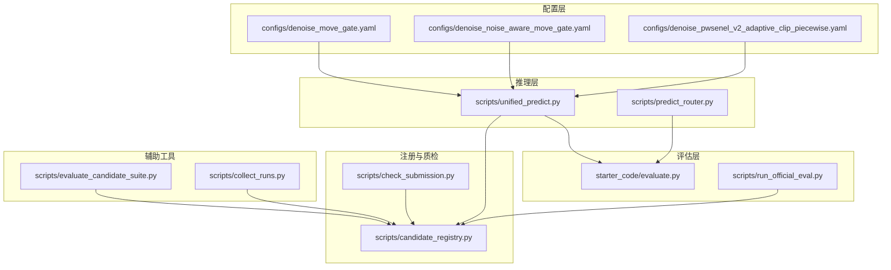
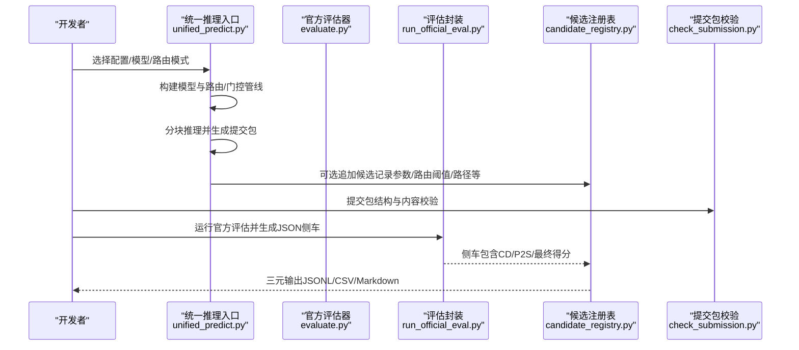
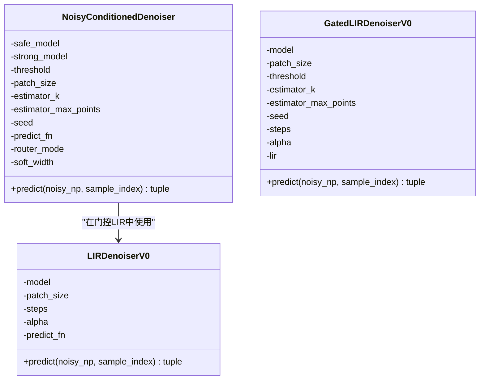
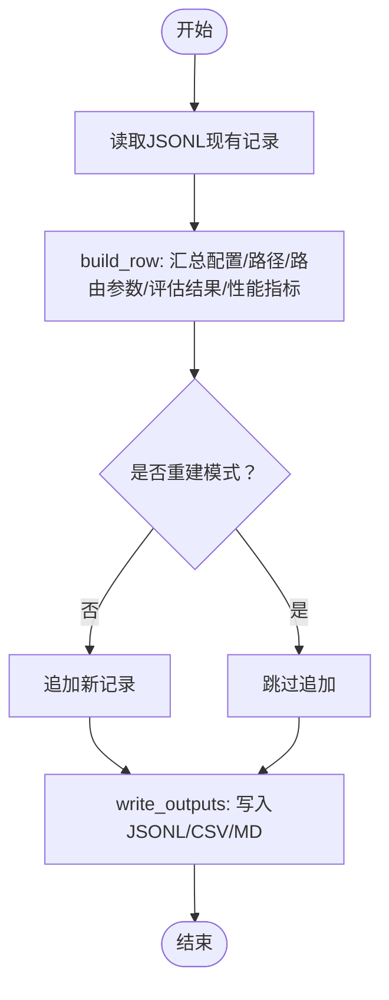
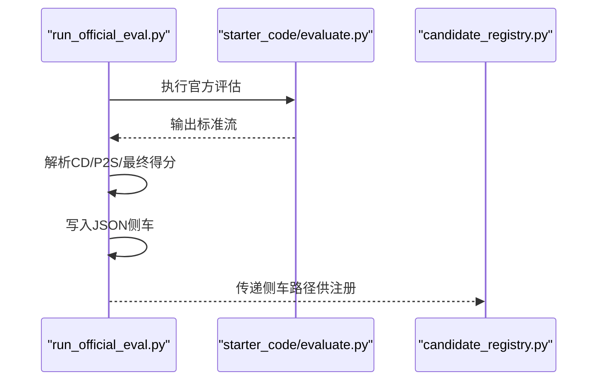
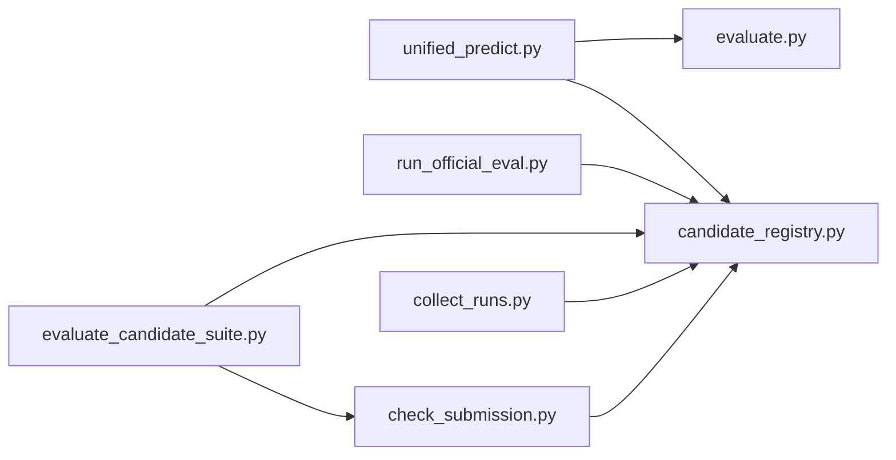

# A/B测试框架

<cite>
**本文引用的文件**
- [CANDIDATE_REGISTRY.md](file://docs/CANDIDATE_REGISTRY.md)
- [candidate_registry.md](file://experiments/candidate_registry.md)
- [candidate_registry.csv](file://experiments/candidate_registry.csv)
- [candidate_registry.py](file://scripts/candidate_registry.py)
- [unified_predict.py](file://scripts/unified_predict.py)
- [run_official_eval.py](file://scripts/run_official_eval.py)
- [evaluate.py](file://starter_code/evaluate.py)
- [evaluate_candidate_suite.py](file://scripts/evaluate_candidate_suite.py)
- [collect_runs.py](file://scripts/collect_runs.py)
- [check_submission.py](file://scripts/check_submission.py)
- [predict_router.py](file://scripts/predict_router.py)
- [README.md](file://docs/experiments/README.md)
- [denoise_move_gate.yaml](file://configs/denoise_move_gate.yaml)
- [denoise_noise_aware_move_gate.yaml](file://configs/denoise_noise_aware_move_gate.yaml)
- [denoise_pwsenel_v2_adaptive_clip_piecewise.yaml](file://configs/denoise_pwsenel_v2_adaptive_clip_piecewise.yaml)
</cite>

## 目录
1. [引言](#引言)
2. [项目结构](#项目结构)
3. [核心组件](#核心组件)
4. [架构总览](#架构总览)
5. [详细组件分析](#详细组件分析)
6. [依赖关系分析](#依赖关系分析)
7. [性能考量](#性能考量)
8. [故障排查指南](#故障排查指南)
9. [结论](#结论)
10. [附录](#附录)

## 引言
本技术文档系统阐述Jittor点云去噪项目的A/B测试框架，围绕模块化设计、候选注册表、实验记录规范、结果分析方法展开。重点说明以下方面：
- 如何通过统一入口与路由/门控模块实现A/B兼容的推理管线；
- 候选注册表的三元同步输出（JSONL/CSV/Markdown）与非争议性提交规则；
- 实验对比策略、统计显著性检验思路与渐进式改进理念；
- 模块回退机制与性能监控指标；
- A/B测试设计指南、实验执行流程与结果解读方法；
- 结合实际案例的数据分析示例。

## 项目结构
该项目采用“配置驱动 + 统一推理入口 + 官方评估封装 + 注册表自动化”的工程化组织方式：
- 配置层：configs/*.yaml定义实验、路径、训练与预测参数；
- 推理层：scripts/unified_predict.py作为统一入口，支持硬路由、软路由、LIR与门控LIR；
- 评估层：starter_code/evaluate.py提供官方指标计算；scripts/run_official_eval.py封装输出；
- 注册层：scripts/candidate_registry.py自动维护候选注册表三元文件；
- 质检层：scripts/check_submission.py进行提交包结构与内容校验；
- 辅助工具：scripts/evaluate_candidate_suite.py用于隐藏测试安全的候选套件评估；scripts/collect_runs.py汇总训练运行摘要。

图表来源
- [unified_predict.py:412-606](file://scripts/unified_predict.py#L412-L606)
- [predict_router.py:215-330](file://scripts/predict_router.py#L215-L330)
- [run_official_eval.py:62-125](file://scripts/run_official_eval.py#L62-L125)
- [evaluate.py:232-365](file://starter_code/evaluate.py#L232-L365)
- [candidate_registry.py:305-365](file://scripts/candidate_registry.py#L305-L365)
- [check_submission.py:158-192](file://scripts/check_submission.py#L158-L192)
- [evaluate_candidate_suite.py:396-444](file://scripts/evaluate_candidate_suite.py#L396-L444)
- [collect_runs.py:197-225](file://scripts/collect_runs.py#L197-L225)

章节来源
- [CANDIDATE_REGISTRY.md:1-106](file://docs/CANDIDATE_REGISTRY.md#L1-L106)
- [README.md:1-18](file://docs/experiments/README.md#L1-L18)

## 核心组件
- 统一推理入口（UnifiedDenoisePipeline）
  - 支持硬路由、软路由、强制路由与LIR门控等A/B兼容模式；
  - 生成标准化路由日志与提交包，可选追加候选注册表。
- 候选注册表（Candidate Registry）
  - 三元同步输出：JSONL（机器可读）、CSV（表格友好）、Markdown（人类摘要）；
  - 非争议性提交规则：要求可复现实验材料、SHA256、路由/切片参数、官方评估结果或明确理由。
- 官方评估封装（run_official_eval.py）
  - 捕获官方starter_code/evaluate.py输出，提取CD/P2S/最终得分并写入JSON侧车；
  - 供候选注册表脚本读取，形成闭环记录。
- 提交包校验（check_submission.py）
  - 结构、数量、形状、类型、有限值与可选test-root匹配校验；
  - 作为正式提交前的硬门槛。
- 候选套件评估（evaluate_candidate_suite.py）
  - 隐藏测试安全：仅基于zip与noisy输入进行包结构、SHA256、逐点位移分析；
  - 生成风险报告，指导是否进入下一阶段。

章节来源
- [unified_predict.py:412-606](file://scripts/unified_predict.py#L412-L606)
- [candidate_registry.py:1-365](file://scripts/candidate_registry.py#L1-L365)
- [run_official_eval.py:62-125](file://scripts/run_official_eval.py#L62-L125)
- [check_submission.py:68-157](file://scripts/check_submission.py#L68-L157)
- [evaluate_candidate_suite.py:288-334](file://scripts/evaluate_candidate_suite.py#L288-L334)

## 架构总览
下图展示A/B测试框架在项目中的交互关系与数据流：

图表来源
- [unified_predict.py:412-606](file://scripts/unified_predict.py#L412-L606)
- [run_official_eval.py:62-125](file://scripts/run_official_eval.py#L62-L125)
- [evaluate.py:232-365](file://starter_code/evaluate.py#L232-L365)
- [candidate_registry.py:305-365](file://scripts/candidate_registry.py#L305-L365)
- [check_submission.py:158-192](file://scripts/check_submission.py#L158-L192)

## 详细组件分析

### 统一推理入口（UnifiedDenoisePipeline）
- 设计要点
  - 延迟导入Jittor，避免CLI解析阶段初始化CUDA；
  - 通过配置与profile合并构建模型参数，确保候选间可比性；
  - 支持多种路由/门控模式：硬路由、软路由、强制路由、LIR与门控LIR；
  - 生成标准化路由日志与提交包，便于后续注册与评估。
- 关键类与函数
  - NoisyConditionedDenoiser：噪声条件路由器，支持硬/软/强制模式；
  - GatedLIRDenoiserV0：噪声条件门控LIR，仅用noisy统计决定是否进入迭代细化；
  - LIRDenoiserV0：轻量LIR迭代器，固定步数与权重；
  - run_registry：调用候选注册表脚本，追加记录。
- 数据流
  - 输入：noisy.npy集合；
  - 处理：按patch/chunk推理，按阈值/统计量路由至不同模型；
  - 输出：denoised.npy集合、路由日志、可选提交包与注册表条目。

图表来源
- [unified_predict.py:274-350](file://scripts/unified_predict.py#L274-L350)
- [unified_predict.py:200-272](file://scripts/unified_predict.py#L200-L272)
- [unified_predict.py:155-198](file://scripts/unified_predict.py#L155-L198)

章节来源
- [unified_predict.py:412-606](file://scripts/unified_predict.py#L412-L606)

### 候选注册表（Candidate Registry）
- 设计要点
  - 三元同步输出：JSONL（主数据源）、CSV（表格）、Markdown（摘要）；
  - 字段稳定扩展：新增字段只追加不重排，避免旧记录与外部脚本列语义漂移；
  - 自动化：仅记录已有artifact与配置，不参与训练/推理/评估；
  - 非争议性提交规则：要求可复现实验材料、SHA256、路由/切片参数、官方评估结果或明确理由。
- 关键流程
  - build_row：汇总配置、路径、路由参数、官方评估结果与性能指标；
  - load_existing：从JSONL重建CSV/MD，跳过坏行；
  - write_outputs：统一重写三份输出，保证一致性。

图表来源
- [candidate_registry.py:167-228](file://scripts/candidate_registry.py#L167-L228)
- [candidate_registry.py:230-302](file://scripts/candidate_registry.py#L230-L302)
- [candidate_registry.py:305-365](file://scripts/candidate_registry.py#L305-L365)

章节来源
- [candidate_registry.py:1-365](file://scripts/candidate_registry.py#L1-L365)
- [CANDIDATE_REGISTRY.md:21-31](file://docs/CANDIDATE_REGISTRY.md#L21-L31)

### 官方评估封装（run_official_eval.py）
- 设计要点
  - 包装starter_code/evaluate.py，捕获标准输出并解析CD/P2S/最终得分；
  - 写入JSON侧车，供候选注册表脚本读取；
  - 保留返回码，便于上层脚本处理失败场景。
- 关键流程
  - 构造命令并执行官方评估器；
  - 解析输出，构造payload并写入JSON侧车；
  - 输出侧车路径，异常时抛出SystemExit。

图表来源
- [run_official_eval.py:62-125](file://scripts/run_official_eval.py#L62-L125)
- [evaluate.py:232-365](file://starter_code/evaluate.py#L232-L365)

章节来源
- [run_official_eval.py:62-125](file://scripts/run_official_eval.py#L62-L125)
- [evaluate.py:1-365](file://starter_code/evaluate.py#L1-L365)

### 提交包校验（check_submission.py）
- 设计要点
  - 校验zip存在性与可读性；
  - 校验条目路径、数量、形状、dtype与有限值；
  - 可选与test_root匹配，确保提交包与隐藏测试结构一致；
  - 一次性报告所有错误，便于批量修复。
- 关键流程
  - 从test_root推导期望条目集合；
  - 逐项校验zip内npy文件；
  - 输出统计信息与匹配情况。

章节来源
- [check_submission.py:68-157](file://scripts/check_submission.py#L68-L157)

### 候选套件评估（evaluate_candidate_suite.py）
- 设计要点
  - 隐藏测试安全：不依赖GT，仅基于zip与noisy输入；
  - 包结构与SHA256校验；
  - 逐点位移分析（vs noisy与基准包）；
  - 可选读取诊断CSV并汇总关键统计；
  - 生成summary.json与risk_report.md。
- 关键流程
  - inventory_zip：清点文件、统计形状/类型/有限值范围；
  - movement_vs_noisy：与noisy位移分布；
  - movement_vs_base：与基准包位移分布；
  - write_suite_reports：生成报告。

章节来源
- [evaluate_candidate_suite.py:185-250](file://scripts/evaluate_candidate_suite.py#L185-L250)
- [evaluate_candidate_suite.py:336-381](file://scripts/evaluate_candidate_suite.py#L336-L381)

### 训练运行汇总（collect_runs.py）
- 设计要点
  - 从experiments/runs/*读取训练日志，提取最终指标；
  - 合并config与profile，输出CSV汇总；
  - 便于横向对比不同配置/profile的收敛与稳定性。
- 关键流程
  - 解析train.log中的最终指标；
  - 读取config.final.yaml与profile.yaml；
  - 写入CSV。

章节来源
- [collect_runs.py:126-140](file://scripts/collect_runs.py#L126-L140)
- [collect_runs.py:142-195](file://scripts/collect_runs.py#L142-L195)

## 依赖关系分析
- 组件耦合
  - unified_predict.py依赖模型实现与预测函数，通过配置/profile解耦具体候选；
  - candidate_registry.py依赖run_official_eval.py的侧车输出，形成闭环；
  - check_submission.py与unified_predict.py共同保障提交包质量；
  - evaluate_candidate_suite.py与check_submission.py互补，前者更侧重风险分析。
- 外部依赖
  - Jittor（CUDA可选）；
  - numpy/scipy（空间统计与最近邻）；
  - point-cloud-utils（P2S精确计算，可选）。

图表来源
- [unified_predict.py:412-606](file://scripts/unified_predict.py#L412-L606)
- [candidate_registry.py:305-365](file://scripts/candidate_registry.py#L305-L365)
- [run_official_eval.py:62-125](file://scripts/run_official_eval.py#L62-L125)
- [check_submission.py:158-192](file://scripts/check_submission.py#L158-L192)
- [evaluate_candidate_suite.py:396-444](file://scripts/evaluate_candidate_suite.py#L396-L444)
- [collect_runs.py:197-225](file://scripts/collect_runs.py#L197-L225)

章节来源
- [unified_predict.py:412-606](file://scripts/unified_predict.py#L412-L606)
- [candidate_registry.py:305-365](file://scripts/candidate_registry.py#L305-L365)
- [run_official_eval.py:62-125](file://scripts/run_official_eval.py#L62-L125)
- [check_submission.py:158-192](file://scripts/check_submission.py#L158-L192)
- [evaluate_candidate_suite.py:396-444](file://scripts/evaluate_candidate_suite.py#L396-L444)
- [collect_runs.py:197-225](file://scripts/collect_runs.py#L197-L225)

## 性能考量
- 推理性能
  - 分块推理（patch/chunk）与可配置阈值/温度参数，平衡速度与稳定性；
  - 路由统计（如plane_res_p75）在限定采样点与随机种子下可复现。
- 评估性能
  - 官方评估器支持多进程并行与可选PCU后端；
  - 候选套件评估对逐点位移分析设置样本上限，避免大样本成本。
- 存储与一致性
  - 提交包仅包含必需文件，避免冗余；
  - 注册表字段标准化，减少下游解析成本。

## 故障排查指南
- 提交包问题
  - 检查zip条目数量、形状、dtype与有限值；
  - 对照test_root结构，确认缺失/多余条目；
  - 使用check_submission.py一次性定位问题。
- 官方评估失败
  - run_official_eval.py会保留侧车与返回码，便于定位；
  - 确认pred/gt/noisy/mesh目录结构与文件名一致。
- 候选注册表异常
  - JSONL坏行会被跳过，不影响重建；
  - 确保字段顺序与schema一致，避免列语义漂移。
- 套件评估无GT
  - 仅进行包结构与位移分析，不主张新的官方分数；
  - 依据风险报告决定是否推进到下一阶段。

章节来源
- [check_submission.py:140-157](file://scripts/check_submission.py#L140-L157)
- [run_official_eval.py:118-121](file://scripts/run_official_eval.py#L118-L121)
- [candidate_registry.py:172-182](file://scripts/candidate_registry.py#L172-L182)
- [evaluate_candidate_suite.py:336-381](file://scripts/evaluate_candidate_suite.py#L336-L381)

## 结论
本A/B测试框架通过“配置驱动 + 统一入口 + 官方评估 + 注册表自动化 + 提交包校验”的闭环，实现了：
- 模块化设计：路由/门控/迭代细化均可在统一接口下切换；
- 可复现性：严格的提交规则与注册表字段，确保可追溯；
- 渐进式改进：隐藏测试安全的套件评估与门控策略，降低风险；
- 性能与质量双保障：分块推理、并行评估与结构化校验协同。

## 附录

### A/B测试设计指南
- 设计原则
  - A/B兼容：统一入口与路由/门控接口，确保候选可比；
  - 可复现：严格记录配置、路由参数、提交包与评估侧车；
  - 渐进式：先隐藏测试安全验证，再逐步引入官方评估。
- 实验执行流程
  - 选择配置/模型/路由模式；
  - 运行统一推理入口生成提交包；
  - 提交包结构与内容校验；
  - 运行官方评估并生成侧车；
  - 追加候选注册表；
  - （可选）隐藏测试安全套件评估与风险报告。
- 结果解读方法
  - 官方指标：CD/P2S/最终得分；
  - 注册表字段：路由阈值、切片/重叠策略、性能指标、结论与备注；
  - 套件评估：位移分布与基准对比，识别潜在风险。

章节来源
- [CANDIDATE_REGISTRY.md:58-95](file://docs/CANDIDATE_REGISTRY.md#L58-L95)
- [README.md:1-18](file://docs/experiments/README.md#L1-L18)

### 实验案例与数据分析示例
- 案例1：混合路由（VM锚点 + LIR门控）
  - 统一入口模式：gated-lir；
  - 路由阈值：基于noisy统计的门限；
  - 官方评估：CD/P2S/最终得分侧车；
  - 注册表记录：分支、阈值、切片参数、结论。
- 案例2：隐藏测试安全套件评估
  - 包结构与SHA256校验；
  - 与noisy的逐点位移分布；
  - 与基准包（VM/LIR/固定混合）的位移对比；
  - 生成风险报告，指导是否进入下一阶段。
- 案例3：训练运行汇总
  - 从experiments/runs/*提取最终指标；
  - 合并配置与profile，横向对比不同设置的收敛与稳定性。

章节来源
- [candidate_registry.md:1-29](file://experiments/candidate_registry.md#L1-L29)
- [candidate_registry.csv:1-22](file://experiments/candidate_registry.csv#L1-L22)
- [evaluate_candidate_suite.py:288-334](file://scripts/evaluate_candidate_suite.py#L288-L334)
- [collect_runs.py:142-195](file://scripts/collect_runs.py#L142-L195)