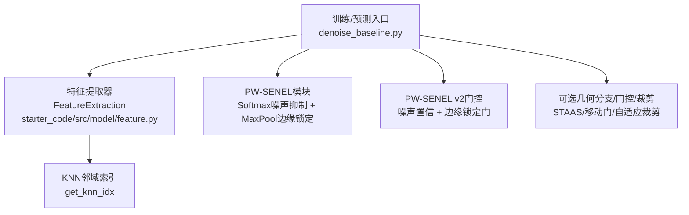
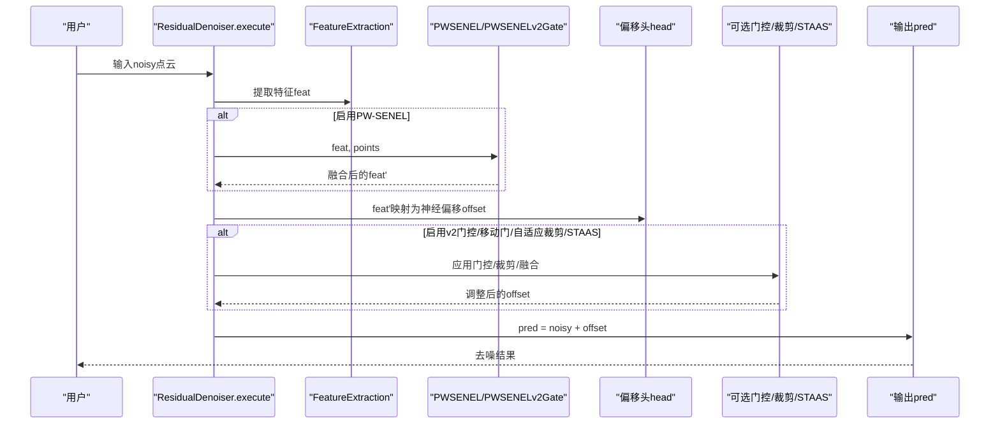
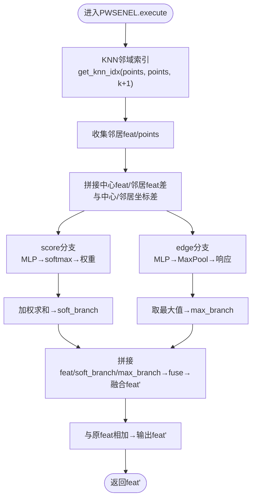
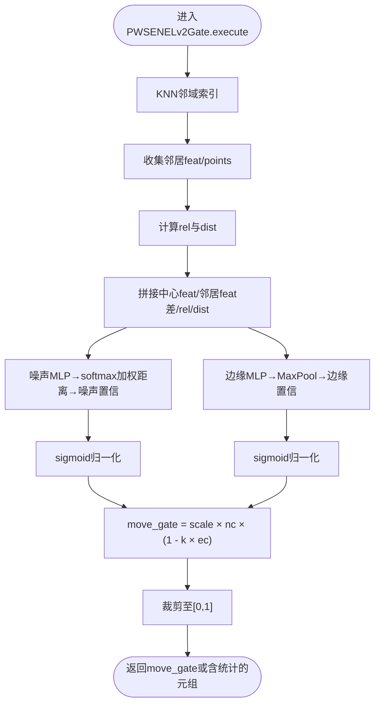
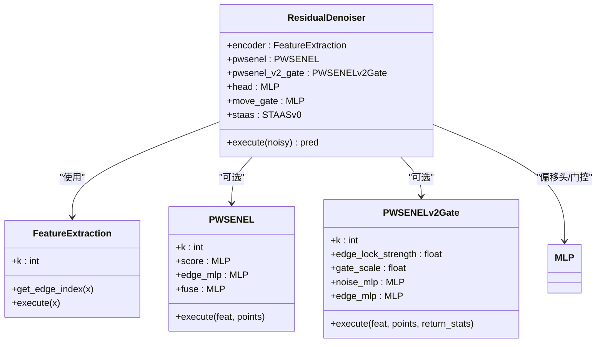
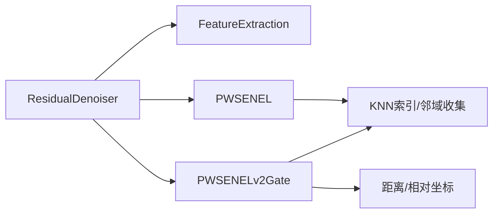

# PW-SENEL模块

<cite>
**本文引用的文件**   
- [denoise_baseline.py](file://denoise_baseline.py)
- [feature.py](file://starter_code/src/model/feature.py)
- [denoise_pwsenel.yaml](file://configs/denoise_pwsenel.yaml)
- [denoise_pwsenel_v2.yaml](file://configs/denoise_pwsenel_v2.yaml)
- [denoise_pwsenel_v2_adaptive_clip.yaml](file://configs/denoise_pwsenel_v2_adaptive_clip.yaml)
- [denoise_pwsenel_v2_adaptive_clip_aggressive.yaml](file://configs/denoise_pwsenel_v2_adaptive_clip_aggressive.yaml)
- [denoise_pwsenel_v2_adaptive_clip_piecewise.yaml](file://configs/denoise_pwsenel_v2_adaptive_clip_piecewise.yaml)
- [README.md](file://README.md)
</cite>

## 目录
1. [简介](#简介)
2. [项目结构](#项目结构)
3. [核心组件](#核心组件)
4. [架构总览](#架构总览)
5. [详细组件分析](#详细组件分析)
6. [依赖分析](#依赖分析)
7. [性能考虑](#性能考虑)
8. [故障排查指南](#故障排查指南)
9. [结论](#结论)
10. [附录](#附录)

## 简介
PW-SENEL（PeiWei Softmax Edge-aware Noise Elimination and Locking）是面向点云去噪的一种边缘感知模块，其核心思想由两条并行分支构成：
- 软最大化噪声抑制分支：基于邻居点的局部上下文学习“可信度”，通过softmax加权聚合邻居特征，抑制可疑噪声响应。
- 最大池化边缘锁定分支：利用局部几何响应的MaxPool风格特征，保留高响应的锐利边缘与细节。

该模块以可插拔方式接入主干特征提取器，输出与原始特征残差相加，保证在消噪的同时保留关键几何结构。本文将系统阐述其网络架构、特征融合策略、KNN邻域处理与边缘保持算法，并提供参数配置、性能调优与组合使用策略，辅以代码级图示与实践建议。

## 项目结构
围绕PW-SENEL的关键文件组织如下：
- 模块实现：位于主训练/预测入口文件中，包含PWSENEL与PWSENELv2门控两个核心模块。
- 特征提取：复用官方starter_code中的FeatureExtraction，提供动态边卷积与KNN邻域构建。
- 配置文件：提供多版本PW-SENEL相关配置，覆盖基础版、v2版与自适应裁剪策略。

**图表来源**
- [denoise_baseline.py:518-530](file://denoise_baseline.py#L518-L530)
- [feature.py:65-139](file://starter_code/src/model/feature.py#L65-L139)
- [feature.py:184-196](file://starter_code/src/model/feature.py#L184-L196)

**章节来源**
- [README.md:52-77](file://README.md#L52-L77)
- [feature.py:65-139](file://starter_code/src/model/feature.py#L65-L139)

## 核心组件
- PWSENEL（基础版）
  - 输入：每点特征feat与坐标points
  - 处理：KNN邻域收集 → 构造中心-邻居差异与相对坐标 → 分别经score与edge_mlp → softmax权重聚合与MaxPool → 与原特征残差融合
  - 输出：feat + fuse([feat, soft_branch, max_branch])

- PWSENELv2Gate（v2门控）
  - 输入：feat、points、可选返回统计
  - 处理：计算噪声置信（基于距离加权softmax）与边缘置信（MaxPool风格响应），生成move_gate = scale × noise_conf × (1 - edge_lock_strength × edge_conf)，并裁剪至[0,1]
  - 输出：move_gate或同时返回噪声/边缘置信与门控值

- ResidualDenoiser（主干集成）
  - 组合：encoder（FeatureExtraction）→ PWSENEL/PWSENELv2Gate → 偏移头head（MLP）→ 可选门控/裁剪/STAAS融合 → pred = noisy + offset

**章节来源**
- [denoise_baseline.py:259-314](file://denoise_baseline.py#L259-L314)
- [denoise_baseline.py:317-374](file://denoise_baseline.py#L317-L374)
- [denoise_baseline.py:480-732](file://denoise_baseline.py#L480-L732)

## 架构总览
PW-SENEL在整体去噪流程中的位置与交互如下：

**图表来源**
- [denoise_baseline.py:602-732](file://denoise_baseline.py#L602-L732)
- [feature.py:65-139](file://starter_code/src/model/feature.py#L65-L139)

## 详细组件分析

### PWSENEL（软最大化噪声抑制 + 最大池化边缘锁定）
- KNN邻域与输入构造
  - 使用KNN索引获取每个点的k个邻居，构造中心-邻居特征差与相对坐标，拼接作为分支输入。
- 软最大化噪声抑制分支
  - score网络对每个邻居打分，经softmax归一化得到权重，按权重对邻居特征加权求和，得到soft_branch。
- 最大池化边缘锁定分支
  - edge_mlp对每个邻居输出响应，取最大值作为max_branch，保留局部高响应的几何线索。
- 特征融合与残差
  - 将原特征feat与两个分支拼接后经fuse MLP，再与feat相加，确保安全的消噪与保留。

**图表来源**
- [denoise_baseline.py:296-314](file://denoise_baseline.py#L296-L314)

**章节来源**
- [denoise_baseline.py:259-314](file://denoise_baseline.py#L259-L314)

### PWSENELv2Gate（显式噪声置信 + 边缘锁定门控）
- 输入扩展
  - 在v2中，输入除feat外还包含相对坐标rel与距离dist，用于更稳健地估计噪声置信。
- 噪声置信
  - 对邻居的距离加权，经softmax得到噪声置信，再经sigmoid并归一化到[0,1]。
- 边缘置信
  - 对邻居响应经MaxPool得到边缘置信，反映局部几何锐利程度。
- 门控生成
  - move_gate = scale × noise_conf × (1 - edge_lock_strength × edge_conf)，并裁剪至[0,1]。
- 返回统计
  - 可选返回noise_conf、edge_conf与move_gate，便于分析与可视化。

**图表来源**
- [denoise_baseline.py:350-374](file://denoise_baseline.py#L350-L374)

**章节来源**
- [denoise_baseline.py:317-374](file://denoise_baseline.py#L317-L374)

### ResidualDenoiser（主干与模块集成）
- 结构要点
  - encoder使用FeatureExtraction进行特征提取；
  - 可选择启用PWSENEL或PWSENELv2Gate；
  - 偏移头head输出神经偏移offset；
  - 可选移动门、自适应裁剪、STAAS融合等；
  - 最终pred = noisy + offset。
- 关键执行路径
  - 若启用hybrid_safe_strong，则在低噪声/高边缘区域采用保守安全分支，在高噪声区域开启强分支并通过路由器选择性融合；
  - 自适应裁剪根据云尺度分段控制裁剪阈值，避免低噪声云被过度抑制；
  - v2门控与STAAS门控分别保护低噪声/低边缘区域，同时保留高噪声区域的决策能力。

**图表来源**
- [denoise_baseline.py:480-593](file://denoise_baseline.py#L480-L593)
- [feature.py:65-139](file://starter_code/src/model/feature.py#L65-L139)

**章节来源**
- [denoise_baseline.py:480-732](file://denoise_baseline.py#L480-L732)

## 依赖分析
- 内部依赖
  - ResidualDenoiser依赖FeatureExtraction进行特征提取；
  - PWSENEL与PWSENELv2Gate均依赖KNN邻域索引与张量拼接操作；
  - v2门控依赖距离与相对坐标，增强鲁棒性。
- 外部依赖
  - Jittor张量库与knn/topk实现；
  - 配置文件驱动模块开关与超参。

**图表来源**
- [denoise_baseline.py:518-530](file://denoise_baseline.py#L518-L530)
- [feature.py:184-196](file://starter_code/src/model/feature.py#L184-L196)

**章节来源**
- [feature.py:184-196](file://starter_code/src/model/feature.py#L184-L196)

## 性能考虑
- 计算复杂度
  - KNN邻域构建与消息传递：O(B×N×k)，其中B为批大小，N为点数，k为邻域大小；
  - MLP分支（score/edge/fuse）线性变换与激活开销较小，主要瓶颈在KNN与softmax/MaxPool。
- 内存占用
  - 邻域展开与中间张量拼接会增加显存占用，可通过减小k或降低num_points缓解；
  - 自适应裁剪与门控在推理阶段引入少量额外计算，但收益显著。
- 推理加速建议
  - 合理设置k与patch_size，避免单次处理过大点云；
  - 在低噪声场景关闭v2门控或降低edge_lock_strength，减少门控计算；
  - 使用合适的自适应裁剪参数，避免不必要的缩放计算。

## 故障排查指南
- 训练/推理路径检查
  - 确认数据根目录、训练列表与checkpoint路径存在；
  - 若使用profile，确保机器容量与profile匹配。
- 模块开关一致性
  - 评估/预测脚本需与训练配置一致加载模型开关，避免“评估的是另一个模型”。
- 常见问题定位
  - 若去噪后出现过度平滑：尝试降低edge_lock_strength或关闭v2门控；
  - 若边缘细节丢失：提高softmax分支权重或增大k；
  - 若结果不稳定：启用自适应裁剪，调整ref阈值与min/max范围。

**章节来源**
- [denoise_baseline.py:741-750](file://denoise_baseline.py#L741-L750)
- [scripts/evaluate_cd.py:177-198](file://scripts/evaluate_cd.py#L177-L198)

## 结论
PW-SENEL通过软最大化噪声抑制与最大池化边缘锁定的双分支设计，在点云去噪中实现了噪声抑制与边缘保持的平衡。其模块化设计便于与主干特征提取器与其它几何分支/门控/裁剪策略组合，形成可插拔的实验平台。结合合理的参数配置与性能调优，可在不同噪声水平与几何复杂度下取得稳定且高质量的去噪效果。

## 附录

### 参数配置与调优建议
- 基础版PW-SENEL（denoise_pwsenel.yaml）
  - 关键开关：pwsenel=true，staas=false
  - 建议：k=16，feat_dim=256，hidden=256；若边缘细节不足，可适度增大k或feat_dim
- v2版（denoise_pwsenel_v2.yaml）
  - 关键开关：pwsenel=false，pwsenel_v2=true
  - 关键参数：pwsenel_v2_edge_lock（边缘锁定强度）、pwsenel_v2_gate_scale（门控缩放）
  - 建议：edge_lock≈0.7，gate_scale≈0.5；在强噪声场景可适当提高edge_lock
- 自适应裁剪（piecewise）
  - 配置文件：denoise_pwsenel_v2_adaptive_clip_piecewise.yaml
  - 关键参数：adaptive_clip_min/mid/max，adaptive_clip_ref_low/mid/high
  - 建议：先用piecewise曲线拟合本地统计，再在更高噪声场景尝试aggressive配置

**章节来源**
- [denoise_pwsenel.yaml:30-40](file://configs/denoise_pwsenel.yaml#L30-L40)
- [denoise_pwsenel_v2.yaml:27-40](file://configs/denoise_pwsenel_v2.yaml#L27-L40)
- [denoise_pwsenel_v2_adaptive_clip_piecewise.yaml:25-49](file://configs/denoise_pwsenel_v2_adaptive_clip_piecewise.yaml#L25-L49)

### 与其他模块的组合策略
- 与STAAS v0组合
  - 可在主干后接入STAAS，提供密度自适应温度与结构张量描述子，进一步抑制边缘模糊；
  - 可选STAAS融合或v2门控，保护低噪声/低边缘区域。
- 与移动门/自适应裁剪组合
  - 移动门用于控制整体移动幅度；
  - 自适应裁剪按云尺度分段控制，避免低噪声云被过度抑制。
- 与hybrid_safe_strong组合
  - 安全分支保守、强分支激进，路由器根据局部噪声与边缘置信选择性融合，适合高噪声场景。

**章节来源**
- [denoise_baseline.py:553-571](file://denoise_baseline.py#L553-L571)
- [denoise_baseline.py:626-656](file://denoise_baseline.py#L626-L656)
- [denoise_baseline.py:702-723](file://denoise_baseline.py#L702-L723)