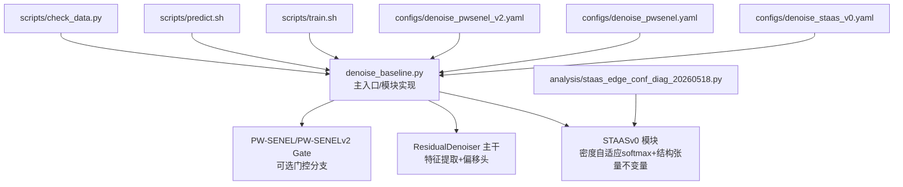
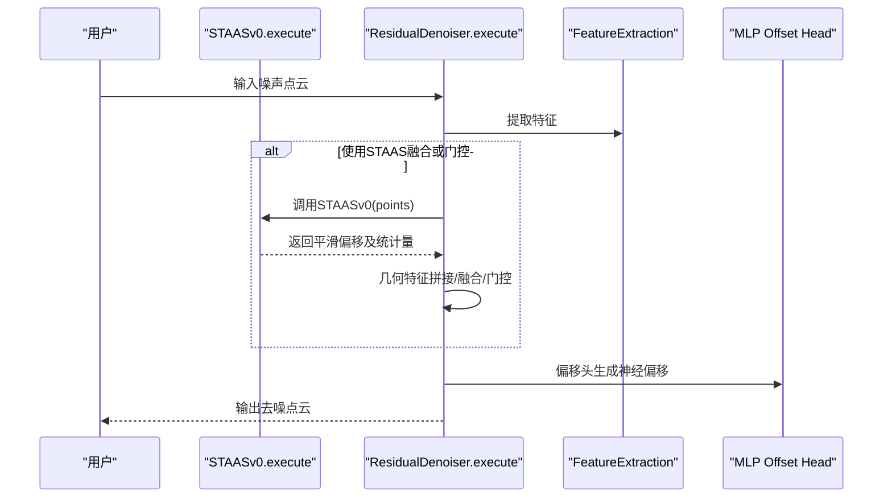
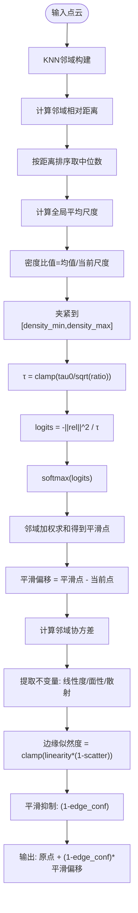
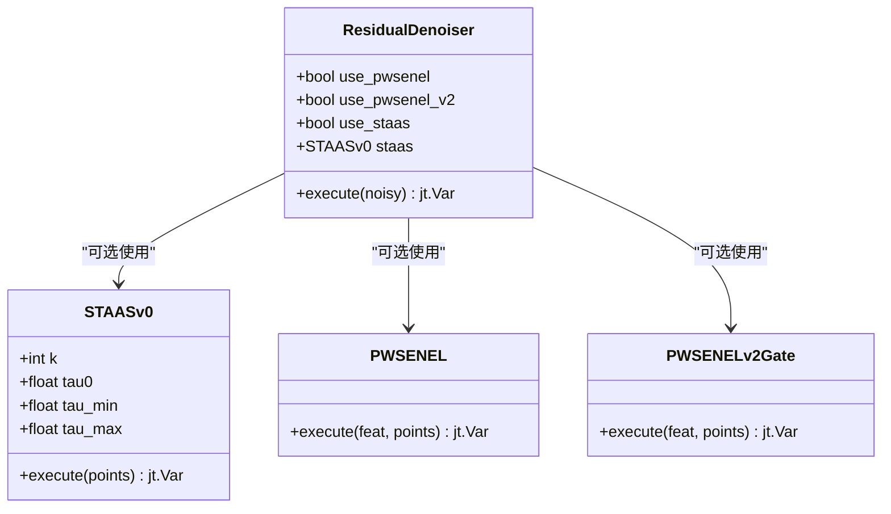
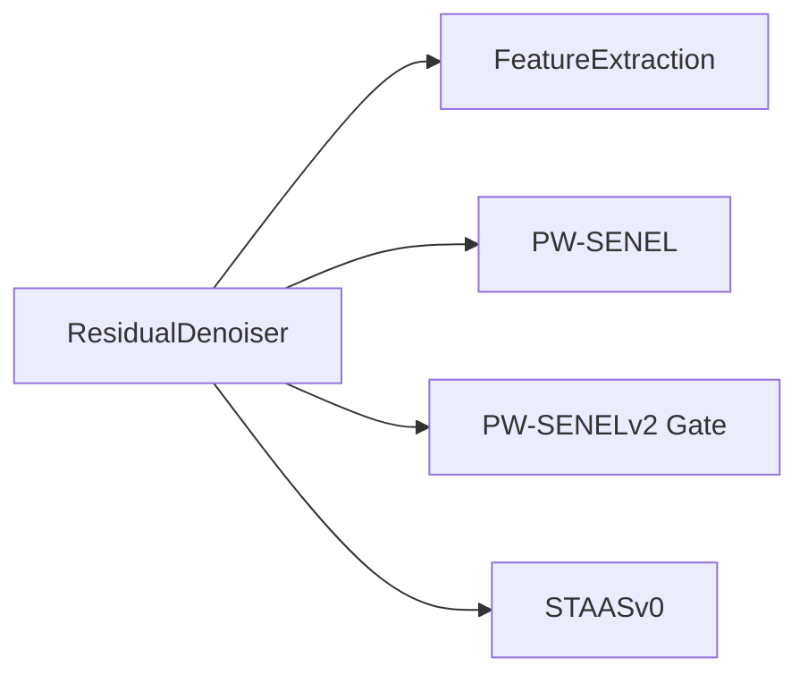

# ST-AAS模块

<cite>
**本文引用的文件**
- [denoise_baseline.py](file://denoise_baseline.py)
- [denoise_staas_v0.yaml](file://configs/denoise_staas_v0.yaml)
- [denoise_pwsenel.yaml](file://configs/denoise_pwsenel.yaml)
- [denoise_pwsenel_v2.yaml](file://configs/denoise_pwsenel_v2.yaml)
- [ST_AAS执行检查清单.md](file://docs/ST_AAS_EXECUTION_CHECKLIST.md)
- [README.md](file://README.md)
- [train.sh](file://scripts/train.sh)
- [predict.sh](file://scripts/predict.sh)
- [check_data.py](file://scripts/check_data.py)
- [staas_edge_conf_diag_20260518.py](file://analysis/staas_edge_conf_diag_20260518.py)
</cite>

## 目录
1. [引言](#引言)
2. [项目结构](#项目结构)
3. [核心组件](#核心组件)
4. [架构总览](#架构总览)
5. [详细组件分析](#详细组件分析)
6. [依赖分析](#依赖分析)
7. [性能考虑](#性能考虑)
8. [故障排查指南](#故障排查指南)
9. [结论](#结论)
10. [附录](#附录)

## 引言
本文件为ST-AAS v0模块（Structure Tensor-guided Adaptive Softmax）的全面技术文档。ST-AAS v0是面向点云去噪的轻量几何算子，其核心思想包括：
- 密度自适应softmax平滑：通过局部尺度估计动态调整softmax温度参数，使邻域平滑更贴合局部密度分布。
- 结构张量不变描述符：使用协方差矩阵的不变量（线性度、面性、散射）刻画局部几何形态，无需求解特征值。
- 边缘感知平滑抑制：基于边缘似然度估计，对非平坦区域进行平滑抑制，保留锐利边缘与细节。

该模块以“可切换”的方式集成到神经偏移输出中，作为baseline的补充分支，便于消融实验与安全回退。

## 项目结构
围绕ST-AAS v0的相关文件组织如下：
- 模块实现与训练/预测入口：denoise_baseline.py
- 配置文件：configs/denoise_staas_v0.yaml（ST-AAS v0）、configs/denoise_pwsenel.yaml（PW-SENEL基线）、configs/denoise_pwsenel_v2.yaml（PW-SENEL v2门控）
- 训练/预测脚本：scripts/train.sh、scripts/predict.sh
- 数据检查工具：scripts/check_data.py
- 分析脚本：analysis/staas_edge_conf_diag_20260518.py（离线统计与可视化）

图表来源
- [denoise_baseline.py:377-477](file://denoise_baseline.py#L377-L477)
- [denoise_staas_v0.yaml:1-44](file://configs/denoise_staas_v0.yaml#L1-L44)
- [denoise_pwsenel.yaml:1-44](file://configs/denoise_pwsenel.yaml#L1-L44)
- [denoise_pwsenel_v2.yaml:1-45](file://configs/denoise_pwsenel_v2.yaml#L1-L45)
- [train.sh:1-44](file://scripts/train.sh#L1-L44)
- [predict.sh:1-13](file://scripts/predict.sh#L1-L13)
- [check_data.py:1-103](file://scripts/check_data.py#L1-L103)
- [staas_edge_conf_diag_20260518.py:1-179](file://analysis/staas_edge_conf_diag_20260518.py#L1-L179)

章节来源
- [README.md:14-51](file://README.md#L14-L51)
- [denoise_baseline.py:377-477](file://denoise_baseline.py#L377-L477)

## 核心组件
- STAASv0模块：实现密度自适应softmax平滑与结构张量不变量描述，输出几何引导的平滑偏移，并根据边缘似然度抑制平滑。
- ResidualDenoiser主干：封装特征提取、可选PW-SENEL/PW-SENELv2门控、以及可选的STAAS分支，支持融合与门控策略。
- 配置系统：通过YAML配置控制是否启用STAAS、KNN大小、温度范围等超参数。

章节来源
- [denoise_baseline.py:377-477](file://denoise_baseline.py#L377-L477)
- [denoise_baseline.py:480-732](file://denoise_baseline.py#L480-L732)
- [denoise_staas_v0.yaml:30-43](file://configs/denoise_staas_v0.yaml#L30-L43)

## 架构总览
ST-AAS v0在训练/推理流程中的位置如下：

图表来源
- [denoise_baseline.py:602-732](file://denoise_baseline.py#L602-L732)
- [denoise_baseline.py:377-477](file://denoise_baseline.py#L377-L477)

## 详细组件分析

### 数学原理与算法流程
- 局部密度估计与温度自适应
  - 通过KNN邻域相对坐标的欧氏距离排序，取中位数作为局部尺度；全局平均尺度用于归一化得到密度比值；据此计算温度τ，实现密度自适应softmax。
- 密度自适应softmax平滑
  - 以负平方距离除以温度作为logits，经softmax得到邻域加权，实现平滑偏移。
- 协方差矩阵不变量计算
  - 计算邻域中心化后的协方差矩阵，提取不变量：线性度、面性、散射，用于刻画局部几何形态。
- 边缘似然度估计与平滑抑制
  - 边缘似然度由线性度与散射共同决定，对非边缘区域施加平滑抑制，保留边缘结构。

图表来源
- [denoise_baseline.py:417-477](file://denoise_baseline.py#L417-L477)

章节来源
- [denoise_baseline.py:417-477](file://denoise_baseline.py#L417-L477)

### 类与模块关系

图表来源
- [denoise_baseline.py:480-732](file://denoise_baseline.py#L480-L732)
- [denoise_baseline.py:259-314](file://denoise_baseline.py#L259-L314)
- [denoise_baseline.py:317-374](file://denoise_baseline.py#L317-L374)
- [denoise_baseline.py:377-477](file://denoise_baseline.py#L377-L477)

章节来源
- [denoise_baseline.py:480-732](file://denoise_baseline.py#L480-L732)

### 参数与配置
- 关键超参数
  - k：KNN邻域大小
  - tau0、tau_min、tau_max：温度相关参数
  - density_min、density_max：密度比值夹紧范围
- 配置文件
  - configs/denoise_staas_v0.yaml：启用STAAS v0，设置上述参数
  - configs/denoise_pwsenel.yaml：启用PW-SENEL基线
  - configs/denoise_pwsenel_v2.yaml：启用PW-SENEL v2门控

章节来源
- [denoise_staas_v0.yaml:30-43](file://configs/denoise_staas_v0.yaml#L30-L43)
- [denoise_pwsenel.yaml:27-40](file://configs/denoise_pwsenel.yaml#L27-L40)
- [denoise_pwsenel_v2.yaml:27-41](file://configs/denoise_pwsenel_v2.yaml#L27-L41)

### 与PW-SENEL模块的协同机制
- 可选门控策略：PW-SENEL v2通过学习噪声置信与边缘锁定，对神经偏移进行门控；STAAS v2门控进一步在低噪声/边缘区域提供保护，同时保留高噪声区域的移动能力。
- 融合策略：STAAS v0可与PW-SENEL v2融合，将几何统计量拼接到特征空间，通过额外网络学习融合/门控。

章节来源
- [denoise_baseline.py:676-701](file://denoise_baseline.py#L676-L701)
- [denoise_baseline.py:612-624](file://denoise_baseline.py#L612-L624)

### 性能基准与统计分析
- 统计脚本：analysis/staas_edge_conf_diag_20260518.py对测试集样本进行离线统计，输出边缘似然度、平滑偏移幅度、门控后幅度等指标的分位数与汇总，支持PLY可视化。
- 运行方式：脚本直接读取测试集noisy.npy，不涉及训练或模型修改。

章节来源
- [staas_edge_conf_diag_20260518.py:123-179](file://analysis/staas_edge_conf_diag_20260518.py#L123-L179)

## 依赖分析
- 内部依赖
  - ResidualDenoiser依赖FeatureExtraction进行特征提取，依赖PW-SENEL/PW-SENELv2门控模块（可选），依赖STAASv0模块（可选）。
- 外部依赖
  - Jittor框架、CUDA环境、NumPy（仅分析脚本）。

图表来源
- [denoise_baseline.py:520-593](file://denoise_baseline.py#L520-L593)

章节来源
- [denoise_baseline.py:520-593](file://denoise_baseline.py#L520-L593)

## 性能考虑
- 计算复杂度
  - KNN构建与邻域查询主导时间开销；softmax权重计算与邻域加权构成主要算子。
- 内存占用
  - 主要消耗来自中间邻域张量与softmax权重存储；可通过减小k或批内点数缓解。
- 稳定性
  - 使用稳定的softmax数值处理（logits中心化）与夹紧策略，避免极端温度导致数值不稳定。
- 可扩展性
  - 采用不变量描述避免昂贵的特征分解，适合大规模推理部署。

## 故障排查指南
- 环境与数据检查
  - 使用scripts/check_env.py与scripts/check_data.py确保Jittor/CUDA可用且数据路径正确。
- 训练/预测流程
  - 使用scripts/train.sh与scripts/predict.sh标准化运行，确保配置文件路径与profile正确。
- 常见问题
  - CUDA相关错误：确认Jittor与CuPy版本匹配，必要时安装对应版本。
  - 数据缺失：检查数据根目录、训练列表与测试noisy.npy是否存在。
  - 模型未生效：确认配置中staas: true且训练日志显示STAAS分支参与计算。

章节来源
- [check_data.py:45-103](file://scripts/check_data.py#L45-L103)
- [train.sh:14-44](file://scripts/train.sh#L14-L44)
- [predict.sh:1-13](file://scripts/predict.sh#L1-L13)

## 结论
ST-AAS v0以轻量、可解释的方式实现了密度自适应平滑与边缘感知抑制，通过协方差不变量刻画局部几何，避免了昂贵的特征分解。其可切换设计便于与PW-SENEL系列模块协同，既可用于baseline增强，也可作为独立几何分支进行消融研究。配合完善的配置与分析工具，可在不同硬件环境下稳定复现并评估模块性能。

## 附录
- 运行示例
  - ST-AAS v0烟雾测试：参考ST_AAS执行检查清单中的命令顺序。
- 相关文档
  - README.md提供了方法概览与推荐入口。
  - ST_AAS执行检查清单记录了阶段化实施要求与命令序列。

章节来源
- [README.md:173-247](file://README.md#L173-L247)
- [ST_AAS执行检查清单.md:48-54](file://docs/ST_AAS_EXECUTION_CHECKLIST.md#L48-L54)