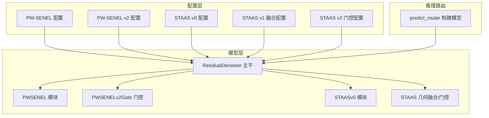
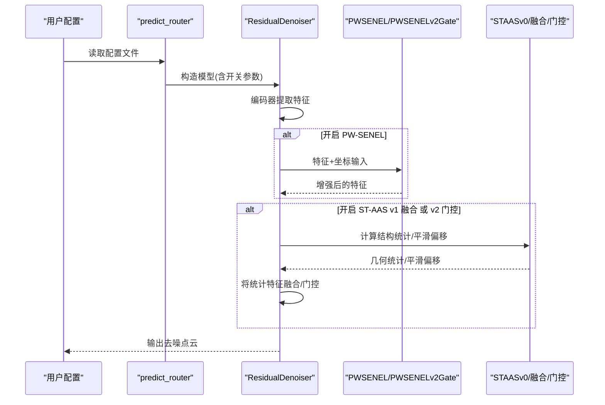
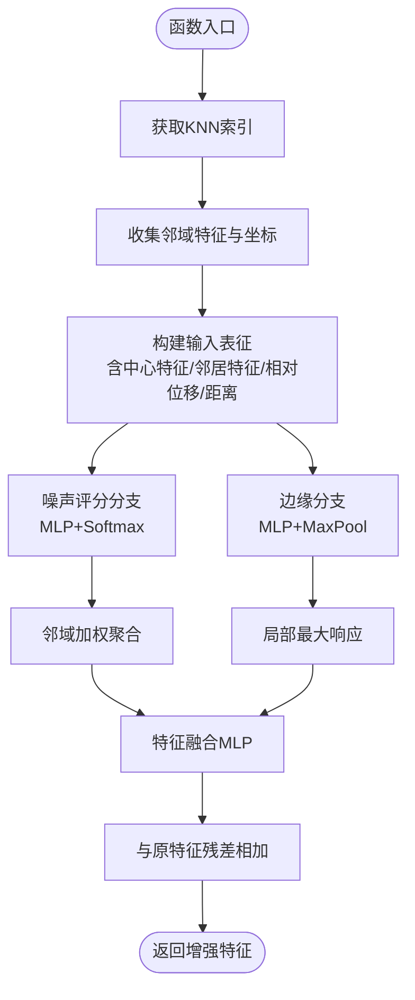
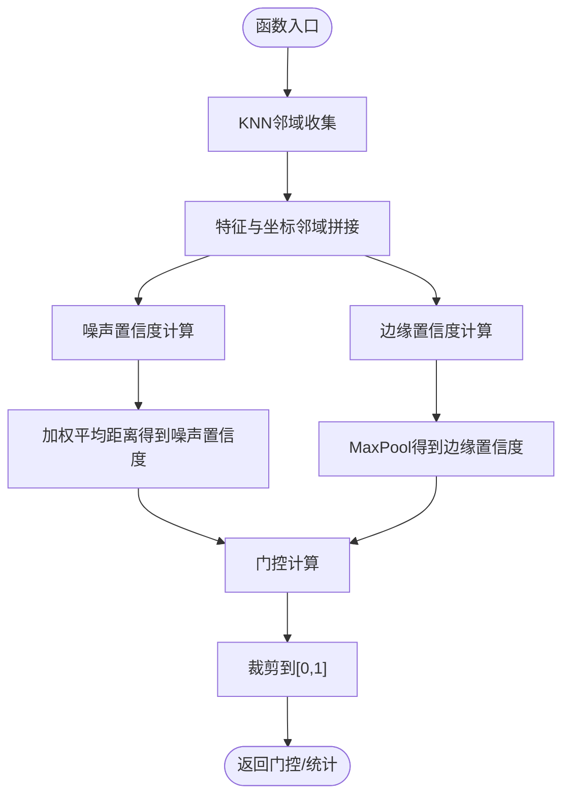
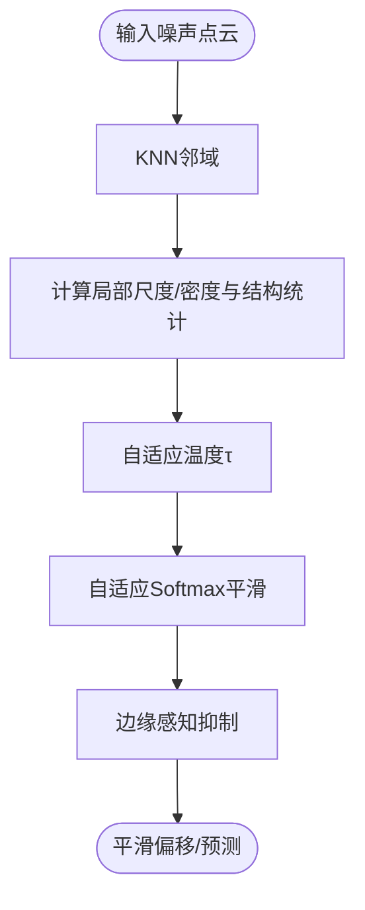
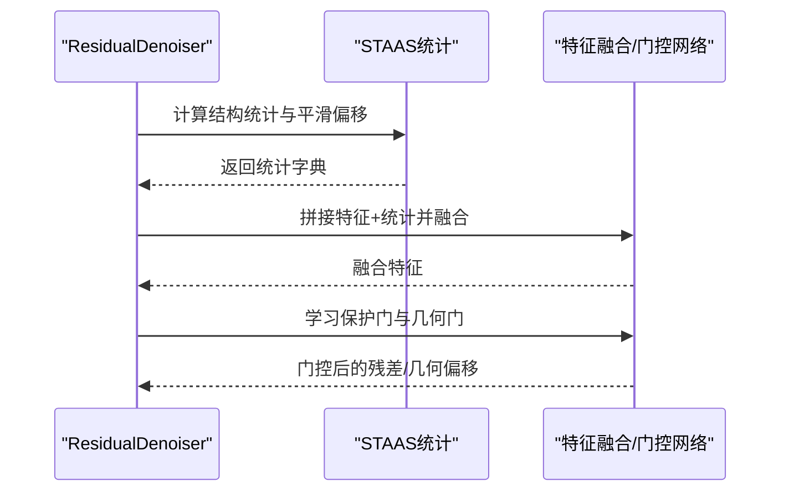
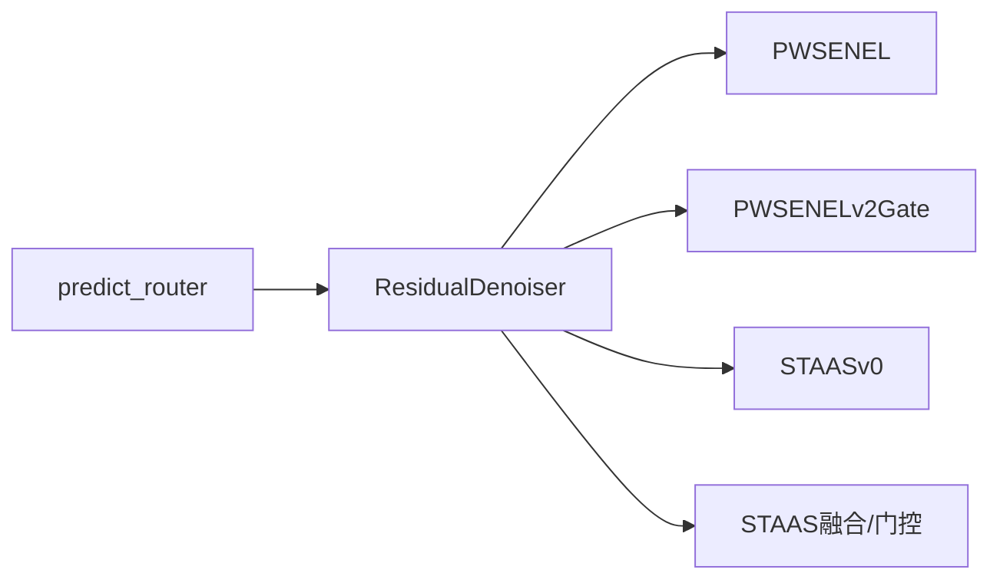

# 几何增强模块

<cite>
**本文引用的文件**
- [configs/denoise_pwsenel.yaml](file://configs/denoise_pwsenel.yaml)
- [configs/denoise_pwsenel_v2.yaml](file://configs/denoise_pwsenel_v2.yaml)
- [configs/denoise_pwsenel_v2_clip.yaml](file://configs/denoise_pwsenel_v2_clip.yaml)
- [configs/denoise_pwsenel_v2_adaptive_clip.yaml](file://configs/denoise_pwsenel_v2_adaptive_clip.yaml)
- [configs/denoise_pwsenel_v2_adaptive_clip_piecewise_v2.yaml](file://configs/denoise_pwsenel_v2_adaptive_clip_piecewise_v2.yaml)
- [configs/denoise_staas_v0.yaml](file://configs/denoise_staas_v0.yaml)
- [configs/denoise_staas_v1_fusion.yaml](file://configs/denoise_staas_v1_fusion.yaml)
- [configs/denoise_staas_v2_gate.yaml](file://configs/denoise_staas_v2_gate.yaml)
- [denoise_baseline.py](file://denoise_baseline.py)
- [scripts/predict_router.py](file://scripts/predict_router.py)
</cite>

## 目录
1. [简介](#简介)
2. [项目结构](#项目结构)
3. [核心组件](#核心组件)
4. [架构总览](#架构总览)
5. [详细组件分析](#详细组件分析)
6. [依赖分析](#依赖分析)
7. [性能考虑](#性能考虑)
8. [故障排查指南](#故障排查指南)
9. [结论](#结论)
10. [附录](#附录)

## 简介
本文件聚焦于Jittor点云去噪项目中的几何增强模块，系统阐述PW-SENEL与ST-AAS v0两大模块的数学原理、网络结构、输入输出规范、参数配置与调优策略，并给出模块间组合使用方式、性能对比与适用场景建议。同时提供基于配置文件的实际启用与调整方法，帮助读者快速落地并获得稳定、可复现的去噪效果。

## 项目结构
几何增强模块位于主干训练/推理管线中，通过配置项在ResidualDenoiser主干网络中按需开启。PW-SENEL与PW-SENEL v2 gate属于特征级几何增强与门控；ST-AAS v0提供结构张量引导的自适应平滑与边缘抑制；STAAS v1融合与v2门控则进一步将几何统计特征注入神经头并进行残差/几何偏移的条件化门控。

图表来源
- [configs/denoise_pwsenel.yaml:1-44](file://configs/denoise_pwsenel.yaml#L1-L44)
- [configs/denoise_pwsenel_v2.yaml:1-45](file://configs/denoise_pwsenel_v2.yaml#L1-L45)
- [configs/denoise_staas_v0.yaml:1-44](file://configs/denoise_staas_v0.yaml#L1-L44)
- [configs/denoise_staas_v1_fusion.yaml:1-52](file://configs/denoise_staas_v1_fusion.yaml#L1-L52)
- [configs/denoise_staas_v2_gate.yaml:1-59](file://configs/denoise_staas_v2_gate.yaml#L1-L59)
- [denoise_baseline.py:480-732](file://denoise_baseline.py#L480-L732)
- [scripts/predict_router.py:49-70](file://scripts/predict_router.py#L49-L70)

章节来源
- [configs/denoise_pwsenel.yaml:1-44](file://configs/denoise_pwsenel.yaml#L1-L44)
- [configs/denoise_pwsenel_v2.yaml:1-45](file://configs/denoise_pwsenel_v2.yaml#L1-L45)
- [configs/denoise_staas_v0.yaml:1-44](file://configs/denoise_staas_v0.yaml#L1-L44)
- [configs/denoise_staas_v1_fusion.yaml:1-52](file://configs/denoise_staas_v1_fusion.yaml#L1-L52)
- [configs/denoise_staas_v2_gate.yaml:1-59](file://configs/denoise_staas_v2_gate.yaml#L1-L59)
- [denoise_baseline.py:480-732](file://denoise_baseline.py#L480-L732)
- [scripts/predict_router.py:49-70](file://scripts/predict_router.py#L49-L70)

## 核心组件
- PW-SENEL（Softmax噪声抑制 + MaxPool边缘锁定）
  - 作用：在局部KNN邻域内，通过软最大权重聚合邻居特征抑制可疑噪声响应，同时用MaxPool保留局部边缘/几何线索，最终与原特征残差相加。
  - 关键参数：k（邻域大小）、score/edge_mlp通道设计。
  - 典型配置：见PW-SENEL配置文件。
- PW-SENEL v2 Gate（显式噪声置信度 + 边缘锁定门控）
  - 作用：不改变偏移头输出，仅对移动幅度进行门控，公式为门控系数×(1 − 边缘锁定强度×边缘置信度)，结合噪声置信度动态调节。
  - 关键参数：edge_lock_strength（边缘锁定强度）、gate_scale（门控缩放）。
  - 典型配置：见PW-SENEL v2系列配置文件。
- ST-AAS v0（结构张量引导的自适应Softmax）
  - 作用：单KNN邻域、密度/尺度自适应温度的Softmax平滑，结合结构张量不变量描述子进行边缘感知抑制；可作为无训练残差分支叠加。
  - 关键参数：k、τ0/τ_min/τ_max（温度范围）、密度上下界。
  - 典型配置：见STAAS v0配置文件。
- ST-AAS v1 融合与 v2 门控
  - v1：将结构统计特征融合进特征空间，再由神经头生成偏移。
  - v2：在v1基础上引入残差/几何偏移的条件化门控，保护低噪声/边缘区域，几何偏移按噪声尺度加权叠加。

章节来源
- [configs/denoise_pwsenel.yaml:30-40](file://configs/denoise_pwsenel.yaml#L30-L40)
- [configs/denoise_pwsenel_v2.yaml:27-40](file://configs/denoise_pwsenel_v2.yaml#L27-L40)
- [configs/denoise_staas_v0.yaml:30-39](file://configs/denoise_staas_v0.yaml#L30-L39)
- [configs/denoise_staas_v1_fusion.yaml:30-47](file://configs/denoise_staas_v1_fusion.yaml#L30-L47)
- [configs/denoise_staas_v2_gate.yaml:34-54](file://configs/denoise_staas_v2_gate.yaml#L34-L54)

## 架构总览
几何增强模块以“开关”形式接入ResidualDenoiser主干，支持多模块组合与渐进升级。PW-SENEL与PW-SENEL v2 gate主要在特征/偏移层面进行几何增强与门控；ST-AAS v0提供独立的无训练几何分支；STAAS v1融合将几何统计注入特征，v2门控在融合基础上对残差与几何偏移分别进行条件化门控。

图表来源
- [scripts/predict_router.py:49-70](file://scripts/predict_router.py#L49-L70)
- [denoise_baseline.py:480-732](file://denoise_baseline.py#L480-L732)

章节来源
- [scripts/predict_router.py:49-70](file://scripts/predict_router.py#L49-L70)
- [denoise_baseline.py:480-732](file://denoise_baseline.py#L480-L732)

## 详细组件分析

### PW-SENEL 组件分析
- 数学原理
  - 邻域聚合：对中心点与其K近邻，计算相对位移与距离，构建输入表征。
  - 噪声评分分支：对邻域特征与相对位置编码，经MLP输出噪声分数，softmax归一得到邻域权重，加权求和得到软聚合特征。
  - 边缘分支：对相同输入经另一MLP映射，MaxPool保留局部高响应几何线索。
  - 融合输出：将原特征、软聚合特征、MaxPool特征拼接后经MLP融合，与原特征残差相加。
- 网络结构
  - score分支：邻域特征+相对位置编码 → MLP → 权重
  - edge_mlp分支：邻域特征+相对位置编码 → MLP → MaxPool
  - fuse融合：三路特征拼接 → MLP → 残差加法
- 输入输出
  - 输入：特征张量(B,N,C)、点坐标(B,N,3)
  - 输出：增强后的特征张量(B,N,C)
- 参数与调优
  - k：邻域大小，影响局部统计稳定性与计算成本。
  - score/edge_mlp通道设计：控制非线性表达能力与过拟合风险。
  - 建议：在噪声水平较低时适度增大k提升稳健性；若显存紧张可减小k或batch。

图表来源
- [denoise_baseline.py:259-315](file://denoise_baseline.py#L259-L315)

章节来源
- [configs/denoise_pwsenel.yaml:30-40](file://configs/denoise_pwsenel.yaml#L30-L40)
- [denoise_baseline.py:259-315](file://denoise_baseline.py#L259-L315)

### PW-SENEL v2 Gate 组件分析
- 数学原理
  - 显式噪声置信度：对邻域相对位置与特征差分编码，经MLP输出噪声分数，softmax加权平均距离得到噪声置信度。
  - 边缘置信度：对相同输入经MLP输出边缘分数，MaxPool得到边缘置信度。
  - 门控公式：move_gate = gate_scale × noise_conf × (1 − edge_lock_strength × edge_conf)，并裁剪至[0,1]。
- 网络结构
  - 噪声MLP：中心特征+邻居特征差分+相对位移+距离 → MLP → 噪声置信度
  - 边缘MLP：同上 → MLP → 边缘置信度
  - 门控：组合噪声/边缘置信度得到移动门控
- 输入输出
  - 输入：特征张量(B,N,C)、点坐标(B,N,3)
  - 输出：门控系数(B,N,1)或返回统计字典
- 参数与调优
  - edge_lock_strength：边缘锁定强度，越高越倾向于保留锐利结构。
  - gate_scale：整体门控缩放，平衡去噪强度与稳定性。
  - 建议：在边缘丰富场景提高edge_lock_strength；在弱纹理场景降低以避免过度抑制。

图表来源
- [denoise_baseline.py:317-374](file://denoise_baseline.py#L317-L374)

章节来源
- [configs/denoise_pwsenel_v2.yaml:27-40](file://configs/denoise_pwsenel_v2.yaml#L27-L40)
- [denoise_baseline.py:317-374](file://denoise_baseline.py#L317-L374)

### ST-AAS v0 组件分析
- 数学原理
  - 单KNN邻域，基于局部尺度/密度估计自适应Softmax温度（τ），抑制稀疏区域噪声，保留稠密区域细节。
  - 使用结构张量不变量描述子（无需特征值分解）衡量线性/平面/散射程度与边缘置信度，实现边缘感知平滑抑制。
- 网络结构
  - 可选作为独立无训练分支，输出平滑偏移并可按强度系数叠加到神经偏移。
- 输入输出
  - 输入：噪声点云(B,N,3)
  - 输出：平滑偏移或完整预测（取决于调用方式）
- 参数与调优
  - k、τ0/τ_min/τ_max：控制邻域规模与温度范围。
  - 建议：在高噪声场景适当提高τ_max；在细碎结构场景降低τ以减少模糊。

图表来源
- [denoise_baseline.py:377-479](file://denoise_baseline.py#L377-L479)

章节来源
- [configs/denoise_staas_v0.yaml:30-39](file://configs/denoise_staas_v0.yaml#L30-L39)
- [denoise_baseline.py:377-479](file://denoise_baseline.py#L377-L479)

### ST-AAS v1 融合与 v2 门控 组件分析
- v1 融合
  - 将结构统计（平滑偏移、尺度、温度、线性度、平面度、散射度、边缘置信度）拼接到特征维度，再经MLP融合，提升头部对几何结构的感知。
- v2 门控
  - 在融合特征上学习保护门与几何门：保护门针对低噪声/边缘区域，几何门按噪声尺度与平坦度加权，分别控制残差与几何偏移的保留比例。
  - 采用分段噪声阈值与边缘互补的保护策略，避免在中高噪声场景过度抑制神经头的主动移动。
- 输入输出
  - 输入：噪声点云(B,N,3)、已计算的结构统计
  - 输出：融合后的特征或最终偏移/点云

图表来源
- [denoise_baseline.py:602-732](file://denoise_baseline.py#L602-L732)

章节来源
- [configs/denoise_staas_v1_fusion.yaml:30-47](file://configs/denoise_staas_v1_fusion.yaml#L30-L47)
- [configs/denoise_staas_v2_gate.yaml:34-54](file://configs/denoise_staas_v2_gate.yaml#L34-L54)
- [denoise_baseline.py:602-732](file://denoise_baseline.py#L602-L732)

## 依赖分析
- 模块耦合
  - ResidualDenoiser对各几何模块采用可选开关，彼此解耦，便于A/B实验与渐进升级。
  - PW-SENEL与PW-SENEL v2 gate均依赖KNN邻域与坐标信息；ST-AAS系列依赖局部尺度/密度估计与结构统计。
- 外部依赖
  - KNN邻域查询接口（get_knn_idx）贯穿多个模块，是性能与精度的关键。
  - 推理路由脚本根据配置文件动态构建模型，确保参数一致性。

图表来源
- [denoise_baseline.py:480-732](file://denoise_baseline.py#L480-L732)
- [scripts/predict_router.py:49-70](file://scripts/predict_router.py#L49-L70)

章节来源
- [denoise_baseline.py:480-732](file://denoise_baseline.py#L480-L732)
- [scripts/predict_router.py:49-70](file://scripts/predict_router.py#L49-L70)

## 性能考虑
- 计算复杂度
  - KNN邻域查询与MLP融合为主要开销；k越大、batch越大，显存与时间消耗越高。
- 显存优化
  - 推理阶段支持分块预测与流式拼接，降低大云显存压力。
- 速度瓶颈定位
  - 训练日志记录数据准备与计算耗时，便于识别I/O或算子瓶颈。

章节来源
- [denoise_baseline.py:910-977](file://denoise_baseline.py#L910-L977)
- [starter_code/src/model/vm.py:333-414](file://starter_code/src/model/vm.py#L333-L414)

## 故障排查指南
- 常见问题
  - 配置未生效：确认配置文件中相应开关参数已正确设置，且predict_router按配置构建模型。
  - 大云推理显存不足：使用分块预测或流式拼接策略，必要时减小patch_size。
  - 结果不稳定：检查k、τ范围、门控参数是否与噪声水平匹配；逐步引入模块观察效果。
- 定位手段
  - 训练日志字段包含offset_mse、cd、pred_offset_abs_mean等指标，辅助诊断模块增益。
  - 推理路由会打印GPU/CPU利用率，便于系统侧性能分析。

章节来源
- [denoise_baseline.py:741-810](file://denoise_baseline.py#L741-L810)
- [denoise_baseline.py:910-977](file://denoise_baseline.py#L910-L977)
- [starter_code/src/model/vm.py:109-139](file://starter_code/src/model/vm.py#L109-L139)

## 结论
PW-SENEL与ST-AAS v0构成互补的几何增强体系：前者强调邻域软聚合与边缘保留，后者强调密度/尺度自适应平滑与边缘抑制。PW-SENEL v2 gate与STAAS v1/v2门控进一步将几何统计注入特征并进行条件化门控，显著提升在复杂噪声与边缘场景下的鲁棒性。通过合理配置与组合，可在不同噪声水平与点云密度下取得稳定、可复现的去噪效果。

## 附录

### 模块启用与参数调优速查
- PW-SENEL
  - 开关：在配置文件中设置pwsenel为true，staas为false。
  - 关键参数：k、feat_dim、hidden。
  - 示例路径：[configs/denoise_pwsenel.yaml:30-40](file://configs/denoise_pwsenel.yaml#L30-L40)
- PW-SENEL v2 Gate
  - 开关：pwsenel_v2为true，pwsenel_v2_edge_lock、pwsenel_v2_gate_scale按需调整。
  - 示例路径：[configs/denoise_pwsenel_v2.yaml:27-40](file://configs/denoise_pwsenel_v2.yaml#L27-L40)
- ST-AAS v0
  - 开关：staas为true，staas_strength控制叠加强度。
  - 示例路径：[configs/denoise_staas_v0.yaml:30-39](file://configs/denoise_staas_v0.yaml#L30-L39)
- ST-AAS v1 融合
  - 开关：staas_fusion为true，staas为false以避免盲目叠加。
  - 示例路径：[configs/denoise_staas_v1_fusion.yaml:30-47](file://configs/denoise_staas_v1_fusion.yaml#L30-L47)
- ST-AAS v2 门控
  - 开关：staas_v2_gate为true，配合staas_fusion与门控参数。
  - 示例路径：[configs/denoise_staas_v2_gate.yaml:34-54](file://configs/denoise_staas_v2_gate.yaml#L34-L54)
- 偏移裁剪
  - 固定裁剪：residual_clip>0时启用。
  - 自适应分段裁剪：adaptive_clip为true，配合ref与min/max阈值。
  - 示例路径：
    - [configs/denoise_pwsenel_v2_clip.yaml:25-39](file://configs/denoise_pwsenel_v2_clip.yaml#L25-L39)
    - [configs/denoise_pwsenel_v2_adaptive_clip.yaml:25-38](file://configs/denoise_pwsenel_v2_adaptive_clip.yaml#L25-L38)
    - [configs/denoise_pwsenel_v2_adaptive_clip_piecewise_v2.yaml:25-42](file://configs/denoise_pwsenel_v2_adaptive_clip_piecewise_v2.yaml#L25-L42)

### 推理与训练入口
- 推理入口：predict_router根据配置文件构建ResidualDenoiser并执行预测。
  - 参考路径：[scripts/predict_router.py:49-70](file://scripts/predict_router.py#L49-L70)
- 训练入口：训练脚本构建数据集与优化器，循环训练并记录日志。
  - 参考路径：[denoise_baseline.py:813-977](file://denoise_baseline.py#L813-L977)