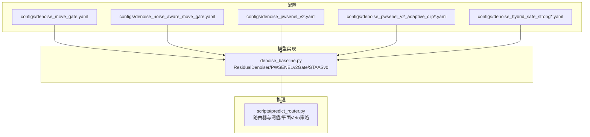
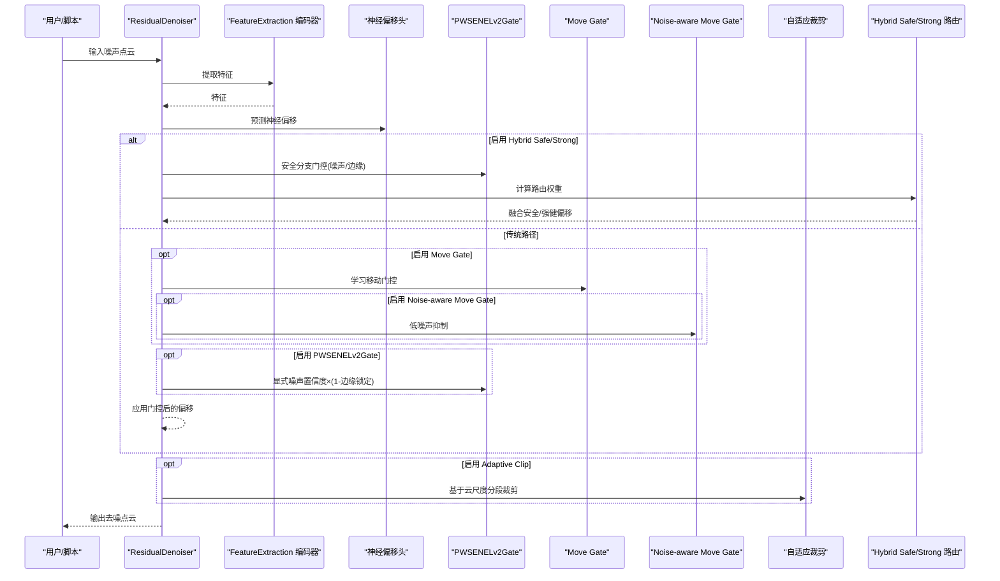
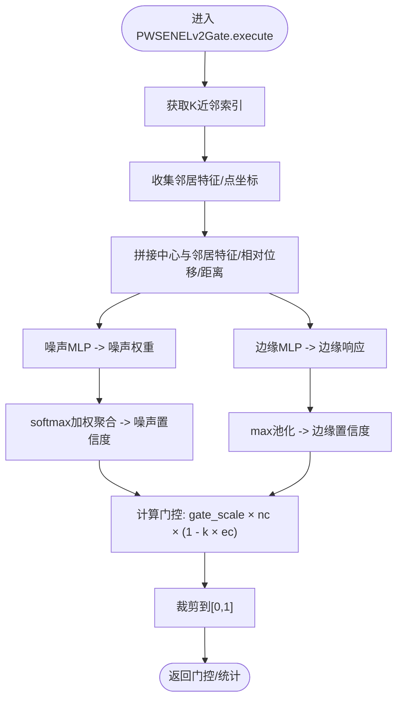
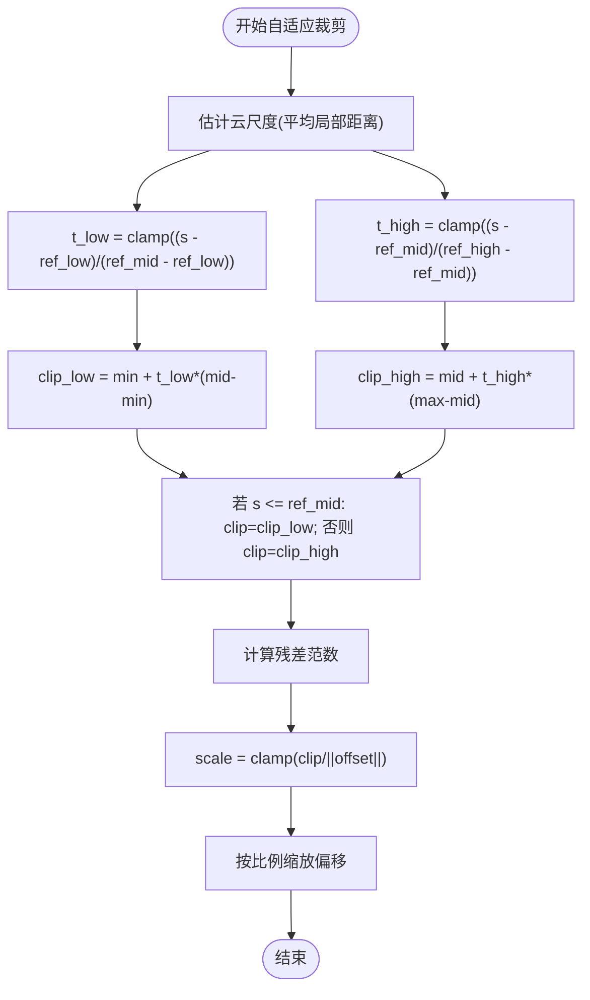
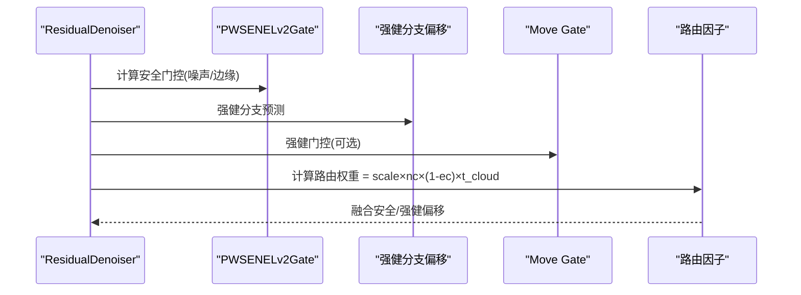
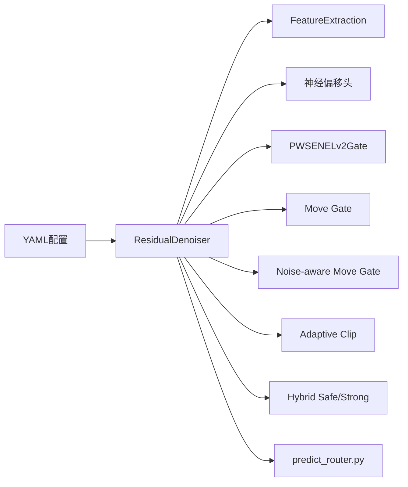

# 移动门控模块

<cite>
**本文引用的文件**
- [denoise_baseline.py](file://denoise_baseline.py)
- [denoise_move_gate.yaml](file://configs/denoise_move_gate.yaml)
- [denoise_noise_aware_move_gate.yaml](file://configs/denoise_noise_aware_move_gate.yaml)
- [denoise_pwsenel_v2.yaml](file://configs/denoise_pwsenel_v2.yaml)
- [denoise_pwsenel_v2_adaptive_clip.yaml](file://configs/denoise_pwsenel_v2_adaptive_clip.yaml)
- [denoise_pwsenel_v2_adaptive_clip_piecewise.yaml](file://configs/denoise_pwsenel_v2_adaptive_clip_piecewise.yaml)
- [denoise_pwsenel_v2_adaptive_clip_piecewise_v2.yaml](file://configs/denoise_pwsenel_v2_adaptive_clip_piecewise_v2.yaml)
- [denoise_hybrid_safe_strong.yaml](file://configs/denoise_hybrid_safe_strong.yaml)
- [denoise_hybrid_safe_strong_v2.yaml](file://configs/denoise_hybrid_safe_strong_v2.yaml)
- [denoise_hybrid_safe_strong_v3.yaml](file://configs/denoise_hybrid_safe_strong_v3.yaml)
- [predict_router.py](file://scripts/predict_router.py)
</cite>

## 目录
1. [简介](#简介)
2. [项目结构](#项目结构)
3. [核心组件](#核心组件)
4. [架构总览](#架构总览)
5. [详细组件分析](#详细组件分析)
6. [依赖关系分析](#依赖关系分析)
7. [性能考量](#性能考量)
8. [故障排查指南](#故障排查指南)
9. [结论](#结论)
10. [附录](#附录)

## 简介
本技术文档聚焦于移动门控模块系列，系统阐述以下模块的设计理念与实现机制：
- PWSENELv2Gate：显式噪声置信度与边缘锁定的门控模块
- 移动门控（Move Gate）：基于点云特征的可学习移动抑制/增强
- 噪声感知移动门控（Noise-aware Move Gate）：针对低噪声云抑制过度校正
- 混合安全/强健去噪（Hybrid Safe/Strong）：在低噪声区域保守，在中高噪声区域释放更强能力

文档将深入解析噪声置信度学习、边缘锁定强度控制、动态门控权重计算、自适应裁剪与路由策略，并提供模块选择指南、参数调优策略及在混合安全强健去噪方案中的作用与性能对比。

## 项目结构
本项目围绕“残差去噪主干 + 多种门控/后处理模块”的设计组织，关键文件如下：
- 模型与门控实现：denoise_baseline.py
- 训练/推理配置：configs/ 下多份 YAML
- 推理时路由器：scripts/predict_router.py

**图表来源**
- [denoise_baseline.py:317-732](file://denoise_baseline.py#L317-L732)
- [denoise_move_gate.yaml:1-43](file://configs/denoise_move_gate.yaml#L1-L43)
- [denoise_noise_aware_move_gate.yaml:1-47](file://configs/denoise_noise_aware_move_gate.yaml#L1-L47)
- [denoise_pwsenel_v2.yaml:1-45](file://configs/denoise_pwsenel_v2.yaml#L1-L45)
- [denoise_pwsenel_v2_adaptive_clip.yaml:1-48](file://configs/denoise_pwsenel_v2_adaptive_clip.yaml#L1-L48)
- [denoise_hybrid_safe_strong.yaml:1-53](file://configs/denoise_hybrid_safe_strong.yaml#L1-L53)
- [predict_router.py:1-330](file://scripts/predict_router.py#L1-L330)

**章节来源**
- [denoise_baseline.py:317-732](file://denoise_baseline.py#L317-L732)
- [denoise_move_gate.yaml:1-43](file://configs/denoise_move_gate.yaml#L1-L43)
- [denoise_noise_aware_move_gate.yaml:1-47](file://configs/denoise_noise_aware_move_gate.yaml#L1-L47)
- [denoise_pwsenel_v2.yaml:1-45](file://configs/denoise_pwsenel_v2.yaml#L1-L45)
- [denoise_pwsenel_v2_adaptive_clip.yaml:1-48](file://configs/denoise_pwsenel_v2_adaptive_clip.yaml#L1-L48)
- [denoise_hybrid_safe_strong.yaml:1-53](file://configs/denoise_hybrid_safe_strong.yaml#L1-L53)
- [predict_router.py:1-330](file://scripts/predict_router.py#L1-L330)

## 核心组件
- ResidualDenoiser：主干网络，负责特征提取、神经偏移头、可选门控/裁剪/几何分支集成
- PWSENELv2Gate：显式噪声置信度 + 边缘锁定门控，仅调节偏移移动幅度
- 移动门控（Move Gate）：可学习的逐点移动抑制/增强
- 噪声感知移动门控（Noise-aware Move Gate）：按全局云尺度对低噪声区域施加最小门限
- 自适应裁剪（Adaptive Clip）：基于云尺度分段自适应限制残差范数
- 混合安全/强健去噪（Hybrid Safe/Strong）：安全分支（保守+裁剪）与强健分支（保留移动能力）的路由融合

**章节来源**
- [denoise_baseline.py:480-732](file://denoise_baseline.py#L480-L732)

## 架构总览
下图展示从输入点云到去噪输出的关键数据流与模块交互，包括门控、裁剪与路由。

**图表来源**
- [denoise_baseline.py:602-732](file://denoise_baseline.py#L602-L732)
- [denoise_pwsenel_v2.yaml:27-40](file://configs/denoise_pwsenel_v2.yaml#L27-L40)
- [denoise_move_gate.yaml:28-38](file://configs/denoise_move_gate.yaml#L28-L38)
- [denoise_noise_aware_move_gate.yaml:25-42](file://configs/denoise_noise_aware_move_gate.yaml#L25-L42)
- [denoise_pwsenel_v2_adaptive_clip.yaml:25-38](file://configs/denoise_pwsenel_v2_adaptive_clip.yaml#L25-L38)
- [denoise_hybrid_safe_strong.yaml:25-48](file://configs/denoise_hybrid_safe_strong.yaml#L25-L48)

## 详细组件分析

### PWSENELv2Gate：显式噪声置信度与边缘锁定
- 设计目标：在不改变偏移头的前提下，仅对偏移移动进行门控，提升鲁棒性与稳定性
- 关键机制：
  - 噪声置信度（noise_conf）：通过中心点与邻居的特征与相对位置拼接，经MLP与softmax聚合得到
  - 边缘锁定（edge_conf）：MaxPool风格的局部几何响应，抑制锐边/尖点处的过度移动
  - 门控公式：move_gate = gate_scale × noise_conf × (1 - edge_lock_strength × edge_conf)，并裁剪至[0,1]
- 实现要点：
  - 使用K近邻索引与张量广播收集邻居
  - 归一化距离参与权重计算，sigmoid归一化置信度
  - 可返回统计项用于调试与可视化

**图表来源**
- [denoise_baseline.py:350-374](file://denoise_baseline.py#L350-L374)

**章节来源**
- [denoise_baseline.py:317-374](file://denoise_baseline.py#L317-L374)
- [denoise_pwsenel_v2.yaml:27-40](file://configs/denoise_pwsenel_v2.yaml#L27-L40)

### 移动门控（Move Gate）
- 设计目标：学习性地控制每点的移动强度，避免对低噪声区域的过度校正
- 关键机制：
  - 基于特征的MLP输出逐点门控权重，经sigmoid归一化
  - 可与噪声感知移动门控组合，对低噪声云施加最小门限
- 适用场景：作为通用的“软开关”，在不同噪声水平下自适应调节

**章节来源**
- [denoise_baseline.py:588-593](file://denoise_baseline.py#L588-L593)
- [denoise_move_gate.yaml:28-38](file://configs/denoise_move_gate.yaml#L28-L38)
- [denoise_noise_aware_move_gate.yaml:25-42](file://configs/denoise_noise_aware_move_gate.yaml#L25-L42)

### 噪声感知移动门控（Noise-aware Move Gate）
- 设计目标：在低噪声云上抑制移动，防止过矫正；在中高噪声云上接近原始移动门控行为
- 关键机制：
  - 基于全局云尺度（平均局部距离）计算t，线性插值得到云门限
  - 将该门限与学习性移动门控相乘，形成最终门控
- 参数要点：最小门限、参考低/高中噪声的阈值

**章节来源**
- [denoise_baseline.py:658-670](file://denoise_baseline.py#L658-L670)
- [denoise_noise_aware_move_gate.yaml:32-38](file://configs/denoise_noise_aware_move_gate.yaml#L32-L38)

### 自适应裁剪（Adaptive Clip）
- 设计目标：在低噪声云保持保守，在中高噪声云逐步放宽，避免单一线性裁剪导致的低噪声损伤
- 关键机制：
  - 计算云尺度（平均局部距离），分段插值确定裁剪阈值
  - 对残差范数进行按比例缩放，确保稳定且平滑过渡
- 变体：
  - 单段线性：adaptive_clip_ref_low/high
  - 分段(piecewise)：adaptive_clip_min/mid/max 与对应参考阈值，v2版本引入mid阈值以更早打开中等噪声

**图表来源**
- [denoise_baseline.py:702-723](file://denoise_baseline.py#L702-L723)
- [denoise_pwsenel_v2_adaptive_clip.yaml:34-38](file://configs/denoise_pwsenel_v2_adaptive_clip.yaml#L34-L38)
- [denoise_pwsenel_v2_adaptive_clip_piecewise.yaml:34-43](file://configs/denoise_pwsenel_v2_adaptive_clip_piecewise.yaml#L34-L43)
- [denoise_pwsenel_v2_adaptive_clip_piecewise_v2.yaml:34-42](file://configs/denoise_pwsenel_v2_adaptive_clip_piecewise_v2.yaml#L34-L42)

**章节来源**
- [denoise_baseline.py:702-723](file://denoise_baseline.py#L702-L723)
- [denoise_pwsenel_v2_adaptive_clip.yaml:25-38](file://configs/denoise_pwsenel_v2_adaptive_clip.yaml#L25-L38)
- [denoise_pwsenel_v2_adaptive_clip_piecewise.yaml:25-43](file://configs/denoise_pwsenel_v2_adaptive_clip_piecewise.yaml#L25-L43)
- [denoise_pwsenel_v2_adaptive_clip_piecewise_v2.yaml:25-42](file://configs/denoise_pwsenel_v2_adaptive_clip_piecewise_v2.yaml#L25-L42)

### 混合安全/强健去噪（Hybrid Safe/Strong）
- 设计目标：在低噪声区域采用保守策略（PWSENELv2Gate + 自适应裁剪），在中高噪声区域释放更强移动能力
- 关键机制：
  - 安全分支：PWSENELv2Gate门控 + 云尺度调制的路由因子
  - 强健分支：保留移动门控容量，允许更大移动
  - 路由器：基于噪声置信度、边缘置信度与云尺度的乘积进行软融合
- 参数要点：边缘锁定强度、门控缩放、路由缩放、分段裁剪阈值

**图表来源**
- [denoise_baseline.py:626-656](file://denoise_baseline.py#L626-L656)
- [denoise_hybrid_safe_strong.yaml:30-48](file://configs/denoise_hybrid_safe_strong.yaml#L30-L48)
- [denoise_hybrid_safe_strong_v2.yaml:30-48](file://configs/denoise_hybrid_safe_strong_v2.yaml#L30-L48)
- [denoise_hybrid_safe_strong_v3.yaml:30-48](file://configs/denoise_hybrid_safe_strong_v3.yaml#L30-L48)

**章节来源**
- [denoise_baseline.py:626-656](file://denoise_baseline.py#L626-L656)
- [denoise_hybrid_safe_strong.yaml:25-48](file://configs/denoise_hybrid_safe_strong.yaml#L25-L48)
- [denoise_hybrid_safe_strong_v2.yaml:25-48](file://configs/denoise_hybrid_safe_strong_v2.yaml#L25-L48)
- [denoise_hybrid_safe_strong_v3.yaml:25-48](file://configs/denoise_hybrid_safe_strong_v3.yaml#L25-L48)

## 依赖关系分析
- ResidualDenoiser 依赖 FeatureExtraction 进行特征提取，随后根据配置启用不同模块
- PWSENELv2Gate 与 Move Gate/Noise-aware Move Gate 可独立或组合使用
- Adaptive Clip 与 Hybrid Safe/Strong 在 ResidualDenoiser 的执行流程中按条件插入
- 推理路由器 predict_router.py 依据局部几何粗糙度（plane_res_p75）与可选的“平面Veto”回归量进行路由决策

**图表来源**
- [denoise_baseline.py:520-593](file://denoise_baseline.py#L520-L593)
- [predict_router.py:49-89](file://scripts/predict_router.py#L49-L89)

**章节来源**
- [denoise_baseline.py:520-593](file://denoise_baseline.py#L520-L593)
- [predict_router.py:49-89](file://scripts/predict_router.py#L49-L89)

## 性能考量
- 计算复杂度
  - K近邻查询与张量广播是主要开销，K越大、N越大，成本越高
  - MLP与softmax/最大池化带来额外计算，但规模可控
- 内存占用
  - 需要缓存邻居索引与中间张量，建议合理设置 patch_size 与 num_points
- 稳定性
  - Adaptive Clip 的分段策略有效缓解单一裁剪带来的低噪声损伤
  - Hybrid Safe/Strong 在中高噪声场景显著提升去噪精度，同时保持低噪声稳健性

[本节为通用性能讨论，无需特定文件来源]

## 故障排查指南
- 训练/推理路径缺失
  - 确认 data_root、train_list、test_root、ckpt 路径存在
- 模块未生效
  - 检查 YAML 中对应开关（如 pwsenel_v2、move_gate、noise_aware_move_gate、adaptive_clip、hybrid_safe_strong）是否开启
- 路由器误判
  - 调整阈值或切换 router-mode（threshold 或 plane_veto），并检查 veto_margin
- 结果过保守或过激
  - 调整 pwsenel_v2_edge_lock、pwsenel_v2_gate_scale、hybrid_router_scale、adaptive_clip_min/mid/max/ref_* 等参数

**章节来源**
- [denoise_baseline.py:741-750](file://denoise_baseline.py#L741-L750)
- [predict_router.py:215-235](file://scripts/predict_router.py#L215-L235)

## 结论
移动门控模块系列通过“显式噪声置信度 + 边缘锁定”、“可学习移动门控”、“噪声感知抑制”与“自适应裁剪/路由”等机制，实现了在不同噪声水平下的自适应去噪。PWSENELv2Gate 提升了鲁棒性，Move Gate/Noise-aware Move Gate 控制了过度校正，Adaptive Clip 与 Hybrid Safe/Strong 则在保证低噪声稳健的同时释放强健分支的能力。结合路由器策略，可在测试集上取得更优的综合性能。

[本节为总结性内容，无需特定文件来源]

## 附录

### 模块选择与参数调优指南
- 仅需基础门控
  - 开启 pwsenel_v2，调整 pwsenel_v2_edge_lock 与 pwsenel_v2_gate_scale
  - 参考配置：configs/denoise_pwsenel_v2.yaml
- 需要学习性移动控制
  - 开启 move_gate；若低噪声易过矫正，再开启 noise_aware_move_gate 并设置最小门限与参考阈值
  - 参考配置：configs/denoise_move_gate.yaml、configs/denoise_noise_aware_move_gate.yaml
- 强健去噪优先
  - 开启 hybrid_safe_strong，并根据场景调优 hybrid_router_scale、pwsenel_v2_edge_lock、pwsenel_v2_gate_scale 与 adaptive_clip 的分段阈值
  - 参考配置：configs/denoise_hybrid_safe_strong*.yaml
- 自适应裁剪策略
  - 单段线性：adaptive_clip_ref_low/high
  - 分段(piecewise)：adaptive_clip_min/mid/max 与 ref_low/mid/high；v2版本引入 mid 以更早打开中等噪声
  - 参考配置：configs/denoise_pwsenel_v2_adaptive_clip*.yaml

**章节来源**
- [denoise_pwsenel_v2.yaml:27-40](file://configs/denoise_pwsenel_v2.yaml#L27-L40)
- [denoise_move_gate.yaml:28-38](file://configs/denoise_move_gate.yaml#L28-L38)
- [denoise_noise_aware_move_gate.yaml:25-42](file://configs/denoise_noise_aware_move_gate.yaml#L25-L42)
- [denoise_hybrid_safe_strong.yaml:30-48](file://configs/denoise_hybrid_safe_strong.yaml#L30-L48)
- [denoise_hybrid_safe_strong_v2.yaml:30-48](file://configs/denoise_hybrid_safe_strong_v2.yaml#L30-L48)
- [denoise_hybrid_safe_strong_v3.yaml:30-48](file://configs/denoise_hybrid_safe_strong_v3.yaml#L30-L48)
- [denoise_pwsenel_v2_adaptive_clip.yaml:34-38](file://configs/denoise_pwsenel_v2_adaptive_clip.yaml#L34-L38)
- [denoise_pwsenel_v2_adaptive_clip_piecewise.yaml:34-43](file://configs/denoise_pwsenel_v2_adaptive_clip_piecewise.yaml#L34-L43)
- [denoise_pwsenel_v2_adaptive_clip_piecewise_v2.yaml:34-42](file://configs/denoise_pwsenel_v2_adaptive_clip_piecewise_v2.yaml#L34-L42)

### 使用示例与推理流程
- 单模型推理
  - 加载 YAML 配置，构建 ResidualDenoiser，加载权重，执行去噪
  - 参考：scripts/predict_router.py 中的 build_model 与 predict 流程
- 路由器推理（混合安全/强健）
  - 使用 predict_router.py，基于 plane_res_p75 与可选的“平面Veto”回归量进行路由
  - 可切换 threshold 与 plane_veto 模式，调整阈值与 veto_margin

**章节来源**
- [predict_router.py:49-89](file://scripts/predict_router.py#L49-L89)
- [predict_router.py:215-330](file://scripts/predict_router.py#L215-L330)