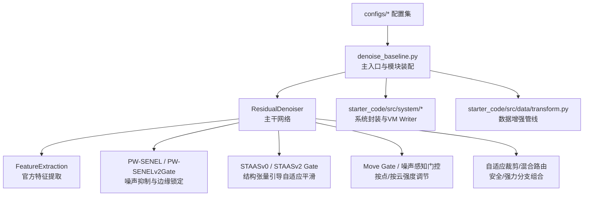
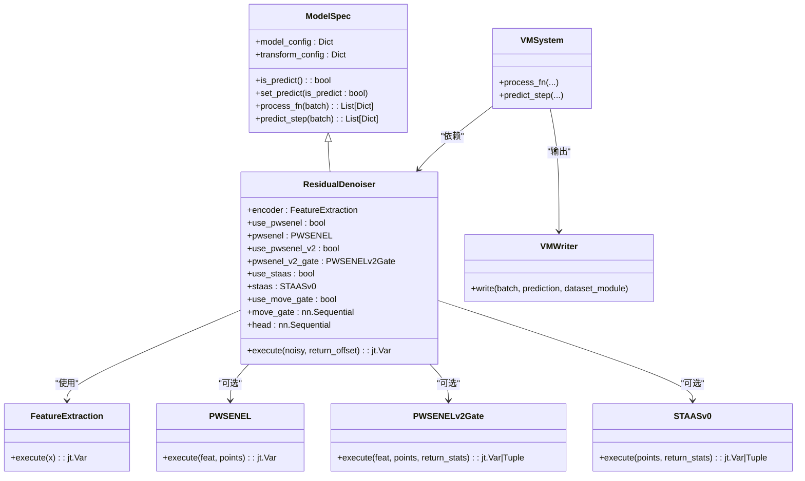
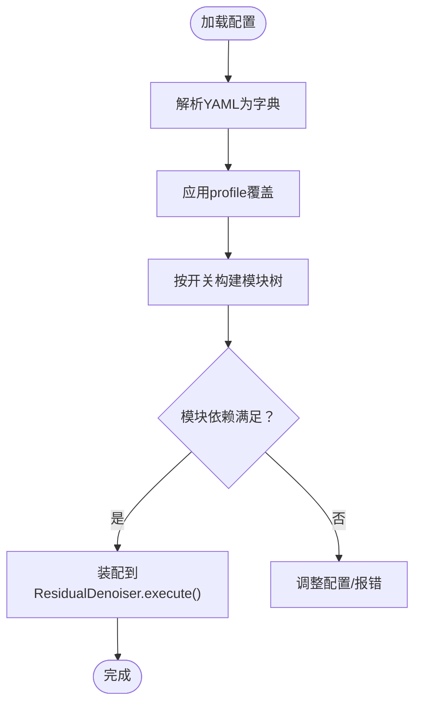
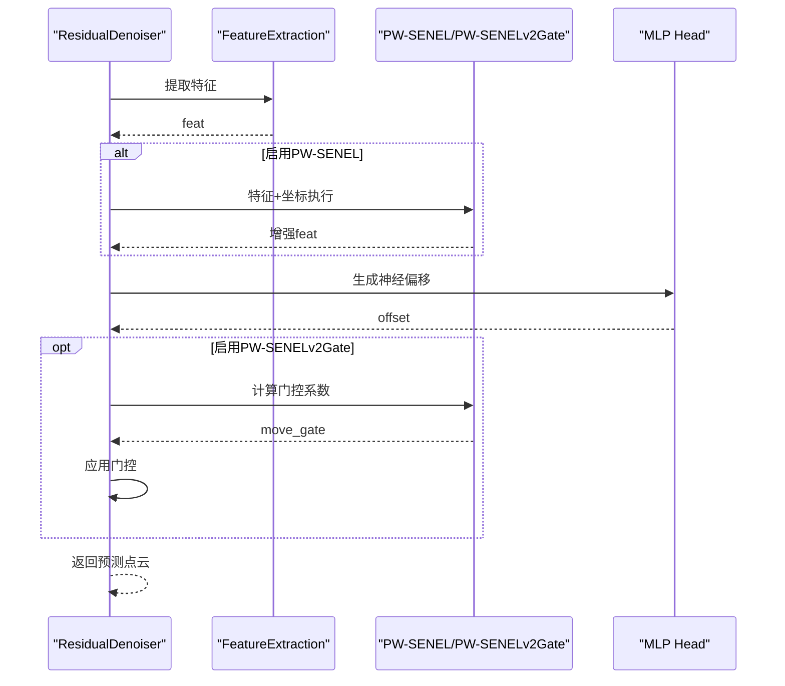
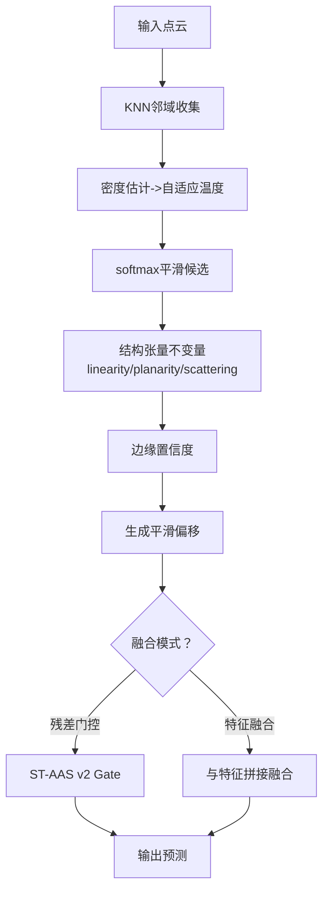
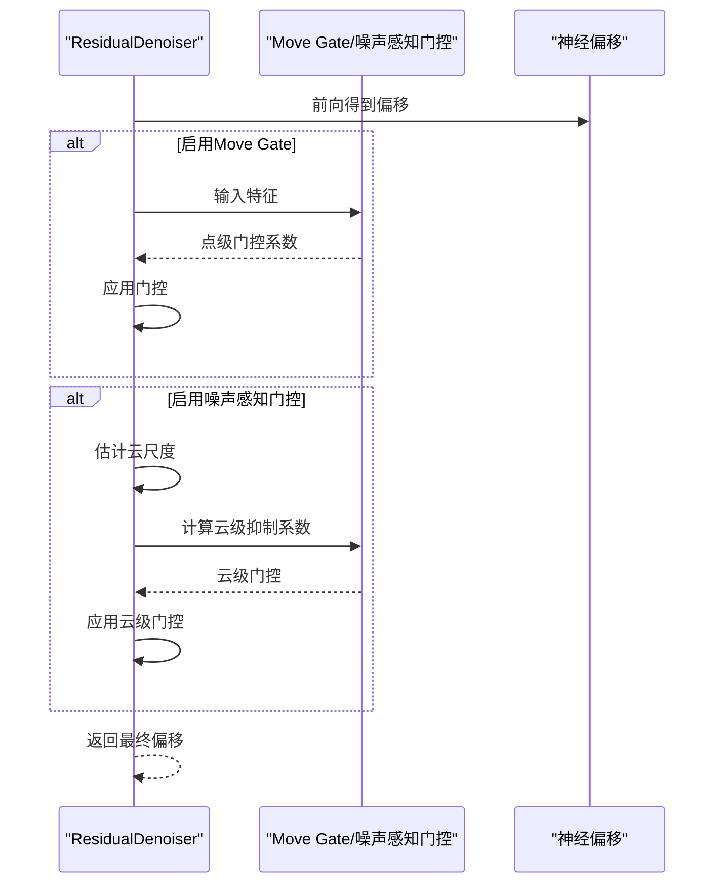
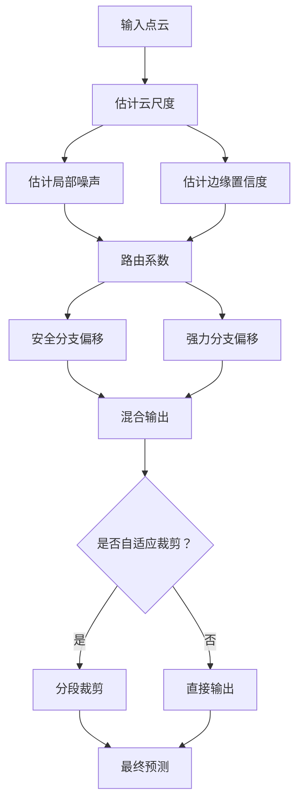
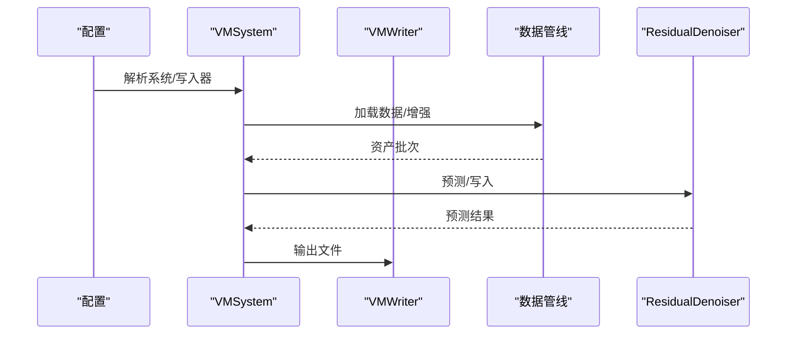
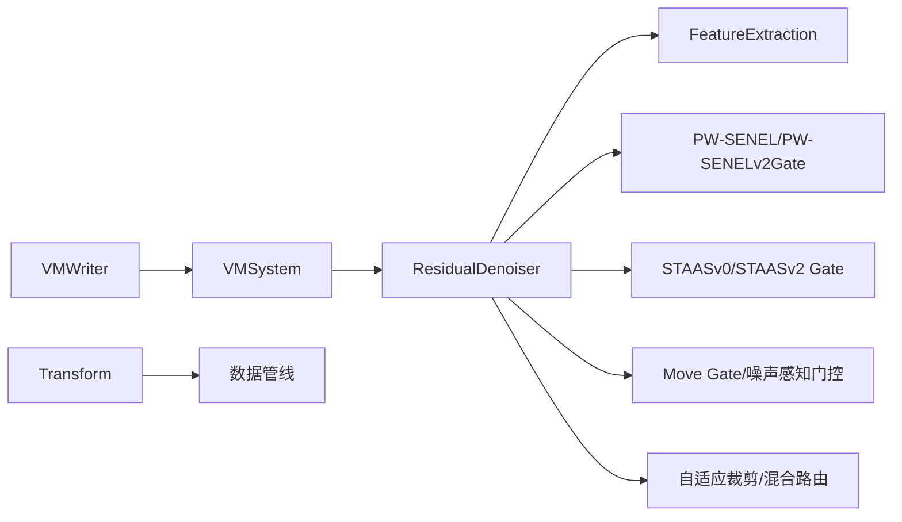

# 模块化系统设计

<cite>
**本文引用的文件**
- [README.md](file://README.md)
- [denoise_baseline.py](file://denoise_baseline.py)
- [configs/denoise_pwsenel.yaml](file://configs/denoise_pwsenel.yaml)
- [configs/denoise_staas_v0.yaml](file://configs/denoise_staas_v0.yaml)
- [configs/denoise_move_gate.yaml](file://configs/denoise_move_gate.yaml)
- [configs/denoise_hybrid_safe_strong.yaml](file://configs/denoise_hybrid_safe_strong.yaml)
- [configs/denoise_noise_aware_move_gate.yaml](file://configs/denoise_noise_aware_move_gate.yaml)
- [starter_code/src/model/spec.py](file://starter_code/src/model/spec.py)
- [starter_code/src/model/feature.py](file://starter_code/src/model/feature.py)
- [starter_code/src/system/vm.py](file://starter_code/src/system/vm.py)
- [starter_code/src/system/parse.py](file://starter_code/src/system/parse.py)
- [starter_code/src/data/transform.py](file://starter_code/src/data/transform.py)
</cite>

## 目录
1. [引言](#引言)
2. [项目结构](#项目结构)
3. [核心组件](#核心组件)
4. [架构总览](#架构总览)
5. [详细组件分析](#详细组件分析)
6. [依赖分析](#依赖分析)
7. [性能考量](#性能考量)
8. [故障排查指南](#故障排查指南)
9. [结论](#结论)
10. [附录](#附录)

## 引言
本设计文档面向Jittor点云去噪项目的模块化系统，聚焦几何增强模块的插拔式架构，包括PW-SENEL、ST-AAS、移动门控（Move Gate）等模块的可选集成机制。文档阐述模块开关控制策略、参数化配置系统与A/B测试友好设计原则，解析模块间的依赖关系、接口约定与组合策略，并总结模块化带来的优势、扩展性与维护成本，最后给出模块添加指南、配置管理最佳实践与模块间通信机制说明。

## 项目结构
项目采用“官方starter_code + 自研模块”的分层组织方式：
- 官方代码位于starter_code目录，包含数据管线、系统封装与官方VM推理流程。
- 自研模块集中在主工程入口与配置中，通过配置开关控制模块启用与否。
- 配置文件位于configs目录，按任务/方法拆分，支持profile覆盖与多配置合并。

图表来源
- [denoise_baseline.py:480-732](file://denoise_baseline.py#L480-L732)
- [starter_code/src/model/feature.py:65-139](file://starter_code/src/model/feature.py#L65-L139)
- [starter_code/src/system/vm.py:34-59](file://starter_code/src/system/vm.py#L34-L59)
- [starter_code/src/data/transform.py:8-26](file://starter_code/src/data/transform.py#L8-L26)

章节来源
- [README.md:52-106](file://README.md#L52-L106)
- [starter_code/src/system/parse.py:4-22](file://starter_code/src/system/parse.py#L4-L22)

## 核心组件
- ResidualDenoiser：主干残差去噪器，负责特征提取与模块装配，支持多种几何增强模块的开关与融合。
- FeatureExtraction：官方EdgeConv风格动态图特征提取，作为主干编码器复用。
- 几何增强模块：
  - PW-SENEL/PW-SENELv2Gate：基于softmax邻域噪声抑制与MaxPool边缘锁定，可作为特征级或偏移级门控。
  - STAASv0/STAASv2 Gate：密度自适应温度softmax平滑与结构张量边缘抑制，支持融合与单用。
  - Move Gate/噪声感知门控：学习按点移动强度，结合全局噪声估计进行抑制。
- 自适应裁剪与混合路由：根据云尺度与局部噪声状态进行分段自适应裁剪与安全/强力分支路由。
- 系统与数据管线：VM系统封装、Writer输出、Transform增强与ModelSpec抽象。

章节来源
- [denoise_baseline.py:480-732](file://denoise_baseline.py#L480-L732)
- [starter_code/src/model/feature.py:65-139](file://starter_code/src/model/feature.py#L65-L139)
- [starter_code/src/system/vm.py:34-59](file://starter_code/src/system/vm.py#L34-L59)
- [starter_code/src/data/transform.py:8-26](file://starter_code/src/data/transform.py#L8-L26)

## 架构总览
模块化架构以“配置驱动 + 条件装配 + 统一接口”为核心：
- 配置驱动：通过YAML配置中的布尔开关与超参字段决定模块启用与参数。
- 条件装配：在主干网络初始化时按开关条件实例化模块，未启用则为None。
- 统一接口：所有模块均实现统一的execute/forward接口，便于在主干网络中顺序调用。

图表来源
- [starter_code/src/model/spec.py:21-101](file://starter_code/src/model/spec.py#L21-L101)
- [starter_code/src/system/vm.py:34-59](file://starter_code/src/system/vm.py#L34-L59)
- [starter_code/src/model/feature.py:65-139](file://starter_code/src/model/feature.py#L65-L139)
- [denoise_baseline.py:480-732](file://denoise_baseline.py#L480-L732)

## 详细组件分析

### 模块开关与参数化配置系统
- 开关字段：在model节下设置布尔开关，如pwsenel、staas、move_gate、hybrid_safe_strong等。
- 参数字段：与模块相关的超参随模块开关一并配置，如staas_tau0/tau_min/tau_max、pwsenel_v2_edge_lock、adaptive_clip相关阈值等。
- 配置合并：scripts层提供profile覆盖与多配置合并能力，确保硬件适配与实验复现。

图表来源
- [configs/denoise_pwsenel.yaml:30-40](file://configs/denoise_pwsenel.yaml#L30-L40)
- [configs/denoise_staas_v0.yaml:30-39](file://configs/denoise_staas_v0.yaml#L30-L39)
- [configs/denoise_move_gate.yaml:28-38](file://configs/denoise_move_gate.yaml#L28-L38)
- [configs/denoise_hybrid_safe_strong.yaml:25-48](file://configs/denoise_hybrid_safe_strong.yaml#L25-L48)
- [configs/denoise_noise_aware_move_gate.yaml:25-38](file://configs/denoise_noise_aware_move_gate.yaml#L25-L38)

章节来源
- [configs/denoise_pwsenel.yaml:1-44](file://configs/denoise_pwsenel.yaml#L1-L44)
- [configs/denoise_staas_v0.yaml:1-44](file://configs/denoise_staas_v0.yaml#L1-L44)
- [configs/denoise_move_gate.yaml:1-43](file://configs/denoise_move_gate.yaml#L1-L43)
- [configs/denoise_hybrid_safe_strong.yaml:1-53](file://configs/denoise_hybrid_safe_strong.yaml#L1-L53)
- [configs/denoise_noise_aware_move_gate.yaml:1-47](file://configs/denoise_noise_aware_move_gate.yaml#L1-L47)

### PW-SENEL与PW-SENELv2Gate：邻域噪声抑制与边缘锁定
- PW-SENEL：特征级邻域softmax噪声抑制 + MaxPool边缘线索保留，作为特征融合模块接入。
- PW-SENELv2Gate：偏移级门控，学习噪声置信度与边缘锁定，按点动态缩放神经偏移，支持返回统计信息用于下游路由。

图表来源
- [denoise_baseline.py:259-315](file://denoise_baseline.py#L259-L315)
- [denoise_baseline.py:317-375](file://denoise_baseline.py#L317-L375)
- [denoise_baseline.py:480-732](file://denoise_baseline.py#L480-L732)

章节来源
- [denoise_baseline.py:259-375](file://denoise_baseline.py#L259-L375)
- [denoise_baseline.py:480-732](file://denoise_baseline.py#L480-L732)

### ST-AAS v0与ST-AAS v2 Gate：结构张量引导的自适应平滑
- ST-AAS v0：单KNN邻域、密度自适应温度softmax平滑，使用结构张量不变量描述边缘倾向，可作为残差偏移或特征融合。
- ST-AAS v2 Gate：基于噪声与边缘置信度的残差/几何偏移门控，保护低噪声/边缘区域，同时保留高噪声场景的移动能力。

图表来源
- [denoise_baseline.py:377-478](file://denoise_baseline.py#L377-L478)
- [denoise_baseline.py:480-732](file://denoise_baseline.py#L480-L732)

章节来源
- [denoise_baseline.py:377-478](file://denoise_baseline.py#L377-L478)
- [denoise_baseline.py:480-732](file://denoise_baseline.py#L480-L732)

### 移动门控与噪声感知门控：按点/按云强度调节
- Move Gate：学习按点移动强度，抑制过度校正。
- 噪声感知门控：基于全局云尺度估计，对低噪声云进一步抑制移动，减少过拟合。

图表来源
- [denoise_baseline.py:588-593](file://denoise_baseline.py#L588-L593)
- [denoise_baseline.py:658-674](file://denoise_baseline.py#L658-L674)
- [denoise_baseline.py:660-670](file://denoise_baseline.py#L660-L670)

章节来源
- [configs/denoise_move_gate.yaml:28-38](file://configs/denoise_move_gate.yaml#L28-L38)
- [configs/denoise_noise_aware_move_gate.yaml:25-38](file://configs/denoise_noise_aware_move_gate.yaml#L25-L38)
- [denoise_baseline.py:588-593](file://denoise_baseline.py#L588-L593)
- [denoise_baseline.py:658-674](file://denoise_baseline.py#L658-L674)
- [denoise_baseline.py:660-670](file://denoise_baseline.py#L660-L670)

### 自适应裁剪与混合路由：安全/强力分支组合
- 自适应裁剪：按云尺度分段裁剪，低噪声保守、中噪声适度、高噪声放宽，避免单一线性裁剪导致的性能退化。
- 混合路由：安全分支（PW-SENELv2+保守裁剪）与强力分支（保留Move Gate能力）组合，按局部噪声与边缘置信度动态打开强力分支。

图表来源
- [denoise_baseline.py:626-656](file://denoise_baseline.py#L626-L656)
- [denoise_baseline.py:702-723](file://denoise_baseline.py#L702-L723)
- [configs/denoise_hybrid_safe_strong.yaml:25-48](file://configs/denoise_hybrid_safe_strong.yaml#L25-L48)

章节来源
- [denoise_baseline.py:626-656](file://denoise_baseline.py#L626-L656)
- [denoise_baseline.py:702-723](file://denoise_baseline.py#L702-L723)
- [configs/denoise_hybrid_safe_strong.yaml:25-48](file://configs/denoise_hybrid_safe_strong.yaml#L25-L48)

### 系统封装与数据管线
- ModelSpec：统一模型生命周期与数据处理接口，支持训练/验证/预测阶段的Transform注入。
- Transform：封装Augment列表，按配置解析并应用到Asset。
- VMSystem/VMWriter：官方VM推理封装与结果写入，支持npy/obj导出。

图表来源
- [starter_code/src/system/vm.py:34-59](file://starter_code/src/system/vm.py#L34-L59)
- [starter_code/src/system/parse.py:4-22](file://starter_code/src/system/parse.py#L4-L22)
- [starter_code/src/data/transform.py:8-26](file://starter_code/src/data/transform.py#L8-L26)
- [starter_code/src/model/spec.py:47-98](file://starter_code/src/model/spec.py#L47-L98)

章节来源
- [starter_code/src/system/vm.py:34-59](file://starter_code/src/system/vm.py#L34-L59)
- [starter_code/src/system/parse.py:4-22](file://starter_code/src/system/parse.py#L4-L22)
- [starter_code/src/data/transform.py:8-26](file://starter_code/src/data/transform.py#L8-L26)
- [starter_code/src/model/spec.py:47-98](file://starter_code/src/model/spec.py#L47-L98)

## 依赖分析
- 组件耦合与内聚：
  - ResidualDenoiser对FeatureExtraction强依赖，对各几何模块弱依赖（None即禁用），内聚性良好。
  - 几何模块彼此独立，仅在ResidualDenoiser中按需组合，降低循环依赖风险。
- 外部依赖：
  - Jittor张量库与官方starter_code的FeatureExtraction/Decoder。
  - OmegaConf用于配置解析与容器转换。
- 接口契约：
  - 所有模块遵循统一的execute/forward接口，便于在主干网络中顺序调用。
  - ModelSpec定义process_fn/predict_step等抽象，确保系统封装一致性。

图表来源
- [denoise_baseline.py:480-732](file://denoise_baseline.py#L480-L732)
- [starter_code/src/system/vm.py:34-59](file://starter_code/src/system/vm.py#L34-L59)
- [starter_code/src/data/transform.py:8-26](file://starter_code/src/data/transform.py#L8-L26)

章节来源
- [starter_code/src/model/spec.py:21-101](file://starter_code/src/model/spec.py#L21-L101)
- [starter_code/src/model/feature.py:65-139](file://starter_code/src/model/feature.py#L65-L139)
- [denoise_baseline.py:480-732](file://denoise_baseline.py#L480-L732)

## 性能考量
- 计算开销：
  - PW-SENEL/PW-SENELv2Gate：邻域gather与softmax/MaxPool计算，K越大开销越高。
  - ST-AAS v0：单KNN邻域，计算量可控；v2 Gate引入额外MLP，增加少量前向开销。
  - Move Gate/噪声感知门控：轻量MLP，影响较小。
- 显存与内存：
  - ResidualDenoiser主干特征维度与K共同决定显存占用。
  - 混合路由与自适应裁剪在运行时按条件分支，避免冗余计算。
- 推理稳定性：
  - VM系统提供稠密与流式拼接两种固定拼接策略，自动覆盖未被任何patch覆盖的点，避免静默丢点。

章节来源
- [starter_code/src/model/vm.py:209-302](file://starter_code/src/model/vm.py#L209-L302)
- [starter_code/src/model/vm.py:333-414](file://starter_code/src/model/vm.py#L333-L414)

## 故障排查指南
- 配置错误：
  - 使用check_keys确保配置键名合法，避免拼写错误导致模块未生效。
- 模块未生效：
  - 检查对应开关字段是否正确设置为true，确认模块在ResidualDenoiser中被实例化。
- 推理异常：
  - VM系统提供环境变量控制拼接模式与最小点数阈值，必要时切换为流式拼接以规避显存峰值。
- 输出数量不一致：
  - 确认覆盖率修复逻辑已触发，避免因未覆盖点导致输出点数变化。

章节来源
- [starter_code/src/data/spec.py:4-16](file://starter_code/src/data/spec.py#L4-L16)
- [starter_code/src/model/spec.py:47-62](file://starter_code/src/model/spec.py#L47-L62)
- [starter_code/src/model/vm.py:114-128](file://starter_code/src/model/vm.py#L114-L128)
- [starter_code/src/model/vm.py:228-250](file://starter_code/src/model/vm.py#L228-L250)

## 结论
本模块化系统通过“配置驱动 + 条件装配 + 统一接口”的设计，实现了PW-SENEL、ST-AAS、移动门控等几何增强模块的插拔式集成。该设计具备良好的A/B测试友好性与可复现性，便于在不同硬件与噪声环境下快速切换与组合模块，提升点云去噪的边缘保真度与鲁棒性。

## 附录

### 模块添加指南
- 新增模块步骤：
  - 在主干网络中新增模块类，实现统一execute接口。
  - 在ResidualDenoiser中新增开关与实例化逻辑。
  - 在配置文件中新增对应参数字段，并在相应YAML中启用。
  - 如需统计输出，确保execute支持return_stats并正确拼接到下游。
- 接口约定：
  - 所有模块必须实现execute方法，输入输出张量形状与主干网络约定一致。
  - 模块内部避免硬编码路径与外部依赖，参数全部来自配置。
- 组合策略：
  - 优先以特征级模块（如PW-SENEL）与偏移级模块（如PW-SENELv2Gate/Move Gate）分层组合。
  - 对于ST-AAS，可选择作为残差偏移或与特征融合，依据效果选择。

章节来源
- [denoise_baseline.py:480-732](file://denoise_baseline.py#L480-L732)
- [starter_code/src/model/spec.py:21-101](file://starter_code/src/model/spec.py#L21-L101)

### 配置管理最佳实践
- 分层配置：
  - 将通用参数置于基础配置，机器相关参数放入profile，避免重复与冲突。
- 键名校验：
  - 使用check_keys确保配置键名合法，减少运行期错误。
- 多配置合并：
  - 通过脚本层的合并策略，实现baseline与ablation的快速切换。
- A/B测试建议：
  - 以开关字段为粒度进行AB测试，记录实验名称与配置差异，便于回溯。

章节来源
- [starter_code/src/data/spec.py:4-16](file://starter_code/src/data/spec.py#L4-L16)
- [denoise_baseline.py:38-45](file://denoise_baseline.py#L38-L45)

### 模块间通信机制
- 统一数据通道：
  - ResidualDenoiser在execute中按顺序传递张量，模块间通过中间特征/偏移进行通信。
- 统计信息共享：
  - 模块可通过return_stats返回中间统计（如噪声置信度、边缘置信度、平滑偏移），供下游路由/融合使用。
- 环境与系统：
  - VM系统通过环境变量控制拼接策略与最小点数阈值，保障大规模点云推理稳定性。

章节来源
- [denoise_baseline.py:638-645](file://denoise_baseline.py#L638-L645)
- [starter_code/src/model/vm.py:114-128](file://starter_code/src/model/vm.py#L114-L128)
- [starter_code/src/system/vm.py:17-33](file://starter_code/src/system/vm.py#L17-L33)