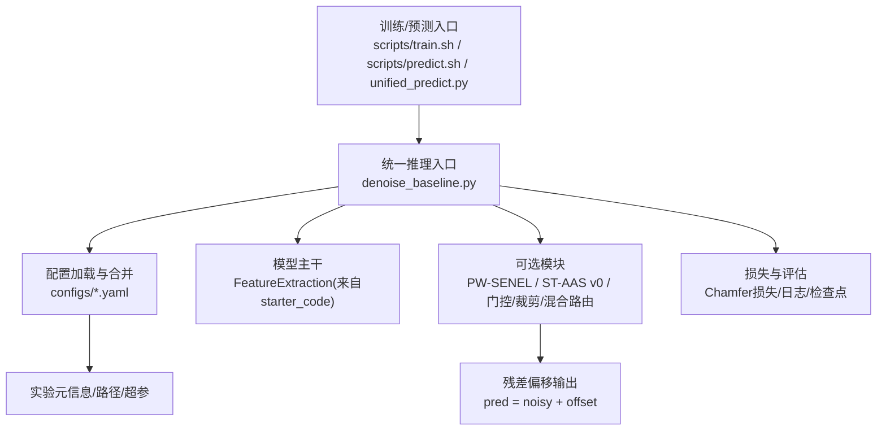
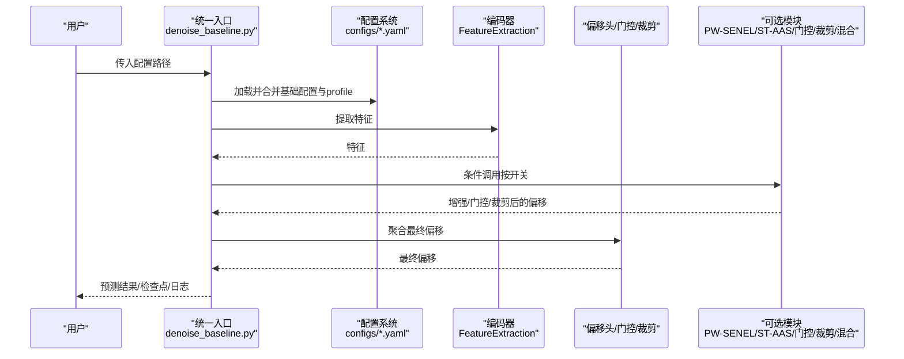
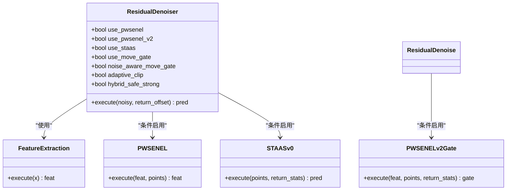
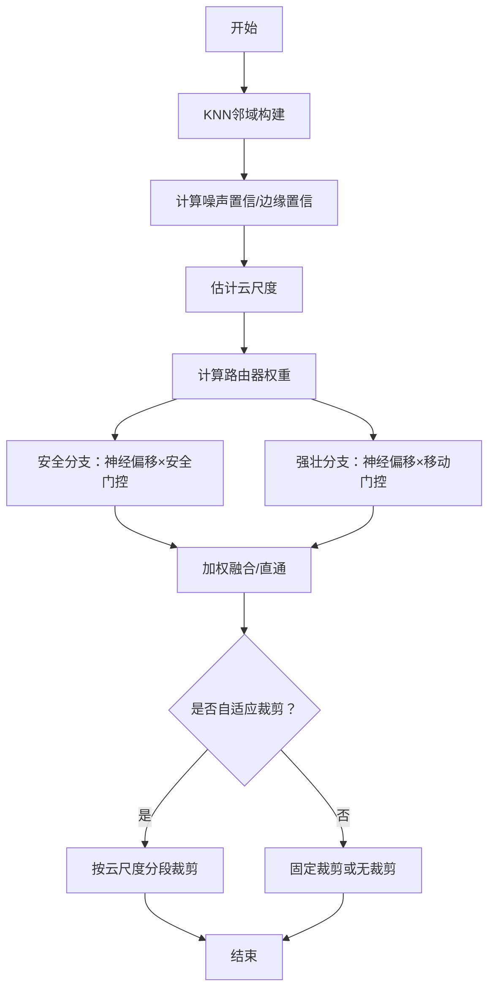
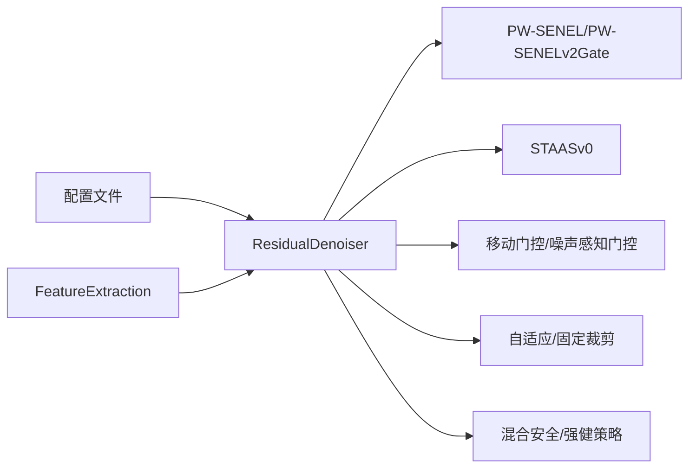

# 模块组合策略

<cite>
**本文引用的文件**
- [README.md](file://README.md)
- [denoise_baseline.py](file://denoise_baseline.py)
- [configs/denoise_baseline.yaml](file://configs/denoise_baseline.yaml)
- [configs/denoise_pwsenel.yaml](file://configs/denoise_pwsenel.yaml)
- [configs/denoise_staas_v0.yaml](file://configs/denoise_staas_v0.yaml)
- [configs/denoise_move_gate.yaml](file://configs/denoise_move_gate.yaml)
- [configs/denoise_noise_aware_move_gate.yaml](file://configs/denoise_noise_aware_move_gate.yaml)
- [configs/denoise_hybrid_safe_strong.yaml](file://configs/denoise_hybrid_safe_strong.yaml)
- [configs/denoise_hybrid_safe_strong_v2.yaml](file://configs/denoise_hybrid_safe_strong_v2.yaml)
- [configs/denoise_hybrid_safe_strong_v3.yaml](file://configs/denoise_hybrid_safe_strong_v3.yaml)
- [starter_code/src/model/feature.py](file://starter_code/src/model/feature.py)
- [starter_code/src/model/spec.py](file://starter_code/src/model/spec.py)
</cite>

## 目录
1. [引言](#引言)
2. [项目结构](#项目结构)
3. [核心组件](#核心组件)
4. [架构总览](#架构总览)
5. [详细组件分析](#详细组件分析)
6. [依赖分析](#依赖分析)
7. [性能考量](#性能考量)
8. [故障排查指南](#故障排查指南)
9. [结论](#结论)
10. [附录](#附录)

## 引言
本文件面向Jittor点云去噪项目的模块组合策略，系统阐述可插拔模块系统的架构设计、模块开关控制机制与参数化配置体系，深入解析模块间依赖关系、接口约定与组合优先级规则，并给出A/B测试友好设计、渐进式增强与模块回退策略。同时提供最佳实践、性能权衡分析与实验设计指南，并结合具体配置示例说明模块组合对最终效果的影响。

## 项目结构
该项目围绕“残差偏移回归”主干，通过可选模块实现可插拔的点云去噪能力。核心入口为训练/预测脚本与统一推理入口，配置文件采用YAML组织，按实验名、路径、训练超参与模型开关参数分层管理。官方starter_code提供几何特征提取等基础模块，本仓库在此基础上扩展研究模块，确保提交链路清晰、可复现实验。

图表来源
- [README.md: 52-106:52-106](file://README.md#L52-L106)
- [denoise_baseline.py: 56, 520-594:56-594](file://denoise_baseline.py#L56-L594)

章节来源
- [README.md: 52-106:52-106](file://README.md#L52-L106)
- [denoise_baseline.py: 56, 520-594:56-594](file://denoise_baseline.py#L56-L594)

## 核心组件
- 残差去噪主干
  - 使用官方starter_code的FeatureExtraction作为编码器，输出特征后经MLP偏移头得到神经残差偏移。
- 可选模块
  - PW-SENEL：基于softmax的邻域噪声抑制与MaxPool边缘锁定，可作为特征增强或偏移门控。
  - ST-AAS v0：结构张量引导的自适应softmax平滑，支持边缘感知抑制与可选融合。
  - 移动门控/噪声感知移动门控：按点学习缩放神经偏移强度，抑制低噪声区域过矫正。
  - 自适应裁剪/固定裁剪：按云尺度分段自适应限制残差幅值，或使用固定阈值。
  - 混合安全/强健策略：安全分支（PW-SENEL v2 + 保守裁剪）+ 强壮分支（保留移动门控容量），由路由器选择性开启。
- 统一推理入口
  - 支持训练、预测、打包校验等模式，集中处理配置合并、路径检查、日志与检查点管理。

章节来源
- [denoise_baseline.py: 259-732:259-732](file://denoise_baseline.py#L259-L732)
- [starter_code/src/model/feature.py: 65-139:65-139](file://starter_code/src/model/feature.py#L65-L139)

## 架构总览
模块组合遵循“主干+可选模块”的插件式架构，所有模块均以布尔开关控制启用与否，部分模块提供细粒度参数化。执行流程中，模块按预设优先级顺序接入，保证可重复性与可回退性。

图表来源
- [denoise_baseline.py: 520-732:520-732](file://denoise_baseline.py#L520-L732)
- [starter_code/src/model/feature.py: 65-139:65-139](file://starter_code/src/model/feature.py#L65-L139)

## 详细组件分析

### 模块类与接口约定
- 类层次
  - ResidualDenoiser：主干与模块装配中心，负责模块实例化与执行顺序。
  - PWSENEL/PWSENELv2Gate：邻域噪声抑制与边缘锁定/门控。
  - STAASv0：结构张量引导的自适应softmax平滑。
  - 门控与裁剪：移动门控、噪声感知移动门控、自适应裁剪、固定裁剪。
- 接口约定
  - 所有模块均实现execute方法，接受输入张量并返回处理后的张量。
  - 可选返回统计信息（如噪声置信、边缘置信、平滑偏移等），用于日志或进一步计算。
  - 编码器FeatureExtraction提供统一的KNN索引与动态图卷积特征提取。

图表来源
- [denoise_baseline.py: 259-594:259-594](file://denoise_baseline.py#L259-L594)
- [starter_code/src/model/feature.py: 65-139:65-139](file://starter_code/src/model/feature.py#L65-L139)

章节来源
- [denoise_baseline.py: 259-594:259-594](file://denoise_baseline.py#L259-L594)
- [starter_code/src/model/feature.py: 65-139:65-139](file://starter_code/src/model/feature.py#L65-L139)

### 模块开关与组合优先级
- 开关控制
  - 通过配置文件中的布尔字段控制模块启用，如pwsenel、staas、move_gate、noise_aware_move_gate、adaptive_clip、hybrid_safe_strong等。
- 组合优先级
  - 特征增强优先：若启用PW-SENEL，则先对特征进行增强，再进入偏移头。
  - 几何分支：若启用STAAS（含融合/门控），则在必要时计算几何统计并参与融合或门控。
  - 偏移门控：移动门控与噪声感知移动门控在神经偏移后应用，可叠加PW-SENEL v2门控。
  - 残差裁剪：自适应裁剪在门控之后，固定裁剪在更早阶段；两者互斥。
  - 混合策略：混合安全/强健策略在门控与裁剪之前，根据路由器输出选择安全/强健分支。
- 参数化配置
  - 每个模块的关键参数在配置文件中独立定义，如STAAS温度范围、PW-SENEL v2门控强度与缩放、混合路由器比例等。

章节来源
- [configs/denoise_baseline.yaml: 30-44:30-44](file://configs/denoise_baseline.yaml#L30-L44)
- [configs/denoise_pwsenel.yaml: 30-44:30-44](file://configs/denoise_pwsenel.yaml#L30-L44)
- [configs/denoise_staas_v0.yaml: 30-44:30-44](file://configs/denoise_staas_v0.yaml#L30-L44)
- [configs/denoise_move_gate.yaml: 28-43:28-43](file://configs/denoise_move_gate.yaml#L28-L43)
- [configs/denoise_noise_aware_move_gate.yaml: 25-47:25-47](file://configs/denoise_noise_aware_move_gate.yaml#L25-L47)
- [configs/denoise_hybrid_safe_strong.yaml: 25-53:25-53](file://configs/denoise_hybrid_safe_strong.yaml#L25-L53)
- [configs/denoise_hybrid_safe_strong_v2.yaml: 25-53:25-53](file://configs/denoise_hybrid_safe_strong_v2.yaml#L25-L53)
- [configs/denoise_hybrid_safe_strong_v3.yaml: 25-53:25-53](file://configs/denoise_hybrid_safe_strong_v3.yaml#L25-L53)
- [denoise_baseline.py: 520-732:520-732](file://denoise_baseline.py#L520-L732)

### 混合安全/强健策略（渐进式增强）
- 设计目标
  - 安全分支：受PW-SENEL v2与保守裁剪保护，避免低噪声区域过度修正。
  - 强壮分支：保留移动门控容量，提升高噪声场景的去噪能力。
  - 路由器：根据局部噪声置信与边缘置信以及全局云尺度，动态选择性开启强壮分支。
- 关键参数
  - pwsenel_v2_edge_lock、pwsenel_v2_gate_scale、hybrid_router_scale、adaptive_clip系列阈值等。
- 流程示意

图表来源
- [denoise_baseline.py: 626-723:626-723](file://denoise_baseline.py#L626-L723)
- [configs/denoise_hybrid_safe_strong.yaml: 25-53:25-53](file://configs/denoise_hybrid_safe_strong.yaml#L25-L53)
- [configs/denoise_hybrid_safe_strong_v2.yaml: 25-53:25-53](file://configs/denoise_hybrid_safe_strong_v2.yaml#L25-L53)
- [configs/denoise_hybrid_safe_strong_v3.yaml: 25-53:25-53](file://configs/denoise_hybrid_safe_strong_v3.yaml#L25-L53)

章节来源
- [denoise_baseline.py: 626-723:626-723](file://denoise_baseline.py#L626-L723)
- [configs/denoise_hybrid_safe_strong.yaml: 25-53:25-53](file://configs/denoise_hybrid_safe_strong.yaml#L25-L53)
- [configs/denoise_hybrid_safe_strong_v2.yaml: 25-53:25-53](file://configs/denoise_hybrid_safe_strong_v2.yaml#L25-L53)
- [configs/denoise_hybrid_safe_strong_v3.yaml: 25-53:25-53](file://configs/denoise_hybrid_safe_strong_v3.yaml#L25-L53)

### A/B测试友好设计与回退机制
- A/B测试友好
  - 每个模块以独立开关控制，便于AB对比；通过不同配置快速切换模块组合。
  - 统一日志与检查点命名规范，便于批量评估与可视化对比。
- 渐进式增强
  - 从baseline起步，逐步引入PW-SENEL/ST-AAS/门控/裁剪/混合策略，观察指标变化。
- 回退机制
  - 将模块开关关闭即可回退到上一版本；若出现异常，可直接禁用问题模块并保留其他模块。

章节来源
- [README.md: 173-247:173-247](file://README.md#L173-L247)
- [denoise_baseline.py: 741-800:741-800](file://denoise_baseline.py#L741-L800)

### 配置示例与组合影响分析
- 基线配置
  - 启用残差偏移回归，不启用任何可选模块，适合快速验证环境与数据。
- PW-SENEL消融
  - 启用PW-SENEL，观察其对噪声抑制与边缘保持的效果。
- ST-AAS v0消融
  - 启用ST-AAS v0，观察其对密度自适应平滑与边缘抑制的作用。
- 移动门控与噪声感知移动门控
  - 在低噪声区域抑制过度修正，避免过平滑；在高噪声区域保持接近原门控行为。
- 混合安全/强健策略
  - 通过调整路由器比例与裁剪阈值，平衡安全与强健性，适配不同噪声水平的云。

章节来源
- [configs/denoise_baseline.yaml: 30-44:30-44](file://configs/denoise_baseline.yaml#L30-L44)
- [configs/denoise_pwsenel.yaml: 30-44:30-44](file://configs/denoise_pwsenel.yaml#L30-L44)
- [configs/denoise_staas_v0.yaml: 30-44:30-44](file://configs/denoise_staas_v0.yaml#L30-L44)
- [configs/denoise_move_gate.yaml: 28-43:28-43](file://configs/denoise_move_gate.yaml#L28-L43)
- [configs/denoise_noise_aware_move_gate.yaml: 25-47:25-47](file://configs/denoise_noise_aware_move_gate.yaml#L25-L47)
- [configs/denoise_hybrid_safe_strong.yaml: 25-53:25-53](file://configs/denoise_hybrid_safe_strong.yaml#L25-L53)
- [configs/denoise_hybrid_safe_strong_v2.yaml: 25-53:25-53](file://configs/denoise_hybrid_safe_strong_v2.yaml#L25-L53)
- [configs/denoise_hybrid_safe_strong_v3.yaml: 25-53:25-53](file://configs/denoise_hybrid_safe_strong_v3.yaml#L25-L53)

## 依赖分析
- 组件耦合
  - ResidualDenoiser对各模块为条件依赖，耦合度低，便于独立替换与ablation。
  - FeatureExtraction来自starter_code，作为外部依赖，避免污染官方baseline。
- 外部依赖
  - Jittor框架、NumPy、Trimesh、OmegaConf等，通过requirements与env脚本管理。
- 潜在循环依赖
  - 未发现模块间循环依赖；模块均为单向接入。

图表来源
- [denoise_baseline.py: 520-732:520-732](file://denoise_baseline.py#L520-L732)
- [starter_code/src/model/feature.py: 65-139:65-139](file://starter_code/src/model/feature.py#L65-L139)

章节来源
- [denoise_baseline.py: 520-732:520-732](file://denoise_baseline.py#L520-L732)
- [starter_code/src/model/feature.py: 65-139:65-139](file://starter_code/src/model/feature.py#L65-L139)

## 性能考量
- 计算开销
  - KNN邻域查询与softmax/最大池化操作为主要开销；可通过K值、邻域数量与模块开关调节。
- 内存占用
  - 模块统计信息（如平滑偏移、尺度、温度等）会增加中间变量内存；可按需启用return_stats。
- 训练稳定性
  - 自适应裁剪可缓解单一大残差导致的不稳定；噪声感知门控可避免低噪声区域过修正。
- 推理效率
  - 混合策略在推理端引入额外分支计算；可通过路由器阈值与门控参数平衡速度与质量。

## 故障排查指南
- 环境与数据
  - 使用提供的env与check脚本确认Jittor/CUDA/数据路径可用。
- 配置合并
  - profile覆盖仅影响机器相关参数，方法主体不变；若行为异常，逐项关闭模块定位问题。
- 日志与检查点
  - 统一入口会记录关键配置与运行摘要，便于复盘与对比。
- 常见问题
  - CUDA相关错误：确认CuPy版本与CUDA版本匹配；必要时使用镜像源加速安装。
  - 数据路径错误：核对data_root/test_root/train_list与实际目录一致。

章节来源
- [README.md: 108-166:108-166](file://README.md#L108-L166)
- [denoise_baseline.py: 741-800:741-800](file://denoise_baseline.py#L741-L800)

## 结论
本项目通过“主干+可选模块”的插件式架构，实现了高度可配置、可复现且可回退的点云去噪系统。模块开关与参数化配置使A/B测试与渐进式增强成为可能；混合安全/强健策略在不同噪声水平下取得稳健效果。建议在实验设计中以基线为对照，逐模块引入并监控指标变化，结合自适应裁剪与门控策略获得最佳性能与鲁棒性。

## 附录
- 实验入口与任务
  - 环境设置、依赖安装、环境检查、数据检查、训练、预测、打包校验、候选套件评估与候选注册等。
- 配置文件清单
  - 基线、PW-SENEL、ST-AAS v0、移动门控、噪声感知移动门控、混合安全/强健系列等。

章节来源
- [README.md: 87-106:87-106](file://README.md#L87-L106)
- [configs/denoise_baseline.yaml: 1-44:1-44](file://configs/denoise_baseline.yaml#L1-L44)
- [configs/denoise_pwsenel.yaml: 1-44:1-44](file://configs/denoise_pwsenel.yaml#L1-L44)
- [configs/denoise_staas_v0.yaml: 1-44:1-44](file://configs/denoise_staas_v0.yaml#L1-L44)
- [configs/denoise_move_gate.yaml: 1-43:1-43](file://configs/denoise_move_gate.yaml#L1-L43)
- [configs/denoise_noise_aware_move_gate.yaml: 1-47:1-47](file://configs/denoise_noise_aware_move_gate.yaml#L1-L47)
- [configs/denoise_hybrid_safe_strong.yaml: 1-53:1-53](file://configs/denoise_hybrid_safe_strong.yaml#L1-L53)
- [configs/denoise_hybrid_safe_strong_v2.yaml: 1-53:1-53](file://configs/denoise_hybrid_safe_strong_v2.yaml#L1-L53)
- [configs/denoise_hybrid_safe_strong_v3.yaml: 1-53:1-53](file://configs/denoise_hybrid_safe_strong_v3.yaml#L1-L53)