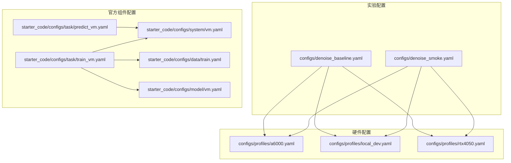
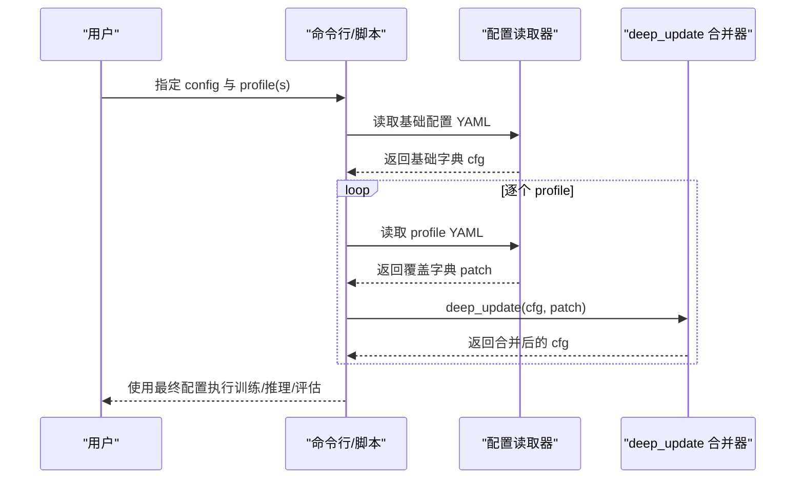
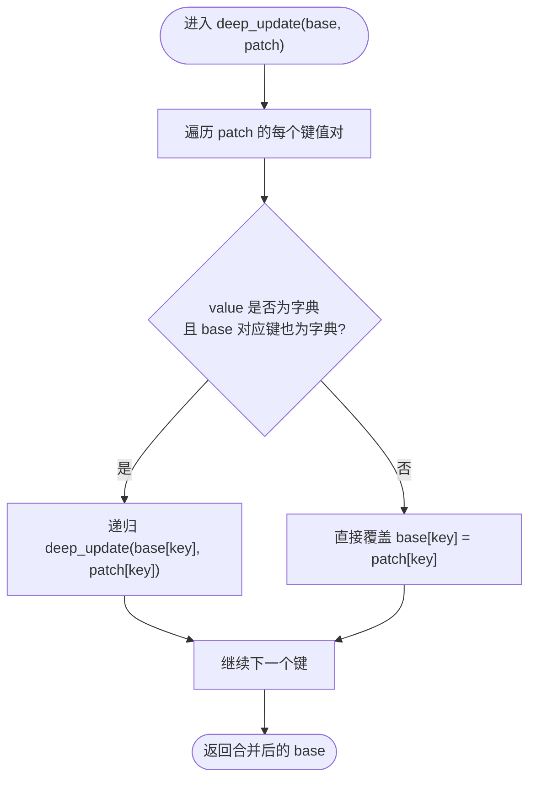
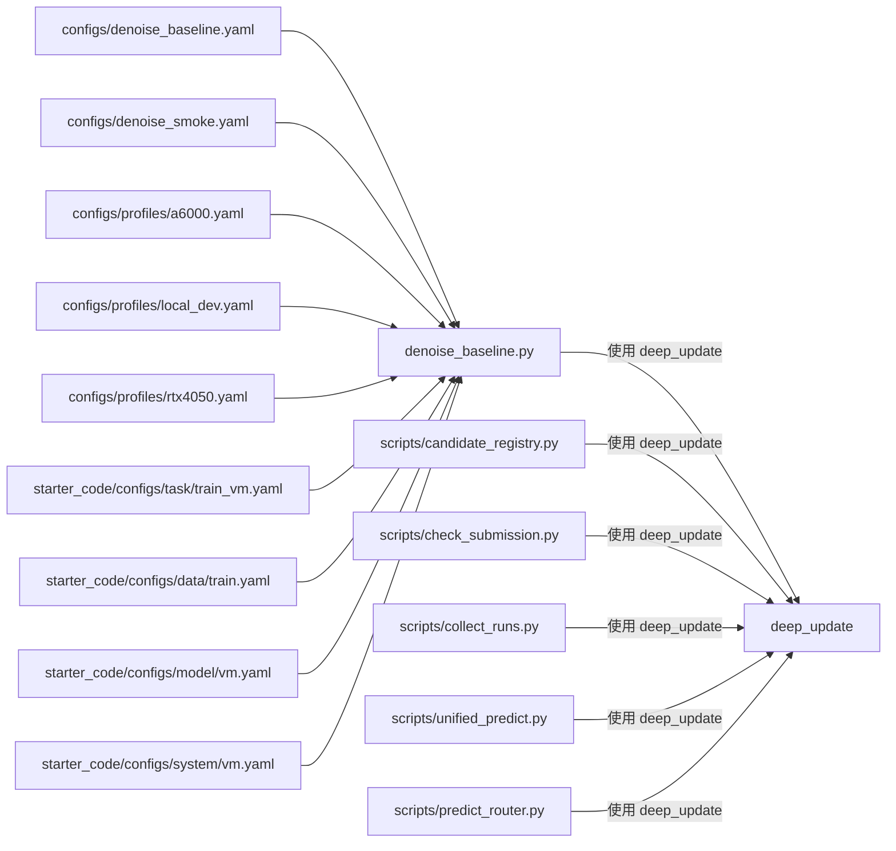

# 配置管理系统

<cite>
**本文引用的文件**
- [configs/denoise_baseline.yaml](file://configs/denoise_baseline.yaml)
- [configs/denoise_smoke.yaml](file://configs/denoise_smoke.yaml)
- [configs/profiles/a6000.yaml](file://configs/profiles/a6000.yaml)
- [configs/profiles/local_dev.yaml](file://configs/profiles/local_dev.yaml)
- [configs/profiles/rtx4050.yaml](file://configs/profiles/rtx4050.yaml)
- [starter_code/configs/system/vm.yaml](file://starter_code/configs/system/vm.yaml)
- [starter_code/configs/model/vm.yaml](file://starter_code/configs/model/vm.yaml)
- [starter_code/configs/data/train.yaml](file://starter_code/configs/data/train.yaml)
- [starter_code/configs/task/train_vm.yaml](file://starter_code/configs/task/train_vm.yaml)
- [starter_code/configs/task/predict_vm.yaml](file://starter_code/configs/task/predict_vm.yaml)
- [denoise_baseline.py](file://denoise_baseline.py)
- [scripts/candidate_registry.py](file://scripts/candidate_registry.py)
- [scripts/check_submission.py](file://scripts/check_submission.py)
- [scripts/collect_runs.py](file://scripts/collect_runs.py)
- [scripts/unified_predict.py](file://scripts/unified_predict.py)
- [scripts/predict_router.py](file://scripts/predict_router.py)
- [README.md](file://README.md)
- [README_REPRODUCE.md](file://README_REPRODUCE.md)
</cite>

## 目录
1. [简介](#简介)
2. [项目结构](#项目结构)
3. [核心组件](#核心组件)
4. [架构总览](#架构总览)
5. [详细组件分析](#详细组件分析)
6. [依赖关系分析](#依赖关系分析)
7. [性能考量](#性能考量)
8. [故障排查指南](#故障排查指南)
9. [结论](#结论)
10. [附录](#附录)

## 简介
本文件系统性阐述 Jittor 点云去噪项目的配置管理系统，重点覆盖以下方面：
- YAML 配置文件的层次结构与参数继承机制
- 配置合并规则（profile 覆盖策略）
- deep_update 函数的工作原理与行为
- profile 配置在不同脚本中的应用方式
- 实验参数的组织方式与模块开关控制
- 配置文件编写指南、参数调优策略与最佳实践
- 常见配置错误的排查方法与示例

## 项目结构
配置系统由两类主要文件构成：
- 实验配置（configs/*.yaml）：定义实验名称、路径、训练/预测/模型超参等
- 硬件配置（configs/profiles/*.yaml）：按硬件能力覆盖容量相关参数（如 batch_size、num_points、steps 等）

此外，starter_code 提供了官方组件的配置模板（data/system/model/task），便于在自研模型中复用官方组件。

图表来源
- [configs/denoise_baseline.yaml:1-44](file://configs/denoise_baseline.yaml#L1-L44)
- [configs/denoise_smoke.yaml:1-37](file://configs/denoise_smoke.yaml#L1-L37)
- [configs/profiles/a6000.yaml:1-29](file://configs/profiles/a6000.yaml#L1-L29)
- [configs/profiles/local_dev.yaml:1-19](file://configs/profiles/local_dev.yaml#L1-L19)
- [configs/profiles/rtx4050.yaml:1-20](file://configs/profiles/rtx4050.yaml#L1-L20)
- [starter_code/configs/data/train.yaml:1-34](file://starter_code/configs/data/train.yaml#L1-L34)
- [starter_code/configs/system/vm.yaml:1-4](file://starter_code/configs/system/vm.yaml#L1-L4)
- [starter_code/configs/model/vm.yaml:1-6](file://starter_code/configs/model/vm.yaml#L1-L6)
- [starter_code/configs/task/train_vm.yaml:1-18](file://starter_code/configs/task/train_vm.yaml#L1-L18)
- [starter_code/configs/task/predict_vm.yaml:1-14](file://starter_code/configs/task/predict_vm.yaml#L1-L14)

章节来源
- [README.md:97-221](file://README.md#L97-L221)
- [README_REPRODUCE.md:86-118](file://README_REPRODUCE.md#L86-L118)

## 核心组件
- 配置合并与覆盖
  - 通过 deep_update 实现“仅覆盖显式声明字段”的合并策略，保证 profile 仅覆盖其明确列出的参数，其余沿用基础配置
- profile 配置
  - 仅覆盖与硬件/资源相关的参数（如 steps、limit、num_points、batch_size、patch_size、log_every、save_every 等）
  - 不改变核心算法参数（如模型结构、损失权重等）
- 实验参数组织
  - experiment：实验元信息（名称、随机种子）
  - paths：数据根目录、测试根目录、列表文件、输出目录、打包名、检查点路径
  - train：训练步数、限制样本数、点数、批大小、学习率、噪声范围、CD 权重、日志/保存频率
  - model：网络结构与模块开关（如 pwsenel、staas、staas_fusion、staas_v2_gate 等）
  - predict：预测限制、补丁大小
- 官方组件配置
  - data/system/model/task：官方组件的配置模板，便于在自研任务中复用

章节来源
- [denoise_baseline.py:37-45](file://denoise_baseline.py#L37-L45)
- [configs/denoise_baseline.yaml:4-44](file://configs/denoise_baseline.yaml#L4-L44)
- [configs/denoise_smoke.yaml:4-37](file://configs/denoise_smoke.yaml#L4-L37)
- [configs/profiles/a6000.yaml:6-29](file://configs/profiles/a6000.yaml#L6-L29)
- [configs/profiles/local_dev.yaml:4-19](file://configs/profiles/local_dev.yaml#L4-L19)
- [configs/profiles/rtx4050.yaml:5-20](file://configs/profiles/rtx4050.yaml#L5-L20)
- [starter_code/configs/data/train.yaml:4-34](file://starter_code/configs/data/train.yaml#L4-L34)
- [starter_code/configs/system/vm.yaml:1-4](file://starter_code/configs/system/vm.yaml#L1-L4)
- [starter_code/configs/model/vm.yaml:1-6](file://starter_code/configs/model/vm.yaml#L1-L6)
- [starter_code/configs/task/train_vm.yaml:4-18](file://starter_code/configs/task/train_vm.yaml#L4-L18)
- [starter_code/configs/task/predict_vm.yaml:1-14](file://starter_code/configs/task/predict_vm.yaml#L1-L14)

## 架构总览
配置系统在多个脚本中被统一使用，形成“基础配置 + profile 覆盖”的分层结构。下图展示了配置加载与合并的关键流程：

图表来源
- [denoise_baseline.py:37-45](file://denoise_baseline.py#L37-L45)
- [scripts/candidate_registry.py:128-142](file://scripts/candidate_registry.py#L128-L142)
- [scripts/check_submission.py:27-52](file://scripts/check_submission.py#L27-L52)
- [scripts/collect_runs.py:74-80](file://scripts/collect_runs.py#L74-L80)

章节来源
- [denoise_baseline.py:37-45](file://denoise_baseline.py#L37-L45)
- [scripts/candidate_registry.py:128-142](file://scripts/candidate_registry.py#L128-L142)
- [scripts/check_submission.py:27-52](file://scripts/check_submission.py#L27-L52)
- [scripts/collect_runs.py:74-80](file://scripts/collect_runs.py#L74-L80)

## 详细组件分析

### deep_update 合并函数
- 工作原理
  - 递归遍历 patch 中的键值对
  - 若某键对应的值为字典且基础配置中该键也为字典，则递归进行深合并
  - 否则直接用 patch 的值覆盖基础配置中的同名键
- 行为特点
  - 仅覆盖显式声明的字段，未在 profile 中声明的字段保持不变
  - 支持多级嵌套字典的逐层覆盖
- 典型应用场景
  - 将 profile 的容量相关参数叠加到基础配置之上
  - 在收集运行结果时将 config.final.yaml 与 profile.yaml 合并

图表来源
- [denoise_baseline.py:37-45](file://denoise_baseline.py#L37-L45)
- [scripts/candidate_registry.py:128-135](file://scripts/candidate_registry.py#L128-L135)
- [scripts/check_submission.py:27-35](file://scripts/check_submission.py#L27-L35)
- [scripts/collect_runs.py:74-80](file://scripts/collect_runs.py#L74-L80)

章节来源
- [denoise_baseline.py:37-45](file://denoise_baseline.py#L37-L45)
- [scripts/candidate_registry.py:128-135](file://scripts/candidate_registry.py#L128-L135)
- [scripts/check_submission.py:27-35](file://scripts/check_submission.py#L27-L35)
- [scripts/collect_runs.py:74-80](file://scripts/collect_runs.py#L74-L80)

### profile 配置覆盖策略
- 覆盖范围
  - 仅覆盖与硬件/资源相关的参数，如 steps、limit、num_points、batch_size、patch_size、log_every、save_every、cache_clean、prefetch_workers、prefetch_queue_size、profile_times、profile_system_every 等
- 不覆盖范围
  - 不改变核心算法参数（如模型结构、损失函数权重、模块开关等）
- 应用方式
  - 在训练/推理/评估脚本中依次读取基础配置与各 profile，并通过 deep_update 合并
  - 在收集运行结果时，将 config.final.yaml 与 profile.yaml 合并以还原完整配置

章节来源
- [README.md:170-221](file://README.md#L170-L221)
- [README_REPRODUCE.md:86-118](file://README_REPRODUCE.md#L86-L118)
- [configs/profiles/a6000.yaml:6-29](file://configs/profiles/a6000.yaml#L6-L29)
- [configs/profiles/local_dev.yaml:4-19](file://configs/profiles/local_dev.yaml#L4-L19)
- [configs/profiles/rtx4050.yaml:5-20](file://configs/profiles/rtx4050.yaml#L5-L20)
- [scripts/collect_runs.py:144-146](file://scripts/collect_runs.py#L144-L146)

### 实验参数组织与模块开关
- experiment
  - name：实验名称
  - seed：随机种子
- paths
  - data_root/test_root/train_list/out_dir/zip/ckpt：数据、测试集、列表文件、输出目录、打包名、检查点路径
- train
  - steps/limit/num_points/batch_size/lr/noise_min/noise_max/cd_weight/log_every/save_every/cache_clean/prefetch_workers/prefetch_queue_size/profile_times/profile_system_every：训练相关参数
- model
  - k/feat_dim/hidden/pwsenel/staas/staas_strength/staas_tau0/staas_tau_min/staas_tau_max/staas_fusion/staas_v2_gate/staas_v2_geo_weight/staas_v2_gate_min/staas_v2_gate_max/staas_v2_noise_ref_low/staas_v2_noise_ref_high/move_gate/pwsenel_v2/pwsenel_v2_edge_lock/pwsenel_v2_gate_scale/residual_clip/adaptive_clip/adaptive_clip_min/adaptive_clip_max/adaptive_clip_ref_low/adaptive_clip_ref_mid/adaptive_clip_ref_high/adaptive_clip_mid/noise_aware_move_gate/noise_aware_gate_min/noise_aware_gate_ref_low/noise_aware_gate_ref_high/hybrid_safe_strong/hybrid_router_scale：模型结构与模块开关
- predict
  - limit/patch_size：预测相关参数

章节来源
- [configs/denoise_baseline.yaml:4-44](file://configs/denoise_baseline.yaml#L4-L44)
- [configs/denoise_smoke.yaml:4-37](file://configs/denoise_smoke.yaml#L4-L37)

### 官方组件配置与任务编排
- data/system/model/task
  - data：官方数据集配置模板（如 train.yaml）
  - system：官方系统组件配置模板（如 vm.yaml）
  - model：官方模型组件配置模板（如 vm.yaml）
  - task：官方任务配置模板（如 train_vm.yaml、predict_vm.yaml）
- 任务编排
  - task 配置通过 components 字段指定 data/system/model 的组件名，实现跨组件的组合与复用

章节来源
- [starter_code/configs/data/train.yaml:4-34](file://starter_code/configs/data/train.yaml#L4-L34)
- [starter_code/configs/system/vm.yaml:1-4](file://starter_code/configs/system/vm.yaml#L1-L4)
- [starter_code/configs/model/vm.yaml:1-6](file://starter_code/configs/model/vm.yaml#L1-L6)
- [starter_code/configs/task/train_vm.yaml:4-18](file://starter_code/configs/task/train_vm.yaml#L4-L18)
- [starter_code/configs/task/predict_vm.yaml:5-14](file://starter_code/configs/task/predict_vm.yaml#L5-L14)

### 统一配置加载与合并（脚本侧）
- 训练/推理/评估脚本均采用相同的加载流程：先读取基础配置，再依次读取各 profile 并通过 deep_update 合并
- 提交检查脚本支持从 CLI 或配置 paths.zip/paths.test_root 读取提交包与测试根目录
- 运行收集脚本会从运行目录读取 config.final.yaml/config.yaml 与 profile.yaml，并通过 deep_update 还原完整配置

章节来源
- [scripts/check_submission.py:45-52](file://scripts/check_submission.py#L45-L52)
- [scripts/collect_runs.py:144-146](file://scripts/collect_runs.py#L144-L146)
- [scripts/candidate_registry.py:236-236](file://scripts/candidate_registry.py#L236-L236)

## 依赖关系分析
配置系统在多个脚本中被复用，存在如下依赖关系：

图表来源
- [denoise_baseline.py:37-45](file://denoise_baseline.py#L37-L45)
- [scripts/candidate_registry.py:128-142](file://scripts/candidate_registry.py#L128-L142)
- [scripts/check_submission.py:27-52](file://scripts/check_submission.py#L27-L52)
- [scripts/collect_runs.py:74-80](file://scripts/collect_runs.py#L74-L80)
- [scripts/unified_predict.py:45-75](file://scripts/unified_predict.py#L45-L75)
- [scripts/predict_router.py:41-75](file://scripts/predict_router.py#L41-L75)
- [configs/denoise_baseline.yaml:1-44](file://configs/denoise_baseline.yaml#L1-L44)
- [configs/denoise_smoke.yaml:1-37](file://configs/denoise_smoke.yaml#L1-L37)
- [configs/profiles/a6000.yaml:1-29](file://configs/profiles/a6000.yaml#L1-L29)
- [configs/profiles/local_dev.yaml:1-19](file://configs/profiles/local_dev.yaml#L1-L19)
- [configs/profiles/rtx4050.yaml:1-20](file://configs/profiles/rtx4050.yaml#L1-L20)
- [starter_code/configs/task/train_vm.yaml:1-18](file://starter_code/configs/task/train_vm.yaml#L1-L18)
- [starter_code/configs/data/train.yaml:1-34](file://starter_code/configs/data/train.yaml#L1-L34)
- [starter_code/configs/model/vm.yaml:1-6](file://starter_code/configs/model/vm.yaml#L1-L6)
- [starter_code/configs/system/vm.yaml:1-4](file://starter_code/configs/system/vm.yaml#L1-L4)

章节来源
- [denoise_baseline.py:37-45](file://denoise_baseline.py#L37-L45)
- [scripts/candidate_registry.py:128-142](file://scripts/candidate_registry.py#L128-L142)
- [scripts/check_submission.py:27-52](file://scripts/check_submission.py#L27-L52)
- [scripts/collect_runs.py:74-80](file://scripts/collect_runs.py#L74-L80)
- [scripts/unified_predict.py:45-75](file://scripts/unified_predict.py#L45-L75)
- [scripts/predict_router.py:41-75](file://scripts/predict_router.py#L41-L75)

## 性能考量
- profile 选择
  - 根据 GPU 显存与计算能力选择合适的 profile，优先保证 batch_size 与 num_points 的稳定
  - 在 A6000 等大显存设备上，可通过增加 steps、num_points、batch_size 提升训练规模
- 数据管线优化
  - 启用 cache_clean、prefetch_workers、prefetch_queue_size、profile_times、profile_system_every 等参数以诊断与缓解输入管线瓶颈
- 模块开关
  - 在开发阶段关闭高开销模块（如 pwsenel、staas、staas_fusion、staas_v2_gate 等），快速定位问题
- 日志与保存
  - 合理设置 log_every 与 save_every，在性能与可观测性之间取得平衡

章节来源
- [README.md:170-221](file://README.md#L170-L221)
- [configs/profiles/a6000.yaml:6-29](file://configs/profiles/a6000.yaml#L6-L29)
- [configs/profiles/local_dev.yaml:4-19](file://configs/profiles/local_dev.yaml#L4-L19)
- [configs/profiles/rtx4050.yaml:5-20](file://configs/profiles/rtx4050.yaml#L5-L20)

## 故障排查指南
- 提交包结构与内容校验
  - 使用提交检查脚本对 zip 的文件数量、形状、数据类型、有限性进行硬门槛校验
  - 可选地与 test_root 的目录结构进行匹配校验，确保提交完整性
- 运行收集与回放
  - 运行收集脚本会读取 config.final.yaml/config.yaml 与 profile.yaml，并通过 deep_update 合并，还原完整配置
  - 若出现异常，检查运行日志尾部与 meta.txt 中的 git 状态与环境信息
- 常见错误定位
  - 配置路径不存在：检查 paths 下的 data_root/test_root/train_list/out_dir/zip/ckpt
  - profile 覆盖无效：确认 profile 中仅包含容量相关参数，且键名与基础配置一致
  - 模块开关冲突：在开发阶段逐步开启模块，观察性能与稳定性变化

章节来源
- [scripts/check_submission.py:68-148](file://scripts/check_submission.py#L68-L148)
- [scripts/collect_runs.py:142-194](file://scripts/collect_runs.py#L142-L194)

## 结论
本配置管理系统通过“基础配置 + profile 覆盖”的分层设计，实现了参数继承与模块化控制。deep_update 的递归覆盖策略确保了 profile 仅覆盖显式声明字段，避免误覆盖。配合官方组件配置模板与统一的加载流程，项目能够在不同硬件环境下稳定复现实验，并支持大规模训练与高效评估。

## 附录

### 配置文件编写指南
- 基础配置优先
  - 在 configs/ 下创建基础配置，定义实验名称、路径、训练/预测/模型参数
- profile 仅覆盖容量参数
  - 在 configs/profiles/ 下为不同硬件创建 profile，仅覆盖 steps、limit、num_points、batch_size、patch_size、log_every、save_every 等
- 模块开关清晰
  - 将可选模块（如 pwsenel、staas、staas_fusion、staas_v2_gate、move_gate、adaptive_clip 等）置于 model 段落，便于开关控制
- 任务编排复用
  - 使用 starter_code 的 data/system/model/task 模板，通过 components 字段组合官方组件

章节来源
- [configs/denoise_baseline.yaml:4-44](file://configs/denoise_baseline.yaml#L4-L44)
- [configs/denoise_smoke.yaml:4-37](file://configs/denoise_smoke.yaml#L4-L37)
- [configs/profiles/a6000.yaml:6-29](file://configs/profiles/a6000.yaml#L6-L29)
- [configs/profiles/local_dev.yaml:4-19](file://configs/profiles/local_dev.yaml#L4-L19)
- [configs/profiles/rtx4050.yaml:5-20](file://configs/profiles/rtx4050.yaml#L5-L20)
- [starter_code/configs/task/train_vm.yaml:4-18](file://starter_code/configs/task/train_vm.yaml#L4-L18)
- [starter_code/configs/data/train.yaml:4-34](file://starter_code/configs/data/train.yaml#L4-L34)
- [starter_code/configs/system/vm.yaml:1-4](file://starter_code/configs/system/vm.yaml#L1-L4)
- [starter_code/configs/model/vm.yaml:1-6](file://starter_code/configs/model/vm.yaml#L1-L6)

### 参数调优策略
- 开发阶段
  - 使用 local_dev.yaml 或 rtx4050.yaml 缩小 num_points 与 batch_size，快速验证流程
- 稳定性验证
  - 使用 denoise_smoke.yaml 进行极短训练，验证环境与数据通路
- 规模扩展
  - 使用 a6000.yaml 增大 steps、num_points、batch_size，观察吞吐与稳定性
- 模块渐进启用
  - 逐步开启 pwsenel、staas、staas_fusion、staas_v2_gate、move_gate、adaptive_clip 等模块，评估收益与成本

章节来源
- [configs/denoise_smoke.yaml:16-37](file://configs/denoise_smoke.yaml#L16-L37)
- [configs/profiles/local_dev.yaml:4-19](file://configs/profiles/local_dev.yaml#L4-L19)
- [configs/profiles/rtx4050.yaml:5-20](file://configs/profiles/rtx4050.yaml#L5-L20)
- [configs/profiles/a6000.yaml:6-29](file://configs/profiles/a6000.yaml#L6-L29)

### 配置管理最佳实践
- 保持基础配置最小可用，将硬件差异收敛到 profile
- 使用统一的 deep_update 合并策略，避免手写重复参数
- 在运行目录保留 config.final.yaml 与 profile.yaml，便于回溯与复现
- 提交前使用提交检查脚本进行结构与内容校验

章节来源
- [scripts/collect_runs.py:144-146](file://scripts/collect_runs.py#L144-L146)
- [scripts/check_submission.py:158-187](file://scripts/check_submission.py#L158-L187)