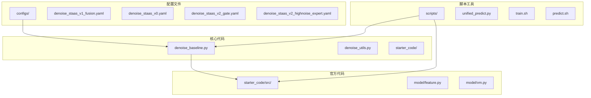
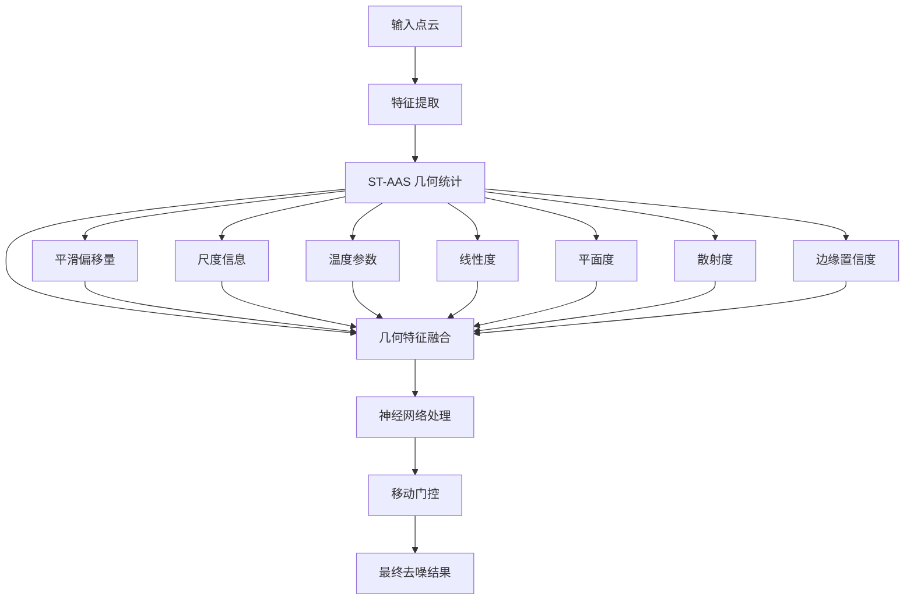
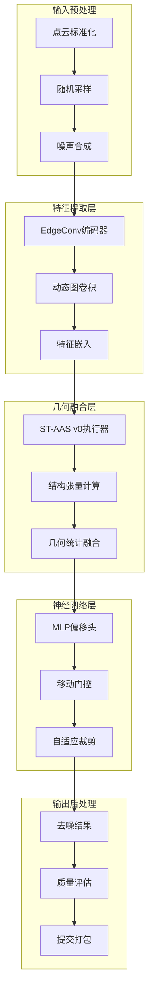
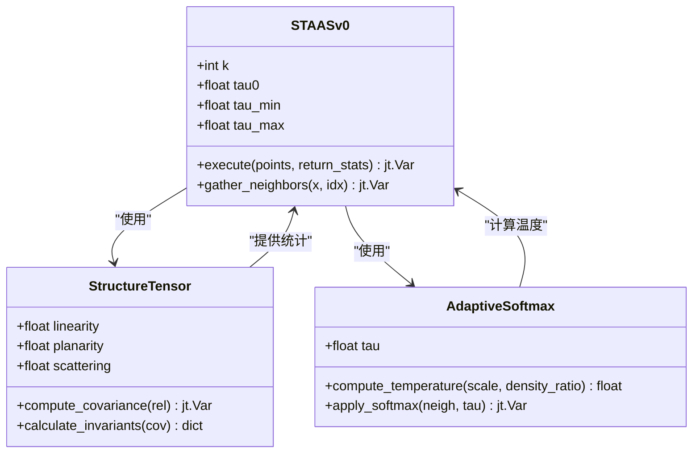
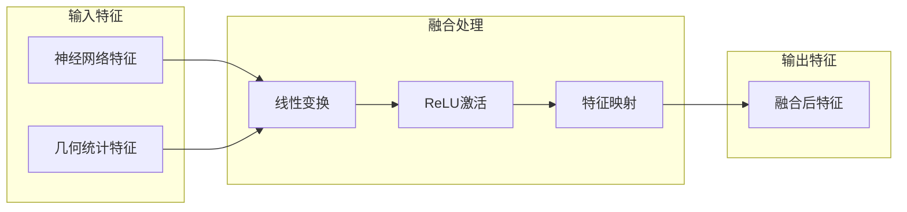
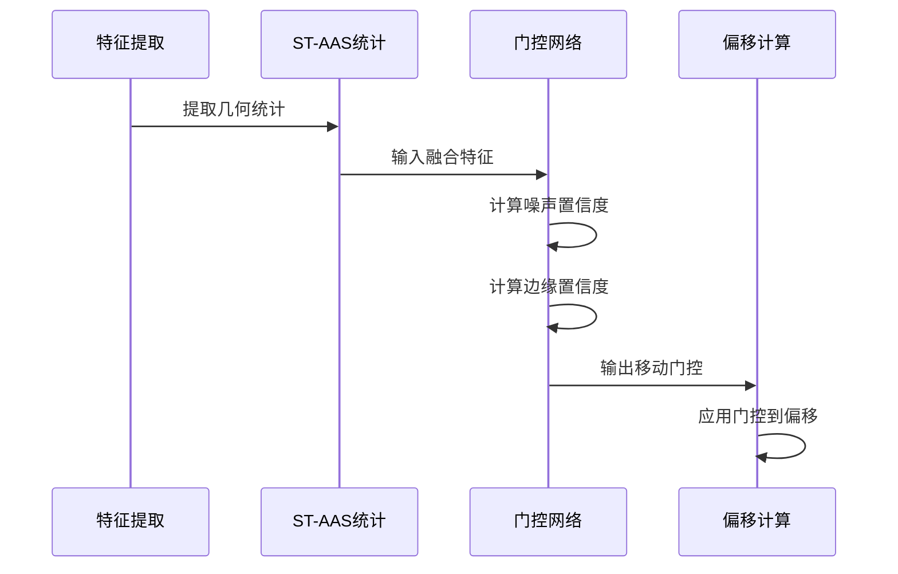
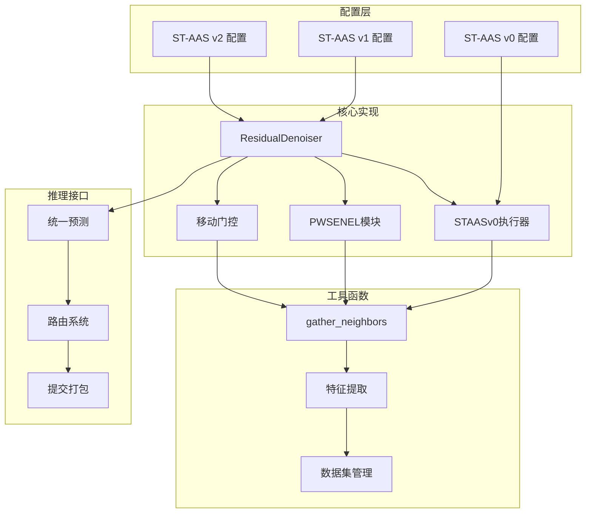

# ST-AAS v1 融合配置

<cite>
**本文档引用的文件**
- [configs/denoise_staas_v1_fusion.yaml](file://configs/denoise_staas_v1_fusion.yaml)
- [configs/denoise_staas_v0.yaml](file://configs/denoise_staas_v0.yaml)
- [configs/denoise_staas_v2_gate.yaml](file://configs/denoise_staas_v2_gate.yaml)
- [configs/denoise_staas_v2_highnoise_expert.yaml](file://configs/denoise_staas_v2_highnoise_expert.yaml)
- [denoise_baseline.py](file://denoise_baseline.py)
- [denoise_utils.py](file://denoise_utils.py)
- [scripts/unified_predict.py](file://scripts/unified_predict.py)
- [starter_code/src/model/feature.py](file://starter_code/src/model/feature.py)
- [starter_code/src/model/vm.py](file://starter_code/src/model/vm.py)
</cite>

## 目录
1. [简介](#简介)
2. [项目结构](#项目结构)
3. [核心组件](#核心组件)
4. [架构概览](#架构概览)
5. [详细组件分析](#详细组件分析)
6. [依赖关系分析](#依赖关系分析)
7. [性能考虑](#性能考虑)
8. [故障排除指南](#故障排除指南)
9. [结论](#结论)

## 简介

ST-AAS v1 融合配置是该项目中一个重要的技术里程碑，它代表了从传统的 ST-AAS v0 单一几何分支向更复杂的多模态融合架构的演进。该配置的核心目标是在保持轻量化设计的同时，通过结构张量统计信息与神经网络特征的深度融合，实现更精确的边缘感知去噪效果。

ST-AAS（Structure Tensor-guided Adaptive Softmax）是该项目提出的一种基于结构张量的自适应softmax方法，其核心思想是利用局部几何信息来指导去噪过程，同时保持计算效率和可解释性。

## 项目结构

该项目采用模块化的组织方式，主要包含以下关键目录：

**图表来源**
- [configs/denoise_staas_v1_fusion.yaml:1-52](file://configs/denoise_staas_v1_fusion.yaml#L1-L52)
- [denoise_baseline.py:1-100](file://denoise_baseline.py#L1-L100)
- [scripts/unified_predict.py:1-100](file://scripts/unified_predict.py#L1-L100)

**章节来源**
- [configs/denoise_staas_v1_fusion.yaml:1-52](file://configs/denoise_staas_v1_fusion.yaml#L1-L52)
- [README.md:52-77](file://README.md#L52-L77)

## 核心组件

### ST-AAS v1 融合配置详解

ST-AAS v1 融合配置在原有 ST-AAS v0 的基础上进行了重大改进，主要体现在以下几个方面：

#### 关键配置参数

| 参数名称 | 默认值 | 说明 |
|---------|--------|------|
| `staas_fusion` | true | 启用几何统计信息融合功能 |
| `staas` | false | 禁用传统的 ST-AAS 几何分支 |
| `staas_strength` | 0.0 | 设置几何分支强度为 0 |
| `move_gate` | true | 启用移动门控机制 |
| `k` | 24 | KNN 邻域大小增加到 24 |
| `feat_dim` | 256 | 特征维度设置为 256 |

#### 融合机制

ST-AAS v1 的创新在于将结构张量统计信息与神经网络特征进行深度融合：

**图表来源**
- [denoise_baseline.py:590-720](file://denoise_baseline.py#L590-L720)

**章节来源**
- [configs/denoise_staas_v1_fusion.yaml:30-52](file://configs/denoise_staas_v1_fusion.yaml#L30-L52)
- [denoise_baseline.py:471-721](file://denoise_baseline.py#L471-L721)

## 架构概览

ST-AAS v1 融合架构采用了多层次的处理流程，结合了传统几何方法和现代深度学习技术：

**图表来源**
- [denoise_baseline.py:92-150](file://denoise_baseline.py#L92-L150)
- [denoise_baseline.py:471-721](file://denoise_baseline.py#L471-L721)

## 详细组件分析

### ST-AAS v0 执行器

ST-AAS v0 执行器是整个架构的核心组件，负责计算结构张量统计信息并生成几何偏移量：

#### 结构张量计算

**图表来源**
- [denoise_baseline.py:372-469](file://denoise_baseline.py#L372-L469)

#### 统计特征提取

ST-AAS v0 计算多种几何统计特征：

| 统计特征 | 计算公式 | 用途 |
|---------|----------|------|
| 线性度 (linearity) | `off_energy/(diag_energy+off_energy)` | 检测线性结构 |
| 平面度 (planarity) | `area_energy/(trace²)` | 检测平面结构 |
| 散射度 (scattering) | `diag_min/(diag_max)` | 检测散乱点 |
| 边缘置信度 | `linearity*(1-scattering)` | 权衡边缘保护 |

**章节来源**
- [denoise_baseline.py:429-468](file://denoise_baseline.py#L429-L468)

### 几何融合模块

ST-AAS v1 的几何融合模块是其创新的核心，实现了结构张量统计信息与神经网络特征的深度融合：

#### 融合网络架构

**图表来源**
- [denoise_baseline.py:545-550](file://denoise_baseline.py#L545-L550)

#### 融合特征组成

几何融合模块接收以下输入特征：

1. **平滑偏移量** (`smooth_offset`)
2. **局部尺度** (`scale`)  
3. **自适应温度** (`tau`)
4. **线性度** (`linearity`)
5. **平面度** (`planarity`)
6. **散射度** (`scattering`)
7. **边缘置信度** (`edge_conf`)

**章节来源**
- [denoise_baseline.py:600-612](file://denoise_baseline.py#L600-L612)

### 移动门控机制

ST-AAS v1 集成了移动门控机制，用于控制去噪过程中的移动强度：

#### 门控计算流程

**图表来源**
- [denoise_baseline.py:664-690](file://denoise_baseline.py#L664-L690)

**章节来源**
- [denoise_baseline.py:645-720](file://denoise_baseline.py#L645-L720)

## 依赖关系分析

### 模块间依赖关系

**图表来源**
- [denoise_baseline.py:261-721](file://denoise_baseline.py#L261-L721)
- [scripts/unified_predict.py:83-120](file://scripts/unified_predict.py#L83-L120)

### 外部依赖

项目的主要外部依赖包括：

| 依赖项 | 版本要求 | 用途 |
|-------|----------|------|
| Jittor | >= 1.3.9 | 深度学习框架 |
| CUDA | 12.x | GPU 加速支持 |
| CuPy | >= 13,<14 | CUDA 数值计算 |
| NumPy | 任意 | 数值计算基础 |
| PyYAML | 任意 | 配置文件解析 |

**章节来源**
- [README.md:108-143](file://README.md#L108-L143)

## 性能考虑

### 计算复杂度分析

ST-AAS v1 融合配置在保持高效计算的同时，实现了更精确的去噪效果：

#### 时间复杂度
- **特征提取**: O(N × k × d)，其中 N 为点数，k 为邻域大小，d 为特征维度
- **几何统计**: O(N × k)
- **融合处理**: O(N × (feat_dim + 9))
- **整体复杂度**: O(N × k × (d + 1))

#### 内存使用优化
- **批量处理**: 支持批量推理以提高内存利用率
- **流式处理**: 大点云支持流式处理模式
- **特征缓存**: 关键特征的缓存机制减少重复计算

### 硬件要求

| 组件 | 最低要求 | 推荐配置 |
|------|----------|----------|
| 显存 | 8GB | 16GB+ |
| CPU | 4核 | 8核+ |
| 内存 | 16GB | 32GB+ |
| 存储 | 10GB可用空间 | 50GB+ |

## 故障排除指南

### 常见问题及解决方案

#### 训练相关问题

| 问题类型 | 症状 | 解决方案 |
|----------|------|----------|
| 训练不稳定 | 损失震荡或发散 | 检查学习率设置，调整批次大小 |
| 过拟合 | 训练损失低但验证损失高 | 增加正则化，使用早停策略 |
| 内存不足 | CUDA内存溢出 | 减小批次大小，优化模型参数 |

#### 推理相关问题

| 问题类型 | 症状 | 解决方案 |
|----------|------|----------|
| 推理速度慢 | 单样本推理时间过长 | 使用GPU加速，优化批处理大小 |
| 结果质量差 | 去噪效果不理想 | 调整配置参数，检查数据质量 |
| 内存泄漏 | 长时间运行后内存占用增加 | 检查资源释放，使用上下文管理器 |

#### 环境配置问题

| 问题类型 | 症状 | 解决方案 |
|----------|------|----------|
| 依赖安装失败 | pip安装报错 | 使用镜像源，检查Python版本兼容性 |
| CUDA环境问题 | Jittor无法初始化 | 检查CUDA版本匹配，重新安装驱动 |
| 权限问题 | 文件访问被拒绝 | 检查文件权限，使用sudo命令 |

**章节来源**
- [README.md:167-216](file://README.md#L167-L216)

## 结论

ST-AAS v1 融合配置代表了该项目在点云去噪领域的重要进展，通过将结构张量统计信息与神经网络特征进行深度融合，实现了更精确、更稳定的去噪效果。该配置的设计理念体现了以下优势：

1. **模块化设计**: 清晰的组件分离便于理解和维护
2. **可扩展性**: 支持多种配置组合和实验场景
3. **性能优化**: 在保持精度的同时优化了计算效率
4. **可解释性**: 结构张量提供了直观的几何意义

该配置为后续的 ST-AAS v2 高噪声专家模块奠定了坚实基础，并为整个项目的路由系统提供了重要的技术支撑。通过合理的参数配置和优化策略，ST-AAS v1 能够在各种噪声条件下提供高质量的去噪结果。