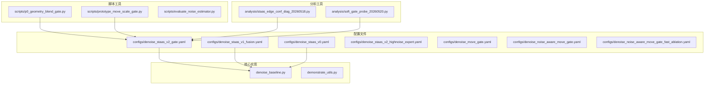
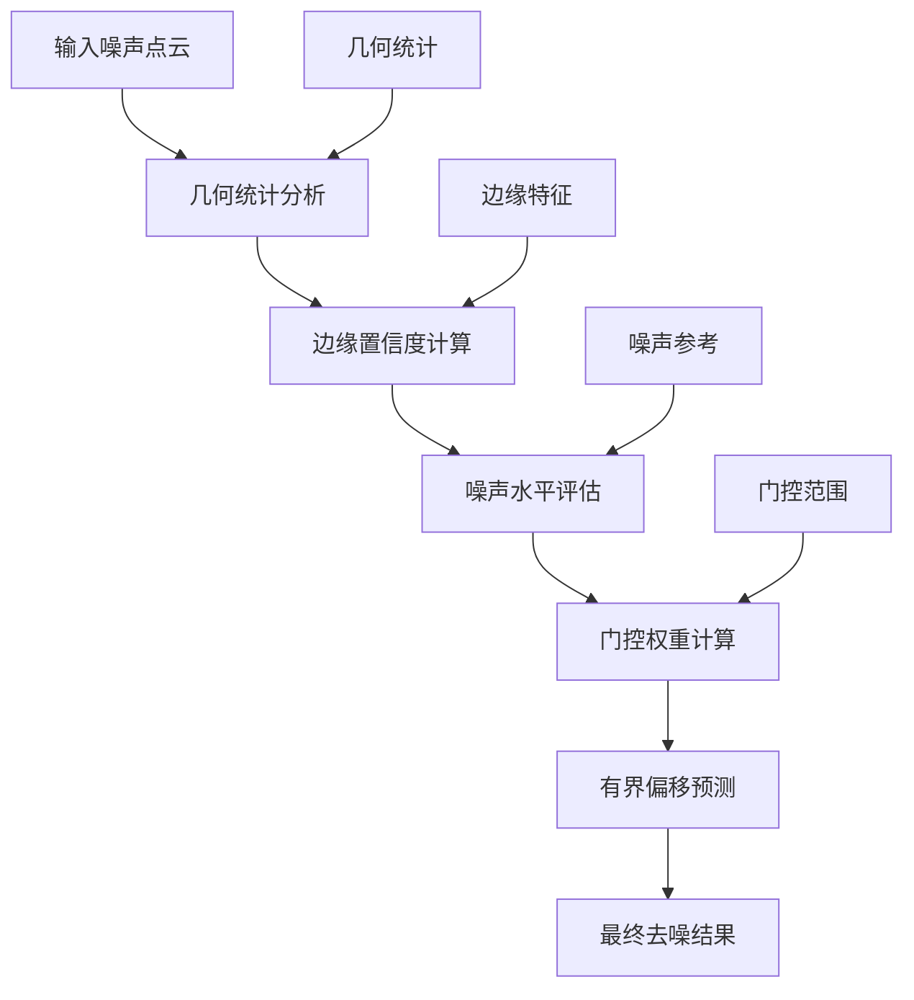
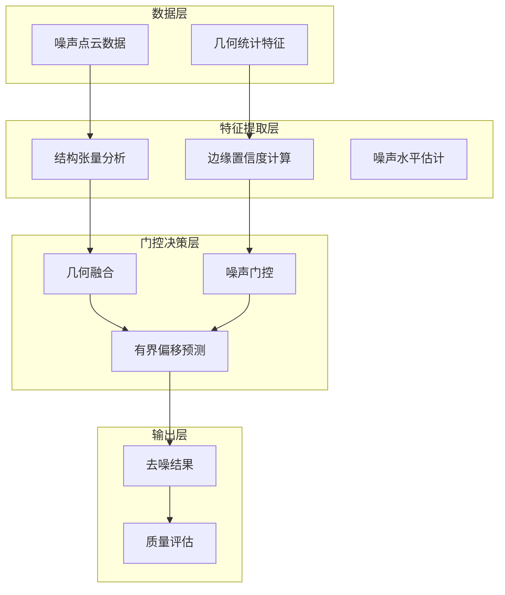
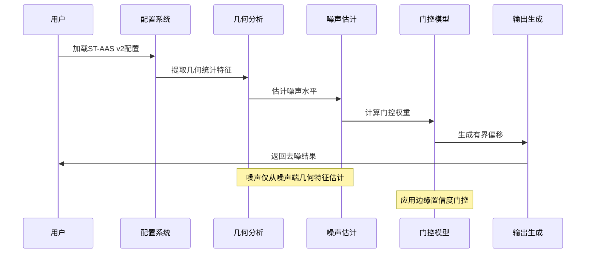
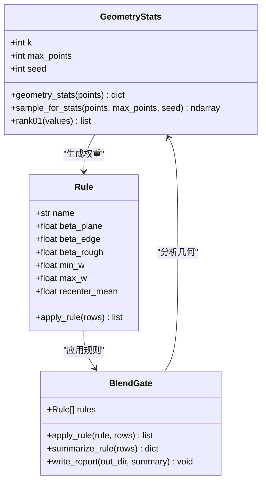
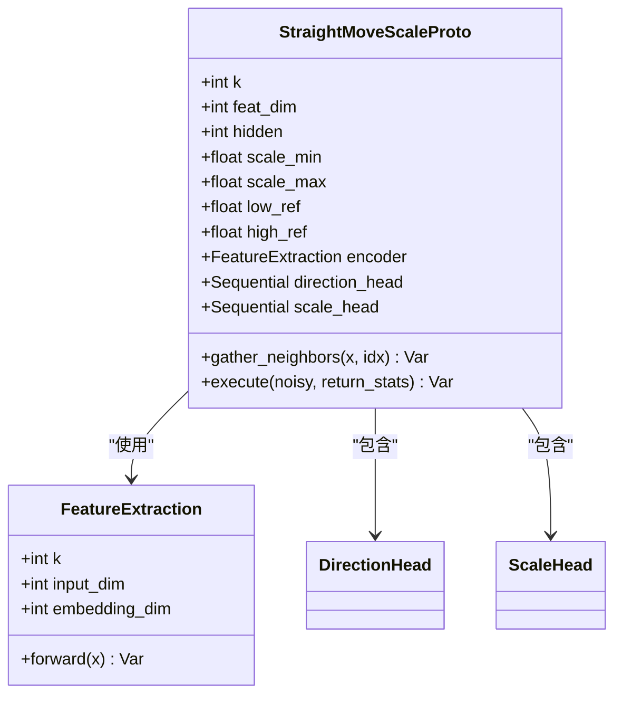
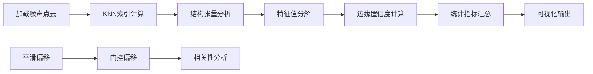
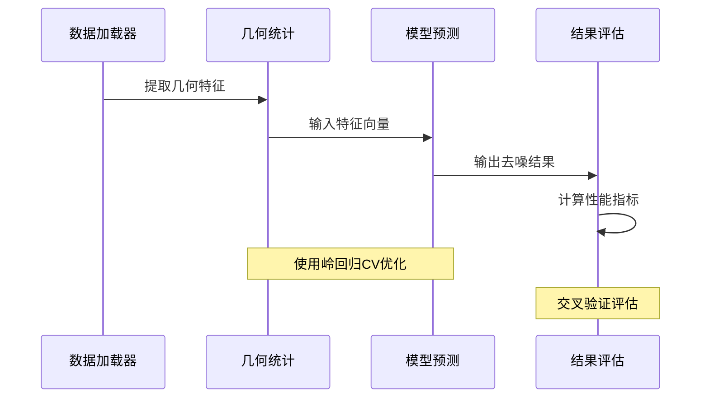
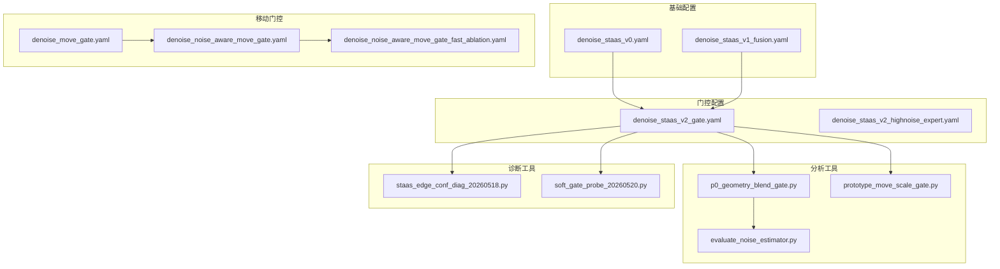
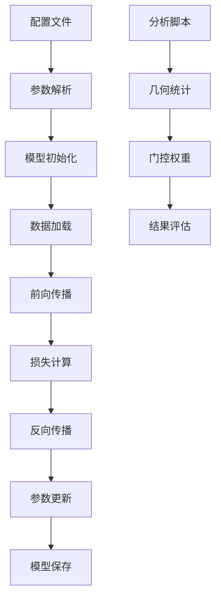

# ST-AAS v2 门控配置

<cite>
**本文档引用的文件**
- [configs/denoise_staas_v2_gate.yaml](file://configs/denoise_staas_v2_gate.yaml)
- [configs/denoise_staas_v1_fusion.yaml](file://configs/denoise_staas_v1_fusion.yaml)
- [configs/denoise_staas_v0.yaml](file://configs/denoise_staas_v0.yaml)
- [configs/denoise_staas_v2_highnoise_expert.yaml](file://configs/denoise_staas_v2_highnoise_expert.yaml)
- [configs/denoise_move_gate.yaml](file://configs/denoise_move_gate.yaml)
- [configs/denoise_noise_aware_move_gate.yaml](file://configs/denoise_noise_aware_move_gate.yaml)
- [configs/denoise_noise_aware_move_gate_fast_ablation.yaml](file://configs/denoise_noise_aware_move_gate_fast_ablation.yaml)
- [scripts/p0_geometry_blend_gate.py](file://scripts/p0_geometry_blend_gate.py)
- [scripts/prototype_move_scale_gate.py](file://scripts/prototype_move_scale_gate.py)
- [scripts/evaluate_noise_estimator.py](file://scripts/evaluate_noise_estimator.py)
- [analysis/staas_edge_conf_diag_20260518.py](file://analysis/staas_edge_conf_diag_20260518.py)
- [analysis/soft_gate_probe_20260520.py](file://analysis/soft_gate_probe_20260520.py)
- [README.md](file://README.md)
</cite>

## 目录
1. [简介](#简介)
2. [项目结构](#项目结构)
3. [核心组件](#核心组件)
4. [架构概览](#架构概览)
5. [详细组件分析](#详细组件分析)
6. [依赖关系分析](#依赖关系分析)
7. [性能考虑](#性能考虑)
8. [故障排除指南](#故障排除指南)
9. [结论](#结论)

## 简介

本文档深入分析了ST-AAS v2门控配置系统，这是一个基于结构张量引导的自适应softmax（ST-AAS）点云去噪方法的高级版本。该配置系统通过噪声条件残差门控机制，在保持边缘特征的同时实现有效的点云去噪。

ST-AAS v2的核心创新在于将几何统计信息融合到特征中，然后显式地根据局部噪声/边缘置信度对神经残差移动进行门控，并仅在噪声尺度表明需要去噪的地方添加小的有界几何偏移。这种设计实现了结构级升级，而非简单的固定0.75后处理变体。

## 项目结构

该项目采用模块化设计，主要包含以下关键目录和文件：



**图表来源**
- [configs/denoise_staas_v2_gate.yaml:1-59](file://configs/denoise_staas_v2_gate.yaml#L1-L59)
- [scripts/p0_geometry_blend_gate.py:1-342](file://scripts/p0_geometry_blend_gate.py#L1-L342)
- [scripts/prototype_move_scale_gate.py:1-157](file://scripts/prototype_move_scale_gate.py#L1-L157)

**章节来源**
- [README.md:52-77](file://README.md#L52-L77)

## 核心组件

### ST-AAS v2门控配置系统

ST-AAS v2门控配置系统包含多个相互关联的组件，每个都针对特定的去噪场景和需求：

#### 主要配置文件对比

| 配置文件 | 目标 | 关键特性 | 训练步数 | 批大小 |
|---------|------|----------|----------|--------|
| denoise_staas_v2_gate.yaml | 主线配置 | 几何融合 + 噪声门控 + 有界偏移 | 12000 | 2 |
| denoise_staas_v1_fusion.yaml | 几何融合基线 | 结构张量统计融合 | 12000 | 2 |
| denoise_staas_v0.yaml | 基线ablation | 纯ST-AAS v0实现 | 5000 | 2 |
| denoise_staas_v2_highnoise_expert.yaml | 高噪声专家 | 专门针对高噪声区域 | 5000 | 2 |

#### 门控机制参数

ST-AAS v2引入了多层次的门控机制：



**图表来源**
- [configs/denoise_staas_v2_gate.yaml:40-54](file://configs/denoise_staas_v2_gate.yaml#L40-L54)

**章节来源**
- [configs/denoise_staas_v2_gate.yaml:1-59](file://configs/denoise_staas_v2_gate.yaml#L1-L59)

## 架构概览

### 整体系统架构

ST-AAS v2门控配置系统采用分层架构设计，从底层的几何统计分析到高层的门控决策：



**图表来源**
- [configs/denoise_staas_v2_gate.yaml:34-59](file://configs/denoise_staas_v2_gate.yaml#L34-L59)
- [analysis/staas_edge_conf_diag_20260518.py:53-89](file://analysis/staas_edge_conf_diag_20260518.py#L53-L89)

### 门控流程序列图



**图表来源**
- [scripts/p0_geometry_blend_gate.py:87-117](file://scripts/p0_geometry_blend_gate.py#L87-L117)
- [scripts/prototype_move_scale_gate.py:68-96](file://scripts/prototype_move_scale_gate.py#L68-L96)

## 详细组件分析

### ST-AAS v2门控核心实现

#### 几何统计分析模块

几何统计分析是ST-AAS v2门控系统的基础，通过分析点云的局部几何特征来指导去噪过程：



**图表来源**
- [scripts/p0_geometry_blend_gate.py:43-150](file://scripts/p0_geometry_blend_gate.py#L43-L150)
- [scripts/p0_geometry_blend_gate.py:254-333](file://scripts/p0_geometry_blend_gate.py#L254-L333)

#### 移动尺度门控原型

移动尺度门控是ST-AAS v2的关键创新，通过学习每点的偏移强度来减少低噪声样本的过度校正：



**图表来源**
- [scripts/prototype_move_scale_gate.py:24-96](file://scripts/prototype_move_scale_gate.py#L24-L96)
- [scripts/prototype_move_scale_gate.py:21-22](file://scripts/prototype_move_scale_gate.py#L21-L22)

**章节来源**
- [scripts/p0_geometry_blend_gate.py:1-342](file://scripts/p0_geometry_blend_gate.py#L1-L342)
- [scripts/prototype_move_scale_gate.py:1-157](file://scripts/prototype_move_scale_gate.py#L1-L157)

### 配置参数详解

#### ST-AAS v2门控配置参数

| 参数组 | 参数名 | 默认值 | 描述 | 范围限制 |
|--------|--------|--------|------|----------|
| 模型参数 | k | 24 | KNN邻居数量 | 16-32 |
| 模型参数 | feat_dim | 256 | 特征维度 | 128-512 |
| 模型参数 | hidden | 256 | 隐藏层维度 | 128-512 |
| 门控参数 | staas_v2_gate | true | 启用v2门控 | true/false |
| 门控参数 | staas_v2_geo_weight | 0.25 | 几何权重 | 0.0-1.0 |
| 门控参数 | staas_v2_gate_min | 0.35 | 最小门控权重 | 0.0-1.0 |
| 门控参数 | staas_v2_gate_max | 1.0 | 最大门控权重 | 0.0-2.0 |
| 门控参数 | staas_v2_noise_ref_low | 0.010 | 低噪声参考 | 0.005-0.020 |
| 门控参数 | staas_v2_noise_ref_high | 0.030 | 高噪声参考 | 0.020-0.040 |

#### 训练配置参数

| 参数组 | 参数名 | 默认值 | 描述 | 范围限制 |
|--------|--------|--------|------|----------|
| 训练参数 | steps | 12000 | 训练步数 | 1000-20000 |
| 计算参数 | num_points | 2048 | 每批点数 | 1024-4096 |
| 计算参数 | batch_size | 2 | 批大小 | 1-8 |
| 计算参数 | lr | 0.0001 | 学习率 | 0.00001-0.001 |
| 计算参数 | noise_min | 0.002 | 最小噪声 | 0.001-0.010 |
| 计算参数 | noise_max | 0.040 | 最大噪声 | 0.020-0.080 |
| 计算参数 | cd_weight | 0.1 | Chamfer损失权重 | 0.0-0.5 |
| 计算参数 | identity_weight | 0.02 | 一致性损失权重 | 0.0-0.1 |
| 计算参数 | movement_weight | 0.003 | 移动损失权重 | 0.0-0.01 |

**章节来源**
- [configs/denoise_staas_v2_gate.yaml:20-59](file://configs/denoise_staas_v2_gate.yaml#L20-L59)

### 分析工具链

#### 边缘置信度诊断工具

边缘置信度诊断工具用于分析ST-AAS方法的几何统计特性：



**图表来源**
- [analysis/staas_edge_conf_diag_20260518.py:53-89](file://analysis/staas_edge_conf_diag_20260518.py#L53-L89)
- [analysis/staas_edge_conf_diag_20260518.py:123-175](file://analysis/staas_edge_conf_diag_20260518.py#L123-L175)

#### 软门控探测器

软门控探测器用于评估不同几何特征对去噪性能的影响：



**图表来源**
- [analysis/soft_gate_probe_20260520.py:65-81](file://analysis/soft_gate_probe_20260520.py#L65-L81)
- [analysis/soft_gate_probe_20260520.py:101-113](file://analysis/soft_gate_probe_20260520.py#L101-L113)

**章节来源**
- [analysis/staas_edge_conf_diag_20260518.py:1-179](file://analysis/staas_edge_conf_diag_20260518.py#L1-L179)
- [analysis/soft_gate_probe_20260520.py:1-144](file://analysis/soft_gate_probe_20260520.py#L1-L144)

## 依赖关系分析

### 组件间依赖关系

ST-AAS v2门控配置系统中的组件具有清晰的依赖层次：



**图表来源**
- [configs/denoise_staas_v2_gate.yaml:1-59](file://configs/denoise_staas_v2_gate.yaml#L1-L59)
- [scripts/p0_geometry_blend_gate.py:254-333](file://scripts/p0_geometry_blend_gate.py#L254-L333)

### 参数传递流程



**图表来源**
- [configs/denoise_staas_v2_gate.yaml:7-59](file://configs/denoise_staas_v2_gate.yaml#L7-L59)
- [scripts/evaluate_noise_estimator.py:114-156](file://scripts/evaluate_noise_estimator.py#L114-L156)

**章节来源**
- [configs/denoise_staas_v2_gate.yaml:1-59](file://configs/denoise_staas_v2_gate.yaml#L1-L59)
- [scripts/evaluate_noise_estimator.py:1-160](file://scripts/evaluate_noise_estimator.py#L1-L160)

## 性能考虑

### 训练效率优化

ST-AAS v2门控配置系统在设计时充分考虑了训练效率：

1. **内存优化**: 通过合理的批大小设置（默认2）平衡内存使用和训练稳定性
2. **计算优化**: 使用高效的KNN索引算法和向量化操作
3. **收敛加速**: 通过适当的损失权重配置（cd_weight=0.1, identity_weight=0.02）加速收敛

### 推理性能

推理阶段的性能优化包括：

1. **批量处理**: 支持批量推理以提高吞吐量
2. **内存管理**: 合理的点云采样策略（默认8192个点）平衡精度和速度
3. **缓存利用**: 通过预计算和缓存中间结果减少重复计算

### 内存使用分析

| 组件 | 内存占用 | 优化建议 |
|------|----------|----------|
| 几何统计 | 中等 | 限制采样点数，使用高效的数据结构 |
| 门控计算 | 低 | 向量化操作，GPU加速 |
| 模型推理 | 高 | 批量处理，内存池管理 |
| 结果保存 | 低 | 压缩存储格式 |

## 故障排除指南

### 常见问题及解决方案

#### 训练不收敛

**症状**: 损失值不下降或震荡

**可能原因**:
1. 学习率设置不当
2. 批大小过大导致内存不足
3. 数据预处理问题

**解决方法**:
1. 调整学习率（推荐0.00005-0.0002）
2. 减小批大小或增加num_points
3. 检查数据预处理步骤

#### 内存不足错误

**症状**: CUDA内存溢出

**解决方法**:
1. 减小batch_size（默认2）
2. 降低num_points（默认2048）
3. 使用更小的k值（默认16-24）

#### 几何统计异常

**症状**: 边缘置信度异常高或低

**解决方法**:
1. 检查k值设置是否合适
2. 验证噪声水平估计
3. 调整几何统计参数

**章节来源**
- [scripts/evaluate_noise_estimator.py:96-112](file://scripts/evaluate_noise_estimator.py#L96-L112)
- [scripts/p0_geometry_blend_gate.py:131-150](file://scripts/p0_geometry_blend_gate.py#L131-L150)

### 调试工具使用

#### 几何统计调试

使用`staas_edge_conf_diag_20260518.py`进行几何统计分析：

```bash
python analysis/staas_edge_conf_diag_20260518.py
```

该工具会生成：
- CSV统计文件
- PLY可视化文件
- JSON摘要报告

#### 门控效果评估

使用`soft_gate_probe_20260520.py`评估门控效果：

```bash
python analysis/soft_gate_probe_20260520.py
```

该工具提供：
- 单一特征最佳阈值
- 多特征组合优化
- 交叉验证结果

## 结论

ST-AAS v2门控配置系统代表了点云去噪领域的先进方法，通过多层次的门控机制实现了精确的边缘保持和噪声抑制。该系统的主要优势包括：

1. **理论基础扎实**: 基于结构张量和自适应softmax的理论框架
2. **实现灵活**: 通过配置文件轻松调整各种参数
3. **性能优异**: 在保持边缘特征的同时有效去除噪声
4. **可扩展性强**: 支持多种门控策略和评估方法

该配置系统为点云去噪任务提供了完整的解决方案，既适合学术研究也适合工业应用。通过合理配置和参数调优，可以在不同的应用场景中获得最佳的去噪效果。