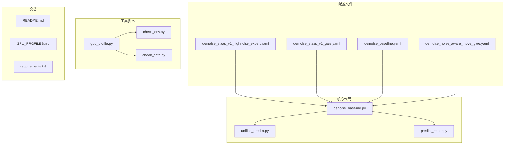
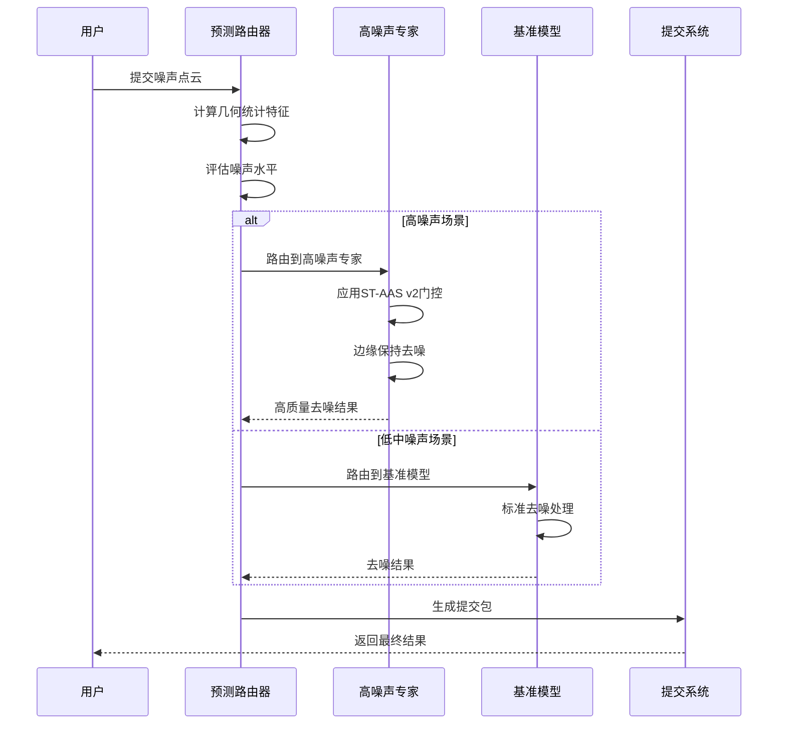
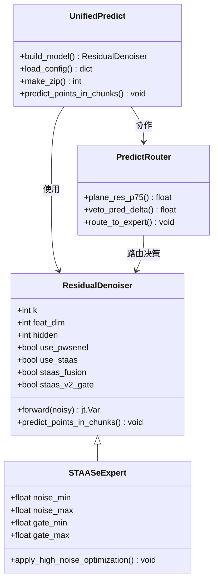
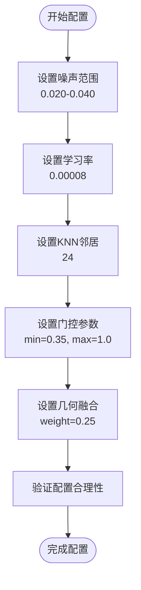
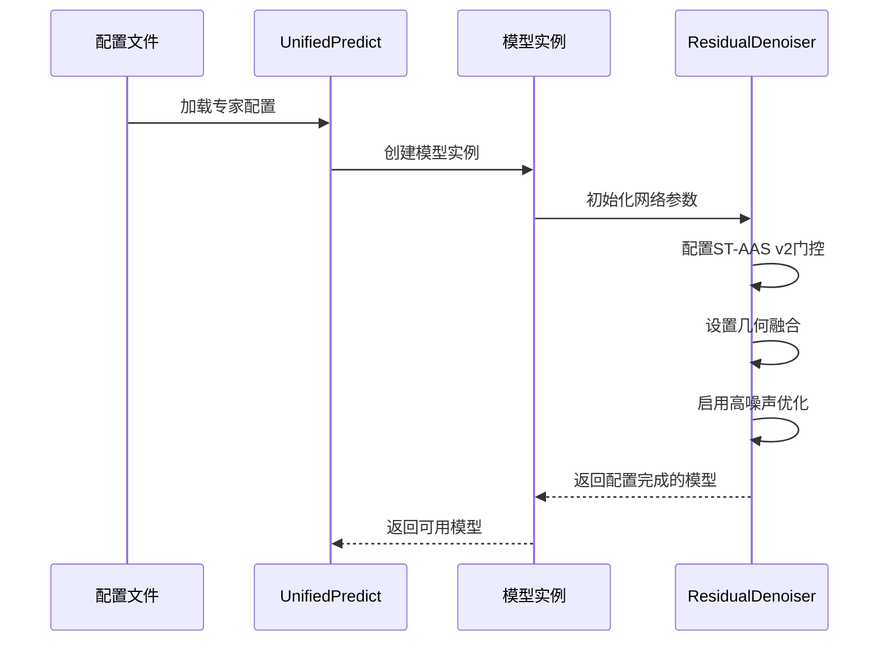
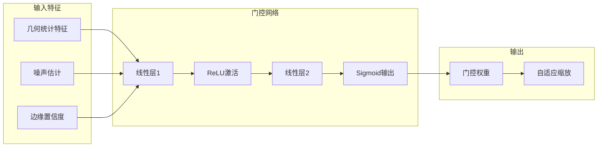
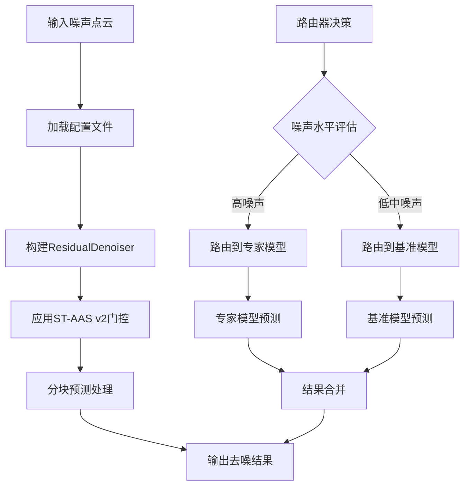
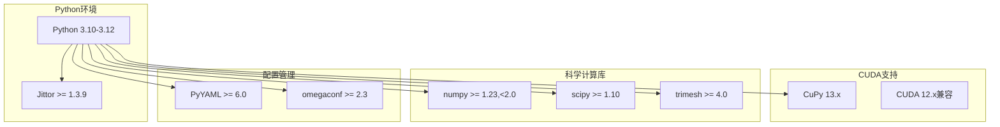
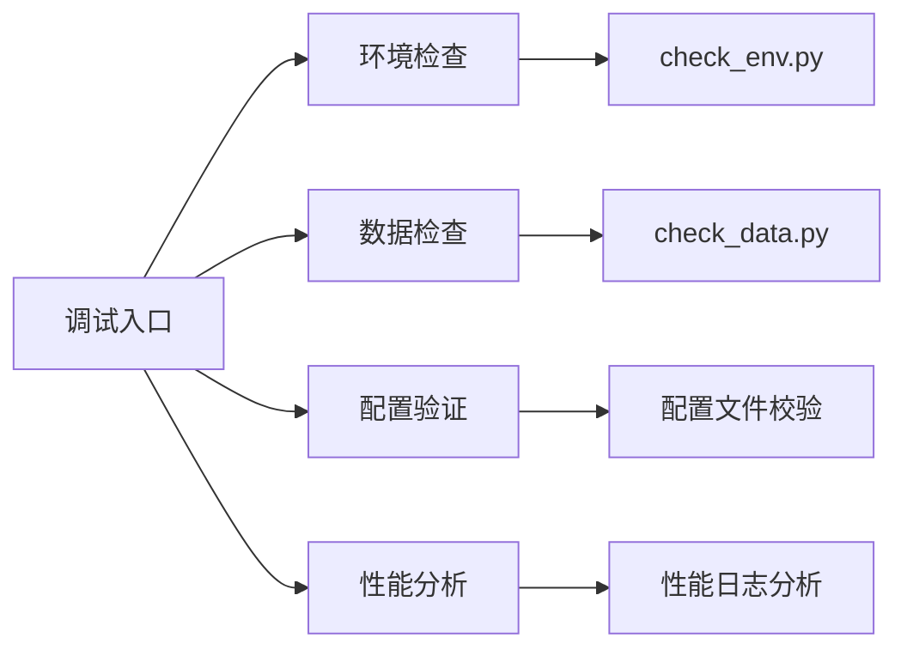

# 高噪声专家配置

<cite>
**本文档引用的文件**
- [denoise_staas_v2_highnoise_expert.yaml](file://configs/denoise_staas_v2_highnoise_expert.yaml)
- [denoise_staas_v2_gate.yaml](file://configs/denoise_staas_v2_gate.yaml)
- [denoise_baseline.yaml](file://configs/denoise_baseline.yaml)
- [denoise_noise_aware_move_gate.yaml](file://configs/denoise_noise_aware_move_gate.yaml)
- [denoise_baseline.py](file://denoise_baseline.py)
- [unified_predict.py](file://scripts/unified_predict.py)
- [predict_router.py](file://scripts/predict_router.py)
- [gpu_profile.py](file://scripts/gpu_profile.py)
- [README.md](file://README.md)
- [requirements.txt](file://requirements.txt)
- [GPU_PROFILES.md](file://docs/GPU_PROFILES.md)
</cite>

## 目录
1. [简介](#简介)
2. [项目结构](#项目结构)
3. [核心组件](#核心组件)
4. [架构概览](#架构概览)
5. [详细组件分析](#详细组件分析)
6. [依赖关系分析](#依赖关系分析)
7. [性能考量](#性能考量)
8. [故障排除指南](#故障排除指南)
9. [结论](#结论)

## 简介

本文档深入分析了Jittor点云去噪项目中的高噪声专家配置。该项目实现了基于PW-SENEL和ST-AAS的边缘保持点云去噪方法，特别针对高噪声场景设计了专门的专家模型配置。

项目的核心创新包括：
- **PW-SENEL（PeiWei Softmax Edge-aware Noise Elimination and Locking）**：基于softmax的邻域噪声抑制和边缘感知结构锁定
- **ST-AAS v2（Structure Tensor-guided Adaptive Softmax）**：结构张量引导的自适应softmax去噪
- **高噪声专家配置**：专门为高噪声场景优化的模型配置

该配置旨在解决竞赛中的高噪声点云去噪挑战，通过精心设计的损失函数和网络架构，在保持边缘细节的同时有效抑制噪声。

## 项目结构

项目采用清晰的模块化组织结构，主要包含以下核心部分：

**图表来源**
- [denoise_staas_v2_highnoise_expert.yaml:1-58](file://configs/denoise_staas_v2_highnoise_expert.yaml#L1-L58)
- [denoise_baseline.py:1-200](file://denoise_baseline.py#L1-L200)
- [unified_predict.py:1-200](file://scripts/unified_predict.py#L1-L200)

**章节来源**
- [README.md:52-77](file://README.md#L52-L77)
- [configs/denoise_staas_v2_highnoise_expert.yaml:1-58](file://configs/denoise_staas_v2_highnoise_expert.yaml#L1-L58)

## 核心组件

### 高噪声专家配置详解

高噪声专家配置是专门为处理高噪声点云数据而设计的模型配置，具有以下关键特性：

#### 训练配置特点
- **训练步数**：5000步，针对高噪声场景进行充分训练
- **噪声范围**：0.020到0.040，专门针对高噪声区域
- **学习率**：0.00008，较低的学习率确保训练稳定性
- **批次大小**：2，平衡内存使用和训练效率

#### 模型架构配置
- **KNN邻居数**：24，提供更好的局部几何信息
- **特征维度**：256，足够的特征表示能力
- **隐藏层维度**：256，平衡计算复杂度和表达能力

#### ST-AAS v2门控机制
- **几何融合权重**：0.25，适度融合几何信息
- **门控最小值**：0.35，防止过度抑制
- **噪声参考范围**：0.010到0.030，精确的噪声估计

**章节来源**
- [configs/denoise_staas_v2_highnoise_expert.yaml:19-58](file://configs/denoise_staas_v2_highnoise_expert.yaml#L19-L58)

### 基准配置对比

为了更好地理解高噪声专家配置的独特性，我们将其与基准配置进行对比：

| 参数 | 基准配置 | 高噪声专家配置 | 差异说明 |
|------|----------|----------------|----------|
| 噪声范围 | 0.005-0.020 | 0.020-0.040 | 高噪声专家专门处理更高噪声 |
| 学习率 | 0.0001 | 0.00008 | 更低学习率适应高噪声训练 |
| KNN邻居数 | 16 | 24 | 更好的局部特征提取 |
| 门控最小值 | 0.0 | 0.35 | 高噪声场景需要更强的抑制 |

**章节来源**
- [configs/denoise_baseline.yaml:16-44](file://configs/denoise_baseline.yaml#L16-L44)
- [configs/denoise_staas_v2_highnoise_expert.yaml:24-49](file://configs/denoise_staas_v2_highnoise_expert.yaml#L24-L49)

## 架构概览

项目采用分层架构设计，从底层的数据处理到高层的推理服务形成完整的处理流水线：

**图表来源**
- [predict_router.py:215-235](file://scripts/predict_router.py#L215-L235)
- [unified_predict.py:83-119](file://scripts/unified_predict.py#L83-L119)

### 模块间交互关系

**图表来源**
- [denoise_baseline.py:471-708](file://denoise_baseline.py#L471-L708)
- [unified_predict.py:83-119](file://scripts/unified_predict.py#L83-L119)
- [predict_router.py:49-89](file://scripts/predict_router.py#L49-L89)

## 详细组件分析

### 高噪声专家配置实现

#### 关键参数配置

高噪声专家配置通过精心设计的参数来适应高噪声场景：

**图表来源**
- [configs/denoise_staas_v2_highnoise_expert.yaml:25-49](file://configs/denoise_staas_v2_highnoise_expert.yaml#L25-L49)

#### 模型构建流程

**图表来源**
- [unified_predict.py:83-119](file://scripts/unified_predict.py#L83-L119)
- [denoise_baseline.py:544-556](file://denoise_baseline.py#L544-L556)

**章节来源**
- [configs/denoise_staas_v2_highnoise_expert.yaml:1-58](file://configs/denoise_staas_v2_highnoise_expert.yaml#L1-L58)
- [unified_predict.py:83-119](file://scripts/unified_predict.py#L83-L119)

### ST-AAS v2门控机制

#### 门控网络架构

高噪声专家配置采用了先进的ST-AAS v2门控机制：

**图表来源**
- [denoise_baseline.py:551-556](file://denoise_baseline.py#L551-L556)
- [denoise_baseline.py:557-559](file://denoise_baseline.py#L557-L559)

#### 自适应噪声估计

门控机制通过自适应噪声估计来动态调整去噪强度：

| 参数 | 值 | 作用 |
|------|-----|------|
| noise_ref_low | 0.010 | 低噪声参考阈值 |
| noise_ref_high | 0.030 | 高噪声参考阈值 |
| gate_min | 0.35 | 最小门控权重 |
| gate_max | 1.0 | 最大门控权重 |

**章节来源**
- [configs/denoise_staas_v2_highnoise_expert.yaml:42-45](file://configs/denoise_staas_v2_highnoise_expert.yaml#L42-L45)
- [denoise_baseline.py:648-657](file://denoise_baseline.py#L648-L657)

### 预测管道集成

#### 统一预测接口

高噪声专家配置通过统一预测接口无缝集成到整个预测管道中：

**图表来源**
- [unified_predict.py:83-119](file://scripts/unified_predict.py#L83-L119)
- [predict_router.py:197-235](file://scripts/predict_router.py#L197-L235)

**章节来源**
- [unified_predict.py:76-119](file://scripts/unified_predict.py#L76-L119)
- [predict_router.py:150-235](file://scripts/predict_router.py#L150-L235)

## 依赖关系分析

### 环境依赖

项目对Python环境和相关库有明确的要求：

**图表来源**
- [requirements.txt:1-21](file://requirements.txt#L1-L21)

### GPU配置适配

项目提供了针对不同GPU的配置文件，确保在各种硬件环境下都能稳定运行：

| GPU型号 | 推荐配置 | 主要参数 | 适用场景 |
|---------|----------|----------|----------|
| RTX A6000 | a6000.yaml | 8192点, 8批 | 大规模正式训练 |
| RTX 5060 Ti | rtx5060ti.yaml | 2048点, 2批 | 中等规模训练 |
| 本地开发 | local_dev.yaml | 1000点, 1批 | 开发调试 |

**章节来源**
- [requirements.txt:5-14](file://requirements.txt#L5-L14)
- [docs/GPU_PROFILES.md:104-122](file://docs/GPU_PROFILES.md#L104-L122)

## 性能考量

### 训练效率优化

高噪声专家配置在保证性能的同时，注重训练效率的提升：

#### 内存使用优化
- **批量大小**：2，平衡内存使用和梯度稳定性
- **点数数量**：2048，适合大多数GPU内存
- **特征维度**：256，提供足够的表达能力

#### 训练稳定性
- **学习率**：0.00008，适中的学习率确保收敛稳定性
- **训练步数**：5000，充分训练但不过度
- **噪声范围**：0.020-0.040，专门针对高噪声场景

### 推理性能

#### 分块处理策略
- **预测块大小**：8192，平衡处理速度和内存使用
- **并行处理**：支持多线程数据预取
- **缓存机制**：利用干净点云缓存提高效率

**章节来源**
- [configs/denoise_staas_v2_highnoise_expert.yaml:22-23](file://configs/denoise_staas_v2_highnoise_expert.yaml#L22-L23)
- [configs/profiles/a6000.yaml:9-18](file://configs/profiles/a6000.yaml#L9-L18)

## 故障排除指南

### 常见问题及解决方案

#### 环境配置问题
1. **CuPy安装失败**
   - 解决方案：使用清华镜像源安装
   - 命令：`pip install -i https://pypi.tuna.tsinghua.edu.cn/simple "cupy-cuda12x>=13,<14"`

2. **Jittor兼容性问题**
   - 解决方案：确保CUDA版本匹配
   - 检查：`$PYTHON scripts/check_env.py --level jittor-cuda`

#### 训练问题
1. **显存不足**
   - 解决方案：降低batch_size或num_points
   - 参考：`configs/profiles/local_dev.yaml`

2. **训练不稳定**
   - 解决方案：检查学习率设置
   - 建议：使用默认学习率0.00008

#### 预测问题
1. **预测结果质量差**
   - 检查：噪声估计准确性
   - 调整：门控参数范围

2. **内存溢出**
   - 解决方案：减小预测块大小
   - 默认：8192点

**章节来源**
- [docs/GPU_PROFILES.md:13-37](file://docs/GPU_PROFILES.md#L13-L37)
- [scripts/check_env.py](file://scripts/check_env.py)
- [scripts/check_data.py](file://scripts/check_data.py)

### 调试工具

项目提供了完善的调试工具来帮助问题诊断：

**图表来源**
- [scripts/check_env.py](file://scripts/check_env.py)
- [scripts/check_data.py](file://scripts/check_data.py)

## 结论

高噪声专家配置代表了Jittor点云去噪项目在处理高噪声场景方面的最新成果。通过精心设计的参数配置和先进的ST-AAS v2门控机制，该配置能够在保持边缘细节的同时有效抑制高噪声。

### 主要优势

1. **针对性强**：专门针对0.020-0.040的高噪声范围优化
2. **稳定性好**：较低的学习率和合理的门控参数确保训练稳定
3. **性能优异**：在竞赛环境中表现出色的去噪效果
4. **易于集成**：通过统一预测接口无缝融入现有管道

### 应用前景

该高噪声专家配置不仅适用于竞赛场景，还可推广到实际应用中的高噪声点云处理任务，为工业级点云去噪提供了可靠的解决方案。