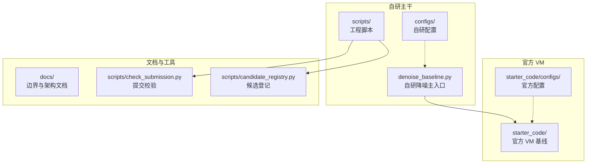
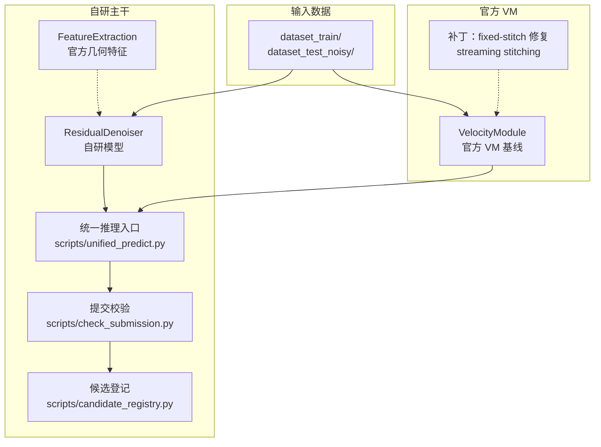
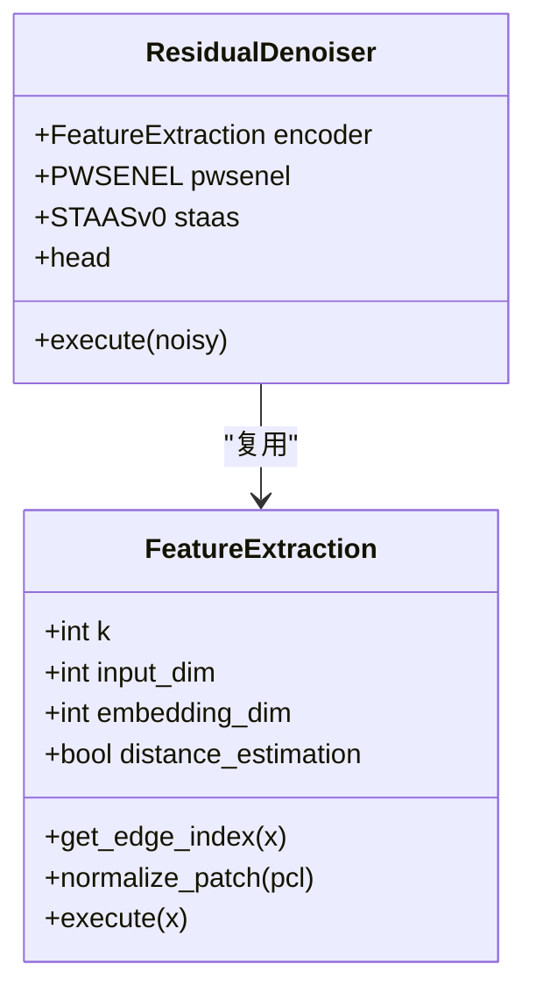
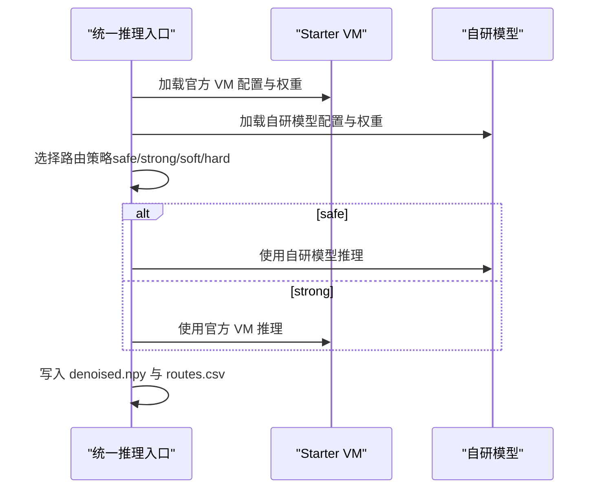
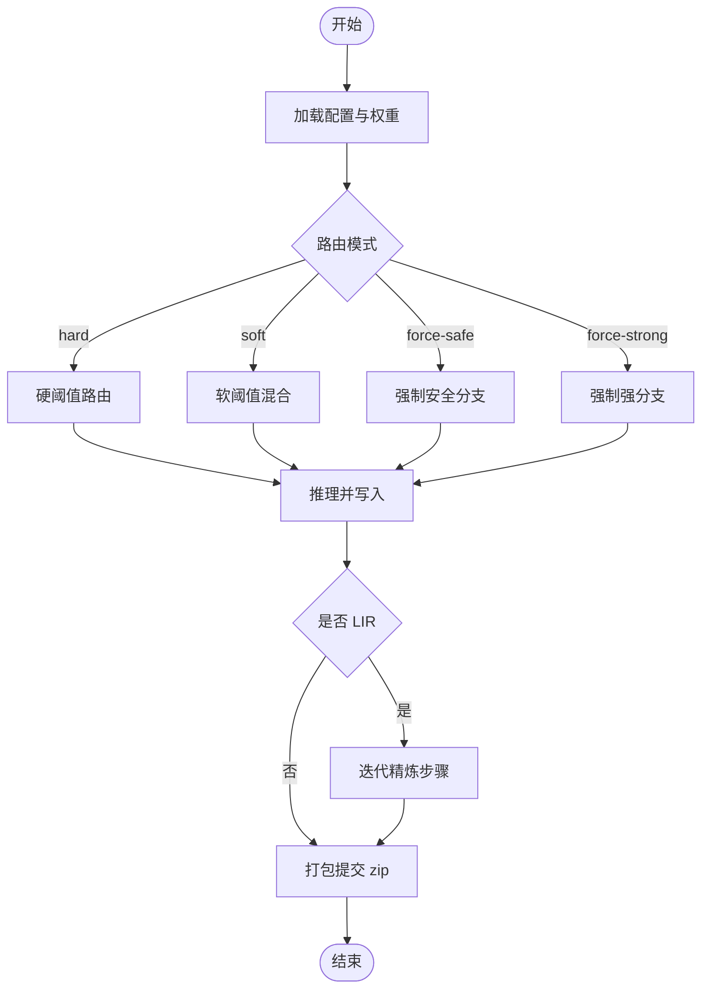
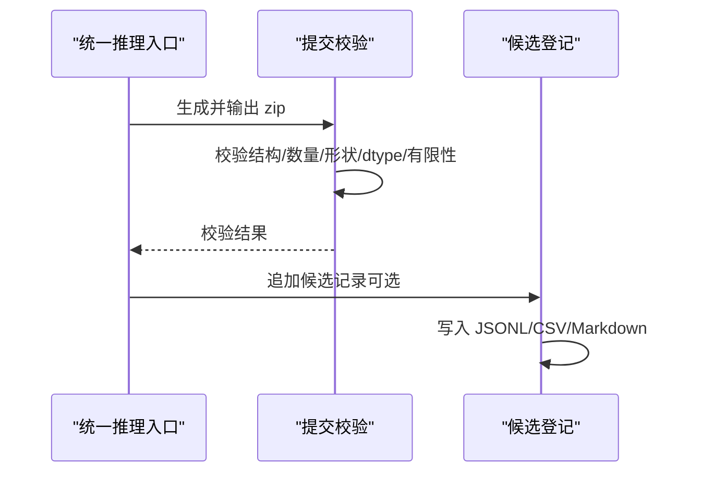
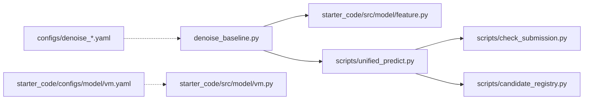

# 系统集成边界

<cite>
**本文档引用的文件**
- [README.md](file://README.md)
- [PROJECT_ARCHITECTURE_CN.md](file://docs/PROJECT_ARCHITECTURE_CN.md)
- [repo_boundary_audit_20260519.md](file://docs/repo_boundary_audit_20260519.md)
- [denoise_baseline.py](file://denoise_baseline.py)
- [starter_code/src/model/feature.py](file://starter_code/src/model/feature.py)
- [starter_code/src/model/vm.py](file://starter_code/src/model/vm.py)
- [scripts/unified_predict.py](file://scripts/unified_predict.py)
- [scripts/check_submission.py](file://scripts/check_submission.py)
- [scripts/candidate_registry.py](file://scripts/candidate_registry.py)
- [configs/denoise_baseline.yaml](file://configs/denoise_baseline.yaml)
- [configs/denoise_pwsenel.yaml](file://configs/denoise_pwsenel.yaml)
- [configs/denoise_staas_v0.yaml](file://configs/denoise_staas_v0.yaml)
- [starter_code/configs/model/vm.yaml](file://starter_code/configs/model/vm.yaml)
- [starter_code/configs/system/vm.yaml](file://starter_code/configs/system/vm.yaml)
- [starter_code/README.md](file://starter_code/README.md)
</cite>

## 目录
1. [简介](#简介)
2. [项目结构](#项目结构)
3. [核心组件](#核心组件)
4. [架构总览](#架构总览)
5. [详细组件分析](#详细组件分析)
6. [依赖分析](#依赖分析)
7. [性能考量](#性能考量)
8. [故障排查指南](#故障排查指南)
9. [结论](#结论)
10. [附录](#附录)

## 简介
本项目为 Jittor 点云去噪竞赛的系统集成边界文档，聚焦于官方 starter_code 与自研竞赛代码的分离策略与边界定义，涵盖模块导入机制、路径管理、接口约束、FeatureExtraction 复用原则、VM 集成方案与官方流程兼容性保障。文档还阐述系统边界设计哲学、技术债务控制与未来扩展考虑，给出集成测试策略、版本兼容性管理与迁移路径规划，并提供集成架构图、边界检查工具与故障排查指南。

## 项目结构
仓库采用“自研主干 + 官方 VM 基线 + 文档与脚本”的分层组织方式：
- 自研主干：`denoise_baseline.py` 及其配置、脚本，负责 baseline、ablation 与候选生成。
- 官方 VM：`starter_code/`，包含 VM 基线模型与官方流程封装，含已记录的补丁。
- 文档与脚本：`docs/`、`scripts/`，提供边界审计、候选登记、提交校验、环境检查等工具。
- 配置：`configs/` 与 `starter_code/configs/`，分别管理自研与官方 VM 的实验配置。

**图表来源**
- [PROJECT_ARCHITECTURE_CN.md:41-56](file://docs/PROJECT_ARCHITECTURE_CN.md#L41-L56)
- [README.md:52-76](file://README.md#L52-L76)

**章节来源**
- [README.md:52-76](file://README.md#L52-L76)
- [PROJECT_ARCHITECTURE_CN.md:41-56](file://docs/PROJECT_ARCHITECTURE_CN.md#L41-L56)

## 核心组件
- 自研 ResidualDenoiser 与 FeatureExtraction 复用：自研主干在模块导入阶段动态插入官方 starter_code 路径，复用官方 FeatureExtraction 与 KNN 工具，保持自研与官方的边界清晰。
- 官方 VM VelocityModule：提供官方 VM 基线与补丁（fixed-stitch coverage repair、streaming stitching），作为稳定 baseline/reference。
- 统一推理入口：`scripts/unified_predict.py` 提供 noisy-only 路由、LIR/gated-LIR、打包与候选登记一体化入口。
- 提交校验与候选登记：`scripts/check_submission.py` 与 `scripts/candidate_registry.py` 确保提交包结构、内容与事实来源一致性。
- 配置体系：自研与官方 VM 配置分离，支持 profile 覆盖与 CLI 参数合并。

**章节来源**
- [denoise_baseline.py:47-56](file://denoise_baseline.py#L47-L56)
- [starter_code/src/model/feature.py:65-139](file://starter_code/src/model/feature.py#L65-L139)
- [starter_code/src/model/vm.py:18-44](file://starter_code/src/model/vm.py#L18-L44)
- [scripts/unified_predict.py:1-10](file://scripts/unified_predict.py#L1-L10)
- [scripts/check_submission.py:1-11](file://scripts/check_submission.py#L1-L11)
- [scripts/candidate_registry.py:1-12](file://scripts/candidate_registry.py#L1-L12)

## 架构总览
系统边界设计遵循“自研主干与官方 VM 分离、统一入口与校验、可插拔模块与路由”的原则。自研主干通过 FeatureExtraction 复用官方几何特征模块，同时在推理阶段引入统一入口与路由策略，最终通过提交校验与候选登记形成闭环。

**图表来源**
- [PROJECT_ARCHITECTURE_CN.md:425-477](file://docs/PROJECT_ARCHITECTURE_CN.md#L425-L477)
- [denoise_baseline.py:480-732](file://denoise_baseline.py#L480-L732)
- [starter_code/src/model/vm.py:18-139](file://starter_code/src/model/vm.py#L18-L139)
- [scripts/unified_predict.py:412-602](file://scripts/unified_predict.py#L412-L602)
- [scripts/check_submission.py:68-156](file://scripts/check_submission.py#L68-L156)
- [scripts/candidate_registry.py:230-302](file://scripts/candidate_registry.py#L230-L302)

## 详细组件分析

### 组件A：FeatureExtraction 复用与边界
- 复用原则：自研主干在模块导入时动态插入官方 starter_code 路径，直接复用官方 FeatureExtraction 与 KNN 工具，避免重复实现与不一致。
- 边界定义：自研主干仅使用 FeatureExtraction 的几何特征提取能力，不改动官方 baseline 实现；自研模块（如 PW-SENEL、ST-AAS）以开关形式挂载在主干路径上，便于 ablation 与回退。
- 接口约束：FeatureExtraction 的输入为点云坐标，输出为嵌入特征；KNN 工具提供邻域索引，二者作为几何前置模块，不依赖 Jittor 导入时机。

**图表来源**
- [starter_code/src/model/feature.py:65-139](file://starter_code/src/model/feature.py#L65-L139)
- [denoise_baseline.py:520-580](file://denoise_baseline.py#L520-L580)

**章节来源**
- [denoise_baseline.py:47-56](file://denoise_baseline.py#L47-L56)
- [starter_code/src/model/feature.py:65-139](file://starter_code/src/model/feature.py#L65-L139)
- [PROJECT_ARCHITECTURE_CN.md:425-457](file://docs/PROJECT_ARCHITECTURE_CN.md#L425-L457)

### 组件B：VM 集成与官方流程兼容
- VM 集成方案：官方 VM VelocityModule 作为稳定 baseline/reference，提供 fixed-stitch 与 streaming stitching 两种拼接策略，并内置 coverage repair 以保证点数一一对应。
- 官方流程兼容：VM 的训练/预测系统与官方 starter_code 保持一致，通过配置文件指定模型与系统组件；VM 的补丁在文档中明确记录，避免与官方 untouched baseline 混淆。
- 路由与对比：统一推理入口可同时加载自研与官方 VM 模型，进行路由对比与混合策略验证。

**图表来源**
- [starter_code/src/model/vm.py:109-158](file://starter_code/src/model/vm.py#L109-L158)
- [scripts/unified_predict.py:502-514](file://scripts/unified_predict.py#L502-L514)

**章节来源**
- [starter_code/src/model/vm.py:18-139](file://starter_code/src/model/vm.py#L18-L139)
- [starter_code/configs/model/vm.yaml:1-6](file://starter_code/configs/model/vm.yaml#L1-L6)
- [starter_code/configs/system/vm.yaml:1-4](file://starter_code/configs/system/vm.yaml#L1-L4)
- [scripts/unified_predict.py:412-602](file://scripts/unified_predict.py#L412-L602)

### 组件C：统一推理与路由策略
- 路由策略：提供 hard/soft/force-safe/force-strong 四种模式；soft 模式采用 sigmoid 软阈值混合；force-* 模式用于错路压力测试。
- LIR 与 gated-LIR：在低噪声样本使用安全模型，在高噪声样本使用轻量迭代精炼（LIR）策略，兼顾稳定性与细节恢复。
- 输出与日志：每个样本独立写 denoised.npy 与 routes.csv，便于中断恢复与问题定位。

**图表来源**
- [scripts/unified_predict.py:412-602](file://scripts/unified_predict.py#L412-L602)

**章节来源**
- [scripts/unified_predict.py:1-606](file://scripts/unified_predict.py#L1-L606)

### 组件D：提交校验与候选登记
- 提交校验：严格检查 zip 结构、文件数量、形状、dtype、有限性，并可选与 test_root 对齐校验，确保提交包符合官方要求。
- 候选登记：记录候选的配置、权重、提交包、路由参数与评估结果，形成可追溯的事实来源；支持从 JSONL 重建 CSV/Markdown。

**图表来源**
- [scripts/check_submission.py:68-156](file://scripts/check_submission.py#L68-L156)
- [scripts/candidate_registry.py:198-227](file://scripts/candidate_registry.py#L198-L227)

**章节来源**
- [scripts/check_submission.py:1-192](file://scripts/check_submission.py#L1-L192)
- [scripts/candidate_registry.py:1-365](file://scripts/candidate_registry.py#L1-L365)

## 依赖分析
- 模块导入边界：自研主干通过 sys.path 插入 starter_code 路径，仅在需要时导入 Jittor 与官方 FeatureExtraction，避免纯 Python 工具初始化 CUDA。
- 配置合并：自研与官方均采用 base config + profile 覆盖 + CLI 参数的合并策略，确保可复现性与灵活性。
- 脚本职责分离：环境检查、数据检查、训练、预测、提交校验、候选登记各司其职，通过统一入口串联。

**图表来源**
- [denoise_baseline.py:47-56](file://denoise_baseline.py#L47-L56)
- [starter_code/src/model/feature.py:1-196](file://starter_code/src/model/feature.py#L1-L196)
- [scripts/unified_predict.py:26-43](file://scripts/unified_predict.py#L26-L43)
- [scripts/check_submission.py:25-52](file://scripts/check_submission.py#L25-L52)
- [scripts/candidate_registry.py:30-34](file://scripts/candidate_registry.py#L30-L34)
- [configs/denoise_baseline.yaml:1-44](file://configs/denoise_baseline.yaml#L1-L44)
- [starter_code/configs/model/vm.yaml:1-6](file://starter_code/configs/model/vm.yaml#L1-L6)

**章节来源**
- [denoise_baseline.py:47-56](file://denoise_baseline.py#L47-L56)
- [scripts/unified_predict.py:26-43](file://scripts/unified_predict.py#L26-L43)
- [scripts/check_submission.py:25-52](file://scripts/check_submission.py#L25-L52)
- [scripts/candidate_registry.py:30-34](file://scripts/candidate_registry.py#L30-L34)
- [configs/denoise_baseline.yaml:1-44](file://configs/denoise_baseline.yaml#L1-L44)
- [starter_code/configs/model/vm.yaml:1-6](file://starter_code/configs/model/vm.yaml#L1-L6)

## 性能考量
- 环境分层：明确区分 Python/NumPy、Jittor CPU、Jittor CUDA 三层环境，避免在纯工具脚本中初始化 CUDA。
- 大点云处理：官方 VM 提供 streaming stitching，避免稠密矩阵内存峰值；自研主干支持分块推理与批预取，降低 I/O 与 GPU 峰值。
- 路由与裁剪：自研模块提供自适应裁剪与门控策略，平衡噪声抑制与边缘保持，减少无效移动带来的性能损耗。

[本节为通用指导，无需特定文件来源]

## 故障排查指南
- 环境问题：使用 `scripts/check_env.py` 分层检查 Python/NumPy、Jittor CPU、Jittor CUDA；确保编译器与 Jittor 缓存目录可写。
- 数据问题：使用 `scripts/check_data.py` 检查数据目录与样本结构；确认 test_root 与 noisy.npy 目录一致。
- 提交包问题：使用 `scripts/check_submission.py` 进行结构与内容校验；若失败，按错误列表逐项修正。
- 候选登记问题：确认候选 zip 已生成并通过提交校验；使用 `scripts/candidate_registry.py` 追加或重建注册表。
- 官方 VM 问题：核对 VM 配置与补丁说明；检查 fixed-stitch coverage repair 与 streaming stitching 的适用场景。

**章节来源**
- [scripts/check_submission.py:158-192](file://scripts/check_submission.py#L158-L192)
- [scripts/candidate_registry.py:305-365](file://scripts/candidate_registry.py#L305-L365)
- [repo_boundary_audit_20260519.md:147-172](file://docs/repo_boundary_audit_20260519.md#L147-L172)

## 结论
本项目通过清晰的系统集成边界，实现了自研主干与官方 VM 的解耦协作：自研主干复用官方几何特征模块，统一推理入口整合路由策略，严格的提交校验与候选登记确保可追溯性与合规性。边界设计兼顾研究效率与复现稳定性，为后续扩展与迁移提供了坚实基础。

[本节为总结性内容，无需特定文件来源]

## 附录

### 集成测试策略
- 环境一致性：在 CI 中分层运行 Python/NumPy、Jittor CPU、Jittor CUDA 检查，确保工具链可用。
- 配置覆盖：对关键配置（如 profile、CLI 覆盖）进行回归测试，验证合并策略。
- 提交包校验：对生成的 zip 进行结构、形状、dtype、有限性与 test_root 对齐校验。
- 候选登记：对候选注册表的 JSONL/CSV/Markdown 一致性进行重建测试。

**章节来源**
- [scripts/check_submission.py:68-156](file://scripts/check_submission.py#L68-L156)
- [scripts/candidate_registry.py:198-227](file://scripts/candidate_registry.py#L198-L227)

### 版本兼容性管理
- 配置合并：采用“base config → profile 覆盖 → CLI 参数”的合并顺序，确保可复现性。
- 环境约定：通过 `scripts/env.sh` 设置编译器与 Python 兼容选项，避免 Jittor/CUDA 版本差异导致的不一致。
- 文档同步：边界审计与仓库结构文档定期更新，确保脚本与配置的职责边界清晰。

**章节来源**
- [configs/denoise_baseline.yaml:1-44](file://configs/denoise_baseline.yaml#L1-L44)
- [README.md:259-266](file://README.md#L259-L266)
- [repo_boundary_audit_20260519.md:133-146](file://docs/repo_boundary_audit_20260519.md#L133-L146)

### 迁移路径规划
- 从官方 VM 到自研主干：复用 FeatureExtraction 与 KNN 工具，逐步替换主干模块；保持统一推理入口不变。
- 从历史脚本到正式候选：优先使用 `scripts/unified_predict.py` 与 `scripts/check_submission.py`，避免依赖历史脚本。
- 从候选登记到正式提交：通过 `scripts/candidate_registry.py` 记录候选事实来源，确保评审与复现可追溯。

**章节来源**
- [PROJECT_ARCHITECTURE_CN.md:516-564](file://docs/PROJECT_ARCHITECTURE_CN.md#L516-L564)
- [scripts/unified_predict.py:412-602](file://scripts/unified_predict.py#L412-L602)
- [scripts/candidate_registry.py:305-365](file://scripts/candidate_registry.py#L305-L365)