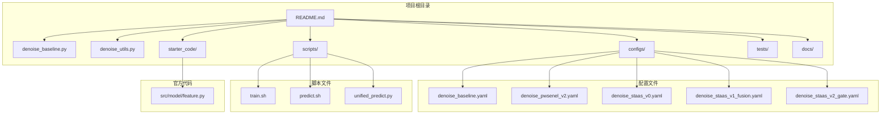
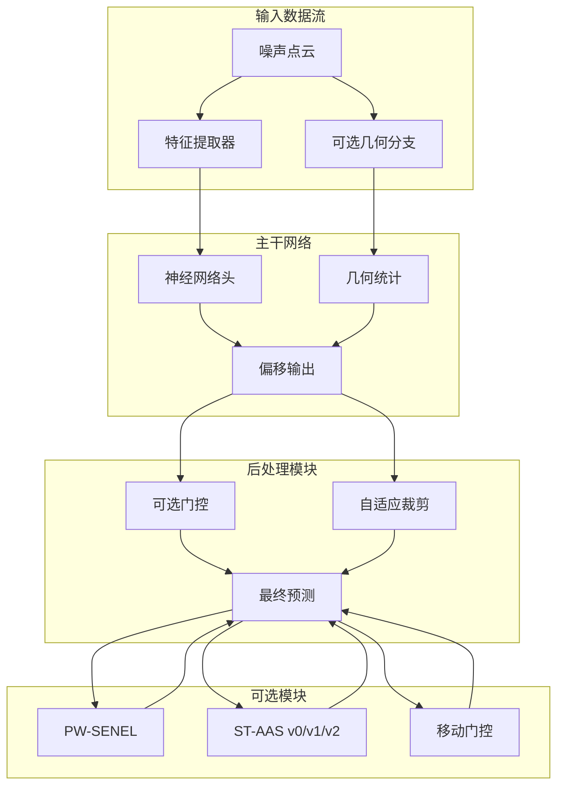
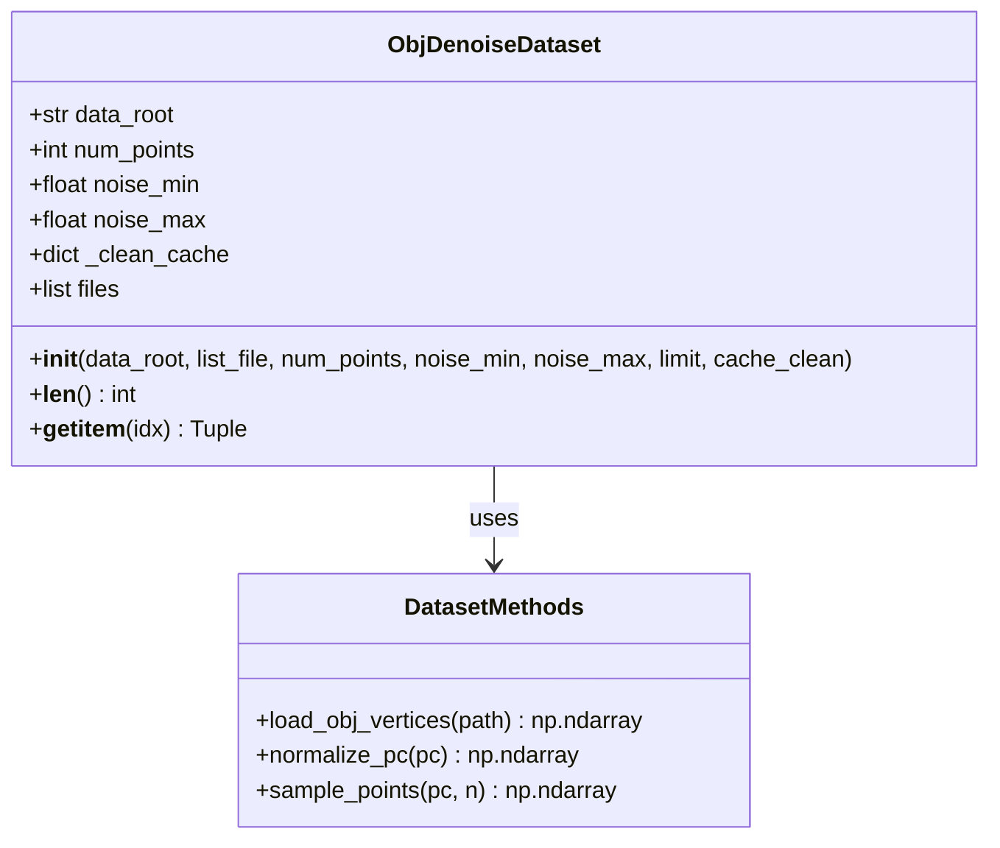
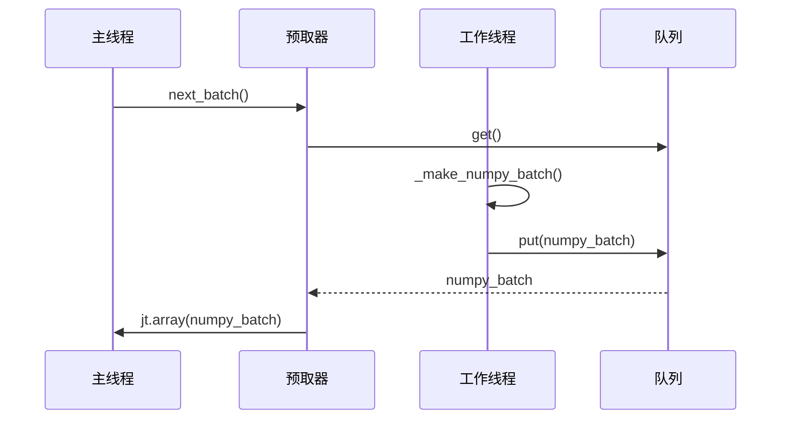
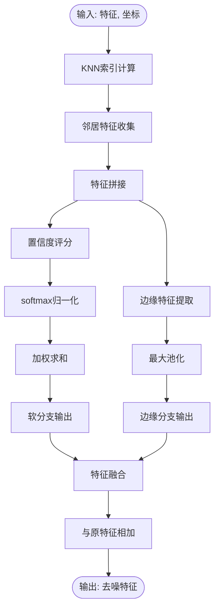
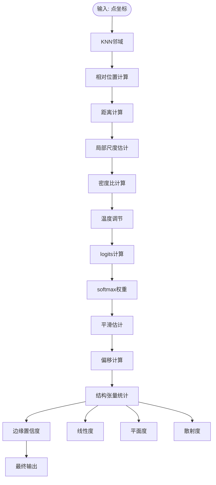
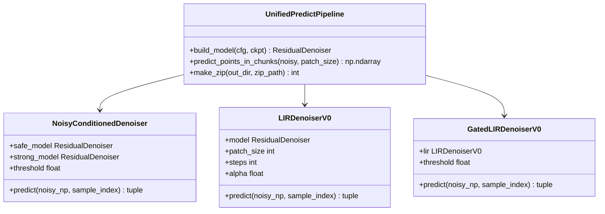
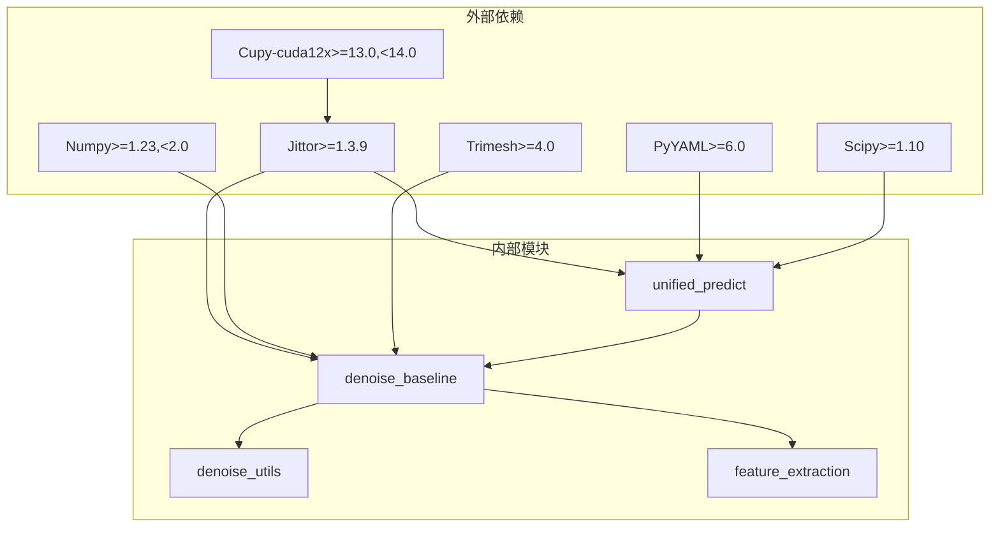

# 降噪工具模块

<cite>
**本文档引用的文件**
- [README.md](file://README.md)
- [denoise_utils.py](file://denoise_utils.py)
- [denoise_baseline.py](file://denoise_baseline.py)
- [configs/denoise_baseline.yaml](file://configs/denoise_baseline.yaml)
- [configs/denoise_pwsenel_v2.yaml](file://configs/denoise_pwsenel_v2.yaml)
- [configs/denoise_staas_v0.yaml](file://configs/denoise_staas_v0.yaml)
- [configs/denoise_staas_v1_fusion.yaml](file://configs/denoise_staas_v1_fusion.yaml)
- [configs/denoise_staas_v2_gate.yaml](file://configs/denoise_staas_v2_gate.yaml)
- [scripts/train.sh](file://scripts/train.sh)
- [scripts/predict.sh](file://scripts/predict.sh)
- [scripts/unified_predict.py](file://scripts/unified_predict.py)
- [requirements.txt](file://requirements.txt)
- [starter_code/src/model/feature.py](file://starter_code/src/model/feature.py)
</cite>

## 目录
1. [简介](#简介)
2. [项目结构](#项目结构)
3. [核心组件](#核心组件)
4. [架构概览](#架构概览)
5. [详细组件分析](#详细组件分析)
6. [依赖关系分析](#依赖关系分析)
7. [性能考虑](#性能考虑)
8. [故障排除指南](#故障排除指南)
9. [结论](#结论)
10. [附录](#附录)

## 简介

这是一个基于Jittor框架的点云去噪工具模块，专为Jittor点云竞赛正式赛道设计。项目提供了可重现的基线实现和由wupeiwei（小冷）提出的PW-SENEL（PeiWei Softmax Edge-aware Noise Elimination and Locking）与ST-AAS（Structure Tensor-guided Adaptive Softmax）模块。

该模块的核心目标是在保持官方starter_code不变的前提下，实现边缘保持的点云去噪，通过残差点式去噪基准（pred_clean = noisy + offset）提供强大的基础架构。

## 项目结构



**图表来源**
- [README.md:52-77](file://README.md#L52-L77)
- [configs/denoise_baseline.yaml:1-44](file://configs/denoise_baseline.yaml#L1-L44)
- [scripts/train.sh:1-44](file://scripts/train.sh#L1-L44)

**章节来源**
- [README.md:52-77](file://README.md#L52-L77)
- [README.md:108-143](file://README.md#L108-L143)

## 核心组件

### 基线去噪器（ResidualDenoiser）

ResidualDenoiser是整个系统的核心组件，采用残差学习策略，通过以下架构实现：

- **特征提取器**：复用官方FeatureExtraction模块
- **神经网络头**：MLP偏移头部
- **可选模块**：PW-SENEL、ST-AAS、移动门控等

### PW-SENEL模块

PW-SENEL（PeiWei Softmax Edge-aware Noise Elimination and Locking）模块包含两个主要分支：

- **Softmax分支**：学习邻居置信度，抑制可疑的噪声响应
- **MaxPool分支**：保持高响应的局部边缘/几何线索
- **融合输出**：与原始特征相加，确保可消融性

### ST-AAS模块

ST-AAS（Structure Tensor-guided Adaptive Softmax）模块提供轻量级几何实现：

- **单KNN邻域**：简化计算复杂度
- **密度自适应softmax温度**：根据局部密度调整平滑程度
- **结构张量描述符**：线性度、平面度、散射度
- **边缘感知平滑抑制**：pred_i = p_i + (1 - edge_conf_i) * (smooth_i - p_i)

**章节来源**
- [denoise_baseline.py:471-721](file://denoise_baseline.py#L471-L721)
- [denoise_baseline.py:261-313](file://denoise_baseline.py#L261-L313)
- [denoise_baseline.py:372-469](file://denoise_baseline.py#L372-L469)

## 架构概览



**图表来源**
- [denoise_baseline.py:590-720](file://denoise_baseline.py#L590-L720)
- [denoise_baseline.py:261-469](file://denoise_baseline.py#L261-L469)

## 详细组件分析

### 数据集类（ObjDenoiseDataset）

ObjDenoiseDataset负责在线合成训练数据：



**图表来源**
- [denoise_baseline.py:92-149](file://denoise_baseline.py#L92-L149)

### 批次预取器（BatchPrefetcher）

BatchPrefetcher通过多线程后台准备NumPy批次，优化训练效率：



**图表来源**
- [denoise_baseline.py:177-223](file://denoise_baseline.py#L177-L223)

### PW-SENEL模块详解

PW-SENEL模块实现了软最大值噪声消除和边缘锁定机制：



**图表来源**
- [denoise_baseline.py:294-312](file://denoise_baseline.py#L294-L312)

**章节来源**
- [denoise_baseline.py:261-313](file://denoise_baseline.py#L261-L313)

### ST-AAS v0模块详解

ST-AAS v0提供了密度自适应的软最大值平滑：



**图表来源**
- [denoise_baseline.py:408-468](file://denoise_baseline.py#L408-L468)

**章节来源**
- [denoise_baseline.py:372-469](file://denoise_baseline.py#L372-L469)

### 统一预测管道（Unified Predict Pipeline）

统一预测管道支持多种推理模式：



**图表来源**
- [scripts/unified_predict.py:83-119](file://scripts/unified_predict.py#L83-L119)
- [scripts/unified_predict.py:274-350](file://scripts/unified_predict.py#L274-L350)

**章节来源**
- [scripts/unified_predict.py:412-606](file://scripts/unified_predict.py#L412-L606)

## 依赖关系分析



**图表来源**
- [requirements.txt:1-21](file://requirements.txt#L1-L21)
- [denoise_baseline.py:53-58](file://denoise_baseline.py#L53-L58)

**章节来源**
- [requirements.txt:1-21](file://requirements.txt#L1-L21)

## 性能考虑

### 训练优化策略

1. **批处理预取**：使用多线程后台准备数据，减少CUDA等待时间
2. **内存管理**：合理设置批次大小和点数数量
3. **硬件适配**：通过配置文件适配不同GPU内存容量

### 推理优化策略

1. **分块推理**：支持大点云的分块处理
2. **路由策略**：根据噪声水平选择合适的去噪策略
3. **缓存机制**：清理缓存避免内存泄漏

### 配置调优建议

- **baseline配置**：适合快速验证和调试
- **pwsenel_v2配置**：增强边缘保持能力
- **staas_v2_gate配置**：提供更精细的噪声控制

**章节来源**
- [denoise_baseline.py:177-223](file://denoise_baseline.py#L177-L223)
- [configs/denoise_baseline.yaml:16-44](file://configs/denoise_baseline.yaml#L16-L44)

## 故障排除指南

### 常见问题及解决方案

1. **环境配置问题**
   - 确保Jittor版本>=1.3.9
   - CUDA 12.x机器需要安装匹配的CuPy版本
   - 使用Python 3.10-3.12

2. **数据准备问题**
   - 确保数据集符号链接正确
   - 检查点云文件格式和路径

3. **训练问题**
   - 调整批次大小适应GPU内存
   - 检查KNN参数设置
   - 验证损失函数权重

4. **推理问题**
   - 分块大小设置过小会导致内存不足
   - 路由阈值需要根据数据特性调整

### 调试工具

- **环境检查**：`scripts/check_env.py`
- **数据检查**：`scripts/check_data.py`
- **运行摘要**：自动保存在实验目录中

**章节来源**
- [README.md:108-143](file://README.md#L108-L143)
- [denoise_baseline.py:729-800](file://denoise_baseline.py#L729-L800)

## 结论

该降噪工具模块提供了完整的点云去噪解决方案，具有以下特点：

1. **模块化设计**：各个组件独立可插拔，便于A/B测试
2. **可重现性**：提供详细的配置文件和训练脚本
3. **性能优化**：包含多种优化策略和硬件适配
4. **易于扩展**：清晰的接口设计支持新模块集成

推荐使用场景：
- 快速原型开发：使用baseline配置
- 边缘保持优化：使用pwsenel_v2配置
- 高质量去噪：使用staas_v2_gate配置
- 大规模推理：使用统一预测管道

## 附录

### 配置文件说明

| 配置文件 | 主要用途 | 关键参数 |
|---------|---------|---------|
| denoise_baseline.yaml | 基线模型 | k=16, feat_dim=256, hidden=256 |
| denoise_pwsenel_v2.yaml | PW-SENEL v2 | pwsenel_v2=true, edge_lock=0.7 |
| denoise_staas_v0.yaml | ST-AAS v0 | staas=true, tau0=0.02 |
| denoise_staas_v1_fusion.yaml | 几何融合 | staas_fusion=true, k=24 |
| denoise_staas_v2_gate.yaml | 噪声条件门控 | staas_v2_gate=true, k=24 |

### 训练命令示例

```bash
# 基线训练
bash scripts/train.sh configs/denoise_baseline.yaml

# PW-SENEL v2训练
bash scripts/train.sh configs/denoise_pwsenel_v2.yaml

# ST-AAS v0训练  
bash scripts/train.sh configs/denoise_staas_v0.yaml

# 统一预测
source scripts/env.sh
"$PYTHON" scripts/unified_predict.py \
  --name router_t0165 \
  --out-dir results/router_t0165 \
  --zip result_router_t0165.zip
```

**章节来源**
- [README.md:173-248](file://README.md#L173-L248)
- [configs/denoise_baseline.yaml:1-44](file://configs/denoise_baseline.yaml#L1-L44)
- [configs/denoise_pwsenel_v2.yaml:1-45](file://configs/denoise_pwsenel_v2.yaml#L1-L45)
- [configs/denoise_staas_v0.yaml:1-44](file://configs/denoise_staas_v0.yaml#L1-L44)
- [configs/denoise_staas_v1_fusion.yaml:1-52](file://configs/denoise_staas_v1_fusion.yaml#L1-L52)
- [configs/denoise_staas_v2_gate.yaml:1-59](file://configs/denoise_staas_v2_gate.yaml#L1-L59)