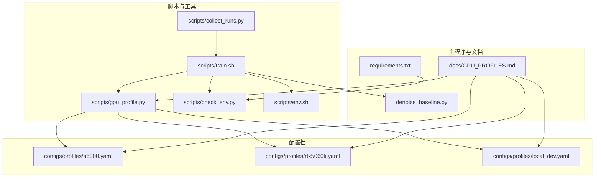
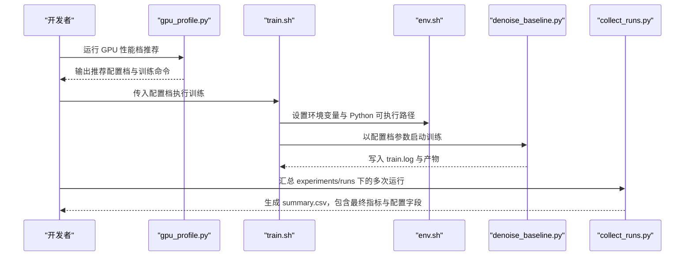
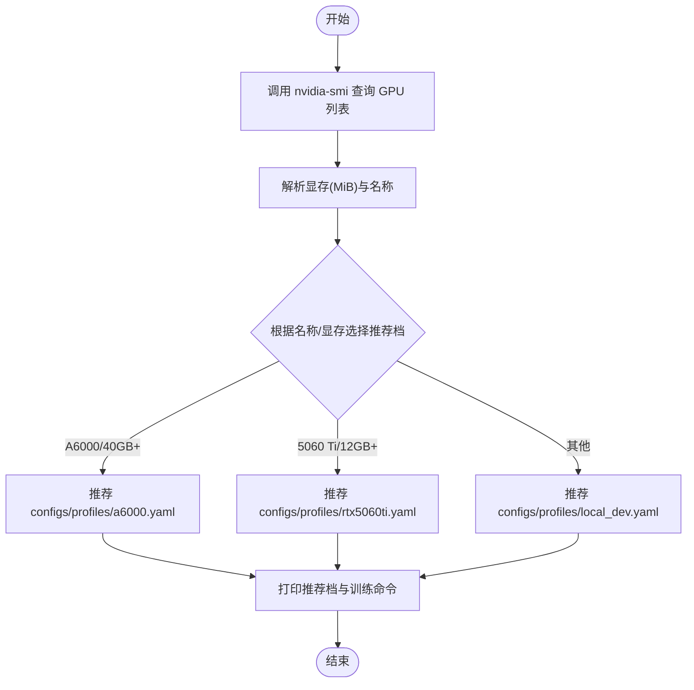
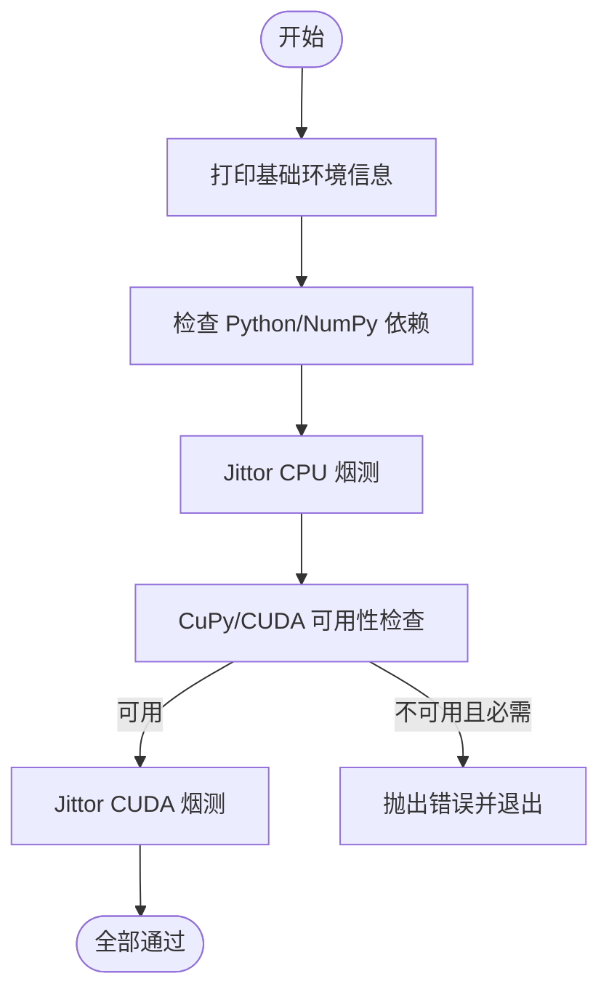
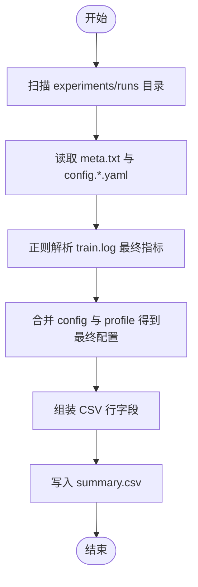
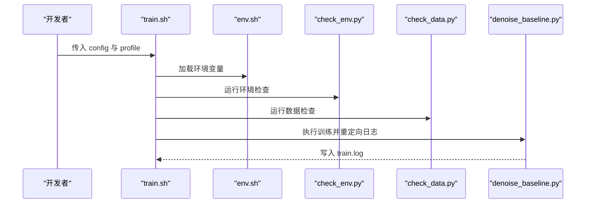
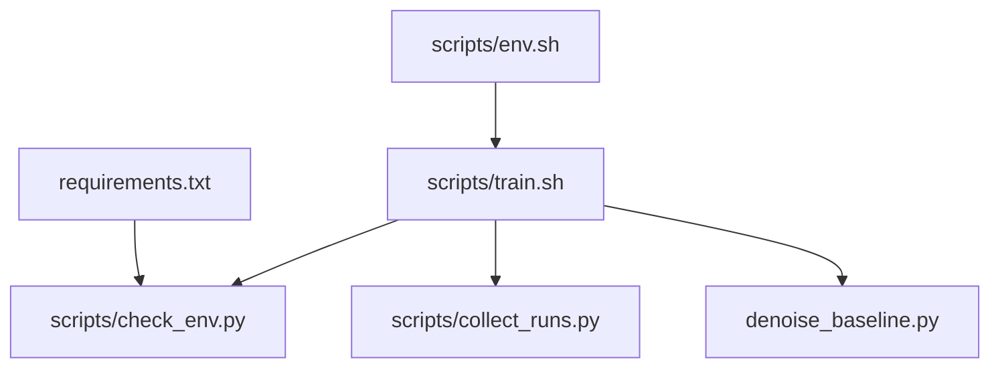

# 性能监控

<cite>
**本文引用的文件**
- [scripts/gpu_profile.py](file://scripts/gpu_profile.py)
- [scripts/check_env.py](file://scripts/check_env.py)
- [scripts/collect_runs.py](file://scripts/collect_runs.py)
- [scripts/train.sh](file://scripts/train.sh)
- [scripts/env.sh](file://scripts/env.sh)
- [configs/profiles/a6000.yaml](file://configs/profiles/a6000.yaml)
- [configs/profiles/rtx5060ti.yaml](file://configs/profiles/rtx5060ti.yaml)
- [configs/profiles/local_dev.yaml](file://configs/profiles/local_dev.yaml)
- [docs/GPU_PROFILES.md](file://docs/GPU_PROFILES.md)
- [denoise_baseline.py](file://denoise_baseline.py)
- [requirements.txt](file://requirements.txt)
</cite>

## 目录
1. [简介](#简介)
2. [项目结构](#项目结构)
3. [核心组件](#核心组件)
4. [架构总览](#架构总览)
5. [详细组件分析](#详细组件分析)
6. [依赖分析](#依赖分析)
7. [性能考量与优化建议](#性能考量与优化建议)
8. [故障排查指南](#故障排查指南)
9. [结论](#结论)
10. [附录](#附录)

## 简介
本指南围绕 Jittor 点云去噪项目的性能监控与优化展开，重点覆盖以下方面：
- 使用 gpu_profile.py 快速推荐适合当前 GPU 的训练配置档，并指导如何基于该档进行训练。
- 使用 check_env.py 完成环境自检，涵盖基础系统信息、Python/NumPy 依赖、CuPy/CUDA 可用性以及 Jittor CPU/GPU 的烟测。
- 使用 collect_runs.py 自动汇总多次实验的训练日志，提取关键指标并生成 CSV 报告，便于横向对比与统计分析。
- 结合项目中的配置档与训练脚本，给出针对 batch size、数据加载、混合精度等的实操建议与瓶颈定位方法。

## 项目结构
本项目与性能监控密切相关的文件主要分布在 scripts/ 与 configs/profiles/ 目录中，并通过训练脚本统一入口串联起来。下图展示了与性能监控相关的关键文件及其交互关系。

**图表来源**
- [scripts/gpu_profile.py:1-60](file://scripts/gpu_profile.py#L1-L60)
- [scripts/check_env.py:1-197](file://scripts/check_env.py#L1-L197)
- [scripts/collect_runs.py:1-225](file://scripts/collect_runs.py#L1-L225)
- [scripts/train.sh:1-44](file://scripts/train.sh#L1-L44)
- [scripts/env.sh:1-48](file://scripts/env.sh#L1-L48)
- [configs/profiles/a6000.yaml:1-29](file://configs/profiles/a6000.yaml#L1-L29)
- [configs/profiles/rtx5060ti.yaml:1-20](file://configs/profiles/rtx5060ti.yaml#L1-L20)
- [configs/profiles/local_dev.yaml:1-19](file://configs/profiles/local_dev.yaml#L1-L19)
- [docs/GPU_PROFILES.md:1-122](file://docs/GPU_PROFILES.md#L1-L122)
- [requirements.txt:1-17](file://requirements.txt#L1-L17)

**章节来源**
- [scripts/gpu_profile.py:1-60](file://scripts/gpu_profile.py#L1-L60)
- [scripts/check_env.py:1-197](file://scripts/check_env.py#L1-L197)
- [scripts/collect_runs.py:1-225](file://scripts/collect_runs.py#L1-L225)
- [scripts/train.sh:1-44](file://scripts/train.sh#L1-L44)
- [scripts/env.sh:1-48](file://scripts/env.sh#L1-L48)
- [configs/profiles/a6000.yaml:1-29](file://configs/profiles/a6000.yaml#L1-L29)
- [configs/profiles/rtx5060ti.yaml:1-20](file://configs/profiles/rtx5060ti.yaml#L1-L20)
- [configs/profiles/local_dev.yaml:1-19](file://configs/profiles/local_dev.yaml#L1-L19)
- [docs/GPU_PROFILES.md:1-122](file://docs/GPU_PROFILES.md#L1-L122)
- [requirements.txt:1-17](file://requirements.txt#L1-L17)

## 核心组件
- GPU 性能档推荐工具：根据 nvidia-smi 查询到的 GPU 名称与显存大小，输出推荐的训练配置档及训练命令模板，帮助快速进入稳定训练。
- 环境检查工具：分层检查 Python/NumPy、Jittor CPU、Jittor CUDA 三类环境，确保依赖版本、CUDA 可见性、编译器与缓存路径等满足训练要求。
- 实验运行汇总工具：解析每次训练产生的日志与元数据，抽取最终指标（如 loss、cd、耗时等），合并为 CSV，便于后续统计与可视化。
- 训练脚本：封装实验运行流程，统一设置环境变量、复制配置、记录元数据、执行训练并产出日志与产物，供汇总工具消费。
- 配置档：按硬件能力划分的训练参数集合，覆盖 batch_size、num_points、steps、limit、prefetch 等，用于控制显存占用与吞吐。

**章节来源**
- [scripts/gpu_profile.py:13-56](file://scripts/gpu_profile.py#L13-L56)
- [scripts/check_env.py:166-192](file://scripts/check_env.py#L166-L192)
- [scripts/collect_runs.py:197-221](file://scripts/collect_runs.py#L197-L221)
- [scripts/train.sh:14-43](file://scripts/train.sh#L14-L43)
- [configs/profiles/a6000.yaml:6-21](file://configs/profiles/a6000.yaml#L6-L21)
- [configs/profiles/rtx5060ti.yaml:5-12](file://configs/profiles/rtx5060ti.yaml#L5-L12)
- [configs/profiles/local_dev.yaml:4-11](file://configs/profiles/local_dev.yaml#L4-L11)

## 架构总览
下图展示了从“选择配置档”到“训练与汇总”的端到端流程，以及各组件之间的依赖关系。

**图表来源**
- [scripts/gpu_profile.py:13-56](file://scripts/gpu_profile.py#L13-L56)
- [scripts/train.sh:12-43](file://scripts/train.sh#L12-L43)
- [scripts/env.sh:16-47](file://scripts/env.sh#L16-L47)
- [denoise_baseline.py:912-934](file://denoise_baseline.py#L912-L934)
- [scripts/collect_runs.py:197-221](file://scripts/collect_runs.py#L197-L221)

## 详细组件分析

### GPU 性能档推荐工具：gpu_profile.py
- 功能概述
  - 通过 nvidia-smi 查询可见 GPU 的索引、名称、显存总量、驱动版本与计算能力。
  - 基于 GPU 名称与最大显存大小，给出推荐的配置档（如 A6000/5060 Ti/local_dev）与训练命令模板。
  - 若无法查询 GPU，则回退到本地开发档并提示。
- 关键行为
  - 解析 nvidia-smi 输出，提取每块 GPU 的显存数值（MiB）。
  - 根据名称关键词与显存阈值选择推荐档位。
  - 打印推荐配置档路径与训练命令示例，便于一键开始训练。
- 使用建议
  - 首次迁移或更换机器时，先运行该脚本确认推荐档位，再结合对应配置档调整 batch_size/num_points 等参数。
  - 若显存紧张，优先降低 batch_size 或 num_points，遵循“先降资源参数，再改模型逻辑”的原则。

**图表来源**
- [scripts/gpu_profile.py:13-56](file://scripts/gpu_profile.py#L13-L56)

**章节来源**
- [scripts/gpu_profile.py:13-56](file://scripts/gpu_profile.py#L13-L56)
- [docs/GPU_PROFILES.md:104-122](file://docs/GPU_PROFILES.md#L104-L122)

### 环境检查工具：check_env.py
- 功能概述
  - 分层检查：Python/NumPy 工具链 → Jittor CPU → Jittor CUDA。
  - 打印基础系统信息（Python 版本、编译器、CUDA 可见性、驱动等）。
  - 针对缺失模块与 CUDA 不可用场景，给出明确修复建议（如安装指定版本的 cupy-cuda、设置 JITTOR_HOME、激活虚拟环境等）。
- 关键行为
  - 基础环境：打印平台、编译器、nvidia-smi 查询结果。
  - Python/NumPy：校验模块存在与版本，避免因 CUDA 编译失败导致工具链误判。
  - CuPy/CUDA：探测 CUDA 运行时与可见设备数，若不可用且要求设备则报错。
  - Jittor：CPU/GPU 分别执行最小张量运算烟测，捕获常见安装与缓存问题。
- 使用建议
  - 在新机器或 CI 环境中，先运行该脚本，确保所有层级检查通过后再进行训练。
  - 若出现“只读文件系统”或“.cache/jittor”相关错误，按提示设置 HOME 或 JITTOR_HOME 到可写路径。

**图表来源**
- [scripts/check_env.py:166-192](file://scripts/check_env.py#L166-L192)

**章节来源**
- [scripts/check_env.py:55-87](file://scripts/check_env.py#L55-L87)
- [scripts/check_env.py:89-104](file://scripts/check_env.py#L89-L104)
- [scripts/check_env.py:106-132](file://scripts/check_env.py#L106-L132)
- [scripts/check_env.py:134-164](file://scripts/check_env.py#L134-L164)
- [scripts/check_env.py:166-192](file://scripts/check_env.py#L166-L192)
- [requirements.txt:5-9](file://requirements.txt#L5-L9)

### 实验运行汇总工具：collect_runs.py
- 功能概述
  - 读取 experiments/runs/* 下的每次运行目录，解析元数据、最终训练指标与配置合并结果。
  - 提取字段包括：运行 ID、状态、日期、实验名、配置档、最终 loss/cd/耗时、batch_size、num_points、学习率、模型超参、checkpoint/zip 存在性等。
  - 输出为 CSV 文件，便于进一步统计分析与可视化。
- 关键行为
  - 正则解析 train.log 中的最终指标行，提取最后一步的 loss、cd、pred_offset 等指标与总耗时。
  - 合并 config.final.yaml 与 profile.yaml，形成最终配置视图。
  - 识别失败/异常日志，标注状态与简要尾部信息，辅助定位问题。
- 使用建议
  - 在批量训练后运行该工具，生成 summary.csv，结合字段进行横向对比（如不同 batch_size/num_points 的收敛速度与稳定性）。
  - 如需在终端直接查看表格，可使用 --print 参数输出到 stdout。

**图表来源**
- [scripts/collect_runs.py:197-221](file://scripts/collect_runs.py#L197-L221)
- [scripts/collect_runs.py:142-194](file://scripts/collect_runs.py#L142-L194)

**章节来源**
- [scripts/collect_runs.py:1-225](file://scripts/collect_runs.py#L1-L225)

### 训练脚本：train.sh
- 功能概述
  - 统一训练入口：设置环境、复制配置、记录元数据、执行训练并产出日志。
  - 自动生成 run_id、创建运行目录、复制 config 与 profile、调用环境检查与数据检查、执行主程序并重定向日志。
- 关键行为
  - 通过 env.sh 导入必要的环境变量（如 JITTOR_HOME、DISABLE_MULTIPROCESSING、PYTHON 等）。
  - 生成 run_id 并在 experiments/runs 下创建子目录，复制 config 与 profile，写入 meta.txt（含 date、git 状态等）。
  - 执行 denoise_baseline.py --mode train，并将输出重定向到 run_dir/train.log。
- 使用建议
  - 通过传入配置档与额外参数，快速切换不同硬件档位与实验设置。
  - 若需要调试，可在脚本中临时开启更详细的日志或 profile 开关。

**图表来源**
- [scripts/train.sh:12-43](file://scripts/train.sh#L12-L43)
- [scripts/env.sh:16-47](file://scripts/env.sh#L16-L47)

**章节来源**
- [scripts/train.sh:1-44](file://scripts/train.sh#L1-L44)
- [scripts/env.sh:1-48](file://scripts/env.sh#L1-L48)

### 配置档：profiles/*.yaml
- A6000 档（48GB 显存）
  - 较高的 batch_size、num_points 与 steps，适合大规模训练与最终消融。
  - 包含 cache_clean、prefetch_workers、prefetch_queue_size、profile_times、profile_system_every 等性能相关参数，便于诊断输入管线瓶颈。
- 5060 Ti 档
  - 中等规模参数，适配 8GB/16GB 显存机型；若显存较小，优先降低 batch_size 或 num_points。
- 本地开发档
  - 小规模参数，仅用于 smoke 测试与调试，不适合最终训练。

**章节来源**
- [configs/profiles/a6000.yaml:1-29](file://configs/profiles/a6000.yaml#L1-L29)
- [configs/profiles/rtx5060ti.yaml:1-20](file://configs/profiles/rtx5060ti.yaml#L1-L20)
- [configs/profiles/local_dev.yaml:1-19](file://configs/profiles/local_dev.yaml#L1-L19)
- [docs/GPU_PROFILES.md:104-122](file://docs/GPU_PROFILES.md#L104-L122)

## 依赖分析
- 环境一致性
  - 通过 env.sh 固定编译器、禁用 Jittor 多进程编译、设置 JITTOR_HOME，减少跨机器差异。
- 依赖版本
  - requirements.txt 明确了 jittor、cupy-cuda12x、numpy、trimesh、PyYAML、scipy、omegaconf、tqdm 等依赖范围，确保 CUDA 12.x 场景下的兼容性。
- 工具间耦合
  - train.sh 依赖 env.sh、check_env.py、check_data.py 与 denoise_baseline.py；collect_runs.py 依赖 experiments/runs/* 下的训练产物。

**图表来源**
- [scripts/env.sh:16-47](file://scripts/env.sh#L16-L47)
- [scripts/train.sh:12-43](file://scripts/train.sh#L12-L43)
- [scripts/check_env.py:166-192](file://scripts/check_env.py#L166-L192)
- [scripts/collect_runs.py:197-221](file://scripts/collect_runs.py#L197-L221)
- [requirements.txt:5-9](file://requirements.txt#L5-L9)

**章节来源**
- [scripts/env.sh:1-48](file://scripts/env.sh#L1-L48)
- [requirements.txt:1-17](file://requirements.txt#L1-L17)
- [scripts/train.sh:1-44](file://scripts/train.sh#L1-L44)

## 性能考量与优化建议

### GPU 利用率、显存与训练速度的测量
- GPU 利用率与显存
  - 项目内提供了查询 GPU 利用率与显存占用的辅助函数，可用于训练过程中的实时观测与瓶颈定位。
  - 建议在训练循环中周期性采集 nvidia-smi 的 utilization.gpu 与 memory.used/memory.total，结合数据准备时间与计算时间，判断是 I/O 还是算力瓶颈。
- 训练速度
  - 训练日志中包含每步耗时与总耗时字段，可据此估算吞吐（samples/sec）与收敛速度。
  - 通过调整 batch_size、num_points 与 prefetch 参数，观察吞吐变化，找到稳定且高效的组合。

**章节来源**
- [denoise_baseline.py:229-242](file://denoise_baseline.py#L229-L242)
- [denoise_baseline.py:912-934](file://denoise_baseline.py#L912-L934)
- [scripts/collect_runs.py:27-35](file://scripts/collect_runs.py#L27-L35)

### 环境检查与 CUDA 配置
- 依赖版本验证
  - 使用 check_env.py 的 Python/NumPy 层检查，避免因 CUDA 编译失败导致工具链误判。
- CUDA 环境配置
  - 确保 nvidia-smi 可见、CUDA_VISIBLE_DEVICES 设置正确、CuPy 与 Jittor 的 CUDA 版本匹配。
  - 若出现只读文件系统或缓存路径问题，按提示设置 JITTOR_HOME 或 HOME 到可写路径。
- 硬件兼容性
  - 不同 GPU 的显存与计算能力差异较大，优先使用 gpu_profile.py 推荐档位，再微调 batch_size/num_points。

**章节来源**
- [scripts/check_env.py:55-87](file://scripts/check_env.py#L55-L87)
- [scripts/check_env.py:106-132](file://scripts/check_env.py#L106-L132)
- [scripts/check_env.py:134-164](file://scripts/check_env.py#L134-L164)
- [scripts/gpu_profile.py:13-56](file://scripts/gpu_profile.py#L13-L56)

### 运行收集与统计分析
- 自动收集
  - 通过 collect_runs.py 读取每次运行的 train.log 与元数据，抽取最终指标并生成 CSV。
- 统计分析
  - 基于 CSV 字段（如 elapsed_sec、final_loss、final_cd、batch_size、num_points 等）进行横向对比，识别影响收敛与吞吐的关键因素。
- 性能报告
  - 可将 CSV 导入电子表格或可视化工具，绘制趋势图与箱线图，辅助决策。

**章节来源**
- [scripts/collect_runs.py:1-225](file://scripts/collect_runs.py#L1-L225)

### 性能优化实操建议
- batch size 调优
  - 从推荐档位出发，逐步增大 batch_size，观察显存占用与吞吐变化；若显存不足，优先降低 batch_size。
- 混合精度训练
  - 在支持的硬件上启用混合精度，可显著提升吞吐并降低显存占用；需配合梯度缩放与数值稳定性策略。
- 数据加载优化
  - 使用 BatchPrefetcher 与多 worker 预取，减少主线程等待；合理设置队列长度与 worker 数，避免过度竞争 CPU/GPU 资源。
  - 在 A6000 上启用 cache_clean，避免重复加载与归一化，缩短数据准备时间。
- I/O 与内存管理
  - 减少磁盘随机访问，优先使用 SSD；避免在训练循环中频繁进行昂贵的 CPU 操作。
  - 注意内存泄漏：确保在异常路径中释放资源，避免长时间运行导致显存碎片化。

**章节来源**
- [configs/profiles/a6000.yaml:13-19](file://configs/profiles/a6000.yaml#L13-L19)
- [denoise_baseline.py:175-227](file://denoise_baseline.py#L175-L227)
- [docs/GPU_PROFILES.md:111-122](file://docs/GPU_PROFILES.md#L111-L122)

### 性能瓶颈识别与解决
- I/O 阻塞
  - 现象：GPU 利用率低、显存空闲，但数据准备时间长。
  - 解决：增加 prefetch_workers、增大 prefetch_queue_size、启用 cache_clean、减少磁盘随机访问。
- 计算瓶颈
  - 现象：GPU 利用率高、显存占用高，但吞吐受限。
  - 解决：增大 batch_size、num_points，或启用混合精度；检查模型结构与算子实现。
- 内存泄漏
  - 现象：长时间运行后显存持续增长。
  - 解决：检查数据加载与模型前向/反向过程中的中间变量释放；避免不必要的张量持有。

**章节来源**
- [denoise_baseline.py:229-242](file://denoise_baseline.py#L229-L242)
- [configs/profiles/a6000.yaml:13-19](file://configs/profiles/a6000.yaml#L13-L19)

### 性能基准测试方法与标准
- 方法
  - 固定配置档（如 a6000.yaml）与相同 seed，运行若干轮次，记录最终 loss、cd、elapsed_sec、step/sec 等指标。
  - 对比不同 batch_size/num_points 组合，绘制吞吐-显存曲线，确定最优参数组合。
- 标准
  - 收敛稳定性：最终 loss 与 cd 应在合理范围内，且方差较小。
  - 吞吐稳定性：多轮次的 step/sec 波动应在可控范围内。
  - 显存占用：不超过 GPU 显存上限，留有余量以避免 OOM。

**章节来源**
- [configs/profiles/a6000.yaml:6-21](file://configs/profiles/a6000.yaml#L6-L21)
- [scripts/collect_runs.py:27-35](file://scripts/collect_runs.py#L27-L35)

## 故障排查指南
- 环境检查失败
  - 症状：check_env.py 报错，提示缺失模块或 CUDA 不可用。
  - 处理：安装 requirements.txt 中的依赖，确保 CUDA 与 CuPy 版本匹配；设置 JITTOR_HOME 与 PYTHON；必要时激活虚拟环境。
- 训练日志异常
  - 症状：collect_runs.py 无法解析最终指标或 train.log 包含 Traceback。
  - 处理：查看 run_dir/train.log 尾部信息，定位具体错误；根据错误类型调整配置或修复数据。
- GPU 查询失败
  - 症状：gpu_profile.py 无法查询 nvidia-smi。
  - 处理：确认驱动安装与 nvidia-smi 可用性；在容器或受限环境中检查权限与可见性。

**章节来源**
- [scripts/check_env.py:166-192](file://scripts/check_env.py#L166-L192)
- [scripts/collect_runs.py:126-139](file://scripts/collect_runs.py#L126-L139)
- [scripts/gpu_profile.py:14-23](file://scripts/gpu_profile.py#L14-L23)

## 结论
通过 gpu_profile.py、check_env.py、collect_runs.py 与 train.sh 的协同，本项目形成了从“硬件适配—环境验证—训练执行—结果汇总”的完整性能监控闭环。建议在新机器或变更配置后，先运行环境检查与 GPU 档位推荐，再以配置档为基准进行参数微调，并利用 collect_runs.py 持续跟踪性能指标，从而稳定提升训练效率与结果质量。

## 附录
- 快速操作清单
  - 首次迁移：source scripts/env.sh → bash scripts/install_deps.sh → $PYTHON scripts/check_env.py → $PYTHON scripts/check_data.py --limit 5 → $PYTHON scripts/gpu_profile.py
  - 训练：bash scripts/train.sh configs/denoise_baseline.yaml configs/profiles/<your_choice>.yaml
  - 汇总：$PYTHON scripts/collect_runs.py

**章节来源**
- [docs/GPU_PROFILES.md:13-31](file://docs/GPU_PROFILES.md#L13-L31)
- [scripts/train.sh:1-44](file://scripts/train.sh#L1-L44)
- [scripts/collect_runs.py:197-221](file://scripts/collect_runs.py#L197-L221)