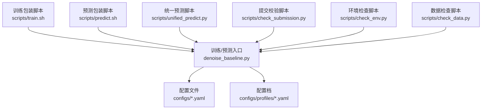
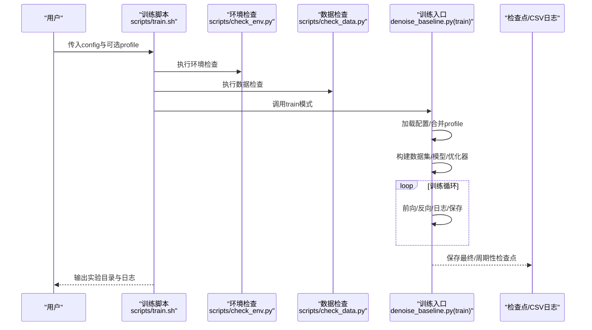
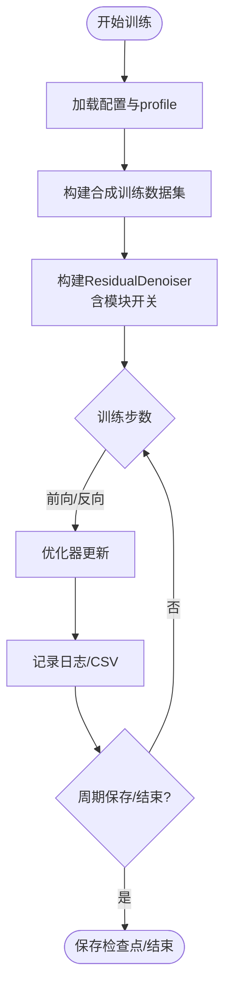
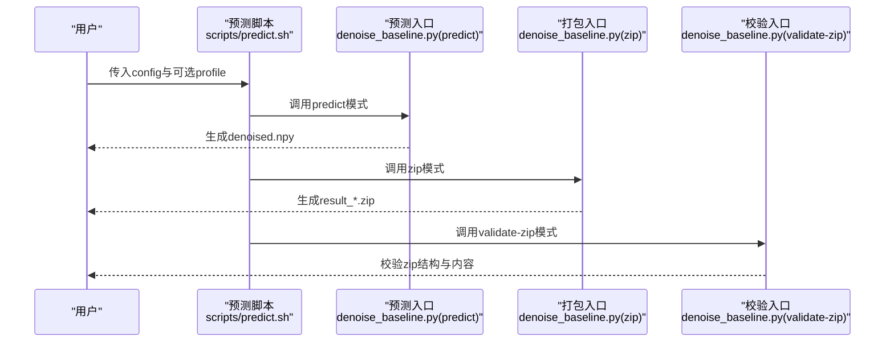
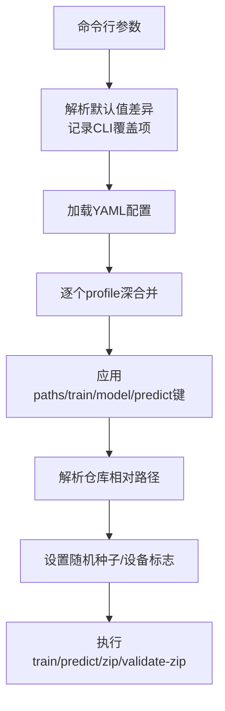
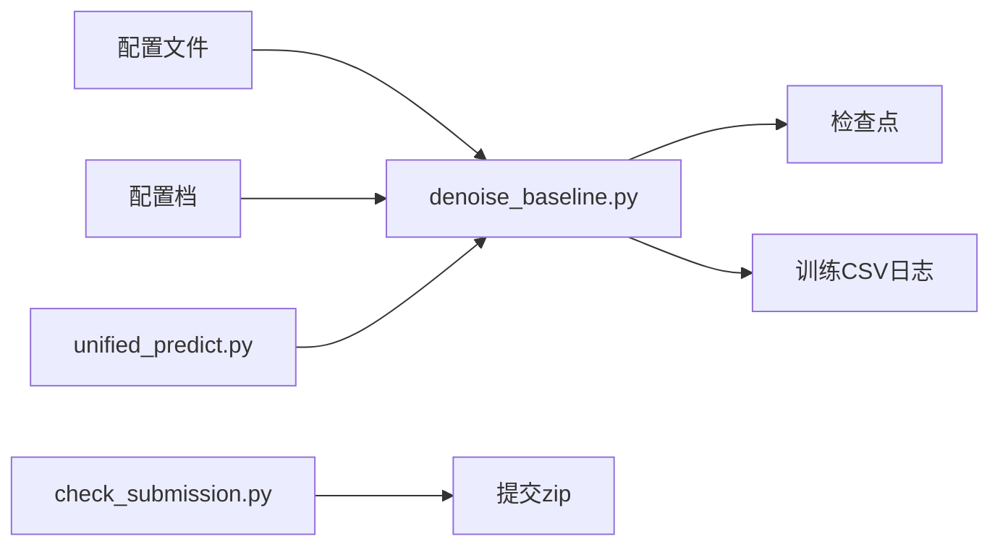

# 训练与预测

<cite>
**本文引用的文件**
- [README.md](file://README.md)
- [starter_code/README.md](file://starter_code/README.md)
- [denoise_baseline.py](file://denoise_baseline.py)
- [scripts/train.sh](file://scripts/train.sh)
- [scripts/predict.sh](file://scripts/predict.sh)
- [scripts/unified_predict.py](file://scripts/unified_predict.py)
- [scripts/check_submission.py](file://scripts/check_submission.py)
- [scripts/check_env.py](file://scripts/check_env.py)
- [scripts/check_data.py](file://scripts/check_data.py)
- [configs/denoise_baseline.yaml](file://configs/denoise_baseline.yaml)
- [configs/denoise_pwsenel.yaml](file://configs/denoise_pwsenel.yaml)
- [configs/denoise_staas_v0.yaml](file://configs/denoise_staas_v0.yaml)
- [configs/denoise_pwsenel_v2_adaptive_clip_piecewise.yaml](file://configs/denoise_pwsenel_v2_adaptive_clip_piecewise.yaml)
- [configs/profiles/a6000.yaml](file://configs/profiles/a6000.yaml)
</cite>

## 目录
1. [简介](#简介)
2. [项目结构](#项目结构)
3. [核心组件](#核心组件)
4. [架构总览](#架构总览)
5. [详细组件分析](#详细组件分析)
6. [依赖分析](#依赖分析)
7. [性能考虑](#性能考虑)
8. [故障排除指南](#故障排除指南)
9. [结论](#结论)
10. [附录](#附录)

## 简介
本指南面向Jittor点云去噪项目的训练与预测全流程，涵盖以下内容：
- 训练流程：基线训练、模块化训练（含PW-SENEL、ST-AAS等模块）、A/B测试（路由器）执行方法
- 预测流程：从单个模型推理到批量预测与结果打包的完整步骤
- 训练脚本工作原理：参数传递、配置加载、日志记录机制
- 预测脚本使用方法：checkpoint选择、输出格式、压缩打包选项
- 训练参数调优建议、性能监控方法、常见问题与解决方案
- 正式提交流程与竞赛合规要点

## 项目结构
项目采用“训练/预测入口 + 配置/配置档 + 辅助脚本”的组织方式：
- 训练/预测入口：denoise_baseline.py
- 配置文件：configs/*.yaml（含baseline、模块化ablation、特定策略配置）
- 配置档：configs/profiles/*.yaml（按硬件/内存预算调整训练参数）
- 包装脚本：scripts/train.sh、scripts/predict.sh、scripts/unified_predict.py
- 提交校验：scripts/check_submission.py
- 环境/数据检查：scripts/check_env.py、scripts/check_data.py

图表来源
- [denoise_baseline.py:1-1284](file://denoise_baseline.py#L1-L1284)
- [scripts/train.sh:1-44](file://scripts/train.sh#L1-L44)
- [scripts/predict.sh:1-13](file://scripts/predict.sh#L1-L13)
- [scripts/unified_predict.py:1-606](file://scripts/unified_predict.py#L1-L606)
- [scripts/check_submission.py:1-192](file://scripts/check_submission.py#L1-L192)
- [scripts/check_env.py:1-197](file://scripts/check_env.py#L1-L197)
- [scripts/check_data.py:1-103](file://scripts/check_data.py#L1-L103)

章节来源
- [README.md:52-106](file://README.md#L52-L106)
- [configs/denoise_baseline.yaml:1-44](file://configs/denoise_baseline.yaml#L1-L44)
- [configs/profiles/a6000.yaml:1-29](file://configs/profiles/a6000.yaml#L1-L29)

## 核心组件
- 训练入口与模型
  - 训练入口：denoise_baseline.py中的train函数，构建ResidualDenoiser并进行优化循环
  - 模型：ResidualDenoiser支持多种模块开关（PW-SENEL、ST-AAS、移动门、自适应裁剪等），便于A/B测试
- 预测入口
  - 单模型预测：predict函数，加载checkpoint，遍历测试集生成denoised.npy
  - 批量预测与打包：unified_predict.py支持路由器/迭代细化等策略，输出routes.csv并打包zip
- 配置系统
  - YAML配置文件定义实验名、路径、训练超参、模型开关
  - 配置档按硬件能力覆盖关键参数（如num_points、batch_size、日志频率等）
- 包装脚本
  - train.sh：复制配置/配置档至实验目录，执行环境与数据检查，启动训练并记录日志
  - predict.sh：依次执行predict、zip、validate-zip三步
  - unified_predict.py：统一推理入口，支持路由器/迭代细化/注册表登记

章节来源
- [denoise_baseline.py:813-978](file://denoise_baseline.py#L813-L978)
- [denoise_baseline.py:997-1088](file://denoise_baseline.py#L997-L1088)
- [denoise_baseline.py:1090-1184](file://denoise_baseline.py#L1090-L1184)
- [scripts/train.sh:14-44](file://scripts/train.sh#L14-L44)
- [scripts/predict.sh:1-13](file://scripts/predict.sh#L1-L13)
- [scripts/unified_predict.py:412-602](file://scripts/unified_predict.py#L412-L602)

## 架构总览
训练与预测的端到端流程如下：

图表来源
- [scripts/train.sh:14-44](file://scripts/train.sh#L14-L44)
- [scripts/check_env.py:166-196](file://scripts/check_env.py#L166-L196)
- [scripts/check_data.py:45-103](file://scripts/check_data.py#L45-L103)
- [denoise_baseline.py:813-978](file://denoise_baseline.py#L813-L978)

## 详细组件分析

### 训练流程（基线/模块化/A/B）
- 基线训练
  - 使用configs/denoise_baseline.yaml作为配置，配合可选配置档（如configs/profiles/a6000.yaml）提升显存/吞吐
  - 训练脚本会复制配置与配置档到experiments/runs/<run_id>/，并记录meta.txt、env.txt、data.txt与train.log
- 模块化训练
  - PW-SENEL：启用pwsenel开关，结合自适应裁剪/门控策略
  - ST-AAS v0：启用staas开关，使用密度自适应softmax平滑与边缘抑制
  - 其他策略：移动门、噪声感知移动门、混合安全/强支路等
- A/B测试（路由器）
  - 使用scripts/unified_predict.py的NoisyConditionedDenoiser，基于平面残差p75统计进行硬阈值/软融合路由
  - 支持强制分支（force-safe/force-strong）进行错路压力测试

图表来源
- [denoise_baseline.py:813-978](file://denoise_baseline.py#L813-L978)
- [scripts/train.sh:14-44](file://scripts/train.sh#L14-L44)
- [configs/denoise_baseline.yaml:16-44](file://configs/denoise_baseline.yaml#L16-L44)
- [configs/denoise_pwsenel.yaml:17-44](file://configs/denoise_pwsenel.yaml#L17-L44)
- [configs/denoise_staas_v0.yaml:17-44](file://configs/denoise_staas_v0.yaml#L17-L44)
- [configs/profiles/a6000.yaml:6-29](file://configs/profiles/a6000.yaml#L6-L29)

章节来源
- [README.md:173-215](file://README.md#L173-L215)
- [scripts/train.sh:14-44](file://scripts/train.sh#L14-L44)
- [configs/denoise_baseline.yaml:16-44](file://configs/denoise_baseline.yaml#L16-L44)
- [configs/denoise_pwsenel.yaml:17-44](file://configs/denoise_pwsenel.yaml#L17-L44)
- [configs/denoise_staas_v0.yaml:17-44](file://configs/denoise_staas_v0.yaml#L17-L44)
- [configs/denoise_pwsenel_v2_adaptive_clip_piecewise.yaml:13-54](file://configs/denoise_pwsenel_v2_adaptive_clip_piecewise.yaml#L13-L54)
- [configs/profiles/a6000.yaml:6-29](file://configs/profiles/a6000.yaml#L6-L29)

### 预测流程（单模型/批量/打包）
- 单个模型推理
  - 使用denoise_baseline.py的predict模式，加载指定checkpoint，遍历dataset_test_noisy下的noisy.npy，生成同路径结构的denoised.npy
- 批量预测与打包
  - 使用scripts/unified_predict.py统一入口：支持路由器/迭代细化（LIR）/带门限的Gated-LIR，输出routes.csv并打包zip
  - 支持CPU模式（--cpu）与多profile叠加
- 提交校验
  - 使用scripts/check_submission.py对zip进行结构、形状、dtype、有限值检查；可选与test_root匹配验证

图表来源
- [scripts/predict.sh:1-13](file://scripts/predict.sh#L1-L13)
- [denoise_baseline.py:997-1088](file://denoise_baseline.py#L997-L1088)
- [scripts/check_submission.py:68-156](file://scripts/check_submission.py#L68-L156)

章节来源
- [README.md:217-248](file://README.md#L217-L248)
- [scripts/predict.sh:1-13](file://scripts/predict.sh#L1-L13)
- [scripts/unified_predict.py:412-602](file://scripts/unified_predict.py#L412-L602)
- [scripts/check_submission.py:158-192](file://scripts/check_submission.py#L158-L192)

### 训练脚本工作原理（参数传递/配置加载/日志）
- 参数传递
  - train.sh接收config与可选profile，将配置复制到实验目录，执行环境与数据检查，随后调用denoise_baseline.py --mode train
- 配置加载
  - denoise_baseline.py的apply_config按“config → profile → CLI显式覆盖”的顺序合并，支持仓库相对路径解析
- 日志记录
  - 训练循环中记录loss、offset_mse、cd、pred_offset统计与data/compute/step时间；周期性保存检查点；CSV列名随schema演进自动兼容

图表来源
- [denoise_baseline.py:1257-1284](file://denoise_baseline.py#L1257-L1284)
- [denoise_baseline.py:1090-1184](file://denoise_baseline.py#L1090-L1184)
- [scripts/train.sh:14-44](file://scripts/train.sh#L14-L44)

章节来源
- [denoise_baseline.py:1090-1184](file://denoise_baseline.py#L1090-L1184)
- [scripts/train.sh:14-44](file://scripts/train.sh#L14-L44)

### 预测脚本使用方法（checkpoint选择/输出格式/打包）
- checkpoint选择
  - 在配置文件的paths.ckpt中指定；或通过CLI覆盖
- 输出格式
  - 预测输出为float32、形状(N,3)的denoised.npy，路径与测试集一致
- 压缩打包
  - zip模式将out_dir下shapenet/*/*/denoised.npy打包为result_*.zip
  - validate-zip模式进行轻量结构校验

章节来源
- [starter_code/README.md:35-67](file://starter_code/README.md#L35-L67)
- [denoise_baseline.py:1055-1088](file://denoise_baseline.py#L1055-L1088)
- [scripts/check_submission.py:68-156](file://scripts/check_submission.py#L68-L156)

### A/B测试（路由器）执行方法
- 统一入口
  - scripts/unified_predict.py提供NoisyConditionedDenoiser、LIRDenoiserV0、GatedLIRDenoiserV0三种模式
- 路由策略
  - 硬阈值：基于平面残差p75与阈值比较
  - 软融合：使用sigmoid近似路由权重
  - 强制分支：force-safe/force-strong用于错路压力测试
- 输出与登记
  - 生成routes.csv记录每样本的路由决策；可选追加候选注册表

章节来源
- [scripts/unified_predict.py:412-602](file://scripts/unified_predict.py#L412-L602)

## 依赖分析
- 组件耦合
  - 训练/预测入口与配置系统强耦合，通过YAML键名约定（experiment/paths/train/model/predict）解耦具体实现
  - unified_predict.py延迟导入Jittor，避免非CUDA环境初始化
- 外部依赖
  - Jittor、CuPy、NumPy、trimesh、PyYAML、SciPy等
- 潜在环依赖
  - 未发现直接环依赖；脚本间通过标准输入输出与文件系统交互

图表来源
- [denoise_baseline.py:1090-1184](file://denoise_baseline.py#L1090-L1184)
- [scripts/unified_predict.py:412-602](file://scripts/unified_predict.py#L412-L602)
- [scripts/check_submission.py:68-156](file://scripts/check_submission.py#L68-L156)

章节来源
- [scripts/check_env.py:166-196](file://scripts/check_env.py#L166-L196)
- [scripts/check_data.py:45-103](file://scripts/check_data.py#L45-L103)

## 性能考虑
- 吞吐与显存
  - 使用配置档（如a6000.yaml）提高num_points与batch_size，启用prefetch_workers与队列大小
  - 合成训练数据集支持cache_clean减少重复加载开销
- 时间剖析
  - 训练日志可开启profile_times与profile_system_every，记录data/compute/step时间与GPU/CPU利用率
- 推理内存
  - predict_points_in_chunks按块推理，避免大点云显存溢出
- 路由器性能
  - 平面残差p75统计在限定采样点上计算，兼顾速度与稳定性

章节来源
- [configs/profiles/a6000.yaml:6-29](file://configs/profiles/a6000.yaml#L6-L29)
- [denoise_baseline.py:910-978](file://denoise_baseline.py#L910-L978)
- [denoise_baseline.py:980-994](file://denoise_baseline.py#L980-L994)
- [scripts/unified_predict.py:122-138](file://scripts/unified_predict.py#L122-L138)

## 故障排除指南
- 环境问题
  - 使用scripts/check_env.py按层检查：python/numpy → jittor-cpu → jittor-cuda
  - 若CUDA不可用，确认驱动、可见设备、编译器与匹配的cupy-cuda版本
- 数据问题
  - 使用scripts/check_data.py检查data_root/test_root/train_list是否存在，训练obj与测试noisy.npy样本
- 提交失败
  - 使用scripts/check_submission.py进行结构/形状/dtype/有限值检查；可选与test_root匹配
- 训练卡住
  - 查看experiments/runs/<run_id>/train.log与CSV日志，关注data/compute/step耗时与loss收敛情况
  - 调整num_points、batch_size、prefetch_workers或切换CPU模式进行定位

章节来源
- [scripts/check_env.py:166-196](file://scripts/check_env.py#L166-L196)
- [scripts/check_data.py:45-103](file://scripts/check_data.py#L45-L103)
- [scripts/check_submission.py:68-156](file://scripts/check_submission.py#L68-L156)
- [denoise_baseline.py:910-978](file://denoise_baseline.py#L910-L978)

## 结论
本指南提供了从训练到预测再到正式提交的完整操作手册。通过配置/配置档的灵活组合、模块化的模型设计与统一的推理入口，项目能够高效开展A/B测试与竞品对比。建议在正式提交前严格遵循提交校验流程，并在不同硬件配置档上验证稳定性与性能。

## 附录
- 正式提交流程（合规要点）
  - 准备数据：dataset_train与dataset_test_noisy目录或符号链接
  - 训练：使用scripts/train.sh与configs/*.yaml及可选profiles/*.yaml
  - 预测：使用scripts/predict.sh或scripts/unified_predict.py
  - 打包：zip模式生成result_*.zip
  - 校验：scripts/check_submission.py进行结构/形状/dtype/有限值检查
  - 注册（可选）：scripts/candidate_registry.py登记候选信息

章节来源
- [README.md:144-248](file://README.md#L144-L248)
- [scripts/check_submission.py:158-192](file://scripts/check_submission.py#L158-L192)