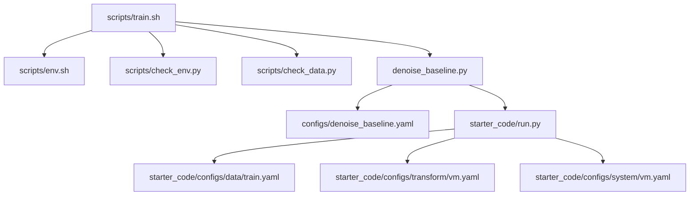
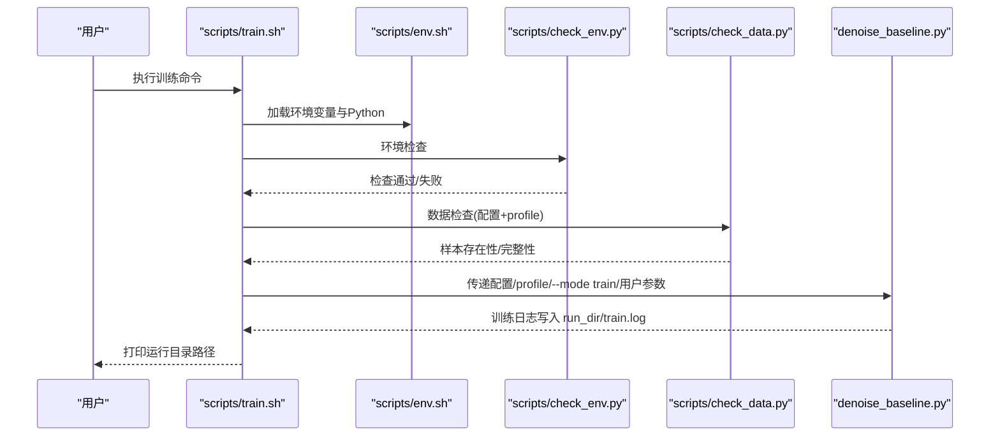
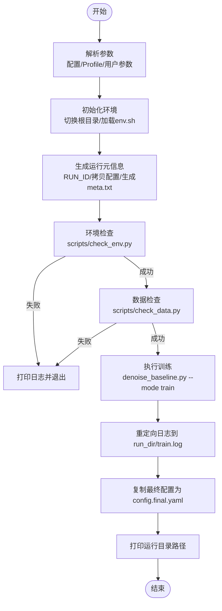
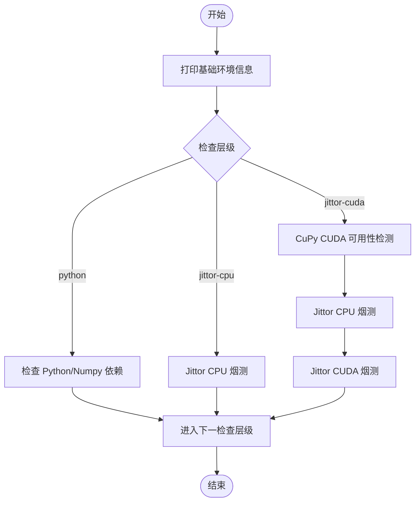
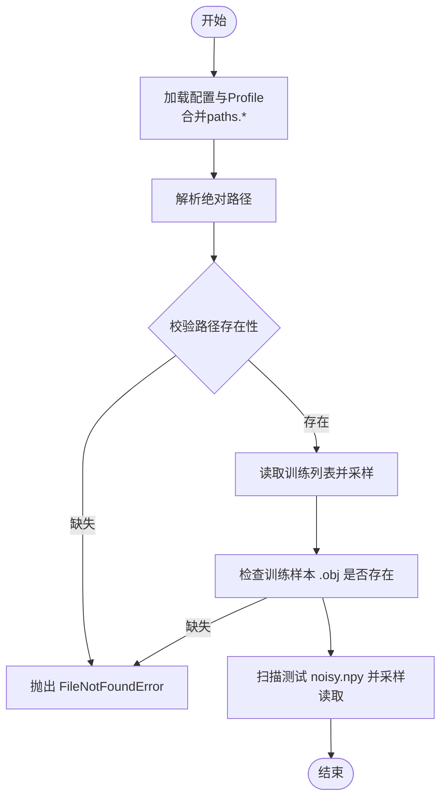
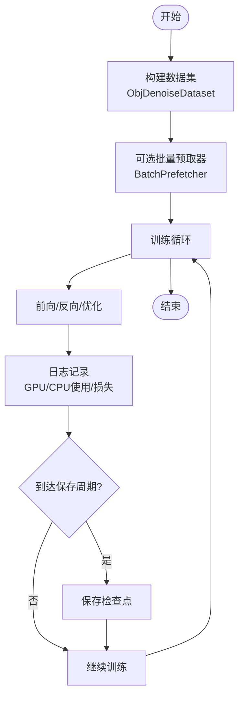
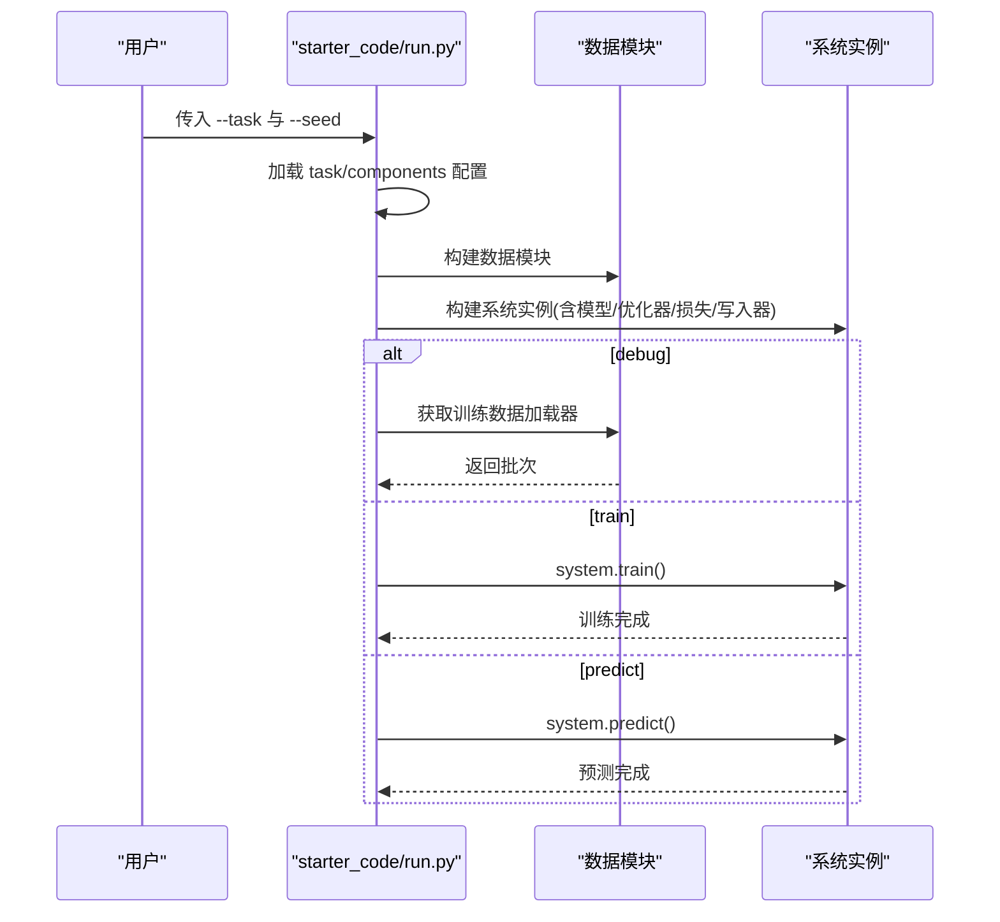
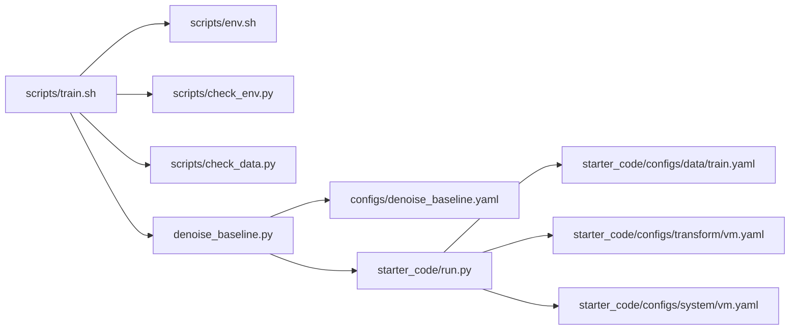

# 训练管理

<cite>
**本文引用的文件**
- [scripts/train.sh](file://scripts/train.sh)
- [scripts/env.sh](file://scripts/env.sh)
- [scripts/check_env.py](file://scripts/check_env.py)
- [scripts/check_data.py](file://scripts/check_data.py)
- [denoise_baseline.py](file://denoise_baseline.py)
- [starter_code/run.py](file://starter_code/run.py)
- [configs/denoise_baseline.yaml](file://configs/denoise_baseline.yaml)
- [configs/denoise_hybrid_safe_strong.yaml](file://configs/denoise_hybrid_safe_strong.yaml)
- [starter_code/configs/data/train.yaml](file://starter_code/configs/data/train.yaml)
- [starter_code/configs/transform/vm.yaml](file://starter_code/configs/transform/vm.yaml)
- [starter_code/configs/system/vm.yaml](file://starter_code/configs/system/vm.yaml)
- [scripts/predict.sh](file://scripts/predict.sh)
- [scripts/smoke/run_train_baseline.sh](file://scripts/smoke/run_train_baseline.sh)
- [scripts/a6000_smoke.sh](file://scripts/a6000_smoke.sh)
</cite>

## 目录
1. [简介](#简介)
2. [项目结构](#项目结构)
3. [核心组件](#核心组件)
4. [架构总览](#架构总览)
5. [详细组件分析](#详细组件分析)
6. [依赖关系分析](#依赖关系分析)
7. [性能与资源监控](#性能与资源监控)
8. [故障排查指南](#故障排查指南)
9. [结论](#结论)
10. [附录](#附录)

## 简介
本指南围绕 Jittor 点云去噪项目的“训练管理”展开，聚焦于训练脚本 train.sh 的工作原理与最佳实践。内容涵盖参数解析、配置加载、环境检查、数据检查、日志记录与运行元信息生成，以及训练流程的阶段划分（环境初始化、数据检查、配置验证、训练执行）。同时提供训练参数设置策略、训练过程监控方法、常见失败原因与解决方案，以及断点续训、模型保存与实验记录规范建议。

## 项目结构
训练管理涉及以下关键文件与职责：
- 脚本层
  - scripts/train.sh：训练入口脚本，负责参数解析、环境初始化、配置与数据检查、运行元信息生成、训练执行与日志落盘。
  - scripts/env.sh：统一导出环境变量（编译器、Jittor 缓存目录、Python 解释器、虚拟环境激活），确保跨机器一致性。
  - scripts/check_env.py：分层环境检查（Python/Numpy、Jittor CPU、Jittor CUDA），输出诊断信息并定位常见问题。
  - scripts/check_data.py：校验数据集布局与样本完整性，支持从配置与 profile 合并路径。
  - scripts/predict.sh：预测与打包的便捷脚本，便于快速产出提交结果。
  - scripts/smoke/run_train_baseline.sh：小规模训练示例，展示命令行参数覆盖方式。
  - scripts/a6000_smoke.sh：A6000 机器上的端到端冒烟检查脚本，串联环境、数据与训练前检查。
- 应用层
  - denoise_baseline.py：训练主程序，实现数据集、模型、损失、优化器、训练循环与日志记录。
  - starter_code/run.py：通用任务入口，支持 train/predict/debug/validate 模式，加载配置并构建系统组件。
- 配置层
  - configs/denoise_baseline.yaml：基础训练配置（实验名、随机种子、路径、训练超参、模型超参、预测超参）。
  - configs/denoise_hybrid_safe_strong.yaml：混合安全/强健策略配置示例。
  - starter_code/configs/data/train.yaml：数据加载配置（训练/验证集批大小、采样、增强等）。
  - starter_code/configs/transform/vm.yaml：训练/验证/预测阶段的点云变换配置。
  - starter_code/configs/system/vm.yaml：系统组件目标与检查点保存位置。

**图示来源**
- [scripts/train.sh:1-44](file://scripts/train.sh#L1-L44)
- [scripts/env.sh:1-48](file://scripts/env.sh#L1-L48)
- [scripts/check_env.py:1-197](file://scripts/check_env.py#L1-L197)
- [scripts/check_data.py:1-103](file://scripts/check_data.py#L1-L103)
- [denoise_baseline.py:1-800](file://denoise_baseline.py#L1-L800)
- [starter_code/run.py:1-140](file://starter_code/run.py#L1-L140)

**章节来源**
- [scripts/train.sh:1-44](file://scripts/train.sh#L1-L44)
- [scripts/env.sh:1-48](file://scripts/env.sh#L1-L48)
- [scripts/check_env.py:1-197](file://scripts/check_env.py#L1-L197)
- [scripts/check_data.py:1-103](file://scripts/check_data.py#L1-L103)
- [denoise_baseline.py:1-800](file://denoise_baseline.py#L1-L800)
- [starter_code/run.py:1-140](file://starter_code/run.py#L1-L140)

## 核心组件
- 训练入口脚本 train.sh
  - 参数解析：支持传入配置文件与可选 profile；将剩余参数透传给训练程序。
  - 环境初始化：切换到仓库根目录，加载 scripts/env.sh 设置环境变量与 Python 解释器。
  - 运行元信息：从配置读取 experiment.name 生成 RUN_ID，创建 experiments/runs/RUN_ID 目录，复制配置与 profile 到运行目录。
  - 环境检查：调用 scripts/check_env.py 输出环境信息，失败即终止。
  - 数据检查：调用 scripts/check_data.py 校验路径与样本，限制检查数量，失败即终止。
  - 训练执行：将配置、profile、--mode train 与用户参数拼接后执行 denoise_baseline.py，并将输出重定向到 run_dir/train.log。
  - 结果输出：复制最终配置为 config.final.yaml，并打印运行目录路径。
- 环境检查脚本 check_env.py
  - 分层检查：Python/Numpy 工具链 → Jittor CPU → Jittor CUDA（CuPy 可见性与设备数）。
  - 输出诊断：打印 Python 版本、平台、编译器、CUDA 可见设备、nvidia-smi 查询结果等。
  - 错误提示：针对 Jittor 未安装、缓存不可写、CUDA 不可用等场景给出修复建议。
- 数据检查脚本 check_data.py
  - 路径合并：从配置与 profile 合并 paths.* 字段，支持 --data-root/--test-root/--train-list 覆盖。
  - 存在性校验：data_root/test_root/train_list 必须存在。
  - 样本采样检查：对训练列表中的样本进行采样，检查 .obj 是否存在；对测试目录下的 .npy 进行采样读取并打印形状与类型。
- 训练主程序 denoise_baseline.py
  - 数据集：ObjDenoiseDataset 在线合成干净/噪声点云，支持限制样本数量与归一化。
  - 模型：ResidualDenoiser 主干编码器复用官方 FeatureExtraction，头部与门控/裁剪/几何分支可开关组合。
  - 训练循环：支持日志周期、保存周期、Chamfer 与点级损失组合、GPU/CPU 使用信息采集。
  - 日志与摘要：记录运行摘要至 experiments/*/last_run_summary.txt，包含关键超参与路径。
- 通用任务入口 starter_code/run.py
  - 支持模式：train/predict/debug/validate，加载 task/data/transform/model/system 组件，构建系统并执行对应流程。
- 配置文件
  - configs/denoise_baseline.yaml：定义实验名、随机种子、路径、训练步数、批次大小、学习率、噪声范围、日志与保存周期、模型超参、预测参数。
  - configs/denoise_hybrid_safe_strong.yaml：演示混合安全/强健策略与自适应裁剪等高级特性。
  - starter_code/configs/data/train.yaml：训练/验证集批大小、采样、增强与数据路径配置。
  - starter_code/configs/transform/vm.yaml：训练/验证/预测阶段的采样、归一化、加噪、旋转缩放、补丁切分等变换。
  - starter_code/configs/system/vm.yaml：系统组件目标与检查点保存目录/名称。

**章节来源**
- [scripts/train.sh:1-44](file://scripts/train.sh#L1-L44)
- [scripts/check_env.py:166-197](file://scripts/check_env.py#L166-L197)
- [scripts/check_data.py:45-103](file://scripts/check_data.py#L45-L103)
- [denoise_baseline.py:90-147](file://denoise_baseline.py#L90-L147)
- [denoise_baseline.py:480-733](file://denoise_baseline.py#L480-L733)
- [starter_code/run.py:36-140](file://starter_code/run.py#L36-L140)
- [configs/denoise_baseline.yaml:1-44](file://configs/denoise_baseline.yaml#L1-L44)
- [configs/denoise_hybrid_safe_strong.yaml:1-53](file://configs/denoise_hybrid_safe_strong.yaml#L1-L53)
- [starter_code/configs/data/train.yaml:1-34](file://starter_code/configs/data/train.yaml#L1-L34)
- [starter_code/configs/transform/vm.yaml:1-43](file://starter_code/configs/transform/vm.yaml#L1-L43)
- [starter_code/configs/system/vm.yaml:1-4](file://starter_code/configs/system/vm.yaml#L1-L4)

## 架构总览
下图展示了从 shell 脚本到训练主程序的调用链与数据流。

**图示来源**
- [scripts/train.sh:10-44](file://scripts/train.sh#L10-L44)
- [scripts/check_env.py:166-197](file://scripts/check_env.py#L166-L197)
- [scripts/check_data.py:45-103](file://scripts/check_data.py#L45-L103)
- [denoise_baseline.py:741-800](file://denoise_baseline.py#L741-L800)

## 详细组件分析

### 训练脚本 train.sh 的工作原理
- 参数解析与透传
  - 第一个参数作为配置文件路径，第二个参数作为可选 profile；其余参数原样透传给训练程序。
  - 若传入 PROFILE，则将其合并到配置中再进行数据检查与训练。
- 环境初始化
  - 切换到仓库根目录，加载 scripts/env.sh，统一导出 CC/CXX、禁用 Jittor 多进程编译、设置 JITTOR_HOME、选择合适的 Python 解释器。
- 运行元信息生成
  - 从配置读取 experiment.name 生成 RUN_ID，创建 experiments/runs/RUN_ID 目录。
  - 复制配置与 profile 到运行目录，生成 meta.txt 记录配置、运行目录、Python 路径、完整命令、时间戳及 git 状态。
- 环境与数据检查
  - 调用 scripts/check_env.py 输出环境信息，失败则打印日志并退出。
  - 调用 scripts/check_data.py 校验路径与样本，失败则打印日志并退出。
- 训练执行与日志
  - 将配置、profile、--mode train 与用户参数拼接后执行 denoise_baseline.py，并将输出重定向到 run_dir/train.log。
  - 训练结束后复制最终配置为 config.final.yaml，并打印运行目录路径。

**图示来源**
- [scripts/train.sh:3-44](file://scripts/train.sh#L3-L44)

**章节来源**
- [scripts/train.sh:1-44](file://scripts/train.sh#L1-L44)

### 环境检查脚本 check_env.py 的设计与策略
- 分层检查策略
  - Python/Numpy 工具链：确保项目依赖可用，避免因 CUDA/Jittor 编译失败导致误判。
  - Jittor CPU：最小化张量运算进行烟测，确认基本功能。
  - Jittor CUDA：先用 CuPy 检测运行时与可见设备，再导入 Jittor 并进行 CUDA 模式烟测。
- 诊断输出
  - 打印 Python 版本、可执行路径、平台、编译器、CUDA 可见设备、nvidia-smi 查询结果等。
- 错误处理
  - 针对 Jittor 未安装、缓存不可写、CUDA 不可见等场景给出明确修复建议，失败由调用层接管。

**图示来源**
- [scripts/check_env.py:166-197](file://scripts/check_env.py#L166-L197)

**章节来源**
- [scripts/check_env.py:1-197](file://scripts/check_env.py#L1-L197)

### 数据检查脚本 check_data.py 的数据流与校验逻辑
- 配置与 Profile 合并
  - 从配置与多个 profile 递归深合并 paths.* 字段，支持命令行覆盖 data_root/test_root/train_list。
- 路径存在性校验
  - data_root/test_root/train_list 必须存在，否则抛出 FileNotFoundError。
- 样本采样检查
  - 读取训练列表，对前 N 个样本进行采样，检查 .obj 是否存在；对测试目录下 .npy 进行采样读取并打印形状与类型。
- 错误处理
  - 发现缺失样本或无 .npy 文件时抛出异常，阻止训练启动。

**图示来源**
- [scripts/check_data.py:30-103](file://scripts/check_data.py#L30-L103)

**章节来源**
- [scripts/check_data.py:1-103](file://scripts/check_data.py#L1-L103)

### 训练主程序 denoise_baseline.py 的训练流程与监控
- 数据集与采样
  - ObjDenoiseDataset 在线合成干净/噪声点云，支持限制样本数量与归一化，保证训练多样性。
- 模型与损失
  - ResidualDenoiser 主干编码器复用官方 FeatureExtraction，头部与门控/裁剪/几何分支可开关组合，便于 A/B 实验。
  - 支持 Chamfer 与点级损失组合，便于稳定收敛与细节恢复。
- 训练循环与日志
  - 支持 log_every 与 save_every 控制日志与检查点保存频率。
  - 记录 GPU 利用率与内存使用、CPU 使用与资源消耗，便于性能分析。
- 运行摘要
  - 写入 experiments/*/last_run_summary.txt，包含实验名、配置、路径、关键超参与训练参数，便于复现实验。

**图示来源**
- [denoise_baseline.py:90-147](file://denoise_baseline.py#L90-L147)
- [denoise_baseline.py:175-227](file://denoise_baseline.py#L175-L227)
- [denoise_baseline.py:229-257](file://denoise_baseline.py#L229-L257)
- [denoise_baseline.py:741-800](file://denoise_baseline.py#L741-L800)

**章节来源**
- [denoise_baseline.py:1-800](file://denoise_baseline.py#L1-L800)

### 通用任务入口 starter_code/run.py 的模式分发
- 模式支持：train/predict/debug/validate，分别调用系统组件执行对应流程。
- 组件装配：根据 task/components 加载 data/transform/model/system 配置，构建数据模块与系统实例。
- 断点续训：支持从指定检查点加载模型权重，继续训练或预测。

**图示来源**
- [starter_code/run.py:36-140](file://starter_code/run.py#L36-L140)

**章节来源**
- [starter_code/run.py:1-140](file://starter_code/run.py#L1-L140)

## 依赖关系分析
- 脚本依赖
  - train.sh 依赖 env.sh 提供统一环境变量；依赖 check_env.py 与 check_data.py 进行环境与数据前置检查；最终调用 denoise_baseline.py 执行训练。
- 配置依赖
  - denoise_baseline.py 依赖 configs/denoise_baseline.yaml 与 starter_code 配置（data/transform/system）共同决定训练行为。
- 组件耦合
  - starter_code/run.py 作为通用入口，解耦了具体任务与系统实现，便于扩展不同模式与组件组合。

**图示来源**
- [scripts/train.sh:10-44](file://scripts/train.sh#L10-L44)
- [denoise_baseline.py:1-800](file://denoise_baseline.py#L1-L800)
- [starter_code/run.py:1-140](file://starter_code/run.py#L1-L140)

**章节来源**
- [scripts/train.sh:1-44](file://scripts/train.sh#L1-L44)
- [denoise_baseline.py:1-800](file://denoise_baseline.py#L1-L800)
- [starter_code/run.py:1-140](file://starter_code/run.py#L1-L140)

## 性能与资源监控
- GPU 内存与利用率
  - 训练过程中通过 nvidia-smi 查询 GPU 利用率与显存占用，结合日志输出进行趋势分析。
- CPU 使用与资源消耗
  - 通过 ps 与 resource 模块统计 CPU 百分比、内存与进程资源使用，辅助定位资源瓶颈。
- 训练进度跟踪
  - 通过 log_every 控制日志输出频率，结合 save_every 控制检查点保存频率，形成稳定的进度指标。
- 资源优化建议
  - 合理设置 batch_size 与 num_points，在显存允许范围内最大化吞吐。
  - 使用 BatchPrefetcher 减少主线程等待，平衡数据准备与计算线程压力。

**章节来源**
- [denoise_baseline.py:229-257](file://denoise_baseline.py#L229-L257)

## 故障排查指南
- 环境相关
  - Jittor 未安装或版本不匹配：参考 scripts/check_env.py 的提示，确保在正确环境中安装并激活依赖。
  - CUDA 不可见或驱动问题：确认 nvidia-smi 可用，检查 CUDA_VISIBLE_DEVICES 与 CuPy 匹配的 wheel。
  - Jittor 缓存不可写：确保 JITTOR_HOME 或 .jittor_home 指向可写目录。
- 数据相关
  - data_root/test_root/train_list 不存在：检查路径配置与文件是否存在，必要时使用 --data-root/--test-root/--train-list 覆盖。
  - 训练样本缺失：检查训练列表中的 .obj 是否存在，或修正数据组织结构。
  - 测试 .npy 缺失：确认测试目录结构与文件命名符合预期。
- 训练相关
  - 显存不足：减小 batch_size、num_points 或启用更保守的模型分支。
  - 学习率过高/过低：根据损失曲线调整 lr，观察训练稳定性与收敛速度。
  - 模型分支冲突：关闭不必要的门控/裁剪/几何分支，逐步定位问题来源。
- 快速冒烟检查
  - 使用 scripts/a6000_smoke.sh 或 scripts/smoke/run_train_baseline.sh 进行端到端验证，快速定位问题。

**章节来源**
- [scripts/check_env.py:106-164](file://scripts/check_env.py#L106-L164)
- [scripts/check_data.py:63-95](file://scripts/check_data.py#L63-L95)
- [scripts/a6000_smoke.sh:42-52](file://scripts/a6000_smoke.sh#L42-L52)
- [scripts/smoke/run_train_baseline.sh:13-26](file://scripts/smoke/run_train_baseline.sh#L13-L26)

## 结论
train.sh 将环境初始化、配置与数据检查、训练执行与日志落盘整合为一条可靠的训练流水线。配合 check_env.py 与 check_data.py 的分层检查策略，能够显著降低训练前的不确定性。通过 denoise_baseline.py 的模块化设计与丰富的超参配置，可以灵活开展 A/B 实验与性能优化。建议在正式训练中遵循断点续训、检查点保存与实验记录规范，以提升复现性与可追溯性。

## 附录

### 训练参数设置与调整策略
- 关键超参数
  - 学习率（lr）：从基准值开始，若损失震荡明显可下调；若收敛缓慢可适当上调。
  - 批次大小（batch_size）：在显存允许前提下优先增大，以提升吞吐与稳定性。
  - 训练步数（steps）：结合验证集指标设定上限，防止过拟合。
  - 点数（num_points）：影响计算复杂度与细节保留，需权衡显存与精度。
  - 噪声范围（noise_min/noise_max）：模拟真实噪声分布，避免过拟合单一噪声水平。
- 模型分支
  - PW-SENEL/STAAS/门控/自适应裁剪等可开关模块，建议先关闭再逐步开启，定位有效模块组合。
- 日志与保存
  - log_every 控制日志频率，save_every 控制检查点保存频率，兼顾磁盘空间与断点续训需求。

**章节来源**
- [configs/denoise_baseline.yaml:16-44](file://configs/denoise_baseline.yaml#L16-L44)
- [configs/denoise_hybrid_safe_strong.yaml:13-53](file://configs/denoise_hybrid_safe_strong.yaml#L13-L53)

### 训练流程监控方法
- 损失曲线分析：关注训练损失与验证损失变化，识别过拟合或欠拟合迹象。
- GPU 内存使用：结合 nvidia-smi 输出，动态调整 batch_size 与 num_points。
- 训练进度跟踪：通过日志中的 step/loss/learning_rate 等指标评估收敛状态。
- 实验记录规范：在 experiments/runs/RUN_ID 下保留 config.yaml、meta.txt、train.log 与最后配置，便于复现与对比。

**章节来源**
- [scripts/train.sh:14-43](file://scripts/train.sh#L14-L43)
- [denoise_baseline.py:229-257](file://denoise_baseline.py#L229-L257)

### 断点续训与模型保存策略
- 断点续训
  - 在配置中指定 ckpt 路径，训练程序会自动加载检查点继续训练。
  - 使用 starter_code/run.py 的 --task 与 --seed 参数控制任务与随机种子，确保可复现。
- 模型保存
  - 通过 save_every 控制检查点保存频率，建议在关键里程碑后手动保存额外快照。
- 实验记录
  - 每次运行生成独立 RUN_ID 目录，保留 config.yaml、meta.txt、train.log 与 config.final.yaml，形成完整实验档案。

**章节来源**
- [starter_code/run.py:107-111](file://starter_code/run.py#L107-L111)
- [denoise_baseline.py:753-800](file://denoise_baseline.py#L753-L800)