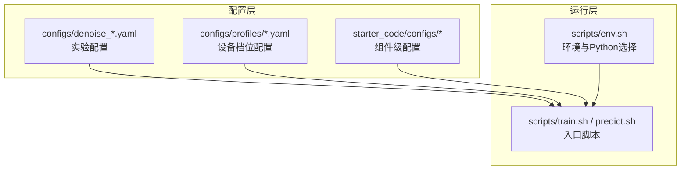
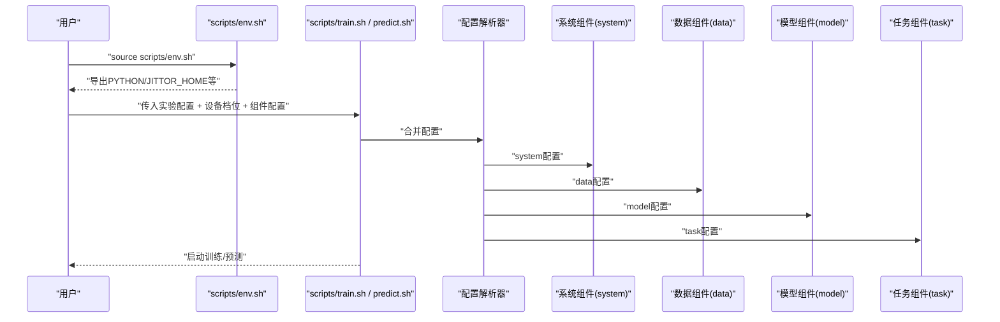
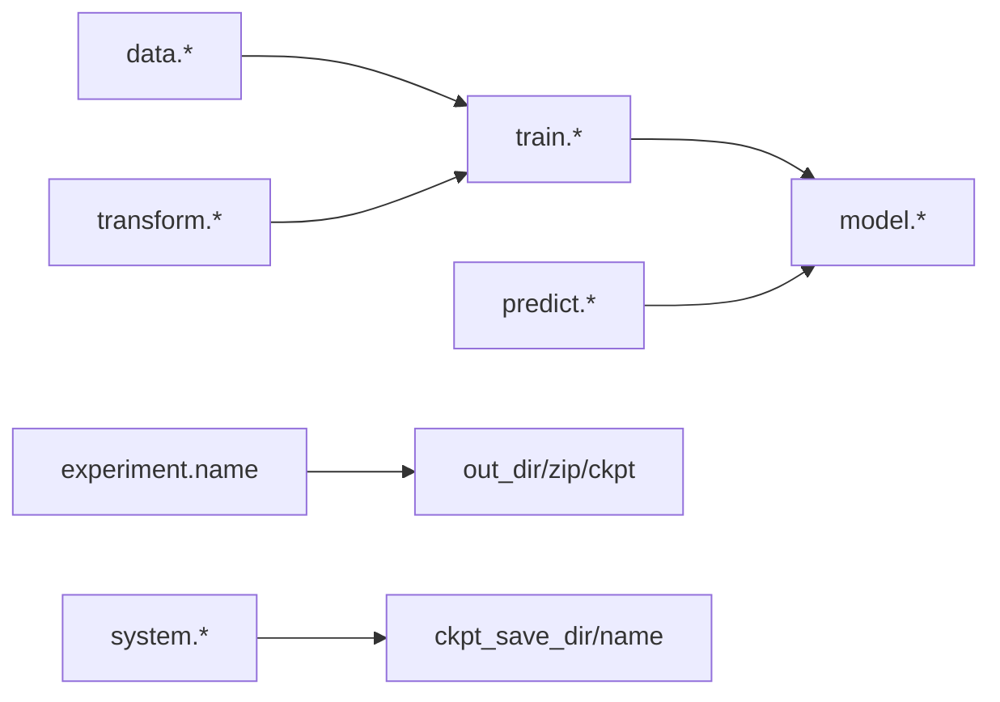

# 配置参数

<cite>
**本文引用的文件**
- [configs/profiles/a6000.yaml](file://configs/profiles/a6000.yaml)
- [configs/profiles/rtx4050.yaml](file://configs/profiles/rtx4050.yaml)
- [configs/profiles/local_dev.yaml](file://configs/profiles/local_dev.yaml)
- [configs/denoise_baseline.yaml](file://configs/denoise_baseline.yaml)
- [configs/denoise_pwsenel.yaml](file://configs/denoise_pwsenel.yaml)
- [configs/denoise_staas_v0.yaml](file://configs/denoise_staas_v0.yaml)
- [starter_code/configs/system/vm.yaml](file://starter_code/configs/system/vm.yaml)
- [starter_code/configs/model/vm.yaml](file://starter_code/configs/model/vm.yaml)
- [starter_code/configs/data/train.yaml](file://starter_code/configs/data/train.yaml)
- [starter_code/configs/data/predict.yaml](file://starter_code/configs/data/predict.yaml)
- [starter_code/configs/data/debug_quick.yaml](file://starter_code/configs/data/debug_quick.yaml)
- [starter_code/configs/task/train_vm.yaml](file://starter_code/configs/task/train_vm.yaml)
- [starter_code/configs/task/predict_vm.yaml](file://starter_code/configs/task/predict_vm.yaml)
- [starter_code/configs/transform/vm.yaml](file://starter_code/configs/transform/vm.yaml)
- [scripts/env.sh](file://scripts/env.sh)
- [docs/GPU_PROFILES.md](file://docs/GPU_PROFILES.md)
</cite>

## 目录
1. [简介](#简介)
2. [项目结构与配置组织](#项目结构与配置组织)
3. [核心配置类别与参数总览](#核心配置类别与参数总览)
4. [架构概览与配置融合流程](#架构概览与配置融合流程)
5. [详细配置项解析](#详细配置项解析)
6. [依赖关系与耦合分析](#依赖关系与耦合分析)
7. [性能与显存优化要点](#性能与显存优化要点)
8. [故障排查与常见错误](#故障排查与常见错误)
9. [配置修改与参数搜索指南](#配置修改与参数搜索指南)
10. [结论](#结论)
11. [附录：任务场景模板与最佳实践](#附录任务场景模板与最佳实践)

## 简介
本手册面向Jittor点云去噪项目的配置使用者与维护者，系统梳理训练配置文件的结构与参数含义，覆盖基础配置、模型配置、数据配置与系统配置四大类，并结合不同GPU配置文件（如a6000.yaml、rtx4050.yaml）给出参数调整建议与迁移策略。同时提供配置验证方法、常见错误排查技巧以及针对不同任务场景的配置模板与最佳实践。

## 项目结构与配置组织
- 配置文件主要分为两类：
  - 任务与实验配置：位于configs/下，如denoise_baseline.yaml、denoise_pwsenel.yaml等，定义实验名称、路径、训练超参、模型开关与预测参数等。
  - 设备与资源档位配置：位于configs/profiles/下，如a6000.yaml、rtx4050.yaml、local_dev.yaml，仅覆盖与硬件能力相关的资源参数（如batch_size、num_points、patch_size、steps、limit），不改动创新模块开关，便于跨设备复现与ablation。
- 启动脚本通过scripts/env.sh统一导出Python执行器与Jittor缓存路径，确保跨设备一致性。

**章节来源**
- [docs/GPU_PROFILES.md:1-122](file://docs/GPU_PROFILES.md#L1-L122)
- [scripts/env.sh:1-48](file://scripts/env.sh#L1-L48)

## 核心配置类别与参数总览
- 实验配置（experiment）
  - name：实验名称，用于区分不同配置与结果。
  - seed：随机种子，确保可复现实验。
- 路径配置（paths）
  - data_root/test_root：训练/测试数据根目录。
  - train_list：训练集文件列表路径。
  - out_dir/zip/ckpt：输出目录、打包名与检查点保存路径。
- 训练配置（train）
  - steps/limit：训练步数与数据加载限制。
  - num_points/batch_size：每批次采样点数与批大小。
  - lr/noise_min/noise_max：学习率与噪声强度范围。
  - cd_weight：Chamfer损失权重（若启用）。
  - log_every/save_every：日志与检查点保存频率。
  - 其他：cache_clean、prefetch_workers、prefetch_queue_size、profile_times、profile_system_every（见a6000档位）。
- 模型配置（model）
  - k/feat_dim/hidden：图卷积邻接数与特征维度。
  - pwsenel/pwsenel_v2/move_gate/hybrid_safe_strong/staas及其相关参数：噪声消除与边缘感知模块开关及参数。
  - adaptive_clip与自适应阈值系列参数：动态裁剪策略。
- 预测配置（predict）
  - limit/patch_size：预测数据限制与块大小。
- 组件配置（starter_code/configs/*）
  - system：系统组件（如ckpt保存目录与文件名）。
  - model：模型组件（如VelocityModule的KNN、训练点数、特征嵌入维、解码器隐藏维、DSM平滑参数等）。
  - data：数据加载器（train/predict/debug_quick）。
  - task：训练/预测模式与优化器、损失、轮数等。
  - transform：数据增强与patch策略。

**章节来源**
- [configs/denoise_baseline.yaml:1-44](file://configs/denoise_baseline.yaml#L1-L44)
- [configs/denoise_pwsenel.yaml:1-44](file://configs/denoise_pwsenel.yaml#L1-L44)
- [configs/denoise_staas_v0.yaml:1-44](file://configs/denoise_staas_v0.yaml#L1-L44)
- [configs/profiles/a6000.yaml:1-29](file://configs/profiles/a6000.yaml#L1-L29)
- [configs/profiles/rtx4050.yaml:1-20](file://configs/profiles/rtx4050.yaml#L1-L20)
- [configs/profiles/local_dev.yaml:1-19](file://configs/profiles/local_dev.yaml#L1-L19)
- [starter_code/configs/system/vm.yaml:1-4](file://starter_code/configs/system/vm.yaml#L1-L4)
- [starter_code/configs/model/vm.yaml:1-6](file://starter_code/configs/model/vm.yaml#L1-L6)
- [starter_code/configs/data/train.yaml:1-34](file://starter_code/configs/data/train.yaml#L1-L34)
- [starter_code/configs/data/predict.yaml:1-15](file://starter_code/configs/data/predict.yaml#L1-L15)
- [starter_code/configs/data/debug_quick.yaml:1-19](file://starter_code/configs/data/debug_quick.yaml#L1-L19)
- [starter_code/configs/task/train_vm.yaml:1-18](file://starter_code/configs/task/train_vm.yaml#L1-L18)
- [starter_code/configs/task/predict_vm.yaml:1-14](file://starter_code/configs/task/predict_vm.yaml#L1-L14)
- [starter_code/configs/transform/vm.yaml:1-43](file://starter_code/configs/transform/vm.yaml#L1-L43)

## 架构概览与配置融合流程
配置融合遵循“实验配置 + 设备档位配置 + 组件配置”的组合方式，最终由训练脚本解析并驱动训练/预测流程。

**图表来源**
- [scripts/env.sh:1-48](file://scripts/env.sh#L1-L48)
- [starter_code/configs/system/vm.yaml:1-4](file://starter_code/configs/system/vm.yaml#L1-L4)
- [starter_code/configs/data/train.yaml:1-34](file://starter_code/configs/data/train.yaml#L1-L34)
- [starter_code/configs/model/vm.yaml:1-6](file://starter_code/configs/model/vm.yaml#L1-L6)
- [starter_code/configs/task/train_vm.yaml:1-18](file://starter_code/configs/task/train_vm.yaml#L1-L18)

## 详细配置项解析

### 基础配置（experiment）
- name：实验标识，便于区分不同配置与结果。
- seed：固定随机种子，确保可复现。

**章节来源**
- [configs/denoise_baseline.yaml:4-7](file://configs/denoise_baseline.yaml#L4-L7)
- [configs/denoise_pwsenel.yaml:5-8](file://configs/denoise_pwsenel.yaml#L5-L8)
- [configs/denoise_staas_v0.yaml:5-8](file://configs/denoise_staas_v0.yaml#L5-L8)

### 路径配置（paths）
- data_root/test_root：训练/测试数据根目录。
- train_list：训练集文件列表路径。
- out_dir/zip/ckpt：输出目录、打包名与检查点保存路径。

**章节来源**
- [configs/denoise_baseline.yaml:8-14](file://configs/denoise_baseline.yaml#L8-L14)
- [configs/denoise_pwsenel.yaml:9-15](file://configs/denoise_pwsenel.yaml#L9-L15)
- [configs/denoise_staas_v0.yaml:9-15](file://configs/denoise_staas_v0.yaml#L9-L15)

### 训练配置（train）
- steps/limit：训练步数与数据加载限制。
- num_points/batch_size：每批次采样点数与批大小。
- lr/noise_min/noise_max：学习率与噪声强度范围。
- cd_weight：Chamfer损失权重（若启用）。
- log_every/save_every：日志与检查点保存频率。
- cache_clean/prefetch_workers/prefetch_queue_size/profile_times/profile_system_every：A6000档位特有的输入管线诊断与性能剖析参数。

**章节来源**
- [configs/denoise_baseline.yaml:16-28](file://configs/denoise_baseline.yaml#L16-L28)
- [configs/denoise_pwsenel.yaml:17-28](file://configs/denoise_pwsenel.yaml#L17-L28)
- [configs/denoise_staas_v0.yaml:17-28](file://configs/denoise_staas_v0.yaml#L17-L28)
- [configs/profiles/a6000.yaml:6-20](file://configs/profiles/a6000.yaml#L6-L20)
- [configs/profiles/rtx4050.yaml:5-11](file://configs/profiles/rtx4050.yaml#L5-L11)
- [configs/profiles/local_dev.yaml:4-10](file://configs/profiles/local_dev.yaml#L4-L10)

### 模型配置（model）
- k/feat_dim/hidden：图卷积邻接数与特征维度。
- pwsenel/pwsenel_v2/move_gate/hybrid_safe_strong/staas及其相关参数：噪声消除与边缘感知模块开关及参数。
- adaptive_clip与自适应阈值系列参数：动态裁剪策略。

**章节来源**
- [configs/denoise_baseline.yaml:30-40](file://configs/denoise_baseline.yaml#L30-L40)
- [configs/denoise_pwsenel.yaml:30-40](file://configs/denoise_pwsenel.yaml#L30-L40)
- [configs/denoise_staas_v0.yaml:30-40](file://configs/denoise_staas_v0.yaml#L30-L40)
- [configs/denoise_hybrid_safe_strong.yaml:25-49](file://configs/denoise_hybrid_safe_strong.yaml#L25-L49)

### 预测配置（predict）
- limit/patch_size：预测数据限制与块大小。

**章节来源**
- [configs/denoise_baseline.yaml:41-44](file://configs/denoise_baseline.yaml#L41-L44)
- [configs/denoise_pwsenel.yaml:41-44](file://configs/denoise_pwsenel.yaml#L41-L44)
- [configs/denoise_staas_v0.yaml:41-44](file://configs/denoise_staas_v0.yaml#L41-L44)
- [configs/profiles/a6000.yaml:27-29](file://configs/profiles/a6000.yaml#L27-L29)
- [configs/profiles/rtx4050.yaml:18-20](file://configs/profiles/rtx4050.yaml#L18-L20)
- [configs/profiles/local_dev.yaml:17-19](file://configs/profiles/local_dev.yaml#L17-L19)

### 系统配置（system）
- ckpt_save_dir/ckpt_save_name：检查点保存目录与文件名前缀。

**章节来源**
- [starter_code/configs/system/vm.yaml:1-4](file://starter_code/configs/system/vm.yaml#L1-L4)

### 模型组件配置（model）
- frame_knn/num_train_points/feat_embedding_dim/decoder_hidden_dim/dsm_sigma：VelocityModule相关参数。

**章节来源**
- [starter_code/configs/model/vm.yaml:1-6](file://starter_code/configs/model/vm.yaml#L1-L6)

### 数据配置（data）
- train_dataset/validate_dataset/predict_dataset：分别定义训练/验证/预测的数据加载行为，包括shuffle、batch_size、num_workers、datapath等。
- debug_quick：快速调试用的小数据集配置。

**章节来源**
- [starter_code/configs/data/train.yaml:4-34](file://starter_code/configs/data/train.yaml#L4-L34)
- [starter_code/configs/data/predict.yaml:1-15](file://starter_code/configs/data/predict.yaml#L1-L15)
- [starter_code/configs/data/debug_quick.yaml:1-19](file://starter_code/configs/data/debug_quick.yaml#L1-L19)

### 任务配置（task）
- mode/debug：训练/预测模式与调试开关。
- components：data/transform/system/model的组件选择。
- loss/optimizer/trainer：损失函数、优化器与训练轮数等。

**章节来源**
- [starter_code/configs/task/train_vm.yaml:1-18](file://starter_code/configs/task/train_vm.yaml#L1-L18)
- [starter_code/configs/task/predict_vm.yaml:1-14](file://starter_code/configs/task/predict_vm.yaml#L1-L14)

### 数据变换配置（transform）
- train_transform/validate_transform/predict_transform：定义采样、归一化、加噪、线性变换与patch策略等。

**章节来源**
- [starter_code/configs/transform/vm.yaml:1-43](file://starter_code/configs/transform/vm.yaml#L1-L43)

## 依赖关系与耦合分析
- 配置耦合点
  - train.num_points与model.k/feat_dim/hidden共同决定计算与显存压力。
  - train.batch_size与train.num_points共同影响内存占用。
  - predict.patch_size影响推理吞吐与显存峰值。
  - experiment.name与paths.out_dir/zip/ckpt共同决定结果组织与提交打包。
- 组件耦合
  - task.components将data/transform/system/model串联，任一组件缺失或不匹配会导致运行失败。
  - transform中的patch策略与predict.patch_size需一致，否则推理行为不一致。

**图表来源**
- [configs/denoise_baseline.yaml:16-44](file://configs/denoise_baseline.yaml#L16-L44)
- [starter_code/configs/data/train.yaml:4-34](file://starter_code/configs/data/train.yaml#L4-L34)
- [starter_code/configs/transform/vm.yaml:1-43](file://starter_code/configs/transform/vm.yaml#L1-L43)
- [starter_code/configs/system/vm.yaml:1-4](file://starter_code/configs/system/vm.yaml#L1-L4)

## 性能与显存优化要点
- 显存调参优先级（来自档位文档）
  1) train.batch_size
  2) train.num_points
  3) model.k
  4) model.feat_dim
  5) predict.patch_size
- A6000档位特有参数
  - cache_clean：清理OBJ缓存，减少重复加载开销。
  - prefetch_workers/prefetch_queue_size：提升数据预取并发与队列容量。
  - profile_times/profile_system_every：开启系统性能剖析，定位输入管线瓶颈。
- 迁移与复现原则
  - 先单卡复现，再考虑多卡并行。
  - 不在profile中改动创新模块开关，避免ablation混淆。

**章节来源**
- [docs/GPU_PROFILES.md:111-122](file://docs/GPU_PROFILES.md#L111-L122)
- [configs/profiles/a6000.yaml:13-20](file://configs/profiles/a6000.yaml#L13-L20)

## 故障排查与常见错误
- 环境与Python选择
  - 使用scripts/env.sh统一导出PYTHON，避免系统python3/python差异导致的兼容性问题。
- 显存不足（OOM）
  - 优先降低train.batch_size或train.num_points；其次考虑减小model.k或model.feat_dim；最后考虑降低predict.patch_size。
- 输入管线瓶颈
  - 在A6000上启用cache_clean、prefetch_workers与profile_times，结合profile_system_every定位瓶颈。
- 组件未就绪
  - 确认task.components中的data/transform/system/model均指向有效配置文件。
- 检查点路径
  - system.ckpt_save_dir与paths.ckpt需一致，避免推理加载失败。

**章节来源**
- [scripts/env.sh:33-47](file://scripts/env.sh#L33-L47)
- [docs/GPU_PROFILES.md:111-122](file://docs/GPU_PROFILES.md#L111-L122)
- [starter_code/configs/system/vm.yaml:3-4](file://starter_code/configs/system/vm.yaml#L3-L4)

## 配置修改与参数搜索指南
- 新增配置项
  - 在对应配置文件中添加键值对；若涉及新组件，需在task.components中注册。
  - 若为设备相关参数，优先放入configs/profiles/*.yaml，避免污染实验配置。
- 参数搜索策略
  - 固定seed，先在local_dev.yaml上进行小规模搜索，再逐步放大至rtx4050.yaml/a6000.yaml。
  - 采用网格/对角搜索：每次只变一个变量，记录steps、loss、PSNR/CD等指标。
- 学习率与正则化
  - lr通常从基准配置的数值开始微调；若出现震荡，可适当降低或加入warmup。
  - 正则化可通过模型内部开关与adaptive_clip阈值实现软约束。
- 数据增强
  - 在transform中调整噪声强度、缩放与旋转概率，观察对收敛稳定性的影响。
- 分布式与并行
  - 先单卡复现，再逐步引入分布式训练；避免在初始阶段引入复杂并行。

**章节来源**
- [docs/GPU_PROFILES.md:5-12](file://docs/GPU_PROFILES.md#L5-L12)
- [configs/denoise_baseline.yaml:21-26](file://configs/denoise_baseline.yaml#L21-L26)
- [starter_code/configs/transform/vm.yaml:9-19](file://starter_code/configs/transform/vm.yaml#L9-L19)

## 结论
通过将实验配置、设备档位配置与组件配置清晰分离，本项目实现了跨设备的可复现训练与灵活的参数搜索。遵循显存调参优先级、单卡复现优先与不在profile中改动创新模块的原则，可在不同硬件条件下高效完成从baseline到最终ablation的全流程。

## 附录：任务场景模板与最佳实践
- 基线训练（baseline）
  - 使用configs/denoise_baseline.yaml与对应设备档位配置（如a6000.yaml/rtx4050.yaml/local_dev.yaml）组合。
  - 关注steps、limit、num_points、batch_size与lr的平衡。
- 模块消融（pwsenel/staas）
  - 在对应denoise_*.yaml中开启相应模块开关，保持其他超参一致以便对比。
- 快速调试（debug）
  - 使用starter_code/configs/data/debug_quick.yaml与较小num_points/batch_size，缩短迭代周期。
- 推理与提交
  - 使用predict任务配置，确保predict.patch_size与训练patch策略一致；检查system.ckpt_save_dir与paths.ckpt路径正确。

**章节来源**
- [configs/denoise_baseline.yaml:1-44](file://configs/denoise_baseline.yaml#L1-L44)
- [configs/denoise_pwsenel.yaml:1-44](file://configs/denoise_pwsenel.yaml#L1-L44)
- [configs/denoise_staas_v0.yaml:1-44](file://configs/denoise_staas_v0.yaml#L1-L44)
- [starter_code/configs/data/debug_quick.yaml:1-19](file://starter_code/configs/data/debug_quick.yaml#L1-L19)
- [starter_code/configs/task/predict_vm.yaml:1-14](file://starter_code/configs/task/predict_vm.yaml#L1-L14)