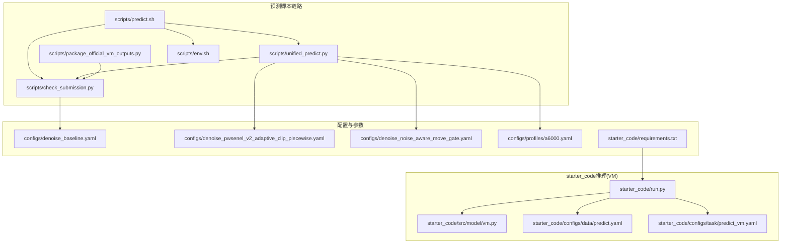
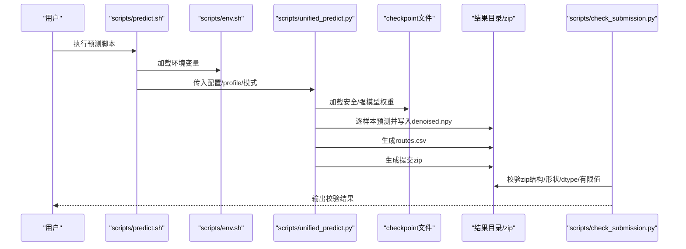
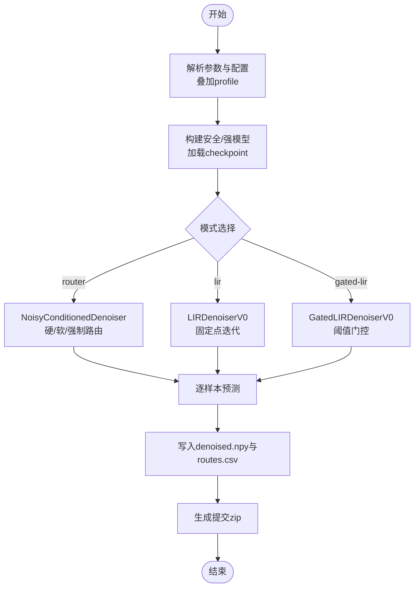
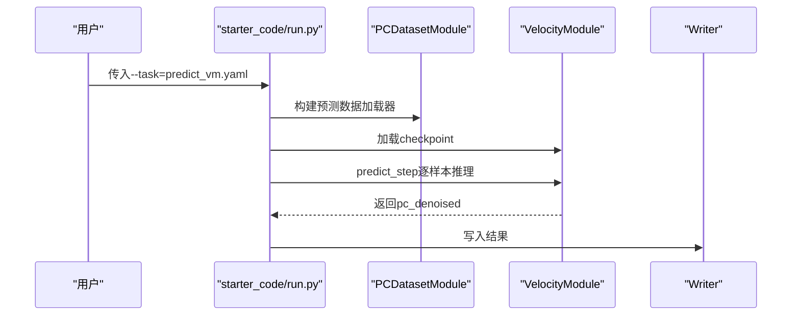
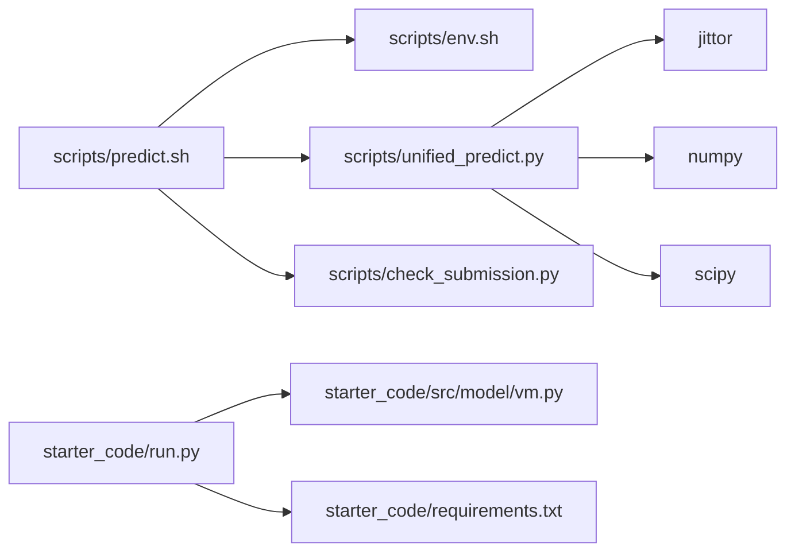

# 预测执行

<cite>
**本文引用的文件**
- [scripts/predict.sh](file://scripts/predict.sh)
- [scripts/unified_predict.py](file://scripts/unified_predict.py)
- [scripts/check_submission.py](file://scripts/check_submission.py)
- [scripts/package_official_vm_outputs.py](file://scripts/package_official_vm_outputs.py)
- [scripts/env.sh](file://scripts/env.sh)
- [starter_code/run.py](file://starter_code/run.py)
- [starter_code/src/model/vm.py](file://starter_code/src/model/vm.py)
- [starter_code/configs/data/predict.yaml](file://starter_code/configs/data/predict.yaml)
- [starter_code/configs/task/predict_vm.yaml](file://starter_code/configs/task/predict_vm.yaml)
- [configs/denoise_baseline.yaml](file://configs/denoise_baseline.yaml)
- [configs/denoise_pwsenel_v2_adaptive_clip_piecewise.yaml](file://configs/denoise_pwsenel_v2_adaptive_clip_piecewise.yaml)
- [configs/denoise_noise_aware_move_gate.yaml](file://configs/denoise_noise_aware_move_gate.yaml)
- [configs/profiles/a6000.yaml](file://configs/profiles/a6000.yaml)
- [starter_code/requirements.txt](file://starter_code/requirements.txt)
</cite>

## 目录
1. [简介](#简介)
2. [项目结构](#项目结构)
3. [核心组件](#核心组件)
4. [架构总览](#架构总览)
5. [详细组件分析](#详细组件分析)
6. [依赖分析](#依赖分析)
7. [性能考虑](#性能考虑)
8. [故障排除指南](#故障排除指南)
9. [结论](#结论)
10. [附录](#附录)

## 简介
本指南面向Jittor点云去噪项目的预测执行，系统讲解预测脚本与统一推理入口的工作流程，涵盖checkpoint加载、数据预处理、模型推理、路由/迭代增强策略、结果后处理与提交校验。文档同时给出参数配置方法（如batch size、设备选择、输出格式）、单样本与批处理差异、预测结果格式与质量评估指标说明，并提供正式提交前的验证步骤与常见问题解决方案。

## 项目结构
- 预测脚本链路
  - shell入口：scripts/predict.sh
  - 统一推理入口：scripts/unified_predict.py
  - 提交校验：scripts/check_submission.py
  - VM官方输出打包：scripts/package_official_vm_outputs.py
  - 环境准备：scripts/env.sh
- 基于starter_code的推理（VM）
  - 入口：starter_code/run.py
  - 模型实现：starter_code/src/model/vm.py
  - 数据配置：starter_code/configs/data/predict.yaml
  - 任务配置：starter_code/configs/task/predict_vm.yaml
- 配置与参数
  - 基线配置：configs/denoise_baseline.yaml
  - 安全候选配置：configs/denoise_pwsenel_v2_adaptive_clip_piecewise.yaml
  - 强模型候选配置：configs/denoise_noise_aware_move_gate.yaml
  - GPU配置档：configs/profiles/a6000.yaml
  - 依赖：starter_code/requirements.txt

**图表来源**
- [scripts/predict.sh:1-13](file://scripts/predict.sh#L1-L13)
- [scripts/unified_predict.py:412-606](file://scripts/unified_predict.py#L412-L606)
- [scripts/check_submission.py:158-192](file://scripts/check_submission.py#L158-L192)
- [scripts/package_official_vm_outputs.py:52-117](file://scripts/package_official_vm_outputs.py#L52-L117)
- [starter_code/run.py:1-140](file://starter_code/run.py#L1-L140)
- [starter_code/src/model/vm.py:1-415](file://starter_code/src/model/vm.py#L1-L415)
- [starter_code/configs/data/predict.yaml:1-15](file://starter_code/configs/data/predict.yaml#L1-L15)
- [starter_code/configs/task/predict_vm.yaml:1-14](file://starter_code/configs/task/predict_vm.yaml#L1-L14)
- [configs/denoise_baseline.yaml:1-44](file://configs/denoise_baseline.yaml#L1-L44)
- [configs/denoise_pwsenel_v2_adaptive_clip_piecewise.yaml:1-54](file://configs/denoise_pwsenel_v2_adaptive_clip_piecewise.yaml#L1-L54)
- [configs/denoise_noise_aware_move_gate.yaml:1-47](file://configs/denoise_noise_aware_move_gate.yaml#L1-L47)
- [configs/profiles/a6000.yaml:1-29](file://configs/profiles/a6000.yaml#L1-L29)
- [starter_code/requirements.txt:1-5](file://starter_code/requirements.txt#L1-L5)

**章节来源**
- [scripts/predict.sh:1-13](file://scripts/predict.sh#L1-L13)
- [scripts/unified_predict.py:412-606](file://scripts/unified_predict.py#L412-L606)
- [scripts/check_submission.py:158-192](file://scripts/check_submission.py#L158-L192)
- [scripts/package_official_vm_outputs.py:52-117](file://scripts/package_official_vm_outputs.py#L52-L117)
- [starter_code/run.py:1-140](file://starter_code/run.py#L1-L140)
- [starter_code/src/model/vm.py:1-415](file://starter_code/src/model/vm.py#L1-L415)
- [starter_code/configs/data/predict.yaml:1-15](file://starter_code/configs/data/predict.yaml#L1-L15)
- [starter_code/configs/task/predict_vm.yaml:1-14](file://starter_code/configs/task/predict_vm.yaml#L1-L14)
- [configs/denoise_baseline.yaml:1-44](file://configs/denoise_baseline.yaml#L1-L44)
- [configs/denoise_pwsenel_v2_adaptive_clip_piecewise.yaml:1-54](file://configs/denoise_pwsenel_v2_adaptive_clip_piecewise.yaml#L1-L54)
- [configs/denoise_noise_aware_move_gate.yaml:1-47](file://configs/denoise_noise_aware_move_gate.yaml#L1-L47)
- [configs/profiles/a6000.yaml:1-29](file://configs/profiles/a6000.yaml#L1-L29)
- [starter_code/requirements.txt:1-5](file://starter_code/requirements.txt#L1-L5)

## 核心组件
- Shell预测脚本链路
  - scripts/predict.sh：依次执行“预测”“打包zip”“提交校验”，自动注入环境变量并定位Python。
- 统一推理入口
  - scripts/unified_predict.py：支持安全/强模型双路由、迭代轻精炼（LIR）、带门控的Gated-LIR，按样本逐条写入结果与路由日志，支持profile覆盖配置，支持CPU/GPU切换。
- 提交校验
  - scripts/check_submission.py：校验zip结构、条目数量、形状、dtype、有限值，并可选与test_root比对条目集合。
- VM官方输出打包
  - scripts/package_official_vm_outputs.py：将starter_code VM输出规范化为官方提交布局。
- 环境准备
  - scripts/env.sh：统一Jittor/编译器/虚拟环境/缓存路径，确保跨机器一致性。
- 基于starter_code的VM推理
  - starter_code/run.py：基于OmegaConf的任务驱动入口，支持train/predict/debug。
  - starter_code/src/model/vm.py：实现VelocityModule的patch-based去噪与流式拼接。
  - starter_code/configs/data/predict.yaml：预测数据集配置（batch_size=1）。
  - starter_code/configs/task/predict_vm.yaml：任务组件与writer配置。

**章节来源**
- [scripts/predict.sh:1-13](file://scripts/predict.sh#L1-L13)
- [scripts/unified_predict.py:412-606](file://scripts/unified_predict.py#L412-L606)
- [scripts/check_submission.py:158-192](file://scripts/check_submission.py#L158-L192)
- [scripts/package_official_vm_outputs.py:52-117](file://scripts/package_official_vm_outputs.py#L52-L117)
- [scripts/env.sh:1-48](file://scripts/env.sh#L1-L48)
- [starter_code/run.py:1-140](file://starter_code/run.py#L1-L140)
- [starter_code/src/model/vm.py:1-415](file://starter_code/src/model/vm.py#L1-L415)
- [starter_code/configs/data/predict.yaml:1-15](file://starter_code/configs/data/predict.yaml#L1-L15)
- [starter_code/configs/task/predict_vm.yaml:1-14](file://starter_code/configs/task/predict_vm.yaml#L1-L14)

## 架构总览
下图展示从shell到统一推理再到提交校验的整体流程，以及VM官方推理的替代路径。

**图表来源**
- [scripts/predict.sh:1-13](file://scripts/predict.sh#L1-L13)
- [scripts/unified_predict.py:412-606](file://scripts/unified_predict.py#L412-L606)
- [scripts/check_submission.py:158-192](file://scripts/check_submission.py#L158-L192)

## 详细组件分析

### 组件A：Shell预测脚本链路（scripts/predict.sh）
- 功能要点
  - 自动定位仓库根目录，加载环境（scripts/env.sh），随后依次调用统一推理入口进行“预测”“打包zip”“提交校验”。
  - 支持通过命令行传入配置与profile，未指定时使用默认基线配置。
- 关键行为
  - 使用PROJECT_ROOT推导工作目录，source env.sh确保Python/Jittor环境一致。
  - 将profile参数透传给统一推理入口，实现配置覆盖。
- 适用场景
  - 快速复现实验、批量提交前的端到端验证。

**章节来源**
- [scripts/predict.sh:1-13](file://scripts/predict.sh#L1-L13)
- [scripts/env.sh:1-48](file://scripts/env.sh#L1-L48)

### 组件B：统一推理入口（scripts/unified_predict.py）
- 功能要点
  - 延迟导入Jittor，避免CLI解析阶段初始化CUDA。
  - 支持三种模式：router（默认）、lir、gated-lir。
  - 支持CPU/GPU切换、多profile叠加配置、路由统计与日志。
  - 逐样本加载noisy.npy，调用模型预测，写入denoised.npy与routes.csv，最后打包zip。
- 关键流程
  - 参数解析与配置加载：支持--profile叠加、--cpu禁用CUDA、--mode选择模式。
  - 模型构建：根据配置字典显式构造模型参数，加载checkpoint并设为eval。
  - 路由/增强策略：
    - router：基于平面残差p75阈值进行硬/软路由或强制路由。
    - lir：对同一checkpoint进行多次固定点迭代，凸组合更新。
    - gated-lir：低噪声走安全单次预测，高噪声走LIR。
  - 结果写入：每样本独立保存denoised.npy，写入routes.csv关键字段。
  - 提交打包：make_zip仅保留官方要求的相对路径结构。
- 关键参数
  - --safe-config/--strong-config：安全/强模型配置路径
  - --safe-ckpt/--strong-ckpt：checkpoint路径
  - --test-root：测试集根目录（含shapenet/<synset>/<model>/noisy.npy）
  - --out-dir：输出根目录
  - --zip：提交zip文件名
  - --patch-size：分块大小
  - --threshold：路由阈值
  - --router-mode：hard/soft/force-safe/force-strong
  - --lir-steps/--lir-alpha：LIR迭代步数与混合系数
  - --cpu：禁用CUDA
  - --no-zip：跳过打包
  - --append-registry：可选追加候选登记
- 输出结构
  - 每个样本：shapenet/<synset>/<model>/denoised.npy
  - 路由日志：routes.csv，包含索引、输入/输出相对路径、点数、平面残差p75、路由信息、门控值、迭代统计、耗时等。

**图表来源**
- [scripts/unified_predict.py:412-606](file://scripts/unified_predict.py#L412-L606)

**章节来源**
- [scripts/unified_predict.py:412-606](file://scripts/unified_predict.py#L412-L606)

### 组件C：提交校验（scripts/check_submission.py）
- 功能要点
  - 校验zip存在性、条目数量、路径结构（shapenet/<synset>/<model>/denoised.npy）、形状（Nx3）、dtype（数值型/可选float32）、有限值。
  - 可选与test_root比对，确保提交条目与隐藏测试一致。
- 关键参数
  - zip路径（CLI或config.paths.zip）
  - --expected-count：期望样本数
  - --expected-shape：期望形状（默认50000,3）
  - --require-float32：强制float32
  - --test-root：可选覆盖test_root
  - --no-test-root-match：跳过test_root匹配
- 适用场景
  - 正式提交前的本地硬门槛校验。

**章节来源**
- [scripts/check_submission.py:158-192](file://scripts/check_submission.py#L158-L192)

### 组件D：VM官方输出打包（scripts/package_official_vm_outputs.py）
- 功能要点
  - 将starter_code VM输出树规范化为官方提交布局，仅保留shapenet/<synset>/<model>/denoised.npy。
  - 支持计数校验与float32校验。
- 适用场景
  - 使用starter_code VM推理后，将其输出转换为官方zip。

**章节来源**
- [scripts/package_official_vm_outputs.py:52-117](file://scripts/package_official_vm_outputs.py#L52-L117)

### 组件E：环境准备（scripts/env.sh）
- 功能要点
  - 统一Jittor/编译器/虚拟环境/缓存路径，确保跨机器一致性。
  - 自动定位PROJECT_ROOT，优先使用本地gcc/g++-10工具链。
- 适用场景
  - 在任何shell中source此脚本，确保后续Python/Jittor命令在一致环境中执行。

**章节来源**
- [scripts/env.sh:1-48](file://scripts/env.sh#L1-L48)

### 组件F：基于starter_code的VM推理（starter_code/run.py + vm.py）
- 功能要点
  - 基于OmegaConf的任务驱动入口，支持train/predict/debug。
  - VelocityModule实现patch-based去噪与两种拼接策略：固定拼接与流式拼接，避免大点云内存峰值。
  - predict数据集配置batch_size=1，逐样本处理。
- 关键流程
  - 解析任务配置，构建数据模块与系统，加载checkpoint。
  - predict阶段逐样本调用模型，输出denoised。
- 适用场景
  - 使用starter_code提供的VM模型进行预测，输出结构与官方writer一致。

**图表来源**
- [starter_code/run.py:1-140](file://starter_code/run.py#L1-L140)
- [starter_code/src/model/vm.py:106-139](file://starter_code/src/model/vm.py#L106-L139)
- [starter_code/configs/data/predict.yaml:1-15](file://starter_code/configs/data/predict.yaml#L1-L15)
- [starter_code/configs/task/predict_vm.yaml:1-14](file://starter_code/configs/task/predict_vm.yaml#L1-L14)

**章节来源**
- [starter_code/run.py:1-140](file://starter_code/run.py#L1-L140)
- [starter_code/src/model/vm.py:106-139](file://starter_code/src/model/vm.py#L106-L139)
- [starter_code/configs/data/predict.yaml:1-15](file://starter_code/configs/data/predict.yaml#L1-L15)
- [starter_code/configs/task/predict_vm.yaml:1-14](file://starter_code/configs/task/predict_vm.yaml#L1-L14)

## 依赖分析
- 组件耦合
  - scripts/predict.sh依赖scripts/env.sh与Python解释器，串联统一推理与提交校验。
  - scripts/unified_predict.py依赖Jittor与模型实现，按配置动态构建模型与路由策略。
  - scripts/check_submission.py独立于推理，仅依赖配置与zip内容。
  - starter_code/run.py与vm.py构成VM专用推理路径，与统一入口互补。
- 外部依赖
  - jittor、numpy、scipy、omegaconf、trimesh等。

**图表来源**
- [scripts/predict.sh:1-13](file://scripts/predict.sh#L1-L13)
- [scripts/unified_predict.py:412-606](file://scripts/unified_predict.py#L412-L606)
- [starter_code/run.py:1-140](file://starter_code/run.py#L1-L140)
- [starter_code/src/model/vm.py:1-415](file://starter_code/src/model/vm.py#L1-L415)
- [starter_code/requirements.txt:1-5](file://starter_code/requirements.txt#L1-L5)

**章节来源**
- [scripts/predict.sh:1-13](file://scripts/predict.sh#L1-L13)
- [scripts/unified_predict.py:412-606](file://scripts/unified_predict.py#L412-L606)
- [starter_code/run.py:1-140](file://starter_code/run.py#L1-L140)
- [starter_code/src/model/vm.py:1-415](file://starter_code/src/model/vm.py#L1-L415)
- [starter_code/requirements.txt:1-5](file://starter_code/requirements.txt#L1-L5)

## 性能考虑
- 设备选择
  - 统一入口支持--cpu禁用CUDA，适合CPU调试或规避显存问题。
  - 环境脚本默认启用CUDA，可通过--cpu切换。
- 分块与拼接
  - 统一入口通过--patch-size控制分块大小，影响显存占用与吞吐。
  - VM实现提供流式拼接策略，在大点云场景避免P×N稠密矩阵内存峰值。
- 并发与I/O
  - 统一入口逐样本写入，便于断点续跑与问题定位。
  - VM数据配置batch_size=1，避免批内不一致带来的内存抖动。
- 配置档
  - A6000配置档将predict.patch_size提升至8192，适合高显存设备。

**章节来源**
- [scripts/unified_predict.py:441-442](file://scripts/unified_predict.py#L441-L442)
- [scripts/env.sh:1-48](file://scripts/env.sh#L1-L48)
- [configs/profiles/a6000.yaml:27-29](file://configs/profiles/a6000.yaml#L27-L29)
- [starter_code/src/model/vm.py:333-415](file://starter_code/src/model/vm.py#L333-L415)
- [starter_code/configs/data/predict.yaml:1-15](file://starter_code/configs/data/predict.yaml#L1-L15)

## 故障排除指南
- 显存不足/内存溢出
  - 降低--patch-size或使用--cpu切换CPU推理。
  - VM路径使用流式拼接策略，减少峰值内存。
- 模型不兼容
  - 确认checkpoint与模型配置一致（统一入口会显式构造模型参数）。
  - 使用--profile叠加配置，确保与训练时一致。
- 提交zip结构错误
  - 确保zip内条目严格为shapenet/<synset>/<model>/denoised.npy。
  - 使用scripts/check_submission.py进行结构/形状/dtype/有限值校验。
- 路由/增强策略异常
  - router模式下检查--threshold与--soft-width；gated-lir检查--threshold与LIR参数。
  - 如需强制路由，使用--router-mode=force-safe/force-strong进行压力测试。
- VM输出打包失败
  - 使用scripts/package_official_vm_outputs.py将输出规范化为官方布局。

**章节来源**
- [scripts/unified_predict.py:441-442](file://scripts/unified_predict.py#L441-L442)
- [scripts/check_submission.py:68-156](file://scripts/check_submission.py#L68-L156)
- [scripts/package_official_vm_outputs.py:52-117](file://scripts/package_official_vm_outputs.py#L52-L117)
- [starter_code/src/model/vm.py:333-415](file://starter_code/src/model/vm.py#L333-L415)

## 结论
本文档系统梳理了Jittor点云去噪项目的预测执行流程，从shell脚本链路到统一推理入口，再到提交校验与VM官方输出打包。通过合理配置参数（如patch_size、router阈值、CPU/GPU选择）与选择合适的路由/增强策略，可在保证稳定性的同时获得高质量的提交结果。建议在正式提交前务必使用check_submission.py进行本地硬门槛校验，并根据实际硬件选择合适的配置档与分块策略。

## 附录
- 预测参数速查
  - --safe-config/--strong-config：安全/强模型配置路径
  - --safe-ckpt/--strong-ckpt：checkpoint路径
  - --test-root：测试集根目录
  - --out-dir：输出根目录
  - --zip：提交zip文件名
  - --patch-size：分块大小
  - --threshold：路由阈值
  - --router-mode：router模式（hard/soft/force-safe/force-strong）
  - --lir-steps/--lir-alpha：LIR迭代步数与混合系数
  - --cpu：禁用CUDA
  - --no-zip：跳过打包
  - --append-registry：追加候选登记
- 输出文件结构
  - 每个样本：shapenet/<synset>/<model>/denoised.npy
  - 路由日志：routes.csv，包含索引、输入/输出相对路径、点数、平面残差p75、路由信息、门控值、迭代统计、耗时等
- 质量评估指标
  - 平面残差p75（plane_res_p75）：用于保守粗指标与路由决策
  - 形状一致性：Nx3
  - 数值稳定性：有限值、可选float32