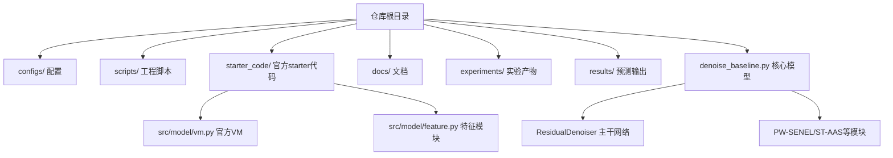
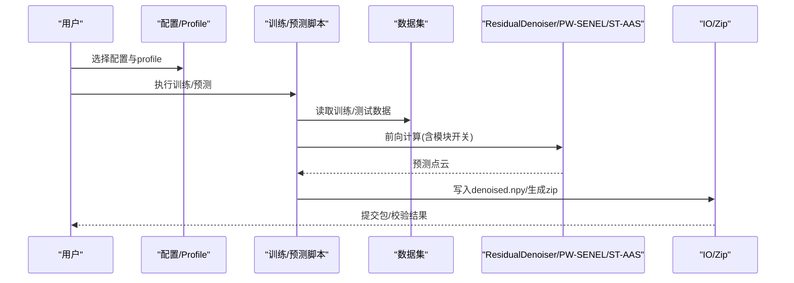
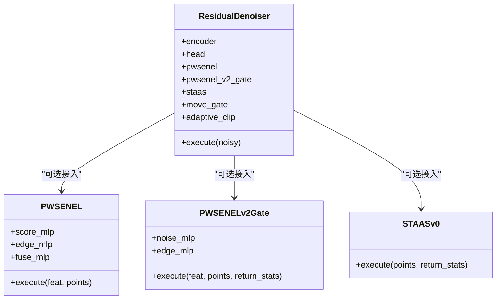
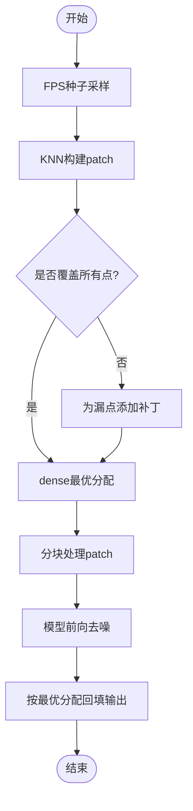
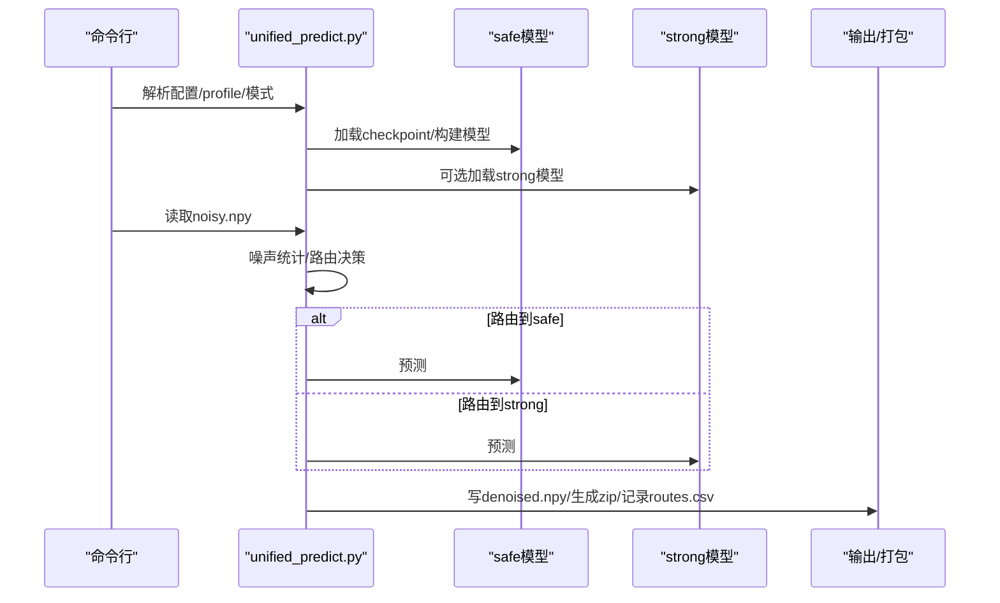
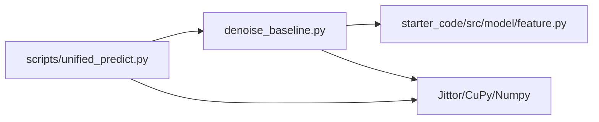

# 项目概述

<cite>
**本文引用的文件**
- [README.md](file://README.md)
- [OPEN_SOURCE.md](file://OPEN_SOURCE.md)
- [CITATION.cff](file://CITATION.cff)
- [requirements.txt](file://requirements.txt)
- [starter_code/README.md](file://starter_code/README.md)
- [denoise_baseline.py](file://denoise_baseline.py)
- [starter_code/src/model/feature.py](file://starter_code/src/model/feature.py)
- [starter_code/src/model/vm.py](file://starter_code/src/model/vm.py)
- [scripts/unified_predict.py](file://scripts/unified_predict.py)
- [configs/denoise_baseline.yaml](file://configs/denoise_baseline.yaml)
- [configs/denoise_pwsenel.yaml](file://configs/denoise_pwsenel.yaml)
- [configs/denoise_pwsenel_v2.yaml](file://configs/denoise_pwsenel_v2.yaml)
- [configs/denoise_pwsenel_v2_adaptive_clip.yaml](file://configs/denoise_pwsenel_v2_adaptive_clip.yaml)
- [configs/denoise_staas_v0.yaml](file://configs/denoise_staas_v0.yaml)
- [configs/denoise_staas_v1_fusion.yaml](file://configs/denoise_staas_v1_fusion.yaml)
- [configs/denoise_staas_v2_gate.yaml](file://configs/denoise_staas_v2_gate.yaml)
- [docs/PROJECT_ARCHITECTURE_CN.md](file://docs/PROJECT_ARCHITECTURE_CN.md)
</cite>

## 目录
1. [简介](#简介)
2. [项目结构](#项目结构)
3. [核心组件](#核心组件)
4. [架构总览](#架构总览)
5. [详细组件分析](#详细组件分析)
6. [依赖关系分析](#依赖关系分析)
7. [性能考量](#性能考量)
8. [故障排查指南](#故障排查指南)
9. [结论](#结论)
10. [附录](#附录)

## 简介
本项目是面向 Jittor 点云去噪竞赛的形式化实现，目标是在不改变官方 starter_code 的前提下，构建可复现的基线与可插拔的研究模块，形成从训练、推理到提交的完整流水线。项目的核心价值在于：
- 以“残差偏移回归”为主线，复用官方几何特征提取模块，确保与官方链路兼容；
- 提出并开源 PW-SENEL 与 ST-AAS 两大创新模块，分别在邻域筛噪与结构张量引导的自适应平滑方面取得轻量、可解释、边缘保持的突破；
- 提供统一候选推理入口与提交校验工具，支持路由策略、迭代精炼与混合强弱分支等工程化能力。

技术特色：
- 模块化设计：PW-SENEL、ST-AAS、门控与自适应裁剪等均以开关形式接入主干网络，便于 A/B 消融与回退；
- 边缘感知：通过 softmax 邻域置信与结构张量不变量描述，抑制噪声同时保留锐利边缘；
- 工程稳健：提供 fixed-stitch 与 streaming stitching 两种拼接策略，保障大点云稳定输出；
- 可复现：严格的配置合并与 profile 覆盖、统一的训练/预测/打包/校验流程。

在 Jittor 框架下的定位：
- 以 Jittor 为训练与推理引擎，兼容 CUDA 与 CuPy，满足竞赛对性能与稳定性要求；
- 与官方 VM baseline 并行，既可作为稳定参考，也可作为工程修复与扩展的基座。

## 项目结构
仓库采用“主线代码 + 官方 starter_code + 研究脚本 + 文档”的分层组织方式，推荐阅读顺序如下：
- 顶层说明与开源要求：README、OPEN_SOURCE、CITATION.cff
- 仓库边界与入口：docs/PROJECT_ARCHITECTURE_CN、configs、scripts
- 核心模型与官方 VM：denoise_baseline.py、starter_code/src/model/*
- 配置与示例：configs/denoise_*.yaml
- 推理与提交：scripts/unified_predict.py、scripts/check_submission.py

图表来源
- [docs/PROJECT_ARCHITECTURE_CN.md:41-56](file://docs/PROJECT_ARCHITECTURE_CN.md#L41-L56)
- [starter_code/src/model/vm.py:18-44](file://starter_code/src/model/vm.py#L18-L44)
- [starter_code/src/model/feature.py:65-139](file://starter_code/src/model/feature.py#L65-L139)
- [denoise_baseline.py:480-732](file://denoise_baseline.py#L480-L732)

章节来源
- [README.md:52-77](file://README.md#L52-L77)
- [docs/PROJECT_ARCHITECTURE_CN.md:25-38](file://docs/PROJECT_ARCHITECTURE_CN.md#L25-L38)

## 核心组件
- 自写基线与主干网络
  - ResidualDenoiser：基于官方 FeatureExtraction 的残差偏移回归主干，支持多研究模块开关接入；
  - PW-SENEL/PW-SENEL v2：邻域筛噪与显式噪声/边缘置信门控；
  - ST-AAS v0/v1/v2：结构张量引导的密度自适应 softmax 平滑与几何融合/门控；
  - 门控与裁剪：move_gate、noise-aware move gate、piecewise adaptive clip 等；
  - 几何拼接：fixed-stitch 与 streaming stitching，保证输入输出点数一一对应。
- 官方 VM baseline
  - VelocityModule：基于 DSM 的速度场估计与拉格朗日迭代去噪；
  - patch-based 推理与 stitching：dense 与 streaming 两种拼接策略。
- 统一候选推理与提交
  - scripts/unified_predict.py：加载 safe/strong 模型、路由策略、LIR/Gated-LIR、写入 denoised.npy、生成 zip、可选登记候选。

章节来源
- [denoise_baseline.py:480-732](file://denoise_baseline.py#L480-L732)
- [starter_code/src/model/vm.py:18-139](file://starter_code/src/model/vm.py#L18-L139)
- [scripts/unified_predict.py:83-119](file://scripts/unified_predict.py#L83-L119)

## 架构总览
整体架构由“配置驱动 + 模块化网络 + 工程化推理”构成，核心数据流如下：

图表来源
- [configs/denoise_baseline.yaml:1-44](file://configs/denoise_baseline.yaml#L1-L44)
- [denoise_baseline.py:741-800](file://denoise_baseline.py#L741-L800)
- [scripts/unified_predict.py:412-602](file://scripts/unified_predict.py#L412-L602)

## 详细组件分析

### PW-SENEL 与 ST-AAS 模块设计理念与技术突破
- PW-SENEL（PeiWei Softmax Edge-aware Noise Elimination and Locking）
  - 设计思想：利用邻域相似性构建 softmax 置信度，抑制可疑噪声响应；同时通过 MaxPool 保留局部几何/边缘线索，二者融合后残差加回到特征中，确保可插拔与安全回退。
  - 技术要点：邻域聚合、score MLP、edge MLP、融合 MLP；与坐标差/特征差共同输入，学习邻域一致性。
- ST-AAS（Structure Tensor-guided Adaptive Softmax）
  - 设计思想：基于局部协方差矩阵的不变量（线性度、面性、散射）估计局部几何形态，结合密度自适应温度进行 softmax 平滑，再以边缘置信抑制不稳定区域的平滑。
  - 技术要点：密度自适应温度、结构张量不变量（无特征分解）、边缘置信与平滑偏移的组合。

图表来源
- [denoise_baseline.py:259-315](file://denoise_baseline.py#L259-L315)
- [denoise_baseline.py:317-375](file://denoise_baseline.py#L317-L375)
- [denoise_baseline.py:377-478](file://denoise_baseline.py#L377-L478)
- [denoise_baseline.py:480-732](file://denoise_baseline.py#L480-L732)

章节来源
- [README.md:31-50](file://README.md#L31-L50)
- [denoise_baseline.py:259-315](file://denoise_baseline.py#L259-L315)
- [denoise_baseline.py:377-478](file://denoise_baseline.py#L377-L478)

### 官方 VM baseline 与拼接策略
- VelocityModule：基于 DSM 的监督损失，通过 encoder-decoder 预测梯度方向，再以欧拉步进进行去噪；
- 固定拼接（fixed-stitch）：修复原实现可能漏点的问题，保证输入输出点数一一对应；
- Streaming 拼接：在大点云场景下避免构造 O(P,N) 的稠密分配矩阵，改为在线维护每个点的最优 patch。

图表来源
- [starter_code/src/model/vm.py:209-302](file://starter_code/src/model/vm.py#L209-L302)
- [starter_code/src/model/vm.py:333-414](file://starter_code/src/model/vm.py#L333-L414)

章节来源
- [starter_code/src/model/vm.py:18-139](file://starter_code/src/model/vm.py#L18-L139)
- [starter_code/README.md:29-46](file://starter_code/README.md#L29-L46)

### 统一候选推理与路由策略
- unified_predict.py 支持：
  - safe/strong 双分支路由（硬阈值/软阈值），或强制分支；
  - LIR/Gated-LIR 轻量迭代精炼；
  - 噪声仅统计的阈值估计（平面残差 p75）；
  - routes.csv 记录与可选候选登记。

图表来源
- [scripts/unified_predict.py:412-602](file://scripts/unified_predict.py#L412-L602)

章节来源
- [scripts/unified_predict.py:83-119](file://scripts/unified_predict.py#L83-L119)
- [scripts/unified_predict.py:309-349](file://scripts/unified_predict.py#L309-L349)

## 依赖关系分析
- 运行时依赖
  - Python 3.10–3.12、Jittor ≥1.3.9、CUDA 环境、CuPy 13.x（与 numpy<2 兼容）；
  - trimesh、PyYAML、scipy、omegaconf、tqdm 等。
- 代码依赖
  - denoise_baseline.py 复用 starter_code/src/model/feature.py 的 FeatureExtraction 与 KNN 工具；
  - 统一推理入口 scripts/unified_predict.py 动态导入 Jittor 与 ResidualDenoiser，避免非必要初始化。

图表来源
- [requirements.txt:1-17](file://requirements.txt#L1-L17)
- [starter_code/src/model/feature.py:1-196](file://starter_code/src/model/feature.py#L1-L196)
- [denoise_baseline.py:53-56](file://denoise_baseline.py#L53-L56)
- [scripts/unified_predict.py:32-43](file://scripts/unified_predict.py#L32-L43)

章节来源
- [requirements.txt:1-17](file://requirements.txt#L1-L17)
- [README.md:108-143](file://README.md#L108-L143)

## 性能考量
- 训练效率
  - 使用 BatchPrefetcher 在后台准备 NumPy batch，减少 Jittor/CUDA 线程竞争；
  - 配置文件支持按 GPU/显存调整 batch size、num_points、steps 等，便于不同机器适配。
- 推理效率
  - 大点云分块推理与 streaming stitching，避免内存峰值；
  - 路由策略与 LIR 轻量迭代，平衡精度与速度。
- 可复现性
  - 配置合并顺序：base config → profile override → CLI 参数，确保可追溯与可控。

章节来源
- [denoise_baseline.py:175-227](file://denoise_baseline.py#L175-L227)
- [docs/PROJECT_ARCHITECTURE_CN.md:123-129](file://docs/PROJECT_ARCHITECTURE_CN.md#L123-L129)

## 故障排查指南
- 环境问题
  - 使用 scripts/check_env.py 分层检查 Python/Jittor/CUDA，避免非必要 CUDA 初始化；
  - 若 CuPy 安装缓慢，可使用镜像源。
- 数据问题
  - 使用 scripts/check_data.py 校验数据路径与样本结构；
  - 确保 dataset_train 与 dataset_test_noisy 为符号链接或外部挂载。
- 提交问题
  - 使用 scripts/check_submission.py 校验 zip 路径、形状、dtype、有限性与 test_root 对齐；
  - 生成 zip 前务必再次校验。
- 候选登记
  - 使用 scripts/candidate_registry.py 记录候选事实来源与结论，避免主观臆断。

章节来源
- [README.md:108-143](file://README.md#L108-L143)
- [README.md:217-248](file://README.md#L217-L248)
- [docs/PROJECT_ARCHITECTURE_CN.md:140-147](file://docs/PROJECT_ARCHITECTURE_CN.md#L140-L147)

## 结论
本项目以 Jittor 为框架，围绕“残差偏移回归 + 可插拔几何模块 + 工程化推理链路”构建了完整的点云去噪流水线。PW-SENEL 与 ST-AAS 在邻域筛噪与结构张量引导的自适应平滑方面提供了轻量、可解释、边缘保持的技术突破；官方 VM baseline 与 fixed-stitch/streaming 拼接策略确保了工程稳健性。通过统一的配置、训练/预测/打包/校验与候选登记流程，项目实现了高可复现性与可追溯性，既适合竞赛提交，也为后续研究扩展提供了清晰边界。

## 附录
- 开源与许可
  - 仓库遵循 Apache License 2.0，PW-SENEL 与 ST-AAS 模块为作者原创贡献，使用团队标识“我是奶龙对不”作为竞赛标识；
  - 建议在再利用或修改时保留署名与引用信息。
- 引用规范
  - CITATION.cff 提供标准引用格式与仓库地址，便于学术与工程引用。

章节来源
- [OPEN_SOURCE.md:107-112](file://OPEN_SOURCE.md#L107-L112)
- [CITATION.cff:1-17](file://CITATION.cff#L1-L17)